# 2026-09-29 arXiv 每日论文订阅摘要

<!-- PAPER_CARDS_START -->
## 论文卡片

按原日报排名展示；点击标题或 Paper 查看原文，详细中文分析见下方。

| 论文 | 论文 | 论文 |
|---|---|---|
| 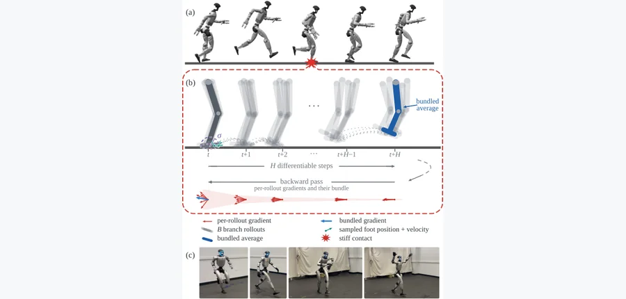 arXiv 2026-09-29 · cs.RO · #1 **[Bundled Contact Gradients: Stabilizing Differentiable Simulation for Deployable Dynamic Tasks](https://arxiv.org/abs/2609.30951)** Dyuman Aditya，Jin Cheng，Clemens Schwarke，Quan Nguyen，Gaurav Sukhatme，Stelian Coros，Gabriele Fadini 机构：University of Southern California / ETH Zurich / Zurich University of Applied Sciences（PDF 首页） [Paper](https://arxiv.org/abs/2609.30951) · [Project](https://bundledcontactgradients.github.io/) · [图源](https://arxiv.org/html/2609.30951v1/main-fig.png) | 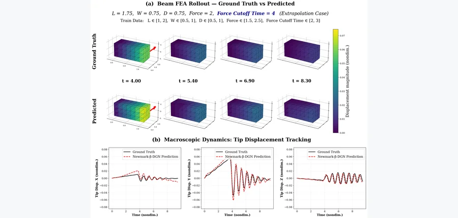 arXiv 2026-09-29 · cs.LG · #2 **[Learning coarse-step dynamics and internal mechanical response with graph networks](https://arxiv.org/abs/2609.30344)** Vinay Sharma，Olga Fink 机构：EPFL（PDF 首页） [Paper](https://arxiv.org/abs/2609.30344) · [图源](https://arxiv.org/html/2609.30344v1/figures/main/beam_fea/beamfea_main1_rollout_tipdisp_Tc0.4.png) | 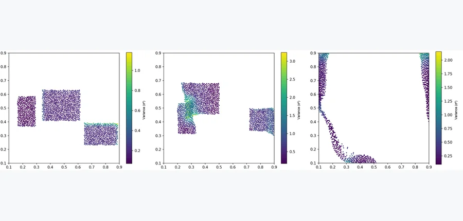 arXiv 2026-09-29 · cs.LG · #3 **[Adaptive Interaction Graphs for Particle Simulation](https://arxiv.org/abs/2609.30822)** Aiden Zhou 机构：Yale University（PDF 首页） [Paper](https://arxiv.org/abs/2609.30822) · [Code](https://github.com/aidenzhou8/AdaptGNS) · [图源](https://arxiv.org/html/2609.30822v1/sigma_traj0_strip_1_10_50.png) |
| 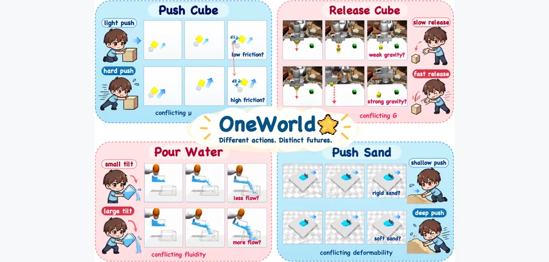 arXiv 2026-09-29 · cs.CV · #4 **[OneWorld: Learning Consistent Physics Across Actions in World Models](https://arxiv.org/abs/2609.30946)** Ke He，Yichen Ding，Bin Yang 机构：Wuhan University（PDF 首页） [Paper](https://arxiv.org/abs/2609.30946) · [图源](https://arxiv.org/html/2609.30946v1/OneWorld_motivation.png) | 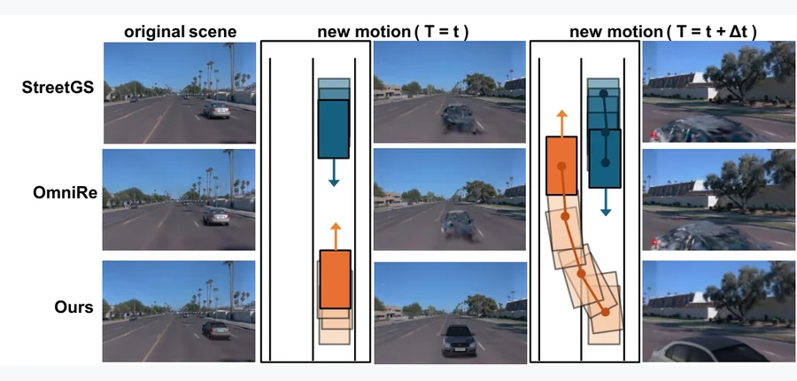 arXiv 2026-09-29 · cs.RO · #5 **[RECAST: From Log Replay to Closed-Loop Driving Simulation with View-Complete Actors](https://arxiv.org/abs/2609.31374)** Zijun Zhao，Liewen Liao，Kang Shen，Songan Zhang，Ming Yang 机构：Shanghai Jiao Tong University（PDF 首页） [Paper](https://arxiv.org/abs/2609.31374) · [Project](https://zijunkr.github.io/RECAST/) · [图源](https://arxiv.org/html/2609.31374v1/motivation.png) | 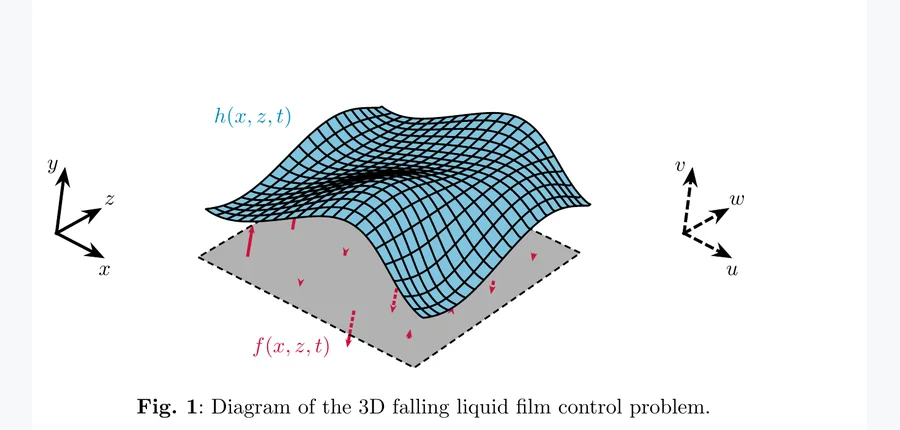 arXiv 2026-09-29 · physics.flu-dyn · #6 **[Controlling three-dimensional falling liquid films: from weighted-residual models to direct numerical simulation](https://arxiv.org/abs/2609.31377)** Oscar A. Holroyd，Susana N. Gomes，Radu Cimpeanu 机构：University of Warwick / Vanellus Technologies（PDF 首页；非 cs 主类 physics.flu-dyn） [Paper](https://arxiv.org/abs/2609.31377) · [图源](https://arxiv.org/pdf/2609.31377) |
| 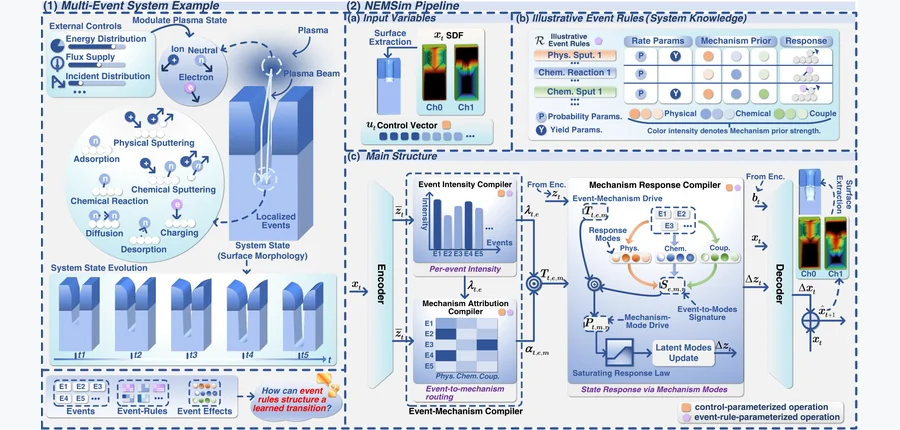 arXiv 2026-09-29 · cs.LG · #7 **[NEMSim: Learning Control-Conditioned Multi-Event Physical Dynamics via Executable Event-Mechanism Priors](https://arxiv.org/abs/2609.30718)** Junsong Yu，Junjie Xie，Pengwei Liu，Dong Ni 机构：Zhejiang University（PDF 首页） [Paper](https://arxiv.org/abs/2609.30718) · [图源](https://arxiv.org/html/2609.30718v1/main_framework.png) | 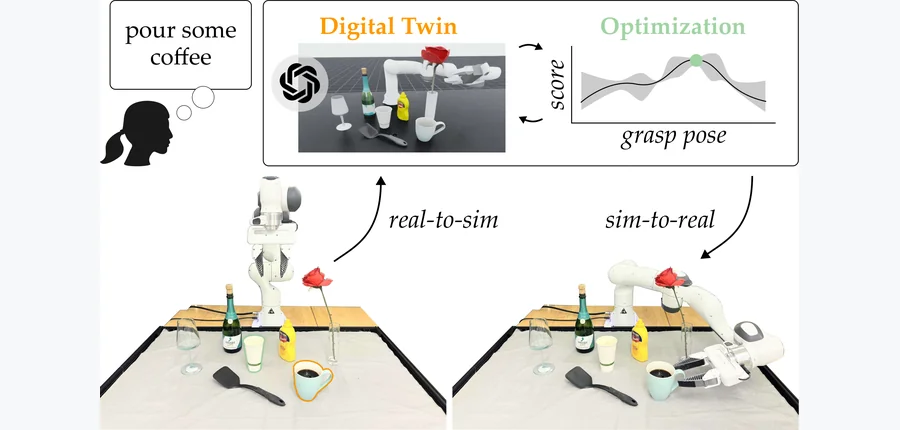 arXiv 2026-09-29 · cs.RO · #8 **[GraspTwin: Zero-Shot Task-Oriented Grasp Optimization via a Digital Twin](https://arxiv.org/abs/2609.30543)** Daniel J. Evans，Yinlong Dai，Simon Stepputtis，Dylan P. Losey 机构：Virginia Tech（PDF 首页） [Paper](https://arxiv.org/abs/2609.30543) · [Code](https://github.com/VT-Collab/GraspTwin/) · [图源](https://arxiv.org/html/2609.30543v1/front.png) | 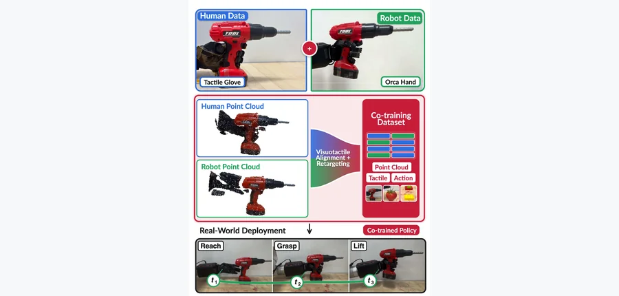 arXiv 2026-09-29 · cs.RO · #9 **[VisTacAlign: Co-Training Dexterous Policies on Tactile Human and Robot Demonstrations](https://arxiv.org/abs/2609.30959)** Julien Poffet，Matthew Strong，Ankush Dhawan，Baiyu Shi，Shalika Neelaveni，Yujia Yuan，Zhenan Bao，Monroe Kennedy III 机构：ETH Zurich / Stanford University（PDF 首页） [Paper](https://arxiv.org/abs/2609.30959) · [Project](https://vis-tac-align.github.io) · [图源](https://arxiv.org/html/2609.30959v1/splash.png) |
| 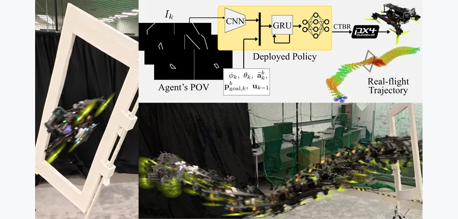 arXiv 2026-09-29 · cs.RO · #10 **[Learning Vision-Based Agile Gap Traversal: Differentiable Simulation with a Warm-Started Critic](https://arxiv.org/abs/2609.30696)** Nuthasith Gerdpratoom，Tianchen Sun，Yichao Gao，Lin Zhao 机构：National University of Singapore（PDF 首页） [Paper](https://arxiv.org/abs/2609.30696) · [图源](https://arxiv.org/html/2609.30696v1/figures/teaser_v7.png) | 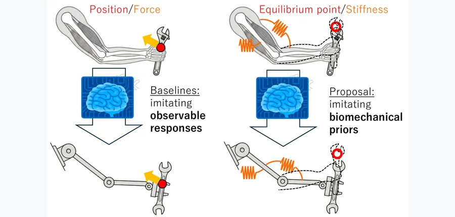 arXiv 2026-09-29 · cs.RO · #11 **[Impedance Cloning: Learning Equilibrium Point Parameters for Contact-Rich Manipulation](https://arxiv.org/abs/2609.30842)** Hayato Takahashi，Ryoga Oishi，Yuki Kasuga，Toshiaki Tsuji 机构：Saitama University（PDF 首页） [Paper](https://arxiv.org/abs/2609.30842) · [图源](https://arxiv.org/html/2609.30842v1/concept.png) | 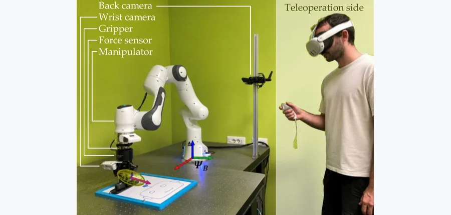 arXiv 2026-09-29 · cs.RO · #12 **[Imp-ACT: Adaptive Impedance Control and Action Chunking with Transformers to Learn Contact-Rich Manipulation from Demonstrations](https://arxiv.org/abs/2609.31225)** Luca Zanetti，Doganay Sirintuna，Idil Ozdamar，Pietro Balatti，Heng Zhang，Arash Ajoudani 机构：Istituto Italiano di Tecnologia / Carnegie Mellon University（PDF 首页） [Paper](https://arxiv.org/abs/2609.31225) · [图源](https://arxiv.org/html/2609.31225v1/images/figure1.jpg) |
| 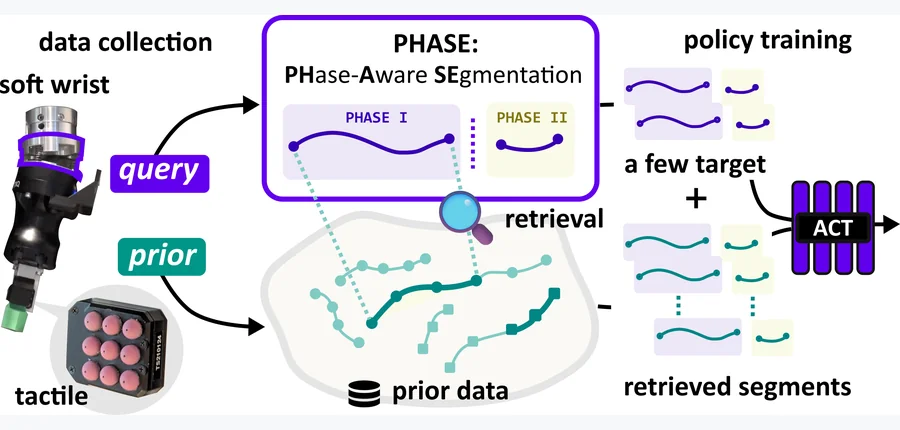 IROS 2026 · #13 **[PHASE: Compliance-Enabled Tactile Phase Retrieval for Few-Shot Insertion Learning](https://arxiv.org/abs/2609.30889)** Jeremy Siburian，Cristian C. Beltran-Hernandez，Tatsuya Matsushima，Yusuke Iwasawa，Masashi Hamaya，Mai Nishimura 机构：OMRON SINIC X / The University of Tokyo（PDF 第 2 页） [Paper](https://arxiv.org/abs/2609.30889) · [图源](https://arxiv.org/html/2609.30889v1/fig/teaser_v3.png) | 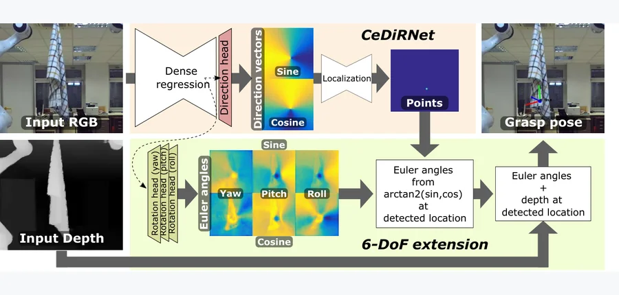 arXiv 2026-09-29 · cs.RO · #14 **[Vision-Based 6-DoF Grasp Pose Estimation for Robot Cloth Unfolding](https://arxiv.org/abs/2609.31452)** Domen Tabernik，Peter Nimac，Jan Jerićević，Danijel Skočaj，Andrej Gams 机构：University of Ljubljana / Jožef Stefan Institute（PDF 首页） [Paper](https://arxiv.org/abs/2609.31452) · [图源](https://arxiv.org/html/2609.31452v1/intro_revision_6DoF_compressed.png) | 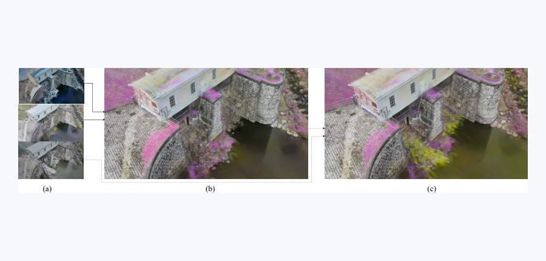 Pacific Graphics 2026 · #15 **[ChronoFuseGS: Multi-Temporal Gaussian Fusion with Per-Splat Persistence and Change Visualization](https://arxiv.org/abs/2609.31339)** Tobias Batik，Diana Marin，Peter Kán，Hannes Kaufmann 机构：TU Wien（PDF 首页） [Paper](https://arxiv.org/abs/2609.31339) · [图源](https://arxiv.org/html/2609.31339v1/teaser_7_vec.png) |
| 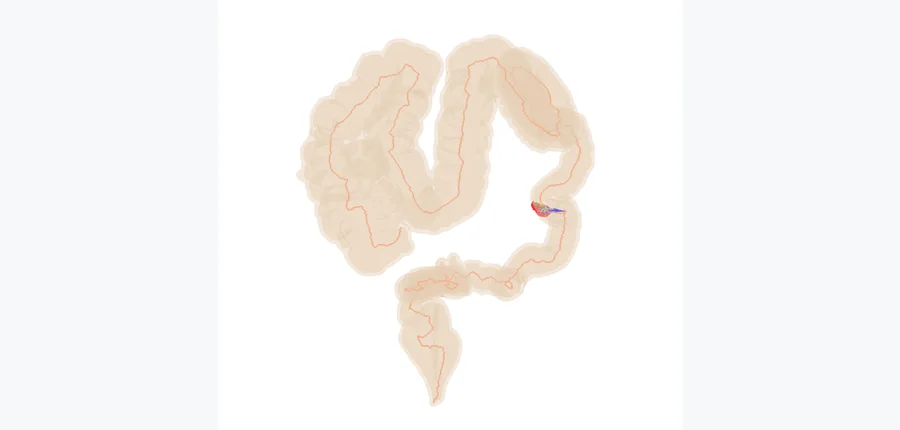 arXiv 2026-09-29 · cs.RO · #16 **[Anatomy-Aware Dexterity-Driven Design Optimization of Surgical Continuum Robots](https://arxiv.org/abs/2609.30745)** Tony Qin，Peter Connor，Khoa Dang，Carter Hatch，Caleb Rucker，Robert J. Webster III，Ron Alterovitz 机构：University of North Carolina at Chapel Hill / Vanderbilt University / University of Tennessee, Knoxville（PDF 首页） [Paper](https://arxiv.org/abs/2609.30745) · [图源](https://arxiv.org/html/2609.30745v1/images/colon_centerline.png) | 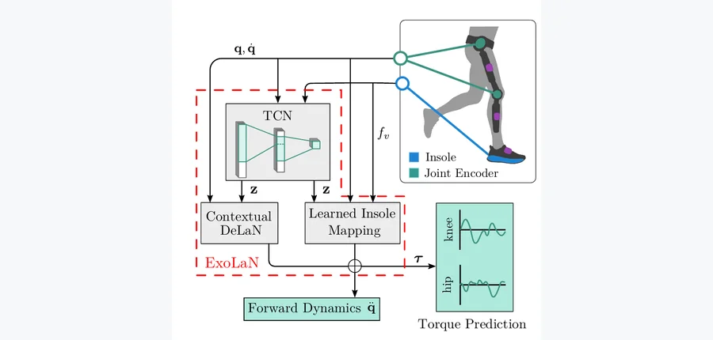 arXiv 2026-09-29 · cs.RO · #17 **[ExoLaN: Physics-Consistent Context-Aware Dynamics Learning for Exoskeletons](https://arxiv.org/abs/2609.31434)** Lucas Schulze，Maximilian Schwarz，Jona Hoppe，Jan Peters，Oleg Arenz 机构：TU Darmstadt / Robotics Institute Germany / Hessian.AI / DFKI（PDF 首页） [Paper](https://arxiv.org/abs/2609.31434) · [图源](https://arxiv.org/pdf/2609.31434) | 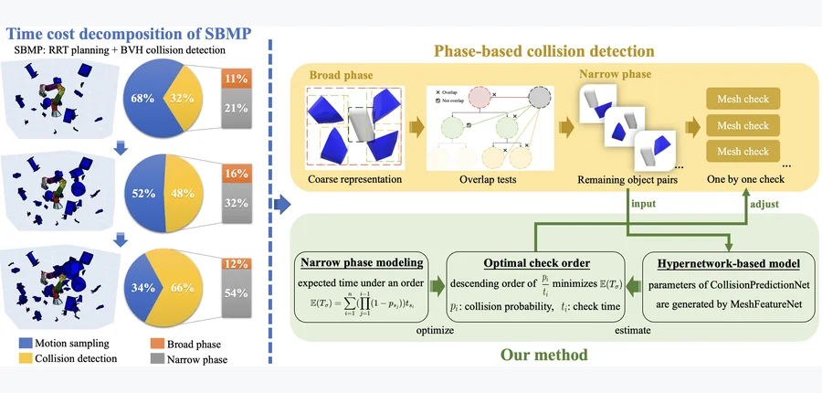 arXiv 2026-09-29 · cs.RO · #18 **[Learning-Accelerated Narrow-Phase Collision Detection via Check Ordering for Sampling-Based Motion Planning](https://arxiv.org/abs/2609.30599)** Hao Jiang，Yinghan Wang，Jianping He，Xiaoming Duan 机构：Shanghai Jiao Tong University（PDF 首页） [Paper](https://arxiv.org/abs/2609.30599) · [图源](https://arxiv.org/html/2609.30599v1/figures/fig1_research_content.png) |
| 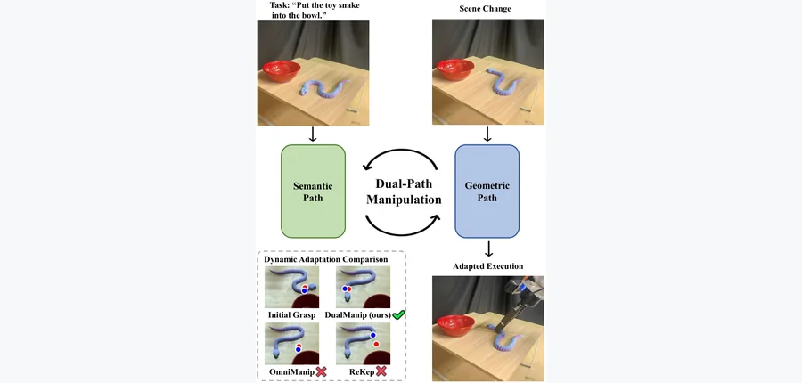 arXiv 2026-09-29 · cs.RO · #19 **[DualManip: Agentic Dynamic Manipulation via Dual-Path Semantic Reasoning and Geometric Adaptation](https://arxiv.org/abs/2609.31112)** Chengxi Li，Yan Di，Yingyue Li，Ruida Zhang，Mingyang Li，Xiangyang Ji 机构：Tsinghua University / Harbin Institute of Technology (Shenzhen) / Beijing Institute of Control Engineering（PDF 首页） [Paper](https://arxiv.org/abs/2609.31112) · [Project](https://lichengxi1.github.io/Dualmanip/) · [图源](https://arxiv.org/html/2609.31112v1/teaser_v2.png) | 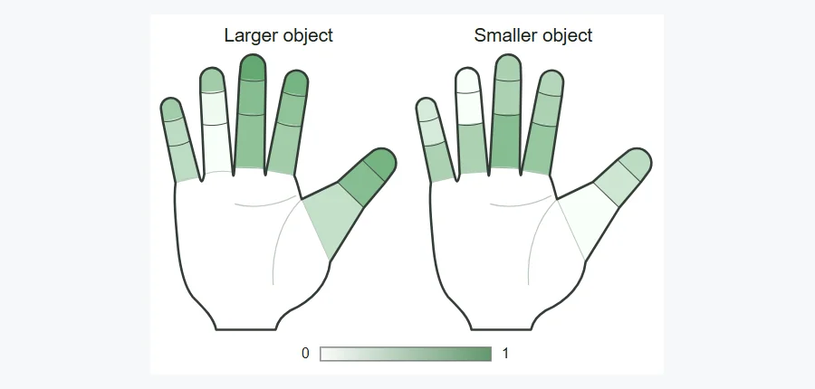 arXiv 2026-09-29 · cs.RO · #20 **[Tactile Sensing Array for Multi-Phalanx Sensing in Humanoid Hands](https://arxiv.org/abs/2609.30506)** Neel Adwani，Muhaiminul Islam Akash，Rituja Bhattacharya，Cong Wang 机构：New Jersey Institute of Technology（PDF 首页） [Paper](https://arxiv.org/abs/2609.30506) · [图源](https://arxiv.org/html/2609.30506v1/figures/heat.png) | 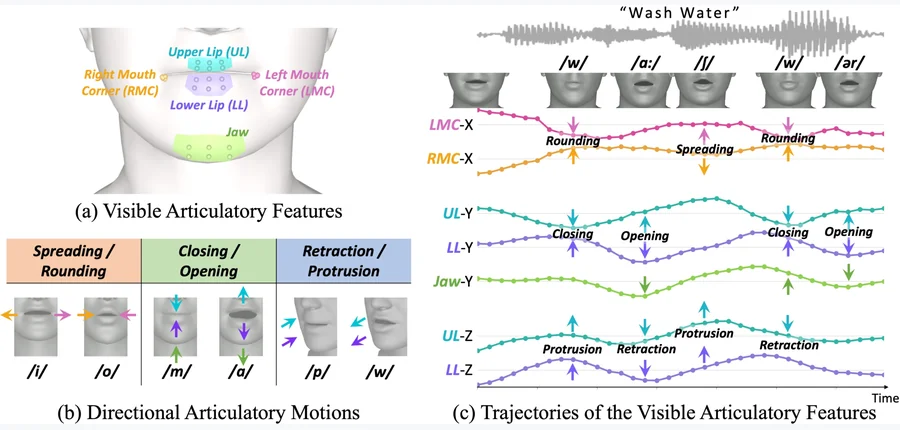 arXiv 2026-09-29 · eess.AS · #21 **[Seeing Speech: Learning Visible Articulatory Dynamics for Speech-Driven 3D Facial Animation](https://arxiv.org/abs/2609.30517)** Hyung Kyu Kim，Byungchan Hwang，Hak Gu Kim 机构：Chung-Ang University（PDF 首页；非 cs 主类 eess.AS） [Paper](https://arxiv.org/abs/2609.30517) · [图源](https://arxiv.org/html/2609.30517v1/fig1-intro-v12-hk.png) |
| 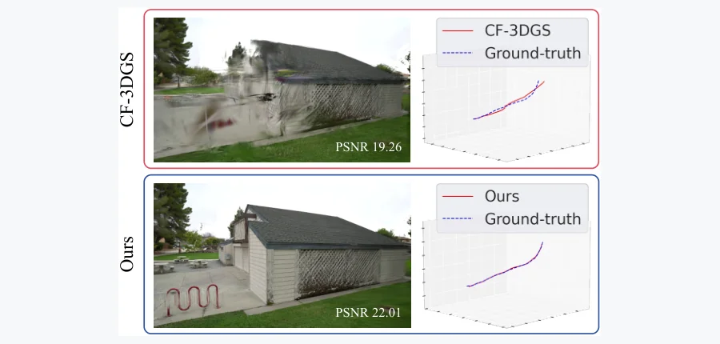 arXiv 2026-09-29 · cs.CV · #22 **[Reliability-Regulated Trajectory Optimization for Progressive COLMAP-Free 3D Gaussian Splatting](https://arxiv.org/abs/2609.30865)** Zijian Wu，Jinliang Wang，Zidian Lin，Ying Song，Ziqian Lu，Hanjie Ma，Zhen Ye，Mingfeng Jiang 机构：Zhejiang Sci-Tech University / Tsinghua University / Lishui University / Zhejiang University / Jiaxing University 等（PDF 首页） [Paper](https://arxiv.org/abs/2609.30865) · [Code](https://github.com/Zijian1026/RRTO-CF3DGS) · [图源](https://arxiv.org/html/2609.30865v1/fig1.png) | 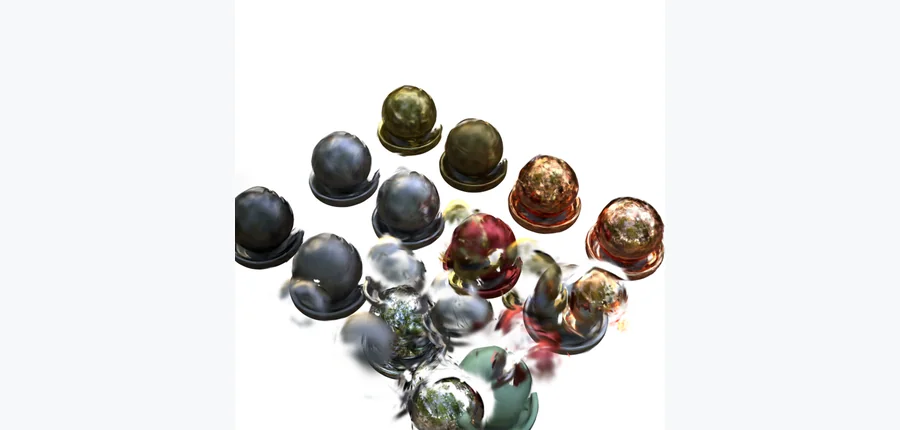 arXiv 2026-09-29 · cs.CV · #23 **[LiTe-GS: Oracle-Efficient Next Best View Selection for 3D Gaussian Splatting](https://arxiv.org/abs/2609.30393)** Vivek Pandey，Amirhossein Mollaei Khass，Nader Motee 机构：affiliation 未确认（PDF 首页未见稳定机构行） [Paper](https://arxiv.org/abs/2609.30393) · [图源](https://arxiv.org/html/2609.30393v1/sec/Figs/materials_random_v11_seq3_11000.png) | 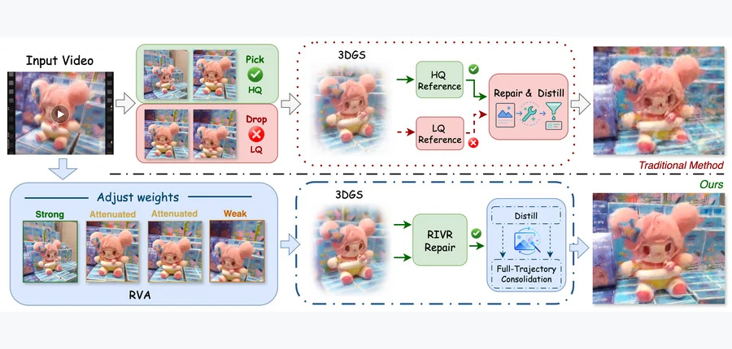 arXiv 2026-09-29 · cs.CV · #24 **[ClearGS: Reliability-Aware Gaussian Splatting from Handheld Videos](https://arxiv.org/abs/2609.31509)** Xuanzhi Liu，Xinyi Wu，Hang Pan，Wensi Huang，Zhenyao Wu，Ruize Han，Song Wang 机构：Shenzhen University of Advanced Technology / HONOR / UNSW / SUSTech（PDF 首页） [Paper](https://arxiv.org/abs/2609.31509) · [图源](https://arxiv.org/html/2609.31509v1/compare.png) |
| 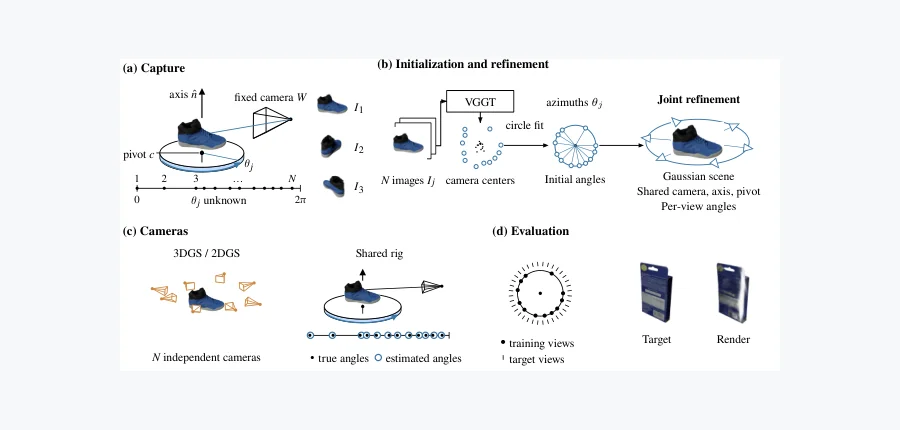 arXiv 2026-09-29 · cs.CV · #25 **[OC-GS: Gaussian Splatting for Irregular Turntable Capture](https://arxiv.org/abs/2609.31572)** Jae Joong Lee，Bedrich Benes 机构：Purdue University（PDF 首页） [Paper](https://arxiv.org/abs/2609.31572) · [图源](https://arxiv.org/html/2609.31572v1/Figure_1.png) | 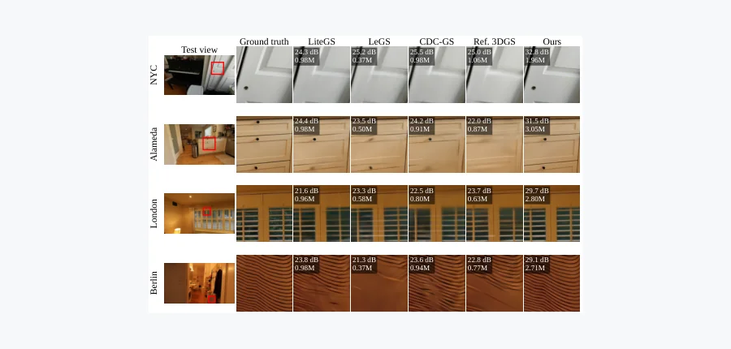 arXiv 2026-09-29 · cs.CV · #26 **[Gauss What You Need: Compact Gaussian Splatting Across Scene Scales](https://arxiv.org/abs/2609.31248)** Afif Boudaoud，Jiayi Liu，Alexandru Calotoiu，Torsten Hoefler 机构：ETH Zurich（PDF 首页） [Paper](https://arxiv.org/abs/2609.31248) · [图源](https://arxiv.org/html/2609.31248v1/fig_selected_qualitative_handheld.png) | 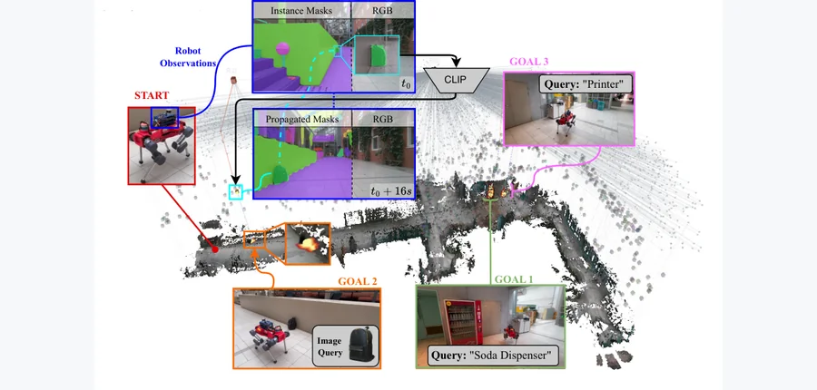 arXiv 2026-09-29 · cs.CV · #27 **[TRACKGRAPH: Online Open-Vocabulary 3D Scene Graphs via Image-Space Tracking](https://arxiv.org/abs/2609.31005)** Peder Borge Hellesylt，Albert Gassol Puigjaner，Kostas Alexis，Annette Stahl 机构：Norwegian University of Science and Technology（PDF 首页） [Paper](https://arxiv.org/abs/2609.31005) · [图源](https://arxiv.org/html/2609.31005v1/intro-fig-final-copy-compact.png) |
| 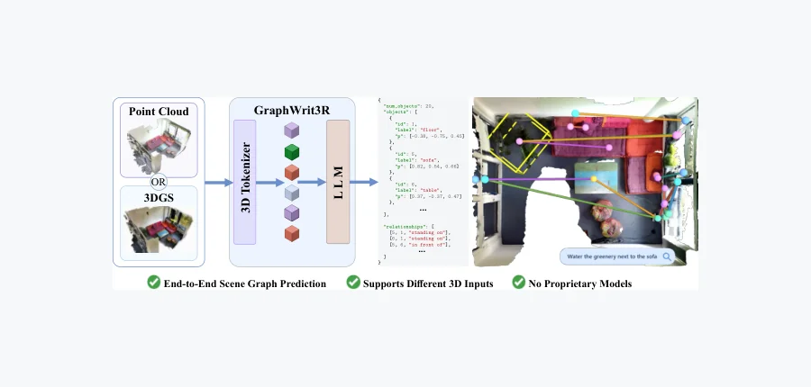 arXiv 2026-09-29 · cs.CV · #28 **[GraphWrit3R: End-to-End 3D Scene Graph Writing](https://arxiv.org/abs/2609.31595)** Luka Milivojevic，Nikola Popovic，Sayan Deb Sarkar，Sebastian Koch，Iro Armeni，Luc Van Gool，Danda Pani Paudel 机构：INSAIT, Sofia University / Stanford University / Ulm University（PDF 首页） [Paper](https://arxiv.org/abs/2609.31595) · [图源](https://arxiv.org/html/2609.31595v1/fig1_teaser.png) | 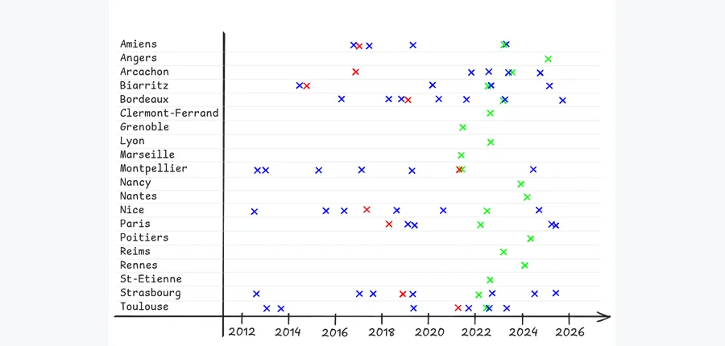 Remote Sensing 2026 · #29 **[Enhancing Photogrammetric Digital Surface Models with Pretrained Diffusion Models and Multimodal Conditioning](https://arxiv.org/abs/2609.31199)** Antoine Lorentz，Stéphane May，Valentine Bellet，Dawa Derksen，Bastien Nespoulous 机构：Thales / CNES（PDF 首页；非 cs 主类 eess.IV） [Paper](https://arxiv.org/abs/2609.31199) · [图源](https://arxiv.org/html/2609.31199v1/figs/data_timeline.png) | 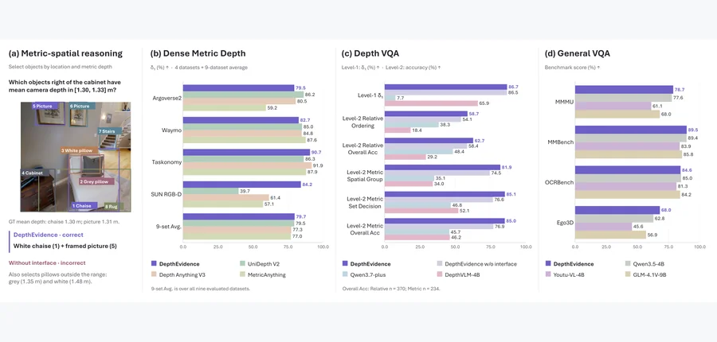 arXiv 2026-09-29 · cs.CV · #30 **[DepthEvidence: Unifying Metric Depth Prediction and Geometric Reasoning in Multimodal Language Models](https://arxiv.org/abs/2609.31103)** Jiangning Wei，Yuan Yao，Miaomiao Cui，Mingsheng Li，Humen Zhong，Shuai Bai，Zhibo Yang 机构：Alibaba Group / Beijing University of Posts and Telecommunications（PDF 首页） [Paper](https://arxiv.org/abs/2609.31103) · [图源](https://arxiv.org/html/2609.31103v1/fig-1-qwen_depth_case_and_capability-v3.png) |
<!-- PAPER_CARDS_END -->

## 检索概况

- 本轮执行时间：2026-09-29T01:10:03Z（北京时间 2026-09-29 09:10:03）。
- 检索时间窗口：2026-09-28T01:00:45Z（上次自动运行）至本轮执行时间；官方最新 listing 批次为 **Monday, 28 September 2026**，与此前已处理的 Friday, 25 September 批次不同。
- 官方入口：[cs/new](https://arxiv.org/list/cs/new?show=2000)、[physics/new](https://arxiv.org/list/physics/new?show=2000)、[cond-mat/new](https://arxiv.org/list/cond-mat/new?show=2000)、[eess/new](https://arxiv.org/list/eess/new?show=2000)、[math/new](https://arxiv.org/list/math/new?show=2000)、[stat.ML/new](https://arxiv.org/list/stat.ML/new?show=2000)。`cs/new` 覆盖 cs.CV、cs.GR、cs.RO、cs.AI、cs.LG 等；补充物理、凝聚态、电子工程、数学与统计。
- 检索同义词与人工筛选对象：3D/4D 几何、重建、Gaussian/mesh/point cloud、动力学、接触/力/碰撞、形变/材料/流体、物理世界模型、仿真、机器人操作与触觉；仅泛化 Agent/VLA 的论文未纳入。
- 六个官方页面原始 listing 合计 **2176 条**：New 1160、Cross 246、Replacement 770。New 按 arXiv ID 去重后 **1122 篇**；按标题和摘要筛入 **30 篇**。这些是跨入口原始计数，Cross/Replacement 不入主榜。
- 事实来源为 arXiv 官方 listing、所列论文摘要与 PDF；相关性、机构强度、局限和改进建议均为本日报推断。机构强度仅按已核实机构在相关研究方向的可见积累粗分，不代表论文质量或实验可信度。

### 官方 listing 计数

| 入口 | 批次日期 | New | Cross | Replacement | 合计 |
|---|---|---:|---:|---:|---:|
| [cs/new](https://arxiv.org/list/cs/new?show=2000) | 2026-09-28 | 664 | 77 | 381 | 1122 |
| [physics/new](https://arxiv.org/list/physics/new?show=2000) | 2026-09-28 | 64 | 29 | 41 | 134 |
| [cond-mat/new](https://arxiv.org/list/cond-mat/new?show=2000) | 2026-09-28 | 89 | 28 | 68 | 185 |
| [eess/new](https://arxiv.org/list/eess/new?show=2000) | 2026-09-28 | 51 | 39 | 40 | 130 |
| [math/new](https://arxiv.org/list/math/new?show=2000) | 2026-09-28 | 277 | 52 | 217 | 546 |
| [stat.ML/new](https://arxiv.org/list/stat.ML/new?show=2000) | 2026-09-28 | 15 | 21 | 23 | 59 |

## Top papers

| 排名 | 标题 | arXiv 链接 | 分类 | 作者 | 机构（事实来源） | 相关性（推断） | 机构强度（推断） | 阅读优先级（推断） |
|---:|---|---|---|---|---|---|---|---|
| 1 | Bundled Contact Gradients: Stabilizing Differentiable Simulation for Deployable Dynamic Tasks | [arXiv:2609.30951](https://arxiv.org/abs/2609.30951) | Robotics (cs.RO) | Dyuman Aditya，Jin Cheng，Clemens Schwarke，Quan Nguyen，Gaurav Sukhatme，Stelian Coros，Gabriele Fadini | University of Southern California / ETH Zurich / Zurich University of Applied Sciences（PDF 首页） | 极高 | 高 | 必读 |
| 2 | Learning coarse-step dynamics and internal mechanical response with graph networks | [arXiv:2609.30344](https://arxiv.org/abs/2609.30344) | Machine Learning (cs.LG) | Vinay Sharma，Olga Fink | EPFL（PDF 首页） | 极高 | 高 | 必读 |
| 3 | Adaptive Interaction Graphs for Particle Simulation | [arXiv:2609.30822](https://arxiv.org/abs/2609.30822) | Machine Learning (cs.LG) ; Computational Engineering, Finance, and Science (cs.CE) | Aiden Zhou | Yale University（PDF 首页） | 极高 | 高 | 必读 |
| 4 | OneWorld: Learning Consistent Physics Across Actions in World Models | [arXiv:2609.30946](https://arxiv.org/abs/2609.30946) | Computer Vision and Pattern Recognition (cs.CV) ; Artificial Intelligence (cs.AI) | Ke He，Yichen Ding，Bin Yang | Wuhan University（PDF 首页） | 极高 | 中高 | 必读 |
| 5 | RECAST: From Log Replay to Closed-Loop Driving Simulation with View-Complete Actors | [arXiv:2609.31374](https://arxiv.org/abs/2609.31374) | Robotics (cs.RO) ; Computer Vision and Pattern Recognition (cs.CV) | Zijun Zhao，Liewen Liao，Kang Shen，Songan Zhang，Ming Yang | Shanghai Jiao Tong University（PDF 首页） | 极高 | 高 | 必读 |
| 6 | Controlling three-dimensional falling liquid films: from weighted-residual models to direct numerical simulation | [arXiv:2609.31377](https://arxiv.org/abs/2609.31377) | **非 cs 主类**：Fluid Dynamics (physics.flu-dyn) ; Optimization and Control (math.OC) | Oscar A. Holroyd，Susana N. Gomes，Radu Cimpeanu | University of Warwick / Vanellus Technologies（PDF 首页；非 cs 主类 physics.flu-dyn） | 极高 | 高 | 高 |
| 7 | NEMSim: Learning Control-Conditioned Multi-Event Physical Dynamics via Executable Event-Mechanism Priors | [arXiv:2609.30718](https://arxiv.org/abs/2609.30718) | Machine Learning (cs.LG) | Junsong Yu，Junjie Xie，Pengwei Liu，Dong Ni | Zhejiang University（PDF 首页） | 极高 | 中高 | 高 |
| 8 | GraspTwin: Zero-Shot Task-Oriented Grasp Optimization via a Digital Twin | [arXiv:2609.30543](https://arxiv.org/abs/2609.30543) | Robotics (cs.RO) | Daniel J. Evans，Yinlong Dai，Simon Stepputtis，Dylan P. Losey | Virginia Tech（PDF 首页） | 极高 | 高 | 高 |
| 9 | VisTacAlign: Co-Training Dexterous Policies on Tactile Human and Robot Demonstrations | [arXiv:2609.30959](https://arxiv.org/abs/2609.30959) | Robotics (cs.RO) | Julien Poffet，Matthew Strong，Ankush Dhawan，Baiyu Shi，Shalika Neelaveni，Yujia Yuan，Zhenan Bao，Monroe Kennedy III | ETH Zurich / Stanford University（PDF 首页） | 极高 | 高 | 高 |
| 10 | Learning Vision-Based Agile Gap Traversal: Differentiable Simulation with a Warm-Started Critic | [arXiv:2609.30696](https://arxiv.org/abs/2609.30696) | Robotics (cs.RO) ; Systems and Control (eess.SY) | Nuthasith Gerdpratoom，Tianchen Sun，Yichao Gao，Lin Zhao | National University of Singapore（PDF 首页） | 高 | 中高 | 高 |
| 11 | Impedance Cloning: Learning Equilibrium Point Parameters for Contact-Rich Manipulation | [arXiv:2609.30842](https://arxiv.org/abs/2609.30842) | Robotics (cs.RO) | Hayato Takahashi，Ryoga Oishi，Yuki Kasuga，Toshiaki Tsuji | Saitama University（PDF 首页） | 高 | 中高 | 高 |
| 12 | Imp-ACT: Adaptive Impedance Control and Action Chunking with Transformers to Learn Contact-Rich Manipulation from Demonstrations | [arXiv:2609.31225](https://arxiv.org/abs/2609.31225) | Robotics (cs.RO) | Luca Zanetti，Doganay Sirintuna，Idil Ozdamar，Pietro Balatti，Heng Zhang，Arash Ajoudani | Istituto Italiano di Tecnologia / Carnegie Mellon University（PDF 首页） | 高 | 高 | 高 |
| 13 | PHASE: Compliance-Enabled Tactile Phase Retrieval for Few-Shot Insertion Learning | [arXiv:2609.30889](https://arxiv.org/abs/2609.30889) | Robotics (cs.RO) | Jeremy Siburian，Cristian C. Beltran-Hernandez，Tatsuya Matsushima，Yusuke Iwasawa，Masashi Hamaya，Mai Nishimura | OMRON SINIC X / The University of Tokyo（PDF 第 2 页） | 高 | 中高 | 高 |
| 14 | Vision-Based 6-DoF Grasp Pose Estimation for Robot Cloth Unfolding | [arXiv:2609.31452](https://arxiv.org/abs/2609.31452) | Robotics (cs.RO) ; Computer Vision and Pattern Recognition (cs.CV) | Domen Tabernik，Peter Nimac，Jan Jerićević，Danijel Skočaj，Andrej Gams | University of Ljubljana / Jožef Stefan Institute（PDF 首页） | 高 | 中高 | 高 |
| 15 | ChronoFuseGS: Multi-Temporal Gaussian Fusion with Per-Splat Persistence and Change Visualization | [arXiv:2609.31339](https://arxiv.org/abs/2609.31339) | Graphics (cs.GR) ; Computer Vision and Pattern Recognition (cs.CV) | Tobias Batik，Diana Marin，Peter Kán，Hannes Kaufmann | TU Wien（PDF 首页） | 高 | 中高 | 高 |
| 16 | Anatomy-Aware Dexterity-Driven Design Optimization of Surgical Continuum Robots | [arXiv:2609.30745](https://arxiv.org/abs/2609.30745) | Robotics (cs.RO) ; Artificial Intelligence (cs.AI) | Tony Qin，Peter Connor，Khoa Dang，Carter Hatch，Caleb Rucker，Robert J. Webster III，Ron Alterovitz | University of North Carolina at Chapel Hill / Vanderbilt University / University of Tennessee, Knoxville（PDF 首页） | 高 | 高 | 高 |
| 17 | ExoLaN: Physics-Consistent Context-Aware Dynamics Learning for Exoskeletons | [arXiv:2609.31434](https://arxiv.org/abs/2609.31434) | Robotics (cs.RO) ; Systems and Control (eess.SY) | Lucas Schulze，Maximilian Schwarz，Jona Hoppe，Jan Peters，Oleg Arenz | TU Darmstadt / Robotics Institute Germany / Hessian.AI / DFKI（PDF 首页） | 高 | 中高 | 高 |
| 18 | Learning-Accelerated Narrow-Phase Collision Detection via Check Ordering for Sampling-Based Motion Planning | [arXiv:2609.30599](https://arxiv.org/abs/2609.30599) | Robotics (cs.RO) | Hao Jiang，Yinghan Wang，Jianping He，Xiaoming Duan | Shanghai Jiao Tong University（PDF 首页） | 高 | 中高 | 高 |
| 19 | DualManip: Agentic Dynamic Manipulation via Dual-Path Semantic Reasoning and Geometric Adaptation | [arXiv:2609.31112](https://arxiv.org/abs/2609.31112) | Robotics (cs.RO) | Chengxi Li，Yan Di，Yingyue Li，Ruida Zhang，Mingyang Li，Xiangyang Ji | Tsinghua University / Harbin Institute of Technology (Shenzhen) / Beijing Institute of Control Engineering（PDF 首页） | 高 | 中高 | 高 |
| 20 | Tactile Sensing Array for Multi-Phalanx Sensing in Humanoid Hands | [arXiv:2609.30506](https://arxiv.org/abs/2609.30506) | Robotics (cs.RO) ; Emerging Technologies (cs.ET) | Neel Adwani，Muhaiminul Islam Akash，Rituja Bhattacharya，Cong Wang | New Jersey Institute of Technology（PDF 首页） | 高 | 中高 | 高 |
| 21 | Seeing Speech: Learning Visible Articulatory Dynamics for Speech-Driven 3D Facial Animation | [arXiv:2609.30517](https://arxiv.org/abs/2609.30517) | **非 cs 主类**：Audio and Speech Processing (eess.AS) ; Graphics (cs.GR); Machine Learning (cs.LG) | Hyung Kyu Kim，Byungchan Hwang，Hak Gu Kim | Chung-Ang University（PDF 首页；非 cs 主类 eess.AS） | 中高 | 中高 | 中高 |
| 22 | Reliability-Regulated Trajectory Optimization for Progressive COLMAP-Free 3D Gaussian Splatting | [arXiv:2609.30865](https://arxiv.org/abs/2609.30865) | Computer Vision and Pattern Recognition (cs.CV) | Zijian Wu，Jinliang Wang，Zidian Lin，Ying Song，Ziqian Lu，Hanjie Ma，Zhen Ye，Mingfeng Jiang | Zhejiang Sci-Tech University / Tsinghua University / Lishui University / Zhejiang University / Jiaxing University 等（PDF 首页） | 中高 | 中高 | 中高 |
| 23 | LiTe-GS: Oracle-Efficient Next Best View Selection for 3D Gaussian Splatting | [arXiv:2609.30393](https://arxiv.org/abs/2609.30393) | Computer Vision and Pattern Recognition (cs.CV) ; Robotics (cs.RO) | Vivek Pandey，Amirhossein Mollaei Khass，Nader Motee | affiliation 未确认（PDF 首页未见稳定机构行） | 中高 | 未评估 | 中高 |
| 24 | ClearGS: Reliability-Aware Gaussian Splatting from Handheld Videos | [arXiv:2609.31509](https://arxiv.org/abs/2609.31509) | Computer Vision and Pattern Recognition (cs.CV) ; Artificial Intelligence (cs.AI) | Xuanzhi Liu，Xinyi Wu，Hang Pan，Wensi Huang，Zhenyao Wu，Ruize Han，Song Wang | Shenzhen University of Advanced Technology / HONOR / UNSW / SUSTech（PDF 首页） | 中高 | 中高 | 中高 |
| 25 | OC-GS: Gaussian Splatting for Irregular Turntable Capture | [arXiv:2609.31572](https://arxiv.org/abs/2609.31572) | Computer Vision and Pattern Recognition (cs.CV) ; Artificial Intelligence (cs.AI) | Jae Joong Lee，Bedrich Benes | Purdue University（PDF 首页） | 中高 | 中高 | 中高 |
| 26 | Gauss What You Need: Compact Gaussian Splatting Across Scene Scales | [arXiv:2609.31248](https://arxiv.org/abs/2609.31248) | Computer Vision and Pattern Recognition (cs.CV) | Afif Boudaoud，Jiayi Liu，Alexandru Calotoiu，Torsten Hoefler | ETH Zurich（PDF 首页） | 中高 | 高 | 中高 |
| 27 | TRACKGRAPH: Online Open-Vocabulary 3D Scene Graphs via Image-Space Tracking | [arXiv:2609.31005](https://arxiv.org/abs/2609.31005) | Computer Vision and Pattern Recognition (cs.CV) ; Robotics (cs.RO) | Peder Borge Hellesylt，Albert Gassol Puigjaner，Kostas Alexis，Annette Stahl | Norwegian University of Science and Technology（PDF 首页） | 中高 | 中高 | 中高 |
| 28 | GraphWrit3R: End-to-End 3D Scene Graph Writing | [arXiv:2609.31595](https://arxiv.org/abs/2609.31595) | Computer Vision and Pattern Recognition (cs.CV) | Luka Milivojevic，Nikola Popovic，Sayan Deb Sarkar，Sebastian Koch，Iro Armeni，Luc Van Gool，Danda Pani Paudel | INSAIT, Sofia University / Stanford University / Ulm University（PDF 首页） | 中高 | 高 | 中高 |
| 29 | Enhancing Photogrammetric Digital Surface Models with Pretrained Diffusion Models and Multimodal Conditioning | [arXiv:2609.31199](https://arxiv.org/abs/2609.31199) | **非 cs 主类**：Image and Video Processing (eess.IV) ; Computer Vision and Pattern Recognition (cs.CV) | Antoine Lorentz，Stéphane May，Valentine Bellet，Dawa Derksen，Bastien Nespoulous | Thales / CNES（PDF 首页；非 cs 主类 eess.IV） | 中高 | 中高 | 中高 |
| 30 | DepthEvidence: Unifying Metric Depth Prediction and Geometric Reasoning in Multimodal Language Models | [arXiv:2609.31103](https://arxiv.org/abs/2609.31103) | Computer Vision and Pattern Recognition (cs.CV) ; Artificial Intelligence (cs.AI) | Jiangning Wei，Yuan Yao，Miaomiao Cui，Mingsheng Li，Humen Zhong，Shuai Bai，Zhibo Yang | Alibaba Group / Beijing University of Posts and Telecommunications（PDF 首页） | 中高 | 中高 | 中高 |

## 逐篇要点

以下各篇标题链接至 arXiv 官方摘要；每篇前两条依据摘要或 PDF，第三条为本日报推断。

### 1. [Bundled Contact Gradients: Stabilizing Differentiable Simulation for Deployable Dynamic Tasks](https://arxiv.org/abs/2609.30951)

- [事实] 在刚性接触处做局部随机扰动 rollout，聚合接触梯度，缓解高接触刚度带来的梯度方差。
- [事实] 摘要报告以学得的动态动作零样本迁移到真实 Unitree G1。
- [推断] 应在等 rollout 预算下对比均匀平滑与局部平滑，并量化接触冲量偏差；否则可能把高方差换成梯度偏置。

### 2. [Learning coarse-step dynamics and internal mechanical response with graph networks](https://arxiv.org/abs/2609.30344)

- [事实] Newmark-β 启发的半隐式状态更新与算子加权虚拟枢纽共同学习粗时间步动力学。
- [事实] 在形变梁、人体运动和蛋白动力学上评估；未用力或本构监督时，梁的响应算子仍恢复了有限元切线刚度的相对结构。
- [推断] 机械量的可辨识性需用不同载荷、边界条件和时间采样间隔检验。

### 3. [Adaptive Interaction Graphs for Particle Simulation](https://arxiv.org/abs/2609.30822)

- [事实] 用逐粒子方差头预测不确定区域，并在下一步扩大这些粒子的交互邻域。
- [事实] 摘要称 WaterDrop 上获得严格 Pareto 改进，Sand 上收益较小；高方差主要集中在飞溅区和自由表面。
- [推断] 需要控制总边数，比较固定半径、均匀增边和不确定性增边，才可隔离图自适应的贡献。

### 4. [OneWorld: Learning Consistent Physics Across Actions in World Models](https://arxiv.org/abs/2609.30946)

- [事实] 同一初始场景下联合建模不同动作的未来，用共享潜在物理机制约束反事实生成。
- [事实] 评估同时关注单条视频预测质量与多干预分支是否能由共同质量、摩擦等参数解释。
- [推断] 应增加几何与接触状态的显式测量；仅凭视频一致性难判定潜变量是否对应真实物理参数。

### 5. [RECAST: From Log Replay to Closed-Loop Driving Simulation with View-Complete Actors](https://arxiv.org/abs/2609.31374)

- [事实] RECAST 从驾驶日志中单张分割车辆图像生成视角完整的 3DGS actor，并放回可控街景。
- [事实] 摘要报告 planner-in-the-loop 无碰撞率由 12/54 提至 34/54；另构建约 2 万车辆、60 万 RGBA 图像的 RECAR。
- [推断] 应单独核验新视角的几何/遮挡误差与规划改善的因果关系，避免只把视觉质量当物理可信度。

### 6. [Controlling three-dimensional falling liquid films: from weighted-residual models to direct numerical simulation](https://arxiv.org/abs/2609.31377)

- [事实] 用三维降阶加权残差薄膜模型设计 LQR，再把控制增益应用于三维 Navier–Stokes DNS。
- [事实] 数值实验报告可稳定平膜解，横向失稳要求增加横流方向的执行器覆盖。
- [推断] 后续可检验传感噪声、执行器稀疏和模型参数漂移下的鲁棒性；这是非 cs 的流体力学论文。

### 7. [NEMSim: Learning Control-Conditioned Multi-Event Physical Dynamics via Executable Event-Mechanism Priors](https://arxiv.org/abs/2609.30718)

- [事实] NEMSim 把已知事件属性描述编译成可执行的控制依赖事件强度与状态响应结构。
- [事实] 构建 3D KMC 基准；三种设置中相对各自最强基线的平均 RMSE 降低 58.9%–81.3%。
- [推断] 对先验事件规则的依赖是关键边界，应测试错误、缺失或冲突规则。

### 8. [GraspTwin: Zero-Shot Task-Oriented Grasp Optimization via a Digital Twin](https://arxiv.org/abs/2609.30543)

- [事实] 从单帧 RGB-D 建数字孪生，将基础模型的任务抓取建议作为局部优化种子。
- [事实] Thompson sampling 生成候选抓取，并在域随机化物理 rollout 中并行筛选；摘要报告真实零样本任务抓取成功率最多提高 33%。
- [推断] 应报告几何误差、摩擦估计误差与抓取失败类型，区分语义位置正确和物理可执行。

### 9. [VisTacAlign: Co-Training Dexterous Policies on Tactile Human and Robot Demonstrations](https://arxiv.org/abs/2609.30959)

- [事实] 把人手演示的网格、双目点云和电容触觉对齐到 17 自由度机器人手的视觉触觉信号空间。
- [事实] 在乐高装配、摘草莓和操作电钻三项真实任务中，加入对齐的人类演示优于仅用机器人数据。
- [推断] 需按触觉、视觉和指尖校正分别消融，并跟踪接触力分布的跨手偏差。

### 10. [Learning Vision-Based Agile Gap Traversal: Differentiable Simulation with a Warm-Started Critic](https://arxiv.org/abs/2609.30696)

- [事实] 用可微仿真的准解析策略梯度训练特权 actor/critic，再以暖启动 critic 训练双目遮罩输入的视觉策略。
- [事实] 摘要报告相较冷启动 critic 或全 rollout BPTT 提升训练效率与穿隙成功率，并做真实飞行验证。
- [推断] 对新机体的适应仍需对气动参数和视觉遮罩失真分别量化。

### 11. [Impedance Cloning: Learning Equilibrium Point Parameters for Contact-Rich Manipulation](https://arxiv.org/abs/2609.30842)

- [事实] 从双边遥操作演示中估计刚度和平衡点，模仿接触控制参数而非轨迹结果。
- [事实] 10 种杯子的 100 次放置试验中成功 84 次，固定阻抗基线为 74 次；擦拭任务对高度变化保持更稳定接触力。
- [推断] 需要检查不同接触材料下参数是否可辨识，以及无力传感估计是否漂移。

### 12. [Imp-ACT: Adaptive Impedance Control and Action Chunking with Transformers to Learn Contact-Rich Manipulation from Demonstrations](https://arxiv.org/abs/2609.31225)

- [事实] 遥操作中自适应记录运动方向的笛卡尔刚度，ACT 同时预测末端位姿、夹爪和刚度。
- [事实] 摘要报告擦拭接触力振动显著降低，插接时正交于插入方向的力较优固定刚度基线降低 43%。
- [推断] 应在相同位姿轨迹上单独改变刚度策略，隔离动作预测与顺应性学习的贡献。

### 13. [PHASE: Compliance-Enabled Tactile Phase Retrieval for Few-Shot Insertion Learning](https://arxiv.org/abs/2609.30889)

- [事实] 顺应腕维持接触，用触觉和力信号分割插接阶段，再按阶段检索先前经验。
- [事实] 五种插销几何的真实试验中，相对最强非阶段检索基线总体成功率提高 13 个百分点，未见初始位姿提高 30 个百分点。
- [推断] 可测试仅用触觉相位而不依赖顺应腕的性能，以量化硬件与算法各自收益。

### 14. [Vision-Based 6-DoF Grasp Pose Estimation for Robot Cloth Unfolding](https://arxiv.org/abs/2609.31452)

- [事实] CeDiRNet-6DoF 结合分割、稠密三维抓取回归与欧拉角正余弦编码，预测布料空中重抓位姿。
- [事实] 在双臂布料展开设置中评估，摘要称关键消融包括联合分割、背景随机化和图像裁剪。
- [推断] 应将预测姿态误差与最终展开面积、接触滑移关联，尤其测试新布料材料。

### 15. [ChronoFuseGS: Multi-Temporal Gaussian Fusion with Per-Splat Persistence and Change Visualization](https://arxiv.org/abs/2609.31339)

- [事实] 合并不同时刻独立训练的 3DGS，并为每个 Gaussian 记录其出现的时刻以可视化细粒度变化。
- [事实] 在跨七个月、八次采集的洪水管理区数据上评估季节植被、积雪与积水变化。
- [推断] 持久性标签是外观/几何变化线索，不能直接解释为物体运动或物理属性变化。

### 16. [Anatomy-Aware Dexterity-Driven Design Optimization of Surgical Continuum Robots](https://arxiv.org/abs/2609.30745)

- [事实] 用可达体积灵巧立体角 RVDSA 评价连续体手术机器人的三维位置、方向与无碰撞可达性。
- [事实] 在结肠息肉双臂鞘管设计上，优化后的平均 RVDSA 比仅优化三维体素覆盖高 78%。
- [推断] 应纳入组织形变与器械接触安全约束，检验几何可达性是否转化为操作成功。

### 17. [ExoLaN: Physics-Consistent Context-Aware Dynamics Learning for Exoskeletons](https://arxiv.org/abs/2609.31434)

- [事实] ExoLaN 用物理一致的拉格朗日动力学、时序上下文和鞋垫接触力估计人–外骨骼耦合动力学。
- [事实] 七名未见用户、21 个未见任务中，摘要称扭矩 MSE 比黑盒基线低 7%；多步损失改善前向预测。
- [推断] 接触力测量缺失或鞋垫漂移时的鲁棒性，是迁移到长时间穿戴的重要检验。

### 18. [Learning-Accelerated Narrow-Phase Collision Detection via Check Ordering for Sampling-Based Motion Planning](https://arxiv.org/abs/2609.30599)

- [事实] 预测窄相碰撞候选对概率，并按预期时间成本排序，最终仍执行精确 mesh 相交检查。
- [事实] 摘要报告在拥挤环境中缩短碰撞检测时间并提升采样式规划效率。
- [推断] 必须同时报告预测开销、真实碰撞遗漏率和总规划时间；排序本身不应改变几何判定。

### 19. [DualManip: Agentic Dynamic Manipulation via Dual-Path Semantic Reasoning and Geometric Adaptation](https://arxiv.org/abs/2609.31112)

- [事实] 将低频语义推理与高频 RGB-D 几何对应分开，在物体移动或非刚性形变时转移任务抓取接触。
- [事实] 六项真实操作任务覆盖刚体移动、关节重构和形变；几何适应比语义重规划快约 46 倍。
- [推断] 需要测量对应失效时的错误接触率和重规划触发延迟。

### 20. [Tactile Sensing Array for Multi-Phalanx Sensing in Humanoid Hands](https://arxiv.org/abs/2609.30506)

- [事实] 用 Velostat 和导电胶带在指尖及近端、中节指骨构建低成本多点触觉阵列。
- [事实] 3D 打印顺应接触结构相对齐平接触基线使恢复时间缩短 74%，并可区分平面、边缘和角接触。
- [推断] 接触图案分辨率仍需在抓取任务中验证；传感滞后可能影响闭环力控制。

### 21. [Seeing Speech: Learning Visible Articulatory Dynamics for Speech-Driven 3D Facial Animation](https://arxiv.org/abs/2609.30517)

- [事实] 把语音可见发音拆成展宽、开口和前突方向，再由网格拓扑约束合成三维面部动作。
- [事实] VOCASET 与 TFHP 评估报告改善口唇发音距离和速度误差，并有用户偏好实验。
- [推断] 这是运动学/动画一致性而非材料或接触物理；需检验跨语言和面部形状泛化。

### 22. [Reliability-Regulated Trajectory Optimization for Progressive COLMAP-Free 3D Gaussian Splatting](https://arxiv.org/abs/2609.30865)

- [事实] 用双向循环一致性信号同时调节前向相机运动预测和滑窗回溯轨迹校正。
- [事实] 在 Tanks and Temples 与 CO3D-V2 上比较无 COLMAP 基线，摘要报告更好的相机轨迹和新视角渲染。
- [推断] 应区分位姿改进与几何改进，尤其在低视差和动态干扰场景测试。

### 23. [LiTe-GS: Oracle-Efficient Next Best View Selection for 3D Gaussian Splatting](https://arxiv.org/abs/2609.30393)

- [事实] LiTe-GS 随机抽取候选视角子集计算 Fisher 信息 oracle，降低选视角时的 oracle 调用。
- [事实] 摘要给出关于候选数 M 的期望复杂度界，并在 Blender、Mip-NeRF 360 上保持相近重建质量。
- [推断] 需按完整采集成本而非仅 oracle 调用数比较，尤其真实机器人移动代价。

### 24. [ClearGS: Reliability-Aware Gaussian Splatting from Handheld Videos](https://arxiv.org/abs/2609.31509)

- [事实] ClearGS 按帧外观可靠性、退化风险和几何效用分配连续权重，并用当前渲染辅助视频修复。
- [事实] GS2E 与 GSOTM 实验报告在多种退化设置下改善无参考感知质量和 LPIPS。
- [推断] 无参考修复可能幻觉细节；应使用留出视角的几何一致性和真实高频纹理核验。

### 25. [OC-GS: Gaussian Splatting for Irregular Turntable Capture](https://arxiv.org/abs/2609.31572)

- [事实] OC-GS 为不规则转台采集共同优化每帧角度、共享相机、旋转轴和枢轴。
- [事实] 六、八、十二个稀疏视角的合成评估优于四个无位姿 GS 基线；真实采集平均前景 PSNR 增 0.70 dB。
- [推断] 可测试旋转轴偏移和非刚性对象，判断共享轨道假设的适用边界。

### 26. [Gauss What You Need: Compact Gaussian Splatting Across Scene Scales](https://arxiv.org/abs/2609.31248)

- [事实] TangoGS 先按采集范围与像素覆盖设定 Gaussian 增长预算，再据训练质量自适应增删。
- [事实] 13 个标准场景以少 48% Gaussian 匹配最优基线平均 PSNR；八个大规模采集可自动扩容。
- [推断] 需要补充内存峰值和完整训练成本，不能只以最终 primitive 数衡量效率。

### 27. [TRACKGRAPH: Online Open-Vocabulary 3D Scene Graphs via Image-Space Tracking](https://arxiv.org/abs/2609.31005)

- [事实] TRACKGRAPH 在稀疏关键帧做分割和 CLIP 表征，在中间帧传播 2D mask，再融合至三维场景图。
- [事实] 摘要报告相同 A100 下比 ViT-H OVI-MAP 快 1.7 倍、显存少 3.3 倍，并在四足机器人上以 7.5 Hz 建图。
- [推断] 动态物体和遮挡后的身份切换需要单独评估，不应只看静态场景检索。

### 28. [GraphWrit3R: End-to-End 3D Scene Graph Writing](https://arxiv.org/abs/2609.31595)

- [事实] GraphWrit3R 将点云与 3DGS 输入映射到共享体素网格，经对比对齐后直接生成结构化三维场景图。
- [事实] 3DSSG 上报告物体类别、谓词和三元组 recall 优于所比较方法，推理时不需真值物体标注。
- [推断] 语言解码的关系需做几何可验证性检查，避免流畅 JSON 掩盖空间关系错误。

### 29. [Enhancing Photogrammetric Digital Surface Models with Pretrained Diffusion Models and Multimodal Conditioning](https://arxiv.org/abs/2609.31199)

- [事实] 用卫星影像与摄影测量 DSM 条件化扩散模型，修复高程图的噪声、异常值和缺口。
- [事实] 摘要报告 Dense Urban RMSE 在训练城市由 6.00 降至 3.45 m，在留出波尔多由 4.16 降至 2.77 m。
- [推断] 应在地物边缘和稀有建筑类型核对高度偏置；论文主类 eess.IV。

### 30. [DepthEvidence: Unifying Metric Depth Prediction and Geometric Reasoning in Multimodal Language Models](https://arxiv.org/abs/2609.31103)

- [事实] 4B 模型预测稠密公制深度，再把对象对齐的连续几何 token 送入语言推理。
- [事实] Depth-VQA 检验对象深度、相对比较及数值/空间约束决策；摘要称在所比方法中获得最高平均稠密 δ1。
- [推断] 应检验相机内参偏差和跨场景尺度，防止深度数值在语言推理中被错误引用。

## 今日最值得细读的 5 篇

1. [Bundled Contact Gradients](https://arxiv.org/abs/2609.30951)：接触刚度、梯度方差与真实 G1 迁移直接相连；先核对局部扰动预算和真实接触指标。
2. [Learning coarse-step dynamics and internal mechanical response](https://arxiv.org/abs/2609.30344)：预测与隐含力学量估计并行；重点审查梁刚度的可辨识性。
3. [Adaptive Interaction Graphs for Particle Simulation](https://arxiv.org/abs/2609.30822)：粒子图拓扑由不确定性驱动；重点看等边数对照和 WaterDrop/Sand 差异。
4. [OneWorld](https://arxiv.org/abs/2609.30946)：跨动作分支共享物理机制；重点看多干预评价是否真正识别质量与摩擦。
5. [RECAST](https://arxiv.org/abs/2609.31374)：3DGS 可控车辆与闭环规划结果相联；重点看新视角几何误差和规划耦合。

## 低算力可改进论文：10 个方法级实验

以下均为**推断/实验建议**，并非原论文已验证结论。每项以公开小规模场景或短 rollout 为起点。

1. **[Bundled Contact Gradients](https://arxiv.org/abs/2609.30951)**：把扰动采样量按接触法向冲量自适应分配。用单足落地和推物两场景，等总 rollout 比较固定局部采样与均匀平滑的梯度方差、冲量误差。只改梯度采样，算力低；预期减少无效采样，风险是冲量估计本身噪声大。
2. **[Newmark-β-DGN](https://arxiv.org/abs/2609.30344)**：为响应算子加对称/半正定约束。只在小梁网格上训练，比较长时预测与有限元切线刚度谱。单一小系统即可检验；预期提高机械解释性，风险是材料阻尼或非保守力破坏约束。
3. **[AdaptGNS](https://arxiv.org/abs/2609.30822)**：把方差驱动增边改为固定边数下的边重分配。在 WaterDrop/Sand 小样本上固定总边数与参数量，比长期位置误差和自由表面误差。无需大模型；预期改善单位边计算收益，风险是不确定性校准不佳。
4. **[OneWorld](https://arxiv.org/abs/2609.30946)**：在共享机制 latent 上加入小型可辨识参数探针。用双物体碰撞/摩擦的合成多干预对，比较只用视频一致性与加入参数探针后的反事实误差。低分辨率短视频足够；预期提高物理可解释性，风险是探针监督引入仿真偏差。
5. **[NEMSim](https://arxiv.org/abs/2609.30718)**：对事件规则做置信度门控而非固定执行。用其 3D KMC 小子集人工删改 10% 规则，比未见控制条件 RMSE 和事件归因准确率。可在少量轨迹完成；预期容忍不完美先验，风险是门控退化为黑盒。
6. **[GraspTwin](https://arxiv.org/abs/2609.30543)**：把物理 rollout 的碰撞/滑移结果蒸馏成局部姿态筛选器，再保留少量真实仿真复核。选杯把手等 10 件对象、固定总候选数，比成功率与仿真调用次数。小场景即可；预期减少搜索成本，风险是新形状分布外误判。
7. **[PHASE](https://arxiv.org/abs/2609.30889)**：在触觉分段加入接触力变化点一致性，而非仅表征距离。用五种插销中的留一形状，固定演示数比阶段边界和成功率。低数据、轻量时序模型可做；预期改善跨形状检索，风险是力尖峰产生伪边界。
8. **[Impedance Cloning](https://arxiv.org/abs/2609.30842)**：给平衡点/刚度估计加入被动性正则。用杯抓取和擦拭的小规模轨迹，在新表面高度下比接触力波动与成功率。仅训练小参数头；预期抑制不稳定接触，风险是过强正则削弱快速响应。
9. **[ChronoFuseGS](https://arxiv.org/abs/2609.31339)**：把每个 splat 的时间持久性改为校准概率，并加入跨日位姿扰动测试。用公开八次采集中的两三次，比较变化检测精度与未变化区误报。只优化小子集；预期降低配准误差引起的假变化，风险是概率阈值随季节外观漂移。
10. **[OC-GS](https://arxiv.org/abs/2609.31572)**：为各帧角度估计增加不确定性权重。用 6/8/12 帧转台合成数据和少量真实物体，比姿态误差、前景 PSNR 和失败率。小对象训练即可；预期缓解丢帧与模糊角度，风险是共享旋转轴错误仍无法修正。

## 重大 Replacement（不入主榜）

- [2607.13972：Contact-resolved deployment of the Contour Neurovascular System in patient-specific intracranial aneurysms](https://arxiv.org/abs/2607.13972)（非 cs 主类）：官方 Replacement 条目备注“Revised version with updated computational workflow and structural parameters”。[事实] 论文研究患者特异性动脉瘤内装置部署的接触与形变有限元建模；[推断] 对医疗器械接触仿真读者值得单独跟踪，需阅读修订正文判定结果变化。
- 其他 Replacement 本轮未核实为需要重点提示的实质性更新；均未进入 New 主榜。

## 配图与链接核验

- 本期配图来自论文 arXiv HTML 图或官方 PDF；卡片图源逐一记录在 `data/enrichment.json`。本期 30/30 篇均取得并核对真实论文图，缺图 0 篇；两篇矢量图从官方 PDF 裁取。
- 仅在已打开核实的代码/项目页存在时显示 Code/Project；venue 仅对论文 PDF 明确标示的已接收/发表版本填写。
