# 2026-09-30 arXiv 每日论文订阅摘要

<!-- PAPER_CARDS_START -->
## 论文卡片

按原日报排名展示；点击标题或 Paper 查看原文，详细中文分析见下方。

| 论文 | 论文 | 论文 |
|---|---|---|
| 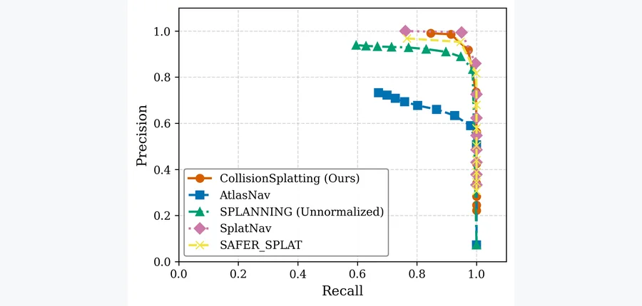 arXiv New 2026-09-29 · cs.RO · #1 **[CollisionSplatting: Collision-Aware Motion Planning in 3DGS Scenes with Image-Conditioned Objectives and Adjustable Conservatism](https://arxiv.org/abs/2609.35619)** R. Khorrambakht, Joaquim Ortiz-Haro, Stephan Weiss, Ludovic Righetti 机构：New York University / ANITI / University of Klagenfurt（PDF 首页） [Paper](https://arxiv.org/abs/2609.35619) · [图源](https://arxiv.org/html/2609.35619v1/figures/pr_curve-new.png) | 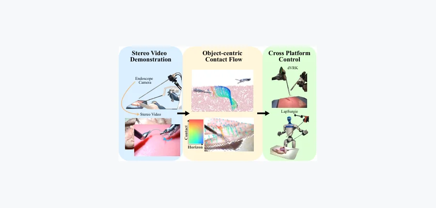 arXiv New 2026-09-29 · cs.RO · #2 **[SurgFlow: 3D Object-Centric Contact Flow for Surgical Robot Manipulation](https://arxiv.org/abs/2609.33237)** Changwei Chen, Xiao Liang, Yinuo Yang, Nicole Shen, Peihan Zhang, Sara Wickenhiser, Zekai Liang, Soofiyan Atar, Michael Yip 机构：University of California San Diego（PDF 首页） [Paper](https://arxiv.org/abs/2609.33237) · [图源](https://arxiv.org/html/2609.33237v1/coverfig_color_fixed.png) | 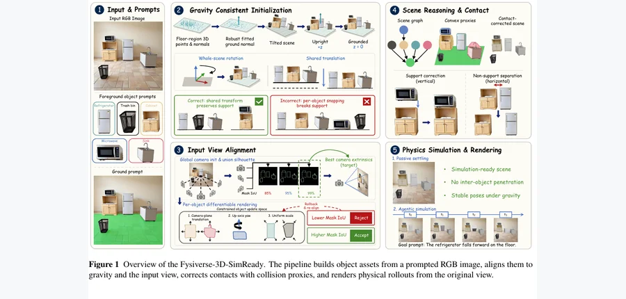 arXiv New 2026-09-29 · cs.CV · #3 **[Fysiverse-3D-SimReady Technical Report: Agentic Physical Simulation for Pragmatic 3D World Reconstruction](https://arxiv.org/abs/2609.31715)** Lintao Wang, Mingyang Sun, Yang Liu, Dingkang Yang, Lihua Zhang 机构：Fysics AI / Fudan University / The Chinese University of Hong Kong / Tongji University（PDF 首页） [Paper](https://arxiv.org/abs/2609.31715) · [Project](https://fysics-ai.github.io/Fysiverse-3D-project-page/) · [图源](https://arxiv.org/pdf/2609.31715) |
| 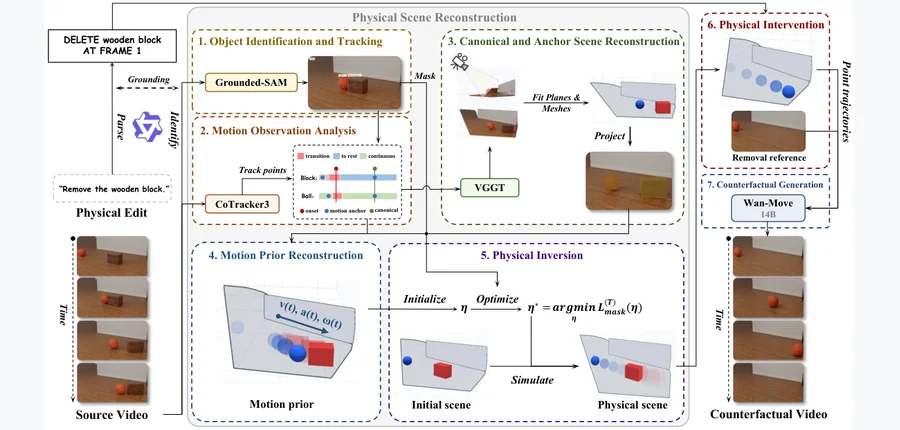 arXiv New 2026-09-29 · cs.CV · #4 **[VideoPhysEdit: Physical Counterfactual Video Editing via Rigid-Body Physical Scene Reconstruction](https://arxiv.org/abs/2609.35134)** Conghan Yue, Yuanjie Chen, Yue Han, Ya Gao, Yunyan Xiao, WeiYao Zhang, Zhineng Chen 机构：Fudan University（官方 HTML） [Paper](https://arxiv.org/abs/2609.35134) · [Code](https://github.com/Hammour-steak/VideoPhysEdit) · [图源](https://arxiv.org/html/2609.35134v1/method-gpt-image-editable.png) | 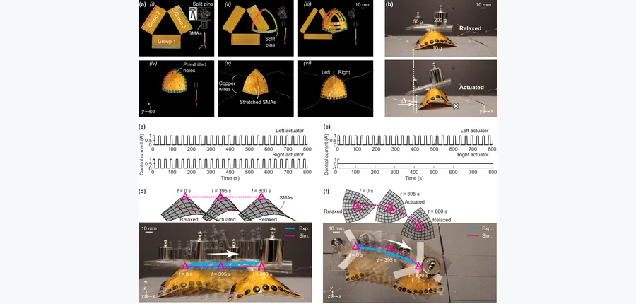 arXiv New 2026-09-29 · cs.RO · #5 **[Active 3D weaves for load-bearing and damage-resilient locomotion](https://arxiv.org/abs/2609.32099)** Guowei Wayne Tu, Evgueni T. Filipov 机构：The University of Texas at Austin / University of Michigan（PDF 首页） [Paper](https://arxiv.org/abs/2609.32099) · [图源](https://arxiv.org/html/2609.32099v1/Fabrication.png) | 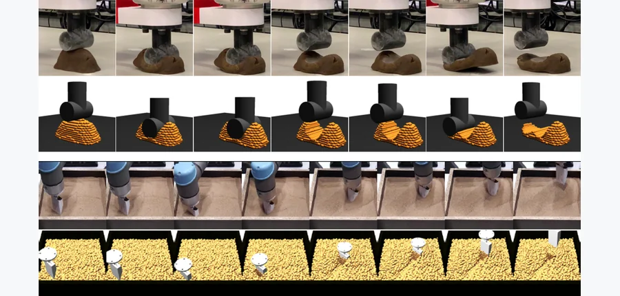 arXiv New 2026-09-29 · cs.RO · #6 **[On the Numerical Reliability of Differentiable Physics-Based Optimization for Robotic Material Manipulation](https://arxiv.org/abs/2609.34666)** Xintong Yang, Minglun Wei, Yu-Kun Lai, Ze Ji 机构：Cardiff University / Hohai University（PDF 首页） [Paper](https://arxiv.org/abs/2609.34666) · [图源](https://arxiv.org/html/2609.34666v1/figures/01.png) |
| 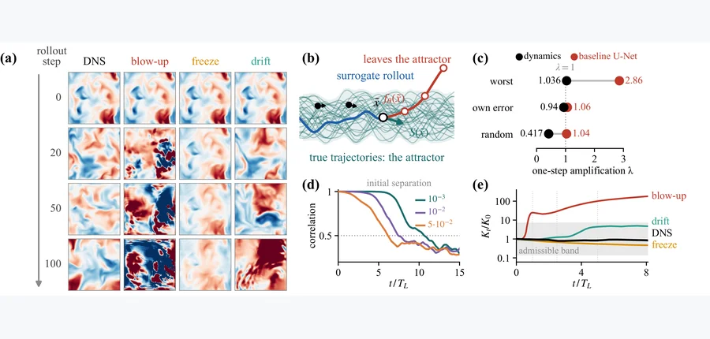 arXiv New 2026-09-29 · cs.LG · #7 **[Staying on the Attractor: Supervising Neural Surrogates of 3D Turbulence Where They Leave It](https://arxiv.org/abs/2609.32864)** Yilong Dai, Shaswata Mitra, Raj Patel, Yiming Sun, Shengyu Chen, Jiaqi Gong, Sudip Mittal, Shahram Rahimi, Xiaowei Jia, Ru… 机构：The University of Alabama / Rutgers University / University of Pittsburgh（PDF 首页） [Paper](https://arxiv.org/abs/2609.32864) · [图源](https://arxiv.org/html/2609.32864v1/figures/fig_problem.png) | 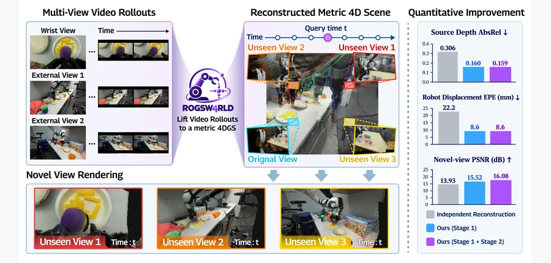 arXiv New 2026-09-29 · cs.CV · #8 **[RoGSW4RLD: Feed-Forward 4D Gaussian Lifting for Robot World Model Rollouts](https://arxiv.org/abs/2609.35311)** Jin Hyun Kim, Min Young Kim, Soohwan Song, Daekyum Kim 机构：Korea University / Dongguk University（PDF 首页） [Paper](https://arxiv.org/abs/2609.35311) · [图源](https://arxiv.org/html/2609.35311v1/Figure1_Final.png) | 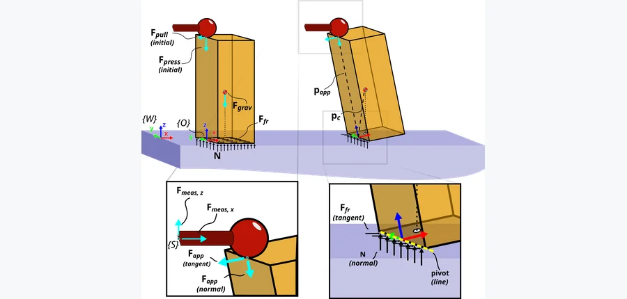 arXiv New 2026-09-29 · cs.RO · #9 **[Multi-Modal Non-Prehensile Estimation of Physical Parameters via Press-and-Pull Tipping](https://arxiv.org/abs/2609.33138)** Steven M. Hyland, Jing Xiao, Cagdas D. Onal 机构：Worcester Polytechnic Institute（PDF 首页） [Paper](https://arxiv.org/abs/2609.33138) · [图源](https://arxiv.org/html/2609.33138v1/figures/pulling_tipping.png) |
| 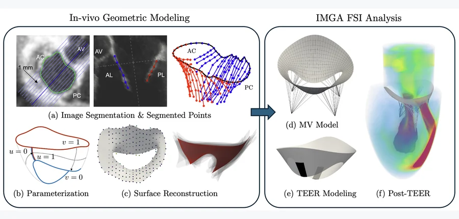 arXiv New 2026-09-29 · math.NA · #10 **[Immersogeometric fluid-structure interaction modeling of the human mitral valve and transcatheter edge-to-edge repair](https://arxiv.org/abs/2609.34209)** Keon Ho Kim, Ashton M. Corpuz, Monu Jaiswal, Michael S. Sacks, Ming-Chen Hsu 机构：The University of Texas at Austin / Iowa State University（PDF 首页） [Paper](https://arxiv.org/abs/2609.34209) · [图源](https://arxiv.org/html/2609.34209v1/figures/overview_final_ver2.png) | 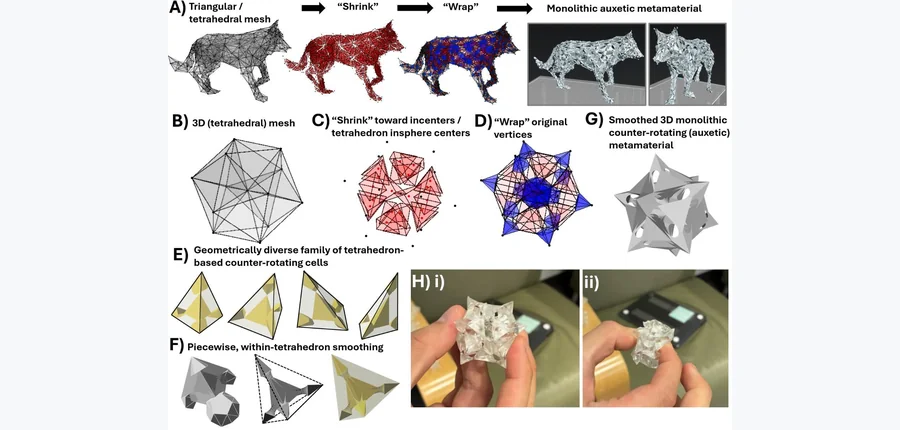 arXiv New 2026-09-29 · cond-mat.soft · #11 **[A Robust "Shrink-and-wrap" Piecewise Construction Transforms 3-Dimensional Mesh Structures into Mechanical Metamaterials](https://arxiv.org/abs/2609.31761)** Fnu Braminder, Issac Varghese, Noah Kim, Alyssa Thomas DeCruz, Eric A. Josephs 机构：Stony Brook University（PDF 首页） [Paper](https://arxiv.org/abs/2609.31761) · [图源](https://arxiv.org/pdf/2609.31761) | 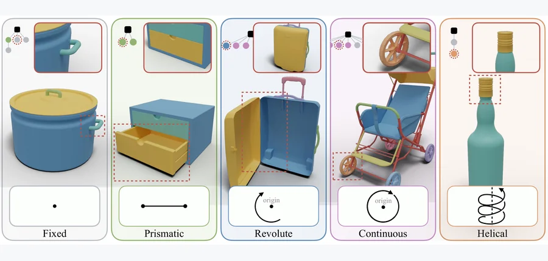 arXiv New 2026-09-29 · cs.RO · #12 **[ArticulateArena: A Metric for Articulated Kinematics](https://arxiv.org/abs/2609.33931)** Yumeng He, Yongfei She, Huanyu Chen, Chun Yuan, Peihao Li, Joseph Masterjohn, Yin Yang, Ying Jiang, Chenfanfu Jiang 机构：UCLA / USC / University of Utah / UC Berkeley / Toyota Research Institute / Envora（PDF 首页） [Paper](https://arxiv.org/abs/2609.33931) · [Project](https://heyumeng.com/ArticulateArena-web/) · [图源](https://arxiv.org/html/2609.33931v1/category_compressed.png) |
| 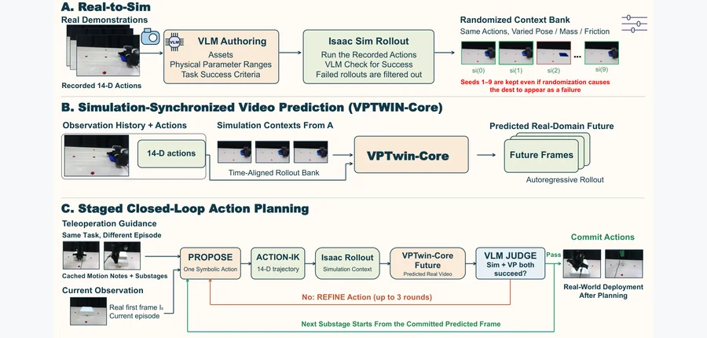 arXiv New 2026-09-29 · cs.RO · #13 **[VPTwin: Real-Sim-Real Video Prediction for Robotic Manipulation Planning](https://arxiv.org/abs/2609.33104)** Zhenghao Xiao, Minting Pan, Nantian He, Dongzhan Zhou, Yunbo Wang 机构：Carnegie Mellon University / Shanghai AI Laboratory / Shanghai Jiao Tong University（PDF 首页） [Paper](https://arxiv.org/abs/2609.33104) · [图源](https://arxiv.org/html/2609.33104v1/1.png) | 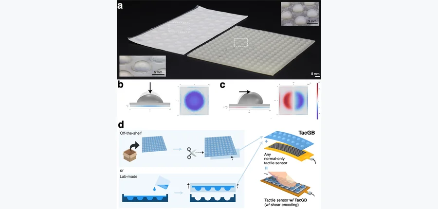 arXiv New 2026-09-29 · cs.RO · #14 **[TacGooseBumps (TacGB): Retrofitting Normal-Only Tactile Sensors with Shear Encoding for Learning Contact-Rich Manipulation](https://arxiv.org/abs/2609.34006)** Wenjie Li, Binyu Yang, Yuxin Chen, Ambrose Wang, Masayoshi Tomizuka 机构：University of California, Berkeley / Saratoga High School（PDF 首页） [Paper](https://arxiv.org/abs/2609.34006) · [图源](https://arxiv.org/html/2609.34006v1/figures/Fig_2.png) | 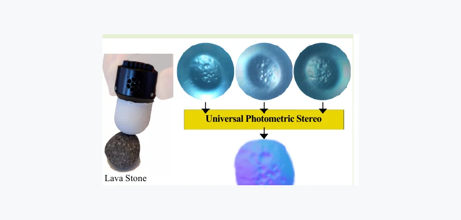 arXiv New 2026-09-29 · cs.CV · #15 **[Calibration-Free Surface Normals Estimation in Vision-Based Tactile Sensing using Universal Photometric Stereo](https://arxiv.org/abs/2609.31754)** Zdravko Dugonjic, Stefanie Speidel, Roberto Calandra 机构：TU Dresden / NCT Dresden（PDF 首页） [Paper](https://arxiv.org/abs/2609.31754) · [图源](https://arxiv.org/pdf/2609.31754) |
| 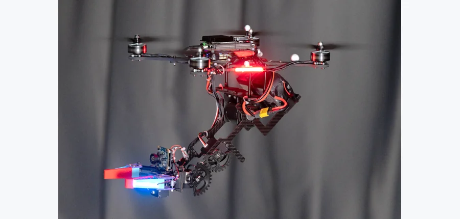 arXiv New 2026-09-29 · cs.RO · #16 **[QuadHand: A Compact Quadrotor Aerial Manipulator with MRC-SDF-Based Whole-Body Motion Planning](https://arxiv.org/abs/2609.35094)** Rui Jin, Ruiyang Liu, Xinhang Xu, Haotian Jin, Yi Wang, Yizhuo Yang, Lihua Xi 机构：Nanyang Technological University / VinUniversity（PDF 首页） [Paper](https://arxiv.org/abs/2609.35094) · [图源](https://arxiv.org/html/2609.35094v1/fig1.png) | 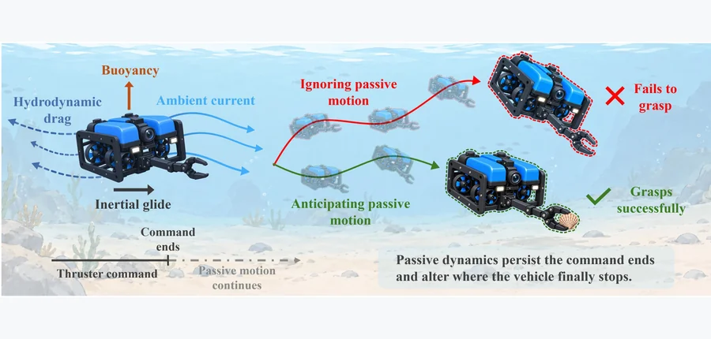 arXiv New 2026-09-29 · cs.RO · #17 **[AquaWAM: A Dynamics-aware World Action Model for Underwater Embodied Agents](https://arxiv.org/abs/2609.33299)** Cunhao Zhu, Yifeng Wang, Dongliang Xu, Yunzhong Hou, Yue Yao, Chi Harold Liu 机构：Shandong University / Beijing Institute of Technology（PDF 首页） [Paper](https://arxiv.org/abs/2609.33299) · [图源](https://arxiv.org/pdf/2609.33299) | 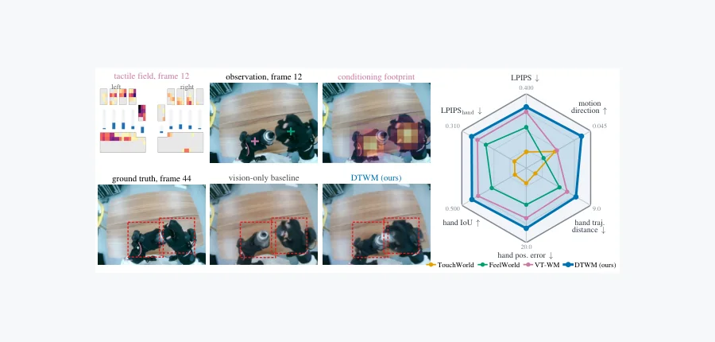 arXiv New 2026-09-29 · cs.CV · #18 **[Dexterous Tactile World Model](https://arxiv.org/abs/2609.34286)** Ziyao Zeng, Xiatao Sun, Hao Wang, Yueyang Pan, Zhengxiang Yu, Fengyu Yang, Tianyu Liu, Zhiwen Fan, Daniel Rakita 机构：Yale University / Texas A&amp;M University / UCLA / University of Washington（PDF 首页） [Paper](https://arxiv.org/abs/2609.34286) · [Project](https://adonis-galaxy.github.io/dtwm-project-page/) · [图源](https://arxiv.org/html/2609.34286v1/fig_teaser.png) |
| 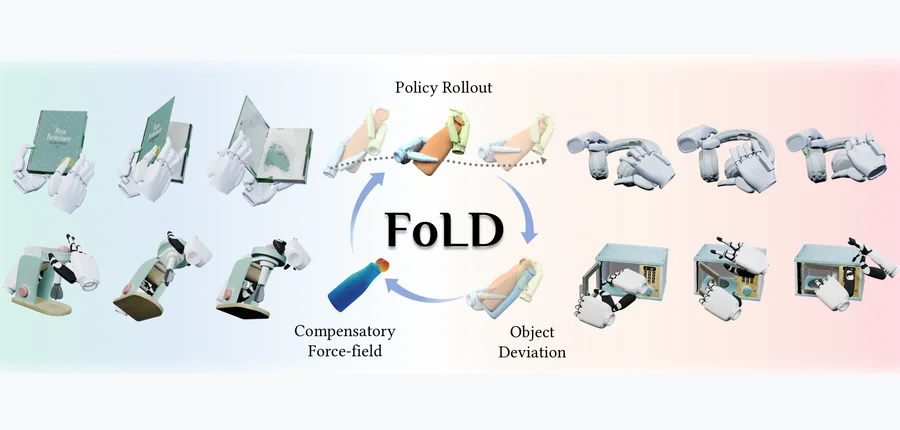 arXiv New 2026-09-29 · cs.RO · #19 **[FoLD: Force-Informed Learning for Dexterous Articulated Object Manipulation](https://arxiv.org/abs/2609.33551)** Haowei Shen, Tingai Li, Yumeng Liu, Wenyuan Guang, Xuanze Yang, Qing Fang, Kai Xu, Ligang Liu, Ruizhen Hu 机构：University of Science and Technology of China / Chinese Academy of Sciences / Shenzhen University（PDF 首页） [Paper](https://arxiv.org/abs/2609.33551) · [Project](https://gghgghgghgg.github.io/FoLD-project-page/) · [图源](https://arxiv.org/html/2609.33551v1/image/FoLD_teaser2.png) | 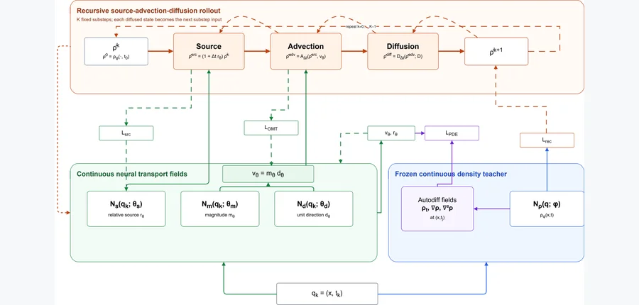 arXiv New 2026-09-29 · cs.LG · #20 **[PI-NOMT: Physics-Informed Neural Optimal Mass Transport for Brain Fluid Dynamics](https://arxiv.org/abs/2609.33857)** Mehmet Emin Acar, Vahit Bugra Yesilkaynak, Helene Benveniste, Gozde Unal 机构：Istanbul Technical University / Yale University（PDF 首页） [Paper](https://arxiv.org/abs/2609.33857) · [图源](https://arxiv.org/html/2609.33857v1/pi_nomt_pipeline.drawio.png) | 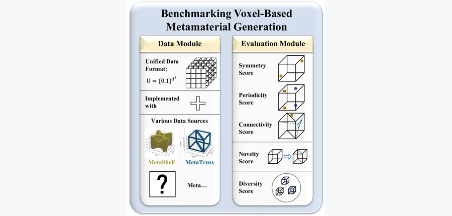 arXiv New 2026-09-29 · cs.CV · #21 **[ReGDiff: Guided Diffusion in Regulated Latent Space for Exploring Metamaterial Voxel Geometry](https://arxiv.org/abs/2609.34231)** Wangzhi Zhan, Jianpeng Chen, Dongqi Fu, Dawei Zhou 机构：Virginia Tech / Meta（PDF 首页） [Paper](https://arxiv.org/abs/2609.34231) · [图源](https://arxiv.org/html/2609.34231v1/bench.png) |
| 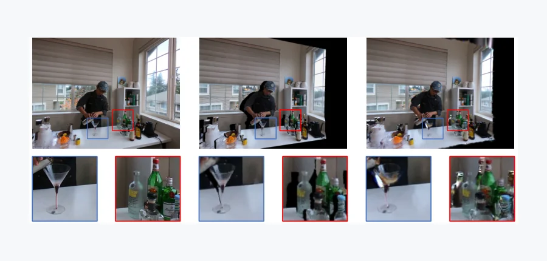 arXiv New 2026-09-29 · cs.CV · #22 **[ProDyGS: Dynamic Gaussian Splatting from a Single Static Monocular Camera](https://arxiv.org/abs/2609.32711)** Ugo Leone Cavalcanti, Fabio Tosi, Matteo Poggi, Andrea Conti, Vladimir Zlokolica, Valerio Cambareri, Stefano Mattoccia 机构：University of Bologna / Sony Depthsensing Solutions（PDF 首页） [Paper](https://arxiv.org/abs/2609.32711) · [Project](https://prodygs.github.io) · [图源](https://arxiv.org/html/2609.32711v1/teaser.png) | 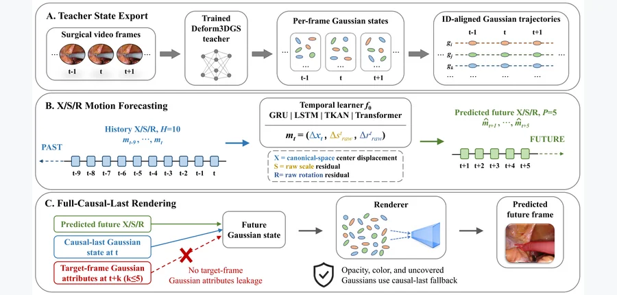 arXiv New 2026-09-29 · cs.CV · #23 **[SurgGMF: Fully Causal Gaussian Motion Forecasting for Anticipatory Surgical Scene Rendering](https://arxiv.org/abs/2609.34733)** Jingqian Sun, Yichao Tang 机构：Tongji University / Shanghai Innovation Institute（PDF 首页） [Paper](https://arxiv.org/abs/2609.34733) · [图源](https://arxiv.org/html/2609.34733v1/fig1_surggmf_pipeline.png) | 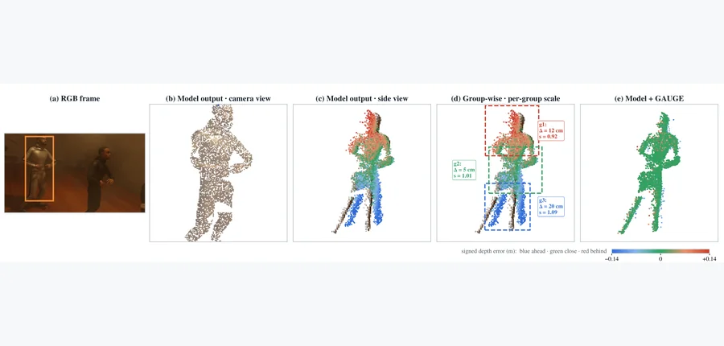 arXiv New 2026-09-29 · cs.CV · #24 **[GAUGE: Group-Wise View-Inconsistency Rectification for Feed-Forward 4D Tracking](https://arxiv.org/abs/2609.32596)** Zhuoqian Feng, Weixing Chen, Ziliang Chen, Yang Liu, Liang Lin 机构：Sun Yat-sen University / Pengcheng Laboratory / X-Era AI Lab（PDF 首页） [Paper](https://arxiv.org/abs/2609.32596) · [Code](https://github.com/HCPLab-SYSU/GAUGE) · [图源](https://arxiv.org/html/2609.32596v1/fig1_teaser.png) |
| 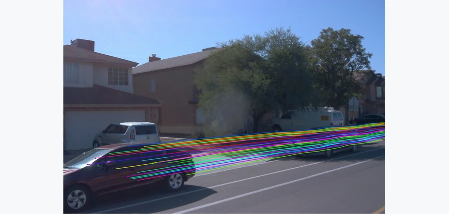 arXiv New 2026-09-29 · cs.CV · #25 **[3D Point Tracking with State Space Models](https://arxiv.org/abs/2609.34035)** Masahiro Ogawa, Qi An, Atsushi Yamashita 机构：The University of Tokyo（PDF 首页） [Paper](https://arxiv.org/abs/2609.34035) · [图源](https://arxiv.org/html/2609.34035v1/figs/teaser_track2d.png) | 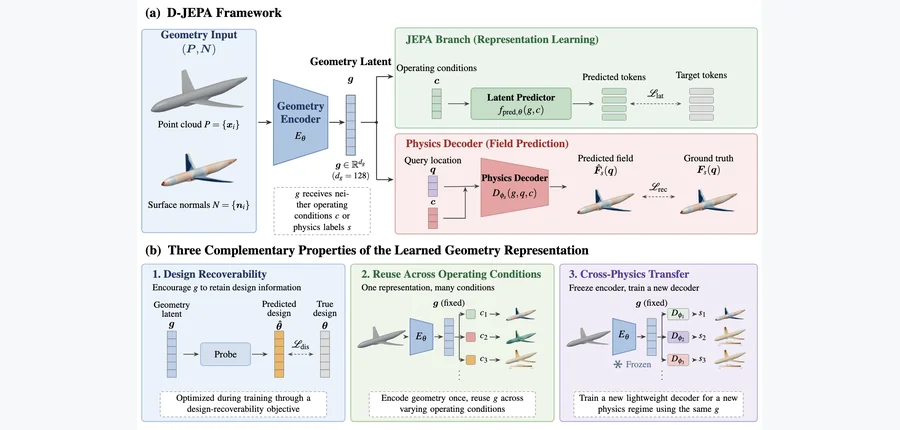 arXiv New 2026-09-29 · cs.LG · #26 **[D-JEPA: Design-Recoverable JEPA Representation with Swappable Physics Decoders](https://arxiv.org/abs/2609.33110)** Nitin Nagesh Kulkarni, Aashwin Anand Mishra, Yin Yu, Peter Lyu 机构：Luminary（PDF 首页） [Paper](https://arxiv.org/abs/2609.33110) · [图源](https://arxiv.org/html/2609.33110v1/figures/djepa.png) | 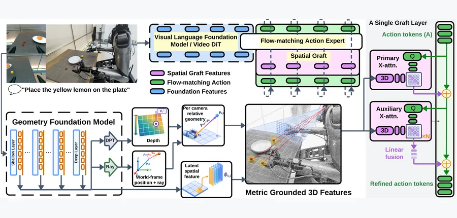 arXiv New 2026-09-29 · cs.RO · #27 **[Spatial Grafting: Grounding 3D Features for Flow-Matching Robot Policies](https://arxiv.org/abs/2609.35249)** Dingsheng Liu, Yangzheng Wu, Mahboubeh Asadi, Zhiyuan Li, Jinbang Huang, Yixin Xiao, Tongtong Cao, Yingxue Zhang 机构：University of Toronto / Huawei Noah’s Ark Lab（PDF 首页） [Paper](https://arxiv.org/abs/2609.35249) · [图源](https://arxiv.org/html/2609.35249v1/figures/pipeline_V25.png) |
| 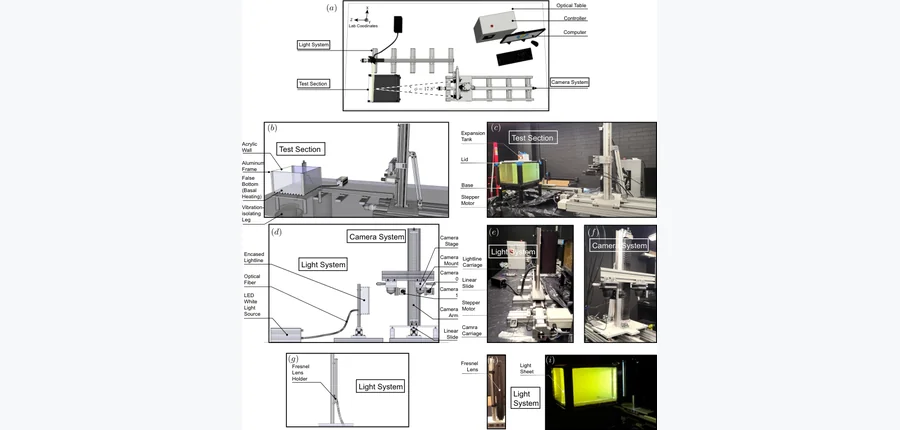 arXiv New 2026-09-29 · physics.flu-dyn · #28 **[A method for measuring and analyzing four-dimensional flow fields in viscous Rayleigh-Bénard convection](https://arxiv.org/abs/2609.33036)** Xiyuan Bao, Carolina Lithgow-Bertelloni 机构：UCLA（PDF 首页） [Paper](https://arxiv.org/abs/2609.33036) · [图源](https://arxiv.org/html/2609.33036v1/spiv_system_combined.png) | 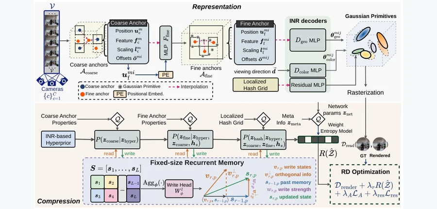 arXiv New 2026-09-29 · cs.CV · #29 **[Gaussian Splatting-based Volumetric Video Compression with Sparse 4D Anchors](https://arxiv.org/abs/2609.33969)** Ge Gao, Siyue Teng, Changqi Wang, Fan Zhang, Nantheera Anantrasirichai, Jui Chiu Chiang, Wen-Hsiao Peng, David Bull 机构：University of Bristol / National Chung Cheng University / National Yang Ming Chiao Tung University（PDF 首页） [Paper](https://arxiv.org/abs/2609.33969) · [图源](https://arxiv.org/html/2609.33969v1/framework.png) | 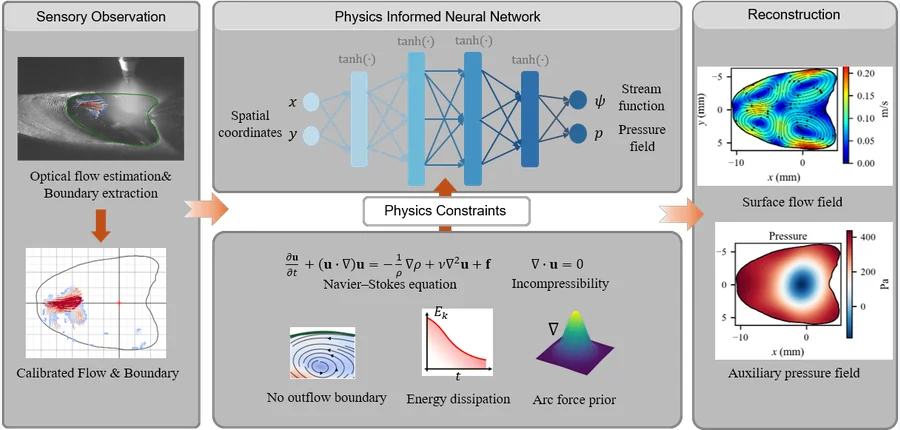 arXiv New 2026-09-29 · physics.flu-dyn · #30 **[Reconstruction of Molten Pool Flow Fields from High-Speed Video Using Physics-Informed Neural Networks](https://arxiv.org/abs/2609.32126)** Yue Cao, Qin Su, Dung Hoang Tien, Van Anh Nguyen 机构：University of Kentucky / Hanoi University of Industry（PDF 首页） [Paper](https://arxiv.org/abs/2609.32126) · [图源](https://arxiv.org/pdf/2609.32126) |
<!-- PAPER_CARDS_END -->

## 检索概况

- **官方批次**：arXiv `New submissions`，页面标注 Tuesday, 29 September 2026；本日报于北京时间 2026-09-30 检索。官方分类页：[cs.CV](https://arxiv.org/list/cs.CV/new)、[cs.GR](https://arxiv.org/list/cs.GR/new)、[cs.RO](https://arxiv.org/list/cs.RO/new)、[cs.AI](https://arxiv.org/list/cs.AI/new)、[cs.LG](https://arxiv.org/list/cs.LG/new)、[physics](https://arxiv.org/list/physics/new)、[cond-mat](https://arxiv.org/list/cond-mat/new)、[eess](https://arxiv.org/list/eess/new)、[math](https://arxiv.org/list/math/new)、[stat.ML](https://arxiv.org/list/stat.ML/new)。
- **检索窗口与数量**：上述 10 个官方分类页的当批 New 共 2,924 条，按 arXiv ID 去重后仍为 **2,924 篇**；按标题及摘要筛入 **30 篇**。主榜仅含官方 New，分类交叉标注不重复计数。
- **排序口径（推断）**：优先三维几何与物理机制直接结合，其次 4D/物理世界模型、接触触觉与具身操作，最后基础动态 3D。相关性、机构强度、局限和改进建议均为本日报推断；论文陈述及数值以各行可点击 arXiv 摘要/PDF 为准。
- **机构核实**：29 篇依据官方 PDF 首页，#4 依据[官方 arXiv HTML](https://arxiv.org/html/2609.35134) 的作者机构行；机构强度仅为阅读排序的主观判断。

## Top papers

| # | 标题 | 论文来源 | 分类 | 作者 | 机构 | 相关性（推断） | 机构强度（推断） | 阅读优先级（推断） |
|---:|---|---|---|---|---|---|---|---|
| 1 | CollisionSplatting: Collision-Aware Motion Planning in 3DGS Scenes with Image-Conditioned Objectives and Adjustable Conservatism | [arXiv:2609.35619](https://arxiv.org/abs/2609.35619) | Robotics (cs.RO) | R. Khorrambakht, Joaquim Ortiz-Haro, Stephan Weiss, Ludovic Righetti | New York University / ANITI / University of Klagenfurt（PDF 首页） | 高 | 高 | 高 |
| 2 | SurgFlow: 3D Object-Centric Contact Flow for Surgical Robot Manipulation | [arXiv:2609.33237](https://arxiv.org/abs/2609.33237) | Robotics (cs.RO) | Changwei Chen, Xiao Liang, Yinuo Yang, Nicole Shen, Peihan Zhang, Sara Wickenhiser, Zekai Liang, Soofiyan Atar, Michael Yip | University of California San Diego（PDF 首页） | 高 | 高 | 高 |
| 3 | Fysiverse-3D-SimReady Technical Report: Agentic Physical Simulation for Pragmatic 3D World Reconstruction | [arXiv:2609.31715](https://arxiv.org/abs/2609.31715) | Computer Vision and Pattern Recognition (cs.CV) | Lintao Wang, Mingyang Sun, Yang Liu, Dingkang Yang, Lihua Zhang | Fysics AI / Fudan University / The Chinese University of Hong Kong / Tongji University（PDF 首页） | 高 | 高 | 高 |
| 4 | VideoPhysEdit: Physical Counterfactual Video Editing via Rigid-Body Physical Scene Reconstruction | [arXiv:2609.35134](https://arxiv.org/abs/2609.35134) | Computer Vision and Pattern Recognition (cs.CV) | Conghan Yue, Yuanjie Chen, Yue Han, Ya Gao, Yunyan Xiao, WeiYao Zhang, Zhineng Chen | Fudan University（官方 HTML） | 高 | 高 | 高 |
| 5 | Active 3D weaves for load-bearing and damage-resilient locomotion | [arXiv:2609.32099](https://arxiv.org/abs/2609.32099) | Robotics (cs.RO) ; Materials Science (cond-mat.mtrl-sci); Soft Condensed Matter (cond-mat.soft) | Guowei Wayne Tu, Evgueni T. Filipov | The University of Texas at Austin / University of Michigan（PDF 首页） | 高 | 高 | 高 |
| 6 | On the Numerical Reliability of Differentiable Physics-Based Optimization for Robotic Material Manipulation | [arXiv:2609.34666](https://arxiv.org/abs/2609.34666) | Robotics (cs.RO) ; Machine Learning (cs.LG) | Xintong Yang, Minglun Wei, Yu-Kun Lai, Ze Ji | Cardiff University / Hohai University（PDF 首页） | 高 | 高 | 高 |
| 7 | Staying on the Attractor: Supervising Neural Surrogates of 3D Turbulence Where They Leave It | [arXiv:2609.32864](https://arxiv.org/abs/2609.32864) | Machine Learning (cs.LG) ; Fluid Dynamics (physics.flu-dyn) | Yilong Dai, Shaswata Mitra, Raj Patel, Yiming Sun, Shengyu Chen, Jiaqi Gong, Sudip Mittal, Shahram Rahimi, Xiaowei Jia, Runlong Yu | The University of Alabama / Rutgers University / University of Pittsburgh（PDF 首页） | 高 | 高 | 高 |
| 8 | RoGSW4RLD: Feed-Forward 4D Gaussian Lifting for Robot World Model Rollouts | [arXiv:2609.35311](https://arxiv.org/abs/2609.35311) | Computer Vision and Pattern Recognition (cs.CV) ; Robotics (cs.RO) | Jin Hyun Kim, Min Young Kim, Soohwan Song, Daekyum Kim | Korea University / Dongguk University（PDF 首页） | 高 | 高 | 高 |
| 9 | Multi-Modal Non-Prehensile Estimation of Physical Parameters via Press-and-Pull Tipping | [arXiv:2609.33138](https://arxiv.org/abs/2609.33138) | Robotics (cs.RO) | Steven M. Hyland, Jing Xiao, Cagdas D. Onal | Worcester Polytechnic Institute（PDF 首页） | 高 | 高 | 高 |
| 10 | Immersogeometric fluid-structure interaction modeling of the human mitral valve and transcatheter edge-to-edge repair | [arXiv:2609.34209](https://arxiv.org/abs/2609.34209) | **非 cs 主类**：Numerical Analysis (math.NA) | Keon Ho Kim, Ashton M. Corpuz, Monu Jaiswal, Michael S. Sacks, Ming-Chen Hsu | The University of Texas at Austin / Iowa State University（PDF 首页） | 高 | 高 | 高 |
| 11 | A Robust "Shrink-and-wrap" Piecewise Construction Transforms 3-Dimensional Mesh Structures into Mechanical Metamaterials | [arXiv:2609.31761](https://arxiv.org/abs/2609.31761) | **非 cs 主类**：Soft Condensed Matter (cond-mat.soft) ; Materials Science (cond-mat.mtrl-sci) | Fnu Braminder, Issac Varghese, Noah Kim, Alyssa Thomas DeCruz, Eric A. Josephs | Stony Brook University（PDF 首页） | 高 | 高 | 高 |
| 12 | ArticulateArena: A Metric for Articulated Kinematics | [arXiv:2609.33931](https://arxiv.org/abs/2609.33931) | Robotics (cs.RO) ; Computer Vision and Pattern Recognition (cs.CV) | Yumeng He, Yongfei She, Huanyu Chen, Chun Yuan, Peihao Li, Joseph Masterjohn, Yin Yang, Ying Jiang, Chenfanfu Jiang | UCLA / USC / University of Utah / UC Berkeley / Toyota Research Institute / Envora（PDF 首页） | 高 | 高 | 高 |
| 13 | VPTwin: Real-Sim-Real Video Prediction for Robotic Manipulation Planning | [arXiv:2609.33104](https://arxiv.org/abs/2609.33104) | Robotics (cs.RO) ; Artificial Intelligence (cs.AI) | Zhenghao Xiao, Minting Pan, Nantian He, Dongzhan Zhou, Yunbo Wang | Carnegie Mellon University / Shanghai AI Laboratory / Shanghai Jiao Tong University（PDF 首页） | 高 | 高 | 中高 |
| 14 | TacGooseBumps (TacGB): Retrofitting Normal-Only Tactile Sensors with Shear Encoding for Learning Contact-Rich Manipulation | [arXiv:2609.34006](https://arxiv.org/abs/2609.34006) | Robotics (cs.RO) | Wenjie Li, Binyu Yang, Yuxin Chen, Ambrose Wang, Masayoshi Tomizuka | University of California, Berkeley / Saratoga High School（PDF 首页） | 高 | 高 | 中高 |
| 15 | Calibration-Free Surface Normals Estimation in Vision-Based Tactile Sensing using Universal Photometric Stereo | [arXiv:2609.31754](https://arxiv.org/abs/2609.31754) | Computer Vision and Pattern Recognition (cs.CV) ; Machine Learning (cs.LG); Robotics (cs.RO) | Zdravko Dugonjic, Stefanie Speidel, Roberto Calandra | TU Dresden / NCT Dresden（PDF 首页） | 高 | 高 | 中高 |
| 16 | QuadHand: A Compact Quadrotor Aerial Manipulator with MRC-SDF-Based Whole-Body Motion Planning | [arXiv:2609.35094](https://arxiv.org/abs/2609.35094) | Robotics (cs.RO) | Rui Jin, Ruiyang Liu, Xinhang Xu, Haotian Jin, Yi Wang, Yizhuo Yang, Lihua Xi | Nanyang Technological University / VinUniversity（PDF 首页） | 高 | 中高 | 中高 |
| 17 | AquaWAM: A Dynamics-aware World Action Model for Underwater Embodied Agents | [arXiv:2609.33299](https://arxiv.org/abs/2609.33299) | Robotics (cs.RO) ; Artificial Intelligence (cs.AI) | Cunhao Zhu, Yifeng Wang, Dongliang Xu, Yunzhong Hou, Yue Yao, Chi Harold Liu | Shandong University / Beijing Institute of Technology（PDF 首页） | 高 | 中高 | 中高 |
| 18 | Dexterous Tactile World Model | [arXiv:2609.34286](https://arxiv.org/abs/2609.34286) | Computer Vision and Pattern Recognition (cs.CV) ; Machine Learning (cs.LG); Robotics (cs.RO) | Ziyao Zeng, Xiatao Sun, Hao Wang, Yueyang Pan, Zhengxiang Yu, Fengyu Yang, Tianyu Liu, Zhiwen Fan, Daniel Rakita | Yale University / Texas A&M University / UCLA / University of Washington（PDF 首页） | 高 | 中高 | 中高 |
| 19 | FoLD: Force-Informed Learning for Dexterous Articulated Object Manipulation | [arXiv:2609.33551](https://arxiv.org/abs/2609.33551) | Robotics (cs.RO) | Haowei Shen, Tingai Li, Yumeng Liu, Wenyuan Guang, Xuanze Yang, Qing Fang, Kai Xu, Ligang Liu, Ruizhen Hu | University of Science and Technology of China / Chinese Academy of Sciences / Shenzhen University（PDF 首页） | 高 | 中高 | 中高 |
| 20 | PI-NOMT: Physics-Informed Neural Optimal Mass Transport for Brain Fluid Dynamics | [arXiv:2609.33857](https://arxiv.org/abs/2609.33857) | Machine Learning (cs.LG) ; Artificial Intelligence (cs.AI) | Mehmet Emin Acar, Vahit Bugra Yesilkaynak, Helene Benveniste, Gozde Unal | Istanbul Technical University / Yale University（PDF 首页） | 高 | 中高 | 中高 |
| 21 | ReGDiff: Guided Diffusion in Regulated Latent Space for Exploring Metamaterial Voxel Geometry | [arXiv:2609.34231](https://arxiv.org/abs/2609.34231) | Computer Vision and Pattern Recognition (cs.CV) ; Artificial Intelligence (cs.AI) | Wangzhi Zhan, Jianpeng Chen, Dongqi Fu, Dawei Zhou | Virginia Tech / Meta（PDF 首页） | 高 | 中高 | 中高 |
| 22 | ProDyGS: Dynamic Gaussian Splatting from a Single Static Monocular Camera | [arXiv:2609.32711](https://arxiv.org/abs/2609.32711) | Computer Vision and Pattern Recognition (cs.CV) | Ugo Leone Cavalcanti, Fabio Tosi, Matteo Poggi, Andrea Conti, Vladimir Zlokolica, Valerio Cambareri, Stefano Mattoccia | University of Bologna / Sony Depthsensing Solutions（PDF 首页） | 中高 | 中高 | 中高 |
| 23 | SurgGMF: Fully Causal Gaussian Motion Forecasting for Anticipatory Surgical Scene Rendering | [arXiv:2609.34733](https://arxiv.org/abs/2609.34733) | Computer Vision and Pattern Recognition (cs.CV) | Jingqian Sun, Yichao Tang | Tongji University / Shanghai Innovation Institute（PDF 首页） | 中高 | 中高 | 中高 |
| 24 | GAUGE: Group-Wise View-Inconsistency Rectification for Feed-Forward 4D Tracking | [arXiv:2609.32596](https://arxiv.org/abs/2609.32596) | Computer Vision and Pattern Recognition (cs.CV) ; Artificial Intelligence (cs.AI) | Zhuoqian Feng, Weixing Chen, Ziliang Chen, Yang Liu, Liang Lin | Sun Yat-sen University / Pengcheng Laboratory / X-Era AI Lab（PDF 首页） | 中高 | 中高 | 中高 |
| 25 | 3D Point Tracking with State Space Models | [arXiv:2609.34035](https://arxiv.org/abs/2609.34035) | Computer Vision and Pattern Recognition (cs.CV) ; Machine Learning (cs.LG); Robotics (cs.RO) | Masahiro Ogawa, Qi An, Atsushi Yamashita | The University of Tokyo（PDF 首页） | 中高 | 中高 | 中高 |
| 26 | D-JEPA: Design-Recoverable JEPA Representation with Swappable Physics Decoders | [arXiv:2609.33110](https://arxiv.org/abs/2609.33110) | Machine Learning (cs.LG) ; Artificial Intelligence (cs.AI) | Nitin Nagesh Kulkarni, Aashwin Anand Mishra, Yin Yu, Peter Lyu | Luminary（PDF 首页） | 中高 | 未评估 | 中 |
| 27 | Spatial Grafting: Grounding 3D Features for Flow-Matching Robot Policies | [arXiv:2609.35249](https://arxiv.org/abs/2609.35249) | Robotics (cs.RO) ; Artificial Intelligence (cs.AI); Computer Vision and Pattern Recognition (cs.CV) | Dingsheng Liu, Yangzheng Wu, Mahboubeh Asadi, Zhiyuan Li, Jinbang Huang, Yixin Xiao, Tongtong Cao, Yingxue Zhang | University of Toronto / Huawei Noah’s Ark Lab（PDF 首页） | 中高 | 中高 | 中 |
| 28 | A method for measuring and analyzing four-dimensional flow fields in viscous Rayleigh-Bénard convection | [arXiv:2609.33036](https://arxiv.org/abs/2609.33036) | **非 cs 主类**：Fluid Dynamics (physics.flu-dyn) ; Geophysics (physics.geo-ph) | Xiyuan Bao, Carolina Lithgow-Bertelloni | UCLA（PDF 首页） | 中高 | 中高 | 中 |
| 29 | Gaussian Splatting-based Volumetric Video Compression with Sparse 4D Anchors | [arXiv:2609.33969](https://arxiv.org/abs/2609.33969) | Computer Vision and Pattern Recognition (cs.CV) | Ge Gao, Siyue Teng, Changqi Wang, Fan Zhang, Nantheera Anantrasirichai, Jui Chiu Chiang, Wen-Hsiao Peng, David Bull | University of Bristol / National Chung Cheng University / National Yang Ming Chiao Tung University（PDF 首页） | 中高 | 中高 | 中 |
| 30 | Reconstruction of Molten Pool Flow Fields from High-Speed Video Using Physics-Informed Neural Networks | [arXiv:2609.32126](https://arxiv.org/abs/2609.32126) | **非 cs 主类**：Fluid Dynamics (physics.flu-dyn) ; Image and Video Processing (eess.IV) | Yue Cao, Qin Su, Dung Hoang Tien, Van Anh Nguyen | University of Kentucky / Hanoi University of Industry（PDF 首页） | 中高 | 中高 | 中 |

## 逐篇要点

每篇前两条为官方摘要或 PDF 可核对的论文陈述，第三条为本日报推断。论文链接即事实来源。

### 1. [CollisionSplatting: Collision-Aware Motion Planning in 3DGS Scenes with Image-Conditioned Objectives and Adjustable Conservatism](https://arxiv.org/abs/2609.35619)

- [事实] 3DGS 原生碰撞距离可调保守度，并与图像奖励联合做规划。
- [事实] 接入 GPU MPPI 与 RRT，摘要报告碰撞分类相当或更好、吞吐更高且显存更低。
- [推断] 在同一场景对不同高斯密度、细薄障碍和动态障碍做碰撞漏检—时间曲线，检验保守度能否跨场景校准。

### 2. [SurgFlow: 3D Object-Centric Contact Flow for Surgical Robot Manipulation](https://arxiv.org/abs/2609.33237)

- [事实] 从双目手术视频学习逐物点未来 3D 轨迹和接触分数，不需要动作标签。
- [事实] 用接触预测触发抓取/释放，dVRK 的 39 个阶段评估中成功 37 个。
- [推断] 需按遮挡、组织形变和接触时间偏差分层报告失败率；工具接近并不必然等于真实接触。

### 3. [Fysiverse-3D-SimReady Technical Report: Agentic Physical Simulation for Pragmatic 3D World Reconstruction](https://arxiv.org/abs/2609.31715)

- [事实] 单张 RGB 图加实例和地面提示，生成多物体共享的重力对齐场景。
- [事实] 经可微渲染修正位姿，并校正支撑与接触以执行物理 rollout。
- [推断] 应在相同视觉对齐误差下单独评测稳定落置与穿透率，避免视觉改善掩盖物理失败。

### 4. [VideoPhysEdit: Physical Counterfactual Video Editing via Rigid-Body Physical Scene Reconstruction](https://arxiv.org/abs/2609.35134)

- [事实] 定义刚体场景的物理反事实视频编辑：源视频、物理编辑和执行帧决定后续轨迹。
- [事实] 以可复现观测运动的物理场景重建驱动编辑，并提出成对的 PCVE-RigidBench。
- [推断] 当前限于刚体；应测试错误质量/摩擦估计对碰撞后轨迹的传播误差。

### 5. [Active 3D weaves for load-bearing and damage-resilient locomotion](https://arxiv.org/abs/2609.32099)

- [事实] 把主动材料编入 3D 编织壳，在承载刚度与弯曲驱动柔性之间设计结构。
- [事实] 摘要报告五种可运动机器人，承载可达自身重量 70 倍，并在强压缩后保持重复运动。
- [推断] 应将织物几何和材料贡献分离，对相同质量、驱动能量比较结构效率与损伤后性能。

### 6. [On the Numerical Reliability of Differentiable Physics-Based Optimization for Robotic Material Manipulation](https://arxiv.org/abs/2609.34666)

- [事实] 用弹塑性和颗粒 MPM 参数辨识基准检查长时接触 rollout 的梯度可靠性。
- [事实] GPU 非确定性求和可改变长时梯度，甚至令一个参数梯度相对确定性参考反号。
- [推断] 应把重复运行损失方差纳入有限差分判据，并报告目标函数改变时独立物理指标是否同向改善。

### 7. [Staying on the Attractor: Supervising Neural Surrogates of 3D Turbulence Where They Leave It](https://arxiv.org/abs/2609.32864)

- [事实] 用模型自行 rollout、失稳攻击和动力学方向扰动寻找 3D 湍流 surrogate 的离吸引子状态。
- [事实] 选中状态只需离线 DNS 重标注一次；128³ 湍流的中位失效时间由 21 增至 721 步。
- [推断] 需检验相同 DNS 重标注预算下随机状态与针对性状态的收益，并在不同雷诺数测分布外稳定性。

### 8. [RoGSW4RLD: Feed-Forward 4D Gaussian Lifting for Robot World Model Rollouts](https://arxiv.org/abs/2609.35311)

- [事实] 将多相机机器人视频未来提升为可按时间查询的统一度量 4D Gaussian 场。
- [事实] 在 256 条 DROID 留出片段上，相对逐相机重建降低深度 AbsRel 47%、机器人位移误差 61%。
- [推断] 应单独评估高斯几何与接触位置的物理一致性；新视角画质不能代替可执行 rollout。

### 9. [Multi-Modal Non-Prehensile Estimation of Physical Parameters via Press-and-Pull Tipping](https://arxiv.org/abs/2609.33138)

- [事实] 组合滑动与按压—拉动倾倒，估计未知物体质量、质心高度和摩擦。
- [事实] 融合腕力/力矩、RGB-D 与本体状态；曲底物体也能在受控倾倒下估计。
- [推断] 应测三参数的可辨识区间与传感器误差敏感度，特别是低摩擦导致的滑移/倾倒混合状态。

### 10. [Immersogeometric fluid-structure interaction modeling of the human mitral valve and transcatheter edge-to-edge repair](https://arxiv.org/abs/2609.34209)

- [事实] 从分割影像建立可计算的瓣膜等几何网格，耦合血流、瓣叶与腱索形变接触。
- [事实] 用子单元积分减少非物理泄漏，模拟单夹与双夹修复并比较血流动力学。
- [推断] 需用多患者影像和术后流量作外部验证，区分网格收敛与生理预测准确性。

### 11. [A Robust "Shrink-and-wrap" Piecewise Construction Transforms 3-Dimensional Mesh Structures into Mechanical Metamaterials](https://arxiv.org/abs/2609.31761)

- [事实] 对三角或四面体网格做 shrink-and-wrap 分片构造，形成负泊松比的反向旋转机制。
- [事实] 从复杂 3D 扫描形体生成可 3D 打印的局部可编程机械超材料。
- [推断] 需对打印公差、支撑材料和大形变加载做实测；几何上的机制保证不等同于成品稳健性。

### 12. [ArticulateArena: A Metric for Articulated Kinematics](https://arxiv.org/abs/2609.33931)

- [事实] 提出按一自由度关节诱导运动而非参数差异比较铰接结构的度量。
- [事实] 将关节表示为 Lie 代数端点 twist，并扩展为运动感知的树编辑距离；提供 19,977 个对象基准。
- [推断] 应检验该度量与实际抓取/开合任务成功率的相关性，而不只比较关节参数误差。

### 13. [VPTwin: Real-Sim-Real Video Prediction for Robotic Manipulation Planning](https://arxiv.org/abs/2609.33104)

- [事实] 从真实示例构建可执行数字孪生，并在未知物理参数上随机化 Isaac Sim 前向 rollout。
- [事实] 把仿真轨迹作为视频未来预测的参考，进一步用于视觉检查候选操作。
- [推断] 应固定视频模型与规划预算，消融物理参数随机化和真实视频融合各自对接触失败的作用。

### 14. [TacGooseBumps (TacGB): Retrofitting Normal-Only Tactile Sensors with Shear Encoding for Learning Contact-Rich Manipulation](https://arxiv.org/abs/2609.34006)

- [事实] 在只测法向压力的触觉传感器上贴被动穹顶薄膜，把切向剪切编码为空间压力图案。
- [事实] 四项模仿学习任务中，摘要报告插入成功率最高增加 36 个百分点。
- [推断] 需跨摩擦系数、穹顶老化与更换传感器验证编码稳定性，并与标定剪切传感器比较。

### 15. [Calibration-Free Surface Normals Estimation in Vision-Based Tactile Sensing using Universal Photometric Stereo](https://arxiv.org/abs/2609.31754)

- [事实] 用通用光度立体网络从视觉触觉图像估计接触面法线，减少探针几何标定。
- [事实] 在三种光学系统上评估；金属球实验的平均角误差为 6.56°。
- [推断] 跨传感器迁移仍应控制照明和弹性体差异；可验证重建法线能否改善真实滑移检测。

### 16. [QuadHand: A Compact Quadrotor Aerial Manipulator with MRC-SDF-Based Whole-Body Motion Planning](https://arxiv.org/abs/2609.35094)

- [事实] 提出带 3 自由度机械臂的紧凑飞行抓取平台，并用被动质心补偿减小机械臂扰动。
- [事实] MRC-SDF 保留多关节机身细节，再联合优化飞行器与机械臂的时空轨迹。
- [推断] 应做近距离障碍下的 SDF 误差和安全裕度标定，并分离硬件补偿与规划贡献。

### 17. [AquaWAM: A Dynamics-aware World Action Model for Underwater Embodied Agents](https://arxiv.org/abs/2609.33299)

- [事实] 水下世界动作模型显式建模推进器死区、惯性滑行和环境水流。
- [事实] 以 DVL、IMU、压力和关节状态预测紧凑状态；USIM 20 任务成功率为 72.6%。
- [推断] 需在不同流速与浮力失配下检验模型外推，并用真实水池验证仿真收益。

### 18. [Dexterous Tactile World Model](https://arxiv.org/abs/2609.34286)

- [事实] 把双手手套触觉定位到视频 token，作为视频扩散模型的残差条件并用因果掩码防止未来泄漏。
- [事实] 与视觉模型匹配比较，手部运动低估从 23% 降到 9%，手部区域感知误差降 7.4%。
- [推断] 该视频预测尚不等于可执行物理世界模型；需按接触事件、力方向和物体位移分别评估。

### 19. [FoLD: Force-Informed Learning for Dexterous Articulated Object Manipulation](https://arxiv.org/abs/2609.33551)

- [事实] 从人类示范和当前机器人交互状态求补偿力场，再指导灵巧手残差策略。
- [事实] 在关节物体操作基准及真实灵巧手平台验证跨手型迁移。
- [推断] 应对比同参数量的纯状态残差策略，并量化力先验错误时是否诱发更大接触冲量。

### 20. [PI-NOMT: Physics-Informed Neural Optimal Mass Transport for Brain Fluid Dynamics](https://arxiv.org/abs/2609.33857)

- [事实] 以连续密度、速度与源项神经场反演脑部示踪剂输运，结合可微平流扩散和非平衡最优传输。
- [事实] 在合成真值与九只大鼠 DCE-MRI 序列评估，报告低端点误差与低 PDE 残差。
- [推断] 端点拟合仍可能存在速度/源项互补歧义；需做稀疏采样与独立流速测量的可辨识检验。

### 21. [ReGDiff: Guided Diffusion in Regulated Latent Space for Exploring Metamaterial Voxel Geometry](https://arxiv.org/abs/2609.34231)

- [事实] 用体素表示桁架和壳类机械超材料，并以潜空间调节和短程排斥引导新颖几何生成。
- [事实] 两组数据上报告几何合理性、新颖性和多样性分别平均提高 8.9%、46.4%、128.6%。
- [推断] 目前是几何候选生成；需加入有限元刚度、屈曲与打印约束，验证新颖性是否带来力学收益。

### 22. [ProDyGS: Dynamic Gaussian Splatting from a Single Static Monocular Camera](https://arxiv.org/abs/2609.32711)

- [事实] 用深度引导的代理图像合成，给单静态相机视频制造多视角监督。
- [事实] 变形网络对规范高斯做时序 warp；在 DyNeRF 上报告优于依赖更强先验的方法。
- [推断] 单目深度尺度与遮挡可能导致伪几何；应测跨时间的表面距离和可见性错误，而不只测 PSNR。

### 23. [SurgGMF: Fully Causal Gaussian Motion Forecasting for Anticipatory Surgical Scene Rendering](https://arxiv.org/abs/2609.34733)

- [事实] 从历史 Gaussian 运动场直接预测未来位置、尺度和旋转残差。
- [事实] 用完全因果渲染协议防止目标帧属性泄漏，并在 EndoNeRF/StereoMIS 的 12 段视频评估。
- [推断] 需比较软组织接触前后不同预测跨度的几何漂移；渲染优势不保证物理形变合理。

### 24. [GAUGE: Group-Wise View-Inconsistency Rectification for Feed-Forward 4D Tracking](https://arxiv.org/abs/2609.32596)

- [事实] 分析单目 4D 跟踪的残差沿视线集中，并按运动组估计逐帧径向尺度和位移。
- [事实] 只用 1%–5% 的度量锚点，在八个跟踪器上使端点误差降低 15.1%–62.6%。
- [推断] 应检验锚点位置和运动分组错误对修正的敏感性，尤其是遮挡后重现的点。

### 25. [3D Point Tracking with State Space Models](https://arxiv.org/abs/2609.34035)

- [事实] 冻结光流与单目度量深度前端，仅以小型 Mamba 状态空间模型修正轨迹深度。
- [事实] 在单 GPU、无相机位姿预算下，TAPVid-3D minival 的度量 Average Jaccard 达 0.256。
- [推断] 需核对尺度标定来源和不同场景深度分布；低显存优势应与全序列吞吐一起报告。

### 26. [D-JEPA: Design-Recoverable JEPA Representation with Swappable Physics Decoders](https://arxiv.org/abs/2609.33110)

- [事实] 从 3D 设计几何计算可复用潜变量，针对气动、水动力和结构响应切换轻量物理解码器。
- [事实] 用设计可恢复约束缓解跨几何坍塌，四个 3D 物理基准评估全场预测和设计优化。
- [推断] 应固定训练算力比较共享表征与分别训练，并测新几何拓扑上的优化排序可靠性。

### 27. [Spatial Grafting: Grounding 3D Features for Flow-Matching Robot Policies](https://arxiv.org/abs/2609.35249)

- [事实] 把冻结的 3D 重建特征绑定到机器人相对的度量几何，形成空间 token。
- [事实] 通过交叉注意注入 flow-matching 动作头，在两种 VLA 与两种 WAM 上复用同一模块。
- [推断] 应在相同数据和模型预算下消融度量位姿、局部形状与 token 注入位置，验证增益确由 3D 几何带来。

### 28. [A method for measuring and analyzing four-dimensional flow fields in viscous Rayleigh-Bénard convection](https://arxiv.org/abs/2609.33036)

- [事实] 用扫描式立体 PIV 测量高 Prandtl 数黏性对流中的 4D 速度场。
- [事实] 再用拉格朗日相干结构和聚类方法追踪羽流材料边界与形态。
- [推断] 可将实测 4D 速度作为流体 surrogate 的分布外测试，但需先量化光学畸变与体积采样误差。

### 29. [Gaussian Splatting-based Volumetric Video Compression with Sparse 4D Anchors](https://arxiv.org/abs/2609.33969)

- [事实] 以稀疏 4D 锚点、层级 INR 解码和固定记忆槽压缩动态 Gaussian 场。
- [事实] 摘要报告相对 GIFStream 的 Neu3D 与 MPEG MIV PSNR BD-rate 降低 80.39% 和 83.94%。
- [推断] 应单独量化快速形变与新出现区域的几何误差，码率–失真成绩不能直接代表物理运动一致性。

### 30. [Reconstruction of Molten Pool Flow Fields from High-Speed Video Using Physics-Informed Neural Networks](https://arxiv.org/abs/2609.32126)

- [事实] 从高速焊接视频经单应校正与光流得到表面速度观测，并以 PINN 加入不可压 NS 与边界约束。
- [事实] 分别处理准稳态对流和周期液滴冲击，重建的是 2D 熔池表面流而非完整 3D 体流。
- [推断] 因 3D 体流缺少直接观测，应标明二维边界；可测新增第二视角能否改善厚度方向流速识别。

## 今日最值得细读的 5 篇

1. [CollisionSplatting](https://arxiv.org/abs/2609.35619)：3DGS 直接用于碰撞查询，可对接可微/采样规划。
2. [Fysiverse-3D-SimReady](https://arxiv.org/abs/2609.31715)：从单图走向可执行、多物体接触稳定的 3D 场景。
3. [On the Numerical Reliability of Differentiable Physics-Based Optimization](https://arxiv.org/abs/2609.34666)：直接影响接触优化结果可信度的梯度诊断。
4. [SurgFlow](https://arxiv.org/abs/2609.33237)：把三维物体流与接触时间/位置共同学习。
5. [ArticulateArena](https://arxiv.org/abs/2609.33931)：铰接物体生成与重建急需的运动级统一评价。

## 低算力方法改进机会（推断）

以下是可执行的小实验提案，并非论文已证实的结论；每项均说明改法、实验、收益和风险。

| 论文 | 方法级改法 | 小实验与低算力原因 | 预期收益与风险 |
|---|---|---|---|
| [arXiv:2609.35619](https://arxiv.org/abs/2609.35619) | 在高斯碰撞代价中加入由局部高斯密度和深度置信度决定的自适应安全边界。 | 固定 5 个场景与同一路径候选，只重算碰撞评分，不重训 3DGS。 | 预期降低薄障碍漏检；风险是过度保守造成无路可走。 |
| [arXiv:2609.31715](https://arxiv.org/abs/2609.31715) | 在位姿修正目标中加入可微的接触支撑图约束，惩罚非支撑漂浮及穿透。 | 取 20 个双物体单图场景，仅优化已生成网格的位置与姿态。 | 预期提高仿真初态稳定性；风险是支撑关系预测错误。 |
| [arXiv:2609.34666](https://arxiv.org/abs/2609.34666) | 用确定性分块归约替代关键 MPM GPU 原子累加，并做随机种子方差感知的梯度检查。 | 在论文两类短时参数辨识基准复测梯度符号与最终独立指标。 | 预期减少错误优化方向；风险是确定性归约降低吞吐。 |
| [arXiv:2609.33237](https://arxiv.org/abs/2609.33237) | 把点级接触分数改成接触区域与时段联合置信区间，用来门控抓取/释放。 | 冻结现有 3D flow，针对少量遮挡片段只训练轻量接触头。 | 预期降低误触发；风险是保守门控漏掉短暂接触。 |
| [arXiv:2609.33931](https://arxiv.org/abs/2609.33931) | 用关节运动度量作为小模型铰接参数的训练损失，替代独立轴/原点误差。 | 在 ArticulateArena-20K 子集训练相同网络，比较开合轨迹误差。 | 预期更贴近可操作运动；风险是复杂树匹配的计算开销。 |
| [arXiv:2609.33138](https://arxiv.org/abs/2609.33138) | 引入动作选择准则，使下一次滑动或倾倒最大化质量/摩擦/质心后验信息增益。 | 用四种物体的仿真物理参数网格做 2–3 步在线选择。 | 预期减少所需探测次数；风险是模型错配带来误判。 |
| [arXiv:2609.32596](https://arxiv.org/abs/2609.32596) | 按跟踪不确定度主动挑选 1% 度量锚点，而非均匀锚点。 | 固定八个已训练跟踪器，仅更换锚点策略与后处理。 | 预期改善遮挡组的径向校正；风险是置信度未校准。 |
| [arXiv:2609.32864](https://arxiv.org/abs/2609.32864) | 按物理残差和 rollout 发散速度为离吸引子状态排序，优先 DNS 重标注。 | 固定 100 个 DNS 标注预算，比较随机、论文采样和排序采样。 | 预期用更少 DNS 调用延长稳定步数；风险是只修复已知失稳模式。 |
| [arXiv:2609.34231](https://arxiv.org/abs/2609.34231) | 给体素扩散候选加低分辨率有限元应变能筛选，再进行高精度力学验证。 | 在小规模体素样本上比较有/无力学筛选的有效设计率。 | 预期让几何新颖性转为力学收益；风险是粗网格漏掉局部屈曲。 |
| [arXiv:2609.35311](https://arxiv.org/abs/2609.35311) | 将机器人关节位姿与 Gaussian 运动一致性加入第二阶段修正损失。 | 冻结第一阶段，在 DROID 子集只微调第二阶段并测位移/深度误差。 | 预期提高可查询 4D 场的动作一致性；风险是错误运动学标定。 |

## Replacement

本期未单列重大 Replacement；主榜不含 Cross submissions 或 Replacement submissions。
