# 2026-10-01 arXiv 每日论文订阅摘要

<!-- PAPER_CARDS_START -->
## 论文卡片

按原日报排名展示；点击标题或 Paper 查看原文，详细中文分析见下方。

| 论文 | 论文 | 论文 |
|---|---|---|
| 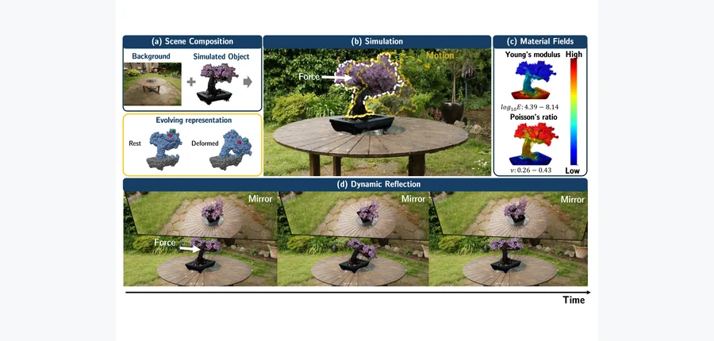 arXiv New 2026-09-30 · cs.CV · #1 **[PowerSim: Differentiable Physics Simulation and Rendering with Power Diagrams](https://arxiv.org/abs/2609.38153)** Trong-Tung Nguyen, Anand Bhattad 机构：Johns Hopkins University（PDF 首页） [Paper](https://arxiv.org/abs/2609.38153) · [Project](https://power-sim.github.io) · [图源](https://arxiv.org/html/2609.38153v1/teaser.png) | 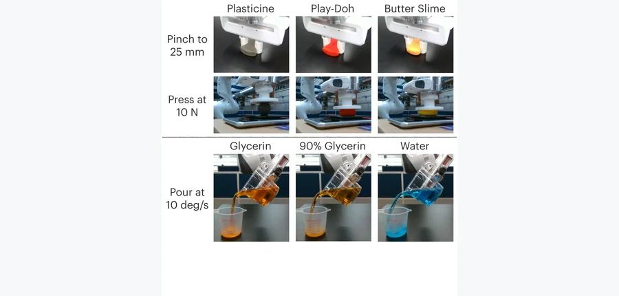 arXiv New 2026-09-30 · cs.RO · #2 **[FORM: Robot Manipulation through Direct Material Law Identification](https://arxiv.org/abs/2609.38105)** Stepan Tretiakov, Ruihan Zhao, Cheng-Hsi Hsiao, Xingjian Li, Adam Thorpe, Hassan Iqbal, Sandeep Chinchali, Ufuk Topcu, Kri… 机构：University of California, Berkeley / The University of Texas at Austin（PDF 首页） [Paper](https://arxiv.org/abs/2609.38105) · [图源](https://arxiv.org/html/2609.38105v1/Fig-1.png) | 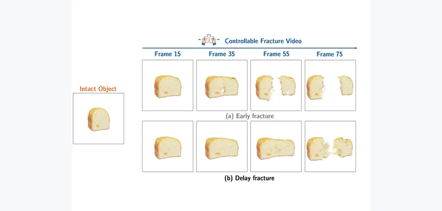 arXiv New 2026-09-30 · cs.CV · #3 **[FracGen: Learning How Objects Stretch and Tear with Physics-Informed Video Generation](https://arxiv.org/abs/2609.38152)** Trong-Tung Nguyen, Jiahan Zhang, Anand Bhattad 机构：Johns Hopkins University（PDF 首页） [Paper](https://arxiv.org/abs/2609.38152) · [Project](https://fracgen.github.io) · [图源](https://arxiv.org/html/2609.38152v1/teaser.png) |
| 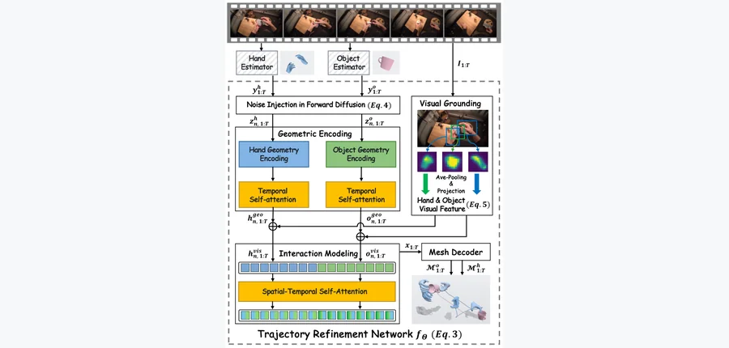 arXiv New 2026-09-30 · cs.CV · #4 **[DynamicHOI: Coupled Dynamics for Physics-aware HOI Reconstruction](https://arxiv.org/abs/2609.36454)** Wenliang Guo, Zhanbo Huang, Yu Kong 机构：Michigan State University（PDF 首页） [Paper](https://arxiv.org/abs/2609.36454) · [图源](https://arxiv.org/html/2609.36454v1/framework.png) | 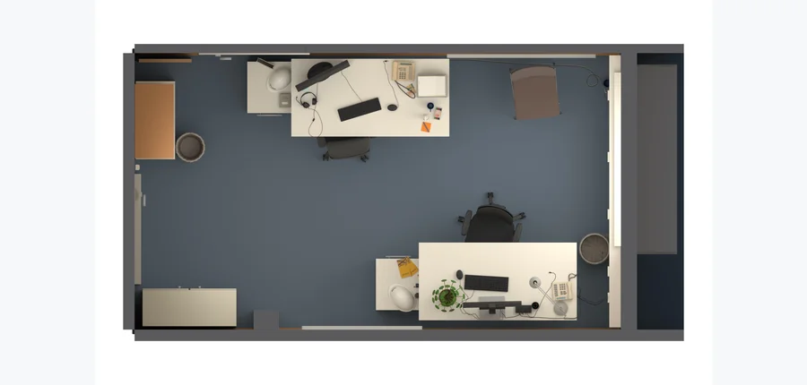 arXiv New 2026-09-30 · cs.CV · #5 **[CoDimRecon: Agentic Reconstruction of Sim-Ready 3D Scenes with Deformable Curves, Surfaces, and Volumes](https://arxiv.org/abs/2609.36024)** Shuzhao Xie, Lelin Wang, Guying Lin, Zhi Wang, Minchen Li 机构：Tsinghua University / Carnegie Mellon University / Genesis AI（PDF 首页） [Paper](https://arxiv.org/abs/2609.36024) · [Project](https://shuzhaoxie.github.io/CoDimRecon/) · [图源](https://arxiv.org/pdf/2609.36024) | 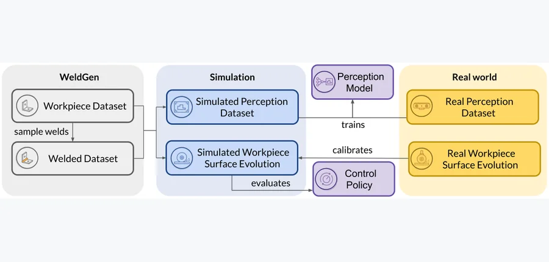 arXiv New 2026-09-30 · cs.RO · #6 **[RoboFin3D: A Sim-to-Real Platform for Robotic Surface Finishing](https://arxiv.org/abs/2609.37560)** Haowei Wen, Shangtao Li, Vaibhav Sanjay, Philip Huang, Jiaoyang Li, Changliu Liu 机构：Carnegie Mellon University（PDF 首页） [Paper](https://arxiv.org/abs/2609.37560) · [图源](https://arxiv.org/html/2609.37560v1/overview.png) |
| 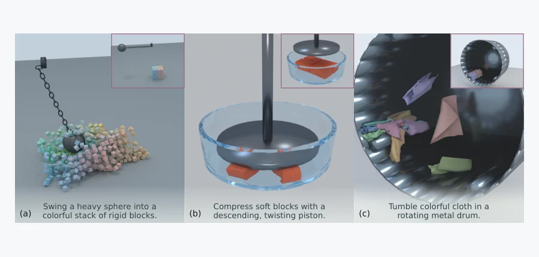 arXiv New 2026-09-30 · cs.GR · #7 **[Text2Sim: Agentic Physics-Based Simulation Generation with Distilled Expertise](https://arxiv.org/abs/2609.36593)** Xiaoyu Xiong, Tsun-Hsuan Wang, Yi-Ling Qiao, Tao Du, Minchen Li 机构：Carnegie Mellon University / Tsinghua University / Genesis AI / Shanghai Qi Zhi Institute（PDF 首页） [Paper](https://arxiv.org/abs/2609.36593) · [图源](https://arxiv.org/html/2609.36593v1/teaser.png) | 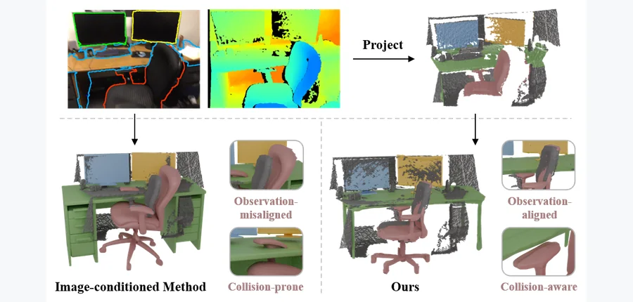 arXiv New 2026-09-30 · cs.CV · #8 **[Collision-Aware and Observation-Aligned Object-Centric Scene Reconstruction from Point Cloud](https://arxiv.org/abs/2609.37260)** Yuxuan Xie, Xuan Yu, Rong Xiong, Yue Wang 机构：Zhejiang University（PDF 首页） [Paper](https://arxiv.org/abs/2609.37260) · [图源](https://arxiv.org/html/2609.37260v1/fig/vis_teaser_new.png) | 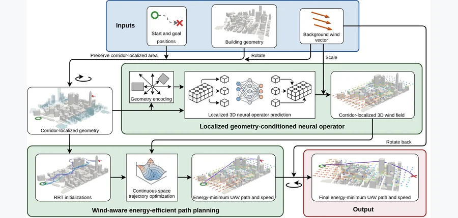 arXiv New 2026-09-30 · cs.AI · #9 **[GeoWind2Plan: Mission-Time 3D Urban Wind Prediction for Energy-Efficient UAV Planning](https://arxiv.org/abs/2609.36056)** Shaoxiang Qin, Yucheng Zhao, Fuyuan Lyu, Di Zhou, Jiachen Yao, Xue Liu, Anima Anandkumar, Liangzhu Leon Wang, Xiongye Xiao 机构：University of Tennessee, Knoxville / Concordia University / McGill University / MBZUAI / California Institute of Technology（PDF 首页） [Paper](https://arxiv.org/abs/2609.36056) · [图源](https://arxiv.org/html/2609.36056v1/FNO_uav.png) |
| 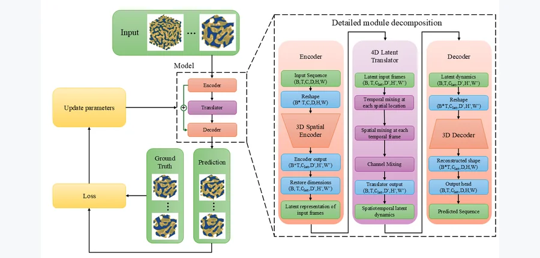 arXiv New 2026-09-30 · cs.LG · #10 **[Efficient and Scalable Physics-Guided Fully Convolutional Spatiotemporal Learning for 3D Microstructure Evolution Prediction](https://arxiv.org/abs/2609.36504)** Michael Trimboli, Wenxi Liu, Xianqi Li 机构：Florida Institute of Technology（PDF 首页） [Paper](https://arxiv.org/abs/2609.36504) · [图源](https://arxiv.org/html/2609.36504v1/SimVP_4D_draft_v9.png) | 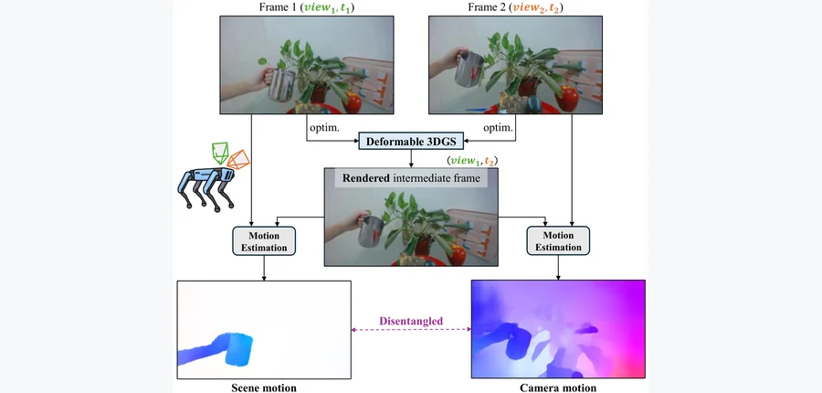 arXiv New 2026-09-30 · cs.CV · #11 **[DispFlow-GS: Displacement Flow Supervision with Motion Disentangling for Monocular Deformable 3D Gaussian Splatting](https://arxiv.org/abs/2609.36940)** Thai Duy Nguyen, Haitian Zhang, Addison Lin Wang 机构：Nanyang Technological University（PDF 首页） [Paper](https://arxiv.org/abs/2609.36940) · [图源](https://arxiv.org/html/2609.36940v1/DispFlowgs-teaser-vertical.png) | 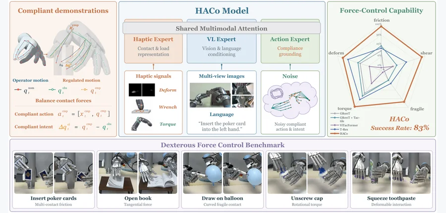 arXiv New 2026-09-30 · cs.RO · #12 **[HACo: Learning Haptic Active Compliance for Force-Aware Dexterous Manipulation](https://arxiv.org/abs/2609.36596)** Naisheng Ye, Yinzhe Zhou, Junkai Zhao, Yuhang Lu, Checheng Yu, Zhenjie Yang, Pengwei Wang, Hongyang Li 机构：The University of Hong Kong / Beijing Academy of Artificial Intelligence / Johns Hopkins University（PDF 首页） [Paper](https://arxiv.org/abs/2609.36596) · [Project](https://opendrivelab.github.io/Haco-Page/) · [图源](https://arxiv.org/html/2609.36596v1/fig01-teaser.png) |
| 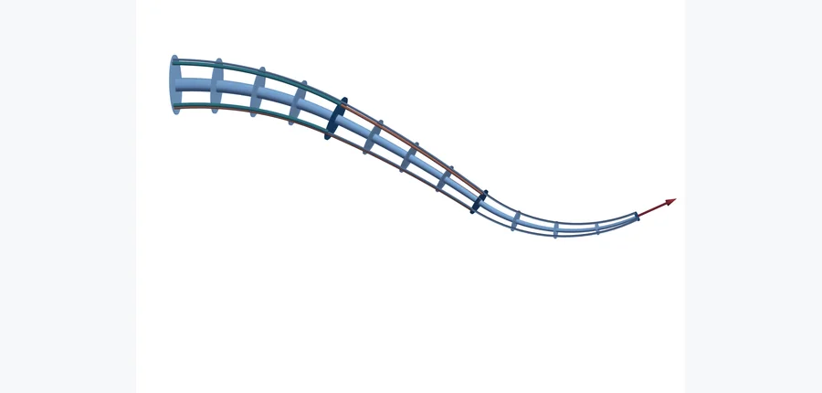 arXiv New 2026-09-30 · cs.RO · #13 **[Closed-Form Cartesian Forward Kinetostatics for Spatial Multi-Segment Tendon-Driven Continuum Robots](https://arxiv.org/abs/2609.36495)** Ke Wu, Fangju Yang, Xiaohui Zhang, Junda He, Guanjun Bao, Jingang Yi, Jian S. Dai 机构：affiliation 未确认 [Paper](https://arxiv.org/abs/2609.36495) · [图源](https://arxiv.org/pdf/2609.36495) | 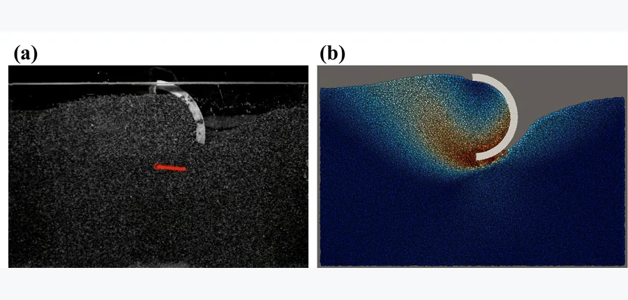 arXiv New 2026-09-30 · cs.RO · #14 **[Inferring Soil Friction Angle from Robot Foot-Ground Force Histories: A Bayesian Inverse Approach to Proprioceptive Soil Sensing](https://arxiv.org/abs/2609.36582)** Dawei Xu, Zhijie Wang 机构：Washington State University（PDF 首页） [Paper](https://arxiv.org/abs/2609.36582) · [图源](https://arxiv.org/html/2609.36582v1/comparison_exp_and_MPM_rcleg.png) | 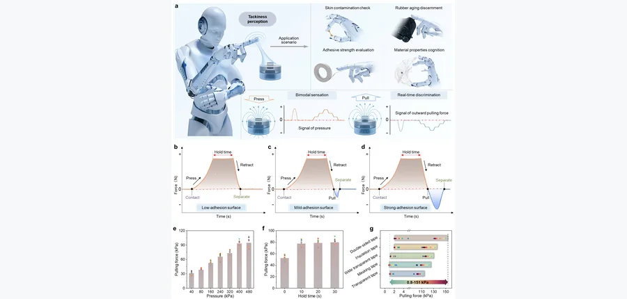 arXiv New 2026-09-30 · cs.RO · #15 **[A robust single-sensing-element tactile sensor for concurrent pressure and tackiness detection with real-time signal decoupling capability](https://arxiv.org/abs/2609.36558)** Ying Yang, Mingwei Gu, Jia-Sen Xie, Xingyu Ma, Yan-Na Lu, Lin Zheng, Jinhui Gu, Junshuai Chen, Yunjie Lu, Denys Makarov, J… 机构：Sun Yat-Sen University / Helmholtz-Zentrum Dresden-Rossendorf（PDF 首页） [Paper](https://arxiv.org/abs/2609.36558) · [图源](https://arxiv.org/pdf/2609.36558) |
| 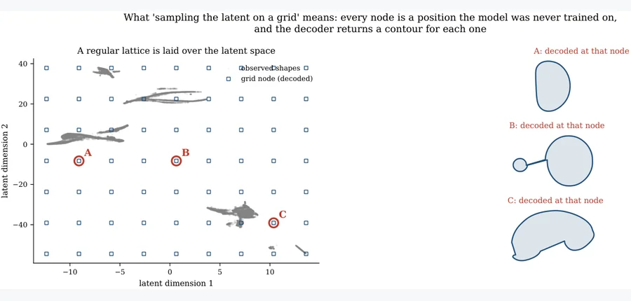 arXiv New 2026-09-30 · physics.flu-dyn · #16 **[A shape-similarity latent space for fluid interfaces: invertible reduced-order modelling of droplet morphology](https://arxiv.org/abs/2609.37947)** Ali R. Hashemi, Mohammad R. Hashemi, Pavel B. Ryzhakov 机构：CIMNE / Universitat Politècnica de Catalunya（PDF 首页） [Paper](https://arxiv.org/abs/2609.37947) · [图源](https://arxiv.org/html/2609.37947v1/fig04_grid_explainer.png) | 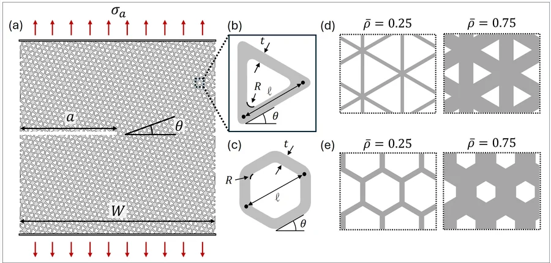 arXiv New 2026-09-30 · cond-mat.mtrl-sci · #17 **[Fracture of Lattice Materials from Low to High Relative Density](https://arxiv.org/abs/2609.36166)** Adam P. Taylor, Sage Fulco, Kevin T. Turner 机构：University of Pennsylvania（PDF 首页） [Paper](https://arxiv.org/abs/2609.36166) · [图源](https://arxiv.org/html/2609.36166v1/Fig1.jpg) | 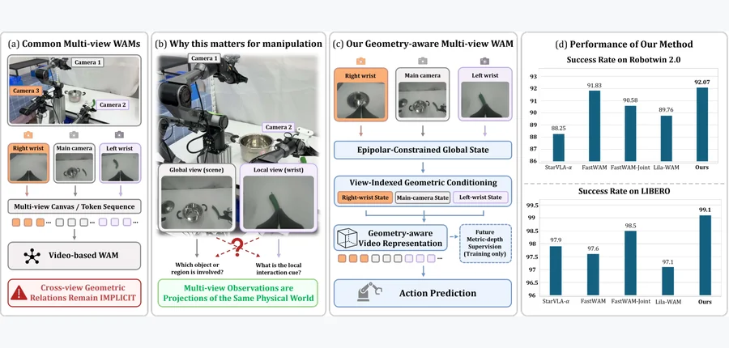 arXiv New 2026-09-30 · cs.RO · #18 **[MVG-WAM: Multiple View Geometry-Aware World-Action Modeling for Robotic Manipulation](https://arxiv.org/abs/2609.37793)** Wenbo Chen, Tianfu Li, Haoxuan Xu, Zhihao Cao, Zhenghan Chen, Zhengming Zhu, Zizhou Luo, Guosheng Yang, Yuan Liu, Lujia Wa… 机构：Hong Kong University of Science and Technology / ETH Zurich / Zhejiang University / EPFL / University of Zurich / Chinese University of Hong Kong（PDF 首页） [Paper](https://arxiv.org/abs/2609.37793) · [Project](https://bobc-123.github.io/MVG-WAM/) · [图源](https://arxiv.org/html/2609.37793v1/1.11.png) |
| 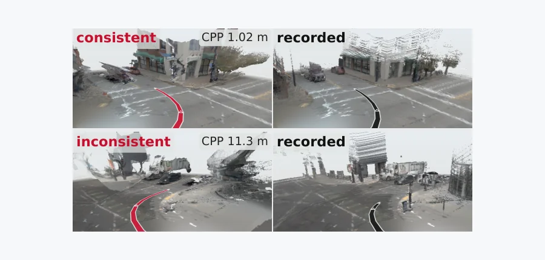 arXiv New 2026-09-30 · cs.RO · #19 **[PhysWAM: Physically Consistent World Action Model for Autonomous Driving](https://arxiv.org/abs/2609.37970)** Dhruv Parikh, Fengcheng Yu, Quankai Gao, Jiawei Yang, Junjie Ye, Maulik Bhatt, Thang Vu, Charles Ochoa, Rowan McAllister… 机构：University of Southern California / Woven by Toyota / Toyota Research Institute / DEVCOM Army Research Office（PDF 首页） [Paper](https://arxiv.org/abs/2609.37970) · [图源](https://arxiv.org/html/2609.37970v1/tile_a.png) | 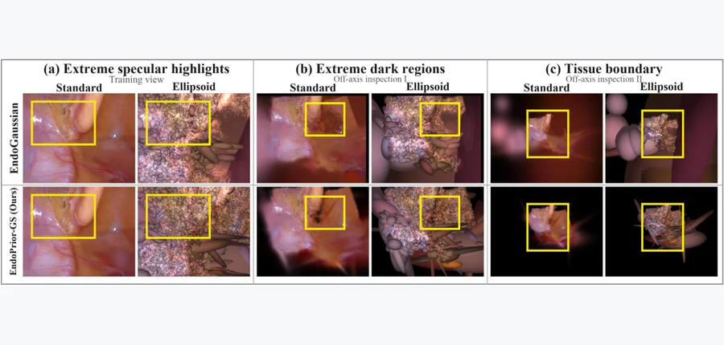 arXiv New 2026-09-30 · cs.CV · #20 **[EndoPrior-GS: Dynamic Endoscopic Reconstruction with a Joint Texture Prior](https://arxiv.org/abs/2609.37874)** Jiaqi Huang, Shidong Wang, Tong Xin, Kabita Adhikari 机构：Newcastle University（PDF 首页） [Paper](https://arxiv.org/abs/2609.37874) · [图源](https://arxiv.org/html/2609.37874v1/intro_relayout_2x6_moderate_vertical_labels.png) | 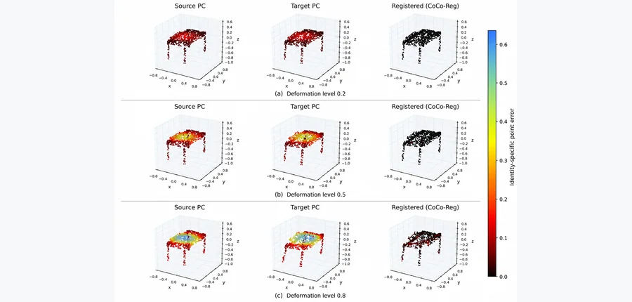 arXiv New 2026-09-30 · cs.CV · #21 **[Context without Commitment: Robust Dense Correspondence under Non-Rigid Deformation](https://arxiv.org/abs/2609.37071)** Yuzhen He, Sara Homscheid 机构：Heidelberg University（PDF 首页） [Paper](https://arxiv.org/abs/2609.37071) · [图源](https://arxiv.org/html/2609.37071v1/figures/CoCo-Reg_qualitative_deformation_final.png) |
| 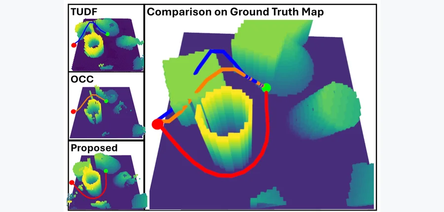 arXiv New 2026-09-30 · cs.RO · #22 **[Planning Oriented 3D Scene Completion via Coupled TUDF Occupancy Representation Learning from Partial Observations](https://arxiv.org/abs/2609.36543)** Tianyou Yu, Pengfei Zhao, Chao Xu 机构：Zhejiang University（PDF 首页） [Paper](https://arxiv.org/abs/2609.36543) · [图源](https://arxiv.org/html/2609.36543v1/pictures/experiments/traj/example.png) | 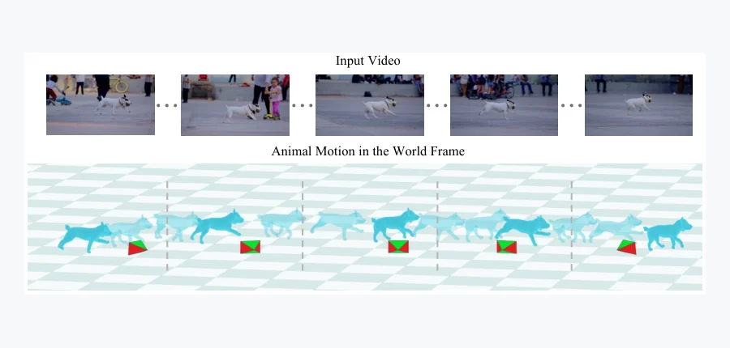 arXiv New 2026-09-30 · cs.CV · #23 **[ORMA: Optimization-based Monocular 4D Reconstruction of Articulated Animals](https://arxiv.org/abs/2609.37986)** Xuyi Hu, Francesco Palandra, Shangzhe Wu, Daniel Cremers, Riccardo Marin, Silvia Zuffi 机构：University of Cambridge / IMATI-CNR / Technical University of Munich（PDF 首页） [Paper](https://arxiv.org/abs/2609.37986) · [图源](https://arxiv.org/html/2609.37986v1/teaser8.png) | 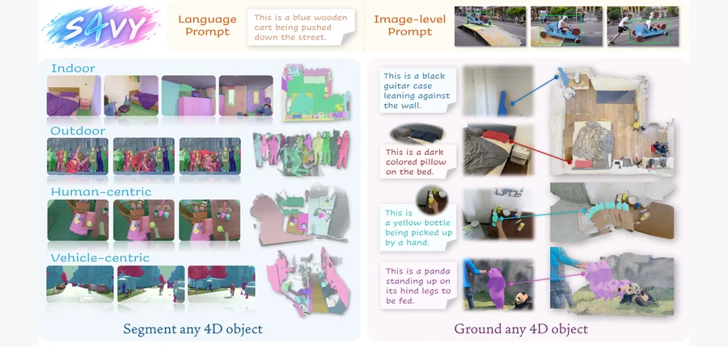 arXiv New 2026-09-30 · cs.CV · #24 **[S4VY: Segment Anything in Feed-Forward 4D Visual Geometry](https://arxiv.org/abs/2609.36875)** Jingdong Zhang, Xin Li, Jan Kautz, Wenping Wang, Chris Choy 机构：Texas A&amp;M University / NVIDIA（PDF 首页） [Paper](https://arxiv.org/abs/2609.36875) · [图源](https://arxiv.org/html/2609.36875v1/figures_final/teaser.jpg) |
| 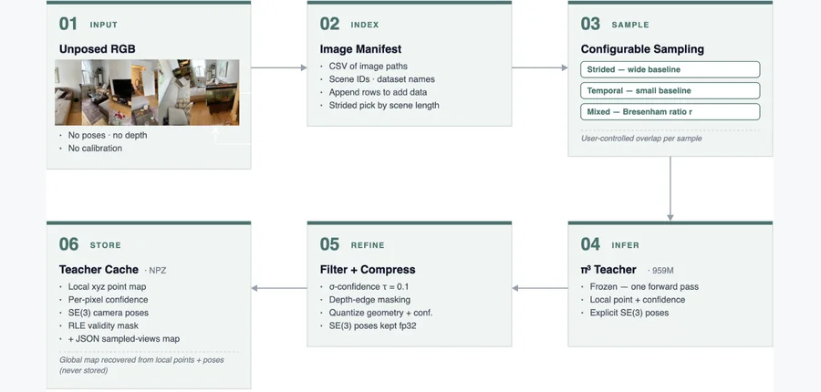 arXiv New 2026-09-30 · cs.CV · #25 **[OTT3R: Multi-View 3D Reconstruction and Fast Dataset Generation at 1% Compute](https://arxiv.org/abs/2609.36374)** Brandon Leblanc, Charalambos Poullis 机构：Concordia University（PDF 首页） [Paper](https://arxiv.org/abs/2609.36374) · [图源](https://arxiv.org/html/2609.36374v1/figures/pseudo_label_gen.png) |   |   |
<!-- PAPER_CARDS_END -->

## 检索概况

- **官方批次与窗口**：[arXiv 官方 New](https://arxiv.org/list/cs/new?show=2000) 页面标注 Wednesday, 30 September 2026；北京时间 2026-10-01 09:00 起检索。覆盖 [cs](https://arxiv.org/list/cs/new?show=2000)、[physics](https://arxiv.org/list/physics/new?show=2000)、[cond-mat](https://arxiv.org/list/cond-mat/new?show=2000)、[math](https://arxiv.org/list/math/new?show=2000)、[stat.ML](https://arxiv.org/list/stat.ML/new?show=2000)、[eess.IV](https://arxiv.org/list/eess.IV/new?show=2000)、[eess.SY](https://arxiv.org/list/eess.SY/new?show=2000)、[eess.SP](https://arxiv.org/list/eess.SP/new?show=2000) 的 New；其中 cs 页含 cs.CV、cs.GR、cs.RO、cs.AI、cs.LG。eess 总页返回 HTTP 406，改核验上述相关子分类。
- **总命中与入选**：8 个官方分类页共 **2,046 条 New**，按 arXiv ID 去重为 **1,977 篇**；经标题与摘要人工语义筛选，入选 **25 篇**。Cross 与 Replacement 不进入主榜。
- **排序口径（推断）**：先 3D 几何与动力学、材料、接触、断裂或仿真的直接结合，再物理约束的 4D 与机器人交互，最后基础 3D/4D。相关性、机构强度、局限与改进建议均属本日报推断。
- **事实核实**：标题、作者、分类、摘要链接指向各篇 [arXiv](https://arxiv.org/) 官方条目；机构依据各篇官方 PDF 首页，无法可靠读取的条目标为“affiliation 未确认”。

## Top papers

| # | 标题 | 论文来源 | 分类 | 作者 | 机构 | 相关性（推断） | 机构强度（推断） | 阅读优先级（推断） |
|---:|---|---|---|---|---|---|---|---|
| 1 | PowerSim: Differentiable Physics Simulation and Rendering with Power Diagrams | [arXiv:2609.38153](https://arxiv.org/abs/2609.38153) | cs.CV | Trong-Tung Nguyen, Anand Bhattad | Johns Hopkins University（PDF 首页） | 高 | 高 | 高 |
| 2 | FORM: Robot Manipulation through Direct Material Law Identification | [arXiv:2609.38105](https://arxiv.org/abs/2609.38105) | cs.RO | Stepan Tretiakov, Ruihan Zhao, Cheng-Hsi Hsiao, Xingjian Li, Adam Thorpe, Hassan Iqbal, Sandeep Chinchali, Ufuk Topcu, Krishna Kumar | University of California, Berkeley / The University of Texas at Austin（PDF 首页） | 高 | 高 | 高 |
| 3 | FracGen: Learning How Objects Stretch and Tear with Physics-Informed Video Generation | [arXiv:2609.38152](https://arxiv.org/abs/2609.38152) | cs.CV | Trong-Tung Nguyen, Jiahan Zhang, Anand Bhattad | Johns Hopkins University（PDF 首页） | 高 | 高 | 高 |
| 4 | DynamicHOI: Coupled Dynamics for Physics-aware HOI Reconstruction | [arXiv:2609.36454](https://arxiv.org/abs/2609.36454) | cs.CV | Wenliang Guo, Zhanbo Huang, Yu Kong | Michigan State University（PDF 首页） | 高 | 高 | 高 |
| 5 | CoDimRecon: Agentic Reconstruction of Sim-Ready 3D Scenes with Deformable Curves, Surfaces, and Volumes | [arXiv:2609.36024](https://arxiv.org/abs/2609.36024) | cs.CV | Shuzhao Xie, Lelin Wang, Guying Lin, Zhi Wang, Minchen Li | Tsinghua University / Carnegie Mellon University / Genesis AI（PDF 首页） | 高 | 高 | 高 |
| 6 | RoboFin3D: A Sim-to-Real Platform for Robotic Surface Finishing | [arXiv:2609.37560](https://arxiv.org/abs/2609.37560) | cs.RO | Haowei Wen, Shangtao Li, Vaibhav Sanjay, Philip Huang, Jiaoyang Li, Changliu Liu | Carnegie Mellon University（PDF 首页） | 高 | 高 | 高 |
| 7 | Text2Sim: Agentic Physics-Based Simulation Generation with Distilled Expertise | [arXiv:2609.36593](https://arxiv.org/abs/2609.36593) | cs.GR | Xiaoyu Xiong, Tsun-Hsuan Wang, Yi-Ling Qiao, Tao Du, Minchen Li | Carnegie Mellon University / Tsinghua University / Genesis AI / Shanghai Qi Zhi Institute（PDF 首页） | 高 | 高 | 高 |
| 8 | Collision-Aware and Observation-Aligned Object-Centric Scene Reconstruction from Point Cloud | [arXiv:2609.37260](https://arxiv.org/abs/2609.37260) | cs.CV | Yuxuan Xie, Xuan Yu, Rong Xiong, Yue Wang | Zhejiang University（PDF 首页） | 高 | 高 | 高 |
| 9 | GeoWind2Plan: Mission-Time 3D Urban Wind Prediction for Energy-Efficient UAV Planning | [arXiv:2609.36056](https://arxiv.org/abs/2609.36056) | cs.AI | Shaoxiang Qin, Yucheng Zhao, Fuyuan Lyu, Di Zhou, Jiachen Yao, Xue Liu, Anima Anandkumar, Liangzhu Leon Wang, Xiongye Xiao | University of Tennessee, Knoxville / Concordia University / McGill University / MBZUAI / California Institute of Technology（PDF 首页） | 高 | 高 | 高 |
| 10 | Efficient and Scalable Physics-Guided Fully Convolutional Spatiotemporal Learning for 3D Microstructure Evolution Prediction | [arXiv:2609.36504](https://arxiv.org/abs/2609.36504) | cs.LG | Michael Trimboli, Wenxi Liu, Xianqi Li | Florida Institute of Technology（PDF 首页） | 高 | 高 | 高 |
| 11 | DispFlow-GS: Displacement Flow Supervision with Motion Disentangling for Monocular Deformable 3D Gaussian Splatting | [arXiv:2609.36940](https://arxiv.org/abs/2609.36940) | cs.CV | Thai Duy Nguyen, Haitian Zhang, Addison Lin Wang | Nanyang Technological University（PDF 首页） | 高 | 中 | 高 |
| 12 | HACo: Learning Haptic Active Compliance for Force-Aware Dexterous Manipulation | [arXiv:2609.36596](https://arxiv.org/abs/2609.36596) | cs.RO | Naisheng Ye, Yinzhe Zhou, Junkai Zhao, Yuhang Lu, Checheng Yu, Zhenjie Yang, Pengwei Wang, Hongyang Li | The University of Hong Kong / Beijing Academy of Artificial Intelligence / Johns Hopkins University（PDF 首页） | 高 | 中 | 高 |
| 13 | Closed-Form Cartesian Forward Kinetostatics for Spatial Multi-Segment Tendon-Driven Continuum Robots | [arXiv:2609.36495](https://arxiv.org/abs/2609.36495) | cs.RO | Ke Wu, Fangju Yang, Xiaohui Zhang, Junda He, Guanjun Bao, Jingang Yi, Jian S. Dai | affiliation 未确认 | 高 | 中 | 中 |
| 14 | Inferring Soil Friction Angle from Robot Foot-Ground Force Histories: A Bayesian Inverse Approach to Proprioceptive Soil Sensing | [arXiv:2609.36582](https://arxiv.org/abs/2609.36582) | cs.RO | Dawei Xu, Zhijie Wang | Washington State University（PDF 首页） | 高 | 中 | 中 |
| 15 | A robust single-sensing-element tactile sensor for concurrent pressure and tackiness detection with real-time signal decoupling capability | [arXiv:2609.36558](https://arxiv.org/abs/2609.36558) | cs.RO | Ying Yang, Mingwei Gu, Jia-Sen Xie, Xingyu Ma, Yan-Na Lu, Lin Zheng, Jinhui Gu, Junshuai Chen, Yunjie Lu, Denys Makarov, Jin Ge | Sun Yat-Sen University / Helmholtz-Zentrum Dresden-Rossendorf（PDF 首页） | 高 | 中 | 中 |
| 16 | A shape-similarity latent space for fluid interfaces: invertible reduced-order modelling of droplet morphology | [arXiv:2609.37947](https://arxiv.org/abs/2609.37947) | physics.flu-dyn | Ali R. Hashemi, Mohammad R. Hashemi, Pavel B. Ryzhakov | CIMNE / Universitat Politècnica de Catalunya（PDF 首页） | 高 | 中 | 中 |
| 17 | Fracture of Lattice Materials from Low to High Relative Density | [arXiv:2609.36166](https://arxiv.org/abs/2609.36166) | cond-mat.mtrl-sci | Adam P. Taylor, Sage Fulco, Kevin T. Turner | University of Pennsylvania（PDF 首页） | 高 | 中 | 中 |
| 18 | MVG-WAM: Multiple View Geometry-Aware World-Action Modeling for Robotic Manipulation | [arXiv:2609.37793](https://arxiv.org/abs/2609.37793) | cs.RO | Wenbo Chen, Tianfu Li, Haoxuan Xu, Zhihao Cao, Zhenghan Chen, Zhengming Zhu, Zizhou Luo, Guosheng Yang, Yuan Liu, Lujia Wang, Wen Chen, Haoang Li | Hong Kong University of Science and Technology / ETH Zurich / Zhejiang University / EPFL / University of Zurich / Chinese University of Hong Kong（PDF 首页） | 高 | 中 | 中 |
| 19 | PhysWAM: Physically Consistent World Action Model for Autonomous Driving | [arXiv:2609.37970](https://arxiv.org/abs/2609.37970) | cs.RO | Dhruv Parikh, Fengcheng Yu, Quankai Gao, Jiawei Yang, Junjie Ye, Maulik Bhatt, Thang Vu, Charles Ochoa, Rowan McAllister, Igor Vasiljevic, Rajgopal Kannan, Viktor Prasanna, Vitor Guizilini, Yue Wang | University of Southern California / Woven by Toyota / Toyota Research Institute / DEVCOM Army Research Office（PDF 首页） | 高 | 中 | 中 |
| 20 | EndoPrior-GS: Dynamic Endoscopic Reconstruction with a Joint Texture Prior | [arXiv:2609.37874](https://arxiv.org/abs/2609.37874) | cs.CV | Jiaqi Huang, Shidong Wang, Tong Xin, Kabita Adhikari | Newcastle University（PDF 首页） | 中 | 中 | 中 |
| 21 | Context without Commitment: Robust Dense Correspondence under Non-Rigid Deformation | [arXiv:2609.37071](https://arxiv.org/abs/2609.37071) | cs.CV | Yuzhen He, Sara Homscheid | Heidelberg University（PDF 首页） | 中 | 中 | 中 |
| 22 | Planning Oriented 3D Scene Completion via Coupled TUDF Occupancy Representation Learning from Partial Observations | [arXiv:2609.36543](https://arxiv.org/abs/2609.36543) | cs.RO | Tianyou Yu, Pengfei Zhao, Chao Xu | Zhejiang University（PDF 首页） | 中 | 中 | 中 |
| 23 | ORMA: Optimization-based Monocular 4D Reconstruction of Articulated Animals | [arXiv:2609.37986](https://arxiv.org/abs/2609.37986) | cs.CV | Xuyi Hu, Francesco Palandra, Shangzhe Wu, Daniel Cremers, Riccardo Marin, Silvia Zuffi | University of Cambridge / IMATI-CNR / Technical University of Munich（PDF 首页） | 中 | 中 | 中 |
| 24 | S4VY: Segment Anything in Feed-Forward 4D Visual Geometry | [arXiv:2609.36875](https://arxiv.org/abs/2609.36875) | cs.CV | Jingdong Zhang, Xin Li, Jan Kautz, Wenping Wang, Chris Choy | Texas A&M University / NVIDIA（PDF 首页） | 中 | 中 | 中 |
| 25 | OTT3R: Multi-View 3D Reconstruction and Fast Dataset Generation at 1% Compute | [arXiv:2609.36374](https://arxiv.org/abs/2609.36374) | cs.CV | Brandon Leblanc, Charalambos Poullis | Concordia University（PDF 首页） | 中 | 中 | 中 |

## 逐篇中文要点

### 1. [PowerSim: Differentiable Physics Simulation and Rendering with Power Diagrams](https://arxiv.org/abs/2609.38153)

- [事实] 把 PowerFoam 的三维 power diagram 表示直接接入 MPM，使形变同时驱动几何与外观。
- [事实] 展示静态场景受力仿真、空间变化材料场反演、跨场景物体组合和随形变变化的反射。
- [推断] 应报告材料反演的可辨识性、梯度稳定性与多视角几何误差，不能只凭渲染质量判定物理正确。

### 2. [FORM: Robot Manipulation through Direct Material Law Identification](https://arxiv.org/abs/2609.38105)

- [事实] 用弱形式动量守恒把观测到的形变与接触力转为材料参数的线性方程，并与前向 MPM 离散保持一致。
- [事实] 论文称单次交互识别在四类材料上由迭代方法约 10–25 分钟降至 2–5 秒，并在四项操作任务中复用模型。
- [推断] 需在传感噪声、未建模摩擦及材料模型失配下检验参数置信度和后续规划收益。

### 3. [FracGen: Learning How Objects Stretch and Tear with Physics-Informed Video Generation](https://arxiv.org/abs/2609.38152)

- [事实] 用带连续损伤模型的 MPM 生成断裂视频与像素对齐物理场，以物理场联合预测约束视频生成。
- [事实] 从完整物体单图出发，可按材料、施力与断裂条件控制撕裂位置和传播速度。
- [推断] 视觉逼真和断裂力学仍需分开评价，尤其要检查裂纹路径、损伤阈值与真实实验的一致性。

### 4. [DynamicHOI: Coupled Dynamics for Physics-aware HOI Reconstruction](https://arxiv.org/abs/2609.36454)

- [事实] 从单目手物视频重建交互，结合手部逆动力学与物体 Newton–Euler 动力学，并经接触力传递耦合。
- [事实] 利用恢复的主动手部驱动力分布作先验；摘要称三个 HOI 数据集的手与物重建均改善。
- [推断] 应以独立接触力测量或物理重放验证力估计，避免仅用轨迹误差支撑力学结论。

### 5. [CoDimRecon: Agentic Reconstruction of Sim-Ready 3D Scenes with Deformable Curves, Surfaces, and Volumes](https://arxiv.org/abs/2609.36024)

- [事实] 从多视角 RGB 建立可编辑场景，将可变形物分别表示为杆状曲线、薄壳曲面和可体网格化实体。
- [事实] 用仿真器技能初始化物理模型和参数，再以行为测试定位几何、数值或材料模型不匹配。
- [推断] 需统计不同维度资产的拓扑有效率和真实交互重放误差，区分视觉重建与仿真可用性。

### 6. [RoboFin3D: A Sim-to-Real Platform for Robotic Surface Finishing](https://arxiv.org/abs/2609.37560)

- [事实] 以 SDF 表示工件材料去除后的变化几何，并用独立表面场表示打磨外观变化。
- [事实] 基于 Isaac Sim 与 Newton 建立研磨/砂磨 sim-to-real 平台，参数以真实实验校准，并给出多样焊缝资产。
- [推断] 关键是检验不同材料、工具磨损和接触压力变化时的去除深度与表面质量外推。

### 7. [Text2Sim: Agentic Physics-Based Simulation Generation with Distilled Expertise](https://arxiv.org/abs/2609.36593)

- [事实] 把文本请求转换为 Genesis 可执行、可编辑的刚体、关节、软体或布料仿真案例。
- [事实] Planner、专门 Writer、独立 Critic 与从示范蒸馏的调试卡片协作；摘要报告 42 个留出提示的物理及视觉评分。
- [推断] 需独立核验质量评分器对守恒、接触穿透与材料参数的敏感度，防止视觉偏好掩盖物理错误。

### 8. [Collision-Aware and Observation-Aligned Object-Centric Scene Reconstruction from Point Cloud](https://arxiv.org/abs/2609.37260)

- [事实] COOL 以实例与背景点云条件化物体生成，使局部几何在场景尺度中对齐。
- [事实] 在推理中联合优化、重采样并施加显式碰撞损失；摘要报告 3D-Front 与 Scan2CAD 的场景保真和碰撞改善。
- [推断] 应评估细薄结构、遮挡严重场景及接触边界处的误报，量化减少穿透是否牺牲形状细节。

### 9. [GeoWind2Plan: Mission-Time 3D Urban Wind Prediction for Energy-Efficient UAV Planning](https://arxiv.org/abs/2609.36056)

- [事实] 从 3D 建筑几何、背景风向和起终点预测局部三维风场，再优化无人机路径与速度。
- [事实] 采用建筑坐标变换、局部几何条件神经算子及风场拼接，以缩短逐次 CFD 计算时间。
- [推断] 需在未见建筑形态与风向突变条件下比较风速误差、路径可行性和真实飞行能耗。

### 10. [Efficient and Scalable Physics-Guided Fully Convolutional Spatiotemporal Learning for 3D Microstructure Evolution Prediction](https://arxiv.org/abs/2609.36504)

- [事实] 用共享 3D 编解码器和分解式时空 latent translator 预测完整微观结构序列。
- [事实] 训练中加入离散 Cahn–Hilliard 残差；摘要报告标称时域 3D SSIM 大于 0.97，且相对相场求解器加速超过 30 倍。
- [推断] 应追踪质量守恒、界面曲率与长时相粗化指数，验证快速预测未破坏动力学。

### 11. [DispFlow-GS: Displacement Flow Supervision with Motion Disentangling for Monocular Deformable 3D Gaussian Splatting](https://arxiv.org/abs/2609.36940)

- [事实] 将每个 Gaussian 的三维位移投影并 splat 到图像平面形成位移流监督，替代渲染 Gaussian flow 对齐光流。
- [事实] 用中间视角渲染分离相机与场景运动，并提出形变—渲染一致性指标。
- [推断] 需要独立三维轨迹或形变真值测试运动精度，避免只优化自定义指标。

### 12. [HACo: Learning Haptic Active Compliance for Force-Aware Dexterous Manipulation](https://arxiv.org/abs/2609.36596)

- [事实] 把指尖触觉与关节力矩一起输入门控 haptic cross-attention，预测随接触状态变化的顺应动作。
- [事实] 用顺应遥操作构造训练目标，并以命令—状态偏差提供顺应意图监督；摘要描述多项真实接触任务。
- [推断] 应在相同动作数据与参数规模下消融双模态反馈，并记录接触冲量和脆弱物体损伤。

### 13. [Closed-Form Cartesian Forward Kinetostatics for Spatial Multi-Segment Tendon-Driven Continuum Robots](https://arxiv.org/abs/2609.36495)

- [事实] 以笛卡尔主干中心线与材料扭转表示多段腱驱连续机器人，推导力到构型的闭式积分表达。
- [事实] 报告相对全应变 GVS 的尖端位置偏差与微秒级求解时间，并保留轴向形变和沿段变化的刚度。
- [推断] 结论受纵向非螺旋腱路由等模型假设限制，需在摩擦与滞回下做实物校验。

### 14. [Inferring Soil Friction Angle from Robot Foot-Ground Force Histories: A Bayesian Inverse Approach to Proprioceptive Soil Sensing](https://arxiv.org/abs/2609.36582)

- [事实] 用二维 MPM 旋转腿—土壤模型产生力历史，再经两个高斯过程代理进行土壤内摩擦角贝叶斯反演。
- [事实] 匹配模型测试中，14 个非网格角度的中位绝对误差约 0.1°，最大约 0.7°。
- [推断] 这些误差来自模型匹配条件，需在土壤含水率、凝聚力和腿形失配下重测校准。

### 15. [A robust single-sensing-element tactile sensor for concurrent pressure and tackiness detection with real-time signal decoupling capability](https://arxiv.org/abs/2609.36558)

- [事实] 单个霍尔传感元件配合软磁复合材料，利用压入和黏附拉脱造成的距离变化解耦压力与黏性。
- [事实] 论文强调同一接触点的双模态实时信号和基线稳定性，面向机器人电子皮肤。
- [推断] 应在剪切、温度与长期循环下测信号串扰，再评估抓取策略是否受益。

### 16. [A shape-similarity latent space for fluid interfaces: invertible reduced-order modelling of droplet morphology](https://arxiv.org/abs/2609.37947)

- [事实] 将液滴界面编码为平方根速度函数，经形状相似邻接图和自编码器建立可逆低维表示。
- [事实] 目标是从稀疏高速视频中恢复破碎中间形态并降低大量物理仿真扫描的成本。
- [推断] 应单独验证体积守恒、拓扑变化和未见喷射条件，防止形态相似却违反流体约束。

### 17. [Fracture of Lattice Materials from Low to High Relative Density](https://arxiv.org/abs/2609.36166)

- [事实] 结合均匀化和钝裂纹断裂理论预测不同相对密度下三角与六角晶格的断裂韧性。
- [事实] 有限元分析显示高密度时节点应力集中更关键，裂尖几何与晶格取向会改变失效模式。
- [推断] 需用多方向实体实验检查解析预测，特别是高密度节点缺陷与制造误差。

### 18. [MVG-WAM: Multiple View Geometry-Aware World-Action Modeling for Robotic Manipulation](https://arxiv.org/abs/2609.37793)

- [事实] 用极线约束的全局状态和视角索引几何状态组织同步多相机观测，而非直接拼接图像。
- [事实] 以未来度量深度监督几何状态，用于世界视频与动作联合建模。
- [推断] 应检验外参扰动、视角缺失和接触遮挡时的动作成功率及几何一致性。

### 19. [PhysWAM: Physically Consistent World Action Model for Autonomous Driving](https://arxiv.org/abs/2609.37970)

- [事实] 将多视角视频、度量深度和自车运动在同一 flow-matching 模型中联合去噪。
- [事实] 耦合点投影把生成深度反投影为 3D 点，再与实测 LiDAR 和轨迹对齐以约束几何。
- [推断] 论文中的“物理一致”主要由几何投影监督支撑，还需测试碰撞、动力学可行性与长时滚动。

### 20. [EndoPrior-GS: Dynamic Endoscopic Reconstruction with a Joint Texture Prior](https://arxiv.org/abs/2609.37874)

- [事实] 在动态内镜 3DGS 中结合工具过滤、非镜面光度和组织结构显著性，构造联合纹理先验。
- [事实] 先验指导 Gaussian 初始化、密度控制及时间相邻贡献权重；摘要报告 EndoNeRF、SCARED 的 flow error 改善。
- [推断] 需在明显组织形变、出血或低纹理条件下检查几何可信度和时序稳定性。

### 21. [Context without Commitment: Robust Dense Correspondence under Non-Rigid Deformation](https://arxiv.org/abs/2609.37071)

- [事实] CoCo-Reg 用区域 patch 提供上下文，但最终仍在完整目标点云中搜索点级对应。
- [事实] 以最远点采样建立 patch，跨源/目标交换几何信息，再投回密集点特征。
- [推断] 应在自接触、拓扑变化和近重复局部几何上检查对应不确定性，而非只看平均配准误差。

### 22. [Planning Oriented 3D Scene Completion via Coupled TUDF Occupancy Representation Learning from Partial Observations](https://arxiv.org/abs/2609.36543)

- [事实] 从部分 LiDAR 观测联合预测截断无符号距离场与 voxel 占据，服务三维场景补全和路径规划。
- [事实] 双向耦合学习让边界几何与自由空间占据信息互相约束。
- [推断] 需评价补全错误对规划碰撞率的影响，避免几何指标提升却令可行路径变差。

### 23. [ORMA: Optimization-based Monocular 4D Reconstruction of Articulated Animals](https://arxiv.org/abs/2609.37986)

- [事实] ORMA 先利用生成式 3D 先验恢复实例形状并注册到 SMAL+，再联合逐帧姿态与相机位姿形成 4D 动物模型。
- [事实] 采用 DINO 对应和时间一致性细化，并建立含真实 3D/4D 真值的多物种合成基准 PAW4D。
- [推断] 该工作侧重运动几何，后续可加入地面接触与骨骼动力学检验运动物理可行性。

### 24. [S4VY: Segment Anything in Feed-Forward 4D Visual Geometry](https://arxiv.org/abs/2609.36875)

- [事实] S4VY 把多帧 RGB 的共享视觉几何特征解码为持续物体查询，对应时间一致的 4D 实例掩码。
- [事实] 支持无提示和点/框条件选择，不要求种子掩码或固定时间顺序。
- [推断] 应测试大形变、遮挡再出现时的身份保持，并与真实三维跟踪误差联动评估。

### 25. [OTT3R: Multi-View 3D Reconstruction and Fast Dataset Generation at 1% Compute](https://arxiv.org/abs/2609.36374)

- [事实] 把大模型 π³ 蒸馏为 102M 参数的多视角重建学生模型，并提供点图与 SE(3) 位姿伪标签流水线。
- [事实] 摘要报告相对 959M 教师约 9.4 倍压缩、最高 7 倍推理加速；训练用了两张 GPU。
- [推断] 应在不同场景域与低纹理表面验证几何误差和伪标签偏差，不能只据计算量声明普适性。

## 今日最值得细读的 5 篇

1. [PowerSim](https://arxiv.org/abs/2609.38153)：三维可渲染表示、MPM 与材料反演形成直接方法交叉；优先核对梯度和材料场估计。
2. [FORM](https://arxiv.org/abs/2609.38105)：单次机器人交互推断材料律，适合检验系统辨识和迁移边界。
3. [FracGen](https://arxiv.org/abs/2609.38152)：断裂损伤场进入视频生成，值得区分视觉质量与真实裂纹力学。
4. [DynamicHOI](https://arxiv.org/abs/2609.36454)：把手物轨迹、接触力传递和动力学耦合，值得看力估计证据。
5. [CoDimRecon](https://arxiv.org/abs/2609.36024)：直接面向杆、壳、实体的可仿真场景，值得看行为测试如何驱动重建修正。

## 低算力方法改进机会（推断）

以下建议是基于当日摘要提出的可检验假设，不是论文已报告结果。每项均先用小规模场景验证，再决定是否扩展。

### 1. [FORM](https://arxiv.org/abs/2609.38105)

- **方法改法**：在弱形式最小二乘中加入观测置信度和接触状态联合加权，抑制遮挡点及滑动误配。
- **小实验**：用两类合成材料、三档轨迹噪声和错设摩擦系数，对比参数误差与新动作预测。
- **低算力原因**：只改线性方程权重，不需大模型训练。
- **预期收益**：提升单次交互辨识稳健性。
- **风险**：权重若由同一残差估计，可能掩盖系统性模型偏差。

### 2. [PowerSim](https://arxiv.org/abs/2609.38153)

- **方法改法**：给材料场反演加入稀疏基与局部平滑的可辨识性约束，限制多个参数互相补偿。
- **小实验**：从小型 MPM 方块的两视角位移和图像反演分区弹性模量，做梯度有限差分核对。
- **低算力原因**：少量合成物体与低分辨率网格即可测关键机制。
- **预期收益**：减少视觉相似但材料错误的解。
- **风险**：过强平滑会消除真实材料边界。

### 3. [FracGen](https://arxiv.org/abs/2609.38152)

- **方法改法**：把预测损伤场的单调性与裂纹尖端局部能量上界作为附加损失。
- **小实验**：选 20 个小型 MPM 撕裂案例，对比裂纹路径误差、起裂时间和外观指标。
- **低算力原因**：只需小分辨率短片段或冻结主体后训练轻量适配层。
- **预期收益**：提高可控断裂的力学一致性。
- **风险**：简化能量界可能不适用于复杂非线性材料。

### 4. [DynamicHOI](https://arxiv.org/abs/2609.36454)

- **方法改法**：用接触互补条件过滤仅由轨迹拟合产生的虚假力，并引入接触激活的置信度。
- **小实验**：在少量已知接触力的合成手物序列对比轨迹误差、力误差和穿透。
- **低算力原因**：可在现有轨迹上做后验优化。
- **预期收益**：减少看似合理但不可执行的运动。
- **风险**：接触检测误差可能使约束过紧。

### 5. [COOL](https://arxiv.org/abs/2609.37260)

- **方法改法**：将全局碰撞损失改为观测边界附近的多尺度 SDF 惩罚，并对未知区保留不确定性。
- **小实验**：以 3D-Front 中 50 个遮挡对象对比穿透体积、表面 Chamfer 和薄结构恢复。
- **低算力原因**：可只改推理优化，不重训生成器。
- **预期收益**：减少碰撞同时保留细部。
- **风险**：背景点云噪声可能造成假阳性碰撞。

### 6. [GeoWind2Plan](https://arxiv.org/abs/2609.36056)

- **方法改法**：在建筑转角和尾流区域加入基于边界残差的局部风场修正。
- **小实验**：选择两种未见街区与四个风向，测局部风速误差、规划能耗和路径约束违反。
- **低算力原因**：仅训练小型残差场并使用缓存 CFD。
- **预期收益**：改善关键航段的能量估计。
- **风险**：局部修正难以捕捉远距离涡流。

### 7. [3D 微观结构演化](https://arxiv.org/abs/2609.36504)

- **方法改法**：把 Cahn–Hilliard 质量守恒投影加入每次自回归步，而非只在训练时用残差。
- **小实验**：在小体素立方体上比较 100 步质量漂移、界面面积和 3D SSIM。
- **低算力原因**：投影是廉价数值步骤。
- **预期收益**：抑制长时滚动漂移。
- **风险**：简单投影可能损坏局部界面动力学。

### 8. [DispFlow-GS](https://arxiv.org/abs/2609.36940)

- **方法改法**：对位移流监督加入可见性和遮挡置信度，避免被遮挡 Gaussian 的错误位移梯度。
- **小实验**：用一个有已知相机运动的合成形变场，对比 3D 位移误差、DRC 与 PSNR。
- **低算力原因**：现有训练框架上增加掩码与小场景消融。
- **预期收益**：更准确分离物体与相机运动。
- **风险**：可见性估计出错会屏蔽有用监督。

### 9. [RoboFin3D](https://arxiv.org/abs/2609.37560)

- **方法改法**：建立局部接触压力到 SDF 去除率的在线标定参数，显式分离几何去除和纹理变化。
- **小实验**：两种材料、三个压力档，比较仿真与真实去除深度和表面粗糙度。
- **低算力原因**：少量真实短轨迹加小型参数拟合即可。
- **预期收益**：提升跨材料 sim-to-real。
- **风险**：压力测量或工具磨损会使标定失效。

### 10. [CoCo-Reg](https://arxiv.org/abs/2609.37071)

- **方法改法**：为点级匹配输出多峰对应置信度，并让区域上下文只调权不裁掉备选点。
- **小实验**：用重复几何和自接触合成点云测 top-k 对应召回及下游配准误差。
- **低算力原因**：冻结特征骨干，仅改候选权重和小型匹配头。
- **预期收益**：减少早期错误匹配的不可逆传播。
- **风险**：多峰候选增加推理内存。

## Replacement 观察

本期 Replacement 不进入主榜；本轮未核实到足以单列的重大更新。
