# 2026-10-02 arXiv 每日论文订阅摘要

<!-- PAPER_CARDS_START -->
## 论文卡片

按原日报排名展示；点击标题或 Paper 查看原文，详细中文分析见下方。

| 论文 | 论文 | 论文 |
|---|---|---|
| 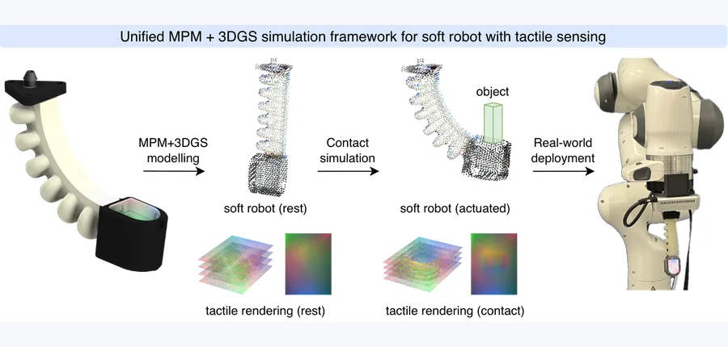 arXiv 2026-10-02 · cs.RO · #1 **[PneuTac: Tactile Manipulation with Soft Pneumatic Robots via Unified MPM-Gaussian Splatting Simulation](https://arxiv.org/abs/2609.38418)** Shaohong Zhong, Marco Pontin, Joe Watson, Perla Maiolino, Ingmar Posner 机构：University of Oxford（PDF 首页） [Paper](https://arxiv.org/abs/2609.38418) · [图源](https://arxiv.org/html/2609.38418v1/figures/overview.png) | 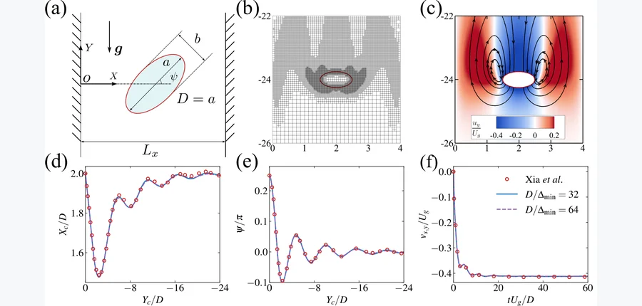 Journal of Computational Physics (2026) · #2 **[Coupled Rigid-Body Motion and Binary Phase Change: A Sharp Level-Set/Embedded-Boundary Method](https://arxiv.org/abs/2609.39431)** Chao-Fan Zhang, Zhong-Han Xue, Jie Zhang 机构：Xi’an Jiaotong University（PDF 首页） [Paper](https://arxiv.org/abs/2609.39431) · [图源](https://arxiv.org/html/2609.39431v1/sch3.png) | 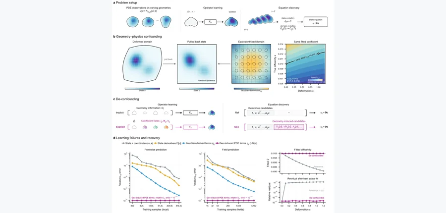 arXiv 2026-10-02 · cs.LG · #3 **[Geometry-physics confounding impairs PDE learning across varying domains](https://arxiv.org/abs/2609.38623)** Yinghao Cheng, Gengxiang Chen, Xu Liu, Qinglu Meng, Yixin Jing, Xiangguo Tang, Wenping Mou, Lihui Wang, Yingguang Li 机构：Nanjing University of Aeronautics and Astronautics / Queen’s University Belfast / Nanjing Tech University / Hong Kong Polytechnic University / KTH（PDF 首页） [Paper](https://arxiv.org/abs/2609.38623) · [图源](https://arxiv.org/html/2609.38623v1/fig01_confounding_demo.png) |
| 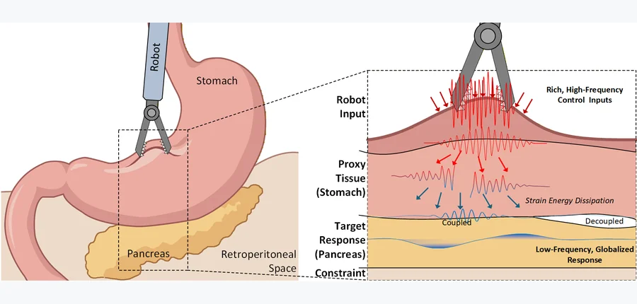 arXiv 2026-10-02 · cs.RO · #4 **[CADeT: Causal-Aware Deformation Transmission for Indirect Robotic Manipulation of Soft Tissue](https://arxiv.org/abs/2609.38483)** Junlei Hu, Dominic Jones, Pietro Valdastri 机构：University of Leeds（PDF 首页） [Paper](https://arxiv.org/abs/2609.38483) · [图源](https://arxiv.org/html/2609.38483v1/image/figure1.png) | 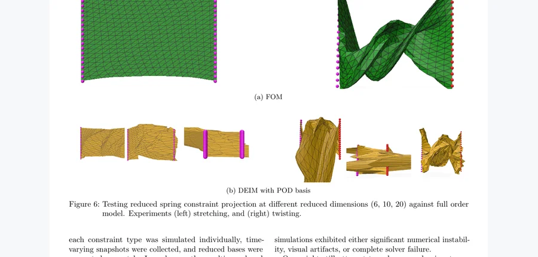 arXiv 2026-10-02 · math.DS · #5 **[On the Compatibility of DEIM Subspaces for Nonlinear Forces Reduction in Projective Dynamics](https://arxiv.org/abs/2609.40206)** Shaimaa Monem Abdelhafez, Igor Pontes Duff, Peter Benner 机构：Max Planck Institute for Dynamics of Complex Technical Systems / Otto-von-Guericke Universität Magdeburg（PDF 首页） [Paper](https://arxiv.org/abs/2609.40206) · [图源](https://arxiv.org/pdf/2609.40206) | 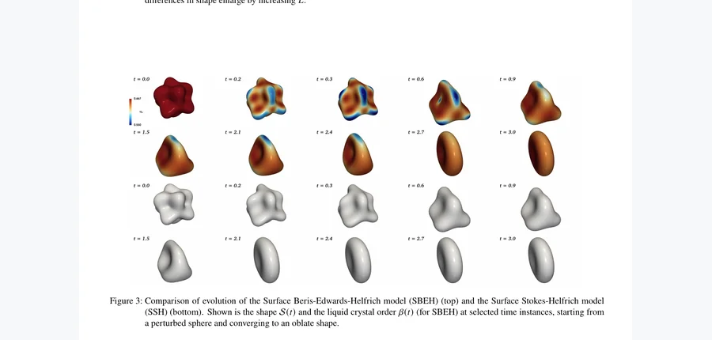 arXiv 2026-10-02 · cond-mat.soft · #6 **[Liquid crystalline order and its impact on shape evolution of fluid lipid membranes](https://arxiv.org/abs/2609.40113)** Ingo Nitschke, Maik Porrmann, Axel Voigt 机构：Technische Universität Dresden（PDF 首页） [Paper](https://arxiv.org/abs/2609.40113) · [图源](https://arxiv.org/pdf/2609.40113) |
| 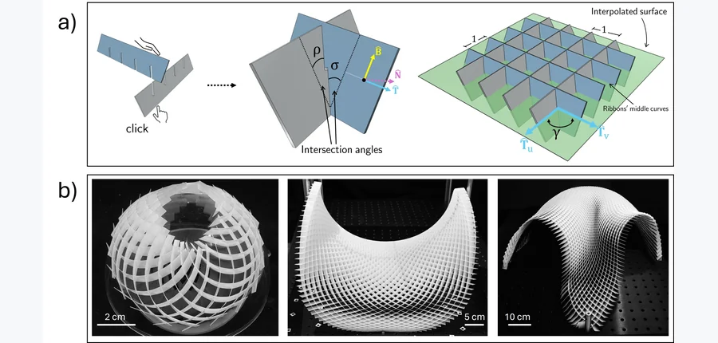 arXiv 2026-10-02 · cond-mat.soft · #7 **[Geometry and Mechanics of Ribbon Gridshells](https://arxiv.org/abs/2609.38365)** Daniel Castro, Joo-Won Hong, Hillel Aharoni, Étienne Reyssat, José Bico, Benoît Roman 机构：Weizmann Institute of Science / ESPCI Paris–PSL / CNRS（PDF 首页） [Paper](https://arxiv.org/abs/2609.38365) · [图源](https://arxiv.org/pdf/2609.38365) | 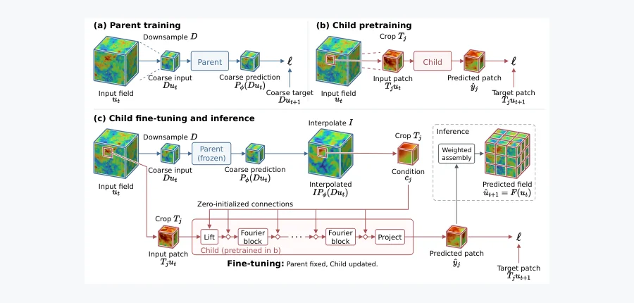 arXiv 2026-10-02 · cs.LG · #8 **[Scale-Split Neural Operator for Memory- and Data-Efficient 3D Turbulence Prediction](https://arxiv.org/abs/2609.38977)** Shaoxiang Qin, Yucheng Zhao, Zongyi Li, Liangzhu Leon Wang, Xiongye Xiao 机构：University of Tennessee, Knoxville / McGill University / New York University / Concordia University（PDF 首页） [Paper](https://arxiv.org/abs/2609.38977) · [图源](https://arxiv.org/html/2609.38977v1/architecture.png) | 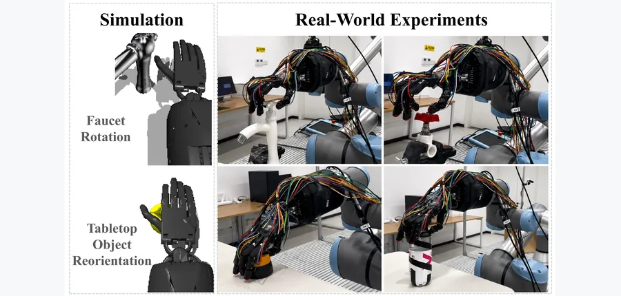 arXiv 2026-10-02 · cs.RO · #9 **[OccluDex: Hierarchical 3D Visuo-Tactile Representation Learning for Egocentric Dexterous Manipulation under Self-Occlusion](https://arxiv.org/abs/2609.39017)** Ziheng Xu, Yueyuan Chen, Xinyuan He, Guoxing Liu, Yuanshuo Tan, Huiming Pan, Bin He, Shuo Jiang, Peter B. Shull 机构：Shanghai Jiao Tong University / Tongji University / Chinese University of Hong Kong, Shenzhen（PDF 首页） [Paper](https://arxiv.org/abs/2609.39017) · [图源](https://arxiv.org/html/2609.39017v1/4task.png) |
| 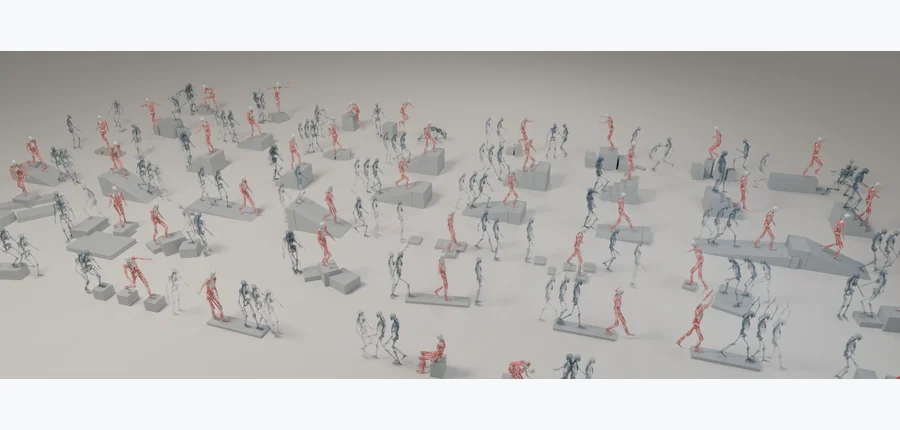 arXiv 2026-10-02 · cs.RO · #10 **[TERRA: Terrain-Aware Reconstruction, Retargeting and Control for Musculoskeletal Locomotion](https://arxiv.org/abs/2609.38653)** Merkourios Simos, Chengkun Li, Bianca Ziliotto, Alexander Mathis 机构：EPFL（PDF 首页） [Paper](https://arxiv.org/abs/2609.38653) · [Project](https://cnai.epfl.ch/terra/) · [图源](https://arxiv.org/html/2609.38653v1/figures/overview.png) | 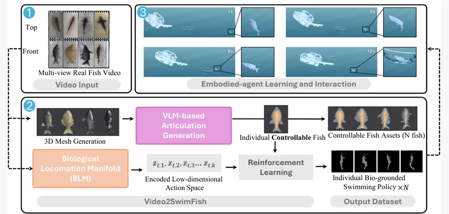 arXiv 2026-10-02 · cs.RO · #11 **[Video2SwimFish: An Automated Pipeline for Reconstructing Controllable Fish Models and Biological Locomotion from Real Fish Videos](https://arxiv.org/abs/2609.38966)** Hangong Chen, Linfeng Cheng, Tahsin Zaman Jilan, Ian Fuller, Lee Caesar, Jiaye Wu, Yantian Zha 机构：North Carolina A&amp;T State University / University of Maryland, College Park（PDF 首页） [Paper](https://arxiv.org/abs/2609.38966) · [图源](https://arxiv.org/html/2609.38966v1/Fig1.png) | 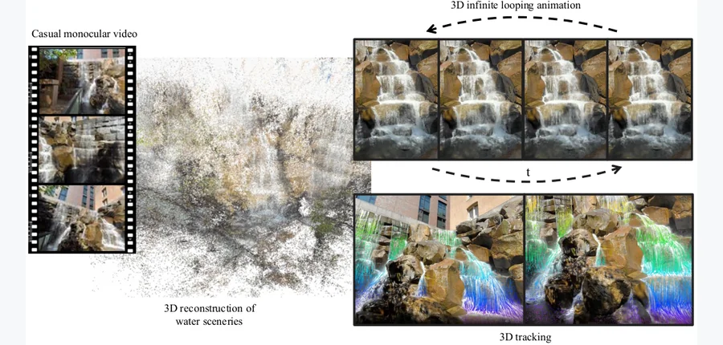 arXiv 2026-10-02 · cs.CV · #12 **[Eulerian Motion Reconstruction for Water Scenery](https://arxiv.org/abs/2609.38622)** Chuhan Chen, Yen-Chi Cheng, Ayush Saraf, Rajvi Shah, Tuotuo Li, Johannes Kopf, Chen Gao, Hung-Yu Tseng, Deva Ramanan, Matt… 机构：affiliation 未确认 [Paper](https://arxiv.org/abs/2609.38622) · [图源](https://arxiv.org/html/2609.38622v1/teasernew.png) |
| 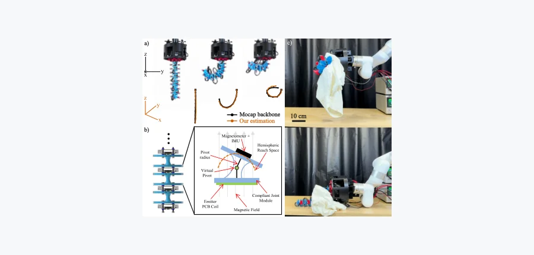 arXiv 2026-10-02 · cs.RO · #13 **[Magnetic based In-situ Self 3D Pose Estimation for a Modular Soft Tendon-Driven Continuum Robot via IMU-Fusion](https://arxiv.org/abs/2609.39950)** Zheng Cao, Guo Ning Sue, Xiangyun Bu, David Quinn, Junzhe Hu, Carmel Majidi 机构：Carnegie Mellon University（PDF 首页） [Paper](https://arxiv.org/abs/2609.39950) · [图源](https://arxiv.org/html/2609.39950v1/figure1_final.png) | 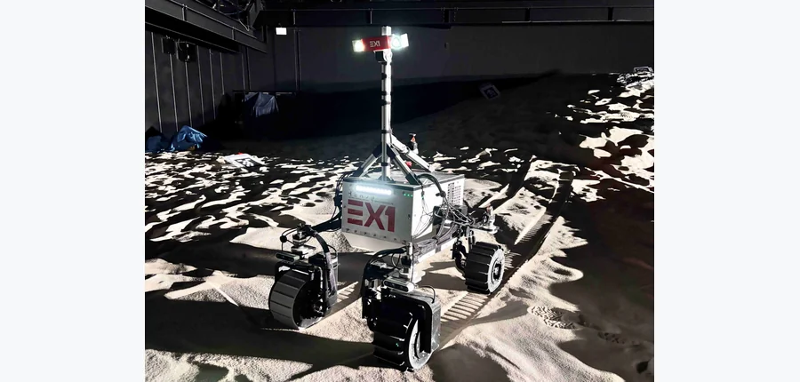 arXiv 2026-10-02 · cs.RO · #14 **[Path-Following Control and Terramechanics Analysis for Planetary Rovers Under Wheel-to-Wheel Traction Asymmetry](https://arxiv.org/abs/2609.38715)** Ryuya Matsuoka, Keisuke Takehana, Kentaro Uno, Toshinori Kuwahara, Kazuya Yoshida 机构：Tohoku University（PDF 首页） [Paper](https://arxiv.org/abs/2609.38715) · [图源](https://arxiv.org/html/2609.38715v1/fig/ex1_image.jpg) | 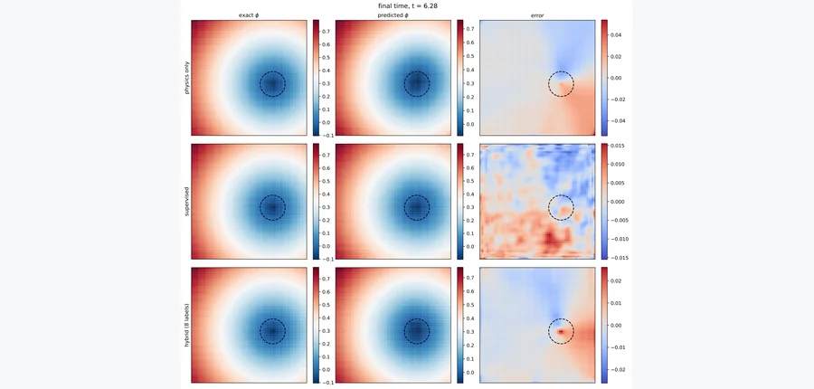 arXiv 2026-10-02 · cs.LG · #15 **[A Data-Free Physics-Informed Neural Operator for Level-Set Interface Advection](https://arxiv.org/abs/2609.38195)** Muhammad Akbar Khan 机构：NED University of Engineering and Technology（PDF 首页） [Paper](https://arxiv.org/abs/2609.38195) · [图源](https://arxiv.org/html/2609.38195v1/fig_ro_fields.png) |
| 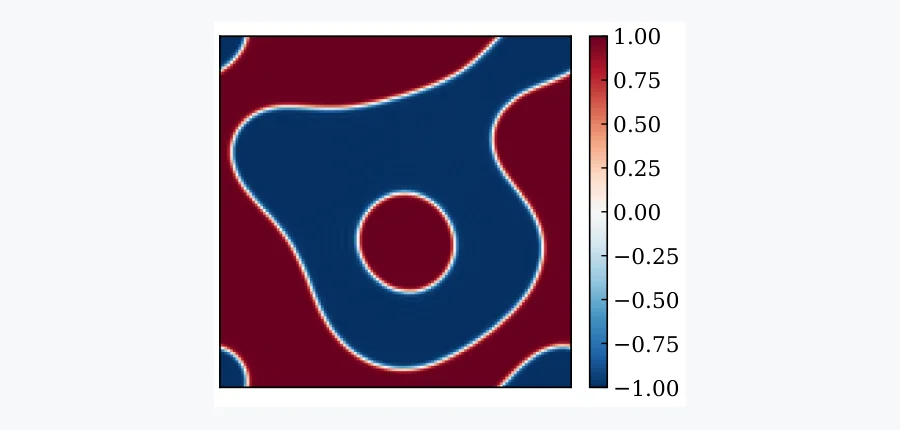 arXiv 2026-10-02 · math.NA · #16 **[Structure-preserving Fourier Neural Operators for Long-time Cahn-Hilliard Dynamics under Coarse Temporal Supervision](https://arxiv.org/abs/2609.39053)** Yingli Li, Y.C. Zhou 机构：Colorado State University（PDF 首页） [Paper](https://arxiv.org/abs/2609.39053) · [图源](https://arxiv.org/html/2609.39053v1/solver_frame_000750.png) | 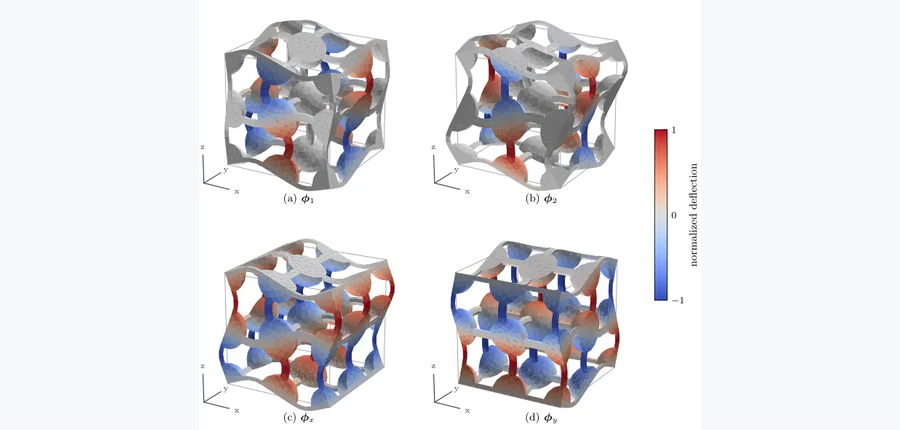 arXiv 2026-10-02 · cs.CE · #17 **[Reduced order modeling for micromorphic computational homogenization of mechanical metamaterials with patterning fluctuation fields](https://arxiv.org/abs/2609.38416)** Theron Guo, Ondřej Rokoš 机构：Eindhoven University of Technology（PDF 第 2 页） [Paper](https://arxiv.org/abs/2609.38416) · [图源](https://arxiv.org/html/2609.38416v1/phi_modes_3d.png) | 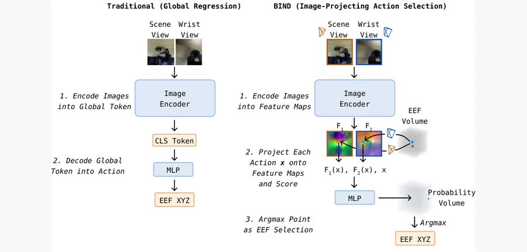 arXiv 2026-10-02 · cs.RO · #18 **[BIND: Binding 3D Robot Actions to 2D Image Features](https://arxiv.org/abs/2609.38443)** Cameron Smith, Arsh Tangri, Vitor Guizilini, Yue Wang, Zubair Irshad, Sergey Zakharov 机构：University of Southern California / Toyota Research Institute（PDF 首页） [Paper](https://arxiv.org/abs/2609.38443) · [图源](https://arxiv.org/html/2609.38443v1/fig1_method_overview.png) |
| 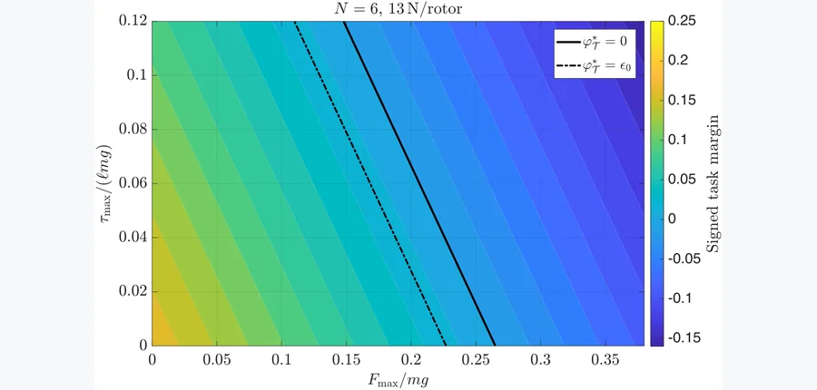 arXiv 2026-10-02 · cs.RO · #19 **[Residual Wrench Certification and Margin-Aware Control Synthesis for Aerial Physical Interaction](https://arxiv.org/abs/2609.38707)** Abhimanyu Khadga, Abhinav Sinha, Shashi Ranjan Kumar 机构：University of Cincinnati / Indian Institute of Technology Bombay（PDF 首页） [Paper](https://arxiv.org/abs/2609.38707) · [图源](https://arxiv.org/html/2609.38707v1/robustfeasibilitymap_N6.png) | 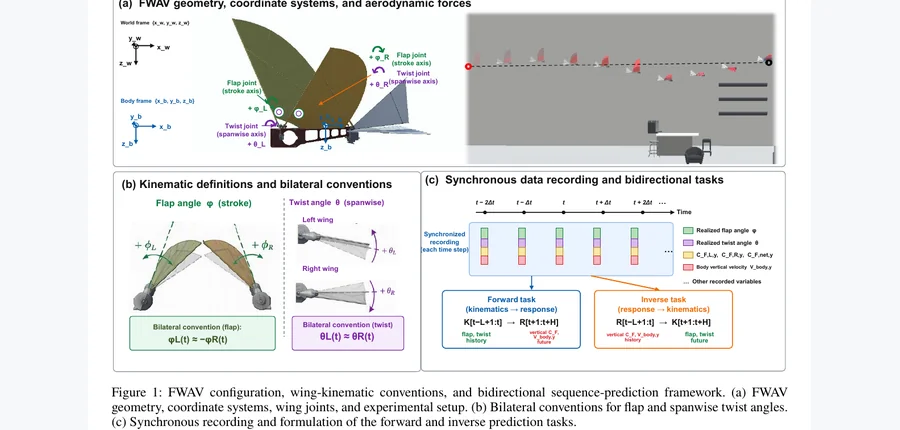 arXiv 2026-10-02 · cs.RO · #20 **[FlapKAD: A Simulation Dataset of Coupled Wing Kinematics and Aerodynamic Dynamics for Flapping-Wing Aerial Vehicles](https://arxiv.org/abs/2609.38719)** Haichuan Li 机构：University of Turku（PDF 首页） [Paper](https://arxiv.org/abs/2609.38719) · [图源](https://arxiv.org/pdf/2609.38719) | 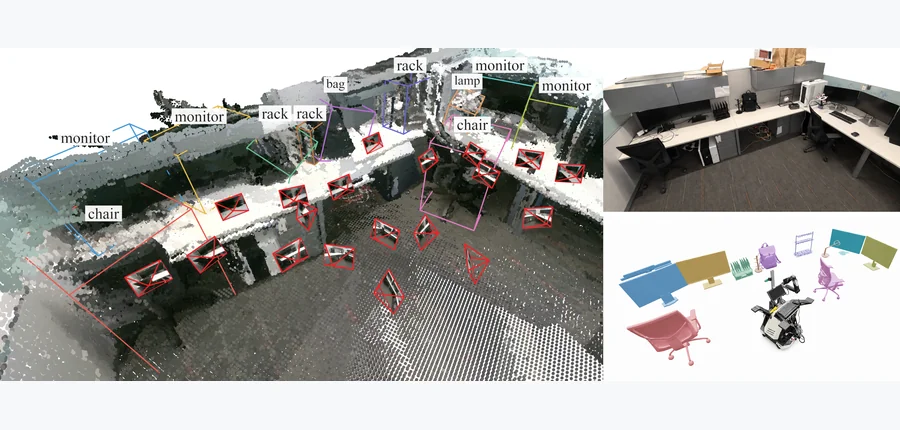 arXiv 2026-10-02 · cs.CV · #21 **[Matisse: Evidence-Space Reasoning for Active 3D Reconstruction](https://arxiv.org/abs/2609.38746)** Xihang Yu, Kaichen Zhou, Lorenzo Shaikewitz, Clément Jambon, Xiao Zhan, Rajat Talak, Luca Carlone 机构：Massachusetts Institute of Technology / National University of Singapore（PDF 首页） [Paper](https://arxiv.org/abs/2609.38746) · [图源](https://arxiv.org/html/2609.38746v1/figures/teaser_image/teaser_composite.png) |
| 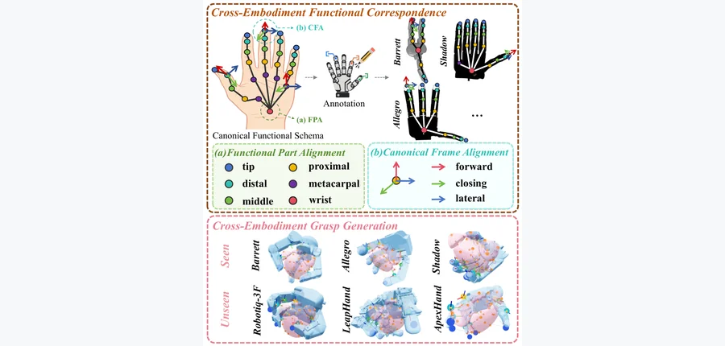 arXiv 2026-10-02 · cs.RO · #22 **[Function beyond Form: Functional Correspondence for Cross-Embodiment Dexterous Grasp Generation](https://arxiv.org/abs/2609.39006)** Bolin Zou, Wenlong Dong, Mu Ai, Chao Tang, Aoxiang Gu, Lipeng Chen, Hong Zhang 机构：Southern University of Science and Technology / KTH / Shanghai Jiao Tong University（PDF 首页） [Paper](https://arxiv.org/abs/2609.39006) · [图源](https://arxiv.org/html/2609.39006v1/intro3.png) | 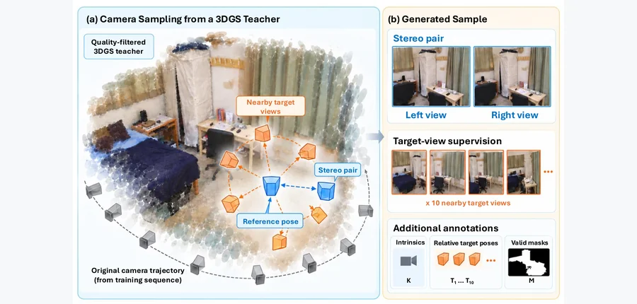 arXiv 2026-10-02 · cs.CV · #23 **[StereoGaussians: Feed-Forward 3D Gaussian Splatting from Stereo Images](https://arxiv.org/abs/2609.38592)** Boyuan Tian, Huangying Zhan, Zhan Li, Shin-Fang Chng, Hanwen Yang, Zirui Wang, Yi Xu 机构：affiliation 未确认 [Paper](https://arxiv.org/abs/2609.38592) · [图源](https://arxiv.org/html/2609.38592v1/dataset_generation.png) | 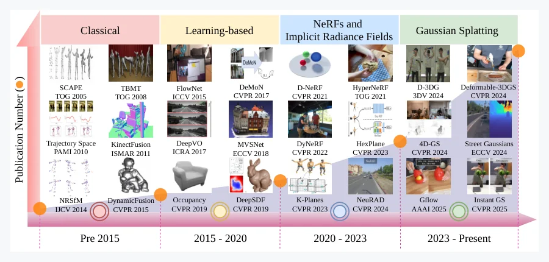 arXiv 2026-10-02 · cs.CV · #24 **[Reconstructing the Dynamic World: A Representation-Centric View of 4D Scene Reconstruction](https://arxiv.org/abs/2609.39960)** Ziren Gong, Guo Chen, Yongjia Li, Yihua Shao, Fabio Tosi, Stefano Mattoccia, Matteo Poggi, Hao Tang, Fei Ma, Shuyan Li, Zi… 机构：University of Bologna / Peking University 等（PDF 首页） [Paper](https://arxiv.org/abs/2609.39960) · [图源](https://arxiv.org/html/2609.39960v1/4d_reconstruction_history_compressed.png) |
<!-- PAPER_CARDS_END -->

## 检索概况

- **官方批次与窗口**：2026-10-02 北京时间 09:00 后检索，官方列表显示 **Thursday, 1 October 2026**。检索 [cs](https://arxiv.org/list/cs/new?show=2000)、[physics](https://arxiv.org/list/physics/new?show=2000)、[cond-mat](https://arxiv.org/list/cond-mat/new?show=2000)、[math](https://arxiv.org/list/math/new?show=2000)、[stat.ML](https://arxiv.org/list/stat.ML/new?show=2000)、[eess.IV](https://arxiv.org/list/eess.IV/new?show=2000)、[eess.SY](https://arxiv.org/list/eess.SY/new?show=2000)、[eess.SP](https://arxiv.org/list/eess.SP/new?show=2000)。cs 总页覆盖 cs.CV、cs.GR、cs.RO、cs.AI、cs.LG。
- **总命中与入选**：8 个官方 New 列表共 **1,753 条**，按 arXiv ID 去重为 **1,689 篇**；标题及摘要语义筛选后入选 **24 篇**。Cross 与 Replacement 均不进入主榜。
- **配图**：24/24 篇均有对应论文的真实图；20 张取自 arXiv HTML，4 张取自官方 PDF（其中 3 张为人工核对的矢量图裁取），**占位图 0 张**。
- **排序与证据**：优先直接结合三维几何、物理动力学、形变、接触和可微/数值仿真的方法，再收机器人交互及基础 3D/4D。标题、作者、分类和论文陈述来自各篇官方 arXiv 页面；机构依据 PDF 首页，读不清时写“affiliation 未确认”。相关性、机构强度、局限和建议为本日报 **推断**。

## Top papers

| # | 标题 | 论文来源 | 分类 | 作者 | 机构 | 相关性（推断） | 机构强度（推断） | 阅读优先级（推断） |
|---:|---|---|---|---|---|---|---|---|
| 1 | PneuTac: Tactile Manipulation with Soft Pneumatic Robots via Unified MPM-Gaussian Splatting Simulation | [arXiv:2609.38418](https://arxiv.org/abs/2609.38418) | cs.RO | Shaohong Zhong, Marco Pontin, Joe Watson, Perla Maiolino, Ingmar Posner | University of Oxford（PDF 首页） | 高 | 高 | 高 |
| 2 | Coupled Rigid-Body Motion and Binary Phase Change: A Sharp Level-Set/Embedded-Boundary Method | [arXiv:2609.39431](https://arxiv.org/abs/2609.39431) | physics.flu-dyn | Chao-Fan Zhang, Zhong-Han Xue, Jie Zhang | Xi’an Jiaotong University（PDF 首页） | 高 | 高 | 高 |
| 3 | Geometry-physics confounding impairs PDE learning across varying domains | [arXiv:2609.38623](https://arxiv.org/abs/2609.38623) | cs.LG | Yinghao Cheng, Gengxiang Chen, Xu Liu, Qinglu Meng, Yixin Jing, Xiangguo Tang, Wenping Mou, Lihui Wang, Yingguang Li | Nanjing University of Aeronautics and Astronautics / Queen’s University Belfast / Nanjing Tech University / Hong Kong Polytechnic University / KTH（PDF 首页） | 高 | 高 | 高 |
| 4 | CADeT: Causal-Aware Deformation Transmission for Indirect Robotic Manipulation of Soft Tissue | [arXiv:2609.38483](https://arxiv.org/abs/2609.38483) | cs.RO | Junlei Hu, Dominic Jones, Pietro Valdastri | University of Leeds（PDF 首页） | 高 | 高 | 高 |
| 5 | On the Compatibility of DEIM Subspaces for Nonlinear Forces Reduction in Projective Dynamics | [arXiv:2609.40206](https://arxiv.org/abs/2609.40206) | math.DS | Shaimaa Monem Abdelhafez, Igor Pontes Duff, Peter Benner | Max Planck Institute for Dynamics of Complex Technical Systems / Otto-von-Guericke Universität Magdeburg（PDF 首页） | 高 | 高 | 高 |
| 6 | Liquid crystalline order and its impact on shape evolution of fluid lipid membranes | [arXiv:2609.40113](https://arxiv.org/abs/2609.40113) | cond-mat.soft | Ingo Nitschke, Maik Porrmann, Axel Voigt | Technische Universität Dresden（PDF 首页） | 高 | 高 | 高 |
| 7 | Geometry and Mechanics of Ribbon Gridshells | [arXiv:2609.38365](https://arxiv.org/abs/2609.38365) | cond-mat.soft | Daniel Castro, Joo-Won Hong, Hillel Aharoni, Étienne Reyssat, José Bico, Benoît Roman | Weizmann Institute of Science / ESPCI Paris–PSL / CNRS（PDF 首页） | 高 | 高 | 高 |
| 8 | Scale-Split Neural Operator for Memory- and Data-Efficient 3D Turbulence Prediction | [arXiv:2609.38977](https://arxiv.org/abs/2609.38977) | cs.LG | Shaoxiang Qin, Yucheng Zhao, Zongyi Li, Liangzhu Leon Wang, Xiongye Xiao | University of Tennessee, Knoxville / McGill University / New York University / Concordia University（PDF 首页） | 高 | 高 | 高 |
| 9 | OccluDex: Hierarchical 3D Visuo-Tactile Representation Learning for Egocentric Dexterous Manipulation under Self-Occlusion | [arXiv:2609.39017](https://arxiv.org/abs/2609.39017) | cs.RO | Ziheng Xu, Yueyuan Chen, Xinyuan He, Guoxing Liu, Yuanshuo Tan, Huiming Pan, Bin He, Shuo Jiang, Peter B. Shull | Shanghai Jiao Tong University / Tongji University / Chinese University of Hong Kong, Shenzhen（PDF 首页） | 高 | 中 | 高 |
| 10 | TERRA: Terrain-Aware Reconstruction, Retargeting and Control for Musculoskeletal Locomotion | [arXiv:2609.38653](https://arxiv.org/abs/2609.38653) | cs.RO | Merkourios Simos, Chengkun Li, Bianca Ziliotto, Alexander Mathis | EPFL（PDF 首页） | 高 | 中 | 高 |
| 11 | Video2SwimFish: An Automated Pipeline for Reconstructing Controllable Fish Models and Biological Locomotion from Real Fish Videos | [arXiv:2609.38966](https://arxiv.org/abs/2609.38966) | cs.RO | Hangong Chen, Linfeng Cheng, Tahsin Zaman Jilan, Ian Fuller, Lee Caesar, Jiaye Wu, Yantian Zha | North Carolina A&T State University / University of Maryland, College Park（PDF 首页） | 高 | 中 | 高 |
| 12 | Eulerian Motion Reconstruction for Water Scenery | [arXiv:2609.38622](https://arxiv.org/abs/2609.38622) | cs.CV | Chuhan Chen, Yen-Chi Cheng, Ayush Saraf, Rajvi Shah, Tuotuo Li, Johannes Kopf, Chen Gao, Hung-Yu Tseng, Deva Ramanan, Matthew O'Toole, Changil Kim | affiliation 未确认 | 高 | 中 | 高 |
| 13 | Magnetic based In-situ Self 3D Pose Estimation for a Modular Soft Tendon-Driven Continuum Robot via IMU-Fusion | [arXiv:2609.39950](https://arxiv.org/abs/2609.39950) | cs.RO | Zheng Cao, Guo Ning Sue, Xiangyun Bu, David Quinn, Junzhe Hu, Carmel Majidi | Carnegie Mellon University（PDF 首页） | 高 | 中 | 中 |
| 14 | Path-Following Control and Terramechanics Analysis for Planetary Rovers Under Wheel-to-Wheel Traction Asymmetry | [arXiv:2609.38715](https://arxiv.org/abs/2609.38715) | cs.RO | Ryuya Matsuoka, Keisuke Takehana, Kentaro Uno, Toshinori Kuwahara, Kazuya Yoshida | Tohoku University（PDF 首页） | 高 | 中 | 中 |
| 15 | A Data-Free Physics-Informed Neural Operator for Level-Set Interface Advection | [arXiv:2609.38195](https://arxiv.org/abs/2609.38195) | cs.LG | Muhammad Akbar Khan | NED University of Engineering and Technology（PDF 首页） | 高 | 中 | 中 |
| 16 | Structure-preserving Fourier Neural Operators for Long-time Cahn-Hilliard Dynamics under Coarse Temporal Supervision | [arXiv:2609.39053](https://arxiv.org/abs/2609.39053) | math.NA | Yingli Li, Y.C. Zhou | Colorado State University（PDF 首页） | 高 | 中 | 中 |
| 17 | Reduced order modeling for micromorphic computational homogenization of mechanical metamaterials with patterning fluctuation fields | [arXiv:2609.38416](https://arxiv.org/abs/2609.38416) | cs.CE | Theron Guo, Ondřej Rokoš | Eindhoven University of Technology（PDF 第 2 页） | 高 | 中 | 中 |
| 18 | BIND: Binding 3D Robot Actions to 2D Image Features | [arXiv:2609.38443](https://arxiv.org/abs/2609.38443) | cs.RO | Cameron Smith, Arsh Tangri, Vitor Guizilini, Yue Wang, Zubair Irshad, Sergey Zakharov | University of Southern California / Toyota Research Institute（PDF 首页） | 高 | 中 | 中 |
| 19 | Residual Wrench Certification and Margin-Aware Control Synthesis for Aerial Physical Interaction | [arXiv:2609.38707](https://arxiv.org/abs/2609.38707) | cs.RO | Abhimanyu Khadga, Abhinav Sinha, Shashi Ranjan Kumar | University of Cincinnati / Indian Institute of Technology Bombay（PDF 首页） | 高 | 中 | 中 |
| 20 | FlapKAD: A Simulation Dataset of Coupled Wing Kinematics and Aerodynamic Dynamics for Flapping-Wing Aerial Vehicles | [arXiv:2609.38719](https://arxiv.org/abs/2609.38719) | cs.RO | Haichuan Li | University of Turku（PDF 首页） | 高 | 中 | 中 |
| 21 | Matisse: Evidence-Space Reasoning for Active 3D Reconstruction | [arXiv:2609.38746](https://arxiv.org/abs/2609.38746) | cs.CV | Xihang Yu, Kaichen Zhou, Lorenzo Shaikewitz, Clément Jambon, Xiao Zhan, Rajat Talak, Luca Carlone | Massachusetts Institute of Technology / National University of Singapore（PDF 首页） | 中 | 中 | 中 |
| 22 | Function beyond Form: Functional Correspondence for Cross-Embodiment Dexterous Grasp Generation | [arXiv:2609.39006](https://arxiv.org/abs/2609.39006) | cs.RO | Bolin Zou, Wenlong Dong, Mu Ai, Chao Tang, Aoxiang Gu, Lipeng Chen, Hong Zhang | Southern University of Science and Technology / KTH / Shanghai Jiao Tong University（PDF 首页） | 中 | 中 | 中 |
| 23 | StereoGaussians: Feed-Forward 3D Gaussian Splatting from Stereo Images | [arXiv:2609.38592](https://arxiv.org/abs/2609.38592) | cs.CV | Boyuan Tian, Huangying Zhan, Zhan Li, Shin-Fang Chng, Hanwen Yang, Zirui Wang, Yi Xu | affiliation 未确认 | 中 | 中 | 中 |
| 24 | Reconstructing the Dynamic World: A Representation-Centric View of 4D Scene Reconstruction | [arXiv:2609.39960](https://arxiv.org/abs/2609.39960) | cs.CV | Ziren Gong, Guo Chen, Yongjia Li, Yihua Shao, Fabio Tosi, Stefano Mattoccia, Matteo Poggi, Hao Tang, Fei Ma, Shuyan Li, Ziyang Yan, Nicu Sebe, Ling Shao, Jianfei Cai, Qi Tian, Ming-Hsuan Yang | University of Bologna / Peking University 等（PDF 首页） | 中 | 中 | 中 |

## 逐篇中文要点

### 1. [PneuTac: Tactile Manipulation with Soft Pneumatic Robots via Unified MPM-Gaussian Splatting Simulation](https://arxiv.org/abs/2609.38418)

- [事实] 以 MPM 联合模拟气动软指与可变形触觉膜，再用 3D Gaussian Splatting 渲染触觉视觉观测。
- [事实] 用视觉方式做 real-to-sim 标定并训练代理模型；摘要称同真实数据量下，仿真增强策略在三项真实接触任务优于基线。
- [推断] 需把软体几何、接触力和触觉图像误差分别核验，防止真实任务成功率掩盖错误物理。

### 2. [Coupled Rigid-Body Motion and Binary Phase Change: A Sharp Level-Set/Embedded-Boundary Method](https://arxiv.org/abs/2609.39431)

- [事实] 用 level set 保持运动颗粒几何，以 embedded boundary 在欧拉网格上处理流体、温度与溶质界面。
- [事实] 逐时间步耦合水动力载荷、刚体运动和熔化；包含三维扁椭球及浮冰盘示例。
- [推断] 建议独立测试长时质量与能量守恒、界面曲率误差，以及网格细化后轨迹是否稳定。

### 3. [Geometry-physics confounding impairs PDE learning across varying domains](https://arxiv.org/abs/2609.38623)

- [事实] 指出域几何变化会同时改变场表示和微分算子，致使 PDE 学习把几何效应误认作物性。
- [事实] 显式编码几何到算子的变换；摘要称在五个算子学习基准提高数据效率，并降低两个演化域系统的方程发现残差。
- [推断] 值得检验几何映射有噪声、拓扑改变或接触边界移动时，显式校正是否仍优于隐式学习。

### 4. [CADeT: Causal-Aware Deformation Transmission for Indirect Robotic Manipulation of Soft Tissue](https://arxiv.org/abs/2609.38483)

- [事实] 以结构因果模型区分软组织形变传播的不同隐变量模式，模糊时主动选择额外探测动作。
- [事实] 在线估计状态相关的 adhesion Jacobian，并在仿真、组织模型和 ex vivo 猪组织上验证目标形状控制。
- [推断] 应拆开报告模式识别、接触负载和形状误差，确认探测动作带来的收益与组织损伤风险。

### 5. [On the Compatibility of DEIM Subspaces for Nonlinear Forces Reduction in Projective Dynamics](https://arxiv.org/abs/2609.40206)

- [事实] 研究 DEIM 是否能用少量网格约束元素近似 projective dynamics 中的非线性约束力。
- [事实] 在三维嵌入曲面网格和体网格比较降阶与全阶仿真；多顶点约束下 DEIM 效果并不稳定。
- [推断] 可按约束耦合结构设计局部采样，而非仅按快照低秩重建误差选点。

### 6. [Liquid crystalline order and its impact on shape evolution of fluid lipid membranes](https://arxiv.org/abs/2609.40113)

- [事实] 将液晶取向引入流体脂质膜的曲率弹性能，得到 Surface Beris–Edwards–Helfrich 动力学模型。
- [事实] 模型把局部弯曲刚度、表面黏度、切向流与膜形状演化耦合，并给出数值求解。
- [推断] 建议对相同体积与面积条件检查形状分叉和耗散，区分取向效应与参数重标定。

### 7. [Geometry and Mechanics of Ribbon Gridshells](https://arxiv.org/abs/2609.38365)

- [事实] 研究交叉薄带组成的 gridshell，其几何约束导致强非线性宏观力学响应。
- [事实] 给出粗粒化控制方程、可调高斯曲率的逆设计条件，并以实验和数值分析软模态。
- [推断] 后续可测制造误差、交点摩擦及重复加载后逆设计曲率的稳健性。

### 8. [Scale-Split Neural Operator for Memory- and Data-Efficient 3D Turbulence Prediction](https://arxiv.org/abs/2609.38977)

- [事实] 以粗场 Parent 和局部高分辨率 Child 两个神经算子预测三维湍流，避免整场高分辨率训练。
- [事实] 摘要报告在 256³ 湍流基准上相对最强基线 NMSE 降 53%、训练内存降 79%，并测试城市风场。
- [推断] 除一步误差外须考察长时能谱、涡量和守恒量，避免局部补丁拼接产生伪结构。

### 9. [OccluDex: Hierarchical 3D Visuo-Tactile Representation Learning for Egocentric Dexterous Manipulation under Self-Occlusion](https://arxiv.org/abs/2609.39017)

- [事实] 多尺度 masked autoencoding 编码被手遮挡的部分三维几何，再融合触觉接触 token。
- [事实] 用同步人类视触觉示范预训练感知编码器，冻结后供强化学习；摘要报告 Shadow Hand 真实迁移。
- [推断] 需在相同可见面积和触觉质量下消融几何补全，以独立接触状态误差验证机制。

### 10. [TERRA: Terrain-Aware Reconstruction, Retargeting and Control for Musculoskeletal Locomotion](https://arxiv.org/abs/2609.38653)

- [事实] 从运动学轨迹、接触估计及空域证据恢复地形支撑几何，再做肌骨角色的地形感知重定向。
- [事实] 考虑解剖、肌腱连续性和接触约束，并在五组数据得到运动—地形配对用于控制训练。
- [推断] 应检查恢复地形的绝对几何误差及未知地面摩擦条件下的接触可重放性。

### 11. [Video2SwimFish: An Automated Pipeline for Reconstructing Controllable Fish Models and Biological Locomotion from Real Fish Videos](https://arxiv.org/abs/2609.38966)

- [事实] 由同步多视角鱼类视频重建公制可变形网格，生成与个体形态对应的内部关节。
- [事实] 从体中线曲率得到低维游动动作流形；数据覆盖 120 条鱼、六个物种，评价轨迹、曲率与尾摆频率。
- [推断] 值得补充流体力学和能耗指标，避免轨迹相似却靠不合理推进力完成任务。

### 12. [Eulerian Motion Reconstruction for Water Scenery](https://arxiv.org/abs/2609.38622)

- [事实] 以静态三维 Eulerian 运动场驱动 canonical Gaussian splats，并周期性再生粒子。
- [事实] 从单段非循环二维视频重建可换视角渲染的循环四维水景，用时变残差处理非周期运动。
- [推断] 该运动场未必满足流体守恒，应分开评估视觉循环和三维水面速度的物理正确性。

### 13. [Magnetic based In-situ Self 3D Pose Estimation for a Modular Soft Tendon-Driven Continuum Robot via IMU-Fusion](https://arxiv.org/abs/2609.39950)

- [事实] 在柔性腱驱连续机器人内部融合 IMU 与主动磁场，不依赖外部相机估计三维构形。
- [事实] 摘要给出 16.7 Hz 更新率，并在与物体交互的闭环末端定位实验中验证。
- [推断] 建议在外力、磁干扰与腱摩擦变化下测全身形状误差，而非只报末端定位。

### 14. [Path-Following Control and Terramechanics Analysis for Planetary Rovers Under Wheel-to-Wheel Traction Asymmetry](https://arxiv.org/abs/2609.38715)

- [事实] 针对松散地面轮间牵引不对称，用减速外侧车轮实现路径修正并限制最高命令速度。
- [事实] 在真实四轮巡视车上以多轴力传感器检验载荷再分配，摘要称可压制侧向漂移与下陷。
- [推断] 需在不同土壤强度、坡度和车轮几何下重复，量化力学机制的可迁移边界。

### 15. [A Data-Free Physics-Informed Neural Operator for Level-Set Interface Advection](https://arxiv.org/abs/2609.38195)

- [事实] 训练 level-set 界面平流算子时只用输运残差和几何约束，不使用参考解。
- [事实] 在同架构比较有监督及混合方案；摘要报告数据空缺方案在面积守恒上有优势但场误差更大。
- [推断] 应先审查 eikonal 约束在每个流场是否成立，再决定约束权重或局部松弛。

### 16. [Structure-preserving Fourier Neural Operators for Long-time Cahn-Hilliard Dynamics under Coarse Temporal Supervision](https://arxiv.org/abs/2609.39053)

- [事实] 对长时 Cahn–Hilliard 粗化提出两阶段 FNO：先约束振幅，再加入结构函数正则。
- [事实] 摘要称第二阶段修正后期结构函数、L³(t) 增长趋势与缩放塌缩。
- [推断] 应同时检查质量守恒及不同初始体积分数，避免统计量改善掩盖逐点动力学误差。

### 17. [Reduced order modeling for micromorphic computational homogenization of mechanical metamaterials with patterning fluctuation fields](https://arxiv.org/abs/2609.38416)

- [事实] 为具有屈曲与图案变换的力学超材料建立 micromorphic homogenization 降阶模型。
- [事实] 微观 RVE 使用 POD 基及专门的 hyperreduction；两项数值例子报告误差、离线成本和在线加速。
- [推断] 应以未见加载路径和三维局部屈曲验证降阶基是否漏掉不稳定模态。

### 18. [BIND: Binding 3D Robot Actions to 2D Image Features](https://arxiv.org/abs/2609.38443)

- [事实] 把三维末端候选位置投影到各相机图像并绑定对应视觉特征，再逐候选评分选动作。
- [事实] 摘要称真实机器人仅五次演示可在部分任务接近满成功率，且对未见视角与物体位置更稳健。
- [推断] 需核验相机标定偏差、遮挡及深度歧义下绑定特征与实际接触点是否一致。

### 19. [Residual Wrench Certification and Margin-Aware Control Synthesis for Aerial Physical Interaction](https://arxiv.org/abs/2609.38707)

- [事实] 以凸几何给多旋翼在悬停和接触载荷后剩余可用 wrench 定义任务相关余量。
- [事实] 由执行器内部余量给出可计算证书与控制增益，并在持续刚性墙接触仿真比较飞行器构型。
- [推断] 实际接触应引入力传感误差、推进器延迟和墙面摩擦，检查证书是否仍保守有效。

### 20. [FlapKAD: A Simulation Dataset of Coupled Wing Kinematics and Aerodynamic Dynamics for Flapping-Wing Aerial Vehicles](https://arxiv.org/abs/2609.38719)

- [事实] 提供同步记录拍翼角度、气动力与飞行状态的模拟数据，含 2,000 段飞行及 720,152 个有效时间步。
- [事实] 设置翼运动到未来力/速度以及逆向翼轨迹重建任务；摘要指出扭转角普遍比扑动角难预测。
- [推断] 可加入翼面形变和流场可视化，验证模型是否学到气动力机制而非时序相关。

### 21. [Matisse: Evidence-Space Reasoning for Active 3D Reconstruction](https://arxiv.org/abs/2609.38746)

- [事实] 用生成式三维模型的 cross-attention 证据估计潜变量不确定性，同时做主动视角选择与关键帧保留。
- [事实] 以预期后验熵下降定义证据增益，支持遮挡感知的多物体场景，摘要报告多个数据集 Chamfer 下降。
- [推断] 需核对注意力证据对真实隐藏几何误差的校准，并报告选视角所需实际计算量。

### 22. [Function beyond Form: Functional Correspondence for Cross-Embodiment Dexterous Grasp Generation](https://arxiv.org/abs/2609.39006)

- [事实] 将不同手的物理连杆对齐到规范功能部位，并在局部规范坐标系中表示手物关系。
- [事实] 扩散模型生成部位空间布局，再转为可执行关节构形；摘要给出未见手的仿真及真实抓取成功率。
- [推断] 应以接触位置、力闭合和摩擦扰动测试跨手迁移，避免只以抓取成功率推断机制。

### 23. [StereoGaussians: Feed-Forward 3D Gaussian Splatting from Stereo Images](https://arxiv.org/abs/2609.38592)

- [事实] 从单个标定双目图像对预测公制三维 Gaussian 场景，复用冻结的双目网络中间特征。
- [事实] 额外 Gaussian 层和扩展画布补充遮挡后及画面外的外观，训练集来自 803 个场景。
- [推断] 应分别量化可见区几何和新暴露区域的猜测误差，尤其在薄结构与大视差场景。

### 24. [Reconstructing the Dynamic World: A Representation-Centric View of 4D Scene Reconstruction](https://arxiv.org/abs/2609.39960)

- [事实] 这是一篇四维场景重建综述，按场景表示、时间建模、重建流程和优化目标梳理已有方法。
- [事实] 比较 NeRF 与 3D Gaussian 等路线的几何、外观、运动和计算代价，并汇集数据集与指标。
- [推断] 作为方法地图有用，但不应把综述中的模型对比直接当作同预算、同评测器证据。

## 今日最值得细读的 5 篇

1. [PneuTac: Tactile Manipulation with Soft Pneumatic Robots via Unified MPM-Gaussian Splatting Simulation](https://arxiv.org/abs/2609.38418)：需把软体几何、接触力和触觉图像误差分别核验，防止真实任务成功率掩盖错误物理。
2. [Coupled Rigid-Body Motion and Binary Phase Change: A Sharp Level-Set/Embedded-Boundary Method](https://arxiv.org/abs/2609.39431)：建议独立测试长时质量与能量守恒、界面曲率误差，以及网格细化后轨迹是否稳定。
3. [Geometry-physics confounding impairs PDE learning across varying domains](https://arxiv.org/abs/2609.38623)：值得检验几何映射有噪声、拓扑改变或接触边界移动时，显式校正是否仍优于隐式学习。
4. [CADeT: Causal-Aware Deformation Transmission for Indirect Robotic Manipulation of Soft Tissue](https://arxiv.org/abs/2609.38483)：应拆开报告模式识别、接触负载和形状误差，确认探测动作带来的收益与组织损伤风险。
5. [On the Compatibility of DEIM Subspaces for Nonlinear Forces Reduction in Projective Dynamics](https://arxiv.org/abs/2609.40206)：可按约束耦合结构设计局部采样，而非仅按快照低秩重建误差选点。

## 低算力方法改进机会（推断）

以下是从论文摘要出发的可检验提案，并非论文已报告结果。每项先进行小规模配对实验。

### 1. [Geometry-physics confounding impairs PDE learning across varying domains](https://arxiv.org/abs/2609.38623)

- **方法改法**：把已知几何映射显式写入 PDE 算子后，再以低维残差场只学习未知材料项。
- **小实验**：二维变形域上控制网格密度和物性不变，比较跨形状预测与参数偏差。
- **低算力原因**：小网格即可隔离几何混淆。
- **预期收益**：降低物性误识别。
- **风险**：几何映射估计错误可能传到残差场。

### 2. [PneuTac: Tactile Manipulation with Soft Pneumatic Robots via Unified MPM-Gaussian Splatting Simulation](https://arxiv.org/abs/2609.38418)

- **方法改法**：给 MPM 触觉膜增加接触压力与图像形变的双向一致性约束。
- **小实验**：两种软指材料、三档充气压力，比较真实压力、触觉图像及抓取成功率。
- **低算力原因**：冻结大部分代理模型，仅校准局部接触层。
- **预期收益**：降低 sim-to-real 触觉偏差。
- **风险**：压力真值噪声可能误导校准。

### 3. [CADeT: Causal-Aware Deformation Transmission for Indirect Robotic Manipulation of Soft Tissue](https://arxiv.org/abs/2609.38483)

- **方法改法**：把主动探测选择改为信息增益与组织应变上界的联合优化。
- **小实验**：小型两层软组织仿真中设置阻断/解耦模式，对比识别时间和峰值应变。
- **低算力原因**：低维信念状态和少量 MPC 候选即可验证。
- **预期收益**：减少危险探测并加快辨识。
- **风险**：应变代理与真实损伤风险可能不一致。

### 4. [On the Compatibility of DEIM Subspaces for Nonlinear Forces Reduction in Projective Dynamics](https://arxiv.org/abs/2609.40206)

- **方法改法**：按约束涉及的顶点超图分簇，再在每簇内用 DEIM 采样，避免多顶点力项被拆散。
- **小实验**：三种体/面网格，小型弯曲及拉伸序列，比较力误差、轨迹误差与运行时间。
- **低算力原因**：只改降阶采样，不训练大模型。
- **预期收益**：提高耦合约束近似稳定性。
- **风险**：分簇可能抵消采样加速。

### 5. [Coupled Rigid-Body Motion and Binary Phase Change: A Sharp Level-Set/Embedded-Boundary Method](https://arxiv.org/abs/2609.39431)

- **方法改法**：在 moving cut-cell 更新后加入局部守恒投影，并显式对齐 level-set 法向。
- **小实验**：三维小球熔化与平移旋转组合案例，测质量漂移、界面位置和轨迹。
- **低算力原因**：小网格短时间模拟可定位数值误差。
- **预期收益**：改善长时几何与标量守恒。
- **风险**：投影可能削弱界面尖锐度。

### 6. [Scale-Split Neural Operator for Memory- and Data-Efficient 3D Turbulence Prediction](https://arxiv.org/abs/2609.38977)

- **方法改法**：在 Parent–Child 衔接处增加散度自由投影和重叠补丁的能谱一致性损失。
- **小实验**：64³ 周期湍流短滚动，测散度、能谱和多步速度误差。
- **低算力原因**：粗网格和局部补丁足以做消融。
- **预期收益**：减少拼接造成的伪涡量。
- **风险**：投影和频谱项可能压制真实小尺度。

### 7. [Liquid crystalline order and its impact on shape evolution of fluid lipid membranes](https://arxiv.org/abs/2609.40113)

- **方法改法**：对膜流动数值积分加面积、体积和自由能单调性的逐步检查与轻量投影。
- **小实验**：三种初始膜形，比较有无投影时的面积漂移与最终曲率分布。
- **低算力原因**：只需少量曲面网格和数值求解。
- **预期收益**：判断取向耦合是否物理稳健。
- **风险**：能量约束过强会改变真实非平衡路径。

### 8. [OccluDex: Hierarchical 3D Visuo-Tactile Representation Learning for Egocentric Dexterous Manipulation under Self-Occlusion](https://arxiv.org/abs/2609.39017)

- **方法改法**：用触觉接触点作局部三维几何补全的显式锚点，保留视觉遮挡不确定性。
- **小实验**：合成不同遮挡率的把手旋转任务，比较接触位姿误差与任务完成率。
- **低算力原因**：冻结主干，只训练小型补全头。
- **预期收益**：让遮挡区几何与接触更一致。
- **风险**：触觉点稀疏时会错误地约束曲面。

### 9. [Eulerian Motion Reconstruction for Water Scenery](https://arxiv.org/abs/2609.38622)

- **方法改法**：给 Eulerian 水流场加入局部不可压残差和自由液面速度边界的软约束。
- **小实验**：单段小分辨率水视频，比较新视角质量、速度散度与循环连续性。
- **低算力原因**：在现有场上做局部正则微调。
- **预期收益**：减少视觉合理但流动不合理的解。
- **风险**：非周期残差可能与约束冲突。

### 10. [Reduced order modeling for micromorphic computational homogenization of mechanical metamaterials with patterning fluctuation fields](https://arxiv.org/abs/2609.38416)

- **方法改法**：用近屈曲临界模态自适应补充 POD 基，而非只按位移重建误差扩基。
- **小实验**：二维 RVE 和小型三维晶格，比较临界载荷及后屈曲形状。
- **低算力原因**：少量高保真临界状态就可做增量基更新。
- **预期收益**：保留关键力学失稳。
- **风险**：模态切换可能让基维度快速增长。

## Replacement 观察

本批次检索页另列 Replacement；本日报主榜只使用 New。未对全部版本差异逐项审计，因此不对 Replacement 的重要性作无证据判断。
