# 2026-10-03 arXiv 每日论文订阅摘要

<!-- PAPER_CARDS_START -->
## 论文卡片

按原日报排名展示；点击标题或 Paper 查看原文，详细中文分析见下方。

| 论文 | 论文 | 论文 |
|---|---|---|
| 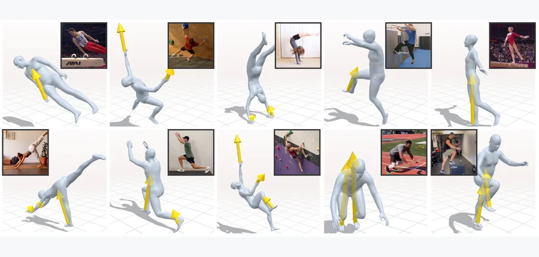 arXiv 2026-10-03 · cs.CV · #1 **[PACT: End-to-End Learning of Human Pose, Contacts, and Forces from Video](https://arxiv.org/abs/2610.00451)** Rikhat Akizhanov, Yangsong Zhang, Nikolai Kaliazin, Peter Wolf, Yoshihiko Nakamura, Pascal Fua, Fabio Pizzati, Ivan Laptev 机构：MBZUAI / ETH Zürich / EPFL（PDF 首页） [Paper](https://arxiv.org/abs/2610.00451) · [Project](https://rihat99.github.io/PACT/) · [图源](https://arxiv.org/html/2610.00451v1/figures/Teaser.jpg) | 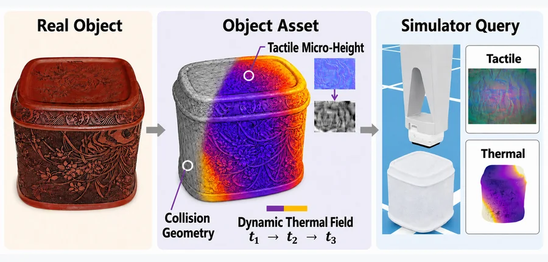 arXiv 2026-10-03 · cs.RO · #2 **[TouchTherm: Building Multimodal Digital Twins of Objects for Tactile and Thermal Rendering](https://arxiv.org/abs/2610.01943)** Yitao Zhang, Hong Ying, Haoran Guo, Xiaoying Zhou, Guanyu Chen, Chenxi Xiao 机构：ShanghaiTech University（PDF 首页） [Paper](https://arxiv.org/abs/2610.01943) · [图源](https://arxiv.org/html/2610.01943v1/images/teaser3.jpg) | 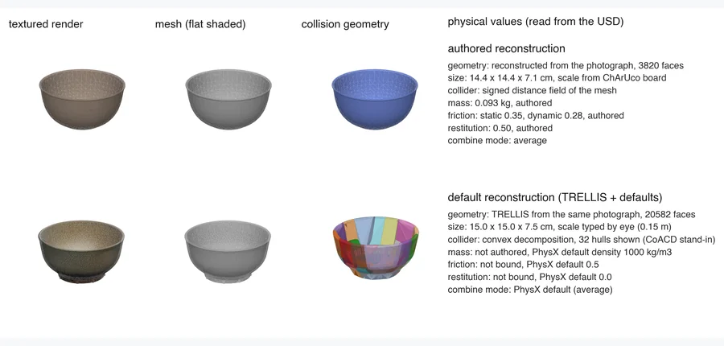 arXiv 2026-10-03 · cs.RO · #3 **[Measuring Asset and Scene Reconstruction Effects in Real-to-Sim Robot Evaluation](https://arxiv.org/abs/2610.00731)** Sanya Verma, Luca Cilio, Velissarios Christodoulou 机构：Kaedim（PDF 首页） [Paper](https://arxiv.org/abs/2610.00731) · [图源](https://arxiv.org/html/2610.00731v1/figures/fig1a.png) |
| 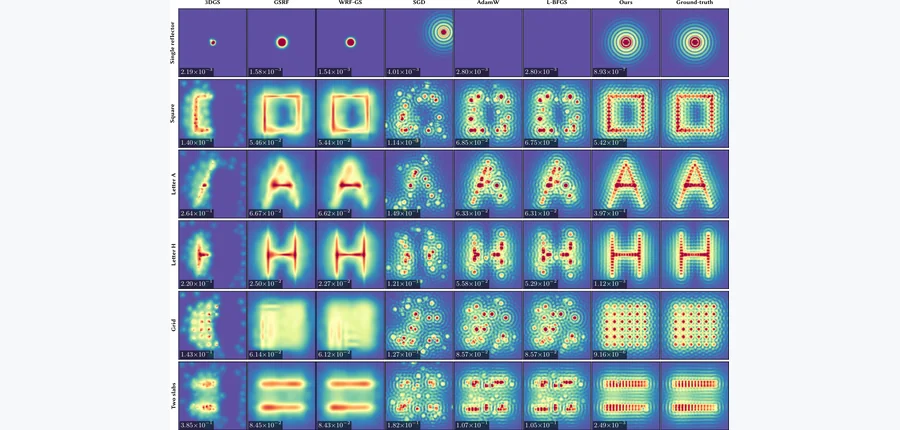 arXiv 2026-10-03 · cs.GR · #4 **[Dirichlet Splatting: Differentiable Rendering for Wave-Based Inverse Problems](https://arxiv.org/abs/2610.00618)** Xingyu Chen, Wuqiong Zhao, Xinyu Zhang, Tzu-Mao Li 机构：University of California San Diego（PDF 首页） [Paper](https://arxiv.org/abs/2610.00618) · [图源](https://arxiv.org/html/2610.00618v1/inverse_result_grid.png) | 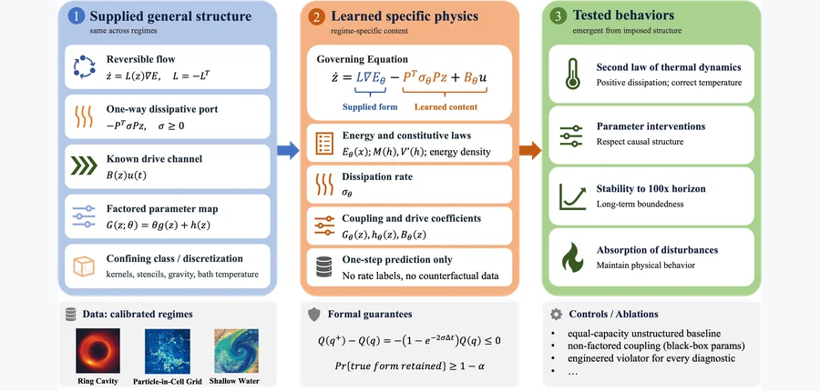 arXiv 2026-10-03 · cs.LG · #5 **[Stable and Counterfactually Robust Physical World Models from Imposed Structure and Learned Physics](https://arxiv.org/abs/2610.00280)** Yufeng Wang, Parivesh Priye, Lu Wei, Haibin Ling 机构：Stony Brook University / Georgia Institute of Technology / Westlake University（PDF 首页） [Paper](https://arxiv.org/abs/2610.00280) · [图源](https://arxiv.org/html/2610.00280v1/figures/method_overview.png) | 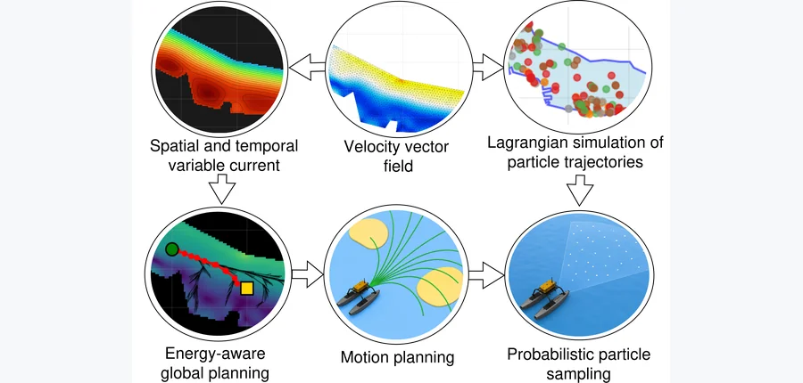 arXiv 2026-10-03 · cs.RO · #6 **[H-SPAR: Hydrodynamic-aware Simulation for Particle Transport and Autonomous Robots](https://arxiv.org/abs/2610.01985)** Navid Zarrabi, Nariman Yousefi, Sajad Saeedi 机构：Toronto Metropolitan University / University College London（PDF 首页） [Paper](https://arxiv.org/abs/2610.01985) · [Code](https://github.com/naviiidz/h-spar-sim) · [Project](https://sites.google.com/view/h-spar) · [图源](https://arxiv.org/pdf/2610.01985) |
| 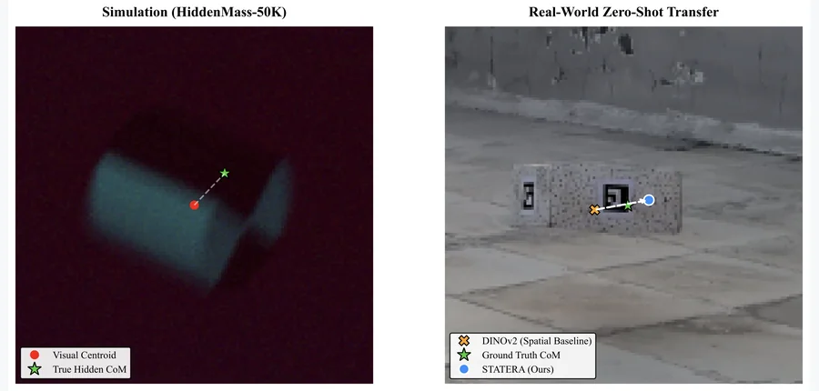 arXiv 2026-10-03 · cs.CV · #7 **[STATERA: Hidden Mass Estimation via Zero-Shot Sim-to-Real Kinematics using Frozen Temporal Tubelets](https://arxiv.org/abs/2610.00003)** Animesh Varma 机构：Independent Researcher（PDF 首页） [Paper](https://arxiv.org/abs/2610.00003) · [图源](https://arxiv.org/html/2610.00003v1/teaser_figure.png) | 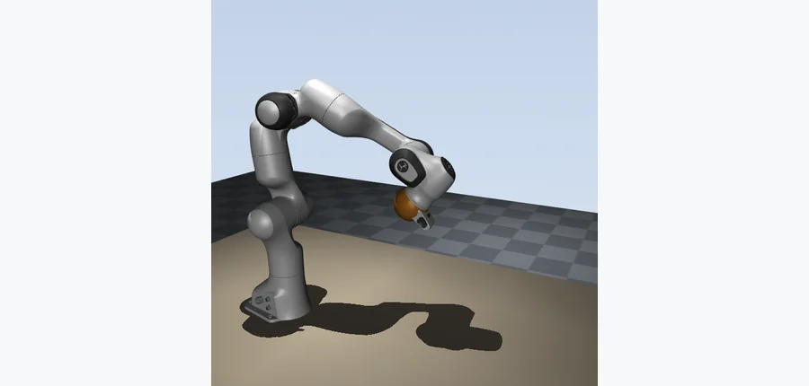 arXiv 2026-10-03 · cs.RO · #8 **[Screw Attention: Rigid-Body Algebra Inside a Transformer](https://arxiv.org/abs/2610.00904)** Aly Magassouba 机构：University of Nottingham（PDF 首页） [Paper](https://arxiv.org/abs/2610.00904) · [图源](https://arxiv.org/html/2610.00904v1/figs/phase2.png) | 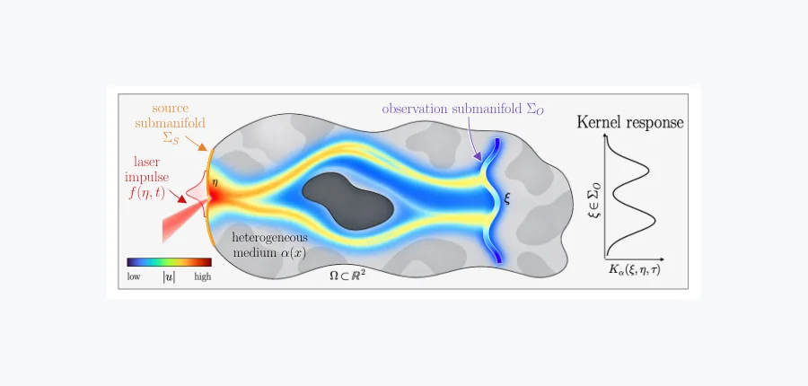 arXiv 2026-10-03 · cs.LG · #9 **[Learning PDE Dynamics between Submanifolds Using Green's Observation Operators](https://arxiv.org/abs/2610.01697)** Jan Tauberschmidt, Jephte Abijuru, Samuel Okon, Naukshatro Bose, Sophie Fellenz, Marius Kloft, Jonas Latz, Sebastian Josef… 机构：DFKI / RPTU / University of Manchester（PDF 首页） [Paper](https://arxiv.org/abs/2610.01697) · [图源](https://arxiv.org/html/2610.01697v1/GOP_Fig1.png) |
| 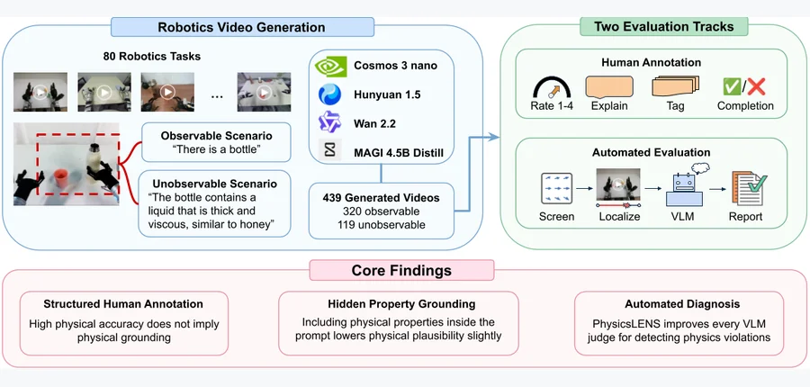 arXiv 2026-10-03 · cs.CV · #10 **[PhysicsLENS: Diagnosing Physical Property Blindness in Video Generation Models](https://arxiv.org/abs/2610.01162)** Isaiah Milkey, Som Sagar, Aditya Taparia, Xinyuan Liu, Jiqing Wen, Ransalu Senanayake 机构：Arizona State University（PDF 首页） [Paper](https://arxiv.org/abs/2610.01162) · [图源](https://arxiv.org/html/2610.01162v1/fig/fig_overview.png) | 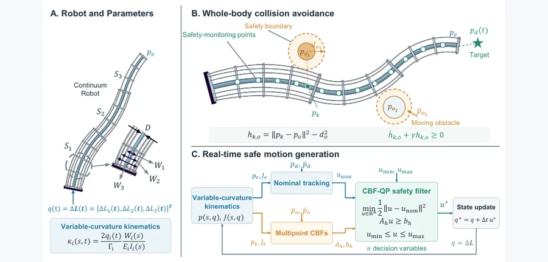 arXiv 2026-10-03 · cs.RO · #11 **[Real-Time Whole-Body Safe Motion Generation for Multi-Segment Tendon-Driven Continuum Robots](https://arxiv.org/abs/2610.00220)** Fangju Yang, Siyi Ma, Tonghao Guan, Tingcong Liu, Hang Yang, Zhengqiang Zhang, Jian S. Dai, Ke Wu 机构：affiliation 未确认 [Paper](https://arxiv.org/abs/2610.00220) · [图源](https://arxiv.org/html/2610.00220v1/Fig1_overview_new.png) | 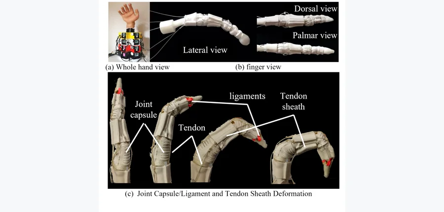 arXiv 2026-10-03 · cs.RO · #12 **[Learning a Resolution-Consistent Jacobian Field for Bio-Inspired Rigid-Soft Finger](https://arxiv.org/abs/2610.01668)** Tianyou Liang, Haisen Zeng, Shanjun Chen, YiMing Zhu, Zhongyue Lu, Zirong Luo 机构：National University of Defense Technology（PDF 首页） [Paper](https://arxiv.org/abs/2610.01668) · [图源](https://arxiv.org/html/2610.01668v1/fig1.png) |
| 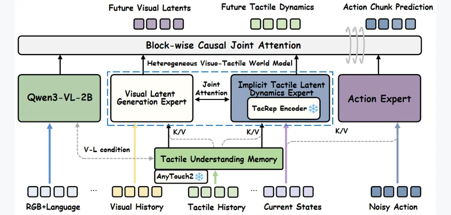 arXiv 2026-10-03 · cs.RO · #13 **[TacDyn-WAM: Learning Implicit Tactile Dynamics in a Heterogeneous Visuo-Tactile World Action Model](https://arxiv.org/abs/2610.00638)** Enyi Wang, Mingxin Wang, Quan Shi, Hetian Guo, Hongyu Wang, Xi Wang, Bin Qian, Yupeng Zheng, Wenxuan Song, Houde Liu, Yong… 机构：Tsinghua University / Chinese Academy of Sciences / HKUST (Guangzhou) / Renmin University / Fudan University / TARS Robotics（PDF 首页） [Paper](https://arxiv.org/abs/2610.00638) · [图源](https://arxiv.org/html/2610.00638v1/figures/main_framework.png) | 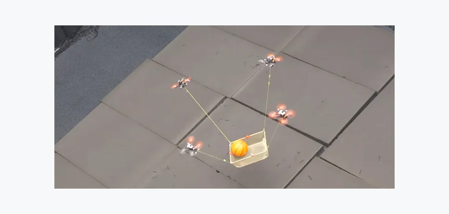 arXiv 2026-10-03 · cs.RO · #14 **[AFD-CAMLs: Agile Force-Distribution-Aware Planning and Control for Cable-Suspended Aerial Multi-Lifting Systems](https://arxiv.org/abs/2610.01185)** Antreas Kourris, Sihao Sun 机构：Delft University of Technology（PDF 首页） [Paper](https://arxiv.org/abs/2610.01185) · [图源](https://arxiv.org/html/2610.01185v1/figures/eyecatcher.png) | 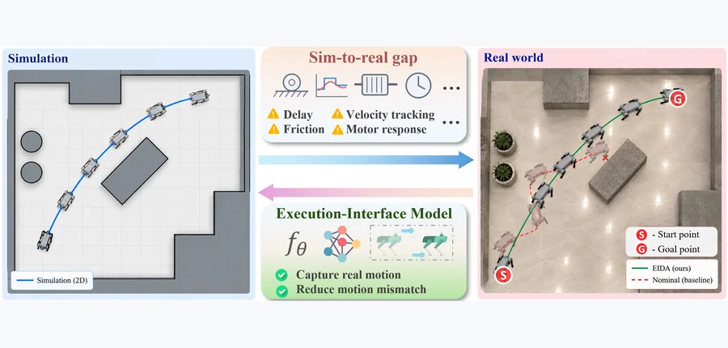 arXiv 2026-10-03 · cs.RO · #15 **[EIDA: Execution-Interface Dynamics Adaptation for Real-to-Sim-to-Real Robot Navigation](https://arxiv.org/abs/2610.01219)** Yiwei Qian, Shanze Wang, Qingyuan Hu, Xinming Zhang, Wei Zhang 机构：Eastern Institute of Technology, Ningbo / National University of Singapore / Hong Kong Polytechnic University / University of Science and Technology of China（PDF 首页） [Paper](https://arxiv.org/abs/2610.01219) · [图源](https://arxiv.org/html/2610.01219v1/figures/introduction/fig1_qyw_rgb_q95.jpg) |
| 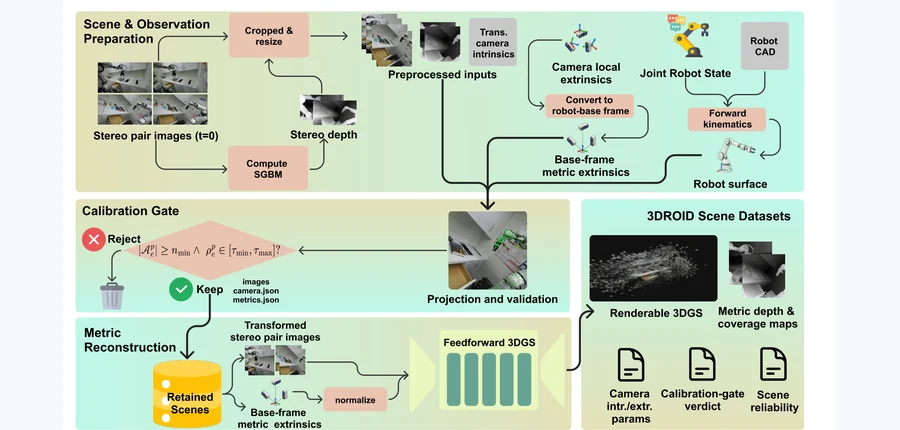 arXiv 2026-10-03 · cs.CV · #16 **[3DROID: A Renderable 3D Gaussian Dataset with Measured Per-Scene Reliability](https://arxiv.org/abs/2610.01744)** Wonguen Cho, Junhoo Lee, Nojun Kwak 机构：Seoul National University / KAIST（PDF 首页） [Paper](https://arxiv.org/abs/2610.01744) · [Data](https://huggingface.co/datasets/wonguen/3DROID) · [图源](https://arxiv.org/html/2610.01744v1/fig1_rev_final.png) | 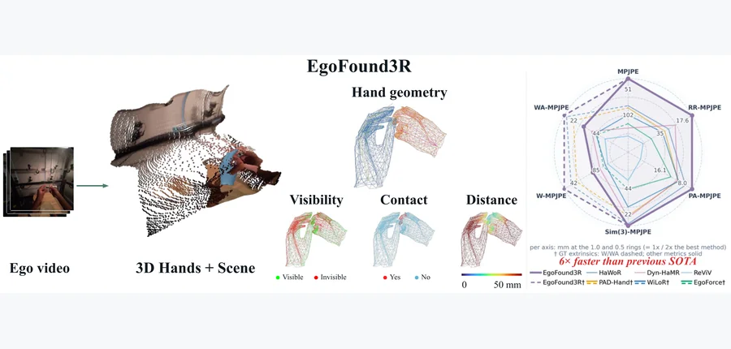 arXiv 2026-10-03 · cs.CV · #17 **[EgoFound3R: End-to-End Egocentric Hand Reconstruction in World Space with Point-Wise Interaction Attributes](https://arxiv.org/abs/2610.01210)** Hongming Fu, Jingcheng Shi, Wenjia Wang, Binhua Zuo, Bo Zhao 机构：Shanghai Jiao Tong University / Rutgers University / University of Hong Kong / QuicRobot（PDF 首页） [Paper](https://arxiv.org/abs/2610.01210) · [Project](https://mint-sjtu.github.io/EgoFound3R.io/) · [图源](https://arxiv.org/html/2610.01210v1/S0_Teaser_FullWidth_table1.png) | 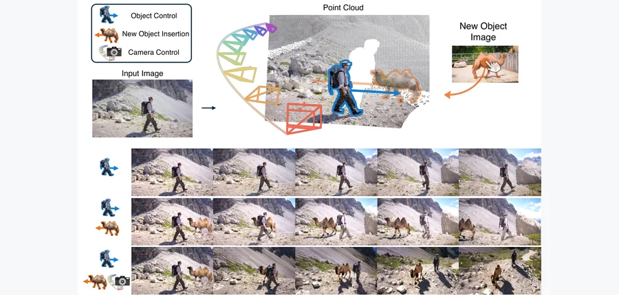 arXiv 2026-10-03 · cs.CV · #18 **[4Director: Controlling Video World Models with Rigid 3D Geometry](https://arxiv.org/abs/2610.02160)** Wei Cao, Hao Zhang, Vikram Voleti, Yuqun Wu, Mallikarjun B R, Shimon Vainer, Mark Boss, Yaoyao Liu 机构：Stability AI / University of Illinois Urbana-Champaign（PDF 首页） [Paper](https://arxiv.org/abs/2610.02160) · [图源](https://arxiv.org/html/2610.02160v1/teaser_v7.png) |
| 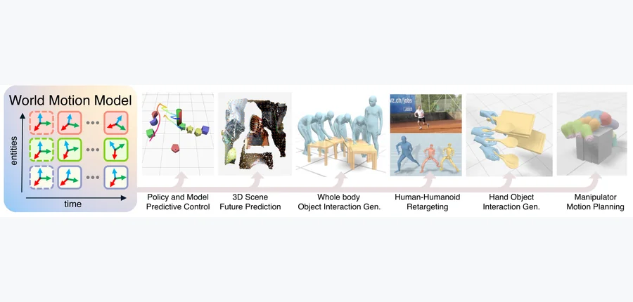 arXiv 2026-10-03 · cs.RO · #19 **[World Motion Models: Flexible Sequence Modeling of SE(3) Trajectories](https://arxiv.org/abs/2610.01742)** Jiahui Lei, Qianqian Wang, Trevor Darrell, Angjoo Kanazawa 机构：UC Berkeley / Harvard University（PDF 首页） [Paper](https://arxiv.org/abs/2610.01742) · [Project](https://jiahuilei.com/projects/wmm/) · [图源](https://arxiv.org/html/2610.01742v1/teaser-v2.png) | 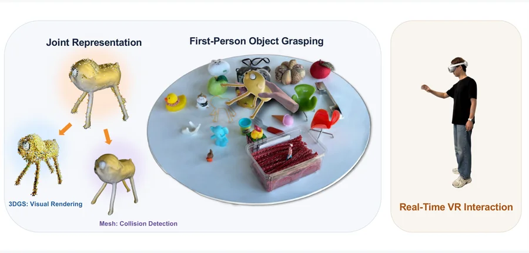 arXiv 2026-10-03 · cs.CV · #20 **[MEGA: Object-Level Mesh Extraction from 3D Gaussian Splatting via Spatial Visual Distillation](https://arxiv.org/abs/2610.01707)** Liwei Liao, Yingkui Zhang, Qianqian Tong, Ronggang Wang 机构：Peking University / Pengcheng Laboratory / Beihang University（PDF 首页） [Paper](https://arxiv.org/abs/2610.01707) · [图源](https://arxiv.org/html/2610.01707v1/teaser.png) | 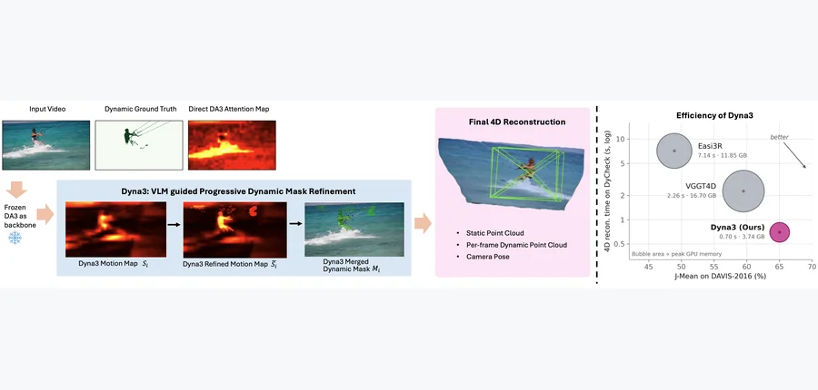 arXiv 2026-10-03 · cs.CV · #21 **[Dyna3: VLM-Guided Training-Free 4D Reconstruction via Depth Foundation Models](https://arxiv.org/abs/2610.01286)** Xinhao Xiang, Weiyang Li, Zhijie Zheng, Abhijeet Rastogi, Jiawei Zhang 机构：University of California, Davis / Genies Inc.（PDF 首页） [Paper](https://arxiv.org/abs/2610.01286) · [图源](https://arxiv.org/html/2610.01286v1/figures/Teasor.png) |
| 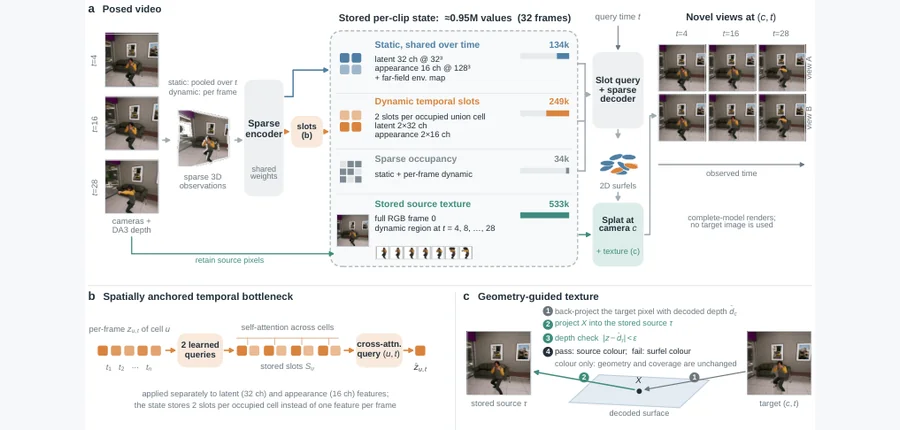 arXiv 2026-10-03 · cs.CV · #22 **[A Compact Explicit 4D Representation for Dynamic Scenes](https://arxiv.org/abs/2610.01229)** Di Yang, Zhihao Li, Yanhai Xiong, Yufei Wang 机构：College of William &amp; Mary / SparcAI Inc.（PDF 首页） [Paper](https://arxiv.org/abs/2610.01229) · [图源](https://arxiv.org/html/2610.01229v1/overview_unified.png) | 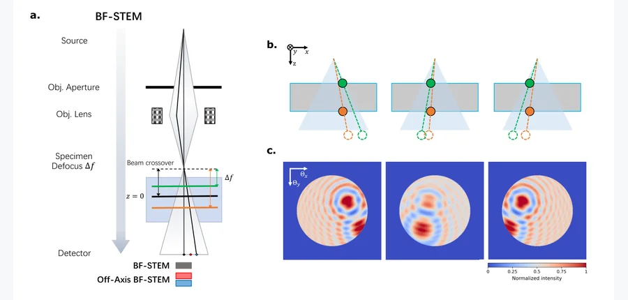 arXiv 2026-10-03 · physics.optics · #23 **[Parallax Depth Sectioning and 3D Reconstruction in 4D-STEM](https://arxiv.org/abs/2610.01057)** Desheng Ma, Chia-Hao Lee, Zixiao Shi, David A. Muller, Steven E. Zeltmann 机构：Cornell University（PDF 首页） [Paper](https://arxiv.org/abs/2610.01057) · [图源](https://arxiv.org/html/2610.01057v1/fig1.png) | 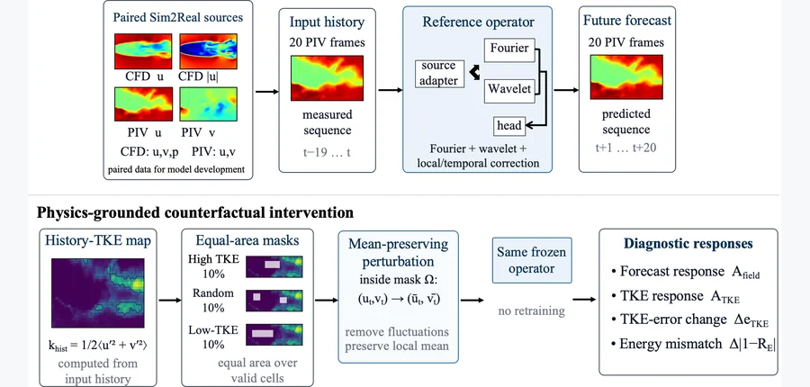 arXiv 2026-10-03 · cs.LG · #24 **[Do Better Scores Mean Better Physics? Physics-Grounded Explanations for Sim2Real Neural Operators](https://arxiv.org/abs/2610.00415)** Somyajit Chakraborty, Xizhong Chen 机构：Shanghai Jiao Tong University（PDF 首页） [Paper](https://arxiv.org/abs/2610.00415) · [图源](https://arxiv.org/html/2610.00415v1/figures/FIGURE1_vis.png) |
<!-- PAPER_CARDS_END -->

## 检索概况

- **官方批次与检索窗口**：北京时间 2026-10-03 09:00 后检查官方最新列表，显示 **Friday, 2 October 2026**。检索 [cs](https://arxiv.org/list/cs/new?show=2000)、[physics](https://arxiv.org/list/physics/new?show=2000)、[cond-mat](https://arxiv.org/list/cond-mat/new?show=2000)、[math](https://arxiv.org/list/math/new?show=2000)、[stat.ML](https://arxiv.org/list/stat.ML/new?show=2000)、[eess.IV](https://arxiv.org/list/eess.IV/new?show=2000)、[eess.SY](https://arxiv.org/list/eess.SY/new?show=2000)、[eess.SP](https://arxiv.org/list/eess.SP/new?show=2000)；cs 总页覆盖 cs.CV、cs.GR、cs.RO、cs.AI、cs.LG。
- **总命中与入选**：8 个列表 **1,828 条 New 记录**，按 arXiv ID 去重为 **1,769 篇**；逐篇阅读候选标题与摘要后入选 **24 篇**。Cross/Replacement 不进入主榜。
- **排序与证据**：三维几何与力、接触、动力学、物性和仿真交叉优先，其后是明确动态几何或实体网格的基础三维工作。标题、作者、分类及论文陈述均链接到官方 arXiv；机构核对 PDF 首页，仍不能确认的写“affiliation 未确认”。相关性、机构强度、局限和建议均为 **推断**。
- **配图**：24/24 篇有对应论文真实图，23 张来自官方 arXiv HTML、1 张来自官方 PDF；逐张检查缩略图与论文对应，**占位图 0 张**。

## Top papers

| # | 标题 | 论文来源 | 分类 | 作者 | 机构 | 相关性（推断） | 机构强度（推断） | 阅读优先级（推断） |
|---:|---|---|---|---|---|---|---|---|
| 1 | PACT: End-to-End Learning of Human Pose, Contacts, and Forces from Video | [arXiv:2610.00451](https://arxiv.org/abs/2610.00451) | cs.CV | Rikhat Akizhanov, Yangsong Zhang, Nikolai Kaliazin, Peter Wolf, Yoshihiko Nakamura, Pascal Fua, Fabio Pizzati, Ivan Laptev | MBZUAI / ETH Zürich / EPFL（PDF 首页） | 高 | 中 | 高 |
| 2 | TouchTherm: Building Multimodal Digital Twins of Objects for Tactile and Thermal Rendering | [arXiv:2610.01943](https://arxiv.org/abs/2610.01943) | cs.RO | Yitao Zhang, Hong Ying, Haoran Guo, Xiaoying Zhou, Guanyu Chen, Chenxi Xiao | ShanghaiTech University（PDF 首页） | 高 | 中 | 高 |
| 3 | Measuring Asset and Scene Reconstruction Effects in Real-to-Sim Robot Evaluation | [arXiv:2610.00731](https://arxiv.org/abs/2610.00731) | cs.RO | Sanya Verma, Luca Cilio, Velissarios Christodoulou | Kaedim（PDF 首页） | 高 | 中 | 高 |
| 4 | Dirichlet Splatting: Differentiable Rendering for Wave-Based Inverse Problems | [arXiv:2610.00618](https://arxiv.org/abs/2610.00618) | cs.GR | Xingyu Chen, Wuqiong Zhao, Xinyu Zhang, Tzu-Mao Li | University of California San Diego（PDF 首页） | 高 | 中 | 高 |
| 5 | Stable and Counterfactually Robust Physical World Models from Imposed Structure and Learned Physics | [arXiv:2610.00280](https://arxiv.org/abs/2610.00280) | cs.LG | Yufeng Wang, Parivesh Priye, Lu Wei, Haibin Ling | Stony Brook University / Georgia Institute of Technology / Westlake University（PDF 首页） | 高 | 中 | 高 |
| 6 | H-SPAR: Hydrodynamic-aware Simulation for Particle Transport and Autonomous Robots | [arXiv:2610.01985](https://arxiv.org/abs/2610.01985) | cs.RO | Navid Zarrabi, Nariman Yousefi, Sajad Saeedi | Toronto Metropolitan University / University College London（PDF 首页） | 高 | 中 | 高 |
| 7 | STATERA: Hidden Mass Estimation via Zero-Shot Sim-to-Real Kinematics using Frozen Temporal Tubelets | [arXiv:2610.00003](https://arxiv.org/abs/2610.00003) | cs.CV | Animesh Varma | Independent Researcher（PDF 首页） | 高 | 中 | 高 |
| 8 | Screw Attention: Rigid-Body Algebra Inside a Transformer | [arXiv:2610.00904](https://arxiv.org/abs/2610.00904) | cs.RO | Aly Magassouba | University of Nottingham（PDF 首页） | 高 | 中 | 高 |
| 9 | Learning PDE Dynamics between Submanifolds Using Green's Observation Operators | [arXiv:2610.01697](https://arxiv.org/abs/2610.01697) | cs.LG | Jan Tauberschmidt, Jephte Abijuru, Samuel Okon, Naukshatro Bose, Sophie Fellenz, Marius Kloft, Jonas Latz, Sebastian Josef Vollmer | DFKI / RPTU / University of Manchester（PDF 首页） | 高 | 中 | 高 |
| 10 | PhysicsLENS: Diagnosing Physical Property Blindness in Video Generation Models | [arXiv:2610.01162](https://arxiv.org/abs/2610.01162) | cs.CV | Isaiah Milkey, Som Sagar, Aditya Taparia, Xinyuan Liu, Jiqing Wen, Ransalu Senanayake | Arizona State University（PDF 首页） | 高 | 中 | 高 |
| 11 | Real-Time Whole-Body Safe Motion Generation for Multi-Segment Tendon-Driven Continuum Robots | [arXiv:2610.00220](https://arxiv.org/abs/2610.00220) | cs.RO | Fangju Yang, Siyi Ma, Tonghao Guan, Tingcong Liu, Hang Yang, Zhengqiang Zhang, Jian S. Dai, Ke Wu | affiliation 未确认 | 高 | 待核 | 中 |
| 12 | Learning a Resolution-Consistent Jacobian Field for Bio-Inspired Rigid-Soft Finger | [arXiv:2610.01668](https://arxiv.org/abs/2610.01668) | cs.RO | Tianyou Liang, Haisen Zeng, Shanjun Chen, YiMing Zhu, Zhongyue Lu, Zirong Luo | National University of Defense Technology（PDF 首页） | 高 | 中 | 中 |
| 13 | TacDyn-WAM: Learning Implicit Tactile Dynamics in a Heterogeneous Visuo-Tactile World Action Model | [arXiv:2610.00638](https://arxiv.org/abs/2610.00638) | cs.RO | Enyi Wang, Mingxin Wang, Quan Shi, Hetian Guo, Hongyu Wang, Xi Wang, Bin Qian, Yupeng Zheng, Wenxuan Song, Houde Liu, Yong Xu, Cheng Chi, Wenchao Ding, Yilun Chen, Yan Wang | Tsinghua University / Chinese Academy of Sciences / HKUST (Guangzhou) / Renmin University / Fudan University / TARS Robotics（PDF 首页） | 高 | 中 | 中 |
| 14 | AFD-CAMLs: Agile Force-Distribution-Aware Planning and Control for Cable-Suspended Aerial Multi-Lifting Systems | [arXiv:2610.01185](https://arxiv.org/abs/2610.01185) | cs.RO | Antreas Kourris, Sihao Sun | Delft University of Technology（PDF 首页） | 高 | 中 | 中 |
| 15 | EIDA: Execution-Interface Dynamics Adaptation for Real-to-Sim-to-Real Robot Navigation | [arXiv:2610.01219](https://arxiv.org/abs/2610.01219) | cs.RO | Yiwei Qian, Shanze Wang, Qingyuan Hu, Xinming Zhang, Wei Zhang | Eastern Institute of Technology, Ningbo / National University of Singapore / Hong Kong Polytechnic University / University of Science and Technology of China（PDF 首页） | 高 | 中 | 中 |
| 16 | 3DROID: A Renderable 3D Gaussian Dataset with Measured Per-Scene Reliability | [arXiv:2610.01744](https://arxiv.org/abs/2610.01744) | cs.CV | Wonguen Cho, Junhoo Lee, Nojun Kwak | Seoul National University / KAIST（PDF 首页） | 高 | 中 | 中 |
| 17 | EgoFound3R: End-to-End Egocentric Hand Reconstruction in World Space with Point-Wise Interaction Attributes | [arXiv:2610.01210](https://arxiv.org/abs/2610.01210) | cs.CV | Hongming Fu, Jingcheng Shi, Wenjia Wang, Binhua Zuo, Bo Zhao | Shanghai Jiao Tong University / Rutgers University / University of Hong Kong / QuicRobot（PDF 首页） | 高 | 中 | 中 |
| 18 | 4Director: Controlling Video World Models with Rigid 3D Geometry | [arXiv:2610.02160](https://arxiv.org/abs/2610.02160) | cs.CV | Wei Cao, Hao Zhang, Vikram Voleti, Yuqun Wu, Mallikarjun B R, Shimon Vainer, Mark Boss, Yaoyao Liu | Stability AI / University of Illinois Urbana-Champaign（PDF 首页） | 中 | 中 | 中 |
| 19 | World Motion Models: Flexible Sequence Modeling of SE(3) Trajectories | [arXiv:2610.01742](https://arxiv.org/abs/2610.01742) | cs.RO | Jiahui Lei, Qianqian Wang, Trevor Darrell, Angjoo Kanazawa | UC Berkeley / Harvard University（PDF 首页） | 中 | 中 | 中 |
| 20 | MEGA: Object-Level Mesh Extraction from 3D Gaussian Splatting via Spatial Visual Distillation | [arXiv:2610.01707](https://arxiv.org/abs/2610.01707) | cs.CV | Liwei Liao, Yingkui Zhang, Qianqian Tong, Ronggang Wang | Peking University / Pengcheng Laboratory / Beihang University（PDF 首页） | 中 | 中 | 中 |
| 21 | Dyna3: VLM-Guided Training-Free 4D Reconstruction via Depth Foundation Models | [arXiv:2610.01286](https://arxiv.org/abs/2610.01286) | cs.CV | Xinhao Xiang, Weiyang Li, Zhijie Zheng, Abhijeet Rastogi, Jiawei Zhang | University of California, Davis / Genies Inc.（PDF 首页） | 中 | 中 | 中 |
| 22 | A Compact Explicit 4D Representation for Dynamic Scenes | [arXiv:2610.01229](https://arxiv.org/abs/2610.01229) | cs.CV | Di Yang, Zhihao Li, Yanhai Xiong, Yufei Wang | College of William & Mary / SparcAI Inc.（PDF 首页） | 中 | 中 | 中 |
| 23 | Parallax Depth Sectioning and 3D Reconstruction in 4D-STEM | [arXiv:2610.01057](https://arxiv.org/abs/2610.01057) | physics.optics | Desheng Ma, Chia-Hao Lee, Zixiao Shi, David A. Muller, Steven E. Zeltmann | Cornell University（PDF 首页） | 中 | 中 | 中 |
| 24 | Do Better Scores Mean Better Physics? Physics-Grounded Explanations for Sim2Real Neural Operators | [arXiv:2610.00415](https://arxiv.org/abs/2610.00415) | cs.LG | Somyajit Chakraborty, Xizhong Chen | Shanghai Jiao Tong University（PDF 首页） | 中 | 中 | 中 |

## 逐篇中文要点

### 1. [PACT: End-to-End Learning of Human Pose, Contacts, and Forces from Video](https://arxiv.org/abs/2610.00451)

- [事实] 把单目视频的人体姿态、环境接触与接触力放进同一端到端模型，以接触力 token 和时序 Transformer 联合估计。
- [事实] 论文构建带力传感器真值的 ForceWall 攀爬基准；摘要称联合模型优于分阶段重建，并能迁移到训练分布外的交互。
- [推断] 需分别检查姿态、接触定位与力方向误差，避免姿态改善掩盖力学误差。

### 2. [TouchTherm: Building Multimodal Digital Twins of Objects for Tactile and Thermal Rendering](https://arxiv.org/abs/2610.01943)

- [事实] 结构光粗网格负责碰撞，配准的光度立体法向图恢复触觉微高度；多视角红外冷却视频提供受物理约束的动态温度场。
- [事实] 在 20 个物体上，摘要报告 30 秒和 45 秒留出表面温度 MAE 分别为 0.465°C 和 0.592°C，并展示触觉识别与热反馈。
- [推断] 可进一步测试微表面与真实接触力、热传导材料参数是否一致，单看渲染相似度不足以证明物理可用。

### 3. [Measuring Asset and Scene Reconstruction Effects in Real-to-Sim Robot Evaluation](https://arxiv.org/abs/2610.00731)

- [事实] 用公制物体几何、人工标定物理参数和场景重建构建机器人评测模拟，与默认生成网格、引擎默认物理及 Gaussian 场景比较。
- [事实] 同一双臂单元的 10 个任务—策略组合各重复 20 次；模拟与真实平均分相关系数由 0.51 提至 0.90，平均分误差由 17.54 降至 6.97 个百分点。
- [推断] 需拆分公制尺度、材质参数、物体网格和场景纹理的贡献，并跨机器人单元复核。

### 4. [Dirichlet Splatting: Differentiable Rendering for Wave-Based Inverse Problems](https://arxiv.org/abs/2610.00618)

- [事实] 把相干波传感的有限窗 DFT Dirichlet 核作为 splat 足迹，并以带面积、法向和材料的 surfel 表示反射体。
- [事实] 用 Dirichlet Sliding Frank-Wolfe 优化；摘要称前向模型与 FFT 真值达到机器精度，在太赫兹重建中反射中心 RMSE 为 0.018 bin。
- [推断] 可对真实传感噪声和材料相位误差做独立消融，检验精确核是否仍带来几何收益。

### 5. [Stable and Counterfactually Robust Physical World Models from Imposed Structure and Learned Physics](https://arxiv.org/abs/2610.00280)

- [事实] 固定可逆算子、单向耗散端口和参数干预入口，再学习能量函数、本构、耗散率及耦合，以约束物理世界模型。
- [事实] 电磁腔、粒子网格及浅水流实验包含超出训练时域 100 倍的稳定性和未见物理参数干预；模型约 9 千参数。
- [推断] 需要测试拓扑变化、接触事件或未知驱动通道，区分结构性泛化与假设恰好成立。

### 6. [H-SPAR: Hydrodynamic-aware Simulation for Particle Transport and Autonomous Robots](https://arxiv.org/abs/2610.01985)

- [事实] 同一预计算时变流场同时驱动拉格朗日粒子输运、船体受流力、概率采样与 ROS 2/Gazebo 闭环自主航行。
- [事实] 上游航行代价相对 RRT* 的规划阶段降低 69.4%，执行阶段降低 41.7%；扫描方向使粒子采样率变化最多 22.2%。
- [推断] 可用流场误差与船体阻力误差的受控扰动，找出规划收益衰减的主要来源。

### 7. [STATERA: Hidden Mass Estimation via Zero-Shot Sim-to-Real Kinematics using Frozen Temporal Tubelets](https://arxiv.org/abs/2610.00003)

- [事实] 从单目刚体运动估计不透明非对称物体的隐藏质心；冻结 V-JEPA 主干，训练轻量时序 tubelet mixer。
- [事实] HiddenMass 基准含 5 万条 MuJoCo 轨迹与 63 段真实视频；摘要报告相位监督可更好指向隐藏偏心，但出现单目向量过冲。
- [推断] 需要把质心定位误差与实际惯性参数辨识分开，并报告相机运动和遮挡敏感性。

### 8. [Screw Attention: Rigid-Body Algebra Inside a Transformer](https://arxiv.org/abs/2610.00904)

- [事实] 将每个 token 建为带位姿的刚体，消息沿相对位姿及关节 screw 运输，注意力得分只读取坐标系不变量。
- [事实] 论文称 16,162 参数在基于物体位姿的 LIBERO-Spatial 上达 97.3%，更改连杆局部坐标系后成功率保持不变。
- [推断] 应在受控接触力和关节标定偏差下测性能，确认代数等变性是否转为真实操作稳健性。

### 9. [Learning PDE Dynamics between Submanifolds Using Green's Observation Operators](https://arxiv.org/abs/2610.01697)

- [事实] 先把固定三维介质映射为源与观测子流形之间的 Green 核，随后对新源仅计算低维积分与有限流式状态。
- [事实] 三维热传导和对流扩散任务中，静态源训练后零样本预测移动源；摘要称相对黑箱代理误差降低 4–8 倍，单次查询 1.4 ms。
- [推断] 需测强非线性导热和变化介质时核复用的失效边界。

### 10. [PhysicsLENS: Diagnosing Physical Property Blindness in Video Generation Models](https://arxiv.org/abs/2610.01162)

- [事实] 构造成对机器人视频情境，固定起始画面和任务、只改变隐藏物性描述，覆盖碰撞、重力、动量、摩擦、形变、流体与因果。
- [事实] 四个视频模型产出 400 多条人工标注；摘要称部分看似合理的视频仍忽略指定物性（47 个情境中 34 个）。
- [推断] 可加入可测的三维轨迹和接触事件真值，避免纯人工可见性评分掩盖物性错误。

### 11. [Real-Time Whole-Body Safe Motion Generation for Multi-Segment Tendon-Driven Continuum Robots](https://arxiv.org/abs/2610.00220)

- [事实] 能量式变曲率模型显式考虑沿连续体长度变化的腱间距和弯曲刚度，再以多点 CBF-QP 约束整条骨架避碰。
- [事实] 100 组 MuJoCo 试验中静态/动态避碰成功率为 96%/100%；600 个骨架监测点的平均控制步长 6.66 ms。
- [推断] 论文限定平面多段机构；建议测试三维扭转与未标定摩擦时的安全裕度。

### 12. [Learning a Resolution-Consistent Jacobian Field for Bio-Inspired Rigid-Soft Finger](https://arxiv.org/abs/2610.01668)

- [事实] 以条件流匹配学习腱驱刚软耦合手指的 Jacobian 场，用 ODE 积分连接不同采样频率的执行轨迹。
- [事实] 摘要称单步全局平均 RMSE 相对离散 Jacobian 基线降低超过 53%，稀疏采样长时轨迹 RMSE 中位数下降 14.43%。
- [推断] 需要加入外部接触载荷和材料迟滞，检验无接触运动学场能否用于真实抓握。

### 13. [TacDyn-WAM: Learning Implicit Tactile Dynamics in a Heterogeneous Visuo-Tactile World Action Model](https://arxiv.org/abs/2610.00638)

- [事实] 以 masked 时空预测和关系蒸馏学习触觉动力学表征，预测多时域隐式接触状态，而非逐帧重建触觉像素。
- [事实] 摘要报告 UniVTAC 平均任务成功率 81.5%；五个真实机器人任务为 71.0%，小规模预训练后为 85.0%。
- [推断] 建议以接触位置、法向力和滑移作独立读出，检验隐式表征是否真的承载接触动力学。

### 14. [AFD-CAMLs: Agile Force-Distribution-Aware Planning and Control for Cable-Suspended Aerial Multi-Lifting Systems](https://arxiv.org/abs/2610.01185)

- [事实] 全局规划在缆绳张力—合力分配的零空间中选择内力，同时给局部规划提供力参考；导纳滤波用估计张力修正动作。
- [事实] 四至十架无人机的仿真与实验显示悬停和敏捷搬运时张力分配更均衡，且摘要称未牺牲负载跟踪。
- [推断] 可将几何标定误差和张力传感滞后分开注入，定位近退化配置下的失效阈值。

### 15. [EIDA: Execution-Interface Dynamics Adaptation for Real-to-Sim-to-Real Robot Navigation](https://arxiv.org/abs/2610.01219)

- [事实] 从目标机器人执行数据分别拟合机体系位姿增量与策略可见的速度反馈，使轻量模拟器和真实执行接口对齐。
- [事实] 在物理 Unitree Go2 上，静态场景 20 次试验全部无碰撞到达，而基线为 4/20；摘要还报告 100 个导航环境评测。
- [推断] 需复查移动障碍、地面摩擦改变和长时反馈漂移下的迁移效果。

### 16. [3DROID: A Renderable 3D Gaussian Dataset with Measured Per-Scene Reliability](https://arxiv.org/abs/2610.01744)

- [事实] 研究相机外参可靠性如何影响前馈 3DGS 的公制几何，并用机器人工作空间做校准锚定，发布逐场景可靠性数据。
- [事实] 摘要指出位姿条件化提高新视角质量，但几何收益取决于输入外参质量；数据集标注各场景的可靠性。
- [推断] 可用接触/碰撞误差测试 Gaussian 表示的物理可用性，而不只测图像保真。

### 17. [EgoFound3R: End-to-End Egocentric Hand Reconstruction in World Space with Point-Wise Interaction Attributes](https://arxiv.org/abs/2610.01210)

- [事实] 单次前向估计与场景共公制坐标的世界空间手部几何，以及逐点可见性、接触和距离属性。
- [事实] OakInk-v2、TACO、HOI4D 上的 MPJPE 相对已有方法分别下降 43.2%、22.4%、11.6%，吞吐约提高六倍。
- [推断] 接触属性仍需与真实力或可重放接触状态配对验证。

### 18. [4Director: Controlling Video World Models with Rigid 3D Geometry](https://arxiv.org/abs/2610.02160)

- [事实] 从输入图像重建每个物体的规范网格，并用逐帧刚体变换构成显式 4D 场景，再渲染深度视频约束生成。
- [事实] 论文构建 20,774 段刚体三维场景标注视频，并以 Identity-Gated IoU 联合检验运动遵从与物体身份。
- [推断] 模型对非刚体动态只通过生成适配器补出；建议单独评估网格穿透和接触后的动量连续性。

### 19. [World Motion Models: Flexible Sequence Modeling of SE(3) Trajectories](https://arxiv.org/abs/2610.01742)

- [事实] 把物体、人体、手物和机器人状态统一表示为稀疏 SE(3) 轨迹，再用逐 token 噪声水平的 flow matching 做任意条件序列建模。
- [事实] 论文把未来预测、运动补全、模型预测控制、逆运动学及跨具身重定向统一为不同掩码，评估六类三维视觉和机器人应用。
- [推断] 稀疏刚体轨迹可能遗漏柔性形变与接触冲量，需把几何预测与物理约束分别评估。

### 20. [MEGA: Object-Level Mesh Extraction from 3D Gaussian Splatting via Spatial Visual Distillation](https://arxiv.org/abs/2610.01707)

- [事实] 从 3DGS 场景先分割物体，再以多视角渲染蒸馏训练 mask 引导的表面重建，得到逐物体封闭网格。
- [事实] 论文在多个基准测试物体级三维占据，并将网格几何与 Gaussian 外观结合展示物理交互场景。
- [推断] 建议实际测 watertight 网格的穿透体积、碰撞法向和抓握接触，而不仅是占据精度。

### 21. [Dyna3: VLM-Guided Training-Free 4D Reconstruction via Depth Foundation Models](https://arxiv.org/abs/2610.01286)

- [事实] 在冻结的 DA3 深度基础模型上用跨帧最佳特征匹配区分静态背景与动态物体，再由 VLM 生成 SAM 3 实例提示。
- [事实] 四个数据集上，动态物体分割 J-Mean 比 VGGT4D 高 5.5 个百分点；摘要称位姿估计最多快 13 倍。
- [推断] 动态点云需要额外测试跨时速度及遮挡后的身份连续性。

### 22. [A Compact Explicit 4D Representation for Dynamic Scenes](https://arxiv.org/abs/2610.01229)

- [事实] Sparc4D 将已知相机单目视频编码成稀疏 4D 状态：静态特征共享、动态特征压入空间锚定时序槽，2D Gaussian surfel 解码。
- [事实] 32 帧 MultiCamVideo 的首 32 帧协议达到 21.70 dB，而 MoVieS 为 20.40 dB；禁用存储纹理后时变状态中位数压缩四倍。
- [推断] 需测压缩后几何与运动误差，以及物体接触前后的时序连续性。

### 23. [Parallax Depth Sectioning and 3D Reconstruction in 4D-STEM](https://arxiv.org/abs/2610.01057)

- [事实] 把 4D-STEM 探测器像素形成的视差图解释为层析和光场，并推导三维相衬传递函数。
- [事实] 利用单次四维 FFT 抽取深度切片；模拟及实验的校正明场重建分辨堆叠氧化层和纳米颗粒组装。
- [推断] 该工作偏物理成像；可核查厚样本多重散射时小角近似和重建深度的失效范围。

### 24. [Do Better Scores Mean Better Physics? Physics-Grounded Explanations for Sim2Real Neural Operators](https://arxiv.org/abs/2610.00415)

- [事实] 在翼型流动的 CFD 与 PIV 配对数据上，比较神经算子的像素速度误差与两分量脉动能误差。
- [事实] 摘要指出 CNO 速度场误差较低却有更高的脉动能误差；高能区遮蔽测试只证明敏感性，论文明确不把它当独立物理因果证据。
- [推断] 值得在三维尾迹和能量匹配的遮蔽对照下复核，避免二维单基准结论外推。

## 今日最值得细读的 5 篇

- [PACT: End-to-End Learning of Human Pose, Contacts, and Forces from Video](https://arxiv.org/abs/2610.00451)：直接联合三维姿态、接触与力，并有真实力传感器基准。
- [TouchTherm: Building Multimodal Digital Twins of Objects for Tactile and Thermal Rendering](https://arxiv.org/abs/2610.01943)：把触觉微几何、碰撞网格和热动态集成为可交互资产。
- [Measuring Asset and Scene Reconstruction Effects in Real-to-Sim Robot Evaluation](https://arxiv.org/abs/2610.00731)：公制几何与物理参数对 sim-to-real 评测偏差给出可量化证据。
- [Dirichlet Splatting: Differentiable Rendering for Wave-Based Inverse Problems](https://arxiv.org/abs/2610.00618)：以真实相干波成像核取代 Gaussian 近似，连接传感物理与三维重建。
- [Stable and Counterfactually Robust Physical World Models from Imposed Structure and Learned Physics](https://arxiv.org/abs/2610.00280)：小参数量世界模型显式约束能量、耗散和物理参数干预。

## 低算力方法改进机会（推断）

以下提案基于论文摘要，尚非论文已报告结果；每项建议固定同一数据划分和计算预算做配对实验。

### 1. [PACT: End-to-End Learning of Human Pose, Contacts, and Forces from Video](https://arxiv.org/abs/2610.00451)

- **方法改法**：在接触力 token 上施加每帧刚体/人体支撑平衡残差，并在无接触帧约束力为零。
- **小实验**：ForceWall 小样本三种支撑姿态，比较力向量、接触点、姿态误差及平衡残差。
- **低算力原因**：冻结人体主干，仅训接触力头。
- **预期收益**：降低看似正确姿态下的虚假接触力。
- **风险**：错误的质量/支撑估计会造成过约束。

### 2. [TouchTherm: Building Multimodal Digital Twins of Objects for Tactile and Thermal Rendering](https://arxiv.org/abs/2610.01943)

- **方法改法**：把微高度场的法向梯度与光学触觉压痕的局部压力响应联立标定。
- **小实验**：选择 3 种表面、2 档法向力，比较真实触觉图、合成图和滑移起始误差。
- **低算力原因**：仅训练小型材料参数校正层。
- **预期收益**：让几何细节真正改善接触响应。
- **风险**：压力标签噪声可能让微纹理过拟合。

### 3. [Measuring Asset and Scene Reconstruction Effects in Real-to-Sim Robot Evaluation](https://arxiv.org/abs/2610.00731)

- **方法改法**：用最小参数组合实验区分公制尺度、摩擦、接触网格和视觉纹理的评测贡献。
- **小实验**：在现有 10 个任务—策略组合上逐因素替换，只重跑关键 4 组组合并估计真实分差相关性。
- **低算力原因**：复用已发布场景和评分 harness。
- **预期收益**：找出最值得投入的资产标定环节。
- **风险**：小组合数会让交互作用估计不稳。

### 4. [Dirichlet Splatting: Differentiable Rendering for Wave-Based Inverse Problems](https://arxiv.org/abs/2610.00618)

- **方法改法**：在 Dirichlet splat 中把材料相位与几何位置交替求解，并对相位加入频率平滑先验。
- **小实验**：二维少反射体合成场景，加三档相位噪声，比较定位 RMSE 与反射幅值偏差。
- **低算力原因**：小型合成波场和封闭式核计算即可。
- **预期收益**：缓解几何与材料相位混淆。
- **风险**：平滑先验可能抹去真实色散。

### 5. [Stable and Counterfactually Robust Physical World Models from Imposed Structure and Learned Physics](https://arxiv.org/abs/2610.00280)

- **方法改法**：对可学习耗散端口增加按介质区域分解的非负耗散，使模型能定位能量损失。
- **小实验**：32×32 浅水域设置两块不同摩擦区，测试区域交换后 20 倍训练时域的能量轨迹。
- **低算力原因**：约 9 千参数模型与小网格。
- **预期收益**：提升空间异质物性干预能力。
- **风险**：局部耗散不可辨时会产生任意分解。

### 6. [H-SPAR: Hydrodynamic-aware Simulation for Particle Transport and Autonomous Robots](https://arxiv.org/abs/2610.01985)

- **方法改法**：将规划器中预计算流场的单值速度改为低维不确定性包络，优化最差情形航行代价与采样率。
- **小实验**：二维小水域构造 3 档流场偏差，比较规划成本、执行成本与粒子捕获。
- **低算力原因**：预计算流场可重复使用，有限候选轨迹即可。
- **预期收益**：缩小规划与执行的 69.4%/41.7% 落差。
- **风险**：包络过宽会让路径过度保守。

### 7. [STATERA: Hidden Mass Estimation via Zero-Shot Sim-to-Real Kinematics using Frozen Temporal Tubelets](https://arxiv.org/abs/2610.00003)

- **方法改法**：将质心热图后处理改为受刚体惯性可观测性加权的双峰分布，避免相位歧义直接坍缩。
- **小实验**：用 500 条 MuJoCo 轨迹控制运动激励，再测真实 63 序列的偏心向量与误差校准。
- **低算力原因**：冻结视频主干，仅训练小头。
- **预期收益**：减轻单目方向过冲。
- **风险**：激励不足时后验仍不可辨。

### 8. [Screw Attention: Rigid-Body Algebra Inside a Transformer](https://arxiv.org/abs/2610.00904)

- **方法改法**：把 screw 等变消息与接触法向的互补约束结合，设接触激活时才传递力相关消息。
- **小实验**：简单平面插孔仿真中改变连杆坐标系、物体位置和摩擦，比较成功率及接触冲量。
- **低算力原因**：小参数层和解析控制器，少量场景。
- **预期收益**：测试几何等变性是否带来接触稳健性。
- **风险**：互补约束近似可能不稳定。

### 9. [Learning PDE Dynamics between Submanifolds Using Green's Observation Operators](https://arxiv.org/abs/2610.01697)

- **方法改法**：以低秩局部修正核处理源/观测子流形移动，而主体 Green 核保持冻结。
- **小实验**：三维 32³ 热传导网格中平移观测平面，测零样本误差与查询时间。
- **低算力原因**：只拟合小修正基，避免重新训练全域算子。
- **预期收益**：扩大核复用的几何范围。
- **风险**：平面移动过大时低秩假设失效。

### 10. [PhysicsLENS: Diagnosing Physical Property Blindness in Video Generation Models](https://arxiv.org/abs/2610.01162)

- **方法改法**：给成对物性视频增加三维轨迹与接触事件的弱标注评分，而非只依赖视频 plausibility。
- **小实验**：从 20 对固定首帧情境中抽取质心轨迹/碰撞时刻，与人工物性标签对照。
- **低算力原因**：少量视频和现成跟踪器即可。
- **预期收益**：量化“看似合理却忽略物性”的具体错误。
- **风险**：跟踪器误差可能误判生成模型。

## Replacement 观察

8 个官方页面另列 972 条 Replacement，按 arXiv ID 去重为 813 篇；已按标题筛查三维和物理相关候选。由于本轮未核实候选版本间是否出现实质方法或结果变化，**没有可确认的重大 Replacement**，不把旧论文重复放入主榜。
