# 2026-10-06 arXiv 每日论文订阅摘要

<!-- PAPER_CARDS_START -->
## 论文卡片

按原日报排名展示；点击标题或 Paper 查看原文，详细中文分析见下方。

| 论文 | 论文 | 论文 |
|---|---|---|
| 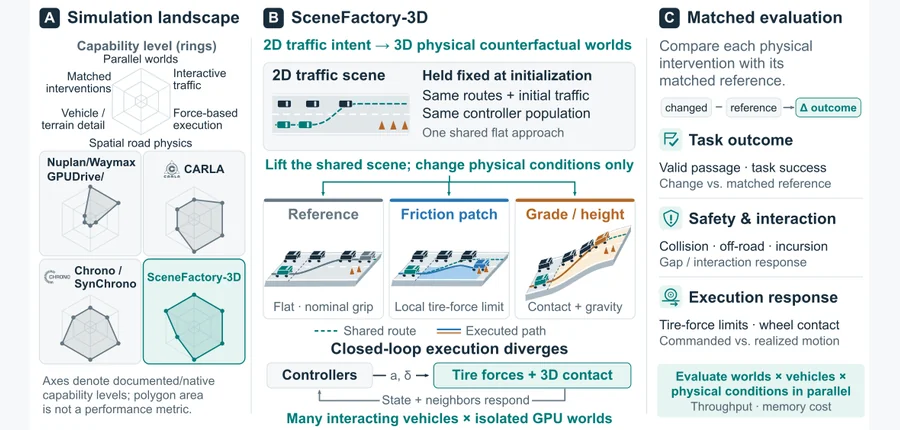 arXiv New 2026-10-05 · cs.RO · #1 **[SceneFactory-3D: Lifting 2D Traffic Scenes into 3D Physical Counterfactuals for Scalable Physically Grounded Safety Evaluation](https://arxiv.org/abs/2610.02874)** Yicheng Zhu, Linfeng Tian, Tianmu Zhao, Yang Chen, Fan Zuo, Tao Li, Zilin Bian 机构：Rochester Institute of Technology / City University of Hong Kong / New York University（官方 HTML） [Paper](https://arxiv.org/abs/2610.02874) · [图源](https://arxiv.org/html/2610.02874v1/figures/fig1_matched_eval.png) 

中文摘要
可扩展驾驶模拟器通常依照预设的行为或运动学规则执行车辆指令，忽略轮胎与道路界面的物理作用，因此难以刻画不利道路和环境条件如何改变车辆执行过程并在交通流中传播。为解决这一局限，我们提出 SceneFactory-3D，一个采用 GPU 批处理、以物理为基础的多智能体驾驶模拟器。车辆通过在每个车轮接触点计算、受悬架和摩擦限制的力来执行加速与转向指令。空间变化的摩擦、每个模拟世界各自的3D高度场、重力和刚体接触，共同决定车轮运动与车身碰撞。各世界独立的地形和 GPU 批处理，使 SceneFactory-3D 能够并行运行匹配的物理反事实实验：交通场景设置和车辆控制器保持固定，只改变道路条件，从而跨平行世界评估由此产生的闭环效应。为展示这种反事实评估的优势，我们实证研究车辆控制器对道路条件的敏感性。在每种条件下，对三类学习策略使用 1,024 个匹配的、各含 12 辆车的世界；在共享的 32 个世界子集上评估两种经典规划器；共覆盖 21 种摩擦与坡度条件。摩擦系数从 1.0 降至 0.18 时，各学习策略中安全通过施工区域的车辆比例下降 6 至 90 个百分点（经典规划器为 18 至 19 个百分点），且所有学习策略的近碰撞情况都更频繁。代码：https://github.com/SmallWorldLab/SceneFactory_3D <a href="https://arxiv.org/abs/2610.02874">原摘要来源</a>
 | 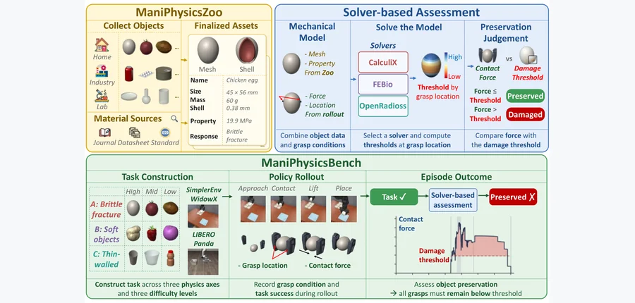 arXiv New 2026-10-05 · cs.RO · #2 **[ManiPhysicsBench: Physics-Based Assessment of Object Preservation in VLA Manipulation](https://arxiv.org/abs/2610.02802)** Sangwu Park, Yeonjun In, Wonjoong Kim, Sungwon Kim, Sein Kim, Chanyoung Park 机构：KAIST（官方 HTML） [Paper](https://arxiv.org/abs/2610.02802) · [图源](https://arxiv.org/html/2610.02802v1/architecture.png) 

中文摘要
视觉—语言—动作（VLA）模型旨在执行多种操作任务，但现有刚体基准中的任务成功，并不能说明它们能否保护物体。我们提出 ManiPhysicsZoo，将有文献支持的材料属性、3D网格及相应参考资料整合为可复用的物体资产。基于这些资产，求解器式评估依据物体几何、材料属性和记录的抓取条件，计算针对具体抓取的损伤阈值，并与记录的接触力比较，以评估潜在形变和断裂。在此基础上，ManiPhysicsBench 在 LIBERO 和 SimplerEnv 中沿三个物理维度、三个难度级别评估物体保护能力。公开 VLA 检查点的任务成功率与安全成功率存在显著差距；安全成功定义为完成任务且物体保持完好。它们的夹爪指令集中于几乎全开和全闭，且不同物体上的总体分布大体相似，这与二值夹爪监督一致。我们通过重新训练一个 VLA 模型，考察按物体区分的连续夹爪标签如何改变模型行为。重新训练的模型表现出更依赖物体的夹持方式和更高的安全成功率，但任务成功率更低，保护物体的行为泛化仍有限。 <a href="https://arxiv.org/abs/2610.02802">原摘要来源</a>
 | 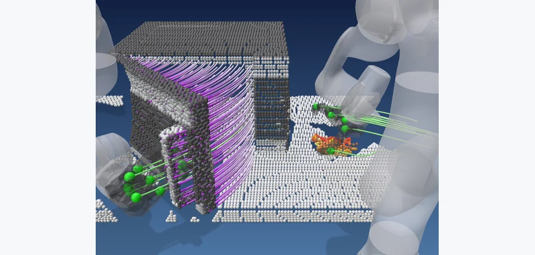 arXiv New 2026-10-05 · cs.RO · #3 **[PointWAM: 3D World Action Modeling for Dexterous Robotic Manipulation](https://arxiv.org/abs/2610.02840)** Chunghyun Park, Beomjun Kim, Seungcheol Park, Heeseung Kwon, Yashu Shukla, Seunghoon Sim, Jinwoo Shin, Minsu Cho 机构：POSTECH / KAIST / Hanyang University / RLWRLD（官方 HTML） [Paper](https://arxiv.org/abs/2610.02840) · [图源](https://arxiv.org/html/2610.02840v1/figures/teaser/forecast.png) 

中文摘要
世界动作模型联合学习预测世界动力学和机器人动作，使内部学到的世界动力学指导准确动作。现有方法通常用 RGB 帧或其潜在表示描述世界，并以末端执行器位姿或关节角预测动作，但往往难以捕捉灵巧操作所需的3D空间结构和接触几何。我们提出 Point World Action Model（PointWAM），一种3D世界动作模型：将世界分解为场景（环境）和手（执行者），在共享的时空坐标系中联合预测二者的3D点轨迹。这种显式且解耦的表示，无须针对任务选择物体或关键点，就能有效利用大规模人类示范视频预训练。给定彩色点云和语言指令，PointWAM 预测场景与手如何随时间在3D空间中共同演化，再将预测的手部运动重定向为机器人动作。人类视频预训练使 DexJoCo 平均成功率提高 56.9 个百分点；相较只预测手，场景轨迹监督额外提高 10.9 个百分点。两者结合后，PointWAM 在十项 DexJoCo 任务上比此前最优方法高 11.7 个百分点，并在真实机器人上优于强 VLA 基线。 <a href="https://arxiv.org/abs/2610.02840">原摘要来源</a>
 |
| 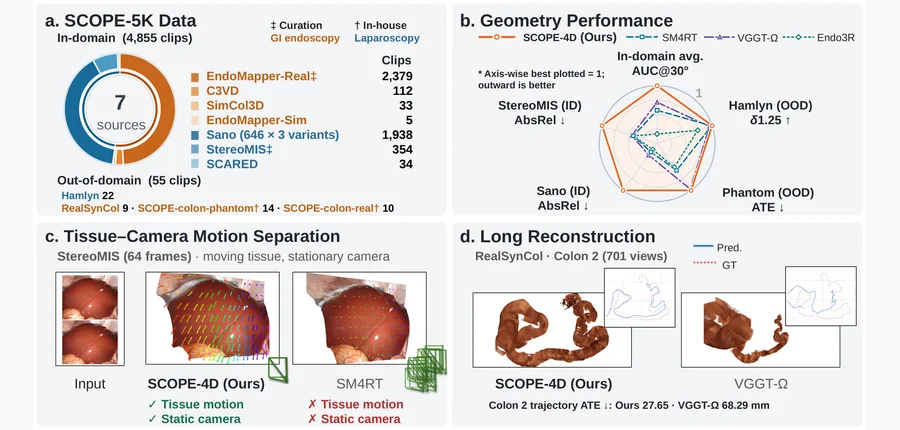 arXiv New 2026-10-05 · cs.CV · #4 **[SCOPE-4D: Endoscopic 4D Geometry Foundation Models](https://arxiv.org/abs/2610.02343)** Chaoyi Zhou, Zhongpai Gao, Anwesa Choudhuri, Meng Zheng, Benjamin Planche, Run Wang, Terrence Chen, Siyu Huang, Ziyan Wu 机构：United Imaging Intelligence / Clemson University（PDF 首页） [Paper](https://arxiv.org/abs/2610.02343) · [图源](https://arxiv.org/html/2610.02343v1/SCOPE_4D_teaser_cropped.png) 

中文摘要
几何理解有助于内镜导航和机器人辅助，但学习可靠的内镜几何面临两个挑战：几何标注稀缺，以及相机运动与组织形变之间存在歧义。我们提出 SCOPE-4D，一种内镜4D几何基础模型，可在一次前向传播中从单目 RGB 视频联合预测相机参数、稠密几何和3D组织轨迹。我们的整理与标注流程构建了 SCOPE-5K，包含约 5,000 段真实与合成的胃肠内镜及腹腔镜视频。该集合提供丰富的几何监督，并纳入新采集的仿体和真实结肠镜评估集。在 SCOPE-5K 上进行几何监督微调，可学到改进相机与深度估计的内镜先验。Common--Residual Motion（CRM）进一步约束相对于组织共同运动的局部形变。结合几何监督后，CRM 和轨迹监督不仅相对单独的几何微调进一步改善相机与深度估计，也实现稠密3D组织跟踪。在公开和新采集的基准上的评估显示，该方法具有较强的域内与域外几何估计、更好的3D跟踪以及更稳定的长序列结肠重建。盲法用户研究进一步支持其在真实临床视频上的感知重建质量。这些结果共同说明，大规模内镜监督与运动约束有助于联合几何估计和组织跟踪。 <a href="https://arxiv.org/abs/2610.02343">原摘要来源</a>
 | 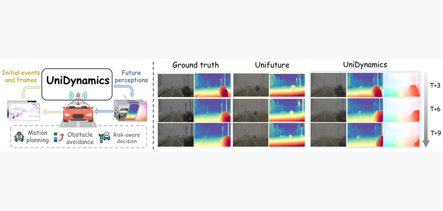 arXiv New 2026-10-05 · cs.CV · #5 **[UniDynamics: Event-RGB Fusion for Unified Future 4D Dynamic Scene Generation](https://arxiv.org/abs/2610.03473)** Daikun Liu, Xin Zhan, Teng Wang, Xiaoping Wang, Changyin Sun 机构：Southeast University / Huazhong University of Science and Technology（官方 HTML） [Paper](https://arxiv.org/abs/2610.03473) · [图源](https://arxiv.org/html/2610.03473v1/figure1_h.png) 

中文摘要
我们提出 UniDynamics，一种基于扩散的框架，可从单对事件数据与 RGB 图像生成未来4D动态场景（RGB、深度和光流）；与现有方法不同，它无需长历史或控制先验，同时显式建模未来运动场。核心思想是利用事件流为单张 RGB 图像的外推提供另一种运动先验，并通过多模态建模在整个生成过程中施加几何和运动约束。具体而言，我们设计 Event Latent Enhancement（ELE）模块，将事件潜变量对齐并增强为可注入扩散模型的条件特征，提供稳健的初始运动先验以及可靠的纹理和结构线索。我们还在多尺度 U-Net 中引入 Perceptual Dynamics Space（PDS），使深度与光流解耦并自适应交互，同时持续向外观特征反馈约束，从而提高几何与运动的一致性，得到物理上合理且时空连贯的预测。在 VKitti2 和 DSEC 上的实验显示，方法达到当前最优表现，生成高质量、时间连贯、4D一致的未来预测，尤其在具有挑战性的高速运动模糊情况下如此。 <a href="https://arxiv.org/abs/2610.03473">原摘要来源</a>
 | 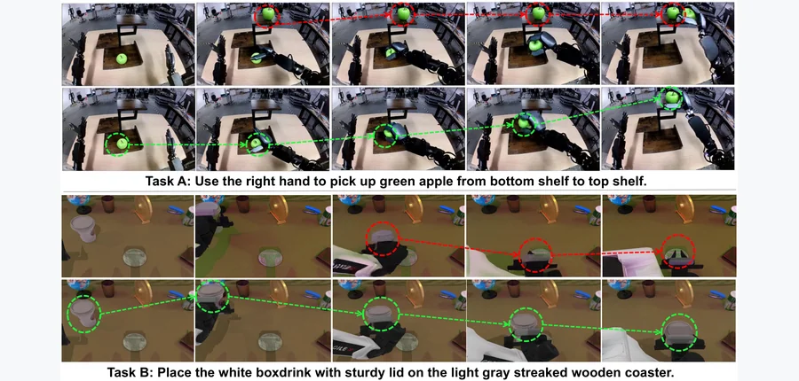 arXiv New 2026-10-05 · cs.CV · #6 **[EVEWorld: Physical Evolution Supervision for Embodied World Models](https://arxiv.org/abs/2610.03374)** Kaiqi Wang, Songxin Zhang, Zejian Xie, Xiao Xiong, Zhuoyang Song, Ziwei Wu, Jun Yu Lu, Yitan Teng, Ziying Song, Jiaxing Zhang 机构：China Merchants Group / Nanyang Technological University（官方 HTML） [Paper](https://arxiv.org/abs/2610.03374) · [图源](https://arxiv.org/html/2610.03374v1/fig2.png) 

中文摘要
具身世界模型能够为机器人学习大规模模拟具身交互。然而，现有模型容易出现“模型惰性”：重视视觉逼真度而牺牲物理推理，并缺少对被操作物体时序动力学的过程级监督。我们提出 EVEWorld，一个用于实现物理一致目标演化的物理演化监督框架。EVEWorld 包含两个组件：Instance-Guided Restoration（IGR）和 Temporal Instance Alignment（TIA）。首先，IGR 通过恢复监督促进实例一致性；其次，TIA 通过对齐相邻帧中的目标实例促进跨帧一致性。我们还提出 Model Laziness Rate（MLR），衡量生成轨迹中实例一致性持续违规的比例。在 DreamGenBench、EWMBench 和 PBench 上的大量实验表明 EVEWorld 有效；尤其与 GigaWorld-0 相比，MLR 降低 87.5%。在 WorldArena 2.0 Track 1 排行榜上，模型的 JEPA Similarity 排第 6、总体排第 17，进一步验证演化监督策略的表现。 <a href="https://arxiv.org/abs/2610.03374">原摘要来源</a>
 |
| 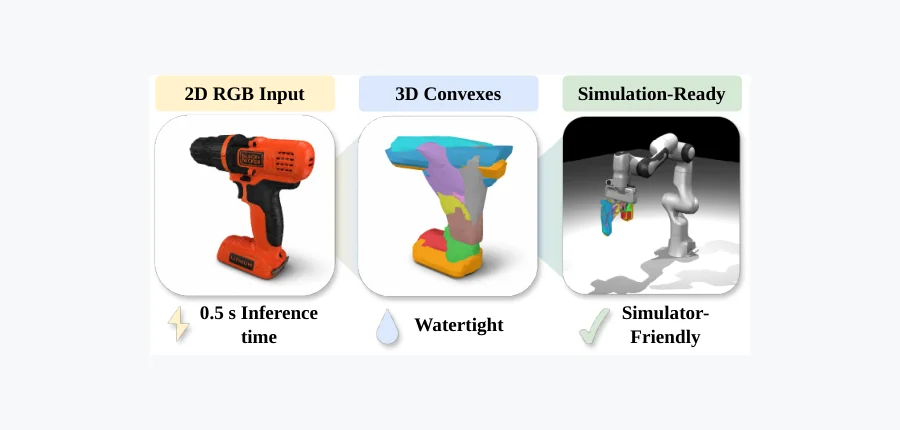 arXiv New 2026-10-05 · cs.RO · #7 **[I2CD: Direct Image-to-Convex Decomposition for Simulation-Ready Collision Geometry](https://arxiv.org/abs/2610.03453)** Qian Wang, Liam Merz Hoffmeister, Brian Scassellati, Daniel Rakita 机构：Yale University（官方 HTML） [Paper](https://arxiv.org/abs/2610.03453) · [图源](https://arxiv.org/html/2610.03453v1/teaserv2.png) 

中文摘要
物理模拟器和运动规划器需要凸的碰撞几何，但图像到3D的生成模型输出的是密集且常常非流形的视觉网格。如今连接两者需要先重建再分解的缓慢且脆弱流程，涉及修复、简化和近似凸分解。我们提出 I2CD，直接从单张 RGB 图像预测凸分解。I2CD 不训练新的图像到3D模型，而是冻结预训练的 Hunyuan3D-2 图像条件扩散 Transformer 与形状解码器，只训练一个轻量交叉注意力头（38M（3,800 万）参数，训练少于 10 GPU 小时）；其学到的“凸槽位” token 输出 K 个凸多面体的半平面参数。输出紧凑且按构造即为凸形，无须任何后处理即可载入物理引擎，每张图像约需 0.5 秒。在 227 个留出的 OmniObject3D 和 Google Scanned Objects 实例上，I2CD 在八种先重建再分解流程中达到最高的体积 IoU，端到端速度快 6 至 37 倍。在 MuJoCo、PyBullet、Genesis 和 Isaac Sim 的跨模拟器研究中，每个引擎都直接使用 I2CD 输出的几何；原始生成网格虽在各引擎中都能“载入”，但多数情况下碰撞形状会被悄悄替换，或需要每个物体数秒至数分钟的预处理。在实体 xArm7 上，I2CD 为包含 20 个物体的杂乱场景生成可供规划的几何需 11 秒，而最强基线需 328 秒；二者的抓取放置执行成功次数分别为 100 次中的 85 次和 90 次，表现接近。 <a href="https://arxiv.org/abs/2610.03453">原摘要来源</a>
 | 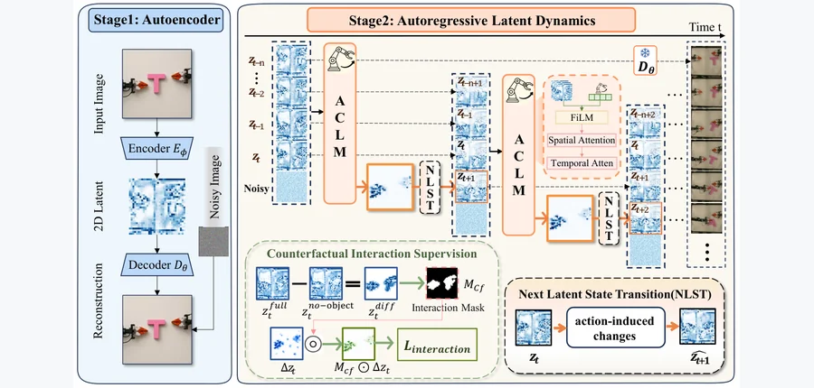 arXiv New 2026-10-05 · cs.RO · #8 **[DeltaWorld: Physically Consistent Interactive World Simulators via Action-Conditioned Latent Increment Learning](https://arxiv.org/abs/2610.02691)** Boyuan Hou, Xiaoge Cao, Chaofan Zhang, Shuo Wang, Shaowei Cui 机构：Imprintx Robotics / State Grid Jibei Electric Power / Chinese Academy of Sciences（官方 HTML） [Paper](https://arxiv.org/abs/2610.02691) · [图源](https://arxiv.org/html/2610.02691v1/method_overview.png) 

中文摘要
交互式世界模拟器通过预测动作后果、减少反复进行实体交互的依赖，可为机器人规划、策略训练和评估提供可扩展环境。要服务这些用途，它们必须生成忠实响应机器人动作、并能在长时域保持机器人与物体交互动力学的未来图像序列。然而，现有世界模型通常预测整个下一潜在状态，往往遗漏机器人动作造成的细微变化，进而产生物体互穿、过度形变等物理上不合理的结果。为此，我们提出用于机器人操作的物理一致交互式世界模拟器 DeltaWorld。其 Delta Latent Transition Model（Delta-LTM）预测动作引起的潜在特征增量，并将其加到当前潜在状态得到下一状态，而非直接预测下一潜在状态。为了减轻预测未来帧中的物体互穿和过度形变，我们引入 Interaction-aware Latent Alignment，构建反事实交互区域并监督与交互有关的潜在变化。在 IWS 操作基准和自采集的跨机器人数据集上评估 DeltaWorld，后者涵盖多种机器人形态和操作任务。在跨机器人数据集上，相对 IWS 基线，DeltaWorld 的 FVD 降低 46.6%，LPIPS 降低 31.1%。结果显示该方法用于机器人操作中长时域动作条件视频预测的潜力。 <a href="https://arxiv.org/abs/2610.02691">原摘要来源</a>
 | 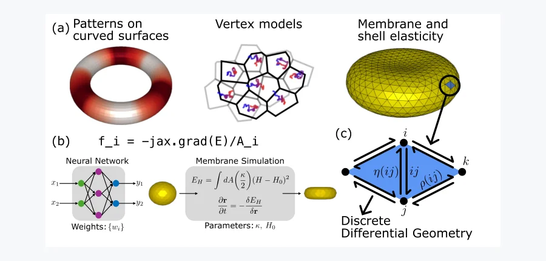 arXiv New 2026-10-05 · cond-mat.soft · #9 **[triangulax: Differentiable Simulations with Triangular Meshes across Soft Matter Physics](https://arxiv.org/abs/2610.02566)** Samuel Silliman, Qiwei Yu, Nikolas Claussen 机构：Princeton University / Stanford University（官方 HTML） [Paper](https://arxiv.org/abs/2610.02566) · [Code](https://github.com/nikolas-claussen/triangulax) · [图源](https://arxiv.org/html/2610.02566v1/Fig_1.png) 

中文摘要
许多物理与生物系统，例如泡沫、薄膜、弹性壳和组织薄片，可以在数学上描述为2D曲面。这些曲面能够承载反应—扩散系统等复杂动力学，并发生剧烈形变。我们提出 triangulax，一个用于模拟与几何处理的开源 Python 库，以三角网格离散曲面，地址为 https://github.com/nikolas-claussen/triangulax。它结合了两项特性。第一，离散微分几何提供不依赖坐标的离散化，使强形变曲面的模拟成为可能。第二，该库建立在机器学习框架 JAX 上，因此可对基于网格的能量及整个模拟过程自动求导，包括含随机力或拓扑修改的模拟。这通过自动计算力简化了多物理模拟，也使模型参数能够拟合实验数据或设计目标。我们实现了一个在强形变曲面上保持网格质量的算法，并将其用于膜力学与膜上浓度场耦合的模型。我们用精确解和现有软件验证方法，并展示 triangulax 在膜力学、顶点模型以及形变弹性片逆向设计等问题上的应用。 <a href="https://arxiv.org/abs/2610.02566">原摘要来源</a>
 |
| 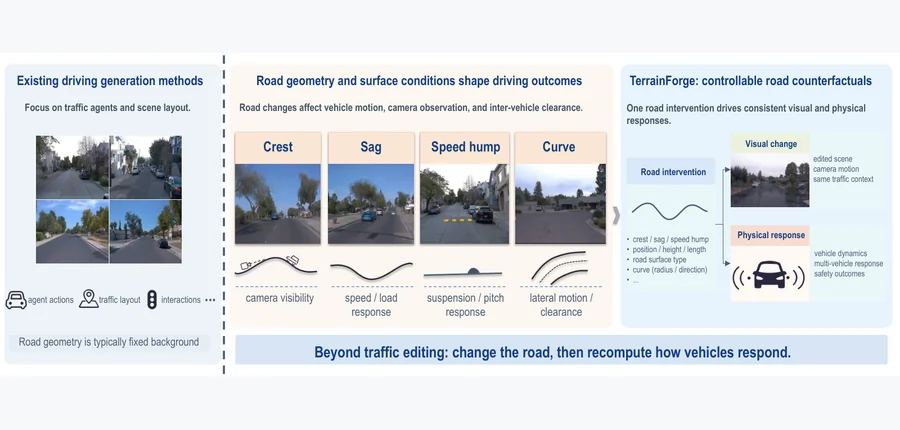 arXiv New 2026-10-05 · cs.CV · #10 **[TerrainForge: Physics-Grounded road geometry Editing for Counterfactual Autonomous Driving](https://arxiv.org/abs/2610.02825)** Yang Chen, Yicheng Zhu, zhenning Li, Tao Li, Zilin Bian 机构：Rochester Institute of Technology / University of Macau / City University of Hong Kong（官方 HTML） [Paper](https://arxiv.org/abs/2610.02825) · [图源](https://arxiv.org/html/2610.02825v1/concept_overview_v2.png) 

中文摘要
道路几何（如凸坡、凹坡和减速丘）及路面条件（如湿滑或结冰）会影响车辆如何运动、驾驶员与车载摄像头看到什么，以及车辆之间剩余多少间距。因此，在驾驶场景中编辑这些属性，必须相应改变车辆运动。要在驾驶视频中呈现这些差异，道路编辑需要传导至车辆运动、相机视角和车间距离。我们提出 TerrainForge，一种从重建的多车驾驶片段生成以道路几何为重点的反事实场景的框架。统一的道路模型将场景形变与四轮车辆动力学联系起来，使凸坡、凹坡、减速丘和摩擦变化传导到车辆运动、相机视角及车间距离。车辆动力学以 CarSim 为参照评估；指定的道路几何在重建的 Waymo 场景中得到核验。在 18 段驾驶片段中，若让周围车辆沿记录轨迹行驶，而不重新计算它们的响应，预测的自车与前车距离峰值差异的中位数在凸坡和凹坡情形下分别达到 1.52 米和 1.41 米。我们还在 983 段制动片段中模拟自车对 15,758 次道路编辑的响应，将每次编辑与未编辑回放相比的安全结果配对。这些配对数据训练了第一阶段筛选代理模型：它以原始驾驶情境和候选道路编辑参数为输入，预测自车终点间距的变化。在留出场景上，相比预测“没有变化”，其平均绝对误差降低 22% 至 40%，因此可在完整多车推演之前廉价筛选候选编辑。 <a href="https://arxiv.org/abs/2610.02825">原摘要来源</a>
 | 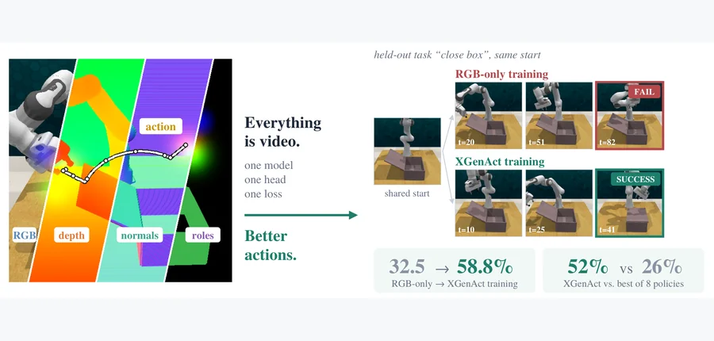 arXiv New 2026-10-05 · cs.RO · #11 **[XGenAct: Geometry-Enhanced World Action Models through Cross-Task Generation](https://arxiv.org/abs/2610.03516)** Tingting Du, Ziyao Wang, Guoheng Sun, Ang Li 机构：University of Wisconsin–Madison / University of Maryland（官方 HTML） [Paper](https://arxiv.org/abs/2610.03516) · [图源](https://arxiv.org/html/2610.03516v1/teaser_v4.png) 

中文摘要
世界动作模型（WAM）通过预测观测和动作如何随时间演化，推动了机器人控制的发展。尽管如此，基于 RGB 和动作的未来预测并未显式处理机器人操作所需的空间理解。现有尝试往往通过专门的头或分支加入有限的空间预测任务，使空间监督范围和模型架构都较为割裂。我们提出 XGenAct：通过确定性编解码器，把 RGB 观测、机器人动作、公制深度、表面法线和功能角色分割都表示为 RGB 视频的世界动作模型。通过在训练中采样感知和动作任务，XGenAct 只用一个视频扩散 Transformer 和一个目标来学习这些空间中的时间预测，而不需要针对模态的学习头。在留出的 RLBench 任务上，结构化感知训练相对仅用 RGB 的训练提高了平均闭环成功率；在五任务外部比较中，XGenAct 的成功率达到 52%，而受评最强基线为 26%。相对于先生成 RGB、再应用冻结感知专家的受评流程，它对未来深度和分割的预测也更准确。 <a href="https://arxiv.org/abs/2610.03516">原摘要来源</a>
 | 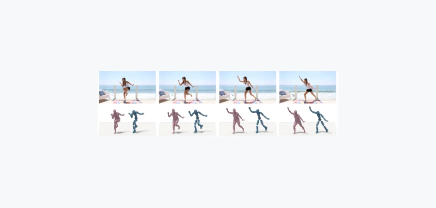 arXiv New 2026-10-05 · cs.CV · #12 **[FlowHMR: Physically Plausible Motion Capture from Video](https://arxiv.org/abs/2610.03691)** Zhanke Wang, Chengfeng Zhao, Qing Shuai, Jingzhong Lin, Heng Li, Zeyu Ling, Yuxin Wen, Jing Li, Di Kang, Chunchao Guo, Lin… 机构：Peking University / HKUST / Tencent / East China Normal University / Sun Yat-sen University / Zhejiang University（官方 HTML） [Paper](https://arxiv.org/abs/2610.03691) · [图源](https://arxiv.org/html/2610.03691v1/dance_ours1.png) 

中文摘要
我们提出 FlowHMR，一个从单目视频恢复物理上合理的全局3D人体运动的框架。以往基于学习的方法通常从视频直接回归人体运动，并用几何监督训练网络。然而，从单目视频恢复人体运动本身存在深度歧义，直接回归容易坍缩到平均解。此外，恢复的运动不保证物理合理，因此基于物理的跟踪常会失败。为解决这些挑战，我们将视频动作捕捉表述为视频条件运动生成问题，首先为该任务预训练一个流匹配模型。给定输入视频，预训练模型生成多样的运动候选，但并非所有候选都忠实于视频或能被物理跟踪。因此，我们使用 Group Relative Policy Optimization（GRPO）和两种奖励对模型后训练：保真奖励鼓励与输入视频一致；跟踪奖励偏向物理控制器能够成功跟踪的运动。两种奖励共同改变模型的输出偏好，使后训练模型在忠实于输入视频的同时产生更合理的物理运动。我们还提出 Wild-4K，一个包含约 4,000 段多样互联网视频的大型数据集，用于评估自然场景中的人体运动恢复。在 Wild-4K 上的定性和定量实验显示，方法在整体运动保真度上优于现有最优方法，物理跟踪成功率为 82.47%，而最强基线 GVHMR 为 62.82%。 <a href="https://arxiv.org/abs/2610.03691">原摘要来源</a>
 |
| 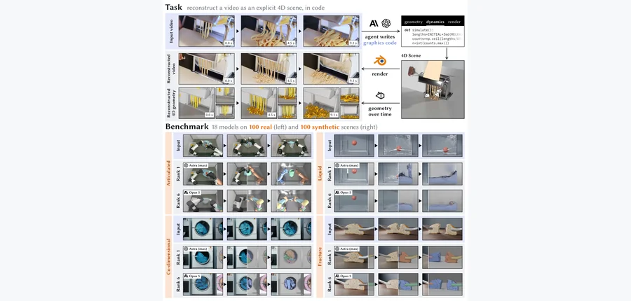 arXiv New 2026-10-05 · cs.CV · #13 **[4DCodeBench: Benchmarking Agents on Inverse Graphics of Dynamic Scenes](https://arxiv.org/abs/2610.03715)** Ruihong Shen, Žiga Kovačič, Peter Kulits, Xingrui Wang, Zizhang Li, Joshua B. Tenenbaum, Alan Yuille, Jieneng Chen, Jiajun Wu 机构：Johns Hopkins University / Stanford University / Max Planck Institute for Intelligent Systems / MIT（官方 HTML） [Paper](https://arxiv.org/abs/2610.03715) · [Code](https://github.com/4DCodeBench/4DCodeBench) · [图源](https://arxiv.org/html/2610.03715v1/teaser_cats_labels_light_1.png) 

中文摘要
我们提出 4DCodeBench，一个通过代码生成评估4D逆图形能力的基准：智能体要把视频中的动态场景重建为可执行的图形程序。为此，智能体必须将视觉观测转化为场景结构与动力学的紧凑表示，并实现物理模拟等抽象来复现复杂行为。为评估这一能力，我们整理了一组真实世界视频，并构建覆盖形变、流体流动和断裂等不同物理现象的合成场景。对前沿模型的大范围基准测试发现，较强的静态重建能力尚未转化为可靠的复杂动力学重建能力。4DCodeBench 为跟踪智能体通过代码理解世界动力学的进展提供了试验平台。基准地址：https://github.com/4DCodeBench/4DCodeBench <a href="https://arxiv.org/abs/2610.03715">原摘要来源</a>
 | 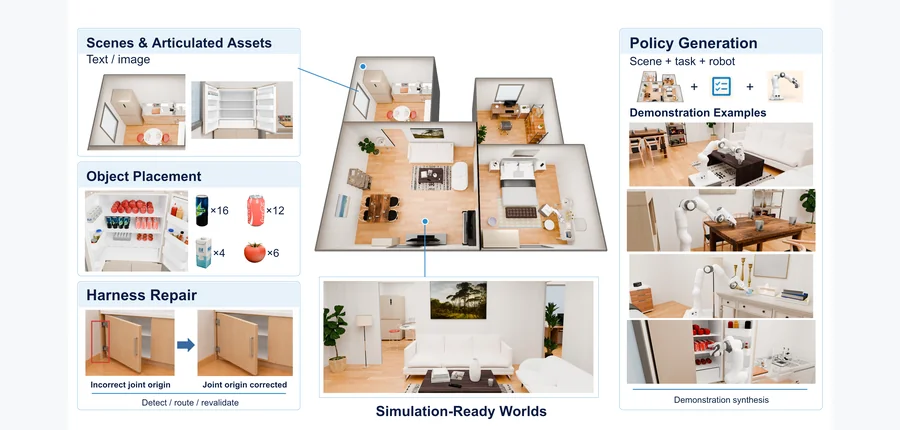 arXiv New 2026-10-05 · cs.RO · #14 **[Awomo-SimDataEngine: Agentic Simulation-ReadyWorld Generation](https://arxiv.org/abs/2610.02274)** Awomo-PhysicalRSI Team, Danjiao Ma, Enhui Ma, Haohan Liu, Heng Jia, Hui Shan, Jianhua Xu, Jiahuan Zhang, Jiangdi Xu, Kaiwe… 机构：affiliation 未确认 [Paper](https://arxiv.org/abs/2610.02274) · [图源](https://arxiv.org/html/2610.02274v1/figures/teaser1.png) 

中文摘要
生成有用的机器人训练数据，所需的不只是视觉上可信的场景：物体必须支持交互，摆放必须在物理上有效，任务必须能够重复执行。我们提出 Awomo-SimDataEngine，一个将资产与场景生成连接到机器人示范合成的智能体系统。共享资产服务提供刚体和关节物体，其中包括通过 ISArt 基于结构生成部件与关节。场景生成支持两条互补路线：Unravel 从图像重建可编辑场景，SimForge 从文本构建单房间和多房间环境。图结构原生的调度框架协调构建、验证和有界修复，将失败交还负责模块，同时保留未受影响的场景状态。PolicyForge 将验证过的世界与任务及机器人形态绑定，生成可重放示范。评估覆盖资产几何、场景质量和下游策略学习。在基于 MuJoCo 的 LIBERO-Plus 上，加入 Isaac Sim 示范共同训练，使世界动作模型（WAM）的总体成功率从 77.17% 提高到 89.43%；目标任务和空间任务的成功率分别提高 31.66 和 6.25 个百分点。这些结果支持生成数据用于跨模拟器策略训练的效用，但在长时域任务上的收益较有限。 <a href="https://arxiv.org/abs/2610.02274">原摘要来源</a>
 | 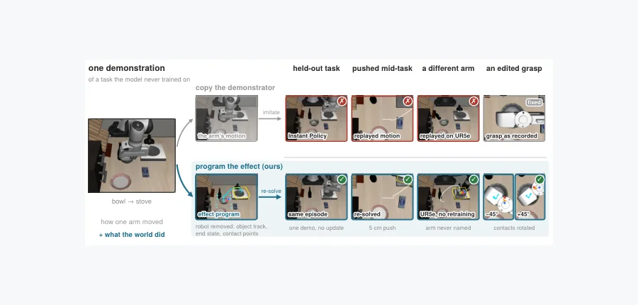 arXiv New 2026-10-05 · cs.RO · #15 **[Keep the Effect, Drop the Actor: Programmable Effect-to-Execution World-Action Models](https://arxiv.org/abs/2610.02398)** Junyi Hu, Zhewen He, Zhenhua Li, Yi Fang 机构：New York University Abu Dhabi / Chatsign Technology（官方 HTML） [Paper](https://arxiv.org/abs/2610.02398) · [图源](https://arxiv.org/html/2610.02398v1/fig1_teaser_v2.png) 

中文摘要
一段机器人示范在同一组画面中记录了两件事：物体发生了什么，以及某一只特定机械臂如何使它发生。我们以第一件事为条件。示范被编译成效果程序：发生运动的物体的3D关键点轨迹、标记各物体被握持位置的两个点，以及场景最终构型，而示范者被移除。PEWAM 是一个具有 71.5M（7,150 万）参数的世界动作模型，它以四个流生成效果、机器人执行、动作和终止状态，每个流有独立的流匹配时间。因此，固定程序并采样执行便将推理转化为编程，并能依据实时场景在闭环中重新求解。在留出的 LIBERO-Goal 任务上，单段示范的程序完成 90 次实验中的 40 次；相同骨干以目标图像或语言为条件，以及已发表的示范条件方法，最多完成 19 次。在 Meta-World 的五个留出类别中，它在三个类别超过已发表的最佳结果，但在五类平均值上没有超过。由于程序是一组坐标，人可以编辑它：移动终止状态会移动放置位置，旋转接触点会改变抓取。相同程序无需重训练即可在四种机械臂上运行；受一次推撞后，重新求解完成 60 次中的 23 次，而重放示范仅完成 6 次。在 Franka 机械臂上，模型用其他任务的真实示范微调后，从单段人类视频编译的程序完成 40 次中的 36 次；相同骨干以该视频最后一帧作为目标图像时完成 22 次。 <a href="https://arxiv.org/abs/2610.02398">原摘要来源</a>
 |
| 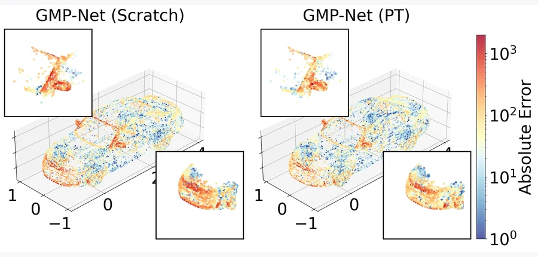 arXiv New 2026-10-05 · cs.AI · #16 **[Geometry Meets Physics: Data-Efficient Pre-Training for Unstructured Neural PDE Solvers](https://arxiv.org/abs/2610.03363)** Luis Medrano-Navarro, Giacomo Baldan, Qiang Liu, Benjamin Holzschuh, Jan Hagnberger, Mathias Niepert, Nils Thuerey 机构：Technical University of Munich / University of Stuttgart（官方 HTML） [Paper](https://arxiv.org/abs/2610.03363) · [图源](https://arxiv.org/html/2610.03363v1/figures/car_smart_16_sample0_surface_scatter_plot.jpg) 

中文摘要
非结构化3D几何上的偏微分方程（PDE）神经代理模型，常受泛化较差和生成大规模训练数据成本高昂的限制。因此，在大量相关 PDE 动力学数据上预训练，成为提高模型稳健性和可扩展性的重要替代方案。然而，这一策略在算力和数据方面都不高效，因为它依赖生成成本很高的大量预计算数据。我们提出一种面向稳态和瞬态情形、无需磁盘预存数据的预训练框架。对于稳态问题，我们提出几何驱动策略，利用内在形状描述符学习复杂3D区域的表示。对于瞬态问题，我们提出基于在线生成合成 PDE 数据的物理驱动方法，使可扩展预训练不依赖昂贵数据集。多项实验表明，方法在微调时收敛更快、数据效率更高、精度更好，尤其是在现实的少数据情形下。该方法为大型模拟构建数据高效的神经仿真代理提供了一条实用路径。 <a href="https://arxiv.org/abs/2610.03363">原摘要来源</a>
 | 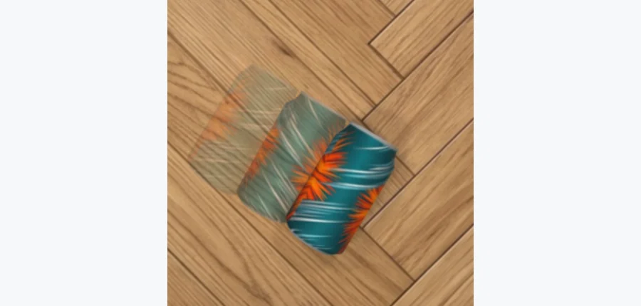 arXiv New 2026-10-05 · cs.CV · #17 **[Does Physics Live in the Activations? Localizing Physical Quantities in Video Diffusion Models](https://arxiv.org/abs/2610.03154)** Jonas Kneifl, Jakub Skalski, Bartłomiej Twardowski, Kamil Deja 机构：IDEAS Research Institute / Computer Vision Center / Warsaw University of Technology（PDF 首页） [Paper](https://arxiv.org/abs/2610.03154) · [图源](https://arxiv.org/pdf/2610.03154) 

中文摘要
视频生成模型能产生十分逼真的序列，并日益被提议作为世界模型，但近期基准揭示其物理推理存在明显不足。这引出一个问题：模型是否内化了物理原理，还是仅重现熟悉的运动模式。我们通过探测视频扩散 Transformer（DiT）的内部表示来研究这一问题，目标是从模拟器获得的物理量真值，涵盖重力与接触条件下的运动学运动和刚体动力学。我们发现，在去噪早期，这些量便能以较高精度线性解码，显著优于直接从模型自身带噪潜变量解码的基线。这说明相关物理信息是在去噪过程中主动构建的，而非输入中已存在。此外，我们表明位于物体上的 token 激活包含相关物理信息，并且跨多帧定义的量可从单帧潜变量读出。因此，信息在 token 序列中高度局部化：通过全局计算，却储存在局部。探针还显示部分外推能力，可迁移到训练范围之外的场景变化与物体构型，因此读出的内容并非仅仅与拟合场景相关。若直接在全分辨率激活空间拟合，探测方向还能作为引导向量来改变模型输出。 <a href="https://arxiv.org/abs/2610.03154">原摘要来源</a>
 | 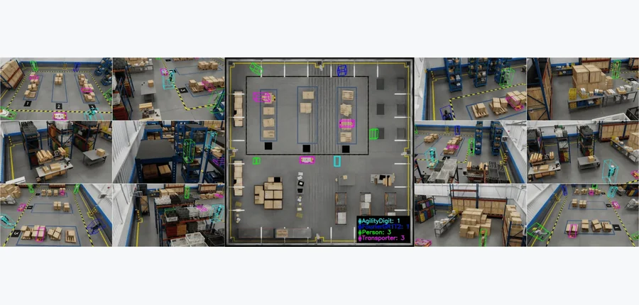 arXiv New 2026-10-05 · cs.CV · #18 **[Physical AI Smart Spaces: A Large-Scale Benchmark for Multi-Camera 3D Perception in Smart Spaces](https://arxiv.org/abs/2610.02580)** Yuxing Wang, Yizhou Wang, Anqi Li, Shuo Wang, Sameer Satish Pusegaonkar, Haoquan Liang, Jiajun Li, Shenxin Jiang, Jianhe Y… 机构：NVIDIA / Santa Clara University（官方 HTML） [Paper](https://arxiv.org/abs/2610.02580) · [Data](https://huggingface.co/datasets/nvidia/PhysicalAI-SmartSpaces) · [图源](https://arxiv.org/html/2610.02580v1/figures/paiss_demo.jpg) 

中文摘要
据我们所知，Physical AI Smart Spaces 是首个同时为室内智能空间提供大规模、多类别、多摄像头3D感知数据的基准。它包含在仓库、医院、零售场所等环境中由近 1,800 台摄像头拍摄的超过 280 小时同步 1080p 视频，并提供多摄像头身份、2D边界框、3D边界框、相机标定，以及可用时的深度等自动标注。基准覆盖 Isaac Sim 合成生成、Cosmos Transfer 外观增强和真实世界 Sim2Real 评估。对于真实目标域，我们纳入两个仓库部署，具有时间同步的视频流、基于 VGGT 的自动标定，以及将世界坐标系3D框投影到各视角以供跨摄像头核验的3D标注界面。我们描述数据集范围、标注与标定规范、生成流程、基准协议，以及标准化提交格式和排行榜报告的官方评估系统。核心贡献是 Higher Order Tracking Accuracy（HOTA）的3D版本，把通常基于2D框的跟踪评估扩展至3D位置和3D框。我们还报告 AI City Challenge 排行榜的实证基线，展示在真实智能空间约束下，方法如何从仅追踪人的3D位置发展到多类别3D框追踪。发布地址：https://huggingface.co/datasets/nvidia/PhysicalAI-SmartSpaces。 <a href="https://arxiv.org/abs/2610.02580">原摘要来源</a>
 |
| 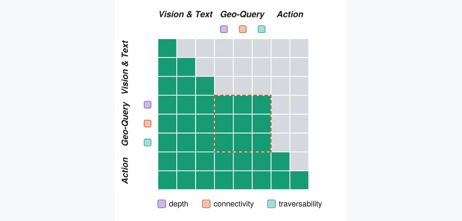 arXiv New 2026-10-05 · cs.RO · #19 **[GeoScaffold: Learning Compact Geometric Latents via Reconstruction for Efficient Vision-Language Navigation](https://arxiv.org/abs/2610.02697)** Yixuan Jiang, Wentong Li, An Liu, Zihao Xin, Fulin Tang, Cong Leng, Yang Gao, Jian Cheng 机构：Nanjing University / Chinese Academy of Sciences / Nanjing University of Aeronautics and Astronautics / MAICRO（官方 HTML） [Paper](https://arxiv.org/abs/2610.02697) · [图源](https://arxiv.org/pdf/2610.02697) 

中文摘要
近年来，视觉语言导航（VLN）系统越来越多采用流式 Video-LLM 策略，将第一人称 RGB 观测和指令直接映射为低层动作。然而，这些策略从2D预训练继承的3D几何先验较弱。现有几何感知扩展在推理时持续付出代价：需要深度传感器、3D编码器，或每一步调用感知工具。我们提出 GeoScaffold，一种几何监督框架，只在训练时支付一次成本，将几何知识内化到策略本身。它首先在训练轨迹的深度图上学习紧凑的深度 tokenizer 并将其冻结，随后用少量可学习的几何查询 token 微调策略，训练它们的隐藏状态重建对导航关键的几何信息，如深度、连通性和可通行性。这种监督将查询状态转化为用于动作解码的紧凑几何潜变量，并通过共享权重把几何信息内化进骨干表示。如同脚手架，tokenizer、目标生成器和重建头在训练后被移除，留下不变的骨干与动作接口。大量实验表明，GeoScaffold 在连续 VLN 基准上持续优于领先的纯视觉导航器，为具空间意识的具身导航模型在边缘设备上的轻量部署提供实用范式。 <a href="https://arxiv.org/abs/2610.02697">原摘要来源</a>
 | 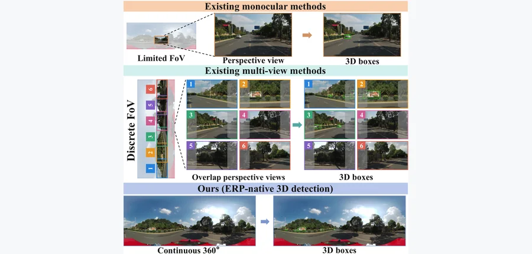 arXiv New 2026-10-05 · cs.CV · #20 **[OmniAct3D: Leveraging Foundation Geometry and Evidence-Grounded Reasoning for Panoramic 3D Detection](https://arxiv.org/abs/2610.03015)** Runtong Wu, Fei Teng, Di Wen, Guoqiang Zhao, Kunyu Peng, Kailun Yang 机构：Hunan University / Karlsruhe Institute of Technology（官方 HTML） [Paper](https://arxiv.org/abs/2610.03015) · [图源](https://arxiv.org/html/2610.03015v1/comparison.png) 

中文摘要
准确的3D检测对移动具身智能体至关重要，而视觉基础模型（VFM）提供可迁移的视觉与几何先验。然而，现有基于 VFM 的3D检测器依赖窄视角单目图像或离散透视视图，限制了连贯的环视感知；等距柱状投影（ERP）则用一张图编码连续的 360 度场景。直接迁移仍很困难，因为 ERP 组织几何和视觉信息的方式不同，使与物体有关的线索难以建模、定位和保留。我们提出 OmniAct3D，在保留可迁移 VFM 先验的同时，将透视视图训练的 VFM 检测器适配到 ERP。为解决几何不匹配，ERP-Ray Geometry Adapter（ERGA-Ray）建模球面视线和周期性空间结构。为在全场景上下文中定位证据，Visual-Action Reasoning Chain（VARC）将每个假设关联到相关全景证据，并转换为结构化几何动作。为恢复固定 token 预算下丢失的局部线索，Appearance-Guided Heading Expert（AGHE）以更高分辨率重新编码物体区域用于朝向估计。实验表明，OmniAct3D 在 Spheriverse 上比此前最佳3D检测器高 2.96 个 NDS 点，在 PanoMMOcc 上比未适配 VFM 基线高 24.87 个 mAP 点。经过针对目标的几何适配，VARC 保留相同配置下 95% 至 98% 的 mAP，表明物体级3D推理可以跨传感配置复用。源代码将发布于 https://github.com/FeiT-FeiTeng/OmniAct3D。 <a href="https://arxiv.org/abs/2610.03015">原摘要来源</a>
 | 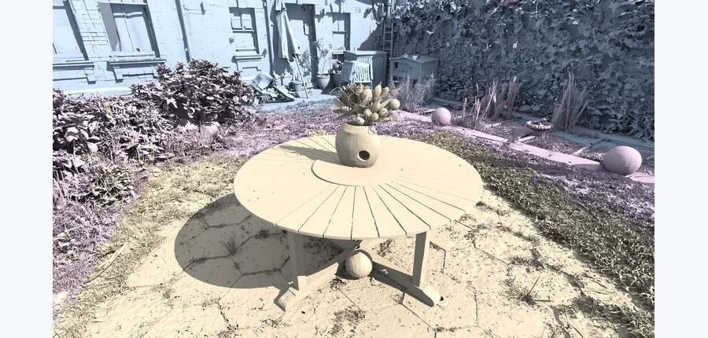 arXiv New 2026-10-05 · cs.CV · #21 **[T3lescope: Arbitrary-Resolution High-Fidelity Generative Surface Reconstruction from Images](https://arxiv.org/abs/2610.03308)** Atsuhiro Noguchi, Tianhan Xu, Yiming Liang, Yuta Kikuchi, Masahiro Ishiyama, Shintaro Takagi, Hitoshi Murai, Eiichi Matsumoto 机构：Preferred Networks / University of Tokyo（官方 HTML） [Paper](https://arxiv.org/abs/2610.03308) · [Project](https://pfnet-research.github.io/t3lescope/) · [图源](https://arxiv.org/html/2610.03308v1/imgs/teaser/hero_cascade.jpg) 

中文摘要
我们从已知位姿的多视角图像重建高保真3D场景网格，无需逐场景优化，覆盖从单个物体到大型户外场景的尺度。逐场景优化方法缺少在观测稀疏、表面有光泽或透明时所需的学习型3D先验。现有生成方法利用这种先验补全稀疏观测区域的几何，但通常只能在有限空间范围内以固定分辨率运行，在覆盖范围与细节之间取舍。因此，重建大型场景常需把场景划分成分别处理且相互重叠的局部区域，难以保持全局几何一致性。为解决这些问题，我们提出 T3lescope：在推理时的由粗到细级联中，跨不同场景尺度使用同一个固定分辨率生成器。粗层级建立场景布局，细层级在越来越精细的空间单元内扰动并去噪继承自粗层级的几何，以恢复表面细节。模型在多尺度的单个单元上训练，所有层级共享权重，因此训练时不固定层次结构；层数、单元尺度和位置都在推理时决定。在室内、户外及城市尺度场景中，T3lescope 优于前馈和生成基线，达到或超过逐场景优化，并能恢复细微结构以及有光泽和透明的表面。结果表明方法可跨不同场景、视图数量和图像分辨率泛化。项目页：https://pfnet-research.github.io/t3lescope/ <a href="https://arxiv.org/abs/2610.03308">原摘要来源</a>
 |
| 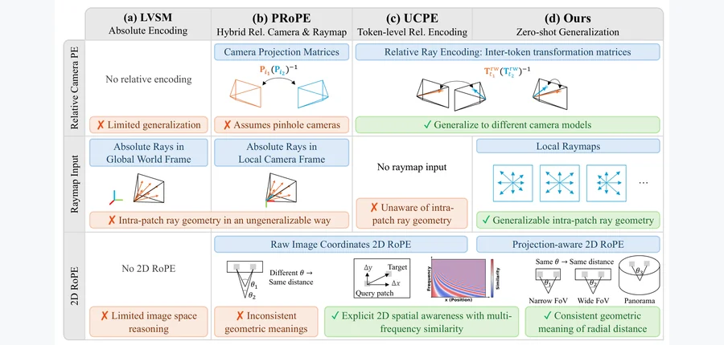 arXiv New 2026-10-05 · cs.CV · #22 **[Feedforward Novel View Synthesis for Heterogeneous Cameras](https://arxiv.org/abs/2610.03522)** Meng Wei, Cheng Zhang, Boying Li, Yihang Chen, Jianmin Zheng, Hamid Rezatofighi, Jianfei Cai 机构：Monash University / Shanghai Jiao Tong University / Nanyang Technological University（官方 HTML） [Paper](https://arxiv.org/abs/2610.03522) · [图源](https://arxiv.org/html/2610.03522v1/method.png) 

中文摘要
前馈式新视角合成最近在稀疏已知位姿图像上取得有希望的结果，但多数现有方法假设输入和目标视图属于固定的相机类型。这一同类相机假设在实际多传感器系统中并不成立：透视、鱼眼和全景相机可能并存，目标投影也可能在训练中从未出现。我们研究不同中心投影相机之间的前馈式新视角合成，并指出 token 化带来的关键歧义：一个视觉 token 汇集了一束依赖投影方式的像素射线，而现有相机编码主要只提供绝对射线或 token 中心之间的关系。为解决这一问题，我们结合相对于 token 中心的相机位置编码和提出的局部射线图；后者是一种 token 级表示，显式描述每个 token 所概括的图像块内部射线分布。我们进一步提出投影感知2D RoPE，用射线诱导的角度坐标替代原始图像网格坐标，使相对位置推理在不同相机投影间对齐。上述组件将不同相机视为对共享射线空间的已标定采样，而非不同视觉域。在含异构相机系统的 ScanNet++ 上，我们的方法在混合相机评估中优于相机条件基线，并展示对全景视图的零样本泛化。 <a href="https://arxiv.org/abs/2610.03522">原摘要来源</a>
 | 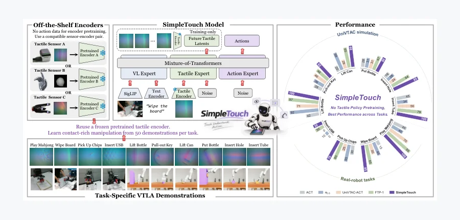 arXiv New 2026-10-05 · cs.RO · #23 **[SimpleTouch: Can Vision-Language-Action Models Master Contact-Rich Manipulation Without Tactile Policy Pretraining?](https://arxiv.org/abs/2610.02784)** Chen Yang, Linzhe Shi, Changjie Wu, Hang Zhang, Ronghan Chen, Lingjun Zhang, Xu Hu, Mu Xu, Jiansheng Fan, Chen Wang 机构：Tsinghua University / Amap, Alibaba Group / Hong Kong Polytechnic University（官方 HTML） [Paper](https://arxiv.org/abs/2610.02784) · [图源](https://arxiv.org/html/2610.02784v1/simpletouch_teaser.png) 

中文摘要
触觉为机器人操作提供必需的接触信息，但将其纳入预训练视觉—语言—动作（VLA）模型仍具有挑战。一种常见担忧是，仅在任务特定微调时加入触觉可能无法弥合跨模态差距，带来有限收益，甚至降低成功率。因此，现有方法常依赖大规模触觉策略预训练或独立的视觉触觉对齐，增加了数据需求与训练阶段。我们提出 SimpleTouch：在 π_{0.5} 上加入触觉专家的简洁 VLA 扩展，以检验这些额外阶段是否必要。专家利用冻结的预训练触觉编码器的所有 token，通过动作监督与多时域未来触觉潜变量预测进行学习。这一单阶段训练仅使用任务示范，无需额外的触觉策略预训练或单独的对齐。每项任务仅用 50 段示范，SimpleTouch 在全部六项 UniVTAC 任务中取得受评方法最高成功率；平均成功率达 77.5%，而 FTP-π_{0.5} 和 FTP-1 分别为 45.2% 和 66.7%，对应提高 32.3 和 10.8 个百分点。在四项真实任务上，平均成功率为 71.3%，高于 FTP-1 8.8 个百分点。这些结果表明，在已有预训练 VLA 和触觉表示的条件下，额外的触觉策略预训练并非在这些任务上取得良好表现的先决条件，为富接触操作提供了更简单的路线。项目页：https://simpletouch-robot.github.io/ <a href="https://arxiv.org/abs/2610.02784">原摘要来源</a>
 | 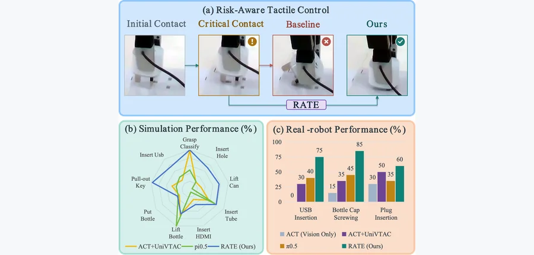 arXiv New 2026-10-05 · cs.RO · #24 **[RATE: Risk-Aware Tactile Encoding for Contact-rich Robotic Manipulation](https://arxiv.org/abs/2610.03538)** Yuyao Jiang, Haichao Liu, Jiarui Zheng, Zihan Ding, Weihao Yuan, Ziwei Wang 机构：affiliation 未确认 [Paper](https://arxiv.org/abs/2610.03538) · [图源](https://arxiv.org/html/2610.03538v1/fig/head.png) 

中文摘要
触觉对富接触机器人操作尤其有价值。近期机器人操作的触觉表示学习取得了显著进展。然而，类似的触觉观测可能来自任务风险含义截然不同的交互条件，例如传感器噪声、任务所需的正常变化，以及正在出现的不良接触。缺少结合情境的风险信息时，下游策略可能难以区分这些情况，因而对无害变化进行不必要的纠正，或对真正危险的接触反应过晚。为解决这一局限，我们提出 Risk-Aware Tactile Encoding（RATE），学习编码任务条件交互风险的触觉表示。具体而言，以历史为条件的预测捕捉交互情境，警报监督则将情境与任务条件风险联系起来。学得的风险感知表示通过轻量残差适配器补充传统触觉特征。模拟与真实世界实验表明，任务成功率显著提高；受控消融证实，警报引导学习和预测式时间建模具有互补收益。 <a href="https://arxiv.org/abs/2610.03538">原摘要来源</a>
 |
| 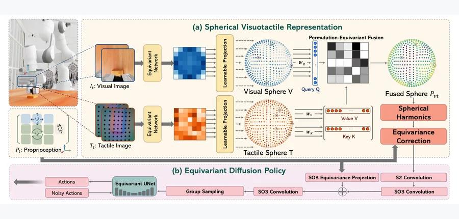 arXiv New 2026-10-05 · cs.RO · #25 **[Equivariant Visual-Tactile Diffusion Policy for Contact-Rich Manipulation](https://arxiv.org/abs/2610.03333)** Lik Hang Kenny Wong, Yiyao Ma, Xiu-Shen Wei, Zelong Tan, Zhuheng Song, Dongsheng Xie, Kai Chen, Qi Dou 机构：Chinese University of Hong Kong / Southeast University（官方 HTML） [Paper](https://arxiv.org/abs/2610.03333) · [Project](https://vista-paper.github.io/) · [图源](https://arxiv.org/html/2610.03333v1/method.png) 

中文摘要
富接触操作的模仿学习需要高质量且获取成本高昂的专家数据，因此学习数据高效的策略是关键问题。为此，我们提出 VISTA，一种工作空间层面等变的视觉触觉扩散策略，用于数据高效的富接触模仿学习。VISTA 将视觉和触觉观测投影为球面 token，通过置换等变的球面融合把触觉接触线索注入视觉球面方向，并利用末端执行器朝向旋转融合后的谐波表示。所得表示作为等变扩散策略的条件，用以预测空间一致的动作。在模拟和真实机器人场景中的大量实验表明，VISTA 相对强视觉触觉模仿学习基线显著提高数据效率。项目网站：https://vista-paper.github.io/ <a href="https://arxiv.org/abs/2610.03333">原摘要来源</a>
 | 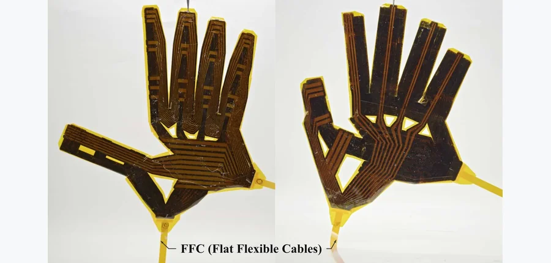 arXiv New 2026-10-05 · cs.RO · #26 **[SoTa: Soft Tactile Skins for Dexterous Manipulation](https://arxiv.org/abs/2610.02338)** Jingyun Yang, Baiyu Shi, Timothy Yu, Haitian Liu, Alberta Longhini, Weichen Wang, Rika Antonova, Zhenan Bao, Jeannette Bohg 机构：Tsinghua University / Stanford University / University of Cambridge（官方 HTML） [Paper](https://arxiv.org/abs/2610.02338) · [图源](https://arxiv.org/html/2610.02338v1/figs/hardware/sensor-teaser-editable-preview-compressed.jpg) 

中文摘要
越来越多的工作表明，在灵巧操作中，触觉为机器人策略提供与视觉互补的接触信息。然而，视觉触觉机器人数据仍然稀缺：灵巧操作示范需要遥操作机器人，限制了数据集规模。人类示范的采集成本低得多，有望扩展此类数据，但前提是人手和机器人手都配备信号对应的触觉传感器。这要求传感器适应不同的手部几何、覆盖整只手，并在不同形态之间共享布局。我们提出 SoTa，一种低成本电容式触觉皮肤，在人手和机器人手上均提供全手覆盖，并在对应手指和手掌区域保留 202 个触觉单元的共享布局。使用织物电极的多层设计使我们能够自行制作薄而软、几何可定制的触觉皮肤，每片材料成本低于 10 美元。经历 10,000 次加载—卸载循环后，传感器仍保留初始响应范围的 97% 以上；经过 1,280 次紧握拳折叠后，走线仍保持连通。共享触觉单元布局支持使用同一触觉编码器进行人—机器人共同训练，无需学习跨传感器映射。在三项富接触操作任务中，触觉观测相对纯视觉策略提高了分布内成功率。在固定机器人示范预算下，加入人类示范使八种评估条件下的平均成功率从 22.8% 升至 45.9%，增加一倍以上，并改善全部五种分布外条件下的成功率。我们计划开源制作和使用这些触觉皮肤所需的资源。 <a href="https://arxiv.org/abs/2610.02338">原摘要来源</a>
 | 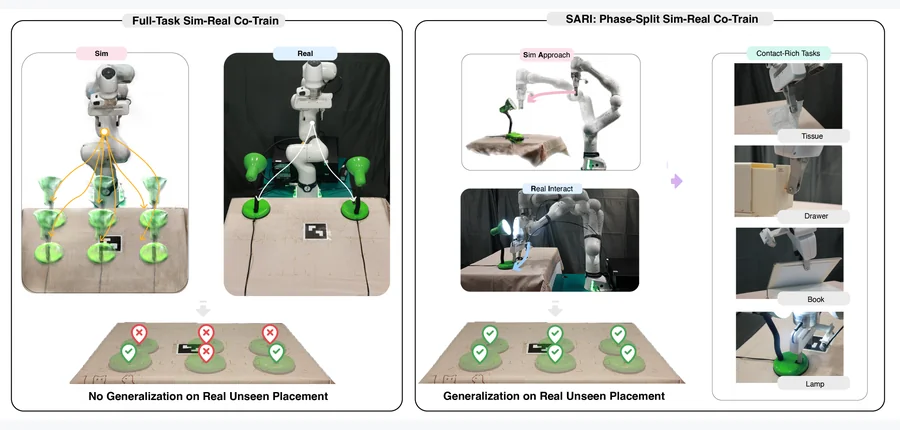 arXiv New 2026-10-05 · cs.RO · #27 **[SARI: Phase-Split Sim-Real Co-Training for Contact-Rich Manipulation](https://arxiv.org/abs/2610.02804)** Xingxin He, Yuxuan Jiang, Haonan Zhang, Chuhan Cui, Kaile Li, Zhongxing Zheng, Caihao Xu, Ziqi Wang 机构：HKUST / BYD（官方 HTML） [Paper](https://arxiv.org/abs/2610.02804) · [图源](https://arxiv.org/html/2610.02804v1/figures/teaser_final_v7.png) 

中文摘要
视觉—语言—动作（VLA）模型在适配富接触操作任务时，常需要昂贵的真实世界示范，尤其是在要求泛化到不同物体摆放位置时。我们提出 SARI（Simulated Approach, Real Interaction），一种按阶段拆分的模拟与真实共同训练框架，其核心认识是：空间覆盖和接触物理应分别从最适合它们的域中获取。具体而言，自由空间接近阶段需要空间多样性，但可以容忍适度模拟误差，因此适合合成生成；相反，接触交互需要准确的物理，但随物体位置变化不大，因此少量真实示范也能泛化到整个工作空间。SARI 在逼真的数字孪生中生成多样的模拟接近轨迹，只在少数摆放位置采集真实接触交互。单一策略在这些分段示范上后训练后，利用视觉外观对齐和共享的相机相对动作表示，将模拟接近与真实接触无缝衔接，无需显式阶段标签或手工编写的切换规则。在五项真实世界富接触操作任务上，SARI 使真实数据采集时间减少 34.3%；在未见过的摆放位置上成功率达到 27.5%，而所有整任务模拟—真实基线均完全失败（0%）。 <a href="https://arxiv.org/abs/2610.02804">原摘要来源</a>
 |
| 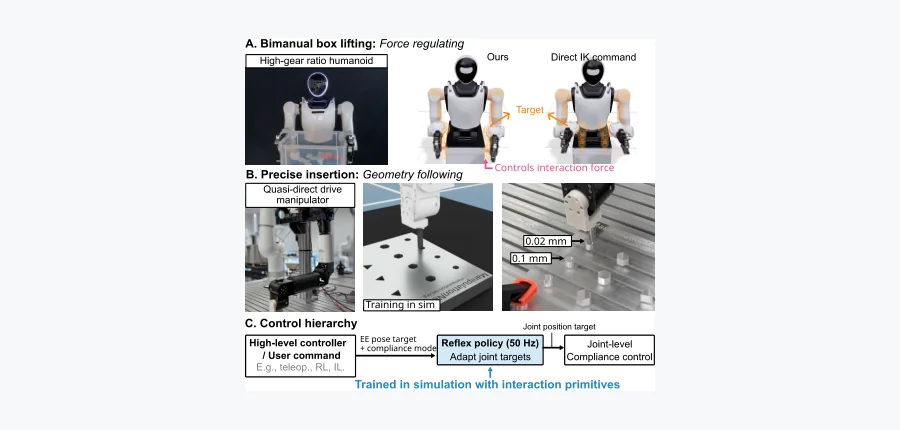 arXiv New 2026-10-05 · cs.RO · #28 **[Learning Reflexive Behavior for Contact-Rich Manipulation](https://arxiv.org/abs/2610.02811)** Quan Nguyen, Yunho Kim, Joonho Lee 机构：Neuromeka（官方 HTML） [Paper](https://arxiv.org/abs/2610.02811) · [图源](https://arxiv.org/html/2610.02811v1/fig1.png) 

中文摘要
在富接触操作中，机器人与环境的相互作用携带局部几何信息：表面阻止穿透，孔道引导插销。利用这些交互的控制器能够顺应环境约束，同时保留任务意图。机器人学习系统通常采用位置控制、力—位混合控制或笛卡尔阻抗控制；但其预设的跟踪目标、刚度或力控方向可能不符合局部约束，导致表现下降。我们在模拟中基于弹簧、平面和导轨三种简单交互原语学习本体感知反射策略。该策略利用状态历史将任务空间指令映射为关节位置目标，无需直接测量力或几何。训练后，它作为高层控制器下方的冻结执行层。我们在双臂搬箱、插销插入和沿表面运动中评估。在搬箱任务中，反射层使力保持在阈值以下，而基线失败。在粗糙表面跟随中，它保持在 10 N 参考值以下，与调好的力—位混合控制相当。在间隙为 0.02 毫米的插销任务中，它将平均估计接触力降至基线的一半以下，并把硬件成功率从最高 22% 提高到 36% 至 58%。通过把接触响应与指令生成分开，该反射策略可为运动规划器、学习策略和遥操人员提供稳健的富接触执行。 <a href="https://arxiv.org/abs/2610.02811">原摘要来源</a>
 | 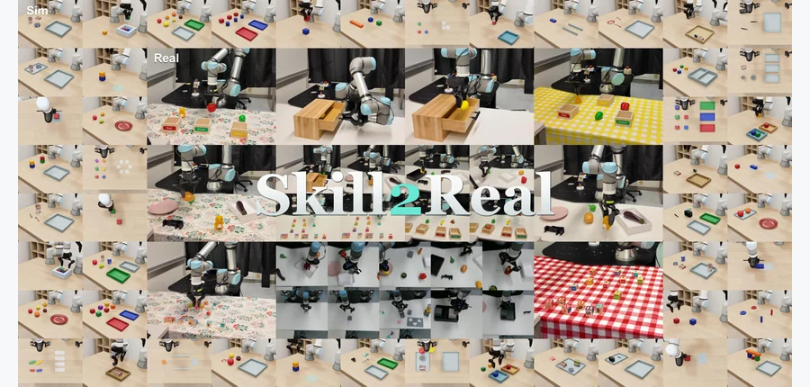 arXiv New 2026-10-05 · cs.RO · #29 **[Skill2Real: Agentic Skill Learning for Zero-Shot Sim-to-Real Robot Manipulation](https://arxiv.org/abs/2610.02788)** Xincheng He, Siyu Ma, Chang Yu, Yunuo Chen, Yanjia Huang, Ying Nian Wu, Yin Yang, Chenfanfu Jiang 机构：UCLA / Shanghai Jiao Tong University / Envora / University of Utah（官方 HTML） [Paper](https://arxiv.org/abs/2610.02788) · [图源](https://arxiv.org/html/2610.02788v1/skill2real_teaser_right_order_print_20260926_194435.png) 

中文摘要
将机器人技能从模拟迁移到现实，需要任务知识在感知、动力学和机器人形态存在差异时仍可用。我们提出 Skill2Real，一个通过共享应用程序接口（API）学习可执行技能的智能体策略框架。Proposer-Verifier-Governor（PVG）循环利用模拟中的特权证据诊断结果并验证更新，同时使学到的技能立足于公开可见的观测和 API 语义。Cerebellum 首先获得局部操作技能；随后 Brain 在冻结 Cerebellum 的条件下学习任务层面的组合。两类记忆都直接迁移到真实机器人，无需任务策略微调或技能记忆更新。当 GPT-5.6 Sol 在 LIBERO-90 上学习技能时，使用 GPT-6 Astra 评估每个冻结检查点，使 LIBERO-Pro Long 成功率从 2.0% 提高到 56.3%，且未在 Pro Long 上训练。独立的 Robosuite 训练中，Sol 和 Opus 5 在七项任务上的平均成功率分别达到 85.1% 和 89.4%。在四项真实操作任务上，由 Sol 在 LIBERO-90 训练后冻结的技能配合 Astra，平均完成率为 78.75%。在 LIBERO-90 训练时分别移除 Verifier 或 Governor，最终 Pro Long 成功率分别下降 17.3 和 13.3 个百分点。这些结果支持通过共同机器人接口学习并迁移可执行技能层次。 <a href="https://arxiv.org/abs/2610.02788">原摘要来源</a>
 | 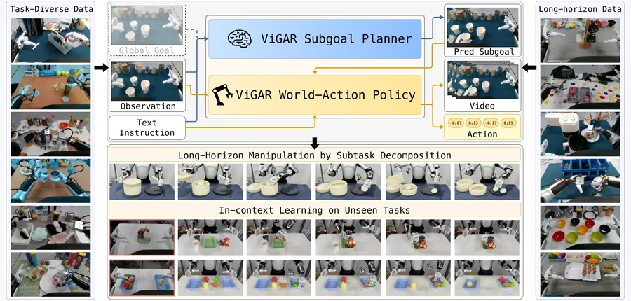 arXiv New 2026-10-05 · cs.RO · #30 **[Rethinking World-Action Model for Compositional and In-Context Robotic Manipulation](https://arxiv.org/abs/2610.02368)** Shukai Gong, Xuanran Zhai, Yintianrun Zhang, Ruopeng Cui, Ye Huang, Yiyang Fu, Dexuan Lyu, Chaojie Li, Xinyi Song, Peiwen… 机构：Peking University / AgiBot / CocoMatrix（PDF 首页） [Paper](https://arxiv.org/abs/2610.02368) · [Code](https://github.com/DAGroup-PKU/ViGAR) · [Project](https://dagroup-pku.github.io/ViGAR/) · [Data](https://huggingface.co/DAGroup-PKU/ViGAR) · [图源](https://arxiv.org/html/2610.02368v1/teaser.png) 

中文摘要
长时域组合式操作对于真实机器人部署越来越重要，因为单项任务往往涉及多个协调的子任务。现有世界动作模型（WAM）联合预测短时域视觉未来和动作，但通常缺少显式的子任务层面推理。我们提出 Visual Goal-conditioned Action Reasoning（ViGAR），一种把操作分解为视觉子目标规划器和子目标执行器的层次框架。给定当前观测和全局指令，子目标规划器预测下一个子任务的视觉子目标；子目标执行器则以该预测为条件，联合生成未来视觉轨迹和动作。两个组件共享预训练世界模型表示，使任务层规划和动作生成受益于共同的物理知识。此外，框架自然支持上下文学习：以全局目标图像作为上下文，无需参数更新即可引出不同的子任务分解和行为。在 RoboTwin Clean2Random 基准上，ViGAR 在 Clean 和 Random 设置下的成功率分别为 82.00% 和 67.02%，平均成功率比最强基线高 12.86 个百分点。五项组合式任务和两项上下文学习任务的真实机器人实验进一步验证了 ViGAR 的有效性。 <a href="https://arxiv.org/abs/2610.02368">原摘要来源</a>
 |
| 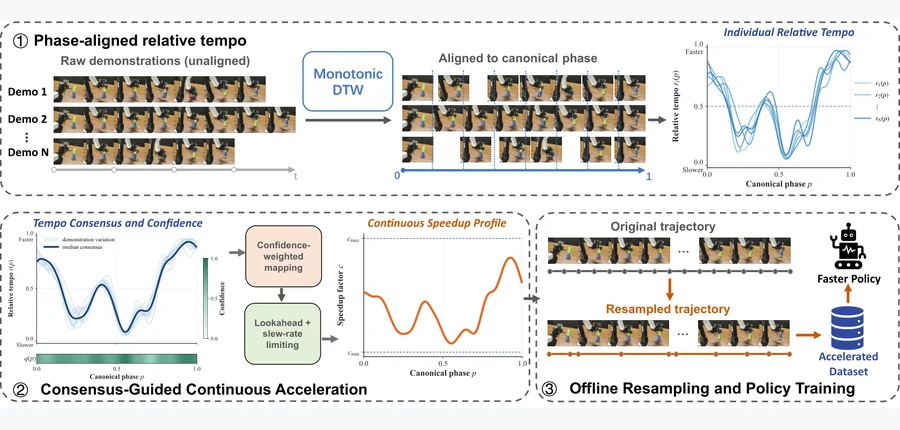 arXiv New 2026-10-05 · cs.RO · #31 **[AdaTempo: Learning Shared Relative Tempo from Demonstrations for Faster Robot Manipulation](https://arxiv.org/abs/2610.02706)** Jiale Cao, Yike Niu, Zhengrong Xue, Huazhe Xu 机构：Fudan University / Tsinghua University（官方 HTML） [Paper](https://arxiv.org/abs/2610.02706) · [图源](https://arxiv.org/html/2610.02706v1/method_pipeline.png) 

中文摘要
通过模仿学习训练的视觉运动策略，常会继承遥操作示范中不必要的缓慢节奏。但统一加速并不可靠，因为操作任务的不同阶段对加速的容忍度不同。我们提出 AdaTempo，一种自监督方法，利用示范中共享的相对节奏结构加速视觉运动策略。AdaTempo 建立阶段对应关系，把对齐的相对节奏汇聚为共识，再映射为连续的加速曲线，用于重新采样示范以形成加速后的训练轨迹。在这些重采样轨迹上训练 ACT 或 Diffusion Policy 等标准策略，可将目标节奏直接嵌入学到的行为，无需在运行时选择节奏或在线重新定时。大量评估显示，AdaTempo 最多实现 3.57 倍加速，并比原策略及代表性加速基线取得更好的成功率—速度权衡。 <a href="https://arxiv.org/abs/2610.02706">原摘要来源</a>
 | 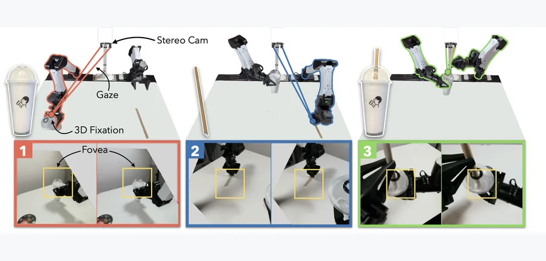 arXiv New 2026-10-05 · cs.RO · #32 **[EyeRobot 2.0: Active Gaze for Precise Manipulation without Wrist Cameras](https://arxiv.org/abs/2610.03710)** Kush Hari, Justin Kerr, Nidhya Shivakumar, Samarth Mahapatra, Carmelo Sferrazza, Jiahui Lei, Jitendra Malik, C. Karen Liu… 机构：Amazon FAR / UC Berkeley / Stanford University（官方 HTML） [Paper](https://arxiv.org/abs/2610.03710) · [图源](https://arxiv.org/html/2610.03710v1/splash.png) 

中文摘要
受人类视觉启发，我们提出一个利用主动注视、仅凭单个双目相机实现精细双臂操作的框架。EyeRobot 2.0 通过转动两个“眼睛”视角，使视线以场景中的3D注视点为中心，主动关注该点。随后以中央凹方式处理图像，为图像中心分配更多视觉 token，使计算集中在任务相关特征上。这种主动视觉注视（AVF）要求在任务执行过程中精心协调视线；我们采用层次方法，先训练以目标物体为条件的低层注视伺服策略，再训练依据任务进度输出注视目标的目标选择器。两个模块都使用真实世界数据上的强化学习训练：前者使用稠密几何奖励，后者与行为克隆夹爪策略共同训练，从而发现执行任务时可能类似人类注视序列的注视次序。EyeRobot 2.0 还利用注视点，把夹爪信息规范化到相对注视点的 SE(3) 坐标系，缩小待学习动作分布的范围。我们为 7 项真实任务和 6 项模拟任务采集遥操作数据，进行超过 1,000 次实体和 1,800 次模拟机器人试验，将 EyeRobot 2.0 与使用相同数据训练的被动双目，以及第一人称加腕部相机策略比较。对于标准策略，去掉腕部相机的代价很大：只用被动双目时，真实任务成功率从 52% 降至 27%。EyeRobot 2.0 仅用双目便弥合这一差距，相对被动双目在真实和模拟任务中分别高 40% 和 20%。当腕部视野清晰时，它与第一人称加腕部相机策略表现相当（69% 对 64%）；当抓取物遮挡腕部相机时，成功率超过后者两倍（48% 对 22%）。 <a href="https://arxiv.org/abs/2610.03710">原摘要来源</a>
 | 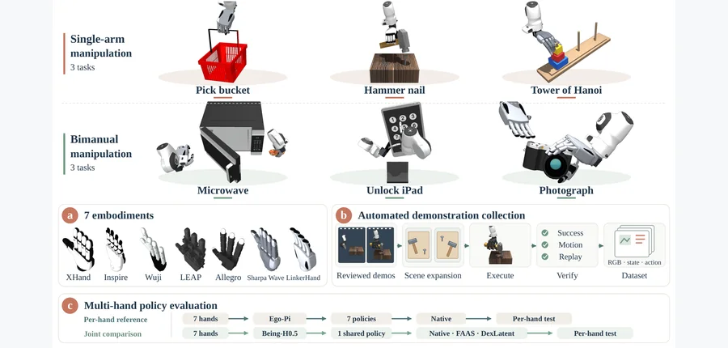 arXiv New 2026-10-05 · cs.RO · #33 **[DexJoCo-X: Benchmarking Action Representations for Multi-Hand Dexterous Manipulation](https://arxiv.org/abs/2610.03278)** Xiangwei Jiang, Yao Mu, Lixin Duan, Wen Li 机构：University of Electronic Science and Technology of China / Shanghai Jiao Tong University（官方 HTML） [Paper](https://arxiv.org/abs/2610.03278) · [图源](https://arxiv.org/html/2610.03278v1/fig1_rebuilt.png) 

中文摘要
随着灵巧手种类增多，为每一种形态分别采集数据和训练策略越来越不现实。因此，可扩展的跨形态学习需要一种统一表示，既捕捉共享的操作结构，又保留特定形态的控制。手、任务、数据集和控制接口的差异，使现有研究难以分离表示、预训练和架构各自的影响。我们提出 DexJoCo-X，一个用于受控比较的基准与工具包，涵盖七种代表性灵巧手、六项单臂和双臂任务，以及 2,100 段平衡示范。DexJoCo-X 提供多手、多任务的匹配协议，包括共同场景、成功标准和执行接口，重新设计的手套到机器人手映射，以及将审核后的示范扩展至随机场景的自动化流程。我们使用 π_{0.5}、Ego-Pi 和 Being-H0.5，研究共享动作接口是否足以支持多手学习。将 π_{0.5} 扩展为 80 维双臂输出，成功率接近零。Ego-Pi 通过交错预测保留预训练动作头，支持单手多任务学习，但对七只手联合训练仍无效。相比之下，Being-H0.5 结合跨形态预训练、统一动作空间和形态感知专家，使一个策略控制全部七种手。在这一架构内，功能对齐的动作槽位平均成功率为 47.7%，原生坐标为 47.0%，DexLatent 为 33.1%。这些结果表明，跨形态表示依赖整个学习系统：动作坐标、预训练和架构必须共同把共享操作结构与形态特定控制分开。 <a href="https://arxiv.org/abs/2610.03278">原摘要来源</a>
 |
| 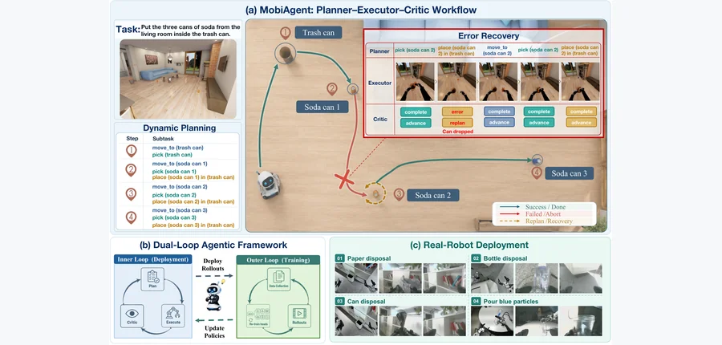 arXiv New 2026-10-05 · cs.RO · #34 **[MobiAgent: Dual-Loop Recursive Policy Self-Improvement for Long-Horizon Mobile Manipulation](https://arxiv.org/abs/2610.03476)** Chenzhi Liu, Yue Zhang, Jiehong Lin, Jianan Wang, Bo Wang, Zhongrui Wang, Xiaojuan Qi 机构：University of Hong Kong / Astribot / Southern University of Science and Technology（官方 HTML） [Paper](https://arxiv.org/abs/2610.03476) · [图源](https://arxiv.org/html/2610.03476v1/teaser_1.png) 

中文摘要
长时域移动操作面临执行误差累积，以及移动与机械臂控制之间的能力相互干扰等重大挑战。近期视觉—语言—动作模型虽擅长短时域任务，但缺少多阶段目标所需的层次推理。此外，现有层次智能体存在子任务映射僵化、重新规划不灵活和缺少持续学习的问题。为解决这些局限，我们提出 MobiAgent，一个把稳健部署执行与递归式策略自我改进连接起来的双循环智能体框架。部署时，内循环通过可高度组合的原子技能，将高层推理与低层控制解耦；它使用视觉语言模型进行滚动时域规划与视觉反思，动态组合技能以稳健地从错误中恢复。这些技能由共享统一 VLM 骨干的专门流匹配专家执行，在提高复用性的同时减轻能力干扰。与此同时，外循环通过自动切分和验证部署交互轨迹、对其聚类发现原子技能，并在无需人工标注的情况下持续微调技能库，推动自动化终身学习。在 RoboCasa、BEHAVIOR-1K 和真实任务上的评估表明 MobiAgent 有效：在 BEHAVIOR-1K 上超过 π_{0.5}-TA 22.5 个百分点，并能从执行失败中稳健恢复。通过自动复用数据，RoboCasa 成功率从 7.50% 提升到 27.50%，Astribot S1 从 32.5% 提升到 57.5%。 <a href="https://arxiv.org/abs/2610.03476">原摘要来源</a>
 | 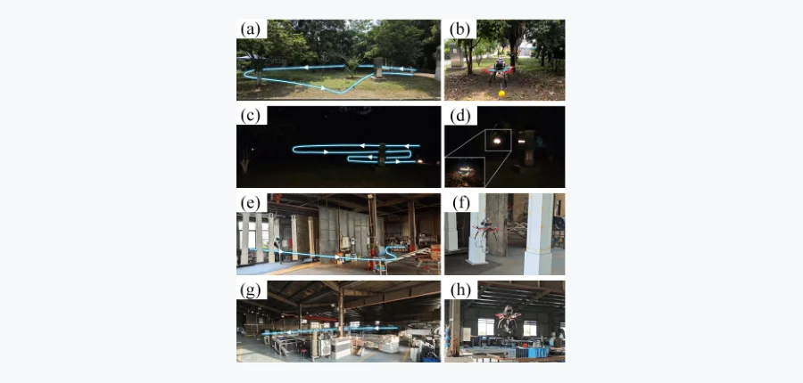 arXiv New 2026-10-05 · cs.RO · #35 **[DR-IPC: Disturbance-Resilient Integrated Planning and Control for LiDAR-Based Quadrotor Navigation](https://arxiv.org/abs/2610.03530)** Peng Liu, Jingyan Wang, Qipeng Ye, Wen Li, Jinya Su, Zuo Wang, Shihua Li, Yunda Yan 机构：Southeast University / Xiamen University of Technology / University College London（官方 HTML） [Paper](https://arxiv.org/abs/2610.03530) · [Project](https://drpp316.github.io/DR-IPC-Page/) · [图源](https://arxiv.org/html/2610.03530v1/exp_outdoor.png) 

中文摘要
在杂乱环境中，基于 LiDAR 的四旋翼导航面对外部扰动仍有挑战，尤其当避障运动生成与抗扰控制由不同层独立处理时。本文提出抗扰一体化规划控制（DR-IPC），将轻量路径引导与非线性模型预测控制（NMPC）结合，直接生成角速度和推力。相互连接的扩展卡尔曼滤波器与非线性扰动观测器，共同为 NMPC 预测提供滤波后的状态估计和重建的扰动。所得形式统一了非线性四旋翼动力学、执行器约束、局部运动生成和带惩罚的安全飞行走廊残差，无需单独的轨迹优化阶段。Gazebo 和 MARSIM 模拟，以及室内外实验，验证了 DR-IPC 在风、悬吊载荷、狭窄通道、球体撞击和动态障碍反应式避让条件下的表现。在有扰动的多目标导航中，DR-IPC 使 Gazebo 中完成任务的次数从 10 次中的 1 次升至 9 次，并把实验中的高度 RMSE 从 0.34 米降至 0.01 米。完整系统以 100 Hz 在机载端运行。补充视频见项目页 https://drpp316.github.io/DR-IPC-Page/，源代码将发布。 <a href="https://arxiv.org/abs/2610.03530">原摘要来源</a>
 | 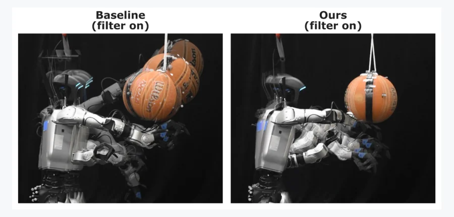 arXiv New 2026-10-05 · cs.RO · #36 **[Filter-Aware Fine-Tuning for Safe Humanoid Whole-Body Tracking](https://arxiv.org/abs/2610.02341)** Pranit Mohnot, Christian Helten, Daniele Gammelli, Marco Pavone 机构：Stanford University / Technical University of Munich / AI4I / NVIDIA（官方 HTML） [Paper](https://arxiv.org/abs/2610.02341) · [图源](https://arxiv.org/html/2610.02341v1/hero.png) 

中文摘要
安全的全身运动是在人形机器人非结构化环境中部署的关键。现代人形控制通常将参考动作指定与执行分开：规划器、遥操人员或运动生成器给出参考动作，再由强化学习策略通过动力学可行的全身控制进行跟踪。控制障碍函数（CBF）等运行时安全过滤器，有望通过干预跟踪器的输出来强制执行新加入的约束。然而，我们表明将跟踪策略和安全过滤器独立处理会产生根本性失配，因为过滤同时改变执行动作和由此诱导的状态分布。我们通过分别隔离动力学、目标和信息失配的案例，研究这一策略—过滤器接口，突出其根源，并据此提出 CoFiT（Constrained Filter-aware Tuning），一种面向预训练跟踪器的过滤器感知微调方法。在多种约束场景中，相对仅用过滤器训练，CoFiT 在 TWIST2 和 SONIC 上分别使违反约束的时长减少 91% 和 21%，同时需要更小的安全过滤修正。在 Unitree G1 实体设备上，CoFiT 使 TWIST2 的违规时长减少 83%，且所有试验均无需操作员干预完成；基线有 50% 的试验需要操作员停止。这些结果为策略与过滤器的相互作用提供可操作见解，并确立将学习型跟踪器与运行时安全过滤器集成的设计原则。 <a href="https://arxiv.org/abs/2610.02341">原摘要来源</a>
 |
| 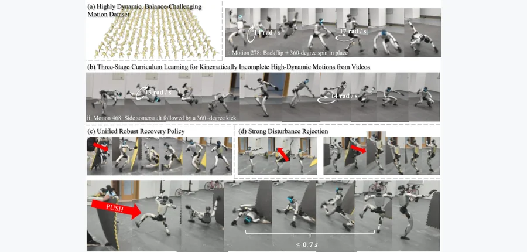 arXiv New 2026-10-05 · cs.RO · #37 **[KungfuAthleteBot: learning high-dynamic humanoid motion from video with unified robust recovery](https://arxiv.org/abs/2610.03388)** Zhongxiang Lei, Lulu Cao, Xuyang Wang, Tianyi Qian, Jinyan Liu, Xuesong Li 机构：Beijing Institute of Technology / QIYUAN Lab（官方 HTML） [Paper](https://arxiv.org/abs/2610.03388) · [图源](https://arxiv.org/html/2610.03388v1/intro_v7.png) 

中文摘要
视频是数量丰富、成本低廉的人类运动数据来源，包含极端运动行为。然而，要将其用于人形机器人，绝非只需把重建轨迹重新映射到机器人：视频运动在物理上可能不一致，不含驱动信息，也不能说明失败与恢复。我们提出 KungfuAthleteBot（KAB），将从视频学习高动态运动作为核心问题，并依次解决这三种失败模式。（C1）我们从国家级武术运动员视频构建 KungfuAthlete 数据集，并提出物理引导的抛物线轨迹修正，消除重建腾空和落地阶段的高度漂浮、地面穿透与高频抖动。（C2）由于视频不含力信息，严格跟踪重建轨迹在动力学上不可行，而以误差驱动的初始化会反复让策略从不可行的腾空姿态起步。我们提出物理驱动的伪低动能（LKE）采样，这是让此类参考运动可学习的核心机制：它使初始化偏向动力学可行状态，让策略发现可行的驱动方式，而非模仿不可行的动作。（C3）最后，我们提出直接训练范式，在跟踪视频动作的同一策略内学习抗扰和跌倒恢复，无需恢复参考数据或手工模式切换。在人形机器人上，KAB 从视频学到动态技能，并能在约 0.7 秒内从任意跌倒状态恢复，论文称这是统一策略已报告的最快恢复。统一策略的消融验证各组件的必要性，支持这样的观点：修复与补偿视频数据，而不只是采集更多数据，才是释放高动态人形技能的关键。 <a href="https://arxiv.org/abs/2610.03388">原摘要来源</a>
 | 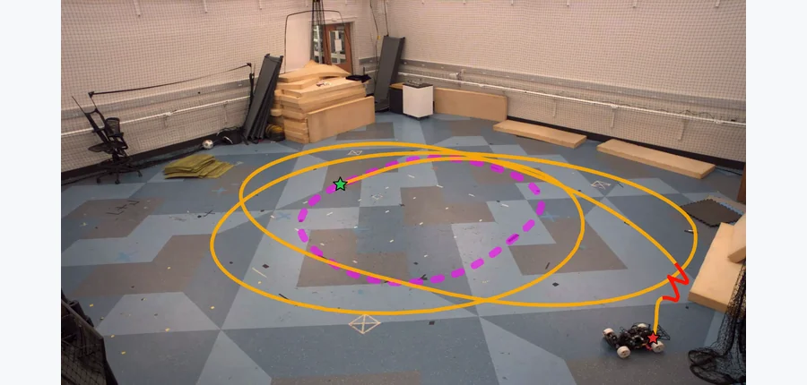 arXiv New 2026-10-05 · cs.RO · #38 **[LLA-MPC on Embedded Hardware: Rapid Adaptive Control with Thousands of Parallel Models](https://arxiv.org/abs/2610.03616)** Henry Z. Liao, Maitham F. AL-Sunni, John M. Dolan 机构：affiliation 未确认 [Paper](https://arxiv.org/abs/2610.03616) · [图源](https://arxiv.org/html/2610.03616v1/figures/drift_5/nom_drift_5_1_full.png) 

中文摘要
我们提出 Look-Back and Look-Ahead Adaptive Model Predictive Control（LLA-MPC）的通用实现，这是一种无需学习、用于实时快速自适应系统辨识和控制的框架。原始方案仅在固定模型结构的自动赛车模拟中得到展示。我们的实现包含模块化动力学与积分器，并在算力受限、状态估计有噪声的 F1TENTH 平台上验证。系统在嵌入式计算机上实时评估数千个候选模型，在线辨识轮胎参数。针对跨变化路面的低摩擦轮胎实验表明，LLA-MPC 能完成固定标称模型失败的高速跟踪任务。代码、视频和相关工作见：https://lla-control.github.io。 <a href="https://arxiv.org/abs/2610.03616">原摘要来源</a>
 | 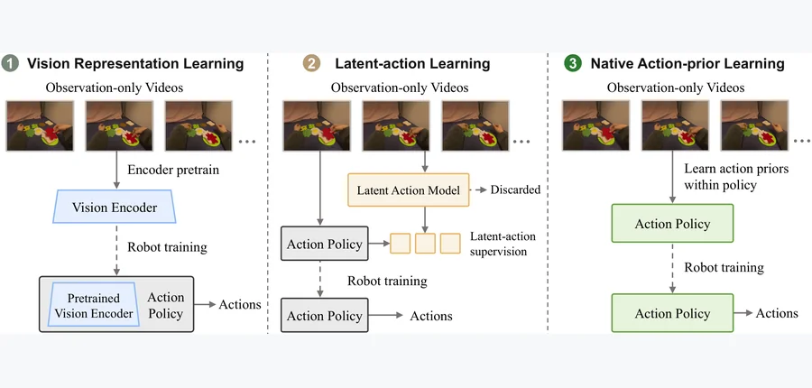 arXiv New 2026-10-05 · cs.CV · #39 **[Native Action-Prior Learning from Videos for World Action Models](https://arxiv.org/abs/2610.03391)** Zhaochong An, Fei Zhang, Menglin Jia, Duncan Frost, Zijian Zhou, Yikai Wang, Xudong Wang, Aditya Patel, Belinda Zeng, Tao… 机构：Meta AI / University of Copenhagen / Physical Intelligence / Imperial College London（官方 HTML） [Paper](https://arxiv.org/abs/2610.03391) · [图源](https://arxiv.org/html/2610.03391v1/fig1.png) 

中文摘要
世界动作模型将未来视觉动力学与机器人动作预测结合，但其可扩展性仍受限于对带动作标注的机器人轨迹的需求。只有观测、没有动作标签的视频含有丰富的交互动力学证据，但现有方法通常用它们预训练之后还需适配到控制的视觉表示，或推断潜在动作、再将其落地为机器人指令。我们提出 NAVA-WAM：通过仅观测视频直接预训练动作策略，引入原生动作先验学习，避免间接的表示到控制迁移或单独的潜在动作模型。训练分两阶段。首先，在仅观测视频上预训练；对未来视频视觉转变的流匹配监督，经由转变结构化联合注意力传递，以优化 Action-DiT 并学到动作相关先验。其次，使用带动作标签的示范，通过视频—动作联合流匹配对 Action-DiT 进行机器人控制后训练；非对称注意力将视觉分支与迭代式动作去噪解耦，实现高效的仅动作推理。大量实验表明，NAVA-WAM 在分布内和分布外设置中均持续优于以往方法，同时展现较高的动作标签利用效率和有效的真实机器人泛化。结果表明，原生动作先验学习可有效地从仅观测视频直接预训练动作策略，为减少对带动作标注机器人数据的依赖提供可扩展路径。 <a href="https://arxiv.org/abs/2610.03391">原摘要来源</a>
 |
| 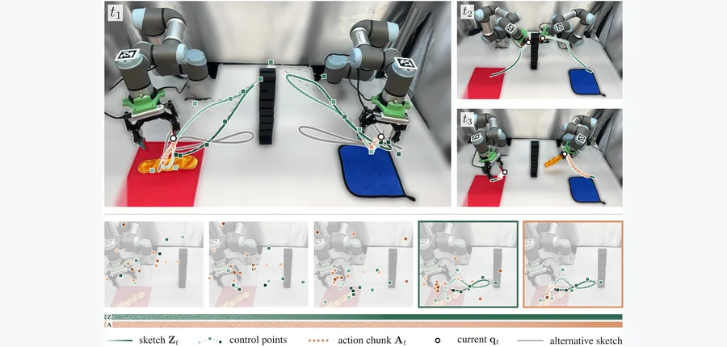 arXiv New 2026-10-05 · cs.RO · #40 **[Proprioceptive Sketches as Long-Horizon Intent for Generative Action Policies](https://arxiv.org/abs/2610.02759)** Fangyuan Wang, Songhao Huang, Haoxiang Sun, Shipeng Lyu, Chengyang He, Anqing Duan, Peng Zhou, David Navarro-Alarcon 机构：Hong Kong Polytechnic University / National University of Singapore / MBZUAI / Great Bay University（官方 HTML） [Paper](https://arxiv.org/abs/2610.02759) · [Project](https://nicehiro.github.io/pam_dp/) · [图源](https://arxiv.org/html/2610.02759v1/teaser_handoff.png) 

中文摘要
生成式机器人策略预测较短的动作片段，却缺少显式的长时域意图。近期方法通过语言规划、子目标图像或视频预测暴露长时域结构，但生成成本高，而且仍需转化为机器人运动。直接预测机器人未来运动可省去这一步，但稠密且按时间索引的轨迹需要大量参数才能覆盖剩余任务；若时域较短，它又大体重复动作片段，几乎不给动作生成提供额外指导。我们提出 Proprioceptive Action Models（PAM），在单一 Transformer 去噪器中联合生成机器人剩余关节空间路径的紧凑、无时间标记草图，以及可执行的稠密动作片段。草图用弧长而非时间对路径参数化，捕捉不随执行时序变化的几何意图。块因果注意力和错开的去噪时间表保持草图到动作的定向依赖，保证采样过程中动作 token 始终以逐渐变清晰的草图为条件。在模拟中，PAM 在 Push-T 和 LIBERO-Long 上优于仅预测动作的对应方法；在四项真实双臂任务上，成功率从 47.5% 提高到 75.0%。项目页：https://nicehiro.github.io/pam_dp/ <a href="https://arxiv.org/abs/2610.02759">原摘要来源</a>
 |   |   |
<!-- PAPER_CARDS_END -->

## 检索概况

- **检索窗口**：北京时间 2026-10-05 09:04 至 2026-10-06 09:14；官方最新批次为 **Monday, 5 October 2026**。该批次此前未写入本仓库日报。
- **官方范围**：核对 [cs/new](https://arxiv.org/list/cs/new?show=2000)、[physics/new](https://arxiv.org/list/physics/new?show=2000)、[cond-mat/new](https://arxiv.org/list/cond-mat/new?show=2000)、[math/new](https://arxiv.org/list/math/new?show=2000)、[stat.ML/new](https://arxiv.org/list/stat.ML/new?show=2000)、[eess.IV/new](https://arxiv.org/list/eess.IV/new?show=2000)、[eess.SY/new](https://arxiv.org/list/eess.SY/new?show=2000)、[eess.SP/new](https://arxiv.org/list/eess.SP/new?show=2000)。`cs/new` 覆盖 cs.CV、cs.GR、cs.RO、cs.AI 与 cs.LG。
- **总命中 / 入选**：八页共有 **1,271 条 New** 原始记录，去重后 **1,221 个 arXiv ID**；为 125 篇候选获取官方原摘要并进行二次筛选，入选 **40 篇**。另有 258 条 Cross 与 840 条 Replacement 原始记录，均未进入主榜。
- **排序**：前 22 篇聚焦 3D、物理机制、动态场景与几何；后 18 篇聚焦有具体机器人任务、方法或实验的具身工作。相关性、机构强度、局限与实验建议均为**推断**；标题、作者、分类和逐篇事实以链接的官方原摘要为据。
- **卡片材料**：入选 40 篇均取得官方原摘要及完整中文译文，缺摘要 **0 篇**；40 张卡片均配有逐篇核对的真实论文图，缺图 **0 篇**。机构无法从官方 HTML 或 PDF 首页可靠核实时写“affiliation 未确认”。

### 官方 listing 计数

| 分类页面 | 官方日期 | New | Cross | Replacement |
|---|---|---:|---:|---:|
| [cs/new](https://arxiv.org/list/cs/new?show=2000) | Monday, 5 October 2026 | 784 | 92 | 446 |
| [physics/new](https://arxiv.org/list/physics/new?show=2000) | Monday, 5 October 2026 | 54 | 43 | 52 |
| [cond-mat/new](https://arxiv.org/list/cond-mat/new?show=2000) | Monday, 5 October 2026 | 60 | 30 | 60 |
| [math/new](https://arxiv.org/list/math/new?show=2000) | Monday, 5 October 2026 | 319 | 58 | 221 |
| [stat.ML/new](https://arxiv.org/list/stat.ML/new?show=2000) | Monday, 5 October 2026 | 14 | 17 | 32 |
| [eess.IV/new](https://arxiv.org/list/eess.IV/new?show=2000) | Monday, 5 October 2026 | 6 | 2 | 1 |
| [eess.SY/new](https://arxiv.org/list/eess.SY/new?show=2000) | Monday, 5 October 2026 | 21 | 12 | 21 |
| [eess.SP/new](https://arxiv.org/list/eess.SP/new?show=2000) | Monday, 5 October 2026 | 13 | 4 | 7 |

## Top papers

| # | 论文 | Paper | 分类 | 作者 | 机构 | 相关性（推断） | 机构强度（推断） | 阅读优先级（推断） |
|---:|---|---|---|---|---|---|---|---|
| 1 | SceneFactory-3D: Lifting 2D Traffic Scenes into 3D Physical Counterfactuals for Scalable Physically Grounded Safety Evaluation | [arXiv:2610.02874](https://arxiv.org/abs/2610.02874) | cs.RO | Yicheng Zhu, Linfeng Tian, Tianmu Zhao, Yang Chen, Fan Zuo, Tao Li, Zilin Bian | Rochester Institute of Technology / City University of Hong Kong / New York University（官方 HTML） | 高 | 中 | 高 |
| 2 | ManiPhysicsBench: Physics-Based Assessment of Object Preservation in VLA Manipulation | [arXiv:2610.02802](https://arxiv.org/abs/2610.02802) | cs.RO | Sangwu Park, Yeonjun In, Wonjoong Kim, Sungwon Kim, Sein Kim, Chanyoung Park | KAIST（官方 HTML） | 高 | 强 | 高 |
| 3 | PointWAM: 3D World Action Modeling for Dexterous Robotic Manipulation | [arXiv:2610.02840](https://arxiv.org/abs/2610.02840) | cs.RO | Chunghyun Park, Beomjun Kim, Seungcheol Park, Heeseung Kwon, Yashu Shukla, Seunghoon Sim, Jinwoo Shin, Minsu Cho | POSTECH / KAIST / Hanyang University / RLWRLD（官方 HTML） | 高 | 强 | 高 |
| 4 | SCOPE-4D: Endoscopic 4D Geometry Foundation Models | [arXiv:2610.02343](https://arxiv.org/abs/2610.02343) | cs.CV | Chaoyi Zhou, Zhongpai Gao, Anwesa Choudhuri, Meng Zheng, Benjamin Planche, Run Wang, Terrence Chen, Siyu Huang, Ziyan Wu | United Imaging Intelligence / Clemson University（PDF 首页） | 高 | 中 | 高 |
| 5 | UniDynamics: Event-RGB Fusion for Unified Future 4D Dynamic Scene Generation | [arXiv:2610.03473](https://arxiv.org/abs/2610.03473) | cs.CV | Daikun Liu, Xin Zhan, Teng Wang, Xiaoping Wang, Changyin Sun | Southeast University / Huazhong University of Science and Technology（官方 HTML） | 高 | 中 | 高 |
| 6 | EVEWorld: Physical Evolution Supervision for Embodied World Models | [arXiv:2610.03374](https://arxiv.org/abs/2610.03374) | cs.CV | Kaiqi Wang, Songxin Zhang, Zejian Xie, Xiao Xiong, Zhuoyang Song, Ziwei Wu, Jun Yu Lu, Yitan Teng, Ziying Song, Jiaxing Zhang | China Merchants Group / Nanyang Technological University（官方 HTML） | 高 | 中 | 高 |
| 7 | I2CD: Direct Image-to-Convex Decomposition for Simulation-Ready Collision Geometry | [arXiv:2610.03453](https://arxiv.org/abs/2610.03453) | cs.RO | Qian Wang, Liam Merz Hoffmeister, Brian Scassellati, Daniel Rakita | Yale University（官方 HTML） | 高 | 中 | 高 |
| 8 | DeltaWorld: Physically Consistent Interactive World Simulators via Action-Conditioned Latent Increment Learning | [arXiv:2610.02691](https://arxiv.org/abs/2610.02691) | cs.RO | Boyuan Hou, Xiaoge Cao, Chaofan Zhang, Shuo Wang, Shaowei Cui | Imprintx Robotics / State Grid Jibei Electric Power / Chinese Academy of Sciences（官方 HTML） | 高 | 中 | 高 |
| 9 | triangulax: Differentiable Simulations with Triangular Meshes across Soft Matter Physics | [arXiv:2610.02566](https://arxiv.org/abs/2610.02566) | cond-mat.soft | Samuel Silliman, Qiwei Yu, Nikolas Claussen | Princeton University / Stanford University（官方 HTML） | 高 | 强 | 高 |
| 10 | TerrainForge: Physics-Grounded road geometry Editing for Counterfactual Autonomous Driving | [arXiv:2610.02825](https://arxiv.org/abs/2610.02825) | cs.CV | Yang Chen, Yicheng Zhu, zhenning Li, Tao Li, Zilin Bian | Rochester Institute of Technology / University of Macau / City University of Hong Kong（官方 HTML） | 高 | 中 | 高 |
| 11 | XGenAct: Geometry-Enhanced World Action Models through Cross-Task Generation | [arXiv:2610.03516](https://arxiv.org/abs/2610.03516) | cs.RO | Tingting Du, Ziyao Wang, Guoheng Sun, Ang Li | University of Wisconsin–Madison / University of Maryland（官方 HTML） | 高 | 中 | 中 |
| 12 | FlowHMR: Physically Plausible Motion Capture from Video | [arXiv:2610.03691](https://arxiv.org/abs/2610.03691) | cs.CV | Zhanke Wang, Chengfeng Zhao, Qing Shuai, Jingzhong Lin, Heng Li, Zeyu Ling, Yuxin Wen, Jing Li, Di Kang, Chunchao Guo, Linchao Bao | Peking University / HKUST / Tencent / East China Normal University / Sun Yat-sen University / Zhejiang University（官方 HTML） | 高 | 强 | 中 |
| 13 | 4DCodeBench: Benchmarking Agents on Inverse Graphics of Dynamic Scenes | [arXiv:2610.03715](https://arxiv.org/abs/2610.03715) | cs.CV | Ruihong Shen, Žiga Kovačič, Peter Kulits, Xingrui Wang, Zizhang Li, Joshua B. Tenenbaum, Alan Yuille, Jieneng Chen, Jiajun Wu | Johns Hopkins University / Stanford University / Max Planck Institute for Intelligent Systems / MIT（官方 HTML） | 高 | 强 | 中 |
| 14 | Awomo-SimDataEngine: Agentic Simulation-ReadyWorld Generation | [arXiv:2610.02274](https://arxiv.org/abs/2610.02274) | cs.RO | Awomo-PhysicalRSI Team, Danjiao Ma, Enhui Ma, Haohan Liu, Heng Jia, Hui Shan, Jianhua Xu, Jiahuan Zhang, Jiangdi Xu, Kaiwen Guo, Kaicheng Yu, Linwei Zhang, Liyang Jin, Maochun Luo, Pengyao Niu, Shiwen Li, Shuangyu Feng, Tong Zhang, Tianheng Wang, Xin Wang, Xiangru Huang, Yongqiang Huang, Zhaozhi Wang, Zijian Ma | affiliation 未确认 | 高 | 待核 | 中 |
| 15 | Keep the Effect, Drop the Actor: Programmable Effect-to-Execution World-Action Models | [arXiv:2610.02398](https://arxiv.org/abs/2610.02398) | cs.RO | Junyi Hu, Zhewen He, Zhenhua Li, Yi Fang | New York University Abu Dhabi / Chatsign Technology（官方 HTML） | 高 | 中 | 中 |
| 16 | Geometry Meets Physics: Data-Efficient Pre-Training for Unstructured Neural PDE Solvers | [arXiv:2610.03363](https://arxiv.org/abs/2610.03363) | cs.AI | Luis Medrano-Navarro, Giacomo Baldan, Qiang Liu, Benjamin Holzschuh, Jan Hagnberger, Mathias Niepert, Nils Thuerey | Technical University of Munich / University of Stuttgart（官方 HTML） | 高 | 中 | 中 |
| 17 | Does Physics Live in the Activations? Localizing Physical Quantities in Video Diffusion Models | [arXiv:2610.03154](https://arxiv.org/abs/2610.03154) | cs.CV | Jonas Kneifl, Jakub Skalski, Bartłomiej Twardowski, Kamil Deja | IDEAS Research Institute / Computer Vision Center / Warsaw University of Technology（PDF 首页） | 高 | 中 | 中 |
| 18 | Physical AI Smart Spaces: A Large-Scale Benchmark for Multi-Camera 3D Perception in Smart Spaces | [arXiv:2610.02580](https://arxiv.org/abs/2610.02580) | cs.CV | Yuxing Wang, Yizhou Wang, Anqi Li, Shuo Wang, Sameer Satish Pusegaonkar, Haoquan Liang, Jiajun Li, Shenxin Jiang, Jianhe Yuan, Shangru Li, Tongwei Dai, Zihao Chen, David C. Anastasiu, Sujit Biswas, Xunlei Wu, Zheng Tang | NVIDIA / Santa Clara University（官方 HTML） | 高 | 强 | 中 |
| 19 | GeoScaffold: Learning Compact Geometric Latents via Reconstruction for Efficient Vision-Language Navigation | [arXiv:2610.02697](https://arxiv.org/abs/2610.02697) | cs.RO | Yixuan Jiang, Wentong Li, An Liu, Zihao Xin, Fulin Tang, Cong Leng, Yang Gao, Jian Cheng | Nanjing University / Chinese Academy of Sciences / Nanjing University of Aeronautics and Astronautics / MAICRO（官方 HTML） | 高 | 中 | 中 |
| 20 | OmniAct3D: Leveraging Foundation Geometry and Evidence-Grounded Reasoning for Panoramic 3D Detection | [arXiv:2610.03015](https://arxiv.org/abs/2610.03015) | cs.CV | Runtong Wu, Fei Teng, Di Wen, Guoqiang Zhao, Kunyu Peng, Kailun Yang | Hunan University / Karlsruhe Institute of Technology（官方 HTML） | 高 | 中 | 中 |
| 21 | T3lescope: Arbitrary-Resolution High-Fidelity Generative Surface Reconstruction from Images | [arXiv:2610.03308](https://arxiv.org/abs/2610.03308) | cs.CV | Atsuhiro Noguchi, Tianhan Xu, Yiming Liang, Yuta Kikuchi, Masahiro Ishiyama, Shintaro Takagi, Hitoshi Murai, Eiichi Matsumoto | Preferred Networks / University of Tokyo（官方 HTML） | 中高 | 中 | 中 |
| 22 | Feedforward Novel View Synthesis for Heterogeneous Cameras | [arXiv:2610.03522](https://arxiv.org/abs/2610.03522) | cs.CV | Meng Wei, Cheng Zhang, Boying Li, Yihang Chen, Jianmin Zheng, Hamid Rezatofighi, Jianfei Cai | Monash University / Shanghai Jiao Tong University / Nanyang Technological University（官方 HTML） | 中高 | 中 | 中 |
| 23 | SimpleTouch: Can Vision-Language-Action Models Master Contact-Rich Manipulation Without Tactile Policy Pretraining? | [arXiv:2610.02784](https://arxiv.org/abs/2610.02784) | cs.RO | Chen Yang, Linzhe Shi, Changjie Wu, Hang Zhang, Ronghan Chen, Lingjun Zhang, Xu Hu, Mu Xu, Jiansheng Fan, Chen Wang | Tsinghua University / Amap, Alibaba Group / Hong Kong Polytechnic University（官方 HTML） | 中高 | 强 | 中 |
| 24 | RATE: Risk-Aware Tactile Encoding for Contact-rich Robotic Manipulation | [arXiv:2610.03538](https://arxiv.org/abs/2610.03538) | cs.RO | Yuyao Jiang, Haichao Liu, Jiarui Zheng, Zihan Ding, Weihao Yuan, Ziwei Wang | affiliation 未确认 | 中高 | 待核 | 中 |
| 25 | Equivariant Visual-Tactile Diffusion Policy for Contact-Rich Manipulation | [arXiv:2610.03333](https://arxiv.org/abs/2610.03333) | cs.RO | Lik Hang Kenny Wong, Yiyao Ma, Xiu-Shen Wei, Zelong Tan, Zhuheng Song, Dongsheng Xie, Kai Chen, Qi Dou | Chinese University of Hong Kong / Southeast University（官方 HTML） | 中高 | 中 | 中 |
| 26 | SoTa: Soft Tactile Skins for Dexterous Manipulation | [arXiv:2610.02338](https://arxiv.org/abs/2610.02338) | cs.RO | Jingyun Yang, Baiyu Shi, Timothy Yu, Haitian Liu, Alberta Longhini, Weichen Wang, Rika Antonova, Zhenan Bao, Jeannette Bohg | Tsinghua University / Stanford University / University of Cambridge（官方 HTML） | 中高 | 强 | 中 |
| 27 | SARI: Phase-Split Sim-Real Co-Training for Contact-Rich Manipulation | [arXiv:2610.02804](https://arxiv.org/abs/2610.02804) | cs.RO | Xingxin He, Yuxuan Jiang, Haonan Zhang, Chuhan Cui, Kaile Li, Zhongxing Zheng, Caihao Xu, Ziqi Wang | HKUST / BYD（官方 HTML） | 中高 | 强 | 中 |
| 28 | Learning Reflexive Behavior for Contact-Rich Manipulation | [arXiv:2610.02811](https://arxiv.org/abs/2610.02811) | cs.RO | Quan Nguyen, Yunho Kim, Joonho Lee | Neuromeka（官方 HTML） | 中高 | 中 | 中 |
| 29 | Skill2Real: Agentic Skill Learning for Zero-Shot Sim-to-Real Robot Manipulation | [arXiv:2610.02788](https://arxiv.org/abs/2610.02788) | cs.RO | Xincheng He, Siyu Ma, Chang Yu, Yunuo Chen, Yanjia Huang, Ying Nian Wu, Yin Yang, Chenfanfu Jiang | UCLA / Shanghai Jiao Tong University / Envora / University of Utah（官方 HTML） | 中高 | 中 | 中 |
| 30 | Rethinking World-Action Model for Compositional and In-Context Robotic Manipulation | [arXiv:2610.02368](https://arxiv.org/abs/2610.02368) | cs.RO | Shukai Gong, Xuanran Zhai, Yintianrun Zhang, Ruopeng Cui, Ye Huang, Yiyang Fu, Dexuan Lyu, Chaojie Li, Xinyi Song, Peiwen Lin, Chuang Wang, Mingyuan Jia, Yufan Deng, Jiaxin Fang, Bo Liang, Jiaxin Li, Yuxiang Gao, Hao Liu, Daquan Zhou | Peking University / AgiBot / CocoMatrix（PDF 首页） | 中高 | 强 | 中 |
| 31 | AdaTempo: Learning Shared Relative Tempo from Demonstrations for Faster Robot Manipulation | [arXiv:2610.02706](https://arxiv.org/abs/2610.02706) | cs.RO | Jiale Cao, Yike Niu, Zhengrong Xue, Huazhe Xu | Fudan University / Tsinghua University（官方 HTML） | 中 | 强 | 中 |
| 32 | EyeRobot 2.0: Active Gaze for Precise Manipulation without Wrist Cameras | [arXiv:2610.03710](https://arxiv.org/abs/2610.03710) | cs.RO | Kush Hari, Justin Kerr, Nidhya Shivakumar, Samarth Mahapatra, Carmelo Sferrazza, Jiahui Lei, Jitendra Malik, C. Karen Liu, Ken Goldberg, Angjoo Kanazawa | Amazon FAR / UC Berkeley / Stanford University（官方 HTML） | 中 | 强 | 中 |
| 33 | DexJoCo-X: Benchmarking Action Representations for Multi-Hand Dexterous Manipulation | [arXiv:2610.03278](https://arxiv.org/abs/2610.03278) | cs.RO | Xiangwei Jiang, Yao Mu, Lixin Duan, Wen Li | University of Electronic Science and Technology of China / Shanghai Jiao Tong University（官方 HTML） | 中 | 中 | 中 |
| 34 | MobiAgent: Dual-Loop Recursive Policy Self-Improvement for Long-Horizon Mobile Manipulation | [arXiv:2610.03476](https://arxiv.org/abs/2610.03476) | cs.RO | Chenzhi Liu, Yue Zhang, Jiehong Lin, Jianan Wang, Bo Wang, Zhongrui Wang, Xiaojuan Qi | University of Hong Kong / Astribot / Southern University of Science and Technology（官方 HTML） | 中 | 中 | 中 |
| 35 | DR-IPC: Disturbance-Resilient Integrated Planning and Control for LiDAR-Based Quadrotor Navigation | [arXiv:2610.03530](https://arxiv.org/abs/2610.03530) | cs.RO | Peng Liu, Jingyan Wang, Qipeng Ye, Wen Li, Jinya Su, Zuo Wang, Shihua Li, Yunda Yan | Southeast University / Xiamen University of Technology / University College London（官方 HTML） | 中 | 中 | 中 |
| 36 | Filter-Aware Fine-Tuning for Safe Humanoid Whole-Body Tracking | [arXiv:2610.02341](https://arxiv.org/abs/2610.02341) | cs.RO | Pranit Mohnot, Christian Helten, Daniele Gammelli, Marco Pavone | Stanford University / Technical University of Munich / AI4I / NVIDIA（官方 HTML） | 中 | 强 | 中 |
| 37 | KungfuAthleteBot: learning high-dynamic humanoid motion from video with unified robust recovery | [arXiv:2610.03388](https://arxiv.org/abs/2610.03388) | cs.RO | Zhongxiang Lei, Lulu Cao, Xuyang Wang, Tianyi Qian, Jinyan Liu, Xuesong Li | Beijing Institute of Technology / QIYUAN Lab（官方 HTML） | 中 | 中 | 中 |
| 38 | LLA-MPC on Embedded Hardware: Rapid Adaptive Control with Thousands of Parallel Models | [arXiv:2610.03616](https://arxiv.org/abs/2610.03616) | cs.RO | Henry Z. Liao, Maitham F. AL-Sunni, John M. Dolan | affiliation 未确认 | 中 | 待核 | 中 |
| 39 | Native Action-Prior Learning from Videos for World Action Models | [arXiv:2610.03391](https://arxiv.org/abs/2610.03391) | cs.CV | Zhaochong An, Fei Zhang, Menglin Jia, Duncan Frost, Zijian Zhou, Yikai Wang, Xudong Wang, Aditya Patel, Belinda Zeng, Tao Xiang, Serge Belongie, Amir Bar, Sen He | Meta AI / University of Copenhagen / Physical Intelligence / Imperial College London（官方 HTML） | 中 | 中 | 中 |
| 40 | Proprioceptive Sketches as Long-Horizon Intent for Generative Action Policies | [arXiv:2610.02759](https://arxiv.org/abs/2610.02759) | cs.RO | Fangyuan Wang, Songhao Huang, Haoxiang Sun, Shipeng Lyu, Chengyang He, Anqing Duan, Peng Zhou, David Navarro-Alarcon | Hong Kong Polytechnic University / National University of Singapore / MBZUAI / Great Bay University（官方 HTML） | 中 | 中 | 中 |

## 逐篇中文要点

### 1. [SceneFactory-3D: Lifting 2D Traffic Scenes into 3D Physical Counterfactuals for Scalable Physically Grounded Safety Evaluation](https://arxiv.org/abs/2610.02874)

- [事实] 为解决这一局限，我们提出 SceneFactory-3D，一个采用 GPU 批处理、以物理为基础的多智能体驾驶模拟器。
- [事实] 摩擦系数从 1.0 降至 0.18 时，各学习策略中安全通过施工区域的车辆比例下降 6 至 90 个百分点（经典规划器为 18 至 19 个百分点），且所有学习策略的近碰撞情况都更频繁。
- [推断] 可在固定控制器下单独扰动摩擦与坡度，量化二者交互对近碰撞的贡献。

### 2. [ManiPhysicsBench: Physics-Based Assessment of Object Preservation in VLA Manipulation](https://arxiv.org/abs/2610.02802)

- [事实] 我们提出 ManiPhysicsZoo，将有文献支持的材料属性、3D网格及相应参考资料整合为可复用的物体资产。
- [事实] 重新训练的模型表现出更依赖物体的夹持方式和更高的安全成功率，但任务成功率更低，保护物体的行为泛化仍有限。
- [推断] 应把材料参数误差和接触力记录误差分开，检验安全成功率的稳健性。

### 3. [PointWAM: 3D World Action Modeling for Dexterous Robotic Manipulation](https://arxiv.org/abs/2610.02840)

- [事实] 我们提出 Point World Action Model（PointWAM），一种3D世界动作模型：将世界分解为场景（环境）和手（执行者），在共享的时空坐标系中联合预测二者的3D点轨迹。
- [事实] 两者结合后，PointWAM 在十项 DexJoCo 任务上比此前最优方法高 11.7 个百分点，并在真实机器人上优于强 VLA 基线。
- [推断] 需要用接触点遮挡与不同手形态的受控实验，检验场景轨迹监督的迁移边界。

### 4. [SCOPE-4D: Endoscopic 4D Geometry Foundation Models](https://arxiv.org/abs/2610.02343)

- [事实] 我们提出 SCOPE-4D，一种内镜4D几何基础模型，可在一次前向传播中从单目 RGB 视频联合预测相机参数、稠密几何和3D组织轨迹。
- [事实] 在公开和新采集的基准上的评估显示，该方法具有较强的域内与域外几何估计、更好的3D跟踪以及更稳定的长序列结肠重建。
- [推断] 应在未见组织形变与不同内镜器械上，分别报告相机轨迹和组织轨迹误差。

### 5. [UniDynamics: Event-RGB Fusion for Unified Future 4D Dynamic Scene Generation](https://arxiv.org/abs/2610.03473)

- [事实] 我们提出 UniDynamics，一种基于扩散的框架，可从单对事件数据与 RGB 图像生成未来4D动态场景（RGB、深度和光流）；与现有方法不同，它无需长历史或控制先验，同时显式建模未来运动场。
- [事实] 在 VKitti2 和 DSEC 上的实验显示，方法达到当前最优表现，生成高质量、时间连贯、4D一致的未来预测，尤其在具有挑战性的高速运动模糊情况下如此。
- [推断] 需要检查预测深度、光流和后续三维运动是否共同满足几何约束。

### 6. [EVEWorld: Physical Evolution Supervision for Embodied World Models](https://arxiv.org/abs/2610.03374)

- [事实] 我们提出 EVEWorld，一个用于实现物理一致目标演化的物理演化监督框架。
- [事实] 在 DreamGenBench、EWMBench 和 PBench 上的大量实验表明 EVEWorld 有效；尤其与 GigaWorld-0 相比，MLR 降低 87.5%。
- [推断] MLR 应与真实接触事件和物体位移误差对照，避免只衡量视觉实例稳定性。

### 7. [I2CD: Direct Image-to-Convex Decomposition for Simulation-Ready Collision Geometry](https://arxiv.org/abs/2610.03453)

- [事实] 我们提出 I2CD，直接从单张 RGB 图像预测凸分解。
- [事实] 在 227 个留出的 OmniObject3D 和 Google Scanned Objects 实例上，I2CD 在八种先重建再分解流程中达到最高的体积 IoU，端到端速度快 6 至 37 倍。
- [推断] 可加入薄壁和凹陷物体，测凸分解精度与真实抓取碰撞结果的关系。

### 8. [DeltaWorld: Physically Consistent Interactive World Simulators via Action-Conditioned Latent Increment Learning](https://arxiv.org/abs/2610.02691)

- [事实] DeltaWorld 用 Delta-LTM 预测动作引起的潜在增量，再加到当前状态；交互感知潜变量对齐用于监督反事实接触区域。
- [事实] 在跨机器人数据集上，相对 IWS 基线，FVD 降低 46.6%，LPIPS 降低 31.1%。
- [推断] 应把潜变量变化与可测接触和形变指标对应，避免仅以视频感知指标推断物理一致性。

### 9. [triangulax: Differentiable Simulations with Triangular Meshes across Soft Matter Physics](https://arxiv.org/abs/2610.02566)

- [事实] 我们提出 triangulax，一个用于模拟与几何处理的开源 Python 库，以三角网格离散曲面，地址为 https://github.com/nikolas-claussen/triangulax。
- [事实] 这通过自动计算力简化了多物理模拟，也使模型参数能够拟合实验数据或设计目标。
- [推断] 可对网格重整和拓扑修改分别做梯度检查，确认逆设计的可微链路。

### 10. [TerrainForge: Physics-Grounded road geometry Editing for Counterfactual Autonomous Driving](https://arxiv.org/abs/2610.02825)

- [事实] 我们提出 TerrainForge，一种从重建的多车驾驶片段生成以道路几何为重点的反事实场景的框架。
- [事实] 在留出场景上，相比预测“没有变化”，其平均绝对误差降低 22% 至 40%，因此可在完整多车推演之前廉价筛选候选编辑。
- [推断] 需要隔离道路几何、摩擦和其他车辆反应，检验反事实安全差异的因果来源。

### 11. [XGenAct: Geometry-Enhanced World Action Models through Cross-Task Generation](https://arxiv.org/abs/2610.03516)

- [事实] 我们提出 XGenAct：通过确定性编解码器，把 RGB 观测、机器人动作、公制深度、表面法线和功能角色分割都表示为 RGB 视频的世界动作模型。
- [事实] 在留出的 RLBench 任务上，结构化感知训练相对仅用 RGB 的训练提高了平均闭环成功率；在五任务外部比较中，XGenAct 的成功率达到 52%，而受评最强基线为 26%。
- [推断] 可检验功能角色分割在新工具和遮挡场景中的收益是否仍高于纯深度监督。

### 12. [FlowHMR: Physically Plausible Motion Capture from Video](https://arxiv.org/abs/2610.03691)

- [事实] 我们提出 FlowHMR，一个从单目视频恢复物理上合理的全局3D人体运动的框架。
- [事实] 在 Wild-4K 上的定性和定量实验显示，方法在整体运动保真度上优于现有最优方法，物理跟踪成功率为 82.47%，而最强基线 GVHMR 为 62.82%。
- [推断] 应分别报告视频保真度和物理跟踪率，考察奖励权重是否导致动作细节损失。

### 13. [4DCodeBench: Benchmarking Agents on Inverse Graphics of Dynamic Scenes](https://arxiv.org/abs/2610.03715)

- [事实] 我们提出 4DCodeBench，一个通过代码生成评估4D逆图形能力的基准：智能体要把视频中的动态场景重建为可执行的图形程序。
- [事实] 基准同时含真实视频和覆盖形变、流体与断裂的合成场景；评测发现强静态重建能力尚未转化为可靠的复杂动力学重建。
- [推断] 可用可控材料与碰撞初值，区分程序结构错误和参数估计错误。

### 14. [Awomo-SimDataEngine: Agentic Simulation-ReadyWorld Generation](https://arxiv.org/abs/2610.02274)

- [事实] 我们提出 Awomo-SimDataEngine，一个将资产与场景生成连接到机器人示范合成的智能体系统。
- [事实] 在基于 MuJoCo 的 LIBERO-Plus 上，加入 Isaac Sim 示范共同训练，使世界动作模型（WAM）的总体成功率从 77.17% 提高到 89.43%；目标任务和空间任务的成功率分别提高 31.66 和 6.25 个百分点。
- [推断] 应拆分资产几何、物理有效摆放和示范质量对跨模拟器收益的贡献。

### 15. [Keep the Effect, Drop the Actor: Programmable Effect-to-Execution World-Action Models](https://arxiv.org/abs/2610.02398)

- [事实] PEWAM 把示范编译为物体三维关键点、握持点和终态构成的“效果程序”，闭环重求解机器人执行。
- [事实] 在留出的 LIBERO-Goal 任务上，单段示范的程序完成 90 次实验中的 40 次；相同骨干以目标图像或语言为条件，以及已发表的示范条件方法，最多完成 19 次。
- [推断] 可用相同物体效果程序跨手型测试，量化执行重求解的形态泛化。

### 16. [Geometry Meets Physics: Data-Efficient Pre-Training for Unstructured Neural PDE Solvers](https://arxiv.org/abs/2610.03363)

- [事实] 我们提出一种面向稳态和瞬态情形、无需磁盘预存数据的预训练框架。
- [事实] 多项实验表明，方法在微调时收敛更快、数据效率更高、精度更好，尤其是在现实的少数据情形下。
- [推断] 应在未见网格尺度与边界条件上测几何预训练与物理预训练各自的贡献。

### 17. [Does Physics Live in the Activations? Localizing Physical Quantities in Video Diffusion Models](https://arxiv.org/abs/2610.03154)

- [事实] 论文探测视频 DiT 的内部激活，发现重力与接触条件下的运动学和刚体物理量在去噪早期可高精度线性解码。
- [事实] 探针还显示部分外推能力，可迁移到训练范围之外的场景变化与物体构型，因此读出的内容并非仅仅与拟合场景相关。
- [推断] 线性可解码性不等于物理预测可靠，应对潜变量引导后的轨迹作因果检验。

### 18. [Physical AI Smart Spaces: A Large-Scale Benchmark for Multi-Camera 3D Perception in Smart Spaces](https://arxiv.org/abs/2610.02580)

- [事实] 据我们所知，Physical AI Smart Spaces 是首个同时为室内智能空间提供大规模、多类别、多摄像头3D感知数据的基准。
- [事实] 数据包含超过 280 小时同步 1080p 视频、近 1,800 台摄像头，以及三维框和标定；基准把 HOTA 扩展到三维位置与三维框。
- [推断] 需要按相机密度与标定误差分层报告 3D HOTA，避免数据规模掩盖部署难度。

### 19. [GeoScaffold: Learning Compact Geometric Latents via Reconstruction for Efficient Vision-Language Navigation](https://arxiv.org/abs/2610.02697)

- [事实] 我们提出 GeoScaffold，一种几何监督框架，只在训练时支付一次成本，将几何知识内化到策略本身。
- [事实] 大量实验表明，GeoScaffold 在连续 VLN 基准上持续优于领先的纯视觉导航器，为具空间意识的具身导航模型在边缘设备上的轻量部署提供实用范式。
- [推断] 可测试无深度传感器的真实机器人，并隔离深度、连通性和可通行性监督。

### 20. [OmniAct3D: Leveraging Foundation Geometry and Evidence-Grounded Reasoning for Panoramic 3D Detection](https://arxiv.org/abs/2610.03015)

- [事实] 我们提出 OmniAct3D，在保留可迁移 VFM 先验的同时，将透视视图训练的 VFM 检测器适配到 ERP。
- [事实] 实验表明，OmniAct3D 在 Spheriverse 上比此前最佳3D检测器高 2.96 个 NDS 点，在 PanoMMOcc 上比未适配 VFM 基线高 24.87 个 mAP 点。
- [推断] 应在未见投影和少目标标注条件下，测球面适配器与高分辨率重编码的独立收益。

### 21. [T3lescope: Arbitrary-Resolution High-Fidelity Generative Surface Reconstruction from Images](https://arxiv.org/abs/2610.03308)

- [事实] 为解决这些问题，我们提出 T3lescope：在推理时的由粗到细级联中，跨不同场景尺度使用同一个固定分辨率生成器。
- [事实] 结果表明方法可跨不同场景、视图数量和图像分辨率泛化。
- [推断] 可测跨局部单元的表面接缝与公制尺度一致性，补充视觉质量指标。

### 22. [Feedforward Novel View Synthesis for Heterogeneous Cameras](https://arxiv.org/abs/2610.03522)

- [事实] 方法结合 token 中心相对相机编码、图像块内射线分布图和投影感知二维 RoPE，以适配透视、鱼眼及全景相机。
- [事实] 在含异构相机系统的 ScanNet++ 上，我们的方法在混合相机评估中优于相机条件基线，并展示对全景视图的零样本泛化。
- [推断] 应扩展到非中心投影和畸变标定误差，确定共享射线空间假设的边界。

### 23. [SimpleTouch: Can Vision-Language-Action Models Master Contact-Rich Manipulation Without Tactile Policy Pretraining?](https://arxiv.org/abs/2610.02784)

- [事实] 我们提出 SimpleTouch：在 π_{0.5} 上加入触觉专家的简洁 VLA 扩展，以检验这些额外阶段是否必要。
- [事实] 这些结果表明，在已有预训练 VLA 和触觉表示的条件下，额外的触觉策略预训练并非在这些任务上取得良好表现的先决条件，为富接触操作提供了更简单的路线。
- [推断] 可固定触觉编码器与示范数量，仅改变未来触觉预测目标，测真正的数据效率来源。

### 24. [RATE: Risk-Aware Tactile Encoding for Contact-rich Robotic Manipulation](https://arxiv.org/abs/2610.03538)

- [事实] 为解决这一局限，我们提出 Risk-Aware Tactile Encoding（RATE），学习编码任务条件交互风险的触觉表示。
- [事实] 模拟与真实世界实验表明，任务成功率显著提高；受控消融证实，警报引导学习和预测式时间建模具有互补收益。
- [推断] 需把传感器噪声、正常接触与危险接触分层标注，验证风险编码不会过度纠偏。

### 25. [Equivariant Visual-Tactile Diffusion Policy for Contact-Rich Manipulation](https://arxiv.org/abs/2610.03333)

- [事实] 为此，我们提出 VISTA，一种工作空间层面等变的视觉触觉扩散策略，用于数据高效的富接触模仿学习。
- [事实] 在模拟和真实机器人场景中的大量实验表明，VISTA 相对强视觉触觉模仿学习基线显著提高数据效率。
- [推断] 应在手眼坐标标定误差下测试等变融合，确认几何约束的真实稳健性。

### 26. [SoTa: Soft Tactile Skins for Dexterous Manipulation](https://arxiv.org/abs/2610.02338)

- [事实] 我们提出 SoTa，一种低成本电容式触觉皮肤，在人手和机器人手上均提供全手覆盖，并在对应手指和手掌区域保留 202 个触觉单元的共享布局。
- [事实] 在固定机器人示范预算下，加入人类示范使八种评估条件下的平均成功率从 22.8% 升至 45.9%，增加一倍以上，并改善全部五种分布外条件下的成功率。
- [推断] 可按手掌与各手指传感区域做消融，确定跨人机形态迁移最关键的触觉单元。

### 27. [SARI: Phase-Split Sim-Real Co-Training for Contact-Rich Manipulation](https://arxiv.org/abs/2610.02804)

- [事实] 我们提出 SARI（Simulated Approach, Real Interaction），一种按阶段拆分的模拟与真实共同训练框架，其核心认识是：空间覆盖和接触物理应分别从最适合它们的域中获取。
- [事实] 在五项真实世界富接触操作任务上，SARI 使真实数据采集时间减少 34.3%；在未见过的摆放位置上成功率达到 27.5%，而所有整任务模拟—真实基线均完全失败（0%）。
- [推断] 建议对真实接触示范的数量与摆放覆盖做网格实验，找出相位拆分的收益边界。

### 28. [Learning Reflexive Behavior for Contact-Rich Manipulation](https://arxiv.org/abs/2610.02811)

- [事实] 方法在模拟中的弹簧、平面和导轨交互上学习本体感知反射层，再冻结该层执行双臂搬箱、插销和表面跟随任务。
- [事实] 在间隙为 0.02 毫米的插销任务中，它将平均估计接触力降至基线的一半以下，并把硬件成功率从最高 22% 提高到 36% 至 58%。
- [推断] 需测不同刚度和未见孔隙尺寸，确认反射层能否泛化到新接触几何。

### 29. [Skill2Real: Agentic Skill Learning for Zero-Shot Sim-to-Real Robot Manipulation](https://arxiv.org/abs/2610.02788)

- [事实] 我们提出 Skill2Real，一个通过共享应用程序接口（API）学习可执行技能的智能体策略框架。
- [事实] 在 LIBERO-90 训练时分别移除 Verifier 或 Governor，最终 Pro Long 成功率分别下降 17.3 和 13.3 个百分点。
- [推断] 应在相同推理预算下比较技能验证循环与无验证代理，排除模型升级的混杂影响。

### 30. [Rethinking World-Action Model for Compositional and In-Context Robotic Manipulation](https://arxiv.org/abs/2610.02368)

- [事实] 我们提出 Visual Goal-conditioned Action Reasoning（ViGAR），一种把操作分解为视觉子目标规划器和子目标执行器的层次框架。
- [事实] 五项组合式任务和两项上下文学习任务的真实机器人实验进一步验证了 ViGAR 的有效性。
- [推断] 可记录每次子目标切换的误差来源，区分规划和执行对长时域成功率的贡献。

### 31. [AdaTempo: Learning Shared Relative Tempo from Demonstrations for Faster Robot Manipulation](https://arxiv.org/abs/2610.02706)

- [事实] 我们提出 AdaTempo，一种自监督方法，利用示范中共享的相对节奏结构加速视觉运动策略。
- [事实] 大量评估显示，AdaTempo 最多实现 3.57 倍加速，并比原策略及代表性加速基线取得更好的成功率—速度权衡。
- [推断] 应在含突然接触的任务中限制最大加速度，检验速度提升是否损害安全。

### 32. [EyeRobot 2.0: Active Gaze for Precise Manipulation without Wrist Cameras](https://arxiv.org/abs/2610.03710)

- [事实] 受人类视觉启发，我们提出一个利用主动注视、仅凭单个双目相机实现精细双臂操作的框架。
- [事实] 当腕部视野清晰时，它与第一人称加腕部相机策略表现相当（69% 对 64%）；当抓取物遮挡腕部相机时，成功率超过后者两倍（48% 对 22%）。
- [推断] 可固定视觉 token 预算，只改变主动注视策略，验证收益来自视角而非算力分配。

### 33. [DexJoCo-X: Benchmarking Action Representations for Multi-Hand Dexterous Manipulation](https://arxiv.org/abs/2610.03278)

- [事实] 我们提出 DexJoCo-X，一个用于受控比较的基准与工具包，涵盖七种代表性灵巧手、六项单臂和双臂任务，以及 2,100 段平衡示范。
- [事实] 这些结果表明，跨形态表示依赖整个学习系统：动作坐标、预训练和架构必须共同把共享操作结构与形态特定控制分开。
- [推断] 应在统一预训练与架构下单独切换动作表示，进一步识别表示本身的影响。

### 34. [MobiAgent: Dual-Loop Recursive Policy Self-Improvement for Long-Horizon Mobile Manipulation](https://arxiv.org/abs/2610.03476)

- [事实] 为解决这些局限，我们提出 MobiAgent，一个把稳健部署执行与递归式策略自我改进连接起来的双循环智能体框架。
- [事实] 通过自动复用数据，RoboCasa 成功率从 7.50% 提升到 27.50%，Astribot S1 从 32.5% 提升到 57.5%。
- [推断] 需保留部署轨迹时间顺序做前瞻评估，避免自我训练从评测环境泄漏。

### 35. [DR-IPC: Disturbance-Resilient Integrated Planning and Control for LiDAR-Based Quadrotor Navigation](https://arxiv.org/abs/2610.03530)

- [事实] DR-IPC 将路径引导、非线性 MPC、扩展卡尔曼滤波和扰动观测器合并为机载 100 Hz 的避障控制。
- [事实] 在有扰动的多目标导航中，DR-IPC 使 Gazebo 中完成任务的次数从 10 次中的 1 次升至 9 次，并把实验中的高度 RMSE 从 0.34 米降至 0.01 米。
- [推断] 可将风和载荷扰动分开，量化扰动观测器对机载 100 Hz 稳定运行的贡献。

### 36. [Filter-Aware Fine-Tuning for Safe Humanoid Whole-Body Tracking](https://arxiv.org/abs/2610.02341)

- [事实] CoFiT 在预训练全身跟踪器上做过滤器感知微调，处理安全过滤改变动作与状态分布造成的失配。
- [事实] 相对仅用过滤器训练，TWIST2 与 SONIC 的违规时长分别减少 91% 和 21%；Unitree G1 实体试验中 TWIST2 减少 83%。
- [推断] 应在新约束突然加入时测策略与过滤器的瞬态失配，而非只比较平均违规时长。

### 37. [KungfuAthleteBot: learning high-dynamic humanoid motion from video with unified robust recovery](https://arxiv.org/abs/2610.03388)

- [事实] 我们提出 KungfuAthleteBot（KAB），将从视频学习高动态运动作为核心问题，并依次解决这三种失败模式。
- [事实] 统一策略的消融验证各组件的必要性，支持这样的观点：修复与补偿视频数据，而不只是采集更多数据，才是释放高动态人形技能的关键。
- [推断] 可分开评估起跳可行性、落地接触和跌倒恢复，避免统一成功率掩盖失效模式。

### 38. [LLA-MPC on Embedded Hardware: Rapid Adaptive Control with Thousands of Parallel Models](https://arxiv.org/abs/2610.03616)

- [事实] 我们提出 Look-Back and Look-Ahead Adaptive Model Predictive Control（LLA-MPC）的通用实现，这是一种无需学习、用于实时快速自适应系统辨识和控制的框架。
- [事实] 针对跨变化路面的低摩擦轮胎实验表明，LLA-MPC 能完成固定标称模型失败的高速跟踪任务。
- [推断] 应测轮胎参数快速变化时的辨识延迟及模型库规模对嵌入式时延的影响。

### 39. [Native Action-Prior Learning from Videos for World Action Models](https://arxiv.org/abs/2610.03391)

- [事实] 我们提出 NAVA-WAM：通过仅观测视频直接预训练动作策略，引入原生动作先验学习，避免间接的表示到控制迁移或单独的潜在动作模型。
- [事实] NAVA-WAM 先以仅观测视频和视觉转变流匹配预训练 Action-DiT，再以带动作示范进行视频—动作联合后训练；摘要称分布内外均优于先前方法。
- [推断] 可控制仅观测视频的相机运动与物体交互比例，验证动作先验来自交互而非外观。

### 40. [Proprioceptive Sketches as Long-Horizon Intent for Generative Action Policies](https://arxiv.org/abs/2610.02759)

- [事实] 我们提出 Proprioceptive Action Models（PAM），在单一 Transformer 去噪器中联合生成机器人剩余关节空间路径的紧凑、无时间标记草图，以及可执行的稠密动作片段。
- [事实] 在模拟中，PAM 在 Push-T 和 LIBERO-Long 上优于仅预测动作的对应方法；在四项真实双臂任务上，成功率从 47.5% 提高到 75.0%。
- [推断] 需对草图长度和动作片段长度做匹配消融，确认收益来自几何意图。

## 今日最值得细读的 5 篇

1. [ManiPhysicsBench](https://arxiv.org/abs/2610.02802)：把物体保护引入 VLA 评估，并用几何、材料与接触力定义可核查的安全成功。
2. [PointWAM](https://arxiv.org/abs/2610.02840)：以共享三维点轨迹连接世界预测、手部运动与灵巧操作。
3. [I2CD](https://arxiv.org/abs/2610.03453)：直接生成仿真可用的凸碰撞几何，提供跨引擎和实体抓取对比。
4. [SceneFactory-3D](https://arxiv.org/abs/2610.02874)：以匹配物理反事实揭示道路摩擦对闭环交通安全的影响。
5. [SCOPE-4D](https://arxiv.org/abs/2610.02343)：联合恢复内镜相机、稠密几何和组织三维轨迹。

## 低算力可改进论文与方法级实验建议

以下均为**推断性研究建议**，不是原论文已完成的实验；每项说明方法改动、小实验、算力原因、预期收益与风险。

1. **[ManiPhysicsBench](https://arxiv.org/abs/2610.02802)**：在现有损伤阈值求解器外加材料参数区间传播；选 20 个网格逐一扰动弹性模量并重算安全成功；只需离线求解器；可给出风险置信区间；风险是材料先验本身有偏。
2. **[I2CD](https://arxiv.org/abs/2610.03453)**：冻结现有图像与形状骨干，在凸槽位头中加入接触面误差损失；选 30 个薄壁/凹物体做 MuJoCo 抓取消融；仅训练轻头；可减少碰撞关键部位误差；风险是体积 IoU 与接触质量不一致。
3. **[triangulax](https://arxiv.org/abs/2610.02566)**：给三角网格重整增加梯度一致性检查；用小网格膜拉伸的有限差分梯度作对照；CPU 或单卡即可；可明确可微模拟的失效范围；风险是拓扑变化处真实梯度不连续。
4. **[SceneFactory-3D](https://arxiv.org/abs/2610.02874)**：引入单因素摩擦—坡度配对试验与交互项估计；在 32 个匹配世界复用控制器；小规模仿真即可；可定位安全下降来源；风险是小样本交通初态覆盖不足。
5. **[DeltaWorld](https://arxiv.org/abs/2610.02691)**：在潜变量增量上加入接触边界稀疏掩码；用少量视频比较互穿次数与 FVD；只微调增量模块；可提升物理可用性；风险是接触标注噪声。
6. **[GeoScaffold](https://arxiv.org/abs/2610.02697)**：分别蒸馏深度、连通性与可通行性到同等数量的查询 token；在小型连续导航场景做交叉消融；只训练查询与小头；可找出最有效的几何监督；风险是任务分布过窄。
7. **[SARI](https://arxiv.org/abs/2610.02804)**：按接触事件而非固定时间切分示范；在一项插入任务上改变真实接触示范数量；复用原策略与仿真数据；可降低真实示范需求；风险是事件检测误差造成相位错分。
8. **[4DCodeBench](https://arxiv.org/abs/2610.03715)**：加入带已知质量、摩擦与碰撞参数的简单程序场景；用小型合成集分别评分代码结构和参数；渲染成本低；可诊断逆图形失败机制；风险是简单场景代表性有限。
9. **[LLA-MPC](https://arxiv.org/abs/2610.03616)**：将均匀模型库改为依据在线残差自适应细化的候选库；在低摩擦变化路面测辨识延迟与 100 Hz 控制时延；仅需小模型库和嵌入式回放；可减轻算力需求；风险是快速突变时细化不及时。
10. **[PointWAM](https://arxiv.org/abs/2610.02840)**：冻结主模型，只对场景轨迹加入接触点一致性的小型残差头；在两项 DexJoCo 任务中比较手轨迹、场景轨迹与成功率；只训练轻头；可检验接触监督的独立贡献；风险是三维轨迹标注误差。

## Replacement 状态

本轮八个官方页面另有 840 条 Replacement 原始记录。它们未进入 New 主榜；截至本轮核对，尚无经版本内容比对确认、应在末尾重点单列的重大更新。
