# 2026-10-07 arXiv 每日论文订阅摘要

<!-- PAPER_CARDS_START -->
## 论文卡片

按原日报排名展示；点击标题或 Paper 查看原文，详细中文分析见下方。

| 论文 | 论文 | 论文 |
|---|---|---|
| 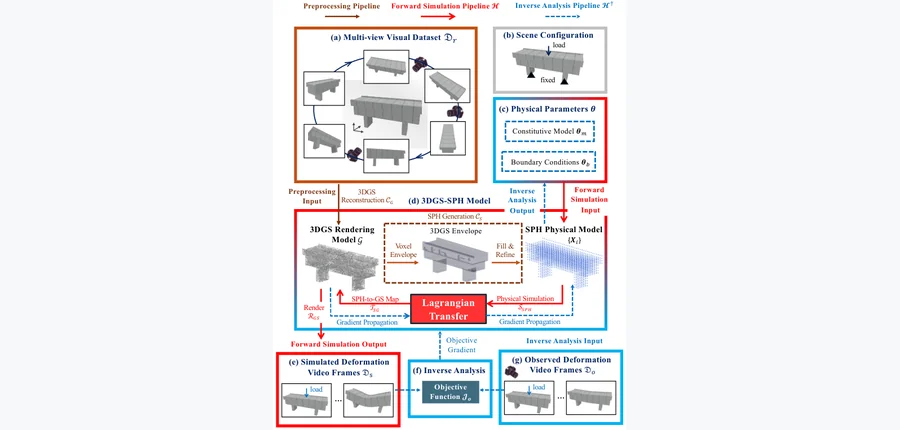 arXiv New 2026-10-06 · cs.CV · #1 **[A differentiable Lagrangian-coupled 3D Gaussian Splatting-SPH model for forward simulation and inverse analysis in solid mechanics](https://arxiv.org/abs/2610.04336)** Tian Xu, Soroush Atashi, Tianju Xue 机构：Hong Kong University of Science and Technology（PDF 首页） [Paper](https://arxiv.org/abs/2610.04336) · [图源](https://arxiv.org/html/2610.04336v1/workflow.png) 

中文摘要
生成世界模型的最新进展增加了人们对再现真实物体的外观及其对物理交互的响应的数字模型的兴趣。三维重建技术（包括 3D 高斯泼溅）可从图像和视频中捕获详细的表面几何形状和外观。然而，将这些表示从合理的动画扩展到本构行为、边界条件和逆参数识别的机械可解释模型仍然很少被探索。在这项工作中，提出了一种可微拉格朗日耦合 3DGS 平滑粒子流体动力学 (SPH) 模型，用于可变形固体的正向模拟和逆向分析。首先根据多视图校准视觉数据集将观察到的对象重建为 3DGS 渲染模型。然后，基于包络的过程为固体力学模型生成独立的 SPH 支持，避免直接使用渲染图元作为机械粒子。参考配置拉格朗日传递将 SPH 变形映射到高斯位置和协方差，从而耦合物理模型和图像观察模型，同时保留可微分的计算路径。 SPH 公式支持线弹性、超弹性和 Kelvin-Voigt 粘弹性响应，以及固定、自由和 Robin 型边界条件。数值研究根据有限元结果验证 SPH 响应，根据使用高斯中心作为表面 SPH 粒子的传统模型评估准确性和效率，并演示对梁、桥梁和肝形示例的正向模拟。逆分析进一步从渲染的变形观察中估计本构参数和边界参数，包括噪声情况，证明了所提出的基于力学的图像数据参数识别模型的可行性。 <a href="https://arxiv.org/abs/2610.04336">原摘要来源</a>
 | 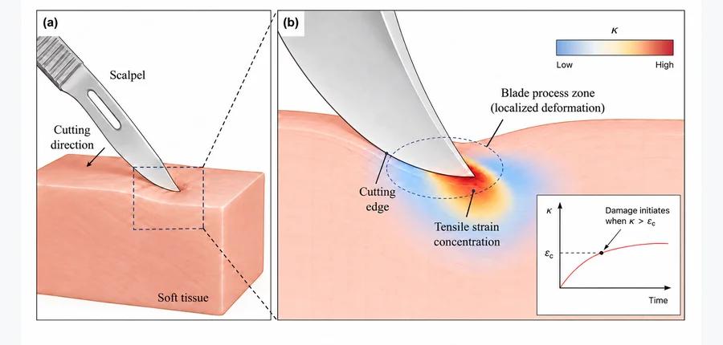 arXiv New 2026-10-06 · cs.RO · #2 **[STC-MPM: Coupled Deformation, Progressive Damage, and Cut Formation in Soft-Tissue Cutting](https://arxiv.org/abs/2610.06198)** Kewei Zuo, Jiahe Chen, Ziao Kuang, Junsheng Zhu, Etsuko Kobayashi 机构：University of Tokyo（PDF 首页） [Paper](https://arxiv.org/abs/2610.06198) · [图源](https://arxiv.org/html/2610.06198v1/fig01_local_mechanics.png) 

中文摘要
切割是机器人自动化中的一项常见操作，从食物准备到手术组织切除。对于高度顺应性的目标，刀片运动可能会使材料变形或移位，而不是推进预期的切割，而渐进的失效会改变负载传递和随后的工具组织相互作用。因此，计算描述必须将切口形成与不断变化的机械响应联系起来，而不是独立于材料失效来指定切口。我们提出了 STC-MPM（使用质点法进行软组织切割），这是一个将有限应变变形、历史驱动的连续损伤和可配置的失效后处理相结合的框架。仅当拉伸应变历史超过刀片加工区域内的材料阈值时，才会发生损坏。在应用失效后策略之前，渐进退化会改变应力传递，而其余组织继续变形、移动并与工具相互作用。使用延迟粒子失活的数值手术刀研究通过插入和撤回来跟踪这种响应。在相同的刀片运动下，降低损伤速率限制会使第一个记录的损伤时间保持不变，但会延迟和增加峰值反作用力，延迟粒子失活，并增加最大插入时的固定样本队列位移统计数据。匹配的比较说明了启动后失效演化如何改变随后的工具受力和记录的材料运动。因此，STC-MPM 支持对切口形成和伴随的组织反应进行联合分析，无需预先插入切割接口。 <a href="https://arxiv.org/abs/2610.06198">原摘要来源</a>
 | 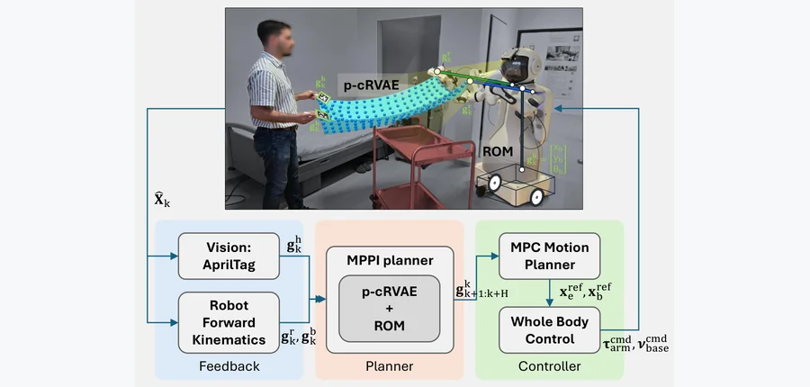 arXiv New 2026-10-06 · cs.RO · #3 **[Physics Residual Dynamics and Reduced Order Whole-Body Planning for Obstacle Aware Human Robot Cloth CoTransportation](https://arxiv.org/abs/2610.06641)** Moein Forouhar, Kosar Behnia, Anirvan Dutta, Hamid Sadeghian, Ville Kyrki, Sami Haddadin, Gokhan Alcan, Eckehard Steinbach 机构：Technical University of Munich / Tampere University / Aalto University / MBZUAI（PDF 首页） [Paper](https://arxiv.org/abs/2610.06641) · [图源](https://arxiv.org/html/2610.06641v1/garmi_cloth_framework.png) 

中文摘要
可变形物体的人机协同运输需要预测运动过程中的物体变形，因为障碍物间隙取决于抓取点和未驱动的内部。我们提出了一个分层规划框架，它将学习的布料模型与双臂移动机械手的降阶全身模型相结合。物理残差条件循环变分自动编码器 (p-cRVAE) 通过学习对计算高效的线性化物理模型的残差校正，从抓点观测中预测完整的布料配置，限制 40 步规划范围内的误差累积。预测的布料动力学嵌入到模型预测路径积分（MPPI）规划器中，使用双臂移动操纵器的降阶表示，保留非完整基础约束和手臂工作空间限制。 MPC 层随后将采样的运动细化为用于全身控制的平滑、可执行的参考。降阶公式实现了与完整 17-DoF 模型相当的跟踪性能，同时减少了约 80% 的计算时间。在四种协同运输场景和两种承载速度中，所提出的框架保持布料与障碍物的间隙，其中沿角点行进的基线会导致碰撞，而全身细化将最终的布料变形从 0.93 m 减少到 0.28 m。 <a href="https://arxiv.org/abs/2610.06641">原摘要来源</a>
 |
| 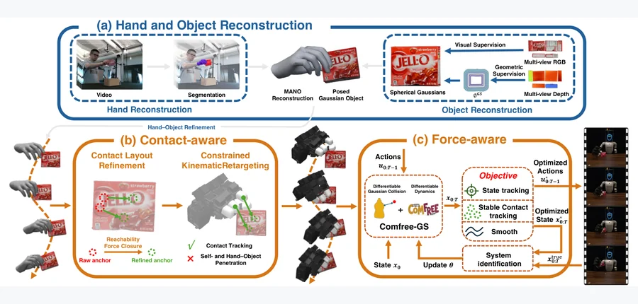 arXiv New 2026-10-06 · cs.RO · #4 **[DexForge: High-Fidelity Physics-Informed Dexterous Retargeting](https://arxiv.org/abs/2610.06331)** Meizhong Wang, Kun Cao, Ruiqi Ni, Lihua Xie, Yiguang Hong 机构：Tongji University / Shanghai Research Institute for Intelligent Autonomous Systems / Purdue University / Nanyang Technological University（PDF 首页） [Paper](https://arxiv.org/abs/2610.06331) · [Code](https://github.com/wmz1226/DexForge) · [Project](https://wmz1226.github.io/DexForge/) · [图源](https://arxiv.org/html/2610.06331v1/pipeline.png) 

中文摘要
人体演示提供了精确灵巧操作的丰富示例，也是机器人训练数据的有前途的来源。然而，在物理限制下，跨机器人实施例的演示运动和手部物体交互的高保真再现仍然具有挑战性。我们推出了 DexForge，一个基于物理的可微分框架，用于将人类视频演示转换为高保真机器人轨迹。我们从视觉观察中重建球形高斯物体模型和手部物体运动，然后构建一个将高效高斯碰撞检测与现有可微动力学相结合的可微仿真器。基于该仿真器，DexForge 将接触感知运动学重定向与力感知动态重定向相结合：机器人适应的稳定接触引导运动学参考构建和随后基于梯度的控制细化，以实现精确的物理运动再现。在七只灵巧的手上进行的 130 次 DexYCB 和 HOT3D 演示实验表明，成功率比基线提高了约 35-53 个百分点，成功轨迹上的物体位置和方向跟踪误差分别减少了约 34-67% 和 71-78%。进一步的实验演示了到 MuJoCo 的开环传输和真实机器人执行。我们的项目页面位于 https://wmz1226.github.io/DexForge/ <a href="https://arxiv.org/abs/2610.06331">原摘要来源</a>
 | 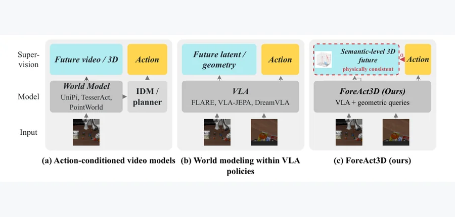 arXiv New 2026-10-06 · cs.RO · #5 **[ForeAct3D: Policy-Grounded Future World Modeling for VLA Policies](https://arxiv.org/abs/2610.04607)** Zhe Tao, Feiran Wang, Gaowen Liu, Ramana Rao Kompella$, Yan Yan 机构：University of Illinois Urbana-Champaign / University of Illinois Chicago / Cisco（PDF 首页） [Paper](https://arxiv.org/abs/2610.04607) · [Project](https://github.com/anthonytao80-crypto/ForeAct3D) · [图源](https://arxiv.org/html/2610.04607v1/teaser.png) 

中文摘要
机器人需要预测它们的行为将如何改变世界，因为操纵的成功取决于由此产生的接触和物体运动。然而，现有的视觉-语言-动作（VLA）策略通过共享特征预测未来的观察结果，使得预测与策略实际执行的动作脱钩，并且对场景的演变没有施加任何物理约束。我们引入了 ForeAct3D，这是一个在 VLA 策略中基于策略的未来世界建模框架。可学习的几何查询将深度、语义分割和摄像机姿态从策略表示解码为当前和未来的语义 3D 场景状态，并且未来的查询以策略生成的动作块为条件，以在计划的交互中进行预测。物理一致性闭合通过背景静态性和实例级刚性将两种状态联系起来，并将手腕相机姿势锚定到末端执行器运动学。这些目标塑造了训练期间用于动作生成的共享表示，并且推理时不需要未来预测。在没有机器人预训练的情况下，ForeAct3D 在 LIBERO 上实现了 98.3% 的平均成功率，在 CALVIN 上实现了 3.73 的平均任务长度，在每个套件上都优于其基本策略。消融表明，语义 3D 监督、物理一致性和动作调节都可以提高操作性能，并且动作调节可以显着改善未来的对象定位。关于空间放置、对象插入和顺序操作的现实世界实验进一步将基本策略的平均成功率从 6.7% 提高到 37.8%。项目页面和代码可在 https://github.com/anthonytao80-crypto/ForeAct3D 获取。 <a href="https://arxiv.org/abs/2610.04607">原摘要来源</a>
 | 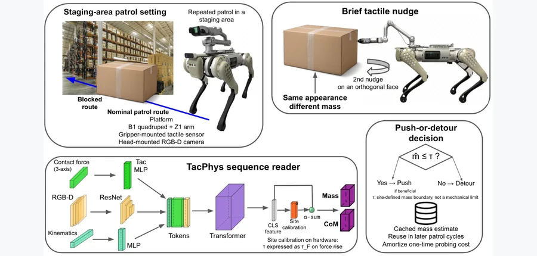 arXiv New 2026-10-06 · cs.RO · #6 **[Nudge Before You Push: Physics-Aware Navigation via Tactile Probing](https://arxiv.org/abs/2610.04924)** Xianyao Li, Fang Xu, Ruitong Tian, Bowen Sun, Xiao Hu, Yang Ye, Jing Du 机构：University of Florida / Northeastern University（PDF 首页） [Paper](https://arxiv.org/abs/2610.04924) · [图源](https://arxiv.org/html/2610.04924v1/fig1_overview.png) 

中文摘要
视觉上相同的容器可以隐藏需要不同处理决策的负载。我们推出了 TANav，它使用短暂的推动来测量在现场规定的处理边界下导航的推动阻力。 TacPhys 将力序列（带有可选的 RGB-D 和运动学）读取到质量估计中以进行推送授权。重复巡逻规划人员权衡探测和路线成本，在有用时请求第二次联系，并在访问期间重复使用观察结果。在模拟中，TacPhys 接近纯阻力贝叶斯参考，并将相对于类似低风险操作点的峰值力阈值的错过推动从 28.7% 减少到 5.5%。在重复巡逻模拟中，TANav 恢复了 90% 的 oracle路径节省，相对于始终绕行的人为干预减少了一半以上，并且相对于仅 RGB-D 探测，将边界违规从 4.3% 减少到 2.9%。在具有霍尔阵列指尖的四足机械臂上，对于重达 2.82 kg 的容器，离线零射击 MAE 为 0.28-1.07 kg。 3 kg 的力上升沿校准可提供 93.5% 的合并离线准确度（非立方体场景下为 86.4%）；单独的原始峰值规则在未见盒子的 20 次在线决策中正确 15 次。 <a href="https://arxiv.org/abs/2610.04924">原摘要来源</a>
 |
| 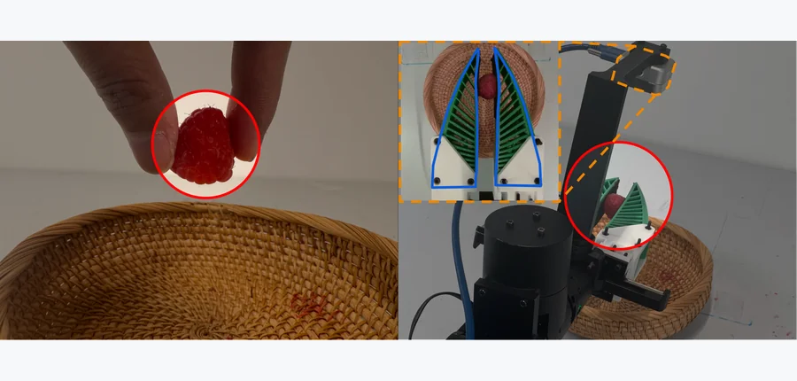 arXiv New 2026-10-06 · cs.RO · #7 **[Robot Learning with Visual Predicted Force](https://arxiv.org/abs/2610.04741)** Haonan Chen, Feiyang Wu, Yuxiang Ma, Mustafa Mete, Pengfei Ye, Junxuan Shen, Cheng Zhu, Aurora Ruggeri, Kelvin Cheung, Jia… 机构：Harvard University / MIT / University of Pennsylvania / Stanford University（PDF 首页） [Paper](https://arxiv.org/abs/2610.04741) · [图源](https://arxiv.org/html/2610.04741v1/teaser.png) 

中文摘要
力感知操纵通常依赖于专门的力或触觉传感器。我们表明，力感知操纵可以通过顺应 Fin Ray 夹具变形的视觉力预测来实现。我们的方法训练两个模型。首先，我们根据校准数据训练视觉力估计器，并使用它通过力估计来注释任务演示。其次，我们在这些力增强演示上训练动作-力提案策略，以共同生成候选机器人动作及其相关力。在测试时，我们对候选动作及其预期产生的力进行采样，然后执行预测力最接近演示中的目标的动作。我们评估了我们在浆果采摘、空罐抓取、手部重新定位和插头插入方面的方法。我们的结果表明，视觉力预测可以指导推理时间动作选择，以进行接触丰富的操作，而无需在部署时使用力或触觉传感器。 <a href="https://arxiv.org/abs/2610.04741">原摘要来源</a>
 | 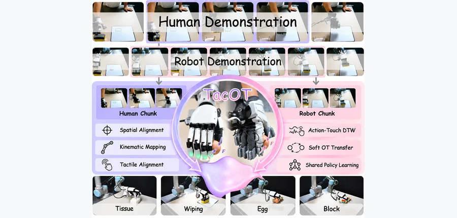 arXiv New 2026-10-06 · cs.RO · #8 **[TacOT: Learning Contact-Rich Dexterous Manipulation from Human Demonstrations via Tactile-Guided Optimal Transport](https://arxiv.org/abs/2610.04363)** Xingting Li, Yifan Han, Zijian Lin, Wei Hou, Chuqiao Lyu, Shoujie Li, Wenbo Ding 机构：Tsinghua University / Shanghai Jiao Tong University / Nanyang Technological University（PDF 首页） [Paper](https://arxiv.org/abs/2610.04363) · [图源](https://arxiv.org/html/2610.04363v1/teaser-v6.png) 

中文摘要
从人类演示中学习接触丰富的灵巧操作提供了可扩展的交互数据源，但由于人—机器人对应关系不可靠，将这些技能转移给机器人仍然具有挑战性。现有的人到机器人迁移方法通常依赖于视觉外观或运动相似性，这可能会将相似的运动与不同的接触状态和力模式相关联。触觉动力学提供交互感知线索，以区分具有相似运动但不同接触状态的操作过程。我们引入了触觉引导最优传输（TacOT），这是一种人机接触丰富的操作框架。 TacOT 利用动作——触觉动态时间扭曲来识别具有一致交互动态的人类——机器人演示对应关系，并使用这些对应关系来指导共享策略表示空间中的软最优传输对齐。这使得人类演示能够为机器人策略学习提供丰富的接触监督，而无需预定义的帧级人—机器人配对。在四项现实世界的灵巧操作任务中，TacOT 在分布内任务中比动作引导 OT 的闭环成功率提高了 17 个百分点，在有针对性的人到机器人分布外转移中提高了 20 个百分点。进一步的分析表明，触觉引导的对应选择具有更一致的接触动态的示范对，并产生更好地反映交互状态演化的潜在表示。这些结果表明，触觉动力学为在接触丰富的灵巧操作中建立可靠的人—机器人对应提供了有效的语义信号。 <a href="https://arxiv.org/abs/2610.04363">原摘要来源</a>
 | 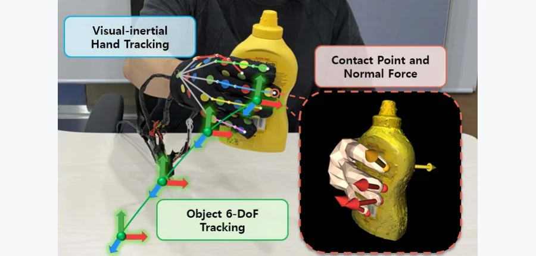 arXiv New 2026-10-06 · cs.RO · #9 **[VICON: Visual-Inertial-Contact based Hand-Object Tracking for Manipulation Datasets](https://arxiv.org/abs/2610.05180)** Yubin Jeon, Uiseong Shin, Hwanchul La, Jaeseong Kang, Hyelim Choi, Yongseok Lee 机构：DGIST / Seoul National University（PDF 首页） [Paper](https://arxiv.org/abs/2610.05180) · [图源](https://arxiv.org/html/2610.05180v1/fig1.png) 

中文摘要
学习灵巧的操作受益于捕捉多样化和自然的手部物体交互的人类演示数据集。特别是，接触点和力提供了对交互位置和交互强度的监督，而这些仅通过运动轨迹无法完全捕获。然而，联合捕捉手部和物体运动、接触点和力的方法仍然有限。此外，手与物体交互造成的严重遮挡挑战了手和物体的准确跟踪。为了解决这些限制，我们提出了一种基于视觉惯性接触的手部物体跟踪（VICON）框架。即使在严重遮挡的情况下，它也能整体捕获手部和物体的运动以及操作过程中的接触信息。首先，我们采用视觉惯性手套和 RGB-D 相机来进行精确的手部跟踪，并重新设计手套以纳入接触感应。具体来说，根据人类抓握频率将力敏电阻器（FSR）放置在手套上，以同步记录接触状态和校准的法向力。其次，在不需要预先存在的 CAD 模型的情况下，我们使用 RGB-D 图像和从单目视频重建的网格来估计物体姿态。我们提出了基于因子图的物体轨迹估计，融合了根据手部物体遮挡、FSR 测量和手部运动先验下的可见性加权的物体姿势估计。在 5 个对象的 40 个动作捕捉会话中，VICON 实现了 2.5% 的失败帧率，而基线的失败帧率为 50.9-64.6%，遮挡情况下的中位误差为 3.9 毫米和 3.0 度。使用 VICON，我们构建了一个包含同步手部物体运动、接触点和法向力的数据集，并将在 https://github.com/VICON-dataset/dataset 上公开发布涵盖 10 个物体类别的扩展数据集。 <a href="https://arxiv.org/abs/2610.05180">原摘要来源</a>
 |
| 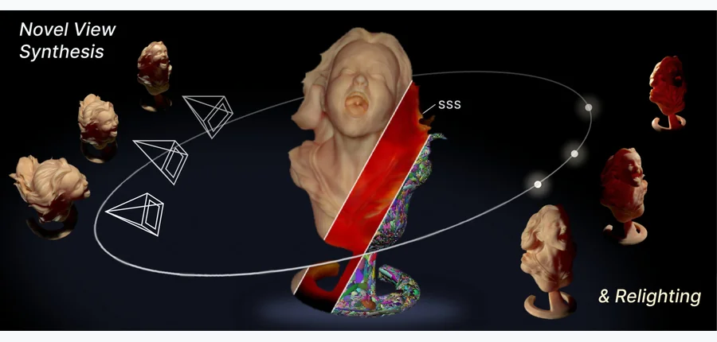 arXiv New 2026-10-06 · cs.CV · #10 **[VolS-GS: Relightable Gaussian Splatting with Volumetric Subsurface Scattering](https://arxiv.org/abs/2610.04007)** Junyeong Ahn, Jaegul Choo 机构：KAIST AI（PDF 首页） [Paper](https://arxiv.org/abs/2610.04007) · [图源](https://arxiv.org/html/2610.04007v2/f1_teaser.png) 

中文摘要
我们提出了 VolS-GS，一种可重新照明的高斯泼溅框架，它可以通过一次一光 (OLAT) 捕获重建对象，并在新颖的照明和视点下渲染它们。 Relightable Gaussian Splatting 方法通常在每个基元处独立地对外观进行建模，这使得非局部效果难以表示。这种限制对于次表面散射尤其明显，其中在一个位置进入物体的光可以在另一个位置出现。我们不是仅使用神经网络或每个基元的局部内核来建模这种效果，而是使用高斯场景的空间支持作为可微分有限体积传输求解器的域，以便光可以通过对象的内部传播。一个小型网络预测每个高斯的散射和吸收系数，并且求解通过结果场重新分布入射光。这些系数通过图像拟合而非实测，因此求解提供了用于聚合每个基元外观的传输形状路径，而不是材料的测量。为了防止学习到的阴影和镜面反射项接管其他组件，我们的阴影项是根据可见性以及求解产生的透射率和散射来预测的，并且正则化器会抑制阴影项预测未照亮的区域中的镜面高光。对三个 OLAT 基准的实验表明，VolS-GS 持续改进了未见光照和视角的重新照明质量。 <a href="https://arxiv.org/abs/2610.04007">原摘要来源</a>
 | 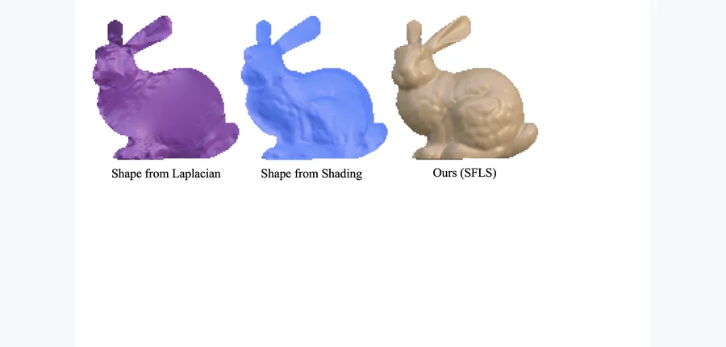 arXiv New 2026-10-06 · cs.CV · #11 **[A Theory of Shape Reconstruction from Heat Conduction and Shading](https://arxiv.org/abs/2610.04052)** Akihiko Oharazawa, Sriram Narayanan, Mani Ramanagopal, Srinivasa G. Narasimhan 机构：affiliation 未确认 [Paper](https://arxiv.org/abs/2610.04052) · [图源](https://arxiv.org/html/2610.04052v1/figures/teaser_bunny.png) 

中文摘要
使用朗伯表面的单个图像的阴影形状本质上是不明确的。当光源方向已知时，表面法线估计具有圆锥模糊性，当光源未知时，这种模糊性会恶化。最近，基于热传导的形状重建已成为一种利用热传输方程来估计形状拉普拉斯算子（形状的内在度量）的方法。然而，从拉普拉斯算子导出表面法线会遇到局部二元凸/凹模糊性。我们的贡献引入了一种新颖的理论，通过结合阴影和热传导的线索来解决这些局部形状模糊性（排除一些简并性），而不依赖于平滑度等先验。我们的方法确保即使在未知光源的情况下，同时满足着色和拉普拉斯算子的数学约束。我们通过复杂形状的模拟来验证我们的理论，并分析其在存在噪声的情况下的性能，以及在具有复杂形状和材料属性（包括变化的反照率）的现实世界物体的嘈杂的单段热成像视频上的性能。 <a href="https://arxiv.org/abs/2610.04052">原摘要来源</a>
 | 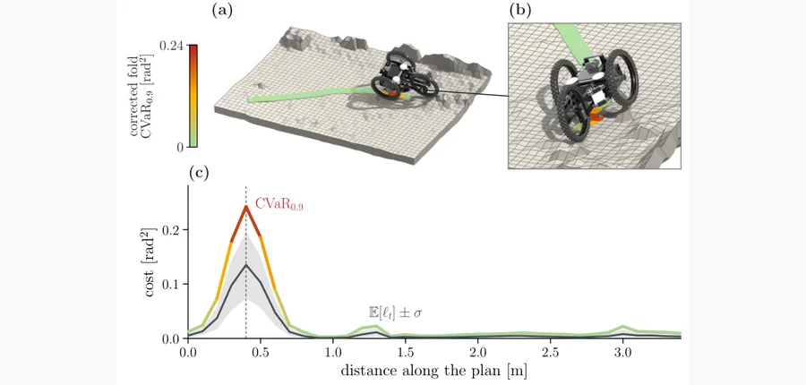 arXiv New 2026-10-06 · cs.RO · #12 **[Propagating Elevation-Map Uncertainty Through the Contact Maximum in Closed Form](https://arxiv.org/abs/2610.06103)** AleÅ¡ Kučera, Karel Zimmermann 机构：Czech Technical University in Prague（PDF 首页） [Paper](https://arxiv.org/abs/2610.06103) · [图源](https://arxiv.org/html/2610.06103v1/rover.png) 

中文摘要
具有风险意识的规划者使用路径成本的平均值和标准差在不确定的高程地图上对路径进行评分。然而，对刚性接触进行建模需要计算多个不确定单元的最大值。一阶传播仅在单个单元上进行区分，因此会损失准确性，而蒙特卡洛采样则需要每次绘制时进行完整路径评估。我们使用克拉克成对递归计算闭合形式的接触最大值的矩。通过跟踪每个接触相对于共享地图单元的协方差，我们使用精确的高斯二次形式恒等式传播平滑余数。在两条设计路径上一次性拟合的竞争深度校准，可以弥补仍然存在的总标准差不足。在 317 个保留的流动站路径段上，根据相同信念对蒙特卡罗参考进行评分，所有预先注册的标准均得到满足。校正后的 Clark 折叠将平均值的中位误差从线性化的 2.3% 减少到 0.19%，并在每种测试方法的 90% 水平上实现了条件风险值 (CVaR) 的最低误差。基准测试计划在 GPU 上仅花费 5.5 微秒。这些准确性的提高主要集中在有争议的接触上。虽然他们很少改变在此地形上选择的路径，但折叠仍然在 98% 的决策中选择参考最佳路径，而线性化的决策为 93% 到 96%。在第二个数据集上，均值估计可迁移，但风险指标不可迁移。 <a href="https://arxiv.org/abs/2610.06103">原摘要来源</a>
 |
| 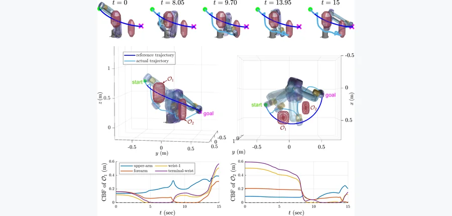 arXiv New 2026-10-06 · cs.RO · #13 **[GJK-CBF: Control Barrier Functions for Convex Rigid Body Collision Avoidance on SE(3)](https://arxiv.org/abs/2610.04910)** Yi-Hsuan Chen, Shuo Liu, Wei Xiao, Michael Otte, Calin Belta 机构：University of Maryland, College Park（PDF 首页） [Paper](https://arxiv.org/abs/2610.04910) · [图源](https://arxiv.org/html/2610.04910v1/arm-snap-cc.png) 

中文摘要
凸体之间的避免碰撞是机器人技术中的一个基本问题。控制屏障函数 (CBF) 因其计算效率而为实时安全过滤提供了实用的框架。对于一般的凸体，精确的分离测量，例如距离或比例因子，通常通过优化来计算。现有的 CBF 公式通常通过可微优化 (diffOpt) 获得所需的梯度，从而增加了计算开销。相比之下，我们利用 Gilbert-Johnson-Keerthi (GJK) 算法来获取当前见证对（实现最小距离或穿透深度的点对），并制定 CBF，称为 GJK-CBF，其梯度直接根据见证对的相对刚体运动构建，而不需要借助 diffOpt。该公式适用于跨广泛类别的凸体对的 2D 和 3D 环境，前提是每个一对一交互中至少有一个是严格凸体的。所提出的 GJK-CBF 在各种场景中得到了验证，包括 2D 和 3D 中的多机器人位置交换、3D 中垂直狭缝的导航及其对操纵器的适用性。结果证明了所有场景下的无碰撞运动，同时减少了几何近似带来的保守性，特别是在狭窄的环境中。 <a href="https://arxiv.org/abs/2610.04910">原摘要来源</a>
 | 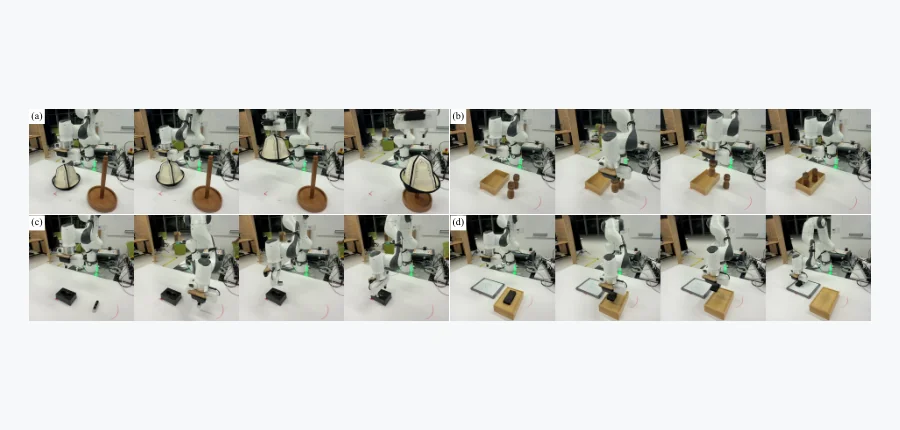 arXiv New 2026-10-06 · cs.RO · #14 **[Demonstration-Calibrated Port-Hamiltonian Retuning for Manipulation Policies](https://arxiv.org/abs/2610.05755)** Yulong Yang, Fan Wu, Christine Allen-Blanchette, Amit Chakraborty 机构：Princeton University / Arizona State University / Siemens Foundation Technologies（PDF 首页） [Paper](https://arxiv.org/abs/2610.05755) · [图源](https://arxiv.org/html/2610.05755v1/PHRetune_Exp_TaskDemo_V3.png) 

中文摘要
用于操纵的扩散和 VLA 策略通常通过下游阻抗控制器来部署。这些控制器的刚度和阻尼增益会影响任务的成功，但通常是从数据收集中继承的，而不是为部署的策略选择的。尽管经验增益扫描可以提高性能，但它们需要重复评估。我们引入了 PHRetune，这是一种离线方法，可以为冻结策略导出控制器增益，而无需评估回合或增益搜索。我们的方法从演示中学习端口哈密顿模型，以估计与策略预测动作相关的力与能量。该策略适用于记录的示范观测，并根据示范产生的力与能量预算评估其预测。从这个比较中，我们得出闭式的单个增益尺度，调整下游控制器，同时保留策略及其动作表示。增益在评估之前是固定的，不需要事先的操纵器模型、任务奖励、策略再训练或额外的运行时计算。在 LIBERO 套件中，PHRetune 将扩散策略的成功率提高了高达 9.4 个百分点，派生的增益在经验增益扫描中达到了观察到的最高成功率。在所有四个现实世界的操纵任务中，PHRetuned 扩散策略都优于名义策略、替代增益调整方法和策略再训练基线。相同的过程可以提高 SmolVLA 和 OpenVLA-OFT 在每项任务上的成功率，同时减少两个 VLA 主干的加速度和加加速度。 <a href="https://arxiv.org/abs/2610.05755">原摘要来源</a>
 | 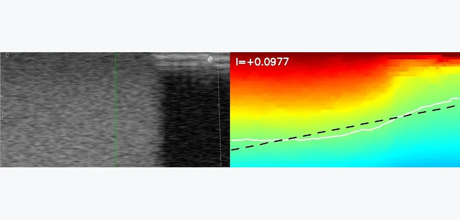 arXiv New 2026-10-06 · cs.RO · #15 **[Dual-Rate Force-Image Control with Model-Based Orientation Limits for Robotic Ultrasound](https://arxiv.org/abs/2610.05839)** Tyler Foster, Qiang Zhang, A B M Tahidul Haque, Anh Thu Nguyen 机构：University of Alabama（PDF 首页） [Paper](https://arxiv.org/abs/2610.05839) · [图源](https://arxiv.org/html/2610.05839v1/figures/cue_example.jpg) 

中文摘要
机器人超声将高速接触力回路与较慢、延迟的图像反馈耦合在一起，因此图像引导超声探头旋转可能会在观察到所得图像响应之前扰乱接触力。我们得出了一个闭式的定向速率限制，该限制将建模的旋转引起的估计力偏移限制在有限的范围内，同时考虑快速力环的干扰抑制。该限制取决于局部接触刚度、力环增益、保守的旋转力增益界限、偏移预算和预测范围。我们在具有基于时间戳的延迟重建和基于关节扭矩的力估计的双速率控制器中实现该模型，并使用成对控制器比较和组件消融在弯曲明胶模型上对其进行评估。相对于无约束图像引导，所提出的速率限制控制器将第一秒均方根 (RMS) 估计力误差减少了 0.40 N，同时将图像线索收敛时间增加了 0.94 s。接近分析预测上限的固定速率上限不会产生可解析的力误差差异，并且收敛速度快 0.32 秒，这表明该模型的主要实用价值是速率设计规则而不是在线预测。延迟重建在测试的延迟下没有可分辨的影响。尽管图像提示在异质组织上受到噪声限制，但单受试者腘窝扫描证明了可行性。 <a href="https://arxiv.org/abs/2610.05839">原摘要来源</a>
 |
| 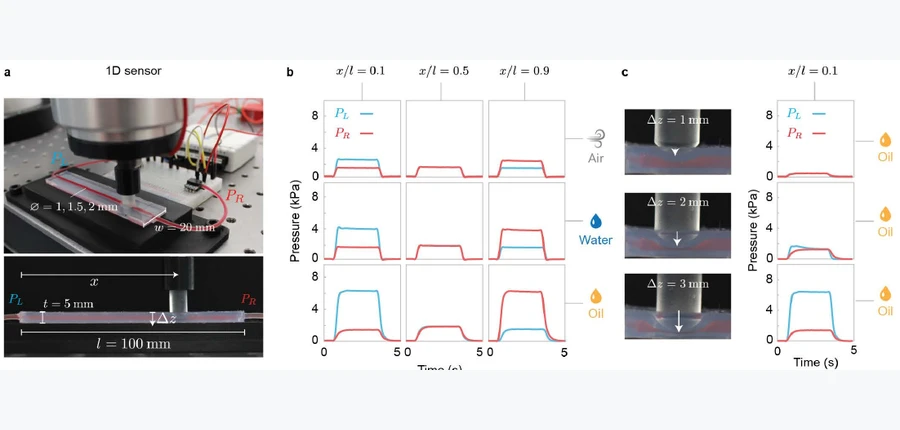 arXiv New 2026-10-06 · cond-mat.soft · #16 **[Tactile Perception through Fluid-Solid Interaction](https://arxiv.org/abs/2610.03773)** Arman Goshtasbi, Minke Berghuis, Aida Parvaresh, Saravana Prashanth Murali Babu, Robert W. Style, Ahmad Rafsanjani 机构：University of Southern Denmark / University of Twente / ETH Zürich（PDF 首页） [Paper](https://arxiv.org/abs/2610.03773) · [图源](https://arxiv.org/pdf/2610.03773) 

中文摘要
软触觉传感器通过增强的灵活性和适应性来提升机器人的触摸能力，但大多数现有设计依赖于容易受到干扰和环境限制的嵌入式电子设备。在这项工作中，我们利用流体-固体相互作用来开发一类软触觉传感器，其在传感部位完全无需电子设备即可运行。该传感器包括一个充满液体的弹性体通道，仅连接到两个外部压力传感器。触摸弹性体表面的不同区域会推动黏性流体，产生编码触摸位置和力的不同压力模式。这些信号通过集成特征提取、软聚类和自适应神经模糊推理的机器学习框架进行解码，以实现准确的定位和力估计。我们通过线性 (1D) 传感器中的单点触摸定位和力估计来验证这一概念，并通过使用空间填充曲线在表面上路由通道，将相同的传感原理扩展到 2D 触觉映射，同时保持相同的最小硬件设置。这种简单的方法在传统电子传感器经常失效的环境中仍然有效，例如水下或存在磁干扰的情况。 <a href="https://arxiv.org/abs/2610.03773">原摘要来源</a>
 | 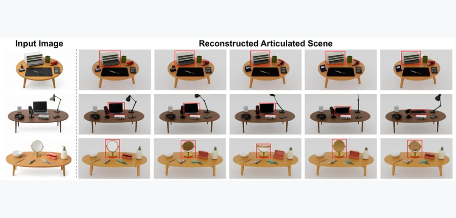 arXiv New 2026-10-06 · cs.CV · #17 **[ArticuTable: Generating Instance-Level Interactive Rigid-Articulated 3D Tabletop Scenes from a Single Image](https://arxiv.org/abs/2610.05249)** Kai Lv, Yibo Yin, Lijun Guo, Heng Fan, Kaihao Zhang, Xingping Dong 机构：Wuhan University / University of North Texas / Australian National University（PDF 首页） [Paper](https://arxiv.org/abs/2610.05249) · [图源](https://arxiv.org/html/2610.05249v1/teaser_articulated_reconstruction.png) 

中文摘要
具身智能体受益于 3D 环境，该环境将现实世界观察的视觉保真度与物理交互性相结合。现有的单图像桌面重建方法恢复了合理的场景几何形状，但通常将对象表示为整体刚体，限制了整个对象刚性运动的交互并排除了可执行的部件级关节。同时，恢复与输入视图一致的场景布局仍然具有挑战性，因为单个观察可能允许多个合理的姿态尺度配置。我们提出了 ArticuTable，一个单图像 3D 桌面重建框架，可以恢复可执行的部件级可动关节和输入视图一致的场景布局。对于对象建模，我们引入了生成鲁棒关节建模（GRAM），它将多模态大语言模型引导的关节拟合与语义状态推理相结合，从不完美的整体代理网格中恢复可靠的关节参数和有效的运动范围，从而将它们转换为可执行的关节资产。对于场景布局，我们引入了渐进式语义几何场景配准（PSGSR），它在互补的度量、平面和输入视图约束下逐步缩小姿势尺度搜索空间，并通过结构感知语义对应解决方向模糊性，产生与输入视图一致的场景布局。我们进一步贡献了 ArticuTable-100，这是 100 个可用于仿真的桌面场景的精选集合。包括用户研究在内的广泛评估证明了其在视觉保真度、输入视图一致性、关节运动质量、物理合理性和模拟准备度方面的强大性能。 <a href="https://arxiv.org/abs/2610.05249">原摘要来源</a>
 | 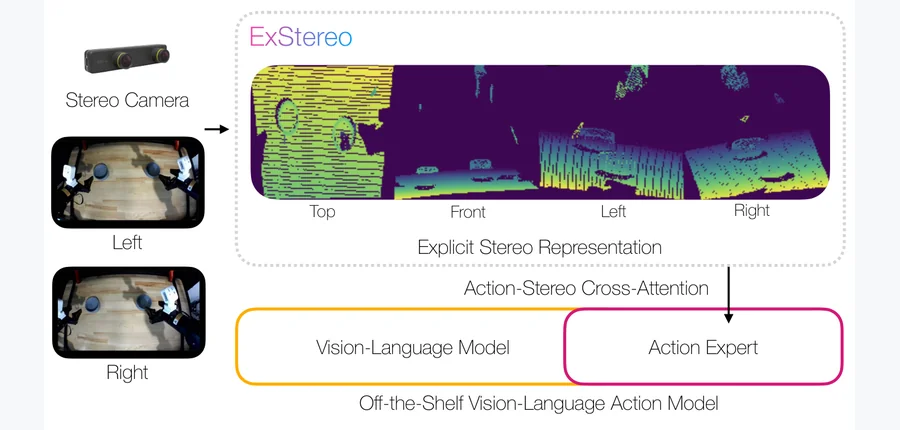 arXiv New 2026-10-06 · cs.RO · #18 **[ExStereo: Lifting 2D Vision-Language-Action Models to 3D with Explicit Stereo Representations](https://arxiv.org/abs/2610.04805)** I-Chun Arthur Liu, Jason Chen, Gaurav S. Sukhatme, Daniel Seita 机构：affiliation 未确认 [Paper](https://arxiv.org/abs/2610.04805) · [Project](https://exstereo-vla.github.io/ExStereo/) · [图源](https://arxiv.org/html/2610.04805v1/figure_hero_v9.png) 

中文摘要
三维感知对于机器人操作至关重要，特别是对于高精度任务，因为从单目 RGB 观测中恢复度量深度和精确的 3D 物体位置本质上是不适定的。然而，许多视觉-语言-动作 (VLA) 模型仅依赖 RGB 观察来进行感知。利用立体匹配基础模型的最新进展，我们推出了 ExStereo，这是一种立体模块，可通过 3D 感知增强预先训练的 2D VLA。 ExStereo 从立体图像对重建场景几何形状，并将多视图观察渲染为用于立体特征提取的显式立体表示。来自动作专家的动作标记通过我们提出的动作-立体交叉注意机制选择性地关注生成的立体标记，使策略能够生成以 3D 场景信息为条件的机器人动作。为了学习鲁棒的 3D 表示，我们在特定任务的后期训练之前引入了中间训练阶段，使用大规模立体数据的自我监督学习目标。我们通过微调两个公开可用的 VLA $\pi_{0.5}$ 和 SmolVLA 来验证我们的方法，并在模拟和现实世界的双手 PiPER 平台上对其进行评估。在这两种设置中，使用 ExStereo 进行微调的 VLA 始终优于基线，证明了立体感知对于机器人操作的有效性。我们的项目网站位于：https://exstereo-vla.github.io/ExStereo/。 <a href="https://arxiv.org/abs/2610.04805">原摘要来源</a>
 |
| 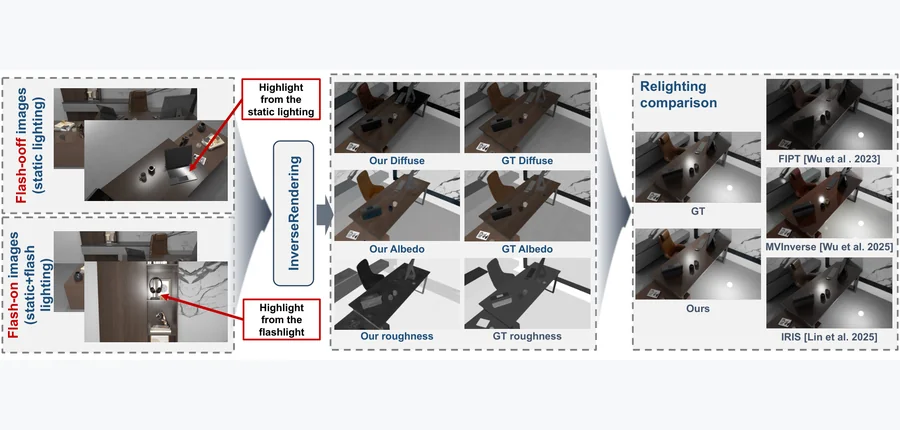 arXiv New 2026-10-06 · cs.CV · #19 **[Casual Flash Lighting for Gaussian Splat Inverse Rendering](https://arxiv.org/abs/2610.06035)** Jiamin Xu, Dongheng Wei, Jiarong Zhao, Qi Wang, James Tompkin, Weiwei Xu, Gang Xu 机构：Hangzhou Dianzi University / North China Electric Power University / Brown University / Zhejiang University（PDF 首页） [Paper](https://arxiv.org/abs/2610.06035) · [图源](https://arxiv.org/html/2610.06035v1/teaser-3.png) 

中文摘要
当只有静态照明可用时，从照片中恢复几何形状、材质和照明是非常不明确的。主动照明设置可以减少模糊性，但需要暗室或专用硬件。相反，我们将休闲室内捕捉的静态和闪光灯灯光协同起来，打开或关闭闪光灯，分别从独立的角度进行拍摄。闪光灯残差会限制反照率和 BRDF，而静态照明会捕获闪光灯错过的掠角镜面高光。对于 2DGS 重建框架，我们的关键贡献是 GS 锚定漫射场：在光栅化 2DGS 深度查询哈希编码的 MLP。由于它仅取决于世界位置，因此它在 3D 中视图一致，并允许闪光残差驱动材料分解，而不是被跨视图的 alpha 混合漂移吸收。同时，我们使用延迟着色渲染静态光照，这样它也可以监督材质分解。在五个合成和三个真实室内场景中，我们的方法在漫反射颜色、反照率和粗糙度材料参数以及重新照明方面优于最近的六个基线，其中 PSNR 比第二最佳基线提高了 4.17 dB。 <a href="https://arxiv.org/abs/2610.06035">原摘要来源</a>
 | 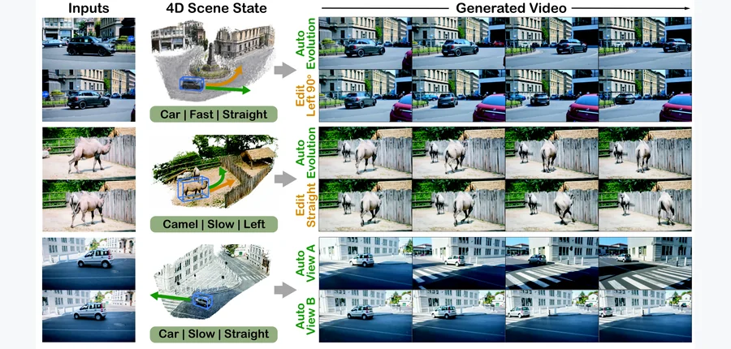 arXiv New 2026-10-06 · cs.CV · #20 **[Kepler4D: Controllable Future Video Generation via 4D Scene State Evolution](https://arxiv.org/abs/2610.04152)** Feiran Wang, Bin Duan, Junyi Wu, Gaowen Liu, Yan Yan 机构：University of Illinois Chicago / University of Michigan Ann Arbor / Cisco（PDF 首页） [Paper](https://arxiv.org/abs/2610.04152) · [图源](https://arxiv.org/html/2610.04152v1/teaser.png) 

中文摘要
视频世界模型旨在保留场景结构并预测动态对象如何超越视觉观察而演变。我们提出了 Kepler4D，这是一个通过显式 4D 场景状态演化来生成未来视频的框架。给定单目视频，Kepler4D 构建背景几何、对象运动历史、粗略空间支持和语义上下文的共享 3D 表示。运动链总结了观察到的运动，并使用视觉语言模型来选择结构化速度和航向决策，并决定是否从下方限制物体中心高度。确定性的推出将这些决策转换为未来的对象轨迹，以便在合成之前进行检查和编辑。我们将不断发展的代理渲染为预训练视频生成器的几何控制，将粗略的对象运动与外观和关节细节的合成分开。对真实视频的实验表明，Kepler4D 能够实现可控的对象运动和合理的未来推出，同时保持场景一致性。 <a href="https://arxiv.org/abs/2610.04152">原摘要来源</a>
 | 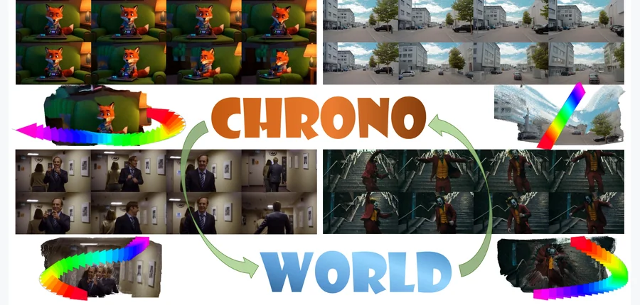 arXiv New 2026-10-06 · cs.CV · #21 **[ChronoWorld: Camera-Controlled Consistent 4D World Generation via Spatiotemporal Cues and Geometric Reflections](https://arxiv.org/abs/2610.06687)** Xiaoyu Zhou, Dingwei Xian, Zhenyu Wang, Yajiao Xiong, Yongtao Wang, Ming-Hsuan Yang 机构：Peking University / University of California Merced（PDF 首页） [Paper](https://arxiv.org/abs/2610.06687) · [图源](https://arxiv.org/html/2610.06687v2/teaser.png) 

中文摘要
虽然现有的摄像机可控视频生成模型可以生成视觉上引人注目的序列，但保持内在的 4D 时空一致性仍然具有挑战性。为了解决这个限制，我们提出了 ChronoWorld，一个“观察--状态--反射”框架，它利用时空因果线索和重建先验来生成全局一致的、自由视图的 4D 场景。给定上下文视频，我们引入了时空极线因果注意机制，该机制在整个生成过程中强制执行多视图极线约束和时间因果关系。此外，我们还开发了一种具有 4D 检索策略的重建驱动的几何反射管道，可以对生成的输出进行动态自我评估和校正，从而提高一致性和准确性。大量实验表明，ChronoWorld 在时空一致、电影品质的 4D 场景生成方面实现了最先进的性能，在不同场景中具有强大的泛化能力和高保真几何形状。 <a href="https://arxiv.org/abs/2610.06687">原摘要来源</a>
 |
| 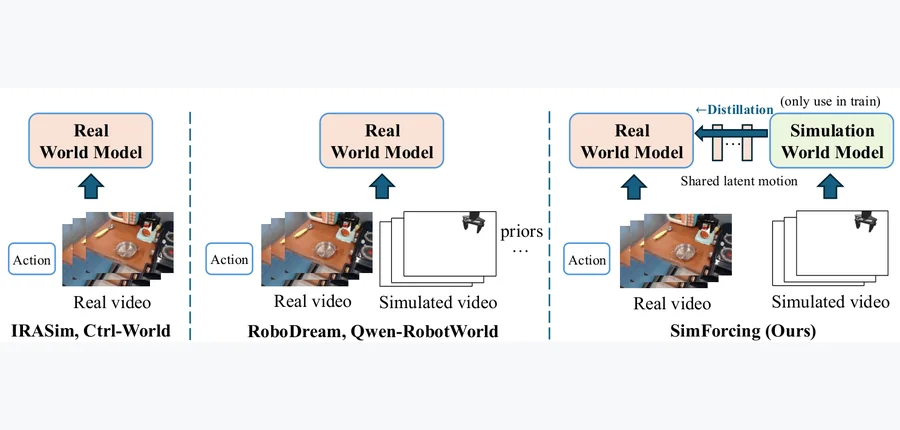 arXiv New 2026-10-06 · cs.RO · #22 **[SimForcing: Distilling Simulation Motion Priors into Real-Domain Robot World Models](https://arxiv.org/abs/2610.06598)** Xiaodong Wang, Tianle Li, Chuanxin Song, Junliang Xie, Zhanmi Zhong, Suiying Wu, Peixi Peng 机构：Peking University（PDF 首页） [Paper](https://arxiv.org/abs/2610.06598) · [Code](https://github.com/Wang-Xiaodong1899/SimForcing) · [图源](https://arxiv.org/html/2610.06598v1/teaser.png) 

中文摘要
动作调节的机器人世界模型必须精确响应机器人轨迹，同时保留逼真的视觉动态，但从异构机器人视频中学习仍然具有挑战性。模拟提供结构化运动监督，但外观差异阻碍了直接传输，并且不准确的模拟预测可能会误导真实视频的生成。我们提出了 SimForcing，这是一个模拟引导框架，它使用模拟作为可转移运动知识的来源和预测的可控参考。首先，我们通过潜在运动蒸馏从模拟老师那里转移运动知识，调整潜在空间中的时间变化以内化运动先验，同时减轻外观差异的影响。其次，我们引入了具有条件丢失的多块模拟调节，以利用预测的模拟轨迹，而不会过度依赖其准确性。我们的模拟调节无分类器指导方案通过平衡基于内化运动知识的预测与由模拟潜伏额外指导的预测，统一了这两种想法。联合训练的学生生成模拟条件和实域视频，推理时不需要额外的世界模型。在 Bridge 上，SimForcing 在没有外部嵌入预训练的情况下在比较方法中实现了最佳的 PSNR、SSIM、LPIPS 和 FVD。对 InternData-A1 的评估进一步支持了其在机器人数据集上的适用性。此外，使用我们训练有素的世界模型来初始化视觉-语言-行动模型可以提高 LIBERO 的成功率，表明它对于下游策略学习的实用性。 https://github.com/Wang-Xiaodong1899/SimForcing <a href="https://arxiv.org/abs/2610.06598">原摘要来源</a>
 | 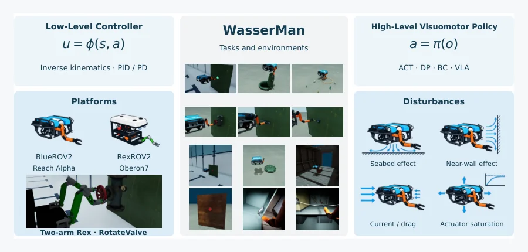 arXiv New 2026-10-06 · cs.RO · #23 **[WasserMan: Benchmark for Underwater Manipulation Policy Learning](https://arxiv.org/abs/2610.04536)** Danil Belov, Artem Erkhov, Sergei Parsegov, Pavel Osinenko 机构：Central University, Moscow / Sirius University of Science and Technology / Institute of Control Sciences RAS（PDF 首页） [Paper](https://arxiv.org/abs/2610.04536) · [图源](https://arxiv.org/html/2610.04536v1/teaser.png) 

中文摘要
水下操纵结合了视觉决策、接触力和推进器控制的浮动底座。我们介绍 WasserMan，据我们所知，这是第一个用于浮基水下接触操纵视觉运动学习的多任务模拟基准。它提供十个专家可解决的任务、两个车辆臂平台、双手配置和水下动力学。九项任务进行了学习策略评估。我们在六项任务上比较 ACT、扩散策略 (DP) 和行为克隆，并进行三次训练和相等的采样窗口预算。预训练的 SmolVLA 添加了对三项任务的评估。在测试的设置中，删除积分操作可能会阻止完成，而更改操作界面可能会降低学习策略的成功率，尽管专家重放成功。水流对任务完成和驱动代价方面产生与任务相关的变化。版本化任务、演示和每集证据支持将专家可行性、学习完成和执行工作分开的协议。 <a href="https://arxiv.org/abs/2610.04536">原摘要来源</a>
 | 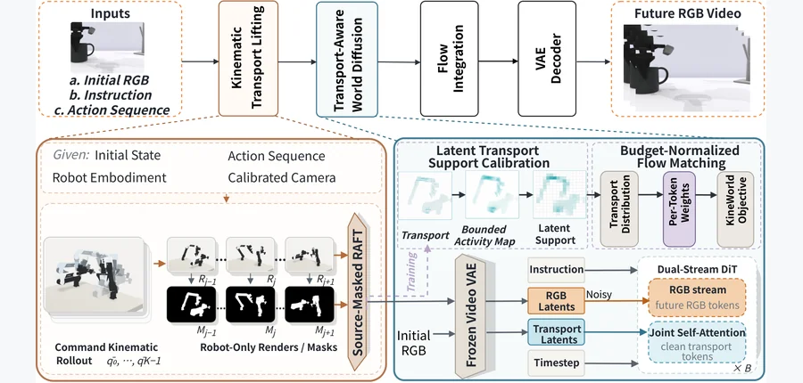 arXiv New 2026-10-06 · cs.CV · #24 **[KineWorld: Action-Induced Transport Fields for Embodied World Modeling](https://arxiv.org/abs/2610.06349)** Ziying Song, Yuchen Liu, Zhuoran Xu, Ziyang Liu, Jian Jin, Jiangtao Su, Haibao Yu, Lei Yang, Yuanpei Chen 机构：Nanyang Technological University / North University of China / Psibot / Hong Kong Polytechnic University / University of Hong Kong / Peking University（PDF 首页） [Paper](https://arxiv.org/abs/2610.06349) · [图源](https://arxiv.org/html/2610.06349v1/KineWorld_v59_merged_framework.png) 

中文摘要
具身世界模型在执行前预测候选动作的视觉后果。然而，现有的以动作为条件的世界模型通常采用统一加权的视觉生成目标，这些目标可能与具体的预测需求不一致。即使使用明确的运动调节，这些目标也可能会低估对交互至关重要的空间稀疏变化。我们提出了 KineWorld，一种传输感知的世界建模框架，它将机器人运动学从运动调节扩展到生成监督的空间分配。运动传输提升 (KTL) 根据命令的机器人运动构建渲染器衍生的、与相机对齐的传输场。传输感知世界扩散 (TAWD) 在视频潜在网格上校准其运动支持，并通过均匀和传输重点分布的归一化混合重新加权未来 RGB 流匹配。我们使用 RoboTwin 2.0 的 ALOHA-AgileX 双手操作数据来训练 KineWorld。 KineWorld在单视图评估中获得了68.95的EWMScore-P，在多视图评估中获得了54.82的TWB-Score。这些结果支持从外观拟合到具体决策的行动结果建模的转变。 <a href="https://arxiv.org/abs/2610.06349">原摘要来源</a>
 |
| 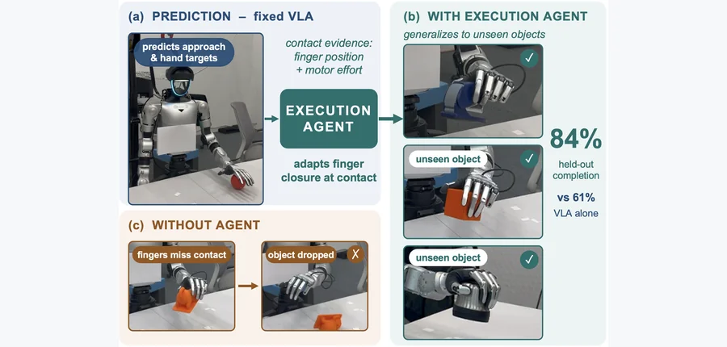 arXiv New 2026-10-06 · cs.RO · #25 **[AgenticTactileVLA: Contact-Guided Execution-Time Supervision for Generalizable Dexterous Manipulation without VLA Retraining](https://arxiv.org/abs/2610.04391)** Elizaveta Semenyakina, Ivan Snegirev, Mikhail Kiselev, Miguel Altamirano Cabrera, Artem Lykov, Hajira Amjad, Dzmitry Tsets… 机构：Skolkovo Institute of Science and Technology（PDF 首页） [Paper](https://arxiv.org/abs/2610.04391) · [图源](https://arxiv.org/html/2610.04391v1/first.png) 

中文摘要
VLA 策略可能预测可迁移的操作方案，却不能在当前物体上可靠执行：适合同一抓握的物体仍会在几何和柔顺性上不同，而闭合时遮挡会削弱视觉反馈。作者提出 AgenticTactileVLA 作为执行时监督器，把部分物体适应从预测转移到物理交互。固定 VLA 给出接近目标和手部目标；监督器选择不介入、调整手指屈曲、保留或放弃校正姿态、把控制交还 VLA 重试，或选用柔顺手控模式。它以手指位置和电机用力反馈作为本体接触证据，无需触觉传感器或 VLA 再训练。在配备 BrainCo Revo2 手的 Unitree G1 上，对训练未见的五个物体进行随机匹配块评估，共享预算下基础 VLA、无条件闭合至停滞和监督器的完成率分别为 61.3%、72.0%、84.0%；收益在所有物体上为正，且在适度姿态扰动下持续。消融显示收益不能仅由延长闭合解释；选择性触发减少 65.7% 的校正回合，未检测到完成率变化。保持状态审计表明，接受决定在 88.9% 的留出案例中能预测物体会被保持，柔顺物体则出现保守的误拒。薄壁杯实验展示了按情境切换到柔顺控制，其表现与始终使用柔顺控制的参考相当。结果提示，接触引导的执行适应可在无需物体特定再训练的情况下提高固定 VLA 对未见物体的泛化。 <a href="https://arxiv.org/abs/2610.04391">原摘要来源</a>
 | 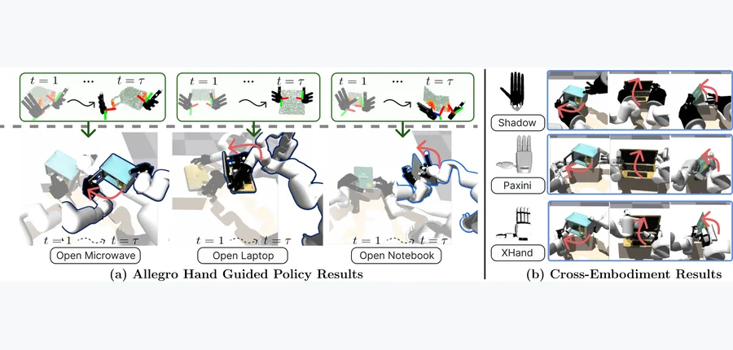 arXiv New 2026-10-06 · cs.RO · #26 **[PatternDex: Learning Interaction Patterns to Guide Reinforcement Learning of Bimanual Dexterous Manipulation of Articulated Objects](https://arxiv.org/abs/2610.04765)** David Minkwan Kim, Runfa Blark Li, Beckham Po-Ju Lee, Nikolay Atanasov, Truong Nguyen 机构：University of California San Diego（PDF 首页） [Paper](https://arxiv.org/abs/2610.04765) · [Project](https://patterndex.github.io/PatternDex/) · [图源](https://arxiv.org/html/2610.04765v1/policy_sim_result.png) 

中文摘要
在本文中，我们开发了一种方法，使双手灵巧的手能够以高成功率操纵铰接式物体，而不会出现实施差距。我们观察到手部运动和物体运动之间的相关性是由物体而不是手决定的，并且可以从人与物体的演示中学习。基于这一观察，我们提出了 PatternDex，一种学习这种相关性并将其表示为token序列的方法，我们将其称为交互模式。根据该模式，PatternDex 估计适合目标机器人的手腕运动和接触点，然后训练强化学习策略，利用这些估计作为指导。由于指导适合目标实施例，因此该策略仅探索目标机器人可以执行的动作，从而实现高成功率。 PatternDex 还只需要简单的微调来训练新机器人，因为它可以重用学到的交互模式。我们用双手灵巧的手在 ARCTIC 数据集的人体演示中评估 PatternDex。 PatternDex 使用 Allegro 手平均实现 92.8% 的成功率，而最先进的基线达到 52.2%。而且，仅经过微调，它与其他三个机械手的成功率就达到了70%以上。此外，我们验证了学习到的策略可以很好地转移到打开微波炉的现实世界任务中。视频和其他结果可在 https://patterndex.github.io/PatternDex/ 获取 <a href="https://arxiv.org/abs/2610.04765">原摘要来源</a>
 | 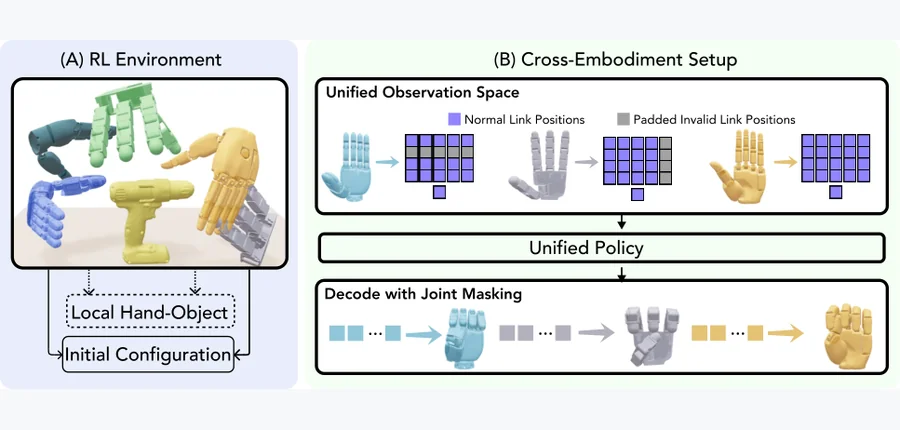 arXiv New 2026-10-06 · cs.RO · #27 **[GOTT: Object-centric Dexterous Manipulation with a Reusable Cross-Embodiment Primitive](https://arxiv.org/abs/2610.03861)** Yulin Liu, Lai Wei, Yen-Jen Wang, Akash Sharma, Pieter Abbeel, Henrik I. Christensen, Haozhi Qi 机构：Amazon FAR / UC San Diego / University of Chicago / UC Berkeley（PDF 首页） [Paper](https://arxiv.org/abs/2610.03861) · [图源](https://arxiv.org/html/2610.03861v1/rl_and_cross.png) 

中文摘要
基础模型和大规模人类数据提供了丰富的操纵意图来源，但将这种意图转化为多指机器人行为仍然很困难。灵巧的手仍然缺乏可重用的低级原语，可以可靠地建立跨任务和机器人形态的联系。我们提出了 GOTT，一个围绕单个跨机器人形态接触获取原语构建的触及-获取-移动框架。给定与机器人无关的物体轨迹和到达规范，GOTT 首先将手靠近与任务相关的接触区域。然后，共享闭环基元从该近似初始化中建立稳定的接触，并且姿势调节控制器跟踪所需的对象运动。范围规范可能来自未来感知的规划、外部模型或人类演示，而接触原语和跟踪后端保持不变。模拟和现实世界的实验表明，GOTT 能够在不同的物体、手臂-手平台以及已见和未见手形态之间建立牢固的接触。与开环抓取执行相比，它还持续提高了端到端任务的成功率。 <a href="https://arxiv.org/abs/2610.03861">原摘要来源</a>
 |
| 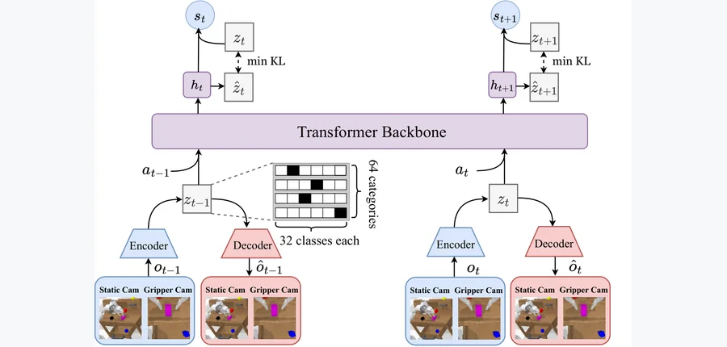 arXiv New 2026-10-06 · cs.RO · #28 **[DreamFormer: Dream Imitation with a Transformer World Model for Language-Conditioned Robotic Manipulation](https://arxiv.org/abs/2610.04540)** Mostafa Kotb, Cornelius Weber, Muhammad Burhan Hafez, Stefan Wermter 机构：University of Hamburg / Aswan University / University of Southampton（PDF 首页） [Paper](https://arxiv.org/abs/2610.04540) · [图源](https://arxiv.org/html/2610.04540v1/world_model_larger.png) 

中文摘要
我们介绍 DreamFormer，这是一种基于模型的代理，它通过在学习的世界模型的潜在想象中模仿专家演示来获得语言条件的多任务技能。 DreamFormer 首先从非结构化自由交互数据中学习与任务无关的 Transformer 世界模型，然后通过优化内在奖励来获取特定于任务的行为，该内在奖励将智能体生成的轨迹与潜在空间中的专家演示相结合。由于该策略是在想象中进行策略训练的，因此它在训练过程中会面临自己的错误，从而减轻了离线行为克隆固有的协变量变化。为了使长时想象变得可行，DreamFormer 将高分辨率多视图机器人观察编码到单个输入标记中，避免了空间下采样和先前 Transformer 世界模型使用的多标记表示。在长期 CALVIN 基准测试中，DreamFormer 在单一环境评估方面优于基于模型的智能体 LUMOS（每五个链完成的平均任务分别为 2.52 和 2.34），同时保持想象轨迹生成易于处理。与行为克隆基线 HULC 相比，它在零样本迁移到未见过的环境中的性能几乎翻了一番（1.30 vs 0.67），这表明世界模型学习到的动态比直接克隆策略更容易迁移。这与生物体中内部模型的作用是一致的，其中环境动力学模型支持以前未遇到过的情况下的行为。 <a href="https://arxiv.org/abs/2610.04540">原摘要来源</a>
 | 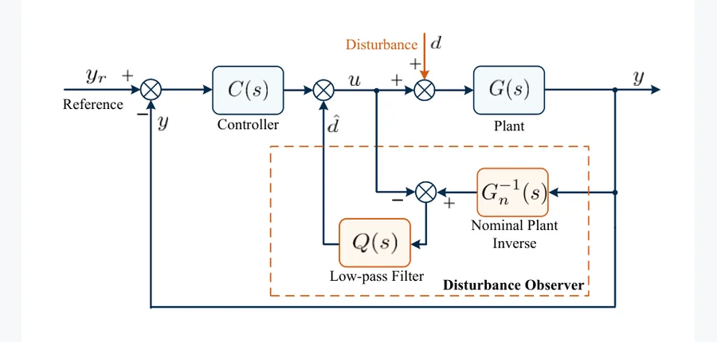 arXiv New 2026-10-06 · cs.RO · #29 **[Tackling Sim-to-Real Mismatch Through Sampling-Based Disturbance Observers: From Analytical Models to Learned World Models](https://arxiv.org/abs/2610.04896)** Tianqi Zhu, Jun Yang, Jianliang Mao, Cong Li, Shihua Li 机构：Southeast University（PDF 首页） [Paper](https://arxiv.org/abs/2610.04896) · [图源](https://arxiv.org/html/2610.04896v1/traditional_dob.png) 

中文摘要
机器人控制器越来越依赖分析模型、仿真器、成本查询接口和学习世界模型。然而，物理部署可能会偏离名义假设，即使模型本身是准确的，也可能会出现额外的干扰。在控制系统中，扰动观测器 (DOB) 被广泛用于根据标称模型和测量反馈来估计此类未测量的影响。经典的 DOB 公式通常是围绕显式受控对象模型构建的。本文开发了基于采样的扰动观测器（SDOB），通过状态推出或成本查询接口将 DOB 原理扩展到更广泛的模型，包括仿真器和学习世界模型。 SDOB 分离了两个可观察的通道：状态效应干扰（反馈状态与其预测不同）和成本干扰（随着感知环境的变化，相同的查询状态会收到不同的成本）。跨传统模型和学习模型的各种仿真和真实机器人实验证明了 SDOB 在补偿模拟与真实不匹配和提高控制性能方面的有效性。 <a href="https://arxiv.org/abs/2610.04896">原摘要来源</a>
 | 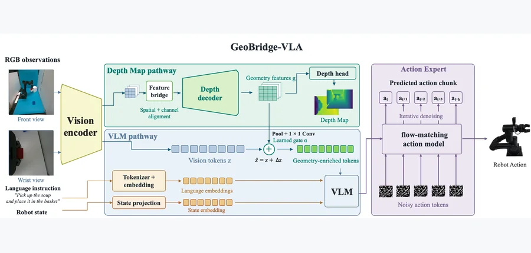 arXiv New 2026-10-06 · cs.CV · #30 **[GeoBridge-VLA: Geometry-Aware Residual Adaptation for Vision-Language-Action Models](https://arxiv.org/abs/2610.05026)** Hyun Song, Kangmin Kim, Loren Jinsoo Um, Minhui Han, Jaehyeok Park, Taewan Cho, Andrew Jaeyong Choi 机构：Gachon University（PDF 首页） [Paper](https://arxiv.org/abs/2610.05026) · [图源](https://arxiv.org/html/2610.05026v1/figures/main.png) 

中文摘要
视觉-语言-动作（VLA）模型对来自视觉-语言预训练的语义信息进行编码，但操作也需要精确的空间推理。我们提出了 GeoBridge-VLA，这是一种两阶段方法，用于从预训练的 VLA 的冻结视觉编码器中学习几何特征并将其用于动作预测。第一阶段训练具有深度监督的特征桥和几何解码器。第二阶段冻结这些模块，并与动作侧预测和动作专家一起训练门控残差接口。残差增强了现有的视觉标记，而无需添加第二个图像编码器或增加token 数量。部署需要 RGB、机器人状态和语言，但不需要深度观察。在匹配的评估条件下，GeoBridge-VLA 在 LIBERO 上取得了 70.9% 的成功率，而 SmolVLA 的成功率为 60.0%。在同一经过训练的检查点中禁用残差会将成功率从 70.90% 降低到 69.85%，并且跨套件的效果参差不齐。在物理 ROBOTIS OMY 机器人上，GeoBridge-VLA 在四项任务的 200 次试验中成功完成了 148 次（74.0%），而 SmolVLA 在 200 次试验中成功 108 次（54.0%）。 <a href="https://arxiv.org/abs/2610.05026">原摘要来源</a>
 |
| 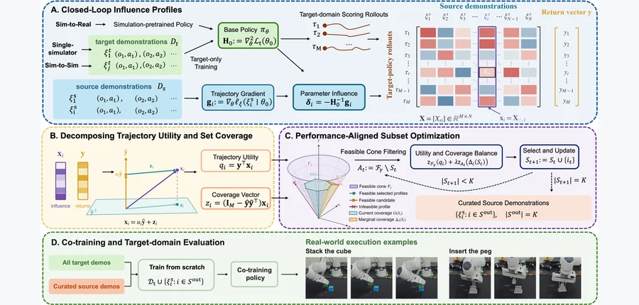 arXiv New 2026-10-06 · cs.RO · #31 **[TUCO: Curating Simulation Demonstrations for Sim-to-Real Robot Policy Co-Training](https://arxiv.org/abs/2610.05407)** Ning Zhu, Mengfei Zhao, Yikai Tang, Zhangyujie Sun, Peihao Li, Dongyue Ni, Jindou Jia, Jianfei Yang 机构：Stanford University / Nanyang Technological University / AXIS Robotics / Carnegie Mellon University / Fudan University / UC Berkeley / Shanghai Jiao Tong University（PDF 首页） [Paper](https://arxiv.org/abs/2610.05407) · [图源](https://arxiv.org/html/2610.05407v1/figures/main_revise.png) 

中文摘要
模拟演示可以补充机器人策略协同训练的稀缺现实数据。然而，使用数据筛选来主动选择这些演示进行仿真到真实的协同训练的价值仍未得到充分探索。现有的管理方法还缺乏衡量闭环目标行为的轨迹级效用和集合级覆盖的统一标准。为了解决这些差距，我们首次系统地研究了仿真到真实机器人策略协同训练的数据筛选，并提出了轨迹级效用和集合级覆盖优化（TUCO）。 TUCO 使用影响函数来跟踪每个源演示如何影响目标域评分的推出。我们的主要见解是，这些影响可以分解为对目标回报和部署过程中的变化的总体贡献，为测量轨迹效用和集合覆盖范围提供通用的闭环基础。我们进一步提出了一种与性能一致的子集优化器，它将这些措施结合在一个统一的筛选目标中，以减少冗余并选择互补的演示。 RoboMimic 和 OmniReset 上的大量实验确立了主动模拟数据筛选对于仿真到真实策略协同训练的价值，并表明 TUCO 在单个仿真器、模拟到模拟和仿真到真实设置中实现了最先进的性能。 <a href="https://arxiv.org/abs/2610.05407">原摘要来源</a>
 | 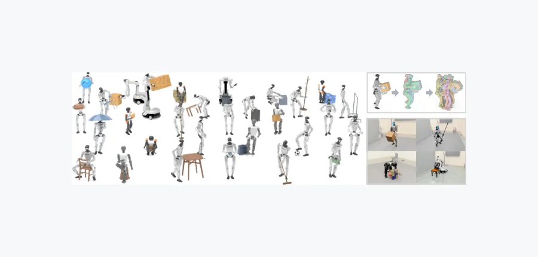 arXiv New 2026-10-06 · cs.RO · #32 **[InterMimicGen: Scaling Humanoid Loco-Manipulation through Self-Evolving Motion Imitation](https://arxiv.org/abs/2610.06850)** Yucheng Zhang, Sirui Xu, Jinhong Li, Liuyu Bian, Anatulya Nandi, Derek Zhang, Xiangchen Liu, Xueting Li, Umar Iqbal, Yu-Xi… 机构：University of Illinois Urbana-Champaign / NVIDIA（PDF 首页） [Paper](https://arxiv.org/abs/2610.06850) · [图源](https://arxiv.org/html/2610.06850v1/teaser_full_scene.png) 

中文摘要
捕获的人与物体的交互为人形机器人移动操作提供了丰富的监督，但它们是稀疏的、异构的，并且不能由机器人直接执行。我们介绍了 InterMimicGen，这是一种自我进化的运动模仿框架，其中机器人运动数据和跟踪策略可以相互改进。首先，我们整合运动捕捉的人与物体交互数据集，并将它们重新定位为人形机器人参考，同时保留全身协调性和灵巧的手与物体关系。这产生了一个庞大且多样化的人形机器人参考集合，用于灵巧的全身局部操作。其次，我们训练一个基于物理的多面手跟踪器，该跟踪器在具有灵巧双手的人形机器人上模拟执行这些参考，其范围和多样性超出了先前用于移动操作的人形跟踪系统。第三，我们关闭数据飞轮：每一轮都会对交互发生的位置以及身体如何执行交互进行小的、保留任务的更改，微调它们上的跟踪器，并仅保留其模拟执行完成任务的变体，这些变体为下一轮提供种子。通过更多的迭代，这些小的编辑可以在稀疏的原始演示周围复合成更广泛的覆盖范围，同时保留任务语义和运动质量。实验表明，跨机器人配置的保持接触的重定向、使用单一通用策略的广泛跟踪、在增强回合中不断增长的可执行动作以及转移到真实的机器人。 InterMimicGen 提供了一条从异构人类演示到不断扩展的人形机器人学习的运动资源的统一路径。 <a href="https://arxiv.org/abs/2610.06850">原摘要来源</a>
 | 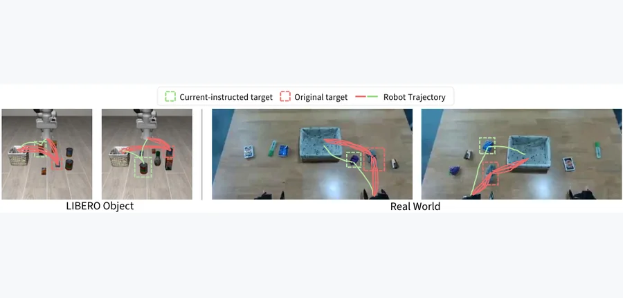 arXiv New 2026-10-06 · cs.RO · #33 **[Encoded but Not in Control: Revealing the Grounding Gap in Vision-Language Robot Policies](https://arxiv.org/abs/2610.06235)** Shaohan Jiang, Jiahang Cao, Qiduo He, Fengting Deng, Kun Wu, Jingkai Sun, Jiaxu Wang, Qiang Zhang, Qihao Zheng, Chunfeng S… 机构：HKU / Shanghai AI Lab / CUHK(SZ) / Horizon Robotics / CUHK / USTC（PDF 首页） [Paper](https://arxiv.org/abs/2610.06235) · [图源](https://arxiv.org/html/2610.06235v1/fig1.png) 

中文摘要
指令遵循是语言条件机器人策略的核心：当同一场景允许多个有效动作时，语言应该确定要做什么。然而，仅成功执行并不能确定策略是否遵循指令或从场景推断任务。我们通过场景保留指令干预来研究这种歧义，在保持场景固定的情况下使用有效的目标替换、任意名词和不相关的句子。我们在模拟和现实实验中评估视觉-语言-行动（VLA）策略和世界行动模型（WAM）。我们的分析解决了三个问题：(a) 任务成功是否意味着遵循指令？当指令请求不同的可见对象时，所有评估的策略主要接近并拾取与场景关联的不正确的原始目标。 (b) 此失败是否是由于语言不敏感造成的？指令扰动会影响任务性能。逐层动作探针显示了对这些扰动做出响应的中间动作预测。线性探针可以准确地恢复指示的目标，这表明尽管很少确定目标选择，但已对修改的指令进行了编码。 (c) 为什么编码语言无法控制动作？注意力分析表明指令标记对动作生成的贡献较弱。目标标记注意力可以保持集中在原始对象上，揭示目标编码和视觉基础之间的不匹配。 UMAP 和共享非负矩阵分解表明，目标信息在越来越多地按场景身份组织的表示中仍然可以访问。我们的研究结果揭示了名义上的成功所掩盖的指令落地差距，并提供了一个诊断框架。他们进一步建立了具体的进展标准：策略应该可靠地遵循用户意图的有效变化，即使它们与场景偏好的行为发生冲突。 <a href="https://arxiv.org/abs/2610.06235">原摘要来源</a>
 |
| 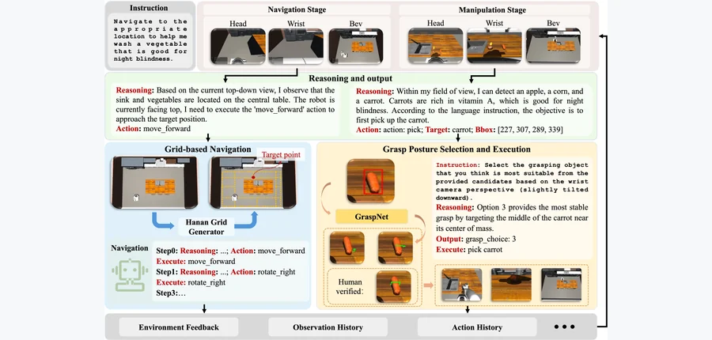 arXiv New 2026-10-06 · cs.RO · #34 **[RMMBench: A Comprehensive Benchmark for Robotic Mobile Manipulation](https://arxiv.org/abs/2610.05414)** Huapeng Li, Fuxiang Feng, Jinqiu Fan, Shuo Yang, Fengjiao Chen, Xuezhi Cao, Ran Song, Wei Zhang 机构：Shandong University / Meituan（PDF 首页） [Paper](https://arxiv.org/abs/2610.05414) · [Code](https://github.com/mxxq-stack/RMMBench) · [Project](https://mxxq-stack.github.io/rmmbench-project/) · [图源](https://arxiv.org/pdf/2610.05414) 

中文摘要
尽管视觉语言模型 (VLM) 的进步赋予机器人增强的环境理解和任务推理能力，但综合评估方法对于推进 VLM 在机器人导航和操作中的集成非常重要。然而，目前的基准测试缺乏评估不同机器人任务的综合方法，评估指标仍然相对有限，因此很难全面、细粒度地评估 VLM 的具体能力。为了解决这个问题，我们提出了 RMMBench，这是一个评估基准，要求机器人理解语言指令并在连续空间中执行长视野任务。 RMMBench 将高层和低层的具体任务无缝集成到一个统一的框架中，构建了一个“导航-操纵”任务套件，其中包含 70 个规范的任务场景，范围从移动操作到长视野复合导航。结果表明，领先的VLM在执行移动操纵任务时仍然面临空间定位的重大挑战，也凸显了增强机器人在长时交互过程中的空间感知能力的必要性。 RMMBench 可以通过 https://mxxq-stack.github.io/rmmbench-project/ 访问 <a href="https://arxiv.org/abs/2610.05414">原摘要来源</a>
 | 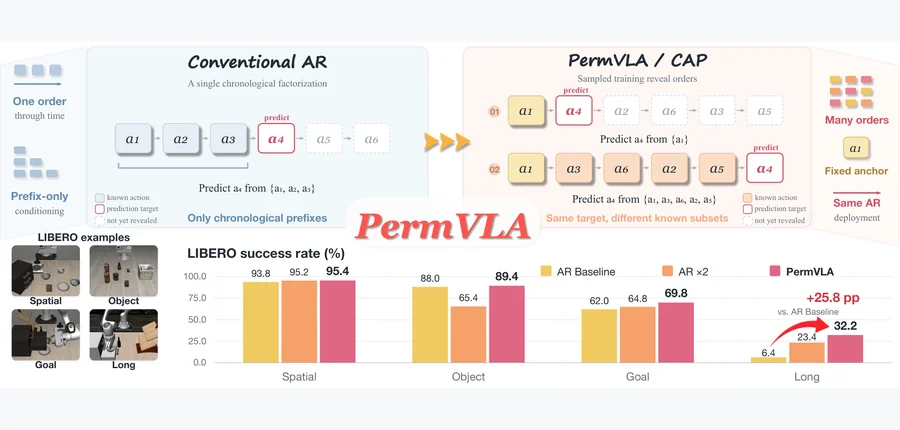 arXiv New 2026-10-06 · cs.AI · #35 **[PermVLA: Factorization Order as a Regularizer for VLA Learning](https://arxiv.org/abs/2610.04659)** Yanqiao Chen, Yuhan Rui, Dongsheng Hou, Zijie Nie, Yutong Wan, Qi Hao 机构：Southern University of Science and Technology / Huazhong University of Science and Technology（PDF 首页） [Paper](https://arxiv.org/abs/2610.04659) · [图源](https://arxiv.org/html/2610.04659v1/permvla-teaser.png) 

中文摘要
视觉语言动作（VLA）策略通常通过固定的从左到右（LTR）分解来学习动作块，尽管相同的专家轨迹分布允许许多有效的链规则分解。我们将因式分解顺序视为被忽视的正则化选择，并引入因果锚定排列（CAP），以可调的时间顺序前缀采样动作揭示顺序。其辅助目标训练一种共享策略来预测来自同一专家块的不同已知子集的操作，同时部署保留确定性 LTR 控制。我们称之为条件集增强：它从一个专家块创建多个条件预测问题，而无需添加演示。这阻止了对普通教师强制使用的单一时间前缀的依赖。对照实验表明，CAP 在 LIBERO 和 LIBERO-Plus 上的表现始终优于标准 LTR 训练，在跨数据集 CALVIN 评估中也具有相同的优势。测量两个揭示顺序下块的联合对数似然之间的预期平方差的诊断验证了 CAP 训练内化了揭示顺序之间的一致性。这些发现将采样的子集条件辅助目标定位为构建 VLA 正则化器的一般方法，通过扩散动作生成器的扩展来说明。 <a href="https://arxiv.org/abs/2610.04659">原摘要来源</a>
 | 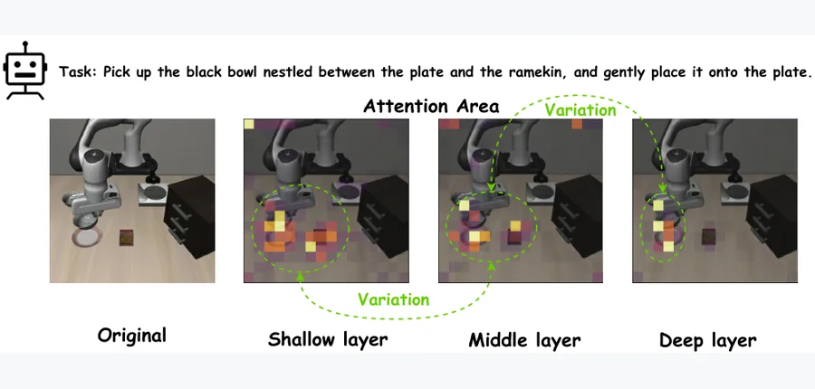 arXiv New 2026-10-06 · cs.CV · #36 **[When and What to Prune? Stage-Aware Visual Token Pruning for Efficient VLA](https://arxiv.org/abs/2610.05273)** Tianjun Shi, Haotian Xiong, Ziyu Gong, Qi Lu, Li Li 机构：University of Macau（PDF 首页） [Paper](https://arxiv.org/abs/2610.05273) · [图源](https://arxiv.org/html/2610.05273v1/FIG1.png) 

中文摘要
视觉token 剪枝是加速视觉语言模型的有效方法，对于视觉语言动作（VLA）推理特别有用，在预测机器人动作之前必须处理许多视觉标记。现有的修剪方法通常根据注意力分数或特征多样性来估计哪些token可以被修剪，保留高度关注或与其他token视觉上不同的token。然而，它们大多数使用固定的剪枝方案，例如在预设层剪枝一次或在均匀间隔的层剪枝。这样的时间表对于 VLA 模型来说可能存在风险，因为模型可能不知道哪些视觉区域对于早期层的动作很重要。在模型将视觉观察与语言指令结合起来之后，起初看起来不重要的标记可能会变得有用。在这项工作中，我们提出了 SAPrune，一种用于高效 VLA 推理的免训练视觉token 剪枝框架。 SAPrune 不是在固定层进行剪枝，而是使用一个小的校准集来观察动作到视觉注意力如何跨层变化，并且仅在注意力模式变得更加可靠后才选择剪枝层。在每个选定的层，SAPrune 应用双路径修剪规则：一条路径保护强烈关注的视觉标记免遭修剪，而另一条路径则防止丢弃有用的周围上下文。对 LIBERO、SIMPLER 和现实世界机器人任务的实验表明，SAPrune 修剪了 87.5% 的视觉标记，实现了高达 1.718 倍的推理加速，同时保持了具有竞争力的任务成功率。 <a href="https://arxiv.org/abs/2610.05273">原摘要来源</a>
 |
| 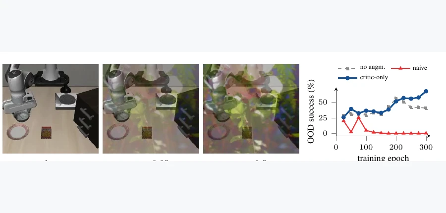 NeurIPS 2026 RoboPAD Workshop · #37 **[How (and How Not) to Use Data Augmentation in VLA Post-Training](https://arxiv.org/abs/2610.05994)** Bram Grooten, Joaquin Vanschoren 机构：TU Eindhoven（PDF 首页） [Paper](https://arxiv.org/abs/2610.05994) · [图源](https://arxiv.org/pdf/2610.05994) 

中文摘要
视觉-语言-动作（VLA）模型目前在各种现实世界的机器人任务中表现出了强大的性能。然而，它们通常仍然缺乏处理大的视觉分布外变化的泛化能力。经过强化学习 (RL) 的 VLA 后训练已被证明可以提高鲁棒性，但仍有很大的改进空间。在这项工作中，我们系统地研究了图像增强对 VLA 后训练的影响。我们发现，在强化学习更新期间仅增强价值评估器（critic）模块，同时在推出和更新期间保持动作策略（actor）的输入干净是至关重要的。对于 $\pi_{0.5}$ 和 GR00T N1.5，这将 LIBERO-Plus 上的分布外成功率分别提高了 $7.8$ 和 $10.0$ 点，同时增强了 actor 的训练完全崩溃。我们研究了一系列增强类型和优势，并提供了提高 VLA 训练后泛化能力的实用建议。 <a href="https://arxiv.org/abs/2610.05994">原摘要来源</a>
 | 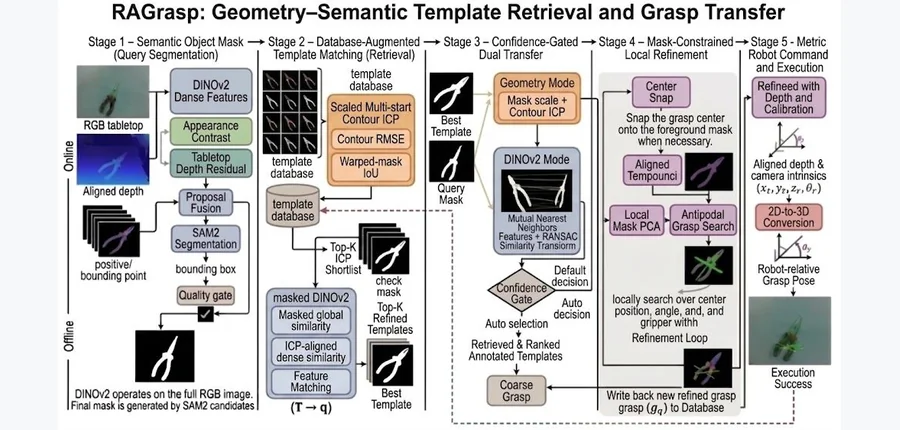 arXiv New 2026-10-06 · cs.AI · #38 **[RAGrasp: Geometry-Semantic Template Retrieval and Grasp Transfer](https://arxiv.org/abs/2610.04438)** Shenzhe Zhu, Chengxiao He, Jan Harder 机构：Tongji University（PDF 首页） [Paper](https://arxiv.org/abs/2610.04438) · [图源](https://arxiv.org/html/2610.04438v1/figures/ragrasp_main_phase.png) 

中文摘要
我们提出了 RAGrasp，这是一种检索增强管道，用于从一组紧凑的本地收集、抓取注释的 RGB-D（颜色和深度）模板中进行平面平行夹爪抓取。与主要在大型公共或合成抓取数据集上训练的特定任务预测器不同，RAGrasp 不需要对新部署进行端到端重新训练。它的模板库是根据目标工作空间中的部署相机、机器人和夹具收集的观察结果构建的，从而将存储的示例与本地传感和实施条件对齐。该系统使用自我监督的 DINOv2 视觉特征以及外观和深度提示来提示Segment Anything Model 2 (SAM2)，从而隔离查询对象。然后，两阶段几何语义检索级联选择一个模板，置信门选择两个抓取迁移估计器之一。在校准 2D 到 3D 转换之前，使用掩模支撑和轮廓接触约束来细化转移的抓握。在现实世界的试验中，RAGrasp 在看到的物体上实现了 20/20 的成功抓取，在看不见的物体上实现了 19/20 的成功抓取。在评估的设置中，结果证明了特定于部署的抓取适应从有限的本地注释和对测试视点和照明变化的容忍度。 <a href="https://arxiv.org/abs/2610.04438">原摘要来源</a>
 | 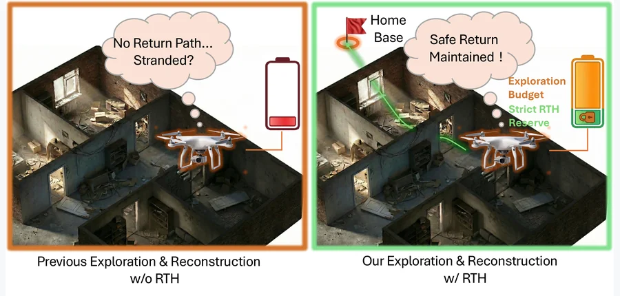 arXiv New 2026-10-06 · cs.RO · #39 **[Return-to-Home Feasible Micro-Aerial Vehicle Exploration for 3D Gaussian Splatting Reconstruction](https://arxiv.org/abs/2610.04013)** Prajit Krisshnakumar, Fan Yang, Koichiro Niinuma 机构：affiliation 未确认 [Paper](https://arxiv.org/abs/2610.04013) · [图源](https://arxiv.org/html/2610.04013v1/drone_demo.png) 

中文摘要
微型飞行器 (MAV) 能够快速进行室内 3D 重建，以进行检查和时间关键的态势感知，但必须在严格的飞行时间预算和安全限制下运行，这些限制需要明确的返航 (RTH) 可行性和保守的余量。我们提出了一个拓扑优先的主动重建框架，它将高保真渲染与导航分离。密集的 3D 高斯泼溅 (3DGS) 地图被优化为重建目标，而轻量级截断符号距离场 (TSDF)/占用支架支持保守的碰撞检查和稀疏 3D Voronoi 骨架路线图的在线构建。由于直接从 TSDF 几何体中提取路线图在噪声和不完整的在线融合下可能不稳定，因此我们使用雕刻的自由空间一致性和密集可见性检查来验证节点和边缘，从而抑制墙后幻影结构并稳定规划。使用飞行时间预算感知目标和轻量级滚动时域前瞻在路线图上选择视点，以改善非短视的探索行为。我们对逼真的室内模拟基准（ReplicaCAD、Gibson 和 HM3D）进行评估，报告重建覆盖率/错误、RTH 成功和计算成本。结果表明，在相同的飞行时间预算下，相对于最近基于 GS 的基线，性能得到改善或具有竞争力。 <a href="https://arxiv.org/abs/2610.04013">原摘要来源</a>
 |
| 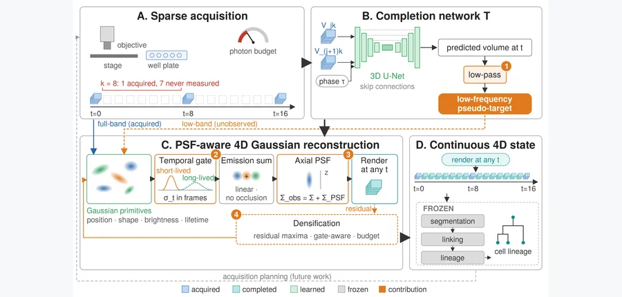 arXiv New 2026-10-06 · cs.CV · #40 **[CellSplat4D: PSF-Aware 4D Gaussian Splatting for Sparse Robotic Live-Cell Imaging](https://arxiv.org/abs/2610.04199)** Yingda Tao, Guoyu Lu 机构：Indiana University Bloomington（PDF 首页） [Paper](https://arxiv.org/abs/2610.04199) · [图源](https://arxiv.org/html/2610.04199v1/image/pipeline_orange.png) 

中文摘要
机器人显微镜观察活细胞时，每次采集三维体数据都会消耗光照剂量和其他样本孔可用的时间；稀疏采样又会破坏跨时间的细胞身份和分裂谱系记录。作者通过对已采集体数据拟合连续时间的 4D 高斯模型来重建缺失时刻。每个发光高斯携带位置、形状和以帧数计的寿命，因此可按需渲染未采集的体数据，并将分析频率与采集频率解耦。显微镜点扩散函数从数据测得，而非沿用采集元数据或交由优化器估计；元数据会高估它，优化器则无法区分较小光斑与较宽模糊。对未采集时刻，3D U-Net 在粗尺度直接预测中间体数据作为监督，不估计运动场，因为细胞一分为二无法由单一运动描述。在 Cell Tracking Challenge 的秀丽隐杆线虫胚胎与中国仓鼠卵巢（CHO）两个序列上，以单个细胞核为单位评估时，该方法在距已采集帧的各个间隔上取得最高的细胞核保真度，随间隔增大下降最缓，并能较好恢复未见过的焦平面。 <a href="https://arxiv.org/abs/2610.04199">原摘要来源</a>
 | 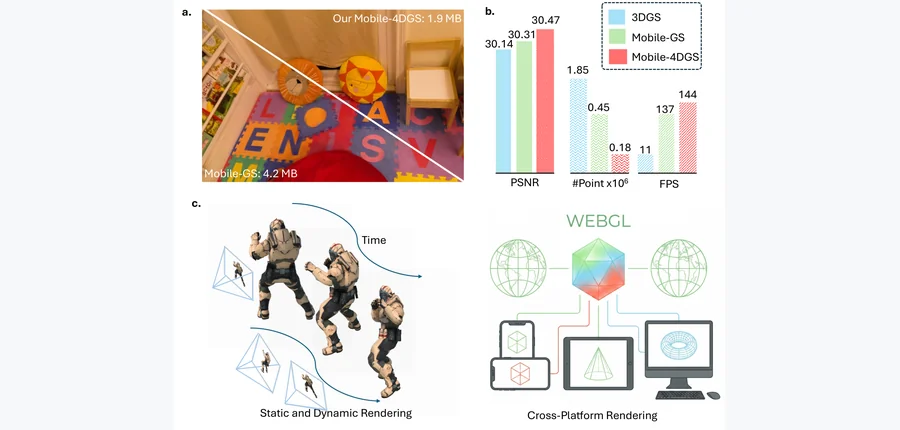 arXiv New 2026-10-06 · cs.CV · #41 **[Mobile-4DGS: Unified Static-Dynamic Real-time Mobile Gaussian Splatting](https://arxiv.org/abs/2610.05289)** Xiaobiao Du, Beixi Hao, Zhen Fang, Tianqing Zhu, Richard Hartley, Xin Yu 机构：University of Technology Sydney / Yale University / City University of Macau / Australian National University / Adelaide University（PDF 首页） [Paper](https://arxiv.org/abs/2610.05289) · [Code](https://github.com/xiaobiaodu/mobile-4dgs) · [Project](https://xiaobiaodu.github.io/mobile-4dgs-project/) · [图源](https://arxiv.org/html/2610.05289v1/teaser.png) 

中文摘要
3D 高斯分布 (3DGS) 的最新进展在新颖的视图合成中取得了显着的性能，但由于大量存储、冗余基元和昂贵的每帧计算，在资源受限的移动设备上部署静态和动态高斯表示仍然具有挑战性。我们推出 Mobile-4DGS，这是一个统一的轻量级框架，用于在移动平台上进行高保真实时静态和动态高斯渲染。对于紧凑的外观建模，我们引入了蒙特卡罗镜面能量聚合器，将高阶辐射残差压缩为一阶球面谐波（SH），以及属性条件 SH 增强模块，其预测偏移在推理之前预先烘焙。我们进一步提出了一种基于多视图 Alpha 的致密化和修剪策略，以抑制冗余图元，同时保持多视图一致性。对于动态场景，我们通过构建二阶高斯运动、可学习的时间支持和二进制静态-动态分区来开发紧凑的显式 4D 表示，从而无需运行时变形网络即可进行连续时间建模。基于此分区，深度顺序证书有选择地重用先前提交的深度顺序，以减少回放期间的重新投影、排序、合并和索引缓冲区更新。对静态和动态场景的大量实验表明，Mobile-4DGS 大大降低了存储和渲染开销，同时保持有竞争力的视觉质量，从而在移动设备上实现实时 3D 和 4D 高斯泼溅。 代码已发布：https://xiaobiaodu.github.io/mobile-4dgs-project/（https://xiaobiaodu.github.io/mobile-4dgs-project/）。 <a href="https://arxiv.org/abs/2610.05289">原摘要来源</a>
 | 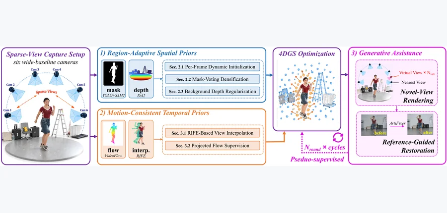 arXiv New 2026-10-06 · cs.CV · #42 **[Sparse-View 4D Gaussian Splatting via Spatiotemporal Priors and Generative Assistance](https://arxiv.org/abs/2610.04606)** Shengqi Wang, Zhengxian Yang, Kaiwen Tian, Yang Liu, Bowen Liu, Hua Du, Taicheng Huang, Jiamin Wu, Tao Yu 机构：Tsinghua University（PDF 首页） [Paper](https://arxiv.org/abs/2610.04606) · [图源](https://arxiv.org/html/2610.04606v1/pipeline.png) 

中文摘要
我们为 SIGGRAPH Asia 2026 体积视频挑战赛的稀疏视图赛道提出了一个 4D 高斯泼溅框架，该框架仅需要六个具有宽基线的摄像机进行动态场景重建。为了在这种稀疏视图下实现鲁棒的动态重建，我们的框架集成了三个组件。 （1）区域自适应空间先验：我们使用前景掩模来指导高斯初始化和掩模投票来分别控制动态前景和静态背景的致密化。使用与公制比例对齐的单眼深度来规范背景几何形状。 (2) 运动一致的时间先验：我们通过帧插值在中间时间提供监督，并用估计的光流约束投影高斯运动。 (3) 生成辅助：我们将虚拟相机放置在最宽的角度间隙中，并使用基于相机姿势的基于扩散的模型来恢复其渲染图像。恢复的图像作为伪监督迭代地纳入训练中。在验证集上，我们的框架将全帧 PSNR 从基线的 25.60 dB 提高到 29.75 dB。在官方测试基准上，其全帧PSNR达到30.04dB，前景PSNR达到27.88dB，在Sparse-View Track中整体排名第一。 <a href="https://arxiv.org/abs/2610.04606">原摘要来源</a>
 |
| 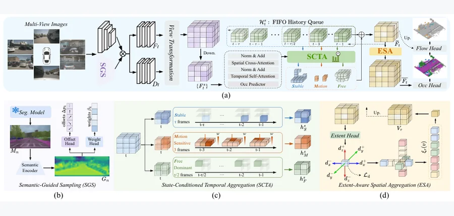 arXiv New 2026-10-06 · cs.CV · #43 **[SelectOccFlow: Selective Spatiotemporal Aggregation for 3D Occupancy and Scene Flow Prediction](https://arxiv.org/abs/2610.04356)** Yuhang Wang, Kai Luo, Yuanfan Zheng, Kailun Yang 机构：Hunan University（PDF 首页） [Paper](https://arxiv.org/abs/2610.04356) · [Project](https://github.com/muchen1021/SelectOccFlow) · [图源](https://arxiv.org/html/2610.04356v1/fig2.png) 

中文摘要
自动驾驶的全面 3D 场景理解需要对几何、语义和运动进行建模。然而，基于相机的占用和场景流预测对不可靠的空间和时间聚合很敏感，这是由语义不兼容的图像特征、错位的历史观察和不完整的体素结构引起的。为了解决这个问题，我们提出了 SelectOccFlow，一种选择性时空聚合框架，可逐步细化跨图像、时间和体素域的上下文证据。为了获得语义兼容的图像证据，我们设计了语义引导采样（SGS）来利用语义先验来调节特征采样。由于仅靠可靠的图像证据无法解决时间不一致问题，因此我们提出了状态条件时间聚合（SCTA），以根据体素状态选择性地检索历史证据。为了进一步增强体素表示的结构完整性，我们引入了范围感知空间聚合（ESA），它利用定向结构支持来细化前景几何形状。 OpenOcc 上的实验表明，SelectOccFlow 达到了 44.9 的最先进 OccScore，比之前的最佳成绩提高了 4.2%。它还在 Occ3D-nus 上保持有竞争力的占用性能，并将 nuScenes-C 扰动下的平均 OccScore 提高了 +11.1%，这表明对视觉损坏的鲁棒性有所提高。源代码将在 https://github.com/muchen1021/SelectOccFlow 公开发布。 <a href="https://arxiv.org/abs/2610.04356">原摘要来源</a>
 | 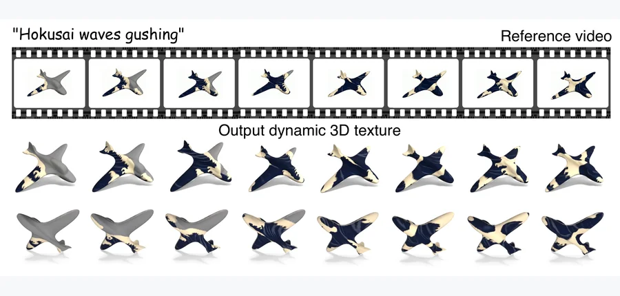 arXiv New 2026-10-06 · cs.CV · #44 **[DynaMesh: Dynamic 3D Texture Generation](https://arxiv.org/abs/2610.05529)** Raj Hansini, Guan Chen, Rana Hanocka, Itai Lang 机构：University of Chicago（PDF 首页） [Paper](https://arxiv.org/abs/2610.05529) · [Code](https://github.com/threedle/dynamesh) · [Project](https://threedle.github.io/dynamesh/) · [图源](https://arxiv.org/html/2610.05529v1/dynamesh_teaser.png) 

中文摘要
我们提出了 DynaMesh，一种 3D 网格的动态纹理生成方法。给定无纹理的形状和描述效果的文本提示，我们的方法会产生一种不断变化的外观，而对象的几何形状保持不变。以前有关动态 3D 内容生成的工作主要集中在运动上，即对象的几何形状和位置发生变化，同时保持其外观不变。纹理生成方法位于问题的另一面，将外观绘制到形状上作为固定的表面属性，而不是作为一个不断发展的过程。两者都没有解决在 3D 对象上传播的视觉效果。自然路线由两个生成器组成：一个显示单个视图效果的视频模型，以及一个将每个帧提升为 3D 的图像到 3D 生成器。然而，后者没有时间概念，因此每个视频帧运行它会产生一个闪烁的序列，丢失效果细节，并在每个视频帧产生不同的网格。我们的方法通过在网格渲染上调节视频模型并提示获取参考视频，然后在视频上运行冻结图像到 3D 生成器并进行两次更改来解决这些故障。每个帧的调节在时间窗口上混合，并且低秩适配器适合每个形状以恢复丢失的细节。网格在整个序列中编码一次，因此几何结构在构造上是恒定的，并且输出是每帧具有纹理的单个网格。 DynaMesh 应用于各种对象和效果，比最近的视频转 4D 和纹理方法有了显着改进，并且可以将其时间效果推广到训练期间从未见过的不同形状。我们的项目页面位于 https://threedle.github.io/dynamesh/。 <a href="https://arxiv.org/abs/2610.05529">原摘要来源</a>
 | 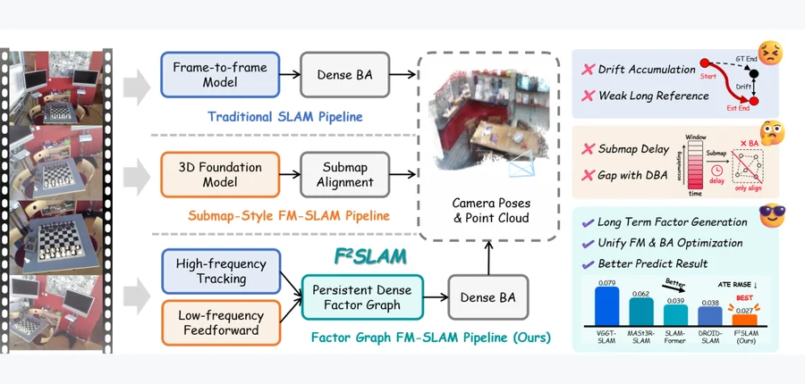 arXiv New 2026-10-06 · cs.CV · #45 **[F$^2$ SLAM: Turning Feed-Forward Geometry into Persistent Factors for SLAM](https://arxiv.org/abs/2610.05207)** Zhisong Xu, Fan Zhu, Jiawei Qian, Ziyu Chen, Zhenjun Zhao, Javier Civera 机构：University of Tokyo / Tohoku University / USTC / University of Zaragoza（PDF 首页） [Paper](https://arxiv.org/abs/2610.05207) · [图源](https://arxiv.org/html/2610.05207v1/intro.png) 

中文摘要
前馈 3D 模型提供强大的多视图几何先验，而在线同步定位和建图 (SLAM) 主要依赖于局部测量，并且可以在长序列上累积漂移。现有的将两者结合起来的尝试通常将前馈预测视为外部几何状态，该状态与事后在线估计对齐或融合，从而将更广泛的多视图证据保留在优化器之外，从而细化 SLAM 状态。我们提出了 F2SLAM，它将前馈几何直接转换为附加到持久密集因子图的优化器原生目标权重测量。高频流保持本地跟踪约束和图形连接性，而低频流使用更广泛的多视图上下文在状态一致性检查后有选择地刷新现有测量。两个流通过单个密集束调整约束相同的姿势、逆深度和可选的相机内在特性。多个基准的实验表明，在校准和未校准的设置中，轨迹估计始终强大，并且密集重建得到了改进。值得注意的是，未校准的配置将 Replica 数据集上的平均 ATE RMSE 从最强前馈基线的 0.030 m 降低到 0.002 m。 <a href="https://arxiv.org/abs/2610.05207">原摘要来源</a>
 |
| 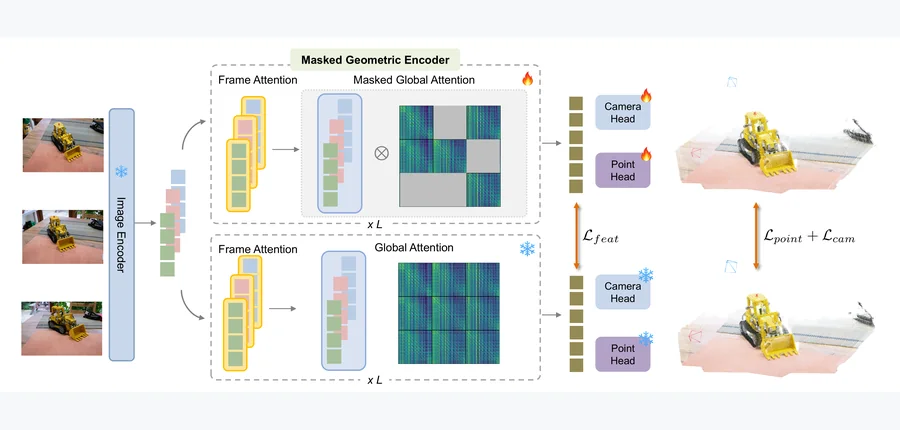 arXiv New 2026-10-06 · cs.CV · #46 **[Less Context, Better Geometry: Masked Geometric Encoder for Robust 3D Foundation Models](https://arxiv.org/abs/2610.06813)** Zhimin Shao, Xijun Liu, Zhaoliang Zhang, Yutao Tang, Abhay Yadav, Rama Chellappa, Cheng Peng 机构：Johns Hopkins University / University of Virginia（PDF 首页） [Paper](https://arxiv.org/abs/2610.06813) · [图源](https://arxiv.org/html/2610.06813v1/figs/architecture.png) 

中文摘要
3D 基础模型的最新进展通过利用从大量空间数据中学习到的 3D 先验知识，实现了快速 3D 重建和相机校准。然而，all-to-all全局注意力设计导致二次复杂度并限制了长序列推理；不受约束的跨视图交互还可能从被遮挡或视觉上相似但几何上遥远的视图传播不可靠的证据。在本文中，我们介绍了一种掩码几何编码器（MGE），它促进了不完整的跨视图上下文下鲁棒几何表示的学习。在训练过程中，MGE 策略性地从全局注意力中删除帧 token，并从预训练的全上下文教师模型蒸馏知识。这使得模型能够学习本质上更丰富的每帧表示，同时提供足够的中间监督以避免性能下降。通过大量的实验，我们表明 MGE 在遮挡和外观相似但几何位置不同的视图下具有更强的性能，同时在标准基准上保持高性能。这种更丰富的帧表示还可以在推理过程中更有效地减少标记。为此，我们开发了一种新颖的锚引导自适应标记合并技术，该技术保留代表性锚帧，同时联合合并来自剩余视图的冗余标记。与其他有效的推理方法相比，我们可以实现推理加速，同时始终保持更高的重建质量，特别是在有限视图设置中。 <a href="https://arxiv.org/abs/2610.06813">原摘要来源</a>
 | 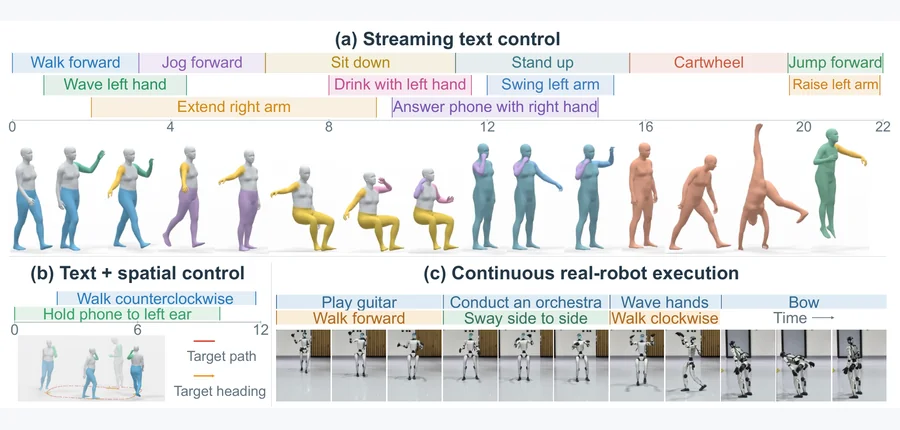 arXiv New 2026-10-06 · cs.CV · #47 **[Streaming Multi-Track Timeline Control for 3D Human Motion Generation](https://arxiv.org/abs/2610.03873)** Yangsong Zhang, Anujith Muraleedharan, Rikhat Akizhanov, Gül Varol, Fabio Pizzati, Ivan Laptev 机构：MBZUAI / École des Ponts / IP Paris / Université Gustave Eiffel / CNRS（PDF 首页） [Paper](https://arxiv.org/abs/2610.03873) · [图源](https://arxiv.org/html/2610.03873v1/teaser_timeline_extended_v2.png) 

中文摘要
文本驱动的人体动作生成已经取得了长足的进步，但大多数方法都假设指令在合成之前可用。交互式应用程序需要在继续正在进行的操作的同时响应新指令，例如边走边接电话。现有方法解决流生成或同时组合的问题，而没有明确地将流指令到达与独立定时的重叠动作相结合。我们引入流式多轨时间线控制，并建议 TimelineControl 将新指令与正在进行的操作结合起来。间隔感知调节保留了指令时序，而因果部分结构表示和部分感知去噪则协调跨身体区域的并发动作。我们还构建了 TimelineMotion，一个具有重叠指令间隔和身体部位注释的数据集。 TimelineMotion 和 MTT 的实验表明，与评估的流基线相比，语义对齐和时间一致性得到了改善，包括在相同数据上重新训练的模型。消融和人类评估验证了我们的设计，并辅以空间条件和人形执行演示。我们的代码、数据和模型将公开。 <a href="https://arxiv.org/abs/2610.03873">原摘要来源</a>
 |   |
<!-- PAPER_CARDS_END -->

## 检索概况

- **检索窗口**：北京时间 2026-10-07 09:00 起核查 arXiv 官方 `New submissions`；官方列表批次为 **Tuesday, 6 October 2026**。
- **官方分类**：[`cs`](https://arxiv.org/list/cs/new?show=2000)、[`physics`](https://arxiv.org/list/physics/new?show=2000)、[`cond-mat`](https://arxiv.org/list/cond-mat/new?show=2000)、[`math`](https://arxiv.org/list/math/new?show=2000)、[`stat.ML`](https://arxiv.org/list/stat.ML/new?show=2000)、[`eess.IV`](https://arxiv.org/list/eess.IV/new?show=2000)、[`eess.SY`](https://arxiv.org/list/eess.SY/new?show=2000)、[`eess.SP`](https://arxiv.org/list/eess.SP/new?show=2000)。
- **总命中与入选**：八类合计 2,638 条 New 列表记录，按 arXiv ID 去重后 2,535 篇；交叉投稿 557 条；官方 Replacement 计数合计 1,904 条（`cs` 页需翻页，非全部已读取）。主榜经标题与原摘要筛选入选 **47 篇**，同一 ID 只出现一次，3D/物理交叉优先，具身机器人其次，基础 3D 方法随后。
- **材料状态**：47 篇均取得官方原摘要和完整中文译文；缺摘要 **0 篇**。47 张卡片均有来自对应论文官方 HTML 或 PDF 的真实图，缺图 **0 篇**；机构未能从官方 PDF 首页可靠确认时写“affiliation 未确认”。
- **标注规则**：标题、作者、分类、摘要方法及论文报告的结果为 `[事实]`；相关性、机构强度、阅读优先级、局限与建议为 `[推断]`。

## Top papers

下表的相关性、机构强度和阅读优先级均为本日报的推断，不代表论文结论。

| # | 标题 | 来源 | 分类 | 作者 | 机构 | 相关性（推断） | 机构强度（推断） | 阅读优先级（推断） |
|---:|---|---|---|---|---|---|---|---|
| 1 | A differentiable Lagrangian-coupled 3D Gaussian Splatting-SPH model for forward simulation and inverse analysis in solid mechanics | [arXiv:2610.04336](https://arxiv.org/abs/2610.04336) | cs.CV | Tian Xu, Soroush Atashi, Tianju Xue | Hong Kong University of Science and Technology（PDF 首页） | 极高 | 强 | 高 |
| 2 | STC-MPM: Coupled Deformation, Progressive Damage, and Cut Formation in Soft-Tissue Cutting | [arXiv:2610.06198](https://arxiv.org/abs/2610.06198) | cs.RO | Kewei Zuo, Jiahe Chen, Ziao Kuang, Junsheng Zhu, Etsuko Kobayashi | University of Tokyo（PDF 首页） | 极高 | 强 | 高 |
| 3 | Physics Residual Dynamics and Reduced Order Whole-Body Planning for Obstacle Aware Human Robot Cloth CoTransportation | [arXiv:2610.06641](https://arxiv.org/abs/2610.06641) | cs.RO | Moein Forouhar, Kosar Behnia, Anirvan Dutta, Hamid Sadeghian, Ville Kyrki, Sami Haddadin, Gokhan Alcan, Eckehard Steinbach | Technical University of Munich / Tampere University / Aalto University / MBZUAI（PDF 首页） | 极高 | 强 | 高 |
| 4 | DexForge: High-Fidelity Physics-Informed Dexterous Retargeting | [arXiv:2610.06331](https://arxiv.org/abs/2610.06331) | cs.RO | Meizhong Wang, Kun Cao, Ruiqi Ni, Lihua Xie, Yiguang Hong | Tongji University / Shanghai Research Institute for Intelligent Autonomous Systems / Purdue University / Nanyang Technological University（PDF 首页） | 极高 | 强 | 高 |
| 5 | ForeAct3D: Policy-Grounded Future World Modeling for VLA Policies | [arXiv:2610.04607](https://arxiv.org/abs/2610.04607) | cs.RO | Zhe Tao, Feiran Wang, Gaowen Liu, Ramana Rao Kompella$, Yan Yan | University of Illinois Urbana-Champaign / University of Illinois Chicago / Cisco（PDF 首页） | 极高 | 强 | 高 |
| 6 | Nudge Before You Push: Physics-Aware Navigation via Tactile Probing | [arXiv:2610.04924](https://arxiv.org/abs/2610.04924) | cs.RO | Xianyao Li, Fang Xu, Ruitong Tian, Bowen Sun, Xiao Hu, Yang Ye, Jing Du | University of Florida / Northeastern University（PDF 首页） | 极高 | 强 | 高 |
| 7 | Robot Learning with Visual Predicted Force | [arXiv:2610.04741](https://arxiv.org/abs/2610.04741) | cs.RO | Haonan Chen, Feiyang Wu, Yuxiang Ma, Mustafa Mete, Pengfei Ye, Junxuan Shen, Cheng Zhu, Aurora Ruggeri, Kelvin Cheung, Jiayuan Mao, Edward Adelson, Jiajun Wu, Robert D. Howe, Yilun Du | Harvard University / MIT / University of Pennsylvania / Stanford University（PDF 首页） | 极高 | 强 | 高 |
| 8 | TacOT: Learning Contact-Rich Dexterous Manipulation from Human Demonstrations via Tactile-Guided Optimal Transport | [arXiv:2610.04363](https://arxiv.org/abs/2610.04363) | cs.RO | Xingting Li, Yifan Han, Zijian Lin, Wei Hou, Chuqiao Lyu, Shoujie Li, Wenbo Ding | Tsinghua University / Shanghai Jiao Tong University / Nanyang Technological University（PDF 首页） | 极高 | 强 | 高 |
| 9 | VICON: Visual-Inertial-Contact based Hand-Object Tracking for Manipulation Datasets | [arXiv:2610.05180](https://arxiv.org/abs/2610.05180) | cs.RO | Yubin Jeon, Uiseong Shin, Hwanchul La, Jaeseong Kang, Hyelim Choi, Yongseok Lee | DGIST / Seoul National University（PDF 首页） | 极高 | 强 | 高 |
| 10 | VolS-GS: Relightable Gaussian Splatting with Volumetric Subsurface Scattering | [arXiv:2610.04007](https://arxiv.org/abs/2610.04007) | cs.CV | Junyeong Ahn, Jaegul Choo | KAIST AI（PDF 首页） | 极高 | 强 | 高 |
| 11 | A Theory of Shape Reconstruction from Heat Conduction and Shading | [arXiv:2610.04052](https://arxiv.org/abs/2610.04052) | cs.CV | Akihiko Oharazawa, Sriram Narayanan, Mani Ramanagopal, Srinivasa G. Narasimhan | affiliation 未确认 | 高 | 待核 | 高 |
| 12 | Propagating Elevation-Map Uncertainty Through the Contact Maximum in Closed Form | [arXiv:2610.06103](https://arxiv.org/abs/2610.06103) | cs.RO | AleÅ¡ Kučera, Karel Zimmermann | Czech Technical University in Prague（PDF 首页） | 高 | 中 | 高 |
| 13 | GJK-CBF: Control Barrier Functions for Convex Rigid Body Collision Avoidance on SE(3) | [arXiv:2610.04910](https://arxiv.org/abs/2610.04910) | cs.RO | Yi-Hsuan Chen, Shuo Liu, Wei Xiao, Michael Otte, Calin Belta | University of Maryland, College Park（PDF 首页） | 高 | 中 | 高 |
| 14 | Demonstration-Calibrated Port-Hamiltonian Retuning for Manipulation Policies | [arXiv:2610.05755](https://arxiv.org/abs/2610.05755) | cs.RO | Yulong Yang, Fan Wu, Christine Allen-Blanchette, Amit Chakraborty | Princeton University / Arizona State University / Siemens Foundation Technologies（PDF 首页） | 高 | 中 | 高 |
| 15 | Dual-Rate Force-Image Control with Model-Based Orientation Limits for Robotic Ultrasound | [arXiv:2610.05839](https://arxiv.org/abs/2610.05839) | cs.RO | Tyler Foster, Qiang Zhang, A B M Tahidul Haque, Anh Thu Nguyen | University of Alabama（PDF 首页） | 高 | 中 | 高 |
| 16 | Tactile Perception through Fluid-Solid Interaction | [arXiv:2610.03773](https://arxiv.org/abs/2610.03773) | cond-mat.soft（非 cs） | Arman Goshtasbi, Minke Berghuis, Aida Parvaresh, Saravana Prashanth Murali Babu, Robert W. Style, Ahmad Rafsanjani | University of Southern Denmark / University of Twente / ETH Zürich（PDF 首页） | 高 | 中 | 中高 |
| 17 | ArticuTable: Generating Instance-Level Interactive Rigid-Articulated 3D Tabletop Scenes from a Single Image | [arXiv:2610.05249](https://arxiv.org/abs/2610.05249) | cs.CV | Kai Lv, Yibo Yin, Lijun Guo, Heng Fan, Kaihao Zhang, Xingping Dong | Wuhan University / University of North Texas / Australian National University（PDF 首页） | 高 | 中 | 中高 |
| 18 | ExStereo: Lifting 2D Vision-Language-Action Models to 3D with Explicit Stereo Representations | [arXiv:2610.04805](https://arxiv.org/abs/2610.04805) | cs.RO | I-Chun Arthur Liu, Jason Chen, Gaurav S. Sukhatme, Daniel Seita | affiliation 未确认 | 高 | 待核 | 中高 |
| 19 | Casual Flash Lighting for Gaussian Splat Inverse Rendering | [arXiv:2610.06035](https://arxiv.org/abs/2610.06035) | cs.CV | Jiamin Xu, Dongheng Wei, Jiarong Zhao, Qi Wang, James Tompkin, Weiwei Xu, Gang Xu | Hangzhou Dianzi University / North China Electric Power University / Brown University / Zhejiang University（PDF 首页） | 高 | 中 | 中高 |
| 20 | Kepler4D: Controllable Future Video Generation via 4D Scene State Evolution | [arXiv:2610.04152](https://arxiv.org/abs/2610.04152) | cs.CV | Feiran Wang, Bin Duan, Junyi Wu, Gaowen Liu, Yan Yan | University of Illinois Chicago / University of Michigan Ann Arbor / Cisco（PDF 首页） | 高 | 中 | 中高 |
| 21 | ChronoWorld: Camera-Controlled Consistent 4D World Generation via Spatiotemporal Cues and Geometric Reflections | [arXiv:2610.06687](https://arxiv.org/abs/2610.06687) | cs.CV | Xiaoyu Zhou, Dingwei Xian, Zhenyu Wang, Yajiao Xiong, Yongtao Wang, Ming-Hsuan Yang | Peking University / University of California Merced（PDF 首页） | 高 | 中 | 中高 |
| 22 | SimForcing: Distilling Simulation Motion Priors into Real-Domain Robot World Models | [arXiv:2610.06598](https://arxiv.org/abs/2610.06598) | cs.RO | Xiaodong Wang, Tianle Li, Chuanxin Song, Junliang Xie, Zhanmi Zhong, Suiying Wu, Peixi Peng | Peking University（PDF 首页） | 高 | 中 | 中高 |
| 23 | WasserMan: Benchmark for Underwater Manipulation Policy Learning | [arXiv:2610.04536](https://arxiv.org/abs/2610.04536) | cs.RO | Danil Belov, Artem Erkhov, Sergei Parsegov, Pavel Osinenko | Central University, Moscow / Sirius University of Science and Technology / Institute of Control Sciences RAS（PDF 首页） | 高 | 中 | 中高 |
| 24 | KineWorld: Action-Induced Transport Fields for Embodied World Modeling | [arXiv:2610.06349](https://arxiv.org/abs/2610.06349) | cs.CV | Ziying Song, Yuchen Liu, Zhuoran Xu, Ziyang Liu, Jian Jin, Jiangtao Su, Haibao Yu, Lei Yang, Yuanpei Chen | Nanyang Technological University / North University of China / Psibot / Hong Kong Polytechnic University / University of Hong Kong / Peking University（PDF 首页） | 高 | 中 | 中高 |
| 25 | AgenticTactileVLA: Contact-Guided Execution-Time Supervision for Generalizable Dexterous Manipulation without VLA Retraining | [arXiv:2610.04391](https://arxiv.org/abs/2610.04391) | cs.RO | Elizaveta Semenyakina, Ivan Snegirev, Mikhail Kiselev, Miguel Altamirano Cabrera, Artem Lykov, Hajira Amjad, Dzmitry Tsetserukou | Skolkovo Institute of Science and Technology（PDF 首页） | 高 | 中 | 中高 |
| 26 | PatternDex: Learning Interaction Patterns to Guide Reinforcement Learning of Bimanual Dexterous Manipulation of Articulated Objects | [arXiv:2610.04765](https://arxiv.org/abs/2610.04765) | cs.RO | David Minkwan Kim, Runfa Blark Li, Beckham Po-Ju Lee, Nikolay Atanasov, Truong Nguyen | University of California San Diego（PDF 首页） | 中高 | 中 | 中高 |
| 27 | GOTT: Object-centric Dexterous Manipulation with a Reusable Cross-Embodiment Primitive | [arXiv:2610.03861](https://arxiv.org/abs/2610.03861) | cs.RO | Yulin Liu, Lai Wei, Yen-Jen Wang, Akash Sharma, Pieter Abbeel, Henrik I. Christensen, Haozhi Qi | Amazon FAR / UC San Diego / University of Chicago / UC Berkeley（PDF 首页） | 中高 | 中 | 中高 |
| 28 | DreamFormer: Dream Imitation with a Transformer World Model for Language-Conditioned Robotic Manipulation | [arXiv:2610.04540](https://arxiv.org/abs/2610.04540) | cs.RO | Mostafa Kotb, Cornelius Weber, Muhammad Burhan Hafez, Stefan Wermter | University of Hamburg / Aswan University / University of Southampton（PDF 首页） | 中高 | 中 | 中高 |
| 29 | Tackling Sim-to-Real Mismatch Through Sampling-Based Disturbance Observers: From Analytical Models to Learned World Models | [arXiv:2610.04896](https://arxiv.org/abs/2610.04896) | cs.RO | Tianqi Zhu, Jun Yang, Jianliang Mao, Cong Li, Shihua Li | Southeast University（PDF 首页） | 中高 | 中 | 中高 |
| 30 | GeoBridge-VLA: Geometry-Aware Residual Adaptation for Vision-Language-Action Models | [arXiv:2610.05026](https://arxiv.org/abs/2610.05026) | cs.CV | Hyun Song, Kangmin Kim, Loren Jinsoo Um, Minhui Han, Jaehyeok Park, Taewan Cho, Andrew Jaeyong Choi | Gachon University（PDF 首页） | 中高 | 中 | 中高 |
| 31 | TUCO: Curating Simulation Demonstrations for Sim-to-Real Robot Policy Co-Training | [arXiv:2610.05407](https://arxiv.org/abs/2610.05407) | cs.RO | Ning Zhu, Mengfei Zhao, Yikai Tang, Zhangyujie Sun, Peihao Li, Dongyue Ni, Jindou Jia, Jianfei Yang | Stanford University / Nanyang Technological University / AXIS Robotics / Carnegie Mellon University / Fudan University / UC Berkeley / Shanghai Jiao Tong University（PDF 首页） | 中高 | 中 | 中 |
| 32 | InterMimicGen: Scaling Humanoid Loco-Manipulation through Self-Evolving Motion Imitation | [arXiv:2610.06850](https://arxiv.org/abs/2610.06850) | cs.RO | Yucheng Zhang, Sirui Xu, Jinhong Li, Liuyu Bian, Anatulya Nandi, Derek Zhang, Xiangchen Liu, Xueting Li, Umar Iqbal, Yu-Xiong Wang, Liang-Yan Gui | University of Illinois Urbana-Champaign / NVIDIA（PDF 首页） | 中高 | 中 | 中 |
| 33 | Encoded but Not in Control: Revealing the Grounding Gap in Vision-Language Robot Policies | [arXiv:2610.06235](https://arxiv.org/abs/2610.06235) | cs.RO | Shaohan Jiang, Jiahang Cao, Qiduo He, Fengting Deng, Kun Wu, Jingkai Sun, Jiaxu Wang, Qiang Zhang, Qihao Zheng, Chunfeng Song, Ping Luo, Andrew F. Luo | HKU / Shanghai AI Lab / CUHK(SZ) / Horizon Robotics / CUHK / USTC（PDF 首页） | 中高 | 中 | 中 |
| 34 | RMMBench: A Comprehensive Benchmark for Robotic Mobile Manipulation | [arXiv:2610.05414](https://arxiv.org/abs/2610.05414) | cs.RO | Huapeng Li, Fuxiang Feng, Jinqiu Fan, Shuo Yang, Fengjiao Chen, Xuezhi Cao, Ran Song, Wei Zhang | Shandong University / Meituan（PDF 首页） | 中高 | 中 | 中 |
| 35 | PermVLA: Factorization Order as a Regularizer for VLA Learning | [arXiv:2610.04659](https://arxiv.org/abs/2610.04659) | cs.AI | Yanqiao Chen, Yuhan Rui, Dongsheng Hou, Zijie Nie, Yutong Wan, Qi Hao | Southern University of Science and Technology / Huazhong University of Science and Technology（PDF 首页） | 中高 | 中 | 中 |
| 36 | When and What to Prune? Stage-Aware Visual Token Pruning for Efficient VLA | [arXiv:2610.05273](https://arxiv.org/abs/2610.05273) | cs.CV | Tianjun Shi, Haotian Xiong, Ziyu Gong, Qi Lu, Li Li | University of Macau（PDF 首页） | 中高 | 中 | 中 |
| 37 | How (and How Not) to Use Data Augmentation in VLA Post-Training | [arXiv:2610.05994](https://arxiv.org/abs/2610.05994) | cs.RO | Bram Grooten, Joaquin Vanschoren | TU Eindhoven（PDF 首页） | 中高 | 中 | 中 |
| 38 | RAGrasp: Geometry-Semantic Template Retrieval and Grasp Transfer | [arXiv:2610.04438](https://arxiv.org/abs/2610.04438) | cs.AI | Shenzhe Zhu, Chengxiao He, Jan Harder | Tongji University（PDF 首页） | 中高 | 中 | 中 |
| 39 | Return-to-Home Feasible Micro-Aerial Vehicle Exploration for 3D Gaussian Splatting Reconstruction | [arXiv:2610.04013](https://arxiv.org/abs/2610.04013) | cs.RO | Prajit Krisshnakumar, Fan Yang, Koichiro Niinuma | affiliation 未确认 | 中高 | 待核 | 中 |
| 40 | CellSplat4D: PSF-Aware 4D Gaussian Splatting for Sparse Robotic Live-Cell Imaging | [arXiv:2610.04199](https://arxiv.org/abs/2610.04199) | cs.CV | Yingda Tao, Guoyu Lu | Indiana University Bloomington（PDF 首页） | 中高 | 中 | 中 |
| 41 | Mobile-4DGS: Unified Static-Dynamic Real-time Mobile Gaussian Splatting | [arXiv:2610.05289](https://arxiv.org/abs/2610.05289) | cs.CV | Xiaobiao Du, Beixi Hao, Zhen Fang, Tianqing Zhu, Richard Hartley, Xin Yu | University of Technology Sydney / Yale University / City University of Macau / Australian National University / Adelaide University（PDF 首页） | 中高 | 中 | 中 |
| 42 | Sparse-View 4D Gaussian Splatting via Spatiotemporal Priors and Generative Assistance | [arXiv:2610.04606](https://arxiv.org/abs/2610.04606) | cs.CV | Shengqi Wang, Zhengxian Yang, Kaiwen Tian, Yang Liu, Bowen Liu, Hua Du, Taicheng Huang, Jiamin Wu, Tao Yu | Tsinghua University（PDF 首页） | 中高 | 中 | 中 |
| 43 | SelectOccFlow: Selective Spatiotemporal Aggregation for 3D Occupancy and Scene Flow Prediction | [arXiv:2610.04356](https://arxiv.org/abs/2610.04356) | cs.CV | Yuhang Wang, Kai Luo, Yuanfan Zheng, Kailun Yang | Hunan University（PDF 首页） | 中高 | 中 | 中 |
| 44 | DynaMesh: Dynamic 3D Texture Generation | [arXiv:2610.05529](https://arxiv.org/abs/2610.05529) | cs.CV | Raj Hansini, Guan Chen, Rana Hanocka, Itai Lang | University of Chicago（PDF 首页） | 中高 | 中 | 中 |
| 45 | F$^2$ SLAM: Turning Feed-Forward Geometry into Persistent Factors for SLAM | [arXiv:2610.05207](https://arxiv.org/abs/2610.05207) | cs.CV | Zhisong Xu, Fan Zhu, Jiawei Qian, Ziyu Chen, Zhenjun Zhao, Javier Civera | University of Tokyo / Tohoku University / USTC / University of Zaragoza（PDF 首页） | 中高 | 中 | 中 |
| 46 | Less Context, Better Geometry: Masked Geometric Encoder for Robust 3D Foundation Models | [arXiv:2610.06813](https://arxiv.org/abs/2610.06813) | cs.CV | Zhimin Shao, Xijun Liu, Zhaoliang Zhang, Yutao Tang, Abhay Yadav, Rama Chellappa, Cheng Peng | Johns Hopkins University / University of Virginia（PDF 首页） | 中高 | 中 | 中 |
| 47 | Streaming Multi-Track Timeline Control for 3D Human Motion Generation | [arXiv:2610.03873](https://arxiv.org/abs/2610.03873) | cs.CV | Yangsong Zhang, Anujith Muraleedharan, Rikhat Akizhanov, Gül Varol, Fabio Pizzati, Ivan Laptev | MBZUAI / École des Ponts / IP Paris / Université Gustave Eiffel / CNRS（PDF 首页） | 中高 | 中 | 中 |

## 逐篇中文要点

### 1. [A differentiable Lagrangian-coupled 3D Gaussian Splatting-SPH model for forward simulation and inverse analysis in solid mechanics](https://arxiv.org/abs/2610.04336)

- [事实] 在这项工作中，提出了一种可微拉格朗日耦合 3DGS 平滑粒子流体动力学 (SPH) 模型，用于可变形固体的正向模拟和逆向分析。
- [事实] 数值研究根据有限元结果验证 SPH 响应，根据使用高斯中心作为表面 SPH 粒子的传统模型评估准确性和效率，并演示对梁、桥梁和肝形示例的正向模拟。
- [推断] 可用同一变形序列分别扰动本构参数与边界条件，检查二者是否可辨识。

### 2. [STC-MPM: Coupled Deformation, Progressive Damage, and Cut Formation in Soft-Tissue Cutting](https://arxiv.org/abs/2610.06198)

- [事实] 我们提出了 STC-MPM（使用质点法进行软组织切割），这是一个将有限应变变形、历史驱动的连续损伤和可配置的失效后处理相结合的框架。
- [事实] 在相同的刀片运动下，降低损伤速率限制会使第一个记录的损伤时间保持不变，但会延迟和增加峰值反作用力，延迟粒子失活，并增加最大插入时的固定样本队列位移统计数据。
- [推断] 可对固定刀轨独立改变损伤速率和失效后处理，检验峰值力与切口形态的因果贡献。

### 3. [Physics Residual Dynamics and Reduced Order Whole-Body Planning for Obstacle Aware Human Robot Cloth CoTransportation](https://arxiv.org/abs/2610.06641)

- [事实] 我们提出了一个分层规划框架，它将学习的布料模型与双臂移动机械手的降阶全身模型相结合。
- [事实] 在四种协同运输场景和两种承载速度中，所提出的框架保持布料与障碍物的间隙，其中沿角点行进的基线会导致碰撞，而全身细化将最终的布料变形从 0.93 m 减少到 0.28 m。
- [推断] 应在未见布料刚度与障碍布局下测量布料内部的最小安全间隙。

### 4. [DexForge: High-Fidelity Physics-Informed Dexterous Retargeting](https://arxiv.org/abs/2610.06331)

- [事实] 我们推出了 DexForge，一个基于物理的可微分框架，用于将人类视频演示转换为高保真机器人轨迹。
- [事实] 在七只灵巧的手上进行的 130 次 DexYCB 和 HOT3D 演示实验表明，成功率比基线提高了约 35-53 个百分点，成功轨迹上的物体位置和方向跟踪误差分别减少了约 34-67% 和 71-78%。
- [推断] 可在相同手形态下单独消融接触与力重定向，以定位迁移收益来源。

### 5. [ForeAct3D: Policy-Grounded Future World Modeling for VLA Policies](https://arxiv.org/abs/2610.04607)

- [事实] 我们引入了 ForeAct3D，这是一个在 VLA 策略中基于策略的未来世界建模框架。
- [事实] 关于空间放置、对象插入和顺序操作的现实世界实验进一步将基本策略的平均成功率从 6.7% 提高到 37.8%。
- [推断] 背景静止与实例刚性约束或不适用于可变形物体，值得做分组评估。

### 6. [Nudge Before You Push: Physics-Aware Navigation via Tactile Probing](https://arxiv.org/abs/2610.04924)

- [事实] 我们推出了 TANav，它使用短暂的推动来测量在现场规定的处理边界下导航的推动阻力。
- [事实] 在重复巡逻模拟中，TANav 恢复了 90% 的 oracle路径节省，相对于始终绕行的人为干预减少了一半以上，并且相对于仅 RGB-D 探测，将边界违规从 4.3% 减少到 2.9%。
- [推断] 应将容器摩擦和质量变化解耦，验证探测阻力的质量估计边界。

### 7. [Robot Learning with Visual Predicted Force](https://arxiv.org/abs/2610.04741)

- [事实] 方法先从 Fin Ray 顺应夹爪的可见变形训练视觉力估计器，再以力估计标注示范并训练动作—力提案策略。
- [事实] 在浆果采摘、空罐抓取、手内重新定向和插头插入任务中，测试时选择预测力最接近示范目标的动作；部署时无需力或触觉传感器。
- [推断] 可在不同 Fin Ray 刚度与遮挡条件下校准视觉力误差及任务成功率。

### 8. [TacOT: Learning Contact-Rich Dexterous Manipulation from Human Demonstrations via Tactile-Guided Optimal Transport](https://arxiv.org/abs/2610.04363)

- [事实] TacOT 以动作—触觉动态时间规整识别人—机器人示范对应，再用软最优传输对齐共享策略表示，无需预设帧级配对。
- [事实] 四项真实灵巧操作任务中，相比动作引导 OT，分布内闭环成功率最多提高 17 个百分点，定向跨域迁移最多提高 20 个百分点。
- [推断] 应比较触觉状态一致性与外观相似性在跨手型迁移中的独立贡献。

### 9. [VICON: Visual-Inertial-Contact based Hand-Object Tracking for Manipulation Datasets](https://arxiv.org/abs/2610.05180)

- [事实] VICON 融合视觉惯性手套、带力敏电阻的接触测量、RGB-D 图像及无 CAD 模型的物体网格，在遮挡下估计手物轨迹。
- [事实] 五个物体的 40 次动作捕捉中，失败帧率为 2.5%，基线为 50.9–64.6%；遮挡下中位误差为 3.9 mm 和 3.0 度。
- [推断] 可通过传感器遮挡和接触标定误差消融，检验因子图轨迹估计的稳健性。

### 10. [VolS-GS: Relightable Gaussian Splatting with Volumetric Subsurface Scattering](https://arxiv.org/abs/2610.04007)

- [事实] 我们提出了 VolS-GS，一种可重新照明的高斯泼溅框架，它可以通过一次一光 (OLAT) 捕获重建对象，并在新颖的照明和视点下渲染它们。
- [事实] 对三个 OLAT 基准的实验表明，VolS-GS 持续改进了未见光照和视角的重新照明质量。
- [推断] 图像拟合的散射系数不等于实测材料参数，适宜增加实测透射验证。

### 11. [A Theory of Shape Reconstruction from Heat Conduction and Shading](https://arxiv.org/abs/2610.04052)

- [事实] 论文联合热传导得到的形状拉普拉斯约束与阴影线索，在不使用平滑先验且光源方向未知时消除局部凸凹歧义，但排除少数退化情形。
- [事实] 作者在复杂形状仿真及含噪的真实热成像视频上检验理论，并分析噪声、材料和反照率变化。
- [推断] 热传导与阴影的联合约束可在不同热扩散率及反照率下测试辨识边界。

### 12. [Propagating Elevation-Map Uncertainty Through the Contact Maximum in Closed Form](https://arxiv.org/abs/2610.06103)

- [事实] 方法用 Clark 成对递归闭式计算不确定高程单元的刚性接触最大值矩，并跟踪与共享地图单元的协方差。
- [事实] 在 317 个留出巡视车路径段上，均值中位误差由线性化的 2.3% 降至 0.19%；第二数据集的风险数值未能迁移。
- [推断] 第二数据集风险指标未迁移，值得校准共享地图相关性与地形分布变化。

### 13. [GJK-CBF: Control Barrier Functions for Convex Rigid Body Collision Avoidance on SE(3)](https://arxiv.org/abs/2610.04910)

- [事实] GJK-CBF 直接由 GJK 最小距离或穿透深度的见证点对构造刚体运动梯度，避免可微优化。
- [事实] 方法适用于 2D/3D 多种凸体对，条件是每次一对一交互至少一方严格凸；多机器人与机械臂实验报告了无碰撞运动。
- [推断] 可在非严格凸与近接触切换处测试见证点梯度的连续性。

### 14. [Demonstration-Calibrated Port-Hamiltonian Retuning for Manipulation Policies](https://arxiv.org/abs/2610.05755)

- [事实] 我们引入了 PHRetune，这是一种离线方法，可以为冻结策略导出控制器增益，而无需评估回合或增益搜索。
- [事实] 在 LIBERO 套件中，PHRetune 将扩散策略的成功率提高了高达 9.4 个百分点，派生的增益在经验增益扫描中达到了观察到的最高成功率。
- [推断] 建议分离模型误差与示范偏差，测试闭式增益在新刚度物体上的稳定性。

### 15. [Dual-Rate Force-Image Control with Model-Based Orientation Limits for Robotic Ultrasound](https://arxiv.org/abs/2610.05839)

- [事实] 我们在具有基于时间戳的延迟重建和基于关节扭矩的力估计的双速率控制器中实现该模型，并使用成对控制器比较和组件消融在弯曲明胶模型上对其进行评估。
- [事实] 接近分析预测上限的固定速率上限不会产生可解析的力误差差异，并且收敛速度快 0.32 秒，这表明该模型的主要实用价值是速率设计规则而不是在线预测。
- [推断] 可扩大接触刚度和成像延迟范围，验证解析速度上限何时优于固定限速。

### 16. [Tactile Perception through Fluid-Solid Interaction](https://arxiv.org/abs/2610.03773)

- [事实] 传感器用充液弹性体通道和两个外部压力传感器，把不同触点与作用力编码为压力波形，传感位置无需电子元件。
- [事实] 作者在一维触点/力估计上验证，并通过空间填充曲线把同一原理扩展到二维触觉映射。
- [推断] 可在流体黏度和通道几何变化下检查触点与力估计的可辨识性。

### 17. [ArticuTable: Generating Instance-Level Interactive Rigid-Articulated 3D Tabletop Scenes from a Single Image](https://arxiv.org/abs/2610.05249)

- [事实] ArticuTable 从单图像恢复可执行的部件关节和视角一致的 3D 桌面布局，结合关节拟合与逐步语义几何配准。
- [事实] 论文提供 100 个可用于仿真的桌面场景，并评估视图一致性、关节质量、物理合理性和仿真就绪度。
- [推断] 应核对生成关节的运动范围与真实铰链约束是否一致。

### 18. [ExStereo: Lifting 2D Vision-Language-Action Models to 3D with Explicit Stereo Representations](https://arxiv.org/abs/2610.04805)

- [事实] 来自动作专家的动作标记通过我们提出的动作-立体交叉注意机制选择性地关注生成的立体标记，使策略能够生成以 3D 场景信息为条件的机器人动作。
- [事实] 在这两种设置中，使用 ExStereo 进行微调的 VLA 始终优于基线，证明了立体感知对于机器人操作的有效性。
- [推断] 可用相同 VLA 与控制器在透明、反光和弱纹理物体上分离立体几何收益。

### 19. [Casual Flash Lighting for Gaussian Splat Inverse Rendering](https://arxiv.org/abs/2610.06035)

- [事实] 对于 2DGS 重建框架，我们的关键贡献是 GS 锚定漫射场：在光栅化 2DGS 深度查询哈希编码的 MLP。
- [事实] 在五个合成和三个真实室内场景中，我们的方法在漫反射颜色、反照率和粗糙度材料参数以及重新照明方面优于最近的六个基线，其中 PSNR 比第二最佳基线提高了 4.17 dB。
- [推断] 可在固定相机位姿下单独改变闪光与环境光，检验材质分解的可辨识性。

### 20. [Kepler4D: Controllable Future Video Generation via 4D Scene State Evolution](https://arxiv.org/abs/2610.04152)

- [事实] 我们提出了 Kepler4D，这是一个通过显式 4D 场景状态演化来生成未来视频的框架。
- [事实] 对真实视频的实验表明，Kepler4D 能够实现可控的对象运动和合理的未来推出，同时保持场景一致性。
- [推断] 结构化轨迹控制尚不等同物理动力学，宜报告加速度和接触一致性。

### 21. [ChronoWorld: Camera-Controlled Consistent 4D World Generation via Spatiotemporal Cues and Geometric Reflections](https://arxiv.org/abs/2610.06687)

- [事实] 为了解决这个限制，我们提出了 ChronoWorld，一个“观察--状态--反射”框架，它利用时空因果线索和重建先验来生成全局一致的、自由视图的 4D 场景。
- [事实] 大量实验表明，ChronoWorld 在时空一致、电影品质的 4D 场景生成方面实现了最先进的性能，在不同场景中具有强大的泛化能力和高保真几何形状。
- [推断] 可在遮挡和快运动场景分别测量几何重建与生成一致性的误差。

### 22. [SimForcing: Distilling Simulation Motion Priors into Real-Domain Robot World Models](https://arxiv.org/abs/2610.06598)

- [事实] 我们提出了 SimForcing，这是一个模拟引导框架，它使用模拟作为可转移运动知识的来源和预测的可控参考。
- [事实] 此外，使用我们训练有素的世界模型来初始化视觉-语言-行动模型可以提高 LIBERO 的成功率，表明它对于下游策略学习的实用性。
- [推断] 应按仿真运动误差分层报告真实域预测，检验条件依赖的失败模式。

### 23. [WasserMan: Benchmark for Underwater Manipulation Policy Learning](https://arxiv.org/abs/2610.04536)

- [事实] 我们介绍 WasserMan，据我们所知，这是第一个用于浮基水下接触操纵视觉运动学习的多任务模拟基准。
- [事实] 在测试的设置中，删除积分操作可能会阻止完成，而更改操作界面可能会降低学习策略的成功率，尽管专家重放成功。
- [推断] 可在浮动底座的水流与接触负载组合下比较任务完成率和控制代价。

### 24. [KineWorld: Action-Induced Transport Fields for Embodied World Modeling](https://arxiv.org/abs/2610.06349)

- [事实] 即使使用明确的运动调节，这些目标也可能会低估对交互至关重要的空间稀疏变化。
- [事实] 这些结果支持从外观拟合到具体决策的行动结果建模的转变。
- [推断] 可直接检查机器人运动区域的预测误差是否比全图视频指标更能解释策略效果。

### 25. [AgenticTactileVLA: Contact-Guided Execution-Time Supervision for Generalizable Dexterous Manipulation without VLA Retraining](https://arxiv.org/abs/2610.04391)

- [事实] 它使用手指位置和运动力度反馈作为本体感觉接触证据，既不需要触觉传感器，也不需要 VLA 重新训练。
- [事实] 消融表明，增益并不能仅通过延长闭合来解释，并且选择性触发将校正次数减少了 65.7%，而未检测到完成度变化。
- [推断] 应按物体柔顺性与夹持力分层，区分保留决策与重试决策的收益。

### 26. [PatternDex: Learning Interaction Patterns to Guide Reinforcement Learning of Bimanual Dexterous Manipulation of Articulated Objects](https://arxiv.org/abs/2610.04765)

- [事实] 在本文中，我们开发了一种方法，使双手灵巧的手能够以高成功率操纵铰接式物体，而不会出现实施差距。
- [事实] 而且，仅经过微调，它与其他三个机械手的成功率就达到了70%以上。
- [推断] 可把接触点引导与腕部轨迹引导分别消融，检验跨手型适配机制。

### 27. [GOTT: Object-centric Dexterous Manipulation with a Reusable Cross-Embodiment Primitive](https://arxiv.org/abs/2610.03861)

- [事实] 我们提出了 GOTT，一个围绕单个跨机器人形态接触获取原语构建的触及-获取-移动框架。
- [事实] 与开环抓取执行相比，它还持续提高了端到端任务的成功率。
- [推断] 应在未见手型与目标轨迹上分别评估接触建立和后续物体跟踪。

### 28. [DreamFormer: Dream Imitation with a Transformer World Model for Language-Conditioned Robotic Manipulation](https://arxiv.org/abs/2610.04540)

- [事实] DreamFormer 先从自由交互数据学习 Transformer 世界模型，再在潜在想象中以示范对齐奖励学习语言条件机器人策略。
- [事实] CALVIN 单环境每五任务链平均完成 2.52 项，对照 LUMOS 为 2.34；未见环境零样本迁移为 1.30，对照 HULC 为 0.67。
- [推断] 可控制想象步数和视觉 token 数，检验长时任务收益与算力成本。

### 29. [Tackling Sim-to-Real Mismatch Through Sampling-Based Disturbance Observers: From Analytical Models to Learned World Models](https://arxiv.org/abs/2610.04896)

- [事实] SDOB 通过状态推出或代价查询接口，把状态效应扰动与代价扰动分为两条可观测通道，适用于解析模型、仿真器和学习世界模型。
- [事实] 仿真及真实机器人实验报告了对仿真到现实偏差的补偿和控制性能提升。
- [推断] 应分别注入状态预测误差与代价查询误差，检验两类扰动观察器。

### 30. [GeoBridge-VLA: Geometry-Aware Residual Adaptation for Vision-Language-Action Models](https://arxiv.org/abs/2610.05026)

- [事实] 我们提出了 GeoBridge-VLA，这是一种两阶段方法，用于从预训练的 VLA 的冻结视觉编码器中学习几何特征并将其用于动作预测。
- [事实] 在同一经过训练的检查点中禁用残差会将成功率从 70.90% 降低到 69.85%，并且跨套件的效果参差不齐。
- [推断] 同一检查点关闭几何残差的收益较小，值得扩大深度噪声与外观偏移测试。

### 31. [TUCO: Curating Simulation Demonstrations for Sim-to-Real Robot Policy Co-Training](https://arxiv.org/abs/2610.05407)

- [事实] TUCO 用影响函数衡量每条仿真示范对目标域闭环回报的贡献及跨回合变化，并联合优化轨迹效用和集合覆盖。
- [事实] RoboMimic 与 OmniReset 实验覆盖单仿真器、仿真到仿真及仿真到现实协同训练，报告优于所比方法。
- [推断] 可在固定轨迹数量下调整效用与覆盖权重，分离二者对真实域表现的贡献。

### 32. [InterMimicGen: Scaling Humanoid Loco-Manipulation through Self-Evolving Motion Imitation](https://arxiv.org/abs/2610.06850)

- [事实] 我们介绍了 InterMimicGen，这是一种自我进化的运动模仿框架，其中机器人运动数据和跟踪策略可以相互改进。
- [事实] 实验表明，跨机器人配置的保持接触的重定向、使用单一通用策略的广泛跟踪、在增强回合中不断增长的可执行动作以及转移到真实的机器人。
- [推断] 应统计筛选留下的物理可执行动作占比及跨物体迁移能力。

### 33. [Encoded but Not in Control: Revealing the Grounding Gap in Vision-Language Robot Policies](https://arxiv.org/abs/2610.06235)

- [事实] 我们通过场景保留指令干预来研究这种歧义，在保持场景固定的情况下使用有效的目标替换、任意名词和不相关的句子。
- [事实] 我们的研究结果揭示了名义上的成功所掩盖的指令落地差距，并提供了一个诊断框架。
- [推断] 可用同景替换目标指令的成功率作为比常规任务成功更严格的接地指标。

### 34. [RMMBench: A Comprehensive Benchmark for Robotic Mobile Manipulation](https://arxiv.org/abs/2610.05414)

- [事实] RMMBench 在连续空间中设置 70 类从局部操作到长时导航—操作的标准任务，评估机器人对语言指令的执行。
- [事实] 论文报告领先 VLM 在移动操作中仍有显著空间定位困难。
- [推断] 需要拆分导航、目标定位与操作失败，避免综合得分掩盖具体瓶颈。

### 35. [PermVLA: Factorization Order as a Regularizer for VLA Learning](https://arxiv.org/abs/2610.04659)

- [事实] 我们将因式分解顺序视为被忽视的正则化选择，并引入因果锚定排列（CAP），以可调的时间顺序前缀采样动作揭示顺序。
- [事实] 测量两个揭示顺序下块的联合对数似然之间的预期平方差的诊断验证了 CAP 训练内化了揭示顺序之间的一致性。
- [推断] 可在固定示范数量下测试揭示顺序扰动的收益是否来自正则化而非更长训练。

### 36. [When and What to Prune? Stage-Aware Visual Token Pruning for Efficient VLA](https://arxiv.org/abs/2610.05273)

- [事实] SAPrune 用小校准集确定动作对视觉 token 的注意力何时稳定，再以双路径规则保护高注意 token 与有用上下文。
- [事实] 在 LIBERO、SIMPLER 及真实机器人任务中，视觉 token 剪枝 87.5%，推理速度最高提高 1.718 倍，并保持有竞争力的任务成功率。
- [推断] 应检查被剪掉的视觉 token 是否覆盖短时接触与小目标区域。

### 37. [How (and How Not) to Use Data Augmentation in VLA Post-Training](https://arxiv.org/abs/2610.05994)

- [事实] 论文发现 VLA 的 RL 后训练中只对 critic 的输入做图像增强、保持 actor 输入原样，优于同时增强两者。
- [事实] 在 LIBERO-Plus 上，π0.5 与 GR00T N1.5 的分布外成功率分别提高 7.8 和 10.0 个百分点；增强 actor 会使训练崩溃。
- [推断] 可在相同增强强度下分开评估 critic 和 actor 更新的不稳定性。

### 38. [RAGrasp: Geometry-Semantic Template Retrieval and Grasp Transfer](https://arxiv.org/abs/2610.04438)

- [事实] 我们提出了 RAGrasp，这是一种检索增强管道，用于从一组紧凑的本地收集、抓取注释的 RGB-D（颜色和深度）模板中进行平面平行夹爪抓取。
- [事实] 在现实世界的试验中，RAGrasp 在看到的物体上实现了 20/20 的成功抓取，在看不见的物体上实现了 19/20 的成功抓取。
- [推断] 可在几何相近而语义不同的物体上检验模板检索与抓取迁移。

### 39. [Return-to-Home Feasible Micro-Aerial Vehicle Exploration for 3D Gaussian Splatting Reconstruction](https://arxiv.org/abs/2610.04013)

- [事实] 我们提出了一个拓扑优先的主动重建框架，它将高保真渲染与导航分离。
- [事实] 结果表明，在相同的飞行时间预算下，相对于最近基于 GS 的基线，性能得到改善或具有竞争力。
- [推断] 可增加未知障碍与电量偏差，检验返航可行性约束的安全余量。

### 40. [CellSplat4D: PSF-Aware 4D Gaussian Splatting for Sparse Robotic Live-Cell Imaging](https://arxiv.org/abs/2610.04199)

- [事实] CellSplat4D 从稀疏体数据拟合连续时间的 4D 高斯表示，点扩散函数由数据测量，并用 3D U-Net 粗尺度监督未采集时刻。
- [事实] 在秀丽隐杆线虫胚胎和中国仓鼠卵巢两个 Cell Tracking Challenge 序列上，按细胞核评估时保持最高保真度和最缓的间隔衰减。
- [推断] 可按细胞分裂事件与采样间隔分层，检验插值对谱系追踪的影响。

### 41. [Mobile-4DGS: Unified Static-Dynamic Real-time Mobile Gaussian Splatting](https://arxiv.org/abs/2610.05289)

- [事实] 我们推出 Mobile-4DGS，这是一个统一的轻量级框架，用于在移动平台上进行高保真实时静态和动态高斯渲染。
- [事实] 对静态和动态场景的大量实验表明，Mobile-4DGS 大大降低了存储和渲染开销，同时保持有竞争力的视觉质量，从而在移动设备上实现实时 3D 和 4D 高斯泼溅。
- [推断] 应在真实手机上同时测量动态场景的存储、功耗、帧率与几何误差。

### 42. [Sparse-View 4D Gaussian Splatting via Spatiotemporal Priors and Generative Assistance](https://arxiv.org/abs/2610.04606)

- [事实] 我们为 SIGGRAPH Asia 2026 体积视频挑战赛的稀疏视图赛道提出了一个 4D 高斯泼溅框架，该框架仅需要六个具有宽基线的摄像机进行动态场景重建。
- [事实] 在官方测试基准上，其全帧PSNR达到30.04dB，前景PSNR达到27.88dB，在Sparse-View Track中整体排名第一。
- [推断] 可关闭虚拟视角伪监督，检验它是否引入几何错觉。

### 43. [SelectOccFlow: Selective Spatiotemporal Aggregation for 3D Occupancy and Scene Flow Prediction](https://arxiv.org/abs/2610.04356)

- [事实] 为了解决这个问题，我们提出了 SelectOccFlow，一种选择性时空聚合框架，可逐步细化跨图像、时间和体素域的上下文证据。
- [事实] 它还在 Occ3D-nus 上保持有竞争力的占用性能，并将 nuScenes-C 扰动下的平均 OccScore 提高了 +11.1%，这表明对视觉损坏的鲁棒性有所提高。
- [推断] 应按遮挡和动态物体速度分层评估占据预测与场景流误差。

### 44. [DynaMesh: Dynamic 3D Texture Generation](https://arxiv.org/abs/2610.05529)

- [事实] DynaMesh 将网格固定为单一几何体，通过时间窗口混合视频条件并为每个形状拟合低秩适配器，生成逐帧变化的纹理。
- [事实] 论文报告相较近期视频转 4D 与纹理方法的改进，并在训练未见过的形状上展示时间效果迁移。
- [推断] 可检查纹理跨时间一致性是否依赖固定几何条件。

### 45. [F$^2$ SLAM: Turning Feed-Forward Geometry into Persistent Factors for SLAM](https://arxiv.org/abs/2610.05207)

- [事实] 我们提出了 F2SLAM，它将前馈几何直接转换为附加到持久密集因子图的优化器原生目标权重测量。
- [事实] 值得注意的是，未校准的配置将 Replica 数据集上的平均 ATE RMSE 从最强前馈基线的 0.030 m 降低到 0.002 m。
- [推断] 应在长序列回环与错误前馈几何条件下检验因子更新的稳定性。

### 46. [Less Context, Better Geometry: Masked Geometric Encoder for Robust 3D Foundation Models](https://arxiv.org/abs/2610.06813)

- [事实] MGE 训练时从全局注意力中屏蔽部分帧 token，并从完整上下文教师模型蒸馏；推理时以锚帧引导的 token 合并减少计算。
- [事实] 论文报告在遮挡和外观相似但几何位置不同的视图下，提高重建质量并实现推理加速。
- [推断] 可在相似外观而几何不相邻的视图中测试遮挡 token 的收益。

### 47. [Streaming Multi-Track Timeline Control for 3D Human Motion Generation](https://arxiv.org/abs/2610.03873)

- [事实] TimelineControl 用区间感知条件、因果身体部位表示和分部位去噪，处理新指令到达时仍在进行的重叠动作。
- [事实] 在 TimelineMotion 与 MTT 上，相较所评估的流式基线，语义对齐和时间遵循性改善，并展示人形机器人执行。
- [推断] 可按重叠动作数和新指令到达时间检验时序控制的失效边界。

## 今日最值得细读的 5 篇

1. **[3DGS–SPH 可微固体力学](https://arxiv.org/abs/2610.04336)**：把独立 SPH 力学支撑映射到高斯渲染参数，值得细查逆参数识别是否可辨识。
2. **[STC-MPM 软组织切割](https://arxiv.org/abs/2610.06198)**：损伤演化与切口形成耦合；重点比较损伤速率和失效后规则的控制实验。
3. **[DexForge 灵巧操作重定向](https://arxiv.org/abs/2610.06331)**：可微碰撞与动力学连接视频示范和真实机器人；重点核对接触与力重定向的独立收益。
4. **[ForeAct3D 策略条件 3D 世界模型](https://arxiv.org/abs/2610.04607)**：未来场景由实际动作块条件化，并加静态/刚性约束；留意非刚体适用边界。
5. **[触觉探测导航 TANav](https://arxiv.org/abs/2610.04924)**：把短时接触阻力用于质量估计和路线规划；重点看摩擦与质量混淆、离线与在线差距。

## 低算力可改进论文与方法级实验建议

以下均为推断性研究建议，非论文已完成实验。

| 论文 | 方法级改法 | 小实验 | 低算力原因 | 预期收益 | 风险 |
|---|---|---|---|---|---|
| [A differentiable Lagrangian-coupled 3D Gaussian Splatting-SPH model for forward simulation and inverse analysis in solid mechanics](https://arxiv.org/abs/2610.04336) | 加入本构参数与边界条件的可辨识性正则 | 在梁体小模型上固定相机，仅改变端部约束和弹性模量并拟合同一形变序列 | 小型 SPH/FEM 合成样例即可 | 减少参数互相补偿 | 过强先验可能偏置真实材料 |
| [STC-MPM: Coupled Deformation, Progressive Damage, and Cut Formation in Soft-Tissue Cutting](https://arxiv.org/abs/2610.06198) | 把损伤速率与粒子失活延迟显式分离 | 固定刀轨，在两种材料阈值下做 2×2 消融 | 二维或小块三维 MPM 可运行 | 分辨切口和峰值力来源 | 网格/粒子分辨率敏感 |
| [Physics Residual Dynamics and Reduced Order Whole-Body Planning for Obstacle Aware Human Robot Cloth CoTransportation](https://arxiv.org/abs/2610.06641) | 增加内部布料最小间隙的风险惩罚 | 在小型布料模拟中改变障碍宽度和刚度 | 只改规划代价，不训练大模型 | 减少抓点安全但布料碰撞 | 保守规划可能降低通过率 |
| [Nudge Before You Push: Physics-Aware Navigation via Tactile Probing](https://arxiv.org/abs/2610.04924) | 联合估计质量与地面摩擦的置信区间 | 同一容器在两种地面、三种载荷下做短推动 | 少量短接触样本与标量回归 | 减少摩擦被误认为质量 | 接触速度控制误差 |
| [VolS-GS: Relightable Gaussian Splatting with Volumetric Subsurface Scattering](https://arxiv.org/abs/2610.04007) | 加入少量实测透射观测作散射系数锚点 | 用两种半透明材料比较有无锚点的重照明 | 冻结主干，仅优化少量系数 | 增强材料参数解释性 | 测量装置误差 |
| [Propagating Elevation-Map Uncertainty Through the Contact Maximum in Closed Form](https://arxiv.org/abs/2610.06103) | 按接触候选单元相关性调整风险校准 | 在公开高程图上改变相关长度并比较 CVaR | 闭式矩计算与小规模 Monte Carlo | 改善跨地形风险迁移 | 相关模型失配 |
| [GJK-CBF: Control Barrier Functions for Convex Rigid Body Collision Avoidance on SE(3)](https://arxiv.org/abs/2610.04910) | 在接触切换处平滑见证点梯度 | 二维椭圆与三维胶囊窄通道轨迹比较 | 不需训练，仅几何优化 | 减少安全滤波抖动 | 平滑后约束可能偏保守 |
| [Dual-Rate Force-Image Control with Model-Based Orientation Limits for Robotic Ultrasound](https://arxiv.org/abs/2610.05839) | 将解析速度限幅设为刚度区间鲁棒上界 | 凝胶仿体上改变接触刚度与延迟 | 只调整控制律和台架实验 | 在异质组织下约束力波动 | 过慢旋转拖延成像 |
| [Tactile Perception through Fluid-Solid Interaction](https://arxiv.org/abs/2610.03773) | 为双压力通道加物理一致的黏度校准 | 1D 与 2D 通道各测三种液体黏度 | 低维传感器回归 | 提升跨环境触点估计 | 温度影响黏度 |
| [ExStereo: Lifting 2D Vision-Language-Action Models to 3D with Explicit Stereo Representations](https://arxiv.org/abs/2610.04805) | 用几何置信度门控立体 token | 透明、反光、弱纹理物体各做少量抓取 | 冻结 VLA，仅训练小门控 | 避免错误深度损伤策略 | 门控可能拒绝有用细节 |

## 重大 Replacement

本轮未确认可单列为重大版本更新的 Replacement；Replacement 不进入上述 New 主榜。
