# 2026-10-08 arXiv 每日论文订阅摘要

<!-- PAPER_CARDS_START -->
## 论文卡片

按原日报排名展示；点击标题或 Paper 查看原文，详细中文分析见下方。

| 论文 | 论文 | 论文 |
|---|---|---|
| 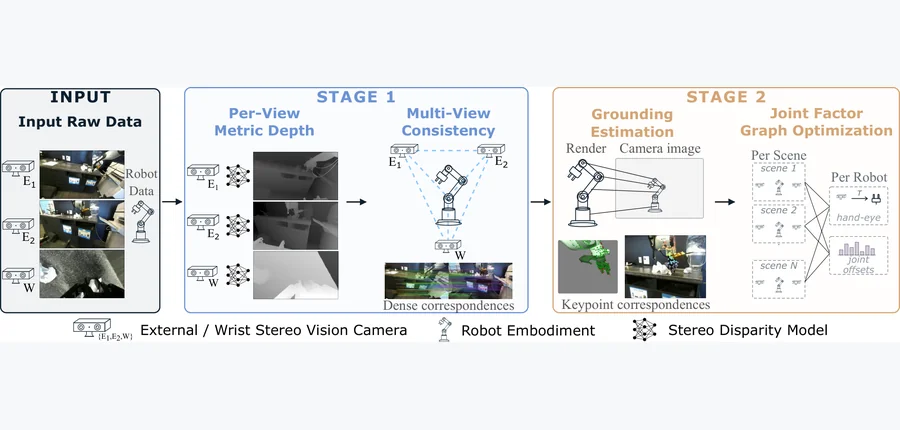 arXiv New 2026-10-07 · cs.RO · #1 **[DepthWorld: 3D World Model for Robot Manipulation](https://arxiv.org/abs/2610.08780)** Jai Bardhan, Josef Sivic, Vladimir Petrik 机构：Czech Technical University in Prague（arXiv HTML 作者栏） [Paper](https://arxiv.org/abs/2610.08780) · [Project](https://jaibardhan.com/depthworld/) · [图源](https://arxiv.org/html/2610.08780v1/pose_pipeline_v6.png) 

中文摘要
世界模型为机器人提供了传统仿真器之外的数据驱动选择，可用于策略评估、改进和规划。这些用途都依赖忠实的三维几何，但当前基于视频的世界模型仅用 RGB 训练，生成序列虽逐帧看似正确，却无法组成一致的三维世界。弥合这一差距需要两方面进展：面向操作任务的大规模三维监督，以及能够吸收这种监督而不破坏强大预训练视频先验的架构。我们提出一套标定流程，将学习得到的双目深度与联合因子图结合，汇集同一实体机器人采集的所有回合，同时恢复共享的运动学参数和各场景的外参。应用于 DROID 后，得到标定的 DROID-3D 数据集，提供稠密的度量深度和重新标定的多视角外参；对外部相机，90% 回合的重投影误差低于 0.7 像素。随后我们训练基于 Stable Video Diffusion 的世界模型 DepthWorld，通过空间潜变量拼接联合预测多视角 RGB 与深度，保持预训练变分自编码器（VAE）不变。在相同训练预算下，相较同架构的纯 RGB 基线，深度监督还使 RGB 预测的 PSNR 提高 1.48 dB，同时为下游几何推理提供准确的度量深度。 <a href="https://arxiv.org/abs/2610.08780">原摘要来源</a>
 | 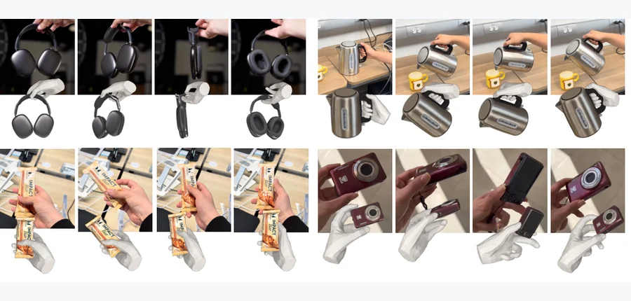 arXiv New 2026-10-07 · cs.CV · #2 **[4D-HOF: Hand-Object Flow Matching for Feed-Forward 4D Interaction Reconstruction](https://arxiv.org/abs/2610.08782)** Shiqi Li, Sean Cho, Yijie Li, Fengzhi Guo, Bowen Wen, Cheng Zhang 机构：Texas A&amp;M University / NVIDIA（PDF 首页） [Paper](https://arxiv.org/abs/2610.08782) · [Project](https://tamu-visual-ai.github.io/4D-HOF/) · [图源](https://arxiv.org/html/2610.08782v1/teaser.png) 

中文摘要
现有四维手物重建方法通常需要昂贵的逐序列优化，而生成式方法往往从随机噪声合成交互，可能导致交互预测不稳定。我们提出 4D-HOF：以视觉基础模型产生的粗略但有信息量的估计为起点，前馈式重建四维手物交互。具体而言，我们学习条件流匹配模型，将基础模型给出的手物状态传输至交互流形，以前馈方式修正平移、旋转和对齐误差。生成式表述的一项优势是可以在测试时于传输过程中自然地加入引导。我们不在重建后另行优化，而是利用物理交互约束和观测到的二维证据直接引导不断演化的生成状态，使重建在生成过程中得到细化。通过在多样数据集上训练，该模型可稳健泛化到具有挑战性的野外场景。域外基准实验显示，4D-HOF 达到当前最佳性能，产生更稳定、准确的四维手物重建。 <a href="https://arxiv.org/abs/2610.08782">原摘要来源</a>
 | 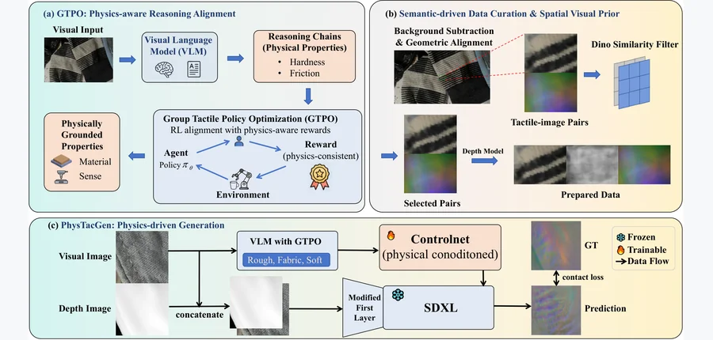 arXiv New 2026-10-07 · cs.CV · #3 **[PhysTacGen: Physics-Aware Visual-Tactile Sensor Image Generation](https://arxiv.org/abs/2610.08068)** Guo Tang, Yongtao Wang 机构：Peking University / VGI Labs（PDF 首页） [Paper](https://arxiv.org/abs/2610.08068) · [图源](https://arxiv.org/html/2610.08068v1/pipeline.png) 

中文摘要
真实的物理交互是具身智能的基础，但采集成对的视觉与触觉数据成本较高。从视觉合成触觉可扩充这类数据，不过视觉外观与接触相关材料属性之间的差异，以及成对观测的空间错位，使映射难以学习。为此，我们提出 PhysTacGen：融合材料感知描述和几何条件的视觉到光学触觉图像生成框架。首先提出群组触觉策略优化（GTPO），以任务特定奖励优化视觉语言模型，使其生成结构化材料描述。其次，结合基于 DINOv2 的配对样本筛选和单目相对深度估计，选择训练配对并提供几何先验。最后，以 RGB、相对深度及 GTPO 生成的文本为条件，由 SDXL ControlNet 合成光学触觉图像。在筛选后的 SSVTP 数据上的实验表明，其结构相似性优于所比较的基线；盲测用户研究也更偏好 GTPO 生成的描述。生成的触觉输入还改善了一个由属性导出的力系数预测代理任务的表现。这些结果支持 PhysTacGen 在光学触觉图像合成及所评估下游任务中的有效性。代码将发布于 https://github.com/VDIGPKU/PhysTacGen。 <a href="https://arxiv.org/abs/2610.08068">原摘要来源</a>
 |
| 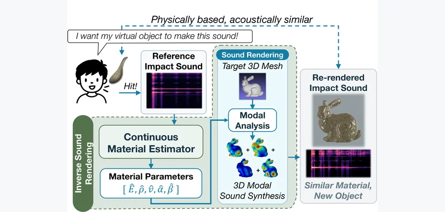 arXiv New 2026-10-07 · cs.SD · #4 **[ImpactMat: Continuous Material Estimation for Inverse Impact Sound Rendering](https://arxiv.org/abs/2610.07061)** Hyebin Cho, Bumsoo Kim, Joon son Chung 机构：KAIST / Chung-Ang University（PDF 首页） [Paper](https://arxiv.org/abs/2610.07061) · [Project](https://material-from-impact.github.io/material-from-impact/) · [图源](https://arxiv.org/html/2610.07061v2/continuous_material_teaser_5.png) 

中文摘要
冲击声渲染合成三维物体被敲击时产生的声音，但实际渲染器往往依赖木材、塑料或钢材等固定材料预设。这些预设限制了可表达的冲击声范围，而在缺乏材料声学专业知识时，手动调节底层材料参数也很困难。因此，我们研究逆向冲击声渲染：从参考冲击声预测材料参数，使仿真器重现相似的材料响应。为支持该任务，我们推出 ImpactMat，这是一个将单一材料和混合材料的冲击声与真实材料参数配对的数据集及基准。我们还提出前馈模型，从一段或多段录音预测参数，并利用混合材料学习材料类型之间的平滑过渡。实验显示，该方法优于所比较的有竞争力基线，且无需手动调参即可根据真实录音重新渲染。项目页：https://material-from-impact.github.io/material-from-impact/。 <a href="https://arxiv.org/abs/2610.07061">原摘要来源</a>
 | 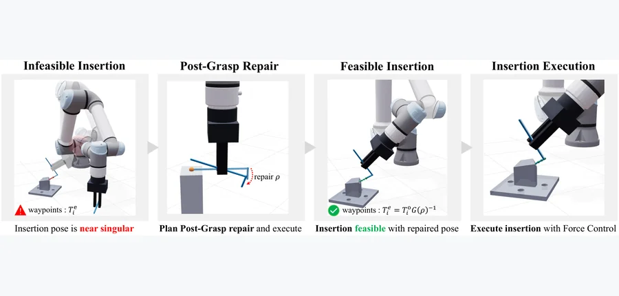 arXiv New 2026-10-07 · cs.RO · #5 **[Post-Grasp Kinematic Repair for Robotic Insertion via Object-in-Gripper Reorientation](https://arxiv.org/abs/2610.08421)** Haegu Lee, Christoffer Sloth 机构：University of Southern Denmark（PDF 首页） [Paper](https://arxiv.org/abs/2610.08421) · [图源](https://arxiv.org/html/2610.08421v1/main_hero.png) 

中文摘要
稳定抓取并不保证机器人插入在运动学上可行，因为物体相对夹爪的位姿变换可能使机器人沿预定插入路径接近奇异位形或关节极限。我们研究通过重新调整物体在夹爪中的朝向，在抓取后修复运动学可行性。给定已完成的抓取和固定的插入路径，目标是寻找一个足够小且能恢复可行性的重定向。顺序逆运动学可能沿不利的关节空间路径而漏掉这些候选解；可行性景观的不光滑性又使搜索计算昂贵。我们用感知分支的逆运动学图评估候选解，最大化离散插入路径上的最小可行性裕度，并借助学习到的任务条件先验改善查询顺序。选定的重定向通过基于触觉的外在操作执行。在 UR5e 仿真中，不用学习排序的规划器相比基于网格的顺序逆运动学，将成功试验的平均重定向量减少 51.5%；加入学习排序后，规划器的平均规划时间再减少 51.1%。真实机器人实验验证了完整流程。 <a href="https://arxiv.org/abs/2610.08421">原摘要来源</a>
 | 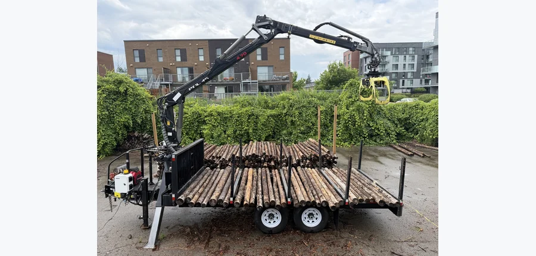 arXiv New 2026-10-07 · cs.RO · #6 **[Learning Grasp Targeting from Point Clouds for Log Pile Clearing on a Hydraulic Crane](https://arxiv.org/abs/2610.07613)** George Sideris, Lucas Bessai, Heshan Fernando, Elie Ayoub, Nicolas Lemieux, Inna Sharf 机构：McGill University / FPInnovations（PDF 首页） [Paper](https://arxiv.org/abs/2610.07613) · [图源](https://arxiv.org/html/2610.07613v1/Figures/paper/compliant/testbed_photo.jpg) 

中文摘要
在木材堆场，装载机需要连续成捆抓取来清理密集原木堆：数百根原木彼此接触，每次移除又会改变下一抓可用的堆形。一个学习策略从未经分割的点云中选择抓斗的放置位置和朝向，并部署在拖车式液压林业起重机上。该策略分类应抓取的观测点，并预测该处的深度及抓斗朝向。同一网络输出可支持行为克隆（BC）、强化学习（RL）与部署。BC 从堆顶成功抓取示范中学习；RL 通过微调克隆策略（BC→RL）或从头训练来探索改进。仿真中，BC 清理了 100 个各含 200 根原木的堆中的 98 个，而 BC→RL 改善了载荷稳定性。12 次现场试验比较几何启发式、从头训练的 RL、BC 和 BC→RL，覆盖完整的抓取、运输、投放循环。BC 与 BC→RL 分别投放了汇总库存的 93.8% 和 88.9%，启发式为 80.4%。BC→RL 在 83.6% 的循环中投放了原木，启发式和 BC 分别为 79.6% 与 65.7%；不过其仿真中的稳定性收益未迁移至起重机试验平台。这些策略完全在仿真中训练并原样部署到起重机，在接收仍含存储架横杆和立柱的原始点云时，比手工筛选的启发式清理更多原木。 <a href="https://arxiv.org/abs/2610.07613">原摘要来源</a>
 |
| 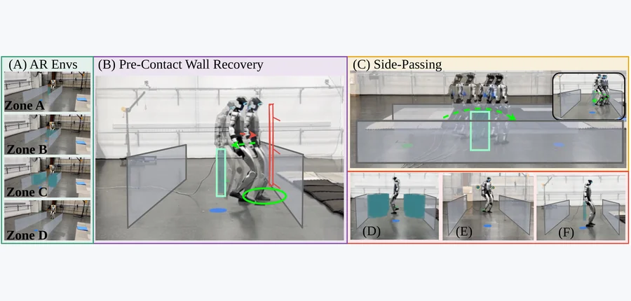 arXiv New 2026-10-07 · cs.RO · #7 **[Model-Based Geometry-Aware Generative Optimization for Constrained Locomotion Planning](https://arxiv.org/abs/2610.07772)** Zhilin He, Xinyuan Wang, Changliu Liu 机构：Carnegie Mellon University / University of Michigan（arXiv HTML 作者栏） [Paper](https://arxiv.org/abs/2610.07772) · [图源](https://arxiv.org/html/2610.07772v1/2go_deploy.png) 

中文摘要
四足机器人和人形机器人的约束运动规划（CLP）必须同时满足避碰、接触一致性、运动学可行性和支撑约束；高维动力学与高度非凸环境使这一问题困难。近期基于模型的扩散（MBD）把轨迹优化改写成轨迹后验采样，利用已知动力学和蒙特卡洛展开解析估计去噪分数函数，无需示范学习。已有约束变体也将可行性纳入基于模型的分数展开并取得有前景的表现，但仍存在两点限制：（1）缺少随任务调节、能塑造分数方向及反向随机性的活动约束几何；（2）采用确定性的 DDPM 式反向传输，未能在不同生成传输之间自适应调度。因此，我们提出用于约束运动的基于模型的几何感知生成优化（2GO），通过法向诱导的度量塑形、切空间随机过滤和基于 CFS 的回缩，将活动约束几何转化为可执行去噪算子。2GO 还通过自适应扩散与类流调度，把生成传输同反向随机性解耦。约束四足和人形运动实验显示，它在离散落脚点选择及连续姿态规划中表现较强，成功率更高、约束违规更少、执行兼容性更好。 <a href="https://arxiv.org/abs/2610.07772">原摘要来源</a>
 | 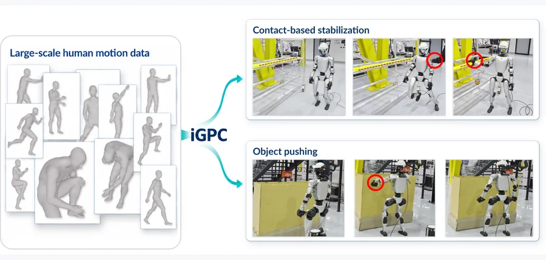 arXiv New 2026-10-07 · cs.RO · #8 **[iGPC: Generative Motion Priors for Object-Aware Humanoid Interaction](https://arxiv.org/abs/2610.08120)** Anujith Muraleedharan, Abdul Ahad Butt, Nolan Fey, Yash Prabhu, Anamika J H, Sandor Felber, Maurice Rahme, Ivan Laptev 机构：MBZUAI / MIT / Minerva Humanoids（PDF 首页） [Paper](https://arxiv.org/abs/2610.08120) · [图源](https://arxiv.org/html/2610.08120v1/teaser_igpc.png) 

中文摘要
在非结构化环境中工作的人形机器人既需要稳健的全身控制，也需要感知并与周围物体发生物理交互。大规模人体运动数据虽然为自然、多样的人形控制提供强先验，但将其有效迁移到感知驱动的物体交互仍有困难。为此，我们提出将近期生成式预训练控制器（GPC）从一般人体运动扩展至人形机器人与环境全身交互的框架。首先，我们将 GPC 改造成由场景可供性线索和特权状态信息条件化的交互专家；这些专家利用预训练的人体运动先验，同时学习特定任务的接触行为，包括伸手触物、抓住环境支撑物保持稳定，以及推动可移动物体。其次，提出保留预训练 GPC 策略的感知驱动学生模型，用机载传感观测从专家蒸馏交互技能。为弥合专家的特权观测和传感输入之间的差距，我们提出两个互补训练目标，使预训练运动先验在蒸馏期间得以有效适应。多项全身交互任务的实验表明，大规模生成式人体运动先验可作为学习可部署策略的有效基础，用于接触丰富的真实环境人形交互。 <a href="https://arxiv.org/abs/2610.08120">原摘要来源</a>
 | 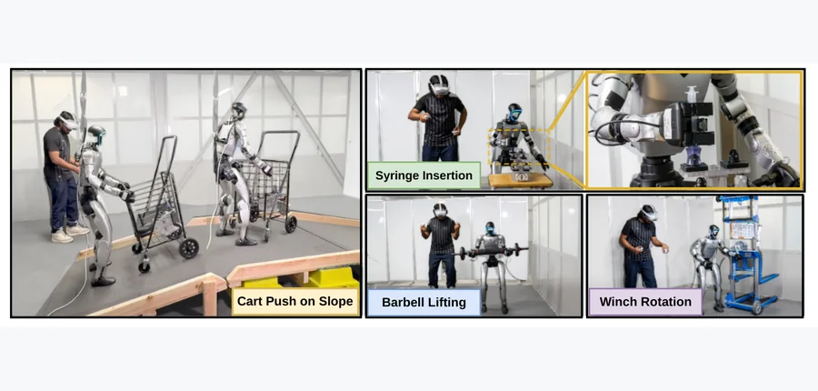 arXiv New 2026-10-07 · cs.RO · #9 **[BRACE: Adapting Whole-Body References for Force and Terrain Aware Humanoid Motion Tracking](https://arxiv.org/abs/2610.07052)** Sudarshan Harithas, Chen Yu, Juan Borbon, Shubhankar Mondal, Winston Zha, Srinath Sridhar, Dingqi Zhang, Jiuguang Wang 机构：Multiply Labs / Brown University / University of New Mexico（PDF 首页） [Paper](https://arxiv.org/abs/2610.07052) · [Project](https://multiplylabs.github.io/brace/) · [图源](https://arxiv.org/html/2610.07052v1/teaser_8.png) 

中文摘要
全身跟踪已成为操作者驱动人形机器人的接口，但其参考动作通常在平地且无负载时记录，因此跟踪器既不知道机器人必须与物体交换的力，也不知道脚下地形。已有控制器只处理其中一侧：支持施力的策略指定末端力，却不规定全身姿态；适应地形的跟踪器把负载当成需要排斥的扰动，而非需要施加的力矩。我们提出 BRACE，它在斜坡上跟随平地参考时，仍能从多种姿态施加并补偿指定的手部力。BRACE 将负载与坡度一起纳入参考：地形适配把落脚点和根部抬升至局部表面；力矩变换在教师特定的手臂用力限制下，同时求解产生目标力的手部位移，以及由此引发的质心和压力中心位移。独立的施力和补偿教师通过 DAgger 蒸馏成一个流匹配学生策略；它仅依赖本体感觉运行，无需高度图或实测力矩。因此远程操作者也可提供平地轨迹，由机器人在机载端处理坡度与负载。Unitree G1 上的大量仿真与真实机器人实验展示了 BRACE 在不同地形上施力、补偿力的能力。 <a href="https://arxiv.org/abs/2610.07052">原摘要来源</a>
 |
| 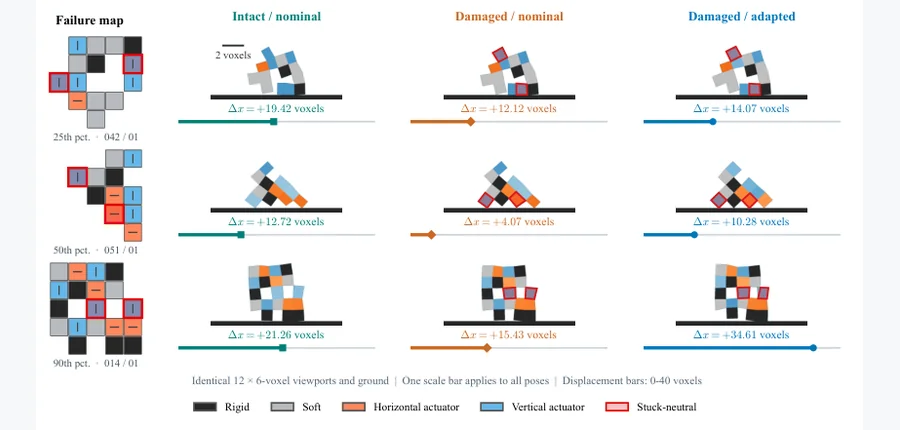 arXiv New 2026-10-07 · cs.RO · #10 **[Nine Trials to Recover: A Reproducible Benchmark for Repertoire-Free Soft-Robot Damage Adaptation](https://arxiv.org/abs/2610.07616)** Siyuan Zhang 机构：University of Michigan（arXiv HTML 作者栏） [Paper](https://arxiv.org/abs/2610.07616) · [图源](https://arxiv.org/html/2610.07616v1/fig2_morphology_damage_examples.png) 

中文摘要
我们提出一个无预先技能库的软体机器人损伤恢复基准，在线试验预算为九次。协议在同一形态内部配对损伤掩码，保留实测的名义回退控制器，并将方法开发与新机器人身体上的评估分开。基于高斯过程期望改进（GP-EI）的参考控制器用三次初始化探测和六次由反馈选择的展开，调节执行器相位。在两个互不重叠、各有 75 个身体的队列上，等预算比较中它优于随机搜索、Sobol、CEM 和 CMA-ES。GP-EI 在确认队列 75 个身体中的 69 个上提升了最差掩码收益，其平均最差掩码奖励比四个基线高 0.235–0.310。TuRBO 式局部 GP 是最接近的对照，配对置信区间包含零。确认后的固定控制器重放显示平均恢复 5.06 个体素宽度，同时最差掩码 p99 几何边应变增加 0.0031；严格禁止增加需求的部署门槛保留了平均收益的 48.7%。在冻结的开发压力测试中，物理移除 10% 的占用体素后，GP-EI 改善了 75 个身体中的 71 个，平均最差掩码收益比官方 BoTorch TuRBO 高 0.356。这些可重放控制器、身体级推断与冻结队列评估，为衡量学习型损伤先验及未来适应方法的附加价值提供参照。 <a href="https://arxiv.org/abs/2610.07616">原摘要来源</a>
 | 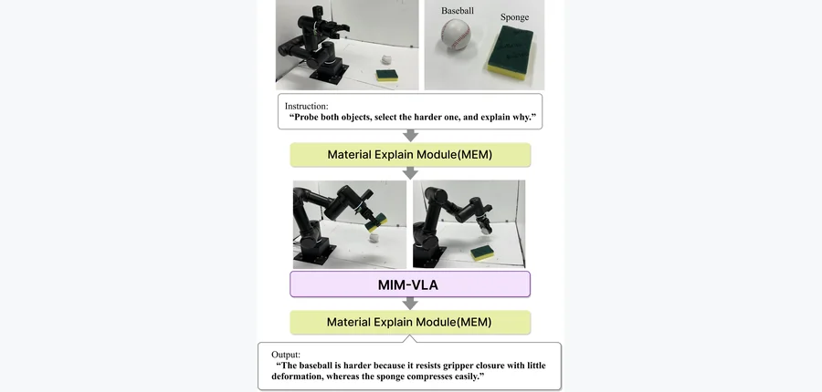 arXiv New 2026-10-07 · cs.RO · #11 **[MIM-VLA: Learning Physical Interaction Representations from Gripper Motor Feedback](https://arxiv.org/abs/2610.08425)** Jaeyoung Lee, Jiyeon Koo, Taehwa Kim, Yerin Cha, Andrew Jaeyong Choi 机构：Gachon University（PDF 首页） [Paper](https://arxiv.org/abs/2610.08425) · [图源](https://arxiv.org/html/2610.08425v1/figures/material_selection_group53_opt.png) 

中文摘要
视觉语言动作（VLA）策略主要依据视觉观测和机器人状态推断抓取动作，却没有显式表示接触之后观测到的物理响应。我们提出 MIM-VLA：基于电机反馈的架构，将最近的夹爪电流、位置、速度和信号有效性编码为一个 128 维交互 token。仅使用电机数据的电机交互模块（MIM）先用经人工审核的接触及交互阶段标签预训练，随后只条件化 SmolVLA 的夹爪动作路径；手臂动作与位置控制接口保持不变。同一 token 还供 MEM 选择器视觉语言模型比较候选交互，并输出以证据为条件的选择与解释。我们在三种真实场景评估 MIM-VLA：比较外观不同物体的交互阻力，通过主动探测区分外观相近的真品与仿制品，以及轻柔抓取脆弱物体，测试包含留出的实例。在 13 对物体上，MIM-VLA 有 75.0% 的试验选出阻力较大的物体，SmolVLA 基线为 48.8%。对于所评估任务，该方法利用夹爪已有的电机反馈，无需额外触觉阵列、力矩传感器、标定后的力估计或直接电流控制。 <a href="https://arxiv.org/abs/2610.08425">原摘要来源</a>
 | 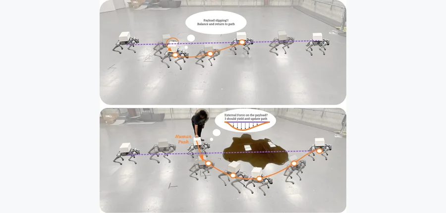 arXiv New 2026-10-07 · cs.RO · #12 **[Feeling Through the Load: Compliant Quadruped Locomotion under Payload Interactions](https://arxiv.org/abs/2610.08637)** Shaunak A. Mehta, Mayank Mishra, Prajit KrisshnaKumar, Sebastian Scherer, Koichiro Niinuma 机构：Fujitsu Research of America / Carnegie Mellon University（PDF 首页） [Paper](https://arxiv.org/abs/2610.08637) · [图源](https://arxiv.org/html/2610.08637v1/front.png) 

中文摘要
四足机器人越来越需要在有人活动的环境中边移动边运载物体。但如果人直接与载荷而非机器人交互，会怎样？对于未受约束的载荷，机器人必须区分有意的外部交互与普通载荷运动，同时保持载荷平衡和稳定行走。四足机器人如何仅凭机载测量推断并顺应这些交互？本文提出一个力感知行走框架，将载荷交互视为塑造机器人与载荷组合系统运动的命令。方法将未约束载荷上的力感知行走学习与力估计学习分开；再把顺应式负载行走策略与因果力估计器结合，通过将估计器置于训练环中的数据聚合和微调，从机载机器人测量预测交互。仿真与真实实验显示，所得控制器可在运载载荷时保持稳定行走，顺应外部交互，并利用推断出的力支持人引导的轨迹改变。 <a href="https://arxiv.org/abs/2610.08637">原摘要来源</a>
 |
| 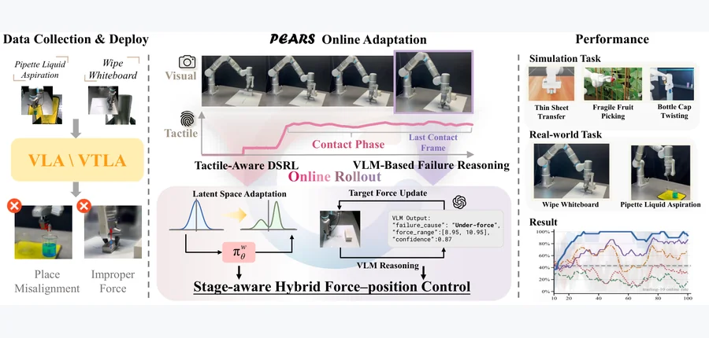 arXiv New 2026-10-07 · cs.RO · #13 **[PEARS: Physical-Prior-Guided Efficient Adaptation via Failure Reasoning and Diffusion Steering for Tactile Manipulation](https://arxiv.org/abs/2610.08784)** Kun Song, Yiming Wang, Yilin Chen, Tianyi Ding, Jiaxin Tian, Tianqi Gong, Daolin Ma, Jia Pan 机构：University of Hong Kong / Shanghai Jiao Tong University / Xense Robotics / University of Pennsylvania（PDF 首页） [Paper](https://arxiv.org/abs/2610.08784) · [Project](https://song-kun.github.io/pears/) · [图源](https://arxiv.org/html/2610.08784v1/figure1.png) 

中文摘要
预训练机器人策略在部署中遇到分布外条件时，性能可能显著下降，因此需要通过真实交互做后训练。然而基于强化学习（RL）的后训练通常需要大量环境交互；在操作任务中，每次尝试尤其可能缓慢、昂贵或具有破坏性。我们提出 PEARS：利用物理先验、以触觉反馈对预训练策略进行样本高效在线适应的混合 RL 框架。每个回合后，物理引导力推理（PFR）模块使用视觉语言模型（VLM）中编码的物理先验，根据视觉结果与触觉交互历史诊断失败，并更新适合任务的接触力边界。高频混合力位控制器随后在接触期间执行这些边界。作为补充，触觉条件扩散引导强化学习调整冻结流匹配策略的潜变量噪声，在不更新基础模型的情况下修正自由空间运动和接触时机错误。在仿真中，PEARS 相对各任务最强基线将成功率提高 12.4–37.4 个百分点；达到给定成功阈值所需交互回合数最多比最快基线减少 53.2%。真实实验中，白板擦除和移液管液体抽吸的成功率分别为 95% 和 90%。结果表明，将 PFR 模块与策略引导结合，可减少昂贵交互并加快适应。项目网站：https://song-kun.github.io/pears。 <a href="https://arxiv.org/abs/2610.08784">原摘要来源</a>
 | 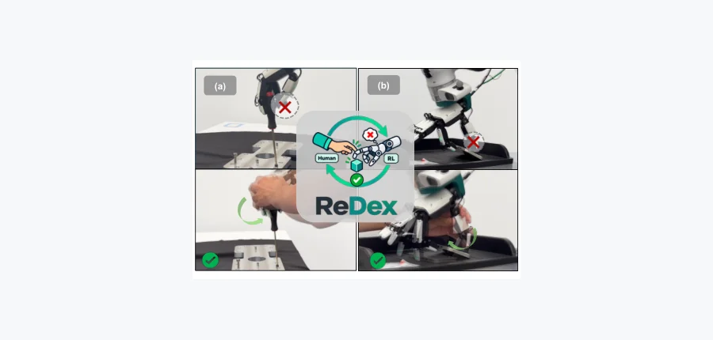 arXiv New 2026-10-07 · cs.RO · #14 **[ReDex: Repairing Sim-to-Real Dexterous Policies by Finger-Level Compliant Interaction](https://arxiv.org/abs/2610.07525)** Jinzhou Li, Hadi Tabatabaee, Kelin Yu, Yuyin Sun, Cheng-Hao Kuo, Roberto Martín-Martín, Nima Fazeli, X. Alice Wu, Xianyi… 机构：Amazon / Duke University / University of Maryland / UT Austin / University of Michigan（PDF 首页） [Paper](https://arxiv.org/abs/2610.07525) · [图源](https://arxiv.org/html/2610.07525v1/teaser.png) 

中文摘要
仿真训练的灵巧操作策略常因接触时机和力调节误差而无法迁移到真实世界，但仍可能保留推进任务所需的多指协调能力。我们提出 ReDex，通过修复局部接触失败并引入触觉反馈，使仿真训练的基础策略适应真实环境。以仅使用本体感觉的基础策略为起点，ReDex 允许操作者在真实展开期间、顺应控制下对选定手指的接触失败进行物理纠正，而冻结的基础策略继续控制其余手指。这些展开结合了基础策略执行、人工纠正的手指运动和指尖力观测。我们由此重建有力信息的目标，并用行为克隆训练独立的力条件策略。该设计减少人工纠正工作量，使策略能从真实交互中学习接触调节，也无需触觉仿真或复杂的整手遥操作，就能为仅用本体感觉的策略引入力反馈。我们在真实硬件上评估两个具有挑战性的接触丰富灵巧操作任务。与仿真到真实迁移的基础策略相比，ReDex 将两个物体上的物体翻转成功率从 14% 提高到 86%，并将三个物体上的螺丝刀旋转平均进度从 26.0% 提高到 95.3%。 <a href="https://arxiv.org/abs/2610.07525">原摘要来源</a>
 | 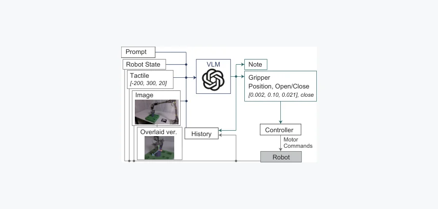 arXiv New 2026-10-07 · cs.RO · #15 **[TacZero: Training-Free Peg Insertion Using a General-Purpose Vision-Language Model with Tactile Feedback](https://arxiv.org/abs/2610.07621)** Kazutoshi Tanaka 机构：OMRON SINIC X（arXiv HTML 作者栏） [Paper](https://arxiv.org/abs/2610.07621) · [图源](https://arxiv.org/html/2610.07621v1/method.png) 

中文摘要
能根据语言指令和传感观测自主决定动作的机器人，有望无需任务专门训练或手工规则，就执行新的接触丰富操作任务。为此，机器人必须推断物体如何相互接触及由此产生的运动，再选择动作。以往用于接触推断和动作选择的方法，要么设计估计模型和触觉反馈控制律，要么从触觉数据学习物体运动估计、动作结果预测与动作选择模型。我们提出 TacZero，改用预训练的通用视觉语言模型（VLM）解释视觉和触觉观测并选择机器人动作，不再追加触觉或操作训练，也无需为接触解释或动作选择编写任务规则。TacZero 向 VLM 提供相机图像、机器人状态，以及以数值或叠加在图像上的向量形式表示的三轴触觉响应。VLM 根据这些观测与交互历史，生成目标末端位置和夹爪开合命令，再交由低层控制器执行。在真实的圆柱销插入实验中，数值触觉输入下 TacZero 在 20 次中成功 15 次，无触觉输入时为 20 次中 10 次。本研究为利用通用 VLM 研究接触丰富操作提供具体起点，也指出了该方向的挑战。 <a href="https://arxiv.org/abs/2610.07621">原摘要来源</a>
 |
| 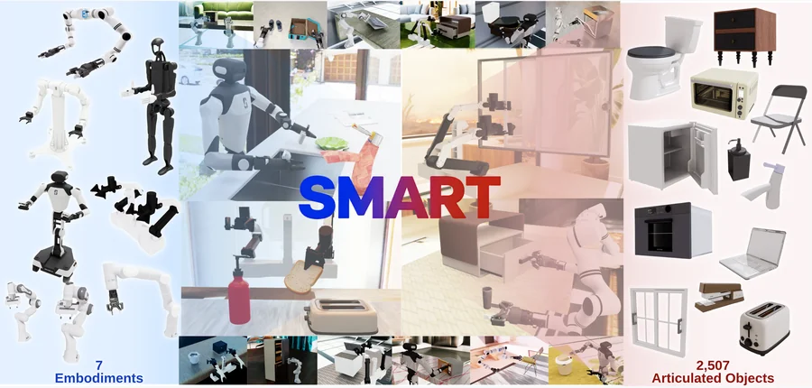 arXiv New 2026-10-07 · cs.RO · #16 **[SMART: Zero-Shot Sim-to-Real Articulated Object Manipulation via Large-Scale Synthetic Pretraining](https://arxiv.org/abs/2610.07652)** Jicong Ao, Shuhan Jiang, Yuling Zhong, Yanwen Liu, Yuhan Gao, Jiangyuan Zhao, Yang Zhang, Shiqiang Zhu, Chenjia Bai, Xuelo… 机构：China Telecom / Technical University of Munich / Harbin Institute of Technology（arXiv HTML 作者栏） [Paper](https://arxiv.org/abs/2610.07652) · [图源](https://arxiv.org/html/2610.07652v1/images/teaser_smart.png) 

中文摘要
与关节物体交互对具身智能系统很重要，但由于需要精确的接触和沿约束运动，大规模采集真实示范仍然困难。仿真虽是可行替代，现有合成数据覆盖的关节物体类别有限；通用合成流程又缺乏对部件级语义和关节约束的显式设计，妨碍智能体式任务生成及高质量关节操作示范的规模化合成。为弥合这一差距，我们提出 SMART：利用大规模合成关节物体操作示范的可扩展系统。核心是具有关节感知设计的仿真平台 SMART-Sim，可有效生成任务并高效采集示范。在 SMART-Sim 上，我们采用智能体式任务生成并设计分布式可扩展合成系统，得到 SMART-Data：覆盖 44 类原子任务、5 种机器人配置和 2,507 个关节物体的超过 100 万条示范。用 SMART-Data 预训练的视觉语言动作（VLA）模型在仿真基准上表现有竞争力，并在真实关节物体操作任务上实现零样本仿真到真实迁移和可扩展性能。这说明合成示范有潜力为提升接触丰富的关节物体操作 VLA 模型提供有效、可扩展的监督。 <a href="https://arxiv.org/abs/2610.07652">原摘要来源</a>
 | 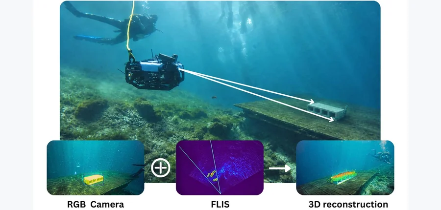 arXiv New 2026-10-07 · cs.RO · #17 **[SURGE: Sonar-fUsed Reconstruction and localization via image-gated Graph Estimation](https://arxiv.org/abs/2610.07472)** Mohammed Ibrahim M, Vallabh Deogaonkar, Trung Dong, Jane Shin, Abhilash Somayajula, Xiaomin Lin 机构：University of South Florida / IIT Madras / Seoul National University（PDF 首页） [Paper](https://arxiv.org/abs/2610.07472) · [图源](https://arxiv.org/html/2610.07472v1/abstract_image.png) 

中文摘要
遥控潜水器（ROV）广泛用于探索和检查洞穴、沉船及水下基础设施。此类任务需要准确理解环境的三维结构，而这依赖可靠的载具定位和度量场景重建。然而水下通常缺乏外部定位，小型 ROV 主要依靠机载感知。光学视觉提供丰富的外观和几何信息，但有尺度歧义及轨迹漂移；二维成像声呐提供度量距离，却缺少完整三维几何。已有水下重建方法往往分别处理这些局限，或假定已知传感器位姿，使定位与重建脱节。我们提出 SURGE，一个相机与声呐融合框架：在因子图中结合视觉和声学观测，联合估计 ROV 轨迹及目标位置，再用恢复的度量位姿进行声呐高斯泼溅。真实水下 RGB 与声呐观测实验表明，SURGE 相比传统视觉位姿估计显著改善定位一致性，并比 RGB 高斯泼溅基线产生更紧凑、原生度量的重建。 <a href="https://arxiv.org/abs/2610.07472">原摘要来源</a>
 | 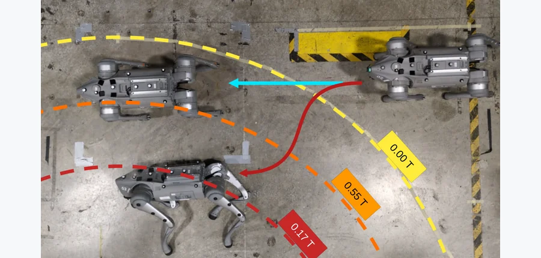 arXiv New 2026-10-07 · cs.RO · #18 **[Magnet-Aware Control of Legged Robots](https://arxiv.org/abs/2610.08653)** J. Playan Garai, S. B. Djuve, C. McGreavy, M. Khadiv 机构：Technical University of Munich / CERN（PDF 首页） [Paper](https://arxiv.org/abs/2610.08653) · [图源](https://arxiv.org/html/2610.08653v1/intro_photo_3.png) 

中文摘要
自主机器人可提高大型科学设施的运行时间并减少人员暴露，但设施运行所需的强磁场会干扰传感器，并产生依赖姿态的机械力矩，使机器人失稳且挑战传统反应式控制器。本文提出一个控制框架，对作用于足式机器人的空间变化磁力矩进行建模、估计和动态补偿，以提高其在此类磁场中的稳健性。我们为 MuJoCo 开发自定义物理插件，模拟刚体元件上的磁力；同时提出逆向磁场估计框架，从四足机器人动力学响应和任意数量的传感器读数推断潜在磁场。进一步开发磁场感知模型预测控制（MPC）与全身控制（WBC）架构，在行走时预测并抵消磁扰动，扩大机器人可工作的磁场范围。仿真和实体硬件实验验证了框架的有效性。与无补偿系统相比，该方法将力空间中可抵御的最大磁场扰动提高 2.5 倍，将力矩空间中可抵御扰动提高 1.6–2 倍。在所提出的磁场内，机器人可运行面积增加 29,34%，其中 10,84% 的区域原本会使无补偿控制器立即跌倒。 <a href="https://arxiv.org/abs/2610.08653">原摘要来源</a>
 |
| 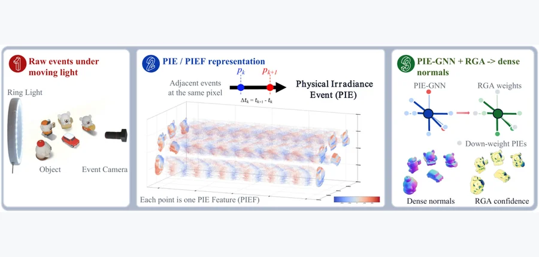 arXiv New 2026-10-07 · cs.CV · #19 **[PIE-PS: Photometric Stereo from Physical Irradiance Event Streams](https://arxiv.org/abs/2610.08188)** Xiangze Meng, Guangyu Li, Jing Li, Di Mei, Songchen Ma, Mingkun Xu, Rui Ma 机构：Jilin University / Guangdong Institute of Intelligence Science and Technology / Beijing Institute of Technology / HKUST（PDF 首页） [Paper](https://arxiv.org/abs/2610.08188) · [图源](https://arxiv.org/html/2610.08188v1/teaser.png) 

中文摘要
事件相机以微秒级延迟和高动态范围记录异步的对数图像辐照度变化。这些特性有利于移动光源下的光度立体，但原始事件稀疏，且依赖未知的对比度阈值。我们从事件触发模型出发，推导相邻事件、光源运动与表面法线之间的物理关系。这一关系给出纯物理直接求解器，但它需要阈值、每个像素上足够多的事件，以及逐像素独立优化。为克服这些限制，我们提出 PIE-PS：从原始事件流和已知照明重建稠密表面法线的学习框架。将同一像素的两个相邻事件与对应光照方向配对，形成物理辐照事件（PIE）；每个 PIE 提供定义为带符号事件率的物理辐照事件特征（PIEF），无需未知的对比度阈值。为在邻近 PIE 之间共享时空上下文，PIE-GNN 将每个 PIE 作为图节点，连同配对光照几何一起编码。由于 PIE 观测的可靠性随局部外观、照明几何和传感器噪声而变，可靠性分级注意力（RGA）预测权重并降低不可靠 PIE 的影响，随后按像素聚合得到稠密法线。合成与真实数据实验显示，PIE-PS 优于已有事件式光度立体方法及直接求解器基线。 <a href="https://arxiv.org/abs/2610.08188">原摘要来源</a>
 | 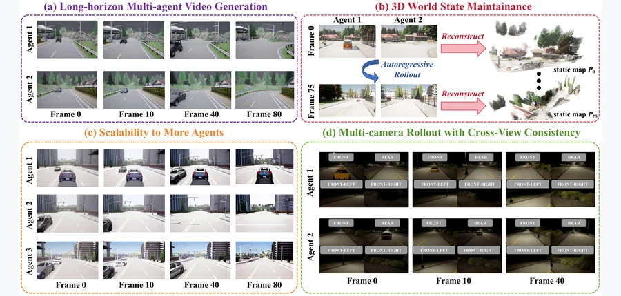 arXiv New 2026-10-07 · cs.CV · #20 **[Artemis: Geometry-Grounded Multi-Agent Driving World Models with Shared 3D State and Progressive Memory Update](https://arxiv.org/abs/2610.07031)** Sitian Shen, Jiuming Liu, Mengmeng Liu, Yian Wang, Michael Ying Yang, Francesco Nex, Hao Cheng, Daniele De Martini, Ayush… 机构：University of Cambridge / University of Oxford / University of Twente / NUS / University of Bath（PDF 首页） [Paper](https://arxiv.org/abs/2610.07031) · [图源](https://arxiv.org/html/2610.07031v1/head_figure.png) 

中文摘要
近期视频世界模型正从单智能体转向多智能体，以呈现现实中更复杂的动力学与跨智能体交互。但已有方法通常通过交叉注意力进行隐式通信，缺乏明确几何约束和统一三维状态，导致多视角一致性较差，也难以恢复视野外的智能体。此外，大多数方法假设背景静止，无法表示不受控的背景动态。我们提出 Artemis：具有显式记忆共享的几何约束多智能体世界模型。它从多智能体观测重建显式三维世界地图，约束各智能体使用统一三维状态，提升跨视角一致性。具体而言，动作引导的几何注入模块同时渲染分离的前景与背景控制图，再经 GeoAdapter 模块注入扩散 Transformer。相较于只假定静态背景的方法，GeoAdapter 还能区分不受智能体控制的动态，并以它们自己的多帧历史位置为条件提供一致的运动线索。系统从逐步生成的视频中选择关键帧，持续更新重建的三维世界地图。为捕获复杂动态模式，我们整理了取自 CARLA 仿真器的新数据集 MA-CARLA。大量实验显示，所提方法在生成视频的视觉保真度与跨视角一致性方面优于比较方法。此外，Artemis 支持同时进行二维视频和三维点地图维护的多模态展开，并能扩展到两个以上智能体及多相机场景。 <a href="https://arxiv.org/abs/2610.07031">原摘要来源</a>
 | 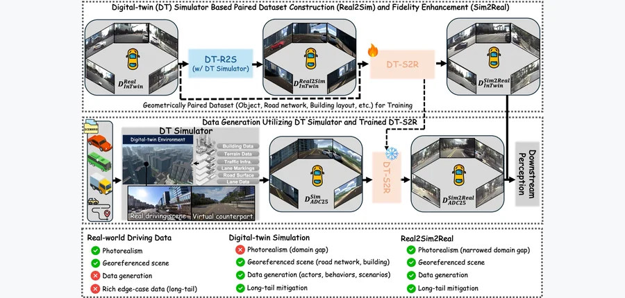 arXiv New 2026-10-07 · cs.CV · #21 **[Digital Twin-Driven Real2Sim2Real: Simulator-Conditioned Generation via Paired Driving-Scene Reconstruction](https://arxiv.org/abs/2610.08339)** Hojun Lim, Hyeongseok Jeon, Donghyun Kim, Soonyoung Jung, Heecheol Yoo 机构：Technical University of Munich / MORAI / Hyundai Motor / Seoul National University（PDF 首页） [Paper](https://arxiv.org/abs/2610.08339) · [图源](https://arxiv.org/html/2610.08339v1/resource/motive.jpg) 

中文摘要
基于相机的自动驾驶三维感知高度依赖大型标注数据集；把系统部署到新目标区域通常需要重新采集并标注数据。生成式增强被提出以降低成本，但现有方法面临根本权衡：标签条件方法消耗了本想替代的标注，而仿真器条件方法虽免费提供标注，却缺乏与特定真实环境的视觉对齐。本文研究由数字孪生驱动的 Real2Sim2Real 流程（DT-R2S2R）能在多大程度上替代目标区域真实数据。通过在地理配准的数字孪生中重建录制的驾驶片段（DT-R2S），我们用几何对齐的仿真器渲染来条件化扩散模型，形成以数字孪生为锚的 Sim2Real 模型（DT-S2R）。因此，在数字孪生覆盖范围内，无论是重建场景还是新的仿真场景，DT-S2R 都能从低成本但具有地理配准的仿真数据合成照片级驾驶图像。生成数据的效果在多种三维检测器上得到验证。其中 DETR3D 在不使用目标区域图像训练检测器的情况下，达到了以目标区域真实数据训练的理想对照 mAP 的 93.18%。再与已有的非目标区域真实数据简单联合训练，效果还超过该对照。因此，对于具备数字孪生的地区，DT-R2S2R 可显著降低现场数据采集和标注成本，为扩展三维感知提供实用基础。 <a href="https://arxiv.org/abs/2610.08339">原摘要来源</a>
 |
| 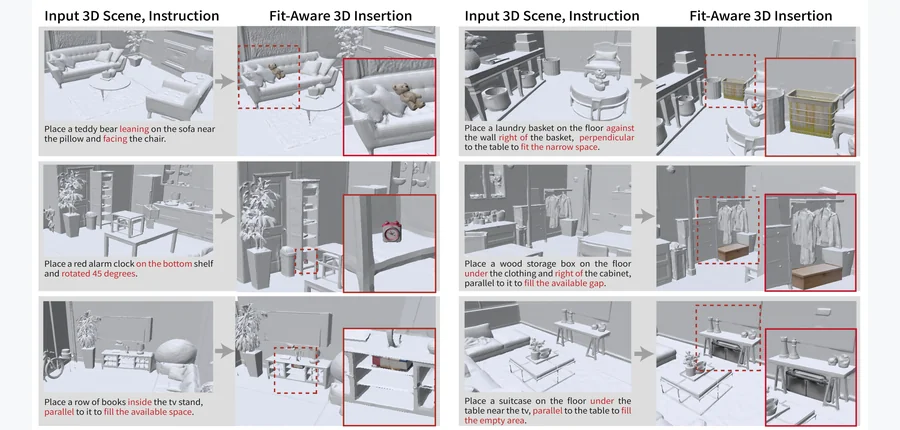 arXiv New 2026-10-07 · cs.CV · #22 **[ElasticFit: Fit-Aware 3D Object Insertion via VLM Reasoning and Generative Adaptation](https://arxiv.org/abs/2610.07460)** Tzu-Hsin Hsieh, Ricardo Marroquim 机构：Delft University of Technology（arXiv HTML 作者栏） [Paper](https://arxiv.org/abs/2610.07460) · [图源](https://arxiv.org/html/2610.07460v2/figures/elasticfit_teaser8.png) 

中文摘要
将物体插入已有三维场景不只是选择合理位置：物体还须适配局部几何，同时保留语义意图与物理合理性。近期视觉语言模型（VLM）和生成模型虽能进行语义推理与视觉内容创作，但当物体需要放入受限局部空间时，三维锚定和几何控制仍然有限。我们提出 ElasticFit：以新型场景锚定表示为中心、由 VLM 引导的适配式物体插入框架。给定语言指令和渲染的场景观测，ElasticFit 推断结构化适配线索，明确物体应锚定何处、占据何种体积、采取何种朝向，以及适配模式是刚性放置、均匀缩放还是弹性适配。这些线索把高层 VLM 推理转成显式三维约束，为物体生成提供条件并指导后续几何适配。随后 ElasticFit 生成场景条件的物体先验、将其重建为三维，并按具体模式细化网格，同时约束避碰、接触一致性和物理支撑。在固定资源的基线比较中，相较最强基线，空间关系成功率从 50.8% 提升至 69.7%，支撑成功率从 48.3% 提升至 91.7%；它还为复杂场景中的生成式“使之适配”插入提供新的支持。 <a href="https://arxiv.org/abs/2610.07460">原摘要来源</a>
 | 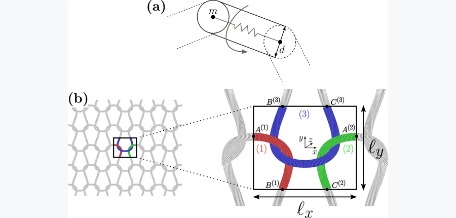 arXiv New 2026-10-07 · cond-mat.soft · #23 **[Mechanics of a Model Frictional Knitted Fabric](https://arxiv.org/abs/2610.07372)** Laura Michel, Antoine Faulconnier, Audrey Steinberger, Samuel Poincloux, Jérôme Crassous 机构：CNRS / ESPCI Paris / ENS de Lyon / Aoyama Gakuin University / Université de Rennes（PDF 首页） [Paper](https://arxiv.org/abs/2610.07372) · [图源](https://arxiv.org/html/2610.07372v1/Fig_sim3D.png) 

中文摘要
我们研究由弹性且有摩擦的纱线形成的针织线圈的形状与力学性质。首先，对于无摩擦纱线，考察线圈的弹性能如何随形状变化，由此量化拉伸与弯曲的能量贡献，并识别能量有利的线圈构型。随后考虑细的摩擦纱线；此时即便存在摩擦，线圈稳定性仍可化约为简单的平面弹性线问题。摩擦使静止的针织织物——即无外加力时——出现多个稳定线圈形状。我们表明，在细纱线极限，二维弹性线模型可以预测这些静止形状。此外，该框架可直接求得单轴拉伸下的力—形变曲线。对尼龙针织织物单轴拉伸时线圈尺寸和力的测量，使我们能够评估平面弹性线模型在定性和定量上的有效性。最后，我们考察该模型用于密集针织织物时的局限。 <a href="https://arxiv.org/abs/2610.07372">原摘要来源</a>
 | 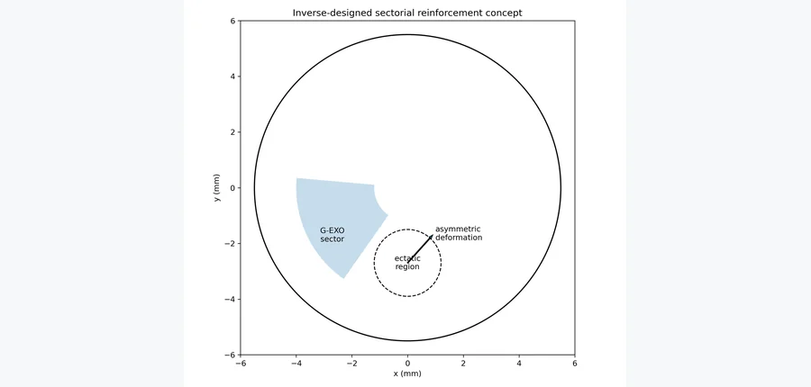 arXiv New 2026-10-07 · physics.bio-ph · #24 **[Inverse-Designed Anisotropic Intrastromal Corneal Exoskeletons for Keratoconus: A Three-Dimensional Computational Feasibility Study](https://arxiv.org/abs/2610.08529)** J. Sumaya-Martinez, Alan Altamirano 机构：Universidad Autónoma del Estado de México / Centro de Microcirugía Ocular（PDF 首页） [Paper](https://arxiv.org/abs/2610.08529) · [图源](https://arxiv.org/html/2610.08529v1/GEXO_concept_schematic.png) 

中文摘要
我们提出 G-EXO，一种针对圆锥角膜、经逆向设计的角膜基质内外骨骼。不同于传统角膜内环，G-EXO 被设计为可按患者定制的分区、各向异性支架；其几何和刚度经过优化，以重新分配角膜形变并减轻不对称光学像差。我们开发了三维有限元筛查模型，包含局部扩张区弱化、生理眼压和角膜基质内增强区域。一个代表性设计对眼压引起的彗差产生温和但一致的降低，网格细化后的估计约为 5%；位移和应力指标在数值上更稳定。本文将此研究定位为计算可行性框架，而非临床验证。主要贡献是把角膜基质内增强表述为自由形态的光学—生物力学逆向设计问题。患者专属断层成像、非线性各向异性角膜力学、完整光学建模和离体验证被列为下一步。 <a href="https://arxiv.org/abs/2610.08529">原摘要来源</a>
 |
| 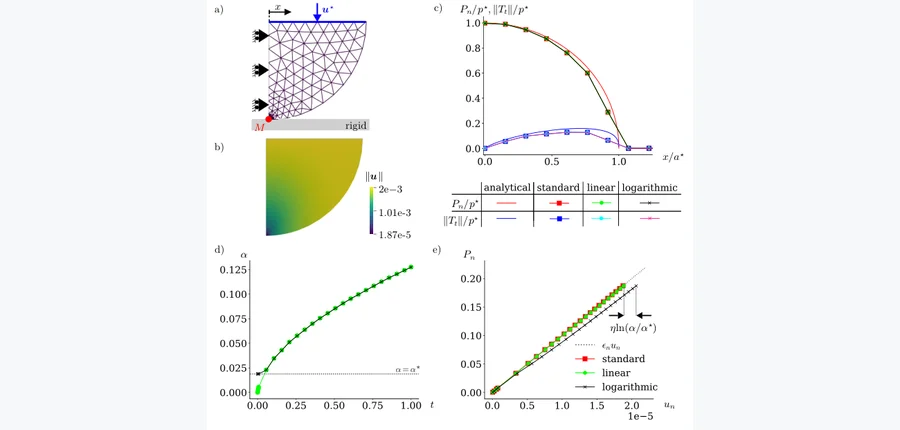 arXiv New 2026-10-07 · physics.app-ph · #25 **[An associated model of Coulomb friction based on the real area of contact](https://arxiv.org/abs/2610.08535)** Manon Thbaut, Laura De Lorenzis 机构：affiliation 未确认 [Paper](https://arxiv.org/abs/2610.08535) · [图源](https://arxiv.org/html/2610.08535v1/reconciling_Coulomb_with_GSM-7.png) 

中文摘要
库仑摩擦是一种非关联定律：其阈值依赖接触压力，而接触压力并不是与任何内部变量共轭的应力。因此，在广义标准材料（GSM）意义下，它没有耗散势，增量摩擦接触问题也不是最小化问题。本文提出一种替代摩擦模型，既保留类似库仑摩擦的行为，又具有关联性并完全兼容 GSM。表述的关键是引入由粗糙表面微观接触状态启发的新内部变量，其演化由微凸体的塑性形变驱动。当接触压力不下降且低于阈值压力时，模型在微凸体尺度的穿透深度范围内恢复库仑摩擦；该深度具有物理意义，并可标定以重现已知摩擦学结果。接触压力下降时，微凸体不可逆的塑性形变使模型呈现记忆效应；超过压力阈值时，摩擦牵引力趋于饱和。我们给出模型的罚函数和拉格朗日乘子两种表述。罚函数方法的二维有限元实现，在两项基准测试中与经典库仑预测高度一致。 <a href="https://arxiv.org/abs/2610.08535">原摘要来源</a>
 | 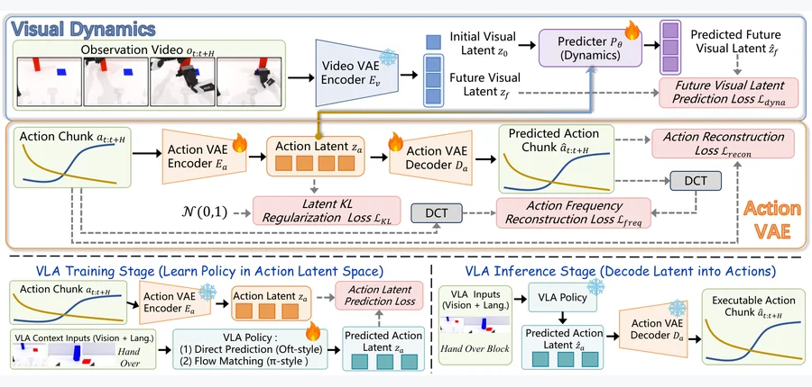 arXiv New 2026-10-07 · cs.RO · #26 **[ViDAL: A Visual Dynamics-Grounded Action Latent Space for Vision-Language-Action Models](https://arxiv.org/abs/2610.08150)** Yuan Xu, Yixiang Chen, Qisen Ma, Jiabing Yang, Peiyan Li, Kai Wang, Jianhua Yang, Jianlou Si, Jun Huang, Jing Liu, Nianfen… 机构：CASIA / UCAS / Alibaba Group / FiveAges（arXiv HTML 作者栏） [Paper](https://arxiv.org/abs/2610.08150) · [图源](https://arxiv.org/html/2610.08150v1/method2.png) 

中文摘要
视觉语言动作（VLA）模型已成为机器人策略学习的重要范式，通常以原始动作块、离散动作 token 或连续动作潜变量三种形式预测动作。然而已有动作表示主要建模动作轨迹，很少考虑这些动作引起的视觉动力学。我们提出 ViDAL，一个以场景未来视觉动力学为锚的视觉动力学约束动作潜空间。具体而言，通过训练动作变分自编码器（Action VAE）重建动作块，并使其潜变量与未来场景动力学对齐，ViDAL 学习动作潜空间。集成进下游机器人策略时，该 Action VAE 充当兼容多种 VLA 架构的即插即用动作接口，并可选择额外预测未来视频。实验中，ViDAL 在 LIBERO 上平均成功率达到 98.1%，优于所比较的基线；在 RoboTwin 2.0 的 50 项双臂任务上，多任务 π₀.₅ 策略的成功率从 54.3% 提至 65.5%（Clean），从 33.2% 提至 43.1%（Random）；在真实单臂 Franka 和双臂 ARX 平台上，成功率绝对增益分别为 20.0% 和 23.4%。 <a href="https://arxiv.org/abs/2610.08150">原摘要来源</a>
 | 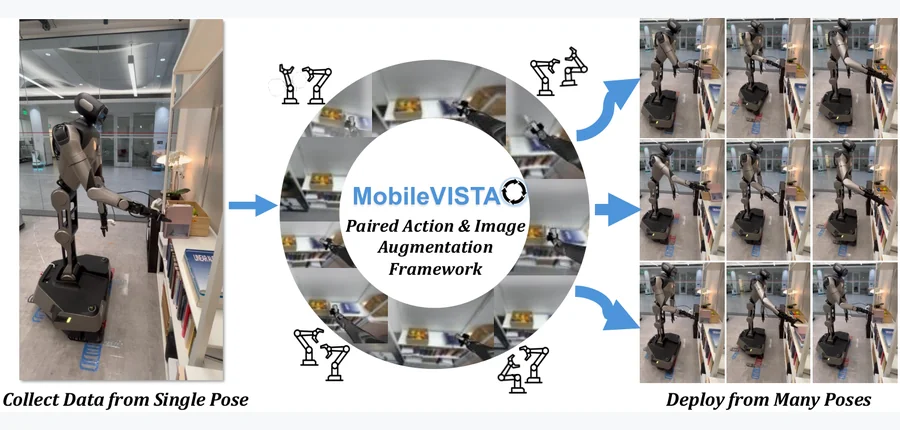 arXiv New 2026-10-07 · cs.RO · #27 **[MobileVISTA: Generative Data Augmentation for Pose Generalization in Mobile Manipulation](https://arxiv.org/abs/2610.07511)** Suzannah Wistreich, Stephen Tian, Isabella Huang, Vitor Campagnolo Guizilini, Sergey Zakharov, Katherine Liu, Jiajun Wu 机构：Stanford University / Toyota Research Institute（PDF 首页） [Paper](https://arxiv.org/abs/2610.07511) · [Project](https://mobilevista.github.io/) · [图源](https://arxiv.org/html/2610.07511v1/teaser.png) 

中文摘要
人形机器人等移动操作平台越来越多地在动态、非结构化环境中执行灵巧操作。但若端到端操作策略只模仿单一机器人位姿下采集的示范，就会很脆弱：部署时机器人位姿哪怕偏离几厘米，都可能使第一人称观测和末端轨迹超出训练分布，造成性能骤降。我们提出 MobileVISTA，把标准位姿下采集的示范变成多样的位姿扰动训练数据，同时（1）增强第一人称视觉观测，（2）重定向动作以补偿底座位姿变化。此前方法往往假定相机刚性装在运动链之外，或大部分复杂的关节机器人几何不在画面中；MobileVISTA 则面向人形机器人等第一人称平台，其相机会受到机器人运动链影响，同时也必须观察该运动链。我们在涵盖人形与双臂形态的仿真任务，以及真实 Galaxea R1 Pro 上研究 MobileVISTA。结果显示，用 MobileVISTA 增强数据训练的策略，在测试时面对此前分布外的位姿更稳健，无需额外采集示范或训练生成模型。此外，在所测试的人形机器人上，其收益最大，因为相机随运动链移动且机器人占据画面较大区域。更多视频与附录见 https://mobilevista.github.io。 <a href="https://arxiv.org/abs/2610.07511">原摘要来源</a>
 |
| 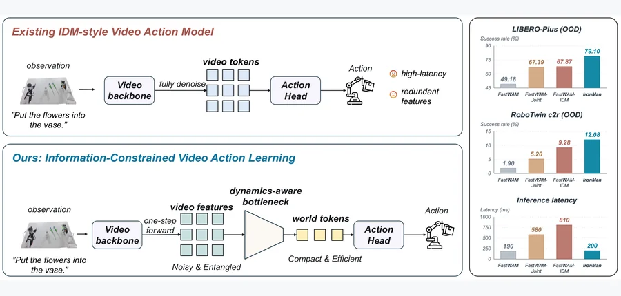 arXiv New 2026-10-07 · cs.RO · #28 **[IronMan: Information-Constrained Video-Action Learning for Robot Manipulation](https://arxiv.org/abs/2610.07961)** Yuanshuo Zhang, Wenzhe Zhao, Zixing Lei, Bin Chen, Siheng Chen 机构：Shanghai Jiao Tong University / JD Joy Future Academy（PDF 首页） [Paper](https://arxiv.org/abs/2610.07961) · [Project](https://youngsoul0731.github.io/ironman-project-page/) · [图源](https://arxiv.org/html/2610.07961v1/motivation.png) 

中文摘要
视频动作模型（VAM）把视觉动力学建模与机器人操作的动作生成结合起来。然而视频表示并非天然适合生成动作；让动作策略接触过多视觉细节可能损害泛化。因此，我们提出 IronMan，一个基于信息瓶颈原则的稳健视频动作学习框架。其核心是在抑制无关视觉信息的同时保留与动作有关的动力学线索。IronMan 采用动力学感知瓶颈，把嘈杂、纠缠的单步视频特征蒸馏成紧凑的世界表示。大量仿真与真实实验显示，它保持高效推理，同时在分布内（ID）表现和分布外（OOD）稳健性方面表现较强。IronMan 在 LIBERO 和 RoboTwin clean2clean 上的成功率分别为 99.0% 与 79.4%，优于全部所评估基线。面对 OOD 偏移时，它在 LIBERO-Plus 上达到 79.1% 的成功率，比最强基线高 10.4 个百分点。项目页：https://youngsoul0731.github.io/ironman-project-page/。 <a href="https://arxiv.org/abs/2610.07961">原摘要来源</a>
 | 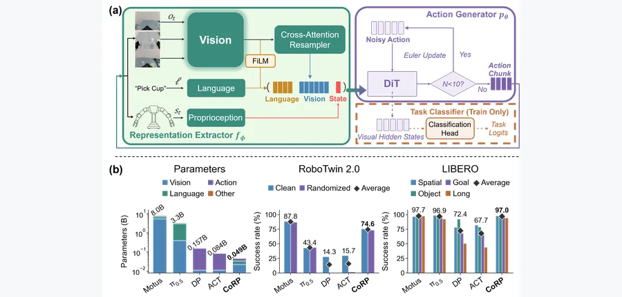 arXiv New 2026-10-07 · cs.RO · #29 **[Compact Robot Policies Need Fine-Grained Visual Representations](https://arxiv.org/abs/2610.08183)** Nanhe Chen, Runqiu Yang, Jiawei Tang, Sichao Liu, Yuquan Wang 机构：X Square Robot / KTH（PDF 首页） [Paper](https://arxiv.org/abs/2610.08183) · [Project](https://corp-policy.github.io/) · [图源](https://arxiv.org/html/2610.08183v1/figures/architecture_v2.png) 

中文摘要
多任务操作策略在架构、规模和预训练先验上往往同时不同，因此已有比较难以把性能归因于单一组件。我们认为性能主要来自视觉表示，参数规模和生成式先验的影响相对次要。为检验这一观点，我们构建 CoRP（压缩表示策略）：一个刻意设计得较小的策略，含 48.9M 参数，不使用视觉语言模型或视频生成先验，由表示提取器和流匹配动作生成器组成。它在 LIBERO 达到 97.0%，在 RoboTwin 2.0 Clean/Randomized 达到 75.78%/73.36%，与大 40.9–163.6 倍的系统相当。固定动作生成器后，我们逐项改变提取器属性。预训练初始化至关重要：随机初始化的 ViT-S/14 在 LIBERO 降至 78.1%，ImageNet ResNet-34 降至 74.5%。仅有预训练还不够，冻结编码器使成绩下降 19.8 个百分点。压缩同样重要：每个视角重采样成 48 个 token，优于传入全部图像块 token（97.0% 对 83.2%）；这些 token 上的变分信息瓶颈又不如硬性 token 预算，因为它抑制了策略依赖的指令条件 token 选择，使 LIBERO-Goal 从 95.8% 降至 33.0%。语言条件只在观测不能明确目标时有贡献（LIBERO-Goal：9.2% 至 95.8%）；在观测没有歧义的 RoboTwin 2.0 上，去除语言条件反而略微提高成功率。因此我们认为，紧凑策略的有效性依赖预训练、任务适应和压缩后的表示。项目页：https://corp-policy.github.io/。 <a href="https://arxiv.org/abs/2610.08183">原摘要来源</a>
 | 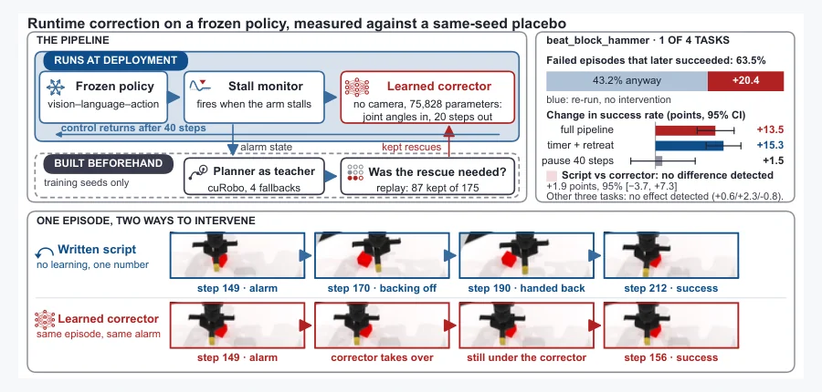 arXiv New 2026-10-07 · cs.RO · #30 **[Does a Learned Corrector Beat a Simple Retreat? Evidence from a Frozen VLA](https://arxiv.org/abs/2610.06921)** Chenchao Sheng, Zhuang Jiang, Liuhaichen Yang, Ningwei Bai, Zezhi Tang 机构：University College London（PDF 首页） [Paper](https://arxiv.org/abs/2610.06921) · [图源](https://arxiv.org/html/2610.06921v1/fig1_pipeline_protocol.png) 

中文摘要
在给冻结的视觉语言动作（VLA）策略部署运行时恢复机制之前，必须确认干预的收益超过普通运行间波动，其复杂度也确实比简单动作带来附加价值。我们在四项 RoboTwin 任务上用冻结的 π₀.₅ 策略评估这些问题。对每个测试种子，我们配对有无纠正的展开，并加入同种子基础策略重新运行作为安慰剂对照。种子聚类置信区间与预先规定的比较规则用于评估净收益，排除随机结果变化。在 3,888 对回合中，完整流程把 beat_allowbreak block_allowbreak hammer 任务的成功率提高 13.5 个百分点（95% 区间为 +9.4 至 +17.7），但在部署权重下其余三项任务未见可检测的收益。对于这一有效任务中基础策略失败的回合，简单重跑也有 43.2% 成功，纠正后为 63.5%；因此许多表面上的恢复来自基础策略自身的随机性。固定时间触发并按脚本返回更早的关节构型也带来净收益，且在两轮实验中与学习流程没有检测到差异，尽管预设的等效性判据并非始终满足。暂停或恒定动作对照没有取得相近收益。在此基准上，是否干预高度依赖任务；成对安慰剂与简单退回基线是识别学习型纠正器实际贡献所必需的。 <a href="https://arxiv.org/abs/2610.06921">原摘要来源</a>
 |
| 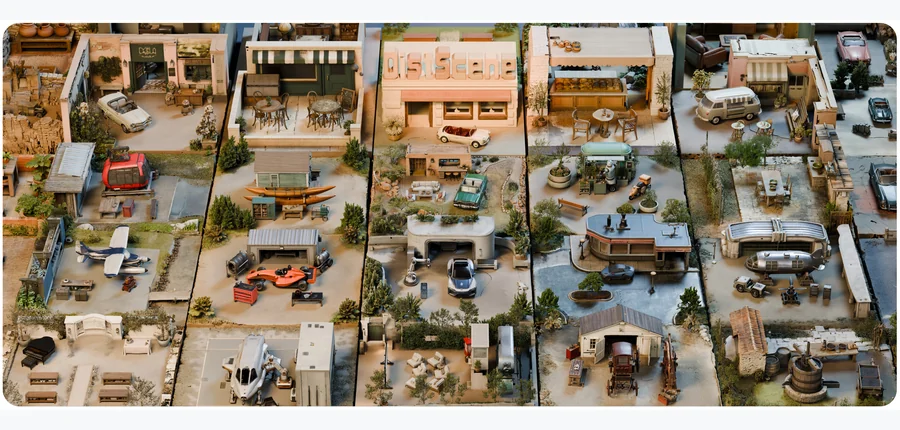 arXiv New 2026-10-07 · cs.CV · #31 **[DistScene: Object-to-Scene Distillation for 3D Scene Generation](https://arxiv.org/abs/2610.06960)** Kunming Luo, Hongyu Yan, Ken Deng, Chengcheng Zhou, Tianyu Liu, Haipeng Li, Haibin Huang, Xuelong Li, Ping Tan 机构：HKUST / TeleAI（PDF 首页） [Paper](https://arxiv.org/abs/2610.06960) · [Project](https://coolbeam.github.io/DistScene/) · [图源](https://arxiv.org/html/2610.06960v1/teaser.png) 

中文摘要
我们提出 DistScene，一个从单张图像生成可组合三维场景的框架，同时建模环境和单个物体。不同于主要把场景表示成物体集合的已有方法，我们将环境视为显式场景组件，为物体放置提供几何上下文。具体而言，场景框架生成模块在共享坐标系内联合生成分离的环境与物体组件，使其几何和相对位置一同被学习。随后，物体中心细化模块结合场景上下文，在局部坐标系中细化每个物体。最后，物体到场景蒸馏通过自动组合并渲染的合成场景，把预训练的物体生成先验迁移到场景生成。室内和室外基准评估显示，相比所评估基线，场景层面的空间一致性得到改善。项目页：https://coolbeam.github.io/DistScene/。 <a href="https://arxiv.org/abs/2610.06960">原摘要来源</a>
 | 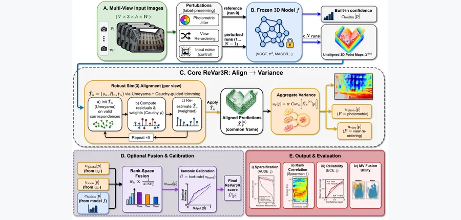 arXiv New 2026-10-07 · cs.CV · #32 **[Revar3r: gauge-aware perturbation uncertainty for feed-forward 3d reconstruction](https://arxiv.org/abs/2610.07883)** Sammam Mahdi, Fariha Binta Salim, Rakin Bin Rabbani, Aniqua Nusrat Zereen 机构：BRAC University / Mahidol University（PDF 首页） [Paper](https://arxiv.org/abs/2610.07883) · [图源](https://arxiv.org/html/2610.07883v1/pipeline.png) 

中文摘要
即便一个远处点被正确重建，当冻结三维模型处理等价输入时，如果输出坐标框架发生微小旋转，它仍会显得不确定。这暴露了无需训练的扰动不确定性估计的弱点：输出存在未观测到的对称性时，多次运行间的变化可能反映的是对称性而非误差。已有替代方案各有取舍：内置置信度在多数评估条件下被超越，而训练的证据式预测头需要针对具体模型的监督。对于点图，本研究推导出一个闭式、与误差无关、随场景尺度增长且可能压倒目标信号的方差项。仿真重现了该效应；测试的全部 30 组真实 VGGT 视角集合都呈现其预测的 &#124;&#124;x_p&#124;&#124;² 特征。ReVar3R 在计算逐点方差前，先把预测结果稳健配准到共同的相似变换坐标系，无需重训或修改冻结模型。可选的标定和融合使用留出数据划分。在六个数据集的 VGGT、π3 和 MASt3R 上，同一估计器对每个骨干模型，在 18 种条件中的 15 种将 AUSE 降到内置置信度以下。分阶段评估中，免标签核心方法赢得 18 种条件中的 11 种，免标签等权融合赢得 12 种，留出数据学习权重后赢得 14 种，纳入内置信号后赢得 15 种。相较于训练过的证据式预测头，二者有取舍：预测头在训练域内更擅长幅值标定并表现领先，ReVar3R 则无需适应即可跨骨干模型迁移。其排序有助于过滤点，但无法发现稳定的系统性偏差、改善新视角合成，或实现跨域标定迁移。 <a href="https://arxiv.org/abs/2610.07883">原摘要来源</a>
 | 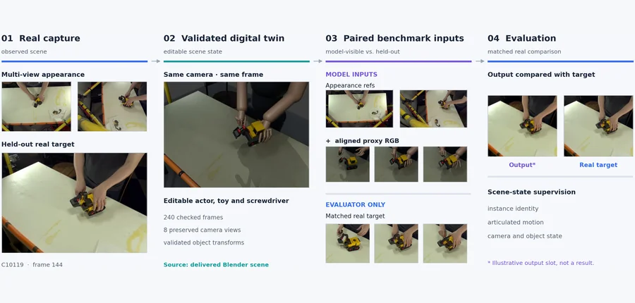 arXiv New 2026-10-07 · cs.CV · #33 **[RenderBench: Benchmarking Render-to-Real Video Transfer with Reconstructed Digital Twins](https://arxiv.org/abs/2610.08684)** Dicong Qiu, Zhiyuan Xu, Yaosheng Liu, Feng Han, Bo Ye 机构：HKUST Guangzhou / Jacobi.ai / Southeast University（PDF 首页） [Paper](https://arxiv.org/abs/2610.08684) · [图源](https://arxiv.org/html/2610.08684v1/figures/figure2_pipeline.png) 

中文摘要
现代视频模型可根据真实外观参考，以及指定场景结构、视角变化和运动的代理渲染，生成逼真视频。评估这种从渲染到真实视频的迁移能力，需要描绘同一场景演变的真实目标视频，并配有可编辑、几何配准的三维复制场景。传统上，这类数据需要大量手工建模、标定和动画制作。我们提出 RenderBench，一个包含 12 个重建真实场景的基准，覆盖大尺度室内环境与第一人称视角，并包括静态和动态设置。构建流程结合视觉几何、神经重建和辅助三维制作；每个场景拆分为静态物体与动态主体，配准到采集相机，并仅在通过多视角几何及时间验证后收录。每个评估单元含外观参考图像、留出的真实目标视频、可编辑数字孪生、匹配的代理渲染和渲染器原生场景标注。我们对照成对真实目标视频评估迁移模型，保留与 PAI-Bench-C 兼容的结构投影，并利用场景标注按物体、可见性、关节和运动定位失败。首版保留 14 个已配准样本中的 12 个（85.7%），共 1,496 对真实—代理帧。所有发布场景通过文件完整性和环境编辑审计；代理诊断的深度 si-RMSE 为 0.2170、实例 mIoU 为 0.3673。RenderBench 提供成对真实观测和可编辑场景状态，可评估外观保真以及几何与动力学的保留程度。 <a href="https://arxiv.org/abs/2610.08684">原摘要来源</a>
 |
<!-- PAPER_CARDS_END -->

## 检索概况

- **检索窗口**：北京时间 2026-10-08 09:00；arXiv 官方 New 列表显示 2026-10-07（星期三）批次。
- **来源**：官方 [cs](https://arxiv.org/list/cs/new?show=2000)、[physics](https://arxiv.org/list/physics/new?show=2000)、[cond-mat](https://arxiv.org/list/cond-mat/new?show=2000)、[math](https://arxiv.org/list/math/new?show=2000)、[stat.ML](https://arxiv.org/list/stat.ML/new?show=2000)、[eess.IV](https://arxiv.org/list/eess.IV/new?show=2000)、[eess.SY](https://arxiv.org/list/eess.SY/new?show=2000)、[eess.SP](https://arxiv.org/list/eess.SP/new?show=2000) 列表。
- **总命中与入选**：八类共 1,662 条 New 列表记录，按 arXiv ID 去重后 1,593 篇；Cross 297 条、Replacement 924 条。依据标题与原摘要，主榜入选 **33 篇**。
- **材料状态**：33 篇官方原摘要及完整中文译文，33 张来自对应论文 arXiv HTML 的图；缺摘要 **0 篇**、缺图 **0 篇**，机构未可靠确认 **1 篇**。
- **标注**：标题、作者、分类、摘要方法和论文报告的结果为 `[事实]`；相关性、机构强度、优先级、局限与改进建议为 `[推断]`。

## Top papers

下表相关性、机构强度和阅读优先级均为日报推断。

| # | 标题 | 来源 | 分类 | 作者 | 机构 | 相关性（推断） | 机构强度（推断） | 阅读优先级（推断） |
|---:|---|---|---|---|---|---|---|---|
| 1 | DepthWorld: 3D World Model for Robot Manipulation | [arXiv:2610.08780](https://arxiv.org/abs/2610.08780) | cs.RO | Jai Bardhan, Josef Sivic, Vladimir Petrik | Czech Technical University in Prague（arXiv HTML 作者栏） | 极高 | 中 | 高 |
| 2 | 4D-HOF: Hand-Object Flow Matching for Feed-Forward 4D Interaction Reconstruction | [arXiv:2610.08782](https://arxiv.org/abs/2610.08782) | cs.CV | Shiqi Li, Sean Cho, Yijie Li, Fengzhi Guo, Bowen Wen, Cheng Zhang | Texas A&M University / NVIDIA（PDF 首页） | 极高 | 强 | 高 |
| 3 | PhysTacGen: Physics-Aware Visual-Tactile Sensor Image Generation | [arXiv:2610.08068](https://arxiv.org/abs/2610.08068) | cs.CV | Guo Tang, Yongtao Wang | Peking University / VGI Labs（PDF 首页） | 极高 | 强 | 高 |
| 4 | ImpactMat: Continuous Material Estimation for Inverse Impact Sound Rendering | [arXiv:2610.07061](https://arxiv.org/abs/2610.07061) | cs.SD | Hyebin Cho, Bumsoo Kim, Joon son Chung | KAIST / Chung-Ang University（PDF 首页） | 极高 | 强 | 高 |
| 5 | Post-Grasp Kinematic Repair for Robotic Insertion via Object-in-Gripper Reorientation | [arXiv:2610.08421](https://arxiv.org/abs/2610.08421) | cs.RO | Haegu Lee, Christoffer Sloth | University of Southern Denmark（PDF 首页） | 极高 | 中 | 高 |
| 6 | Learning Grasp Targeting from Point Clouds for Log Pile Clearing on a Hydraulic Crane | [arXiv:2610.07613](https://arxiv.org/abs/2610.07613) | cs.RO | George Sideris, Lucas Bessai, Heshan Fernando, Elie Ayoub, Nicolas Lemieux, Inna Sharf | McGill University / FPInnovations（PDF 首页） | 极高 | 强 | 高 |
| 7 | Model-Based Geometry-Aware Generative Optimization for Constrained Locomotion Planning | [arXiv:2610.07772](https://arxiv.org/abs/2610.07772) | cs.RO | Zhilin He, Xinyuan Wang, Changliu Liu | Carnegie Mellon University / University of Michigan（arXiv HTML 作者栏） | 极高 | 强 | 高 |
| 8 | iGPC: Generative Motion Priors for Object-Aware Humanoid Interaction | [arXiv:2610.08120](https://arxiv.org/abs/2610.08120) | cs.RO | Anujith Muraleedharan, Abdul Ahad Butt, Nolan Fey, Yash Prabhu, Anamika J H, Sandor Felber, Maurice Rahme, Ivan Laptev | MBZUAI / MIT / Minerva Humanoids（PDF 首页） | 极高 | 强 | 高 |
| 9 | BRACE: Adapting Whole-Body References for Force and Terrain Aware Humanoid Motion Tracking | [arXiv:2610.07052](https://arxiv.org/abs/2610.07052) | cs.RO | Sudarshan Harithas, Chen Yu, Juan Borbon, Shubhankar Mondal, Winston Zha, Srinath Sridhar, Dingqi Zhang, Jiuguang Wang | Multiply Labs / Brown University / University of New Mexico（PDF 首页） | 极高 | 强 | 高 |
| 10 | Nine Trials to Recover: A Reproducible Benchmark for Repertoire-Free Soft-Robot Damage Adaptation | [arXiv:2610.07616](https://arxiv.org/abs/2610.07616) | cs.RO | Siyuan Zhang | University of Michigan（arXiv HTML 作者栏） | 极高 | 强 | 高 |
| 11 | MIM-VLA: Learning Physical Interaction Representations from Gripper Motor Feedback | [arXiv:2610.08425](https://arxiv.org/abs/2610.08425) | cs.RO | Jaeyoung Lee, Jiyeon Koo, Taehwa Kim, Yerin Cha, Andrew Jaeyong Choi | Gachon University（PDF 首页） | 极高 | 中 | 高 |
| 12 | Feeling Through the Load: Compliant Quadruped Locomotion under Payload Interactions | [arXiv:2610.08637](https://arxiv.org/abs/2610.08637) | cs.RO | Shaunak A. Mehta, Mayank Mishra, Prajit KrisshnaKumar, Sebastian Scherer, Koichiro Niinuma | Fujitsu Research of America / Carnegie Mellon University（PDF 首页） | 极高 | 强 | 高 |
| 13 | PEARS: Physical-Prior-Guided Efficient Adaptation via Failure Reasoning and Diffusion Steering for Tactile Manipulation | [arXiv:2610.08784](https://arxiv.org/abs/2610.08784) | cs.RO | Kun Song, Yiming Wang, Yilin Chen, Tianyi Ding, Jiaxin Tian, Tianqi Gong, Daolin Ma, Jia Pan | University of Hong Kong / Shanghai Jiao Tong University / Xense Robotics / University of Pennsylvania（PDF 首页） | 极高 | 强 | 高 |
| 14 | ReDex: Repairing Sim-to-Real Dexterous Policies by Finger-Level Compliant Interaction | [arXiv:2610.07525](https://arxiv.org/abs/2610.07525) | cs.RO | Jinzhou Li, Hadi Tabatabaee, Kelin Yu, Yuyin Sun, Cheng-Hao Kuo, Roberto Martín-Martín, Nima Fazeli, X. Alice Wu, Xianyi Cheng | Amazon / Duke University / University of Maryland / UT Austin / University of Michigan（PDF 首页） | 极高 | 强 | 高 |
| 15 | TacZero: Training-Free Peg Insertion Using a General-Purpose Vision-Language Model with Tactile Feedback | [arXiv:2610.07621](https://arxiv.org/abs/2610.07621) | cs.RO | Kazutoshi Tanaka | OMRON SINIC X（arXiv HTML 作者栏） | 极高 | 中 | 高 |
| 16 | SMART: Zero-Shot Sim-to-Real Articulated Object Manipulation via Large-Scale Synthetic Pretraining | [arXiv:2610.07652](https://arxiv.org/abs/2610.07652) | cs.RO | Jicong Ao, Shuhan Jiang, Yuling Zhong, Yanwen Liu, Yuhan Gao, Jiangyuan Zhao, Yang Zhang, Shiqiang Zhu, Chenjia Bai, Xuelong Li | China Telecom / Technical University of Munich / Harbin Institute of Technology（arXiv HTML 作者栏） | 极高 | 强 | 高 |
| 17 | SURGE: Sonar-fUsed Reconstruction and localization via image-gated Graph Estimation | [arXiv:2610.07472](https://arxiv.org/abs/2610.07472) | cs.RO | Mohammed Ibrahim M, Vallabh Deogaonkar, Trung Dong, Jane Shin, Abhilash Somayajula, Xiaomin Lin | University of South Florida / IIT Madras / Seoul National University（PDF 首页） | 极高 | 强 | 高 |
| 18 | Magnet-Aware Control of Legged Robots | [arXiv:2610.08653](https://arxiv.org/abs/2610.08653) | cs.RO | J. Playan Garai, S. B. Djuve, C. McGreavy, M. Khadiv | Technical University of Munich / CERN（PDF 首页） | 极高 | 强 | 高 |
| 19 | PIE-PS: Photometric Stereo from Physical Irradiance Event Streams | [arXiv:2610.08188](https://arxiv.org/abs/2610.08188) | cs.CV | Xiangze Meng, Guangyu Li, Jing Li, Di Mei, Songchen Ma, Mingkun Xu, Rui Ma | Jilin University / Guangdong Institute of Intelligence Science and Technology / Beijing Institute of Technology / HKUST（PDF 首页） | 高 | 强 | 中高 |
| 20 | Artemis: Geometry-Grounded Multi-Agent Driving World Models with Shared 3D State and Progressive Memory Update | [arXiv:2610.07031](https://arxiv.org/abs/2610.07031) | cs.CV | Sitian Shen, Jiuming Liu, Mengmeng Liu, Yian Wang, Michael Ying Yang, Francesco Nex, Hao Cheng, Daniele De Martini, Ayush Tewari, Per Ola Kristensson | University of Cambridge / University of Oxford / University of Twente / NUS / University of Bath（PDF 首页） | 高 | 强 | 中高 |
| 21 | Digital Twin-Driven Real2Sim2Real: Simulator-Conditioned Generation via Paired Driving-Scene Reconstruction | [arXiv:2610.08339](https://arxiv.org/abs/2610.08339) | cs.CV | Hojun Lim, Hyeongseok Jeon, Donghyun Kim, Soonyoung Jung, Heecheol Yoo | Technical University of Munich / MORAI / Hyundai Motor / Seoul National University（PDF 首页） | 高 | 强 | 中高 |
| 22 | ElasticFit: Fit-Aware 3D Object Insertion via VLM Reasoning and Generative Adaptation | [arXiv:2610.07460](https://arxiv.org/abs/2610.07460) | cs.CV | Tzu-Hsin Hsieh, Ricardo Marroquim | Delft University of Technology（arXiv HTML 作者栏） | 高 | 强 | 中高 |
| 23 | Mechanics of a Model Frictional Knitted Fabric | [arXiv:2610.07372](https://arxiv.org/abs/2610.07372) | cond-mat.soft（非 cs） | Laura Michel, Antoine Faulconnier, Audrey Steinberger, Samuel Poincloux, Jérôme Crassous | CNRS / ESPCI Paris / ENS de Lyon / Aoyama Gakuin University / Université de Rennes（PDF 首页） | 高 | 强 | 中高 |
| 24 | Inverse-Designed Anisotropic Intrastromal Corneal Exoskeletons for Keratoconus: A Three-Dimensional Computational Feasibility Study | [arXiv:2610.08529](https://arxiv.org/abs/2610.08529) | physics.bio-ph（非 cs） | J. Sumaya-Martinez, Alan Altamirano | Universidad Autónoma del Estado de México / Centro de Microcirugía Ocular（PDF 首页） | 高 | 中 | 中高 |
| 25 | An associated model of Coulomb friction based on the real area of contact | [arXiv:2610.08535](https://arxiv.org/abs/2610.08535) | physics.app-ph（非 cs） | Manon Thbaut, Laura De Lorenzis | affiliation 未确认 | 高 | 待核 | 中高 |
| 26 | ViDAL: A Visual Dynamics-Grounded Action Latent Space for Vision-Language-Action Models | [arXiv:2610.08150](https://arxiv.org/abs/2610.08150) | cs.RO | Yuan Xu, Yixiang Chen, Qisen Ma, Jiabing Yang, Peiyan Li, Kai Wang, Jianhua Yang, Jianlou Si, Jun Huang, Jing Liu, Nianfeng Liu, Yan Huang, Liang Wang | CASIA / UCAS / Alibaba Group / FiveAges（arXiv HTML 作者栏） | 中高 | 强 | 中 |
| 27 | MobileVISTA: Generative Data Augmentation for Pose Generalization in Mobile Manipulation | [arXiv:2610.07511](https://arxiv.org/abs/2610.07511) | cs.RO | Suzannah Wistreich, Stephen Tian, Isabella Huang, Vitor Campagnolo Guizilini, Sergey Zakharov, Katherine Liu, Jiajun Wu | Stanford University / Toyota Research Institute（PDF 首页） | 中高 | 强 | 中 |
| 28 | IronMan: Information-Constrained Video-Action Learning for Robot Manipulation | [arXiv:2610.07961](https://arxiv.org/abs/2610.07961) | cs.RO | Yuanshuo Zhang, Wenzhe Zhao, Zixing Lei, Bin Chen, Siheng Chen | Shanghai Jiao Tong University / JD Joy Future Academy（PDF 首页） | 中高 | 强 | 中 |
| 29 | Compact Robot Policies Need Fine-Grained Visual Representations | [arXiv:2610.08183](https://arxiv.org/abs/2610.08183) | cs.RO | Nanhe Chen, Runqiu Yang, Jiawei Tang, Sichao Liu, Yuquan Wang | X Square Robot / KTH（PDF 首页） | 中高 | 中 | 中 |
| 30 | Does a Learned Corrector Beat a Simple Retreat? Evidence from a Frozen VLA | [arXiv:2610.06921](https://arxiv.org/abs/2610.06921) | cs.RO | Chenchao Sheng, Zhuang Jiang, Liuhaichen Yang, Ningwei Bai, Zezhi Tang | University College London（PDF 首页） | 中高 | 强 | 中 |
| 31 | DistScene: Object-to-Scene Distillation for 3D Scene Generation | [arXiv:2610.06960](https://arxiv.org/abs/2610.06960) | cs.CV | Kunming Luo, Hongyu Yan, Ken Deng, Chengcheng Zhou, Tianyu Liu, Haipeng Li, Haibin Huang, Xuelong Li, Ping Tan | HKUST / TeleAI（PDF 首页） | 中高 | 强 | 中 |
| 32 | Revar3r: gauge-aware perturbation uncertainty for feed-forward 3d reconstruction | [arXiv:2610.07883](https://arxiv.org/abs/2610.07883) | cs.CV | Sammam Mahdi, Fariha Binta Salim, Rakin Bin Rabbani, Aniqua Nusrat Zereen | BRAC University / Mahidol University（PDF 首页） | 中高 | 中 | 中 |
| 33 | RenderBench: Benchmarking Render-to-Real Video Transfer with Reconstructed Digital Twins | [arXiv:2610.08684](https://arxiv.org/abs/2610.08684) | cs.CV | Dicong Qiu, Zhiyuan Xu, Yaosheng Liu, Feng Han, Bo Ye | HKUST Guangzhou / Jacobi.ai / Southeast University（PDF 首页） | 中高 | 强 | 中 |

## 逐篇中文要点

### 1. [DepthWorld: 3D World Model for Robot Manipulation](https://arxiv.org/abs/2610.08780)

- [事实] 将双目深度与联合因子图用于 DROID 多回合标定，形成有度量深度和多视角外参的 DROID-3D。
- [事实] DepthWorld 联合预测多视角 RGB 与深度；相同预算下 RGB PSNR 比纯 RGB 基线高 1.48 dB。
- [推断] 应分别检验预测深度在长时接触、遮挡后重现与跨机器人标定中的一致性，避免只凭逐帧画质判断物理可用性。

### 2. [4D-HOF: Hand-Object Flow Matching for Feed-Forward 4D Interaction Reconstruction](https://arxiv.org/abs/2610.08782)

- [事实] 以视觉基础模型的粗估计为起点，用条件流匹配前馈修正手物四维状态。
- [事实] 测试时把物理交互约束和二维观测直接用于生成过程中的引导；摘要报告域外基准领先。
- [推断] 可单独关闭接触约束与二维引导，比较真实接触误差、物体穿透率和推理时间。

### 3. [PhysTacGen: Physics-Aware Visual-Tactile Sensor Image Generation](https://arxiv.org/abs/2610.08068)

- [事实] GTPO 产生材料描述，DINOv2 与单目深度筛选配对并提供几何条件，SDXL ControlNet 合成光学触觉图像。
- [事实] 论文报告结构相似性、盲测偏好及力系数预测代理任务的提升。
- [推断] 需要检验合成触觉对真实控制策略的收益，代理任务改善不足以证明接触操作成功。

### 4. [ImpactMat: Continuous Material Estimation for Inverse Impact Sound Rendering](https://arxiv.org/abs/2610.07061)

- [事实] ImpactMat 配对单一和混合材料的冲击声与真实材料参数，并训练前馈逆参数估计器。
- [事实] 论文报告优于比较基线，并能从真实录音重渲染而无需手动调参。
- [推断] 可固定几何和敲击条件，测试材质参数估计对接触位置变化的可辨识性。

### 5. [Post-Grasp Kinematic Repair for Robotic Insertion via Object-in-Gripper Reorientation](https://arxiv.org/abs/2610.08421)

- [事实] 用感知逆运动学分支的图最大化插入路径最小可行性裕度，再以触觉外在操作执行重定向。
- [事实] UR5e 仿真中平均重定向量减少 51.5%；学习排序又使平均规划时间减少 51.1%，并有真实机器人验证。
- [推断] 可加入物体在夹爪内滑移的扰动，检验重定向后可行性裕度是否仍可靠。

### 6. [Learning Grasp Targeting from Point Clouds for Log Pile Clearing on a Hydraulic Crane](https://arxiv.org/abs/2610.07613)

- [事实] 策略直接从未分割点云选择原木堆抓取点、深度与抓斗朝向，并在液压起重机上运行。
- [事实] 12 次现场试验中 BC 与 BC→RL 分别投放库存的 93.8% 与 88.9%；仿真载荷稳定性增益未迁移到实机。
- [推断] 应分析点云遮挡、原木间摩擦与液压执行延迟各自造成的仿真到真实差距。

### 7. [Model-Based Geometry-Aware Generative Optimization for Constrained Locomotion Planning](https://arxiv.org/abs/2610.07772)

- [事实] 2GO 将活动约束几何变成去噪算子，包括法向度量塑形、切空间随机过滤和 CFS 回缩。
- [事实] 论文报告在四足和人形的落脚点选择及姿态规划中，提高成功率并减少违规。
- [推断] 可固定采样预算，只替换单个几何算子，测量成功率与接触违规的贡献。

### 8. [iGPC: Generative Motion Priors for Object-Aware Humanoid Interaction](https://arxiv.org/abs/2610.08120)

- [事实] 把 GPC 扩展为由场景可供性和特权状态条件化的交互专家，再蒸馏给使用机载观测的学生。
- [事实] 覆盖伸手、抓支撑物稳定和推物等接触行为；摘要报告多项全身交互任务有效。
- [推断] 需要将接触状态错误与全身平衡失败分开统计，判断运动先验的真实贡献。

### 9. [BRACE: Adapting Whole-Body References for Force and Terrain Aware Humanoid Motion Tracking](https://arxiv.org/abs/2610.07052)

- [事实] BRACE 把坡度和目标手部力纳入全身参考，分别训练施力与补偿教师并蒸馏为本体感觉学生。
- [事实] 摘要报告在 Unitree G1 的仿真和实机上执行施力、补偿及多地形任务。
- [推断] 应量化未知坡度和载荷变化时的实测手部力误差与足底滑移率。

### 10. [Nine Trials to Recover: A Reproducible Benchmark for Repertoire-Free Soft-Robot Damage Adaptation](https://arxiv.org/abs/2610.07616)

- [事实] 九次在线试验的损伤恢复基准保留名义回退控制器，并将开发身体与评估身体分开。
- [事实] GP-EI 在 75 个确认身体中的 69 个改善最差掩码收益，但与 TuRBO 的配对区间包含零。
- [推断] 可用相同九次预算测试低维接触先验，重点验证是否在严格安全门槛下仍有收益。

### 11. [MIM-VLA: Learning Physical Interaction Representations from Gripper Motor Feedback](https://arxiv.org/abs/2610.08425)

- [事实] MIM 将夹爪电流、位置、速度和有效性编码为 128 维交互 token，只影响 SmolVLA 的夹爪动作通路。
- [事实] 13 对物体中选择较高阻力物体的比例为 75.0%，基线为 48.8%。
- [推断] 应对比独立电流阈值和短时间窗特征，确认 token 真能表达接触阶段而非只读出阻力大小。

### 12. [Feeling Through the Load: Compliant Quadruped Locomotion under Payload Interactions](https://arxiv.org/abs/2610.08637)

- [事实] 把载荷上的外部交互视为命令，结合顺应式运载策略与因果力估计器。
- [事实] 仿真和实机显示可维持稳定负载行走，并顺应人与载荷的交互。
- [推断] 可改变载荷固定程度和人施力位置，测试力估计是否可泛化且不误把惯性当指令。

### 13. [PEARS: Physical-Prior-Guided Efficient Adaptation via Failure Reasoning and Diffusion Steering for Tactile Manipulation](https://arxiv.org/abs/2610.08784)

- [事实] PEARS 用 PFR 根据视觉结果和触觉历史更新接触力边界，再用高频力位控制与冻结策略潜变量引导适应。
- [事实] 仿真成功率较最强任务基线高 12.4–37.4 个百分点，白板擦除和移液管抽吸实机成功率为 95% 与 90%。
- [推断] 应做等回合预算消融，将 VLM 力推理和潜变量引导的贡献及失败类型分开统计。

### 14. [ReDex: Repairing Sim-to-Real Dexterous Policies by Finger-Level Compliant Interaction](https://arxiv.org/abs/2610.07525)

- [事实] ReDex 让人只在选定手指上纠正接触失败，其他手指保持冻结基础策略控制，再以力条件行为克隆训练策略。
- [事实] 实机物体翻转成功率从 14% 提至 86%，螺丝刀旋转平均进度从 26.0% 提至 95.3%。
- [推断] 可比较同等人工时间下的整手遥操作与单指纠正，并评估未见物体形状。

### 15. [TacZero: Training-Free Peg Insertion Using a General-Purpose Vision-Language Model with Tactile Feedback](https://arxiv.org/abs/2610.07621)

- [事实] TacZero 把图像、机器人状态与三轴触觉数值或向量交给通用 VLM 选择动作，无需任务专门训练。
- [事实] 真实圆柱销插入 20 次中有触觉成功 15 次，无触觉成功 10 次。
- [推断] 应加入结构化触觉控制律基线，并报告插入力峰值和卡滞率。

### 16. [SMART: Zero-Shot Sim-to-Real Articulated Object Manipulation via Large-Scale Synthetic Pretraining](https://arxiv.org/abs/2610.07652)

- [事实] SMART-Sim 显式设计关节约束与部件语义，合成超过 100 万条示范，覆盖 2,507 个关节物体。
- [事实] 预训练 VLA 在仿真基准有竞争力，并报告真实关节操作的零样本迁移。
- [推断] 可按关节类型和接触约束分层，查明规模收益是否主要来自对象数量或任务组合。

### 17. [SURGE: Sonar-fUsed Reconstruction and localization via image-gated Graph Estimation](https://arxiv.org/abs/2610.07472)

- [事实] SURGE 在因子图中联合融合相机与声呐观测估计 ROV 位姿及目标位置，再做度量声呐高斯泼溅。
- [事实] 真实水下数据上定位一致性优于纯视觉位姿估计，重建比 RGB 高斯泼溅更紧凑且为原生度量。
- [推断] 可在同一序列人为删除声呐帧或降低能见度，量化尺度漂移与重建质量之间的关系。

### 18. [Magnet-Aware Control of Legged Robots](https://arxiv.org/abs/2610.08653)

- [事实] 在 MuJoCo 加入刚体磁力插件，从四足动力学响应估计隐磁场，并在 MPC/WBC 中补偿磁扰动。
- [事实] 相对无补偿控制器，可抵御最大力扰动提高 2.5 倍，力矩扰动提高 1.6–2 倍，且有实体实验。
- [推断] 需要区分磁场估计误差与控制器鲁棒性，并用未见磁场分布评估安全边界。

### 19. [PIE-PS: Photometric Stereo from Physical Irradiance Event Streams](https://arxiv.org/abs/2610.08188)

- [事实] 由事件触发模型推导相邻事件、移动光源与法线的物理关系，再以 PIE-GNN 与可靠性注意力重建法线。
- [事实] 合成及真实数据上，PIE-PS 优于先前事件式光度立体与直接物理解算基线。
- [推断] 可只替换可靠性权重，测试低照度或阈值漂移下的物理特征是否保持稳定。

### 20. [Artemis: Geometry-Grounded Multi-Agent Driving World Models with Shared 3D State and Progressive Memory Update](https://arxiv.org/abs/2610.07031)

- [事实] Artemis 在多智能体间共享显式三维地图，以动作引导几何控制图和 GeoAdapter 条件化视频生成。
- [事实] 摘要报告 MA-CARLA 上的视觉保真和跨视角一致性提升，并支持二维视频与三维点地图同步展开。
- [推断] 应以碰撞、遮挡后主体重现和多智能体轨迹一致性衡量物理预测，而不只用视觉指标。

### 21. [Digital Twin-Driven Real2Sim2Real: Simulator-Conditioned Generation via Paired Driving-Scene Reconstruction](https://arxiv.org/abs/2610.08339)

- [事实] 通过地理配准数字孪生重建驾驶片段，用几何对齐的仿真渲染条件化扩散式 Sim2Real 生成。
- [事实] DETR3D 在不用目标区图像训练时，达到目标区真实数据理想对照 mAP 的 93.18%。
- [推断] 需要跨地区、天气和地图精度做敏感性试验，确定数字孪生错位对三维检测的影响。

### 22. [ElasticFit: Fit-Aware 3D Object Insertion via VLM Reasoning and Generative Adaptation](https://arxiv.org/abs/2610.07460)

- [事实] ElasticFit 将 VLM 适配线索转为锚定位置、体积、朝向与适配模式，再约束生成网格的碰撞和接触。
- [事实] 固定资源比较中，空间关系成功率从 50.8% 至 69.7%，支撑成功率从 48.3% 至 91.7%。
- [推断] 应增加可承载性和重力稳定性的实测或仿真检查，区分视觉贴合与真实可放置。

### 23. [Mechanics of a Model Frictional Knitted Fabric](https://arxiv.org/abs/2610.07372)

- [事实] 将针织线圈的拉伸、弯曲与纱线摩擦纳入平面弹性线模型，预测多稳定静止构型及单轴拉伸曲线。
- [事实] 尼龙针织织物的线圈尺寸与受力测量用于评估模型的定性和定量有效性。
- [推断] 可加入厚度和三维自接触项，检验高密度织物中平面近似何时失效。

### 24. [Inverse-Designed Anisotropic Intrastromal Corneal Exoskeletons for Keratoconus: A Three-Dimensional Computational Feasibility Study](https://arxiv.org/abs/2610.08529)

- [事实] G-EXO 把角膜基质内增强设计为三维有限元的自由形态光学—生物力学逆问题。
- [事实] 代表性设计的网格细化估计显示眼压引起的彗差约降低 5%；论文明确限定为计算可行性。
- [推断] 下一步应在患者专属几何和非线性各向异性材料下做稳健性与离体验证。

### 25. [An associated model of Coulomb friction based on the real area of contact](https://arxiv.org/abs/2610.08535)

- [事实] 引入由粗糙表面微凸体塑性形变驱动的内部变量，构建与 GSM 兼容的关联摩擦模型。
- [事实] 在压力递减时出现记忆效应，高压时摩擦牵引力饱和；二维有限元基准与库仑预测吻合。
- [推断] 可在三维接触和加载—卸载循环中测试可辨识的穿透深度及能量耗散。

### 26. [ViDAL: A Visual Dynamics-Grounded Action Latent Space for Vision-Language-Action Models](https://arxiv.org/abs/2610.08150)

- [事实] ViDAL 用 Action VAE 同时重建动作块并对齐未来视觉动力学，作为多种 VLA 策略的动作接口。
- [事实] LIBERO 平均成功率 98.1%；RoboTwin 2.0 的 50 项双臂任务及 Franka、ARX 实机均报告改进。
- [推断] 可固定策略骨干和动作解码器，只改变视觉动力学对齐损失，检查收益是否来自未来预测。

### 27. [MobileVISTA: Generative Data Augmentation for Pose Generalization in Mobile Manipulation](https://arxiv.org/abs/2610.07511)

- [事实] MobileVISTA 联合增强第一人称视觉和重定向动作，将单一标准位姿示范扩展到位姿扰动训练数据。
- [事实] 仿真人形与双臂任务及真实 Galaxea R1 Pro 显示对未见底座位姿更稳健，无需额外示范或训练生成模型。
- [推断] 应把相机链误差和动作重定向误差独立扰动，检查真实人形平台的稳定边界。

### 28. [IronMan: Information-Constrained Video-Action Learning for Robot Manipulation](https://arxiv.org/abs/2610.07961)

- [事实] IronMan 通过动力学感知信息瓶颈，把单步视频特征压缩成保留动作相关动态的表示。
- [事实] LIBERO 成功率 99.0%、RoboTwin clean2clean 为 79.4%，LIBERO-Plus 分布外成功率 79.1%。
- [推断] 可将瓶颈按物体运动与背景运动分解，评估遮挡和接触变化下是否丢失关键线索。

### 29. [Compact Robot Policies Need Fine-Grained Visual Representations](https://arxiv.org/abs/2610.08183)

- [事实] CoRP 以 48.9M 参数组合可适应的视觉提取器与流匹配动作生成器，系统比较表示因素。
- [事实] LIBERO 达 97.0%；每视角压缩至 48 token 优于全部图像块 token，冻结编码器下降 19.8 个百分点。
- [推断] 可检验不同遮挡和目标歧义下 token 选择是否仍保留必要的接触视觉信息。

### 30. [Does a Learned Corrector Beat a Simple Retreat? Evidence from a Frozen VLA](https://arxiv.org/abs/2610.06921)

- [事实] 用同种子配对展开和基础策略重跑安慰剂，评估冻结 π₀.₅ 上学习型纠正器的净收益。
- [事实] 3,888 对回合中仅一个任务有可检测的 +13.5 个百分点收益；简单退回动作与学习流程未检出稳定差异。
- [推断] 后续应预注册等效界限，并报告每项任务的重跑成功率，避免把随机重试计作纠错能力。

### 31. [DistScene: Object-to-Scene Distillation for 3D Scene Generation](https://arxiv.org/abs/2610.06960)

- [事实] DistScene 将环境显式建模为组件，在共享坐标系联合生成环境与物体并做物体中心细化。
- [事实] 通过物体到场景蒸馏迁移预训练物体生成先验；室内外基准的空间一致性优于比较基线。
- [推断] 应测量物体支撑、互穿和可交互性，以确认空间一致性不止体现在视觉布局。

### 32. [Revar3r: gauge-aware perturbation uncertainty for feed-forward 3d reconstruction](https://arxiv.org/abs/2610.07883)

- [事实] ReVar3R 在估计逐点扰动方差前，先将冻结模型的点图对齐至共同的相似变换坐标系。
- [事实] VGGT、π3、MASt3R 六数据集上，18 个条件中 15 个的 AUSE 低于内置置信度。
- [推断] 可用稳定系统偏差和动态场景专门测其盲点，并区分几何错误与坐标规范变化。

### 33. [RenderBench: Benchmarking Render-to-Real Video Transfer with Reconstructed Digital Twins](https://arxiv.org/abs/2610.08684)

- [事实] RenderBench 收录 12 个几何配准、可编辑的真实场景数字孪生与匹配代理渲染。
- [事实] 首版有 1,496 对真实—代理帧；深度 si-RMSE 为 0.2170、实例 mIoU 为 0.3673。
- [推断] 可把失败按物体遮挡、关节运动和相机移动分层，检验视频模型是否保留真实动力学。

## 今日最值得细读的 5 篇

1. **[DepthWorld](https://arxiv.org/abs/2610.08780)**：[推断] 将机器人多回合标定、度量深度和视频世界模型放在同一评估链条，值得重点看其几何监督能否改善真实操作规划。
2. **[4D-HOF](https://arxiv.org/abs/2610.08782)**：[推断] 在生成式四维重建过程中直接注入手物物理约束，可重点读接触引导与二维证据的消融。
3. **[Post-Grasp Kinematic Repair](https://arxiv.org/abs/2610.08421)**：[推断] 抓后重定向、可行性裕度与真实触觉执行形成清晰闭环，适合检查接触误差与关节限制之间的关系。
4. **[Model-Based Geometry-Aware Generative Optimization](https://arxiv.org/abs/2610.07772)**：[推断] 将接触与支撑约束写进生成式规划算子，可重点考察每种约束算子的独立贡献。
5. **[PIE-PS](https://arxiv.org/abs/2610.08188)**：[推断] 从事件触发物理方程导出光照与法线特征，再用图模型补足稀疏性，机制与实验分工明确。

## 低算力可改进论文

以下均为方法与实验建议，属于 **[推断]**，不是原论文已验证结论。每项可先在小数据或冻结模型上运行。

1. **[4D-HOF](https://arxiv.org/abs/2610.08782)**：改法：把手物接触约束拆成法向不穿透与切向滑移两项，测试时分别引导流。小实验：固定 20 段视频和模型权重，比较两项消融的穿透率、接触点误差与延迟。低算力原因：只改测试时引导。预期收益：识别约束的实际作用。风险：二维证据噪声可能误导引导。
2. **[Post-Grasp Kinematic Repair](https://arxiv.org/abs/2610.08421)**：改法：为 IK 图边加入夹内姿态不确定性裕度。小实验：在已有插入路径上施加 1–3° 抓取姿态扰动，比较最小可行性裕度与实机成功率。低算力原因：搜索图与小规模扰动，无需训练。预期收益：降低边界解失败。风险：保守裕度可能排除可行解。
3. **[Log Pile Grasping](https://arxiv.org/abs/2610.07613)**：改法：在点云抓取头增加局部支撑/接触密度分支。小实验：冻结主干，仅用少量现场抓取记录拟合分支，比较投放率与载荷稳定性。低算力原因：只训练小头部。预期收益：减小仿真稳定性收益的迁移差距。风险：密度估计受遮挡影响。
4. **[2GO](https://arxiv.org/abs/2610.07772)**：改法：依据支撑余量自适应缩放切空间噪声。小实验：同一四足地形与采样预算下，对比固定噪声和余量条件噪声的违规率。低算力原因：改采样规则即可。预期收益：减少边界违规。风险：可能削弱探索。
5. **[Nine Trials to Recover](https://arxiv.org/abs/2610.07616)**：改法：把历史损伤形态的低维形变特征作为 GP 均值函数。小实验：固定九次试验，在留出身体上比较 GP-EI 与新均值的最差掩码收益和安全门槛通过率。低算力原因：小样本 GP。预期收益：更快恢复。风险：先验跨形态失配。
6. **[MIM-VLA](https://arxiv.org/abs/2610.08425)**：改法：对电流 token 加入接触阶段的一阶变化量与失效掩码。小实验：冻结 SmolVLA，比较原 token、增量 token 和简单阈值在 13 对物体上的识别及脆弱物抓取。低算力原因：只训练交互模块。预期收益：更稳健区分接触状态。风险：电机延迟造成伪变化。
7. **[SURGE](https://arxiv.org/abs/2610.07472)**：改法：声呐因子按回波几何置信度自适应加权。小实验：对同一真实序列做声呐丢帧与噪声注入，比较轨迹漂移和度量尺度。低算力原因：小因子图优化。预期收益：恶劣水下观测更稳。风险：置信度失准会放大漂移。
8. **[PIE-PS](https://arxiv.org/abs/2610.08188)**：改法：在 RGA 权重中加入由光照角度解析得到的退化程度。小实验：冻结 PIE-GNN，仅微调轻量权重层，比较稀疏事件区域的法线误差。低算力原因：局部小模块训练。预期收益：抑制几何退化观测。风险：标定误差可能使解析先验有偏。
9. **[Associated Coulomb Friction](https://arxiv.org/abs/2610.08535)**：改法：对微凸体内部变量加入空间平滑项。小实验：二维接触加载—卸载循环中，比较原模型与平滑模型的网格敏感性、耗散和摩擦曲线。低算力原因：小型二维有限元。预期收益：提升数值稳定性。风险：抹去真实局部滑移。
10. **[ReVar3R](https://arxiv.org/abs/2610.07883)**：改法：把相似变换对齐残差与系统性偏差检测分开估计。小实验：冻结 VGGT，在 30 组视角集上注入一致深度偏移，比较 AUSE 与偏差报警。低算力原因：只做点图后处理。预期收益：补上稳定系统偏差盲点。风险：无真值时偏差与场景尺度可能混淆。

## Replacement 关注

八类官方列表共显示 924 条 Replacement 记录；本期未核实到足以单列的重大版本变化，主榜仅含 New submissions。
