# 2026-10-09 arXiv 每日论文订阅摘要

<!-- PAPER_CARDS_START -->
## 论文卡片

按原日报排名展示；点击标题或 Paper 查看原文，详细中文分析见下方。

| 论文 | 论文 | 论文 |
|---|---|---|
| 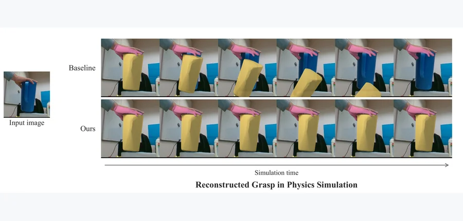 arXiv 2026-10-09 · cs.CV · #1 **[StableGrasp: Reconstructing Physically Stable Human Hand Grasps from Single Images](https://arxiv.org/abs/2610.09195)** Han Jiang, Etienne Vouga, Qixing Huang, Georgios Pavlakos 机构：The University of Texas at Austin（PDF 首页） [Paper](https://arxiv.org/abs/2610.09195) · [图源](https://arxiv.org/html/2610.09195v1/teaser_layout.png) 

中文摘要
从单张 RGB 图像重建物理稳定的人手抓取很有挑战，因为抓取本身难以进行物理建模，而且不仅要估计受视觉约束的手部姿态，还要估计使抓取稳定的控制目标。现有方法要么只建模手的视觉几何而不考虑物理，要么依赖可信度较低的物理模型，限制了结果的物理有效性。本文提出 StableGrasp，一种基于可微仿真的优化框架，明确区分视觉手部姿态与决定抓取力的控制目标。该方法在可微仿真器中最小化抓取的动能，联合优化手部几何和控制，同时用正则项保持视觉一致性与几何合理性。重建的抓取在严格物理仿真中明显更稳定，同时与输入图像保持视觉一致，几何上也合理。实验表明，相比其他手部控制策略，本方法产生的抓取稳定性高得多，可将仅基于视觉的抓取重建流程的输出转化为物理稳定的抓取。 <a href="https://arxiv.org/abs/2610.09195">原摘要来源</a>
 | 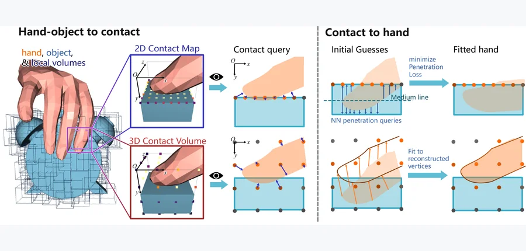 arXiv 2026-10-09 · cs.CV · #2 **[VolCo: Volumetric Contact for High-Fidelity Human Grasp Generation](https://arxiv.org/abs/2610.10197)** Zhuo Chen, Yihua Cheng, Aleš Leonardis, Hyung Jin Chang 机构：University of Birmingham / Beijing Institute of Technology（PDF 首页） [Paper](https://arxiv.org/abs/2610.10197) · [Code](https://github.com/chzh9311/volco) · [图源](https://arxiv.org/html/2610.10197v1/teaserv2.png) 

中文摘要
准确的接触建模是理解手物交互的基础，但现有接触表示通常局限于物体表面，并依赖手工规则恢复接触细节，因而产生严重穿透和不合理结果。为更充分利用动作捕捉数据中的丰富细节，我们提出体积接触表示 VolCo，将表面点扩展为一组3D 体积网格。VolCo 编码三维接触以精确恢复手部部位，并具有内在层级：每个体积中的局部接触细节和跨体积的整体手部几何。框架 VolCoDiff 由两个模块分别捕捉这两层特征。对于局部接触，用三维变分自编码器建模以局部物体有符号距离场（SDF）为条件的可能手部配置；对于整体手部几何，设计先验引导的扩散模型，学习从体积网格汇聚而来的压缩潜在特征分布。在两个基准数据集上的评估表明，该方法在穿透和稳定性指标上达到当前最佳水平，能生成贴合的抓取并大幅减轻严重穿透。代码：https://github.com/chzh9311/volco。 <a href="https://arxiv.org/abs/2610.10197">原摘要来源</a>
 | 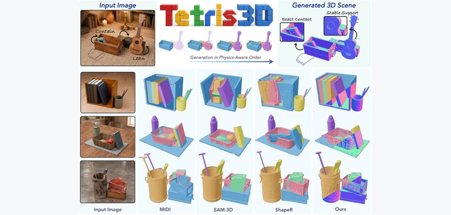 arXiv 2026-10-09 · cs.CV · #3 **[Tetris3D: 3D Scene Generation With Objects That Fit Together](https://arxiv.org/abs/2610.10539)** Jaeyeong Kim, Jinhyuk Jang, Jongmin Lee, Kyehong Park, Seungryong Kim 机构：KAIST（PDF 首页） [Paper](https://arxiv.org/abs/2610.10539) · [Project](https://cvlab-kaist.github.io/Tetris3D/) · [图源](https://arxiv.org/html/2610.10539v1/demo_ver2.png) 

中文摘要
我们提出 Tetris3D：一种从单张图像重建三维场景的生成框架，恢复在场景中物理和几何上相互协调的物体。现有方法常独立生成物体，或仅隐式耦合它们，因而对相邻交互物体之间的精细空间兼容性指导不足。为此，我们明确以周围物体的几何和物理关系为条件生成每个物体，引导其形状与姿态在场景中保持几何和物理合理性。此外，我们构建了基于物理仿真的 ComOb 数据集，包含跨多种物体类别、具有物理交互的 1.2M（120 万个）场景，并提供逐物体网格及成对物理关系标注。在合成和真实场景上的全面实验表明，即使交互区域被遮挡，Tetris3D 仍能恢复协调的物体形状与姿态，并在生成质量和物理稳定性方面达到当前最佳水平。 <a href="https://arxiv.org/abs/2610.10539">原摘要来源</a>
 |
| 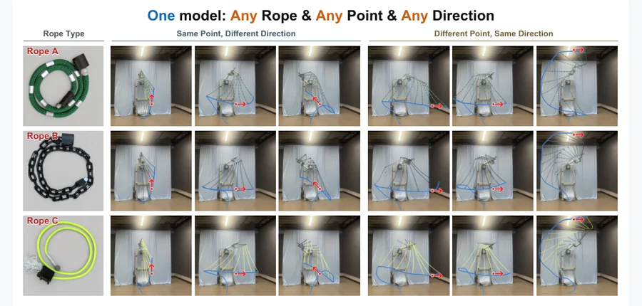 arXiv 2026-10-09 · cs.RO · #4 **[Point It, Strike It: Direction-Conditioned Dynamic Manipulation of Deformable Linear Objects](https://arxiv.org/abs/2610.09573)** Yi Yang, Xiang Fei, Lehong Wang, Zilin Dai, Ruogu Li, Jiting Cai, Liyao Chang, Xinyi Yang, Henry Kou, Ruijie Fu, Lu Li, Ho… 机构：Carnegie Mellon University / Shanghai Jiao Tong University / Harvard University（PDF 首页） [Paper](https://arxiv.org/abs/2610.09573) · [Project](https://deformx.github.io/DeformY/) · [图源](https://arxiv.org/html/2610.09573v1/deformx-teaser-compressed-under-3MB.png) 

中文摘要
形变线状物体的目标条件动态操作，过去主要将目标指定为绳端应到达的位置，但很多任务还取决于绳端如何到达。因此，我们研究单次挥动的绳索击打，目标同时指定绳端的 3D 位置和到达方向，并覆盖工作空间内的不同目标与不同绳索。挑战在于绳索动力学难以建模、没有示范、不同挥动到达同一目标的可靠性不同，且仿真到真实的差距不只来自绳索。我们用 GPU 加速、稳定的 Cosserat 杆求解器及横向气流空气动力学模型扩展 DeformX，得到速度提高超过 20,000 倍的 DeformX2.0。随后提出 TRACE（轨迹引导的自适应交叉熵）：针对新目标，从存储的绳端路径最接近该目标的挥动开始优化，以惩罚绳索弯曲和绳端突变的代价生成更可重复的击打数据。用这些数据训练的条件流匹配策略在仿真中达到 92.1% 准确率。最后提出 RECAP（残差校准策略），用少量校准挥动拟合仿真器中的绳索与装置参数，并用仿真训练的修正策略调整动作。在三种绳索的真实机器人实验中，RECAP 将位置目标 5 cm 内的成功率从 72% 提高到 87%；对于同时指定到达方向的目标，将 10 cm 且 10° 内的成功率从 50% 提高到 79%。 <a href="https://arxiv.org/abs/2610.09573">原摘要来源</a>
 | 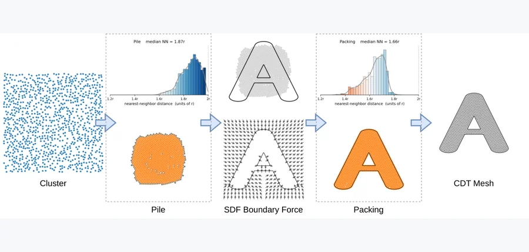 arXiv 2026-10-09 · cs.GR · #5 **[Physics-based Sphere Packing for Lagrangian Mesh Morphing](https://arxiv.org/abs/2610.08880)** Jiong Lin, Hod Lipson 机构：Columbia University（PDF 首页） [Paper](https://arxiv.org/abs/2610.08880) · [图源](https://arxiv.org/html/2610.08880v1/method_v2.png) 

中文摘要
本文研究将四面体网格用作可微仿真和计算设计的物体表示。固定连通性的网格在大幅形变下会退化，而从头重新网格化会丢失节点对应关系。我们提出 JamTet，一种基于物理球体堆积的体积网格生成与变形框架，贡献包括：（i）结合八叉树层级堆积与约束 Delaunay 四面体剖分的 GPU 并行网格器，产生比 TetGen 和 fTetWild 更均匀的单元体积；（ii）通过使同一批球体在变化的形状内重新达到平衡，并重建边界和连通性，从而保留内部节点身份的拉格朗日网格变形；在固定连通性网格和 TetSphere 网格出现翻转的情况下，该方法仍不翻转；（iii）使用 JAX、包含质点弹簧边与体积 Neo-Hookean 项的可微 GPU 仿真器，并在设计流程中与网格变形集成。在软体机器人形态设计实验中，相比匹配的仅用表面的方案，内部节点梯度使游泳适应度提高 0.73–1.07；同样设计的体素化版本适应度低 32–63%。结果表明，球体堆积可作为基于梯度形状优化的实用体积网格表示。代码和媒体材料仍在审查中。 <a href="https://arxiv.org/abs/2610.08880">原摘要来源</a>
 | 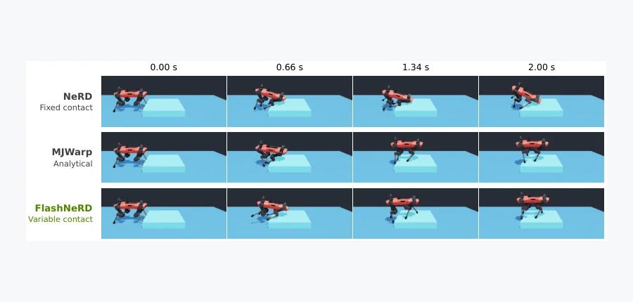 arXiv 2026-10-09 · cs.RO · #6 **[FlashNeRD: Performance-First Contact-Rich Neural Robot Dynamics](https://arxiv.org/abs/2610.09130)** Mohammadmehdi Ataei, Mohammad Amin Nabian, Jie Xu, Miles Macklin, Yashraj Narang, Eric Heiden, Octi Zhang, Yunrong Guo, Ru… 机构：NVIDIA（PDF 首页） [Paper](https://arxiv.org/abs/2610.09130) · [图源](https://arxiv.org/html/2610.09130v1/dial_rollouts.png) 

中文摘要
与解析物理模型相比，学习得到的动力学模型有望使机器人仿真更快、天然可微，并易于适配真实数据。神经机器人动力学 NeRD 保留解析碰撞检测，用学习模型替换仿真器的机器人数值动力学，但仍有三项限制：相对原仿真器提速很小、只接受预设位置的接触、与操作物体没有双向耦合。FlashNeRD 用并行流式架构、更准确且更快的逐次预测、可接受任意位置接触的编码器，以及与解析求解器模拟物体的双向耦合，解决这三项问题。五种机器人的实验显示，其动力学更快、更准确，策略学习和推理时规划也更快。在三种机器人上，动力学模型比优化过的 NeRD 最多快 55 倍，长时滚动预测也更准确。PPO 在 34 秒内训练出 ANYmal 行走策略，比解析仿真器快 3.8 倍、比优化过的 NeRD 快 2.7 倍。采用采样式 MPC 方法 DIAL-MPC 时，机器人爬上全部六个测试平台，而固定接触 NeRD 只爬上一个，规划时间约为解析仿真器的一半。用 FlashNeRD 训练的立方体重定向策略完成的目标数与仿真器训练策略相差不超过 2%。 <a href="https://arxiv.org/abs/2610.09130">原摘要来源</a>
 |
| 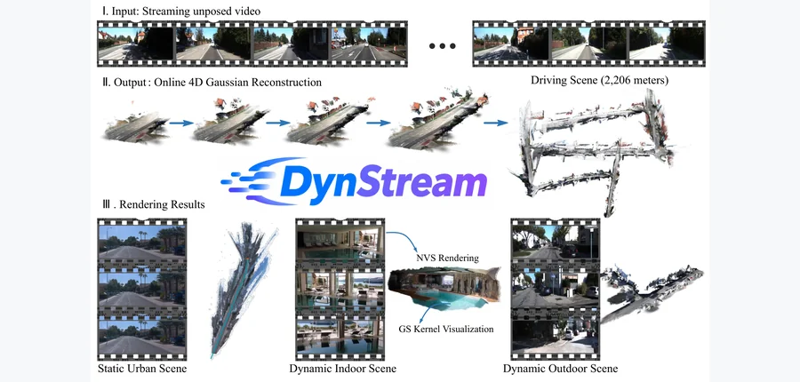 arXiv 2026-10-09 · cs.CV · #7 **[DynStream: Online Streaming 4D Gaussian Reconstruction of Dynamic Worlds from Unposed Video](https://arxiv.org/abs/2610.09720)** Dingwei Xian, Xiaoyu Zhou, Yajiao Xiong, Yongtao Wang, Ming-Hsuan Yang 机构：Peking University / VGI Labs / University of California, Merced（PDF 首页） [Paper](https://arxiv.org/abs/2610.09720) · [图源](https://arxiv.org/html/2610.09720v1/teaser.png) 

中文摘要
要从长时间、未给定位姿的流式视频在线重建动态 4D 场景，既需要持续处理，也需要逼真渲染；现有方法难以兼顾。现有前馈式 Gaussian 方法局限于离线处理，在线点云方法则难以保持稠密几何和高保真渲染。我们提出 DynStream，从长视频流重建四维 Gaussian 场景。给定连续视频流，该框架在局部时间窗口内重建场景，并逐步对齐、融合局部重建结果，形成全局一致的场景；整个过程无需逐场景优化。通过联合约束跨窗口几何一致性并建模随时间变化的场景内容，DynStream 支持长视频流上的高效重建和逼真渲染。实验表明，该方法在多种动态室内和室外场景上，从长视频流实现高保真在线动态重建与渲染，并达到当前最佳表现。 <a href="https://arxiv.org/abs/2610.09720">原摘要来源</a>
 | 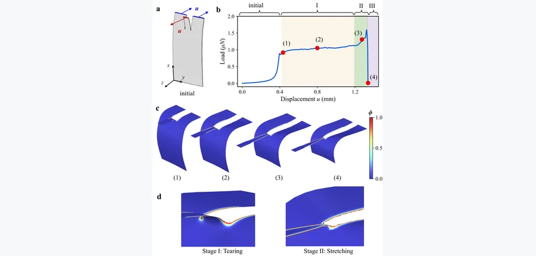 arXiv 2026-10-09 · cond-mat.soft · #8 **[Phase-Field Fracture Simulation of Highly Deformable Thin Structures via a Discrete Differential Geometry Framework](https://arxiv.org/abs/2610.08997)** Bohan Zhang, Bo Wang, Huajiang Ouyang, Zhigang Wu, Yu Zhou, Weicheng Huang 机构：Northwestern Polytechnical University / Newcastle University / University of Liverpool / Sun Yat-sen University / Harvard University（PDF 首页） [Paper](https://arxiv.org/abs/2610.08997) · [图源](https://arxiv.org/html/2610.08997v1/Fig_tear1.png) 

中文摘要
薄而柔韧的弹性结构通过大幅几何变形实现机械功能，因此其断裂行为与不断变化的结构构形紧密耦合。本文提出统一的离散微分几何（DDG）相场框架，模拟高度可变形薄结构的断裂。膜内和弯曲弹性由三角化中面的离散几何量表示，相场也定义在同一离散表面上，以描述裂纹的起始和后续扩展。耦合问题采用交错方案求解，并通过活跃集方法保证相场不可逆。退化—删除过程移除接近完全失效的单元，重建 DDG 拓扑，使裂纹完全张开并允许显著的断裂后构形变化。对于二维面内断裂，DDG 对裂纹演化与力学响应的预测与几何非线性有限元结果高度一致。对于三维撕裂，该框架解析面外变形与裂纹传播的相互作用，包括实验观察到的初始平行裂纹会聚与合并。岛—桥式柔性电子结构的示例进一步展示工程适用性：仿真捕捉方向相关的变形模式、加载期间的不稳定与跳跃，以及结构构形和断裂的耦合演化。这些结果表明，该框架可用于研究几何相关的断裂，并支持抗损伤柔性薄结构设计。 <a href="https://arxiv.org/abs/2610.08997">原摘要来源</a>
 | 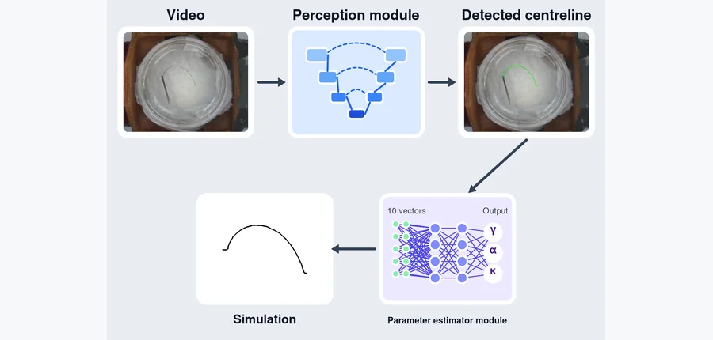 arXiv 2026-10-09 · cs.RO · #9 **[Video-to-Model: Automatic Modeling of Deformable Linear Objects](https://arxiv.org/abs/2610.10039)** Akshun Sharma, Kimia Forghani, Yancy Diaz-Mercado 机构：University of Maryland（PDF 首页） [Paper](https://arxiv.org/abs/2610.10039) · [图源](https://arxiv.org/html/2610.10039v1/Fig1.png) 

中文摘要
本文提出视频到模型框架，从输入视频自动建模可变形缝合线的运动。该方法采用近期提出的 CBF–CLF–QP 数值模型，借助少量参数简化对可变形细线运动的刻画。感知模块先在视频中定位并跟踪缝合线，输出有序的线节点序列；时空 CNN 再处理观测运动，估计结构化 CBF–CLF–QP 模型的有效参数。这些参数用于在用户指定的缝针速度输入下模拟缝合线。对未见过的线配置与运动所做的实验表明，该框架能从视频可靠地重建线的行为，自动配置结构化模型，并以较低跟踪误差再现预期运动。该方法减少了手动调参的需要，向基于视频的可变形线状物体自动建模迈进一步。 <a href="https://arxiv.org/abs/2610.10039">原摘要来源</a>
 |
| 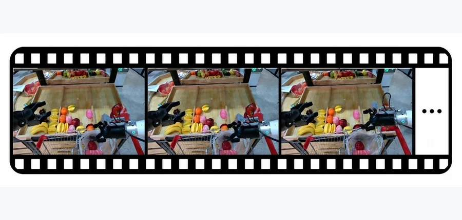 arXiv 2026-10-09 · cs.RO · #10 **[RobotAPO: Adversarial Physics Preference Optimization for Robotic Manipulation Video Generation](https://arxiv.org/abs/2610.09454)** Kerui Li, Zhe Jing, Chenyi Huang, Xiaofeng Wang, Zheng Zhu, Haoming Cui, Huaibo Huang 机构：Chinese Academy of Sciences / GigaAI / Beijing Institute of Technology（PDF 首页） [Paper](https://arxiv.org/abs/2610.09454) · [图源](https://arxiv.org/pdf/2610.09454) 

中文摘要
机器人操作视频日益被用作具身智能体的视觉计划，但仅优化视觉合理性往往不能刻画真实交互脆弱的物理可行域。交互边界处即使很小的物理违例，例如相互穿透或物体过早移动，也可能使下游执行所需的时序和位姿完全失效。标准监督微调缺少直接惩罚这类局部失败的机制，因此我们构建 AgiBot-PhysPref：严格筛选的 10,000 样本偏好数据集，隔离条件匹配的物理违例，把生成器自身的失败分布变成物理一致性信号。在此基础上提出 RobotAPO，一种在连续流匹配去噪空间运行的对抗式物理偏好优化框架。为避免策略仅记住静态整理出的失败，RobotAPO 使用轻量的对抗式反事实提议器，学习与条件相关、偏向物理失败的去噪方向。这促使模型探索并更好地遵守物理交互边界，同时推理时仍只需提示词和参考图像，无需额外结构化条件。全面评估表明，纠正这些局部物理违例改善了根据生成视频进行的机器人执行。在保留的 AgiBot 条件上，相比最强的受控内部基线，物理一致性的 hard score 高 6.8%，soft score 高 10.0%；真实机器人重放的任务成功率相对提高 37.4%。 <a href="https://arxiv.org/abs/2610.09454">原摘要来源</a>
 | 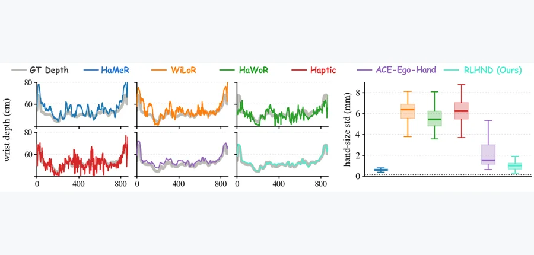 arXiv 2026-10-09 · cs.CV · #11 **[RLHND: Video Foundation Models as Physically Grounded Hand Trackers for Robot Learning](https://arxiv.org/abs/2610.09455)** Seungjun Moon, Subin Jeon, Sangwoo Kim, Hanbyul Joo, Jinwoo Shin 机构：RLWRLD / KAIST / Seoul National University（PDF 首页） [Paper](https://arxiv.org/abs/2610.09455) · [Project](https://seungjun-moon.github.io/rlhnd/) · [图源](https://arxiv.org/html/2610.09455v1/fig_motivation.png) 

中文摘要
近期利用人类视频数据训练机器人策略的方法越来越普遍，但现有手部跟踪器大多从裁剪帧回归姿态，缺少手部运动和物体交互先验，导致估计不准确且物理不一致；缺少接触和力等物理线索也限制了人类视频在策略训练中的用途。为此，我们提出 RLHND：基于视频基础模型，从单目第一视角视频联合估计手部姿态和真实感触觉信息。RLHND 通过干净潜变量条件化，将预训练的 Cosmos 3 视频扩散骨干变为确定性的片段级特征提取器，把其学到的手部运动和手物交互先验用于跟踪。对于姿态估计，RLHND 预测关节角度在解剖学上合理的手部姿态，并可选择以形状参数为条件，使同一视频乃至同一拍摄者的不同视频保持手形一致。对于触觉估计，单独的触觉专家分支在冻结姿态分支后训练，预测手表面的稠密接触和力。我们还采用基于线性混合蒙皮（LBS）的特征传播，避免代价高昂的逐顶点注意力，同时提取逐顶点特征。RLHND 在多个姿态估计基准上达到当前最佳表现，在接触和力估计方面也达到当前最佳表现；重定向结果和真实机器人实验进一步展示其对机器人学习的价值。代码将公开：https://seungjun-moon.github.io/rlhnd/。 <a href="https://arxiv.org/abs/2610.09455">原摘要来源</a>
 | 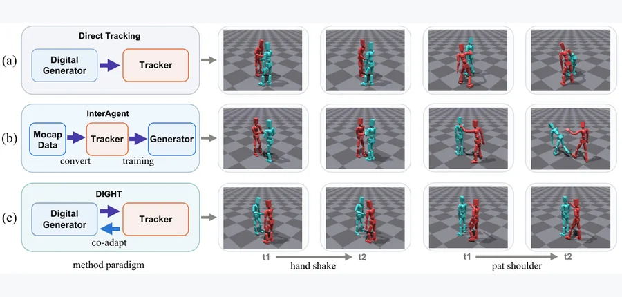 arXiv 2026-10-09 · cs.CV · #12 **[From Digital Human Interactions to Physics-Based Humanoid Skills: Physics-Grounded Post-Training of Interaction Generators](https://arxiv.org/abs/2610.10322)** Kerui Chen, Jianrong Zhang, Kai Lv, Hehe Fan 机构：Zhejiang University / Beijing Jiaotong University（PDF 首页） [Paper](https://arxiv.org/abs/2610.10322) · [图源](https://arxiv.org/html/2610.10322v1/intro.png) 

中文摘要
近期双人形机器人交互生成取得进展，主要依赖基于物理的跟踪策略，将数字参考动作转为可执行轨迹。然而，跟踪能力受限，使部分参考动作不能执行，降低了数据利用率；即使跟踪成功，也不保证物理响应合理或准确实现预期交互。本文提出 DIGHT，一个将数字人交互生成器与人形机器人跟踪策略耦合的共同适配框架。DIGHT 首先用固定跟踪器在仿真中执行多个以文本为条件的交互候选，随后依据滚动执行结果构建涵盖一般可执行性和交互忠实度的物理偏好。我们不把这些信号压成单一排序奖励，而采用物理指标解耦的扩散直接偏好优化（DPO）对齐预训练生成器，在无需对仿真器求导的情况下保留针对不同准则的监督。为提高可执行性，偏好对来自跟踪误差、摩擦和悬空现象；为提高交互忠实度，则利用仿真器力反馈衡量接触，并按接触是否发生、位置、时长和力幅值构建偏好。对齐后的生成器提供参考动作，用于微调跟踪器，提高生成与物理执行的兼容性。大量实验表明，该方法既改善生成动作的物理合理性，也在仿真中实现更可靠、更忠实的人形机器人交互。 <a href="https://arxiv.org/abs/2610.10322">原摘要来源</a>
 |
| 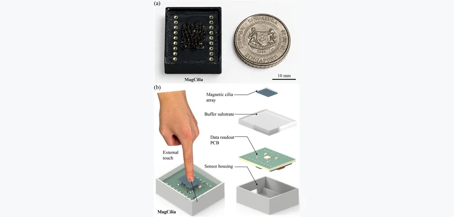 arXiv 2026-10-09 · cs.RO · #13 **[MagCilia: A Compact Magnetociliary Tactile Sensor with 3D Force Sensing for Robotic Contact Perception and Grasping Feedback](https://arxiv.org/abs/2610.09536)** Yu Feng, Hao Wu, Haotian Guo, Haoming Liu, William Su, Jingxiang Guo, Jiankun Li, Masayoshi Tomizuka, Wen Jung Li, Jianshu… 机构：National University of Singapore / University of California, Berkeley / City University of Hong Kong（PDF 首页） [Paper](https://arxiv.org/abs/2610.09536) · [图源](https://arxiv.org/html/2610.09536v1/figures/structure.png) 

中文摘要
机器人抓取和表面探索都受益于同时测量法向力、切向力，以及通过接触获取表面信息。本文提出紧凑型磁纤毛触觉传感器 MagCilia，将柔性磁纤毛结构与霍尔传感器结合，实现 3D 力测量。我们用准静态有限元分析研究多方向载荷下的结构形变和磁响应。为从相互耦合的磁通道重建力，提出因果历史融合回归（CHFR），结合当前磁场测量值及其近期变化。按标定记录分组的五折交叉验证中，Fx、Fy 和 Fz 的均方根误差分别为 0.40、0.57 和 0.69 N，对应决定系数为 0.93、0.90 和 0.92。机器人实验展示了由切向力引导的夹爪调整，以及外部扰动下的多轴载荷监测。重建力的频域特征在按采集场次分组的三折交叉验证中，以 99.39% 准确率区分六类表面；在线机器人演示还识别了全部六种测试表面。这些结果展示了用单个紧凑触觉单元完成三维力重建、抓取反馈和表面识别的能力。 <a href="https://arxiv.org/abs/2610.09536">原摘要来源</a>
 | 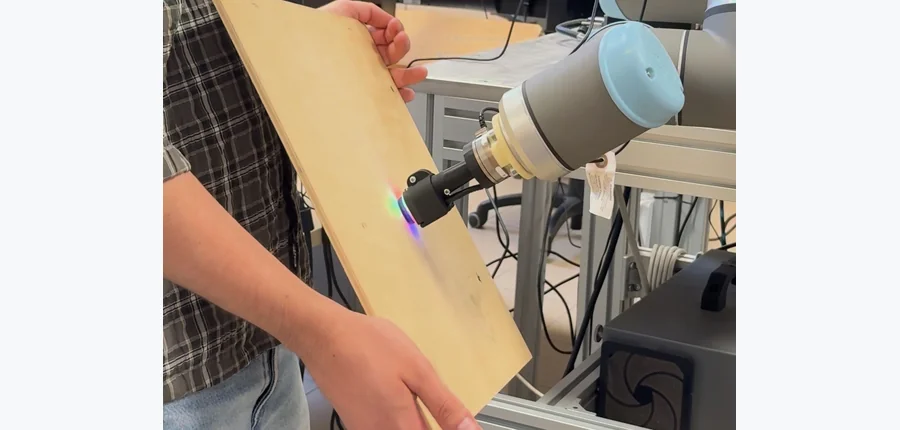 arXiv 2026-10-09 · cs.RO · #14 **[Tactile Reconstruction of Contact Task Frames and Forces for Hybrid Force/Motion Control](https://arxiv.org/abs/2610.10020)** Antonio Rapuano, Simone Orelli, Barbara Bazzana, Antonio Franchi, Alessandro De Luca 机构：Sapienza University of Rome / University of Twente（PDF 首页） [Paper](https://arxiv.org/abs/2610.10020) · [图源](https://arxiv.org/pdf/2610.10020) 

中文摘要
混合力／运动控制需要知道交互力，以及定义力控与运动控制方向的任务坐标系。这些量通常来自力／力矩传感器或基于模型的残差，而且往往还假定已知名义环境模型。本文研究仅用柔性光学触觉传感，在局部平面接触且接触力矩可忽略的假设下，在线估计接触力和可能随时间变化的任务坐标系。所提方法把柔性光学触觉传感器的单张形变弹性体图像映射到可观测接触变量：压入深度、两个表面相对传感器的倾角、3D 接触力，并为每个样本给出不确定性估计。该映射通过自标注采集流程学习：机械臂施加受控接触，辅助力／力矩传感器只在离线阶段提供真实值标注。随后，触觉测量与机器人本体感觉数据在扩展卡尔曼滤波器中融合，持续更新接触任务坐标系和交互力的估计。在 UR10 机械臂上安装 DigiTac 传感器的控制实验表明，当人推动平坦刚性板做线性和角运动时，仅以触觉作为外部感知反馈，系统仍能闭环调节接触力。 <a href="https://arxiv.org/abs/2610.10020">原摘要来源</a>
 | 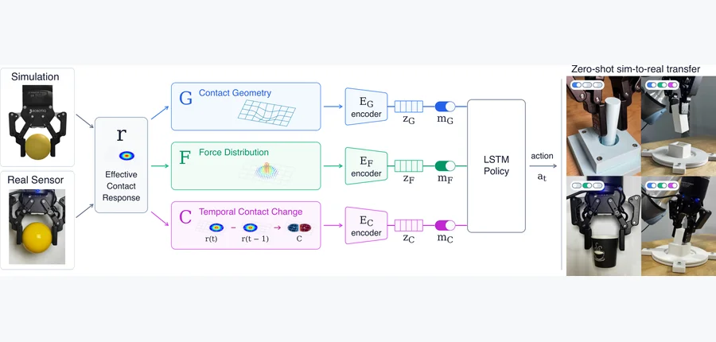 arXiv 2026-10-09 · cs.RO · #15 **[Factorized Tactile Representation and Control for Sim-to-Real Manipulation](https://arxiv.org/abs/2610.10510)** Siqi Shang, Bianca Aumann, Tye Brady, Joshua Migdal, Taskin Padir 机构：Amazon Fulfillment Technologies &amp; Robotics / The University of Texas at Austin（PDF 首页） [Paper](https://arxiv.org/abs/2610.10510) · [图源](https://arxiv.org/html/2610.10510v1/figure1_overview_final_4card.png) 

中文摘要
触觉仿真到真实学习需要跨越模拟接触与具体设备传感器响应之间的差距，同时保留控制所需信息。我们提出因子化的触觉表示与控制框架，把法向力和接触斑块映射为可从传感器读数恢复的有效接触响应。该响应被拆分为接触几何、力分布和随时间变化的接触信息，并分别采用特定表示的编码和随机化。触觉门控策略在控制过程中保持这些表示分离，并无需重新训练即可适用于所有掩码配置。我们在仿真和真实环境中，通过响应重建、空间对齐、力调节和富接触的对抗性插销插入评估该方法，以便独立考察不同触觉表示的效用和迁移可靠性。该方法在未见过的几何形状上实现小于 1 mm 的接触定位误差和 1.69 N 的力跟踪误差；真实世界对抗性插销插入表现较未因子化的响应提高 35%，不同触觉表示对不同交互各有帮助。 <a href="https://arxiv.org/abs/2610.10510">原摘要来源</a>
 |
| 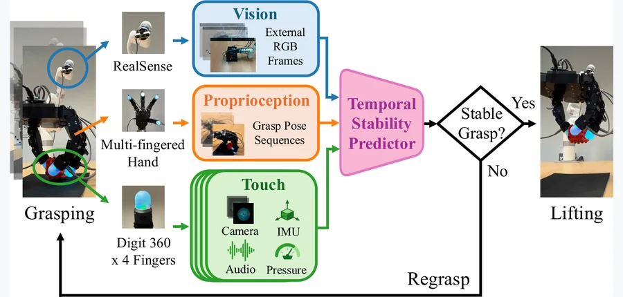 arXiv 2026-10-09 · cs.RO · #16 **[Temporal Visuo-Tactile Learning for Dexterous Grasp Stability](https://arxiv.org/abs/2610.10283)** Ken Nakahara, Aleksei Buvailik, Prokhor Kotov, Roberto Calandra 机构：TU Dresden（PDF 首页） [Paper](https://arxiv.org/abs/2610.10283) · [Project](https://lasr-lab.github.io/dexterous-grasp-stability/) · [图源](https://arxiv.org/html/2610.10283v1/overview.png) 

中文摘要
人类借助指尖触觉反馈，抓取日常物体几乎总能成功；但机器人抓取研究中，许多工作仍侧重平行夹爪的视觉抓取选择。本文系统研究高分辨率动态触觉感知如何帮助灵巧机器人手预测抓取稳定性并指导模型驱动抓取。我们使用装有四个 Digit 360 触觉传感器的多指机器人手，在 200 个物体上采集了 10,000 次抓取试验，记录每次抓取全程的外部视觉、本体感觉和触觉流。基于该数据集，训练端到端时序多模态模型，从抬起前的抓取观测预测抬起后的稳定性，并比较感知模态和编码骨干。实验与受控输入消融显示，加入触觉，尤其是高分辨率的动态触觉，可改善稳定性预测。最后，我们把预测器部署为真实机器人上的在线稳定性门控；与无触觉门控相比，视觉触觉模型引导的重新抓取使已执行抬升的成功率提高 10.5 个百分点。结果表明，丰富的指尖感知和捕捉触觉动态的时序模型，无需显式接触或力建模，也能支持多指手的学习式抓取，为从触觉经验走向稳定灵巧操作提供可扩展的数据驱动路径。数据集已公开：https://lasr-lab.github.io/dexterous-grasp-stability/。 <a href="https://arxiv.org/abs/2610.10283">原摘要来源</a>
 | 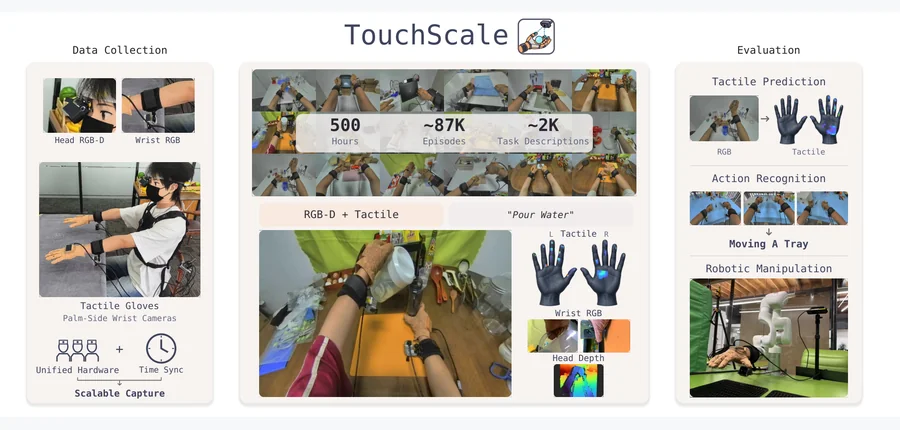 arXiv 2026-10-09 · cs.CV · #17 **[TouchScale: 500 Hours of Human Vision and Touch for Visual-Tactile Learning](https://arxiv.org/abs/2610.10288)** Dayou Li, Hao Wang, Qianqian Yang, Zihao Zhu, Haoquan Fang, Ziyao Zeng, Yan Han, Zihan Wang, Yan Wang, Baoru Huang, Dilin… 机构：Texas A&amp;M University / Google DeepMind / Carnegie Mellon University / Stanford University 等（PDF 首页） [Paper](https://arxiv.org/abs/2610.10288) · [图源](https://arxiv.org/html/2610.10288v1/TouchScale_Teaser_Compressed.png) 

中文摘要
大规模第一视角人类交互数据正成为具身学习的重要物理监督来源，但只有视频时，决定物理交互的接触和压力没有被记录。近期视觉触觉数据集补上了这部分监督，然而同步触觉数据的规模仍远小于人类视频；一些最大的数据资源还混合不同传感器或标注流程的记录，难以单独判断数据规模的作用。因此，我们推出 TouchScale：用统一可穿戴设备采集的 500 小时富接触人类交互数据集。其约 2,000 种预设任务描述覆盖日常活动和结构化操作；每段记录都在时间上对齐第一视角 RGB-D 视频、腕部 RGB 视频，以及双手全手的稠密触觉测量。与先前触觉数据相比，在完整 TouchScale 上训练，使未见过的触觉传感器数据上的零样本接触 IoU 从 0.134 提高到 0.383。在 TouchScale 上预训练的视觉编码器，在三个基准的动作识别准确率上也高于比较的视觉触觉数据集。用于机器人策略的视觉触觉中期训练时，TouchScale 将四项富接触操作任务的平均真实成功率从 22.5% 提高到 57.5%。在传感器与采集流程固定时，零样本触觉预测和机器人成功率整体上都随数据量增加而上升。结果表明，以一致感知方式规模化采集的人类视觉触觉数据有益于感知和机器人操作。作者将公开 TouchScale，包括全部同步视觉触觉记录与重建物体模型。 <a href="https://arxiv.org/abs/2610.10288">原摘要来源</a>
 | 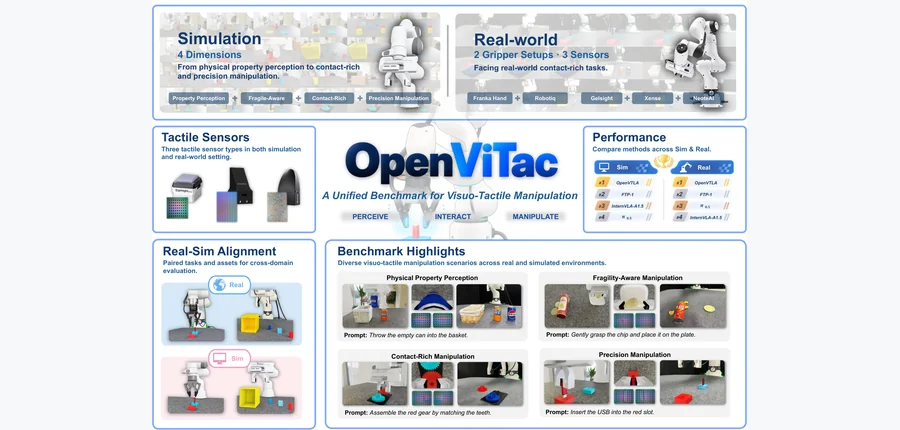 arXiv 2026-10-09 · cs.RO · #18 **[OpenViTac: Learning and Benchmarking Visuo-Tactile Policies in a Unified Sim-and-Real Framework](https://arxiv.org/abs/2610.10384)** Yifan Wu, Qin Li, Nan Min, Guojin Zhong, Haoyu Zhao, Zhiyuan Li, Houze Xu, Shengqi Xu, Xingyao Lin, Zijie Diao, Zhaoxiang… 机构：Fudan University / Hefei University of Technology / National University of Singapore / Neote AI / China Unicom（PDF 首页） [Paper](https://arxiv.org/abs/2610.10384) · [图源](https://arxiv.org/html/2610.10384v1/main_teaser.png) 

中文摘要
触觉反馈为具身智能体提供视觉观测以外的物理信息，使其更可靠地与真实世界交互。然而，尽管视觉触觉语言动作（VTLA）策略发展迅速，仍缺少在仿真和现实中统一评估触觉机器人操作的基准。为填补这一空白，我们推出 OpenViTac：用于跨仿真与真实环境评估机器人策略的视觉触觉操作基准。OpenViTac 将富接触操作组织成四个与触觉相关的能力维度，并提供成对的仿真—现实设置，以一致评估 VLA、WAM 和 VTLA 策略。在此基础上，我们研究不同触觉表示和融合策略如何影响预训练 VLA 模型的表现，并提出结合最优表示与融合方式的触觉增强框架 OpenVTLA。此外，我们利用配对基准设置研究仿真—现实联合训练，并分析影响跨域策略学习的因素。总体而言，OpenViTac 为评估和推进视觉触觉机器人操作提供统一平台。 <a href="https://arxiv.org/abs/2610.10384">原摘要来源</a>
 |
| 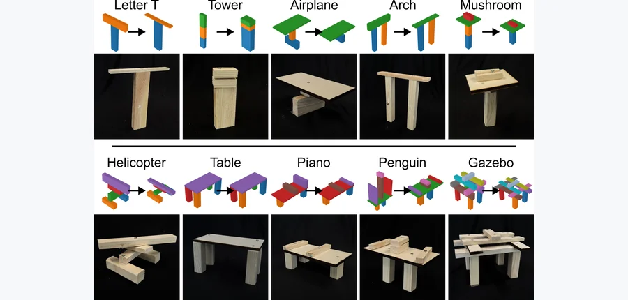 arXiv 2026-10-09 · cs.RO · #19 **[On-Demand Robotic Assembly via Differentiable Geometric Part Repair](https://arxiv.org/abs/2610.09777)** Millicent Schlafly, Fabio Schaub, Diogo Costa Pais, Luca Lelli, Janne Dvorak, Claire Colmont, Sven Marti, Mark D. Fuge 机构：affiliation 未确认 [Paper](https://arxiv.org/abs/2610.09777) · [图源](https://arxiv.org/html/2610.09777v1/Figures/ten_objects_compressed.png) 

中文摘要
将数字设计转为机器人装配流程，目前往往需要专家花费数月手工调整零件几何，以满足机器人约束。本文提出端到端自主流程，完成定制木制结构的设计与实际建造。生成式 AI 智能体把用户提示转化为初始 3D 几何，并在设计视觉保真度与选定物理约束之间取得平衡。随后，基于梯度的修复阶段通过图注意力网络代理模型反向传播，调整组件几何以提升可装配性。除修正不连接和重叠的组件外，我们还展示针对硬件的修正：通过可微优化零件几何，使 60 个新自然语言输入中 86.7% 的设计能够由机器人拧螺丝装配，表现为先前方法的十倍。我们用两台 UR5e 机器人实际展示其中十个结构的可装配性。该工作朝按需机器人制造迈出一步，支持快速生产定制化、小批量产品。 <a href="https://arxiv.org/abs/2610.09777">原摘要来源</a>
 | 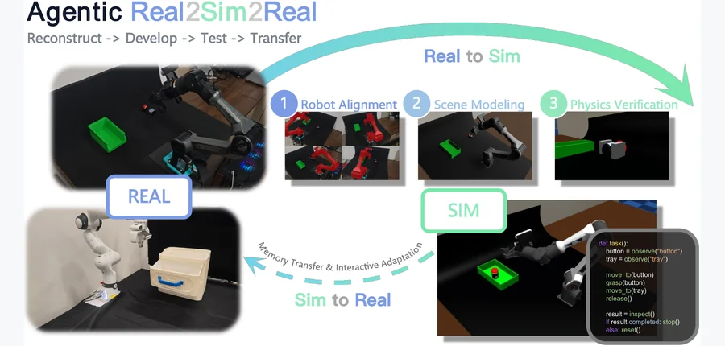 arXiv 2026-10-09 · cs.RO · #20 **[Agentic RSR: Real-to-Sim-to-Real through Scene Reconstruction and Execution-Grounded Robot Policies](https://arxiv.org/abs/2610.10479)** Yihan Li, Yating Feng, Shengjiu Sun, Jianing Chen, Hao Ren, Bowen Yang, Weisheng Xu, Qiwei Wu, Hui Cheng, Renjing Xu 机构：Sun Yat-sen University / HKUST Guangzhou（PDF 首页） [Paper](https://arxiv.org/abs/2610.10479) · [图源](https://arxiv.org/html/2610.10479v1/fig_teaser.png) 

中文摘要
真实机器人工作空间的仿真必须保留与任务相关的交互，而在仿真中开发的策略必须能基于真实机器人可获得的观测运行；但场景重建与策略开发通常分开处理。我们提出 Agentic Real-to-Sim-to-Real（Agentic RSR），通过同一操作任务连接场景重建、策略开发和真实机器人执行。给定工作空间视频、任务描述和已知机器人模型，智能体恢复度量尺度，利用视觉反馈迭代细化场景，并在 MuJoCo 中检查与任务相关的交互。随后，编程智能体开发可执行策略，逐步从可直接访问的物体位姿过渡到视觉观测和随机化仿真。策略在一次调用中可交错执行多次观测与动作，智能体利用执行反馈继续、重试或修改方案。共享的任务级接口把策略和积累的经验带到真实机器人，由新观测和安全检查指导执行。在涉及两种机器人的 18 个重建场景中，相对于参考深度估计，四视角平均深度 MAE 为 0.1057 m；平均 Lab ΔE76 为 11.04，平均灰度 SSIM 为 0.6990。真实机器人实验中的总体任务成功率达到仿真成功率的 80%，表明部分仿真表现保留到了硬件。代码与重建场景数据将公开。 <a href="https://arxiv.org/abs/2610.10479">原摘要来源</a>
 | 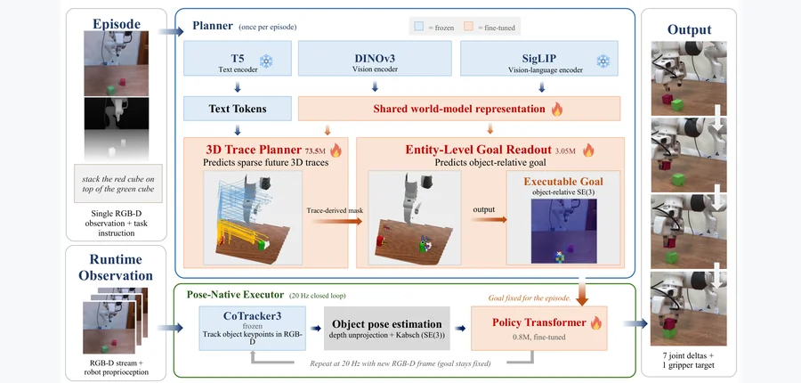 arXiv 2026-10-09 · cs.RO · #21 **[Predicted Futures Are Not Enough: Learning Executable Goals for Robot Manipulation](https://arxiv.org/abs/2610.09309)** Tzu-Yu Chuang, Ching-Hsiang Chang, Yi-Hsiu Lee, Yi-Ting Chen, Min Sun, YuanFu Yang 机构：National Yang Ming Chiao Tung University / National Tsing Hua University（PDF 首页） [Paper](https://arxiv.org/abs/2610.09309) · [Project](https://claire0730.github.io/executable-goals/) · [图源](https://arxiv.org/html/2610.09309v1/02_Pipeline.png) 

中文摘要
生成式世界模型能丰富地预测操作场景如何向任务目标发展，但这些未来状态并不直接给出控制所需的紧凑任务变量。如果训练只监督未来预测，即使能恢复几何，终点目标精度也未被明确设为学习目标。我们提出实体级目标读出模块：一个学习得到的预测到执行接口，使可执行终点目标成为三维轨迹世界模型的显式输出。该模块结合以物体为中心的位姿预测与基于观测深度的平移估计，形成紧凑的 SE(3) 目标。共享的 Pose-Native Executor 以此固定目标和在线物体位姿反馈做闭环控制，无需再次运行世界模型。五项操作任务的平均成功率为 79.69%。目标诊断直接测量终点目标精度，受控平移扰动则刻画目标误差如何使执行退化。Franka 机械臂上的零样本部署，在标准 StackCube 上成功率为 73.33%，加入干扰物后为 66.67%；对训练策略时未见的目标执行 PickPlate，成功率为 75.00%。这些结果支持把预测到执行的接口视为世界模型规划中的显式学习组件，而非控制流程中偶然附加的后处理。项目页：https://claire0730.github.io/executable-goals/。 <a href="https://arxiv.org/abs/2610.09309">原摘要来源</a>
 |
| 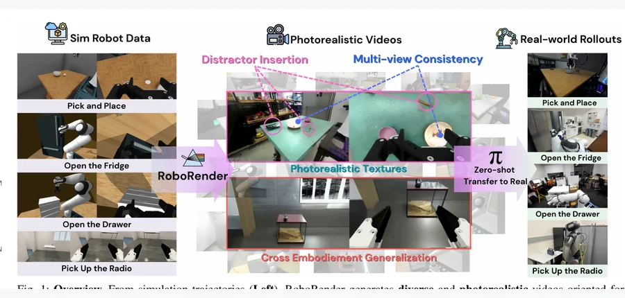 arXiv 2026-10-09 · cs.RO · #22 **[RoboRender: Robot-Oriented Video Generation for Visual Sim-to-Real Transfer](https://arxiv.org/abs/2610.09254)** Huang Huang, Wensi Ai, Ziyu Chen, Youhui Wang, Zijian Du, Yang Liu, Jiaolong Yang, Li Fei-Fei, Jiajun Wu 机构：Stanford University / NVIDIA / Microsoft Research（PDF 首页） [Paper](https://arxiv.org/abs/2610.09254) · [Project](https://robo-render.github.io/) · [图源](https://arxiv.org/pdf/2610.09254) 

中文摘要
仿真能够低成本、大规模生成机器人数据，但由于仿真到真实环境的视觉差异，仿真训练的策略往往迁移失败。现有方法常依赖中间表示，可能丢失丰富语义信息，或在部署时需要额外感知模块。我们提出 RoboRender，通过把仿真轨迹转为逼真的 RGB 视频来缩小视觉仿真—现实差距。RoboRender 训练以仿真深度视频、语言指令和机器人 RGB 掩码视频为条件的机器人专用视频生成模型，合成真实感纹理、背景和干扰物，同时保留仿真器的几何、机器人运动和动作标签。生成 RGB 视频与仿真器提供的状态和动作配对，用于训练可零样本部署到现实的策略。在机器人视频测试集上，该视频模型的生成质量优于以深度为条件的视频生成基线。真实世界的抓放、关节物体操作和移动操作任务中，用 RoboRender 数据训练的策略平均成功率为 71%，分别约为原始仿真渲染和常规视觉域随机化的 7.1 倍和 3.6 倍。每条仿真轨迹生成更多视频时，策略表现进一步改善，开门任务的成功率提高 65 个百分点。这些结果表明，生成式视频渲染可缓解零样本策略迁移中的视觉仿真—现实差距。项目网站：https://robo-render.github.io/。 <a href="https://arxiv.org/abs/2610.09254">原摘要来源</a>
 | 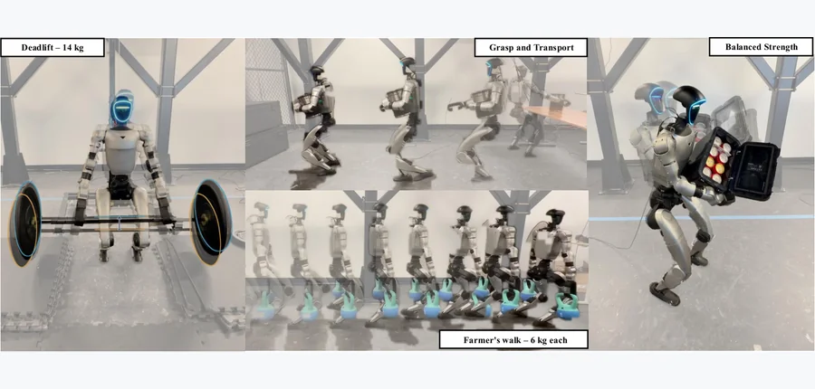 arXiv 2026-10-09 · cs.RO · #23 **[HULK: Learning Whole-Body Forceful Loco-Manipulation for Humanoids](https://arxiv.org/abs/2610.08970)** An Dang, Arturo Flores Alvarez, Yu-Ming Chen, Conor Mc Gartoll, Helen Sun, Aaron Ames, Nima Fazeli, Manikantan Nambi 机构：Amazon / University of Michigan / UCLA / Caltech（PDF 首页） [Paper](https://arxiv.org/abs/2610.08970) · [图源](https://arxiv.org/html/2610.08970v1/cover_picture_5.png) 

中文摘要
人形机器人搬运大型重物需要全身施力交互，但载荷会改变机器人的质心，使上半身持续承受负载，给平衡和指令跟踪带来挑战。我们提出 HULK，全身强力移动操作控制框架。该方法用预测负载动力学的模型预测控制（MPC）指导强化学习，训练两个教师策略：一个在手腕受力时跟踪手臂动作，另一个在身体前抱持大物体时行走。训练时为手腕受力教师加入捕获点控制屏障函数，提高负载下的平衡能力；随后将两个教师蒸馏为单一策略。评估覆盖仿真和 Unitree G1。仿真中，在每只手臂承受 10 kg 负载时，带屏障函数的教师在受评控制器中前向和侧向速度跟踪误差最低，并将总体发散运动分量（DCM）偏移幅值相对仅由 MPC 指导的强化学习降低 35.7%。手腕受力教师还能承受最大 130 N 的躯干推扰。 <a href="https://arxiv.org/abs/2610.08970">原摘要来源</a>
 | 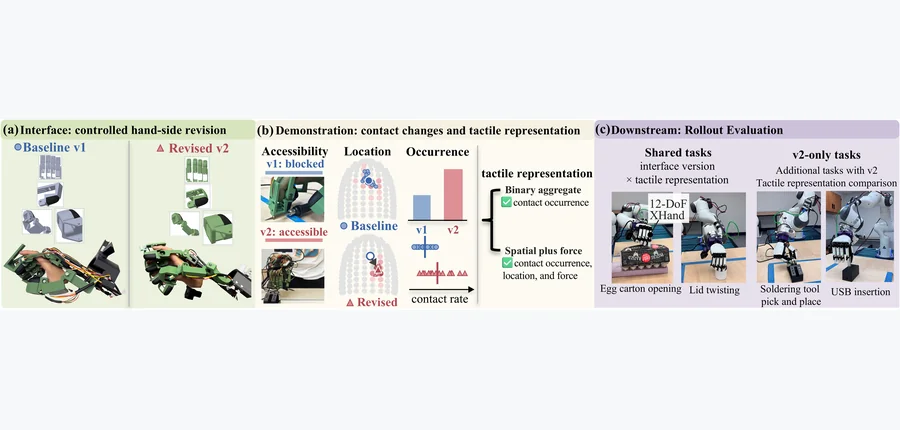 arXiv 2026-10-09 · cs.RO · #24 **[From Wearable Interfaces to Dexterous Policies: Contact Shifts and Tactile Representations](https://arxiv.org/abs/2610.08870)** Ruitong Tian, Fang Xu, Noah B. Wilson, Xianyao Li, Eric Jing Du 机构：University of Florida（PDF 首页） [Paper](https://arxiv.org/abs/2610.08870) · [图源](https://arxiv.org/pdf/2610.08870) 

中文摘要
与传统遥操作不同，可穿戴界面允许操作者用自己的手部动作、直接接触任务物体来采集灵巧操作示范。这降低了采集对目标机器人的依赖，却也使采集硬件成为生成示范的物理过程的一部分。界面几何既会影响任务的执行方式，也会影响学习所记录的触觉观测。我们研究 DexUMI 系列外骨骼的两个版本：两者具有相同的机器人指令定义、映射流程和触觉模块类型，但手侧几何不同。改进后的界面降低了报告的身体负担，提高部分设备评分，使基线因机械阻挡而无法获得的精细抓取触觉变得可采集，并导致与任务相关的记录接触发生变化。拧盖主要改变接触位置，打开鸡蛋盒主要改变接触是否发生。随后我们用二值汇总输入或空间加力输入训练匹配策略。在拧盖和打开鸡蛋盒任务上，改进界面的示范训练出的策略成功率高于基线示范，汇总分析显示显著的界面效应。在这两项以及 USB 插入、焊接工具拾放任务中，空间加力输入也优于二值汇总。结果表明，可穿戴采集硬件是机器人学习数据生成过程的一部分；评估这种界面时，除操作者体验外，还应考察其能记录的触觉交互，以及其示范支持的策略表现。 <a href="https://arxiv.org/abs/2610.08870">原摘要来源</a>
 |
| 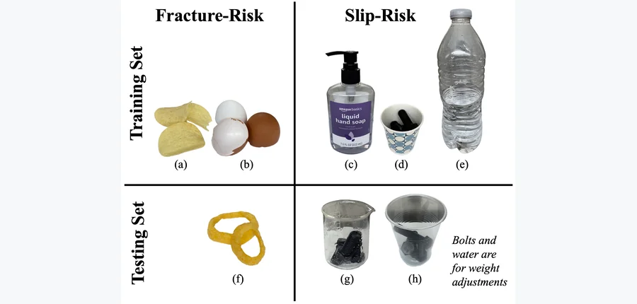 arXiv 2026-10-09 · cs.RO · #25 **[SAFE: Unified Slip and Fracture Detection with Low-Cost Acoustic Sensing in Robotic Grasping](https://arxiv.org/abs/2610.08802)** Zerun Wang, Vivek Kamat, Shekhar Bhansali 机构：Georgia Institute of Technology / Vanderbilt University（PDF 首页） [Paper](https://arxiv.org/abs/2610.08802) · [图源](https://arxiv.org/html/2610.08802v1/Figures/object_overview.png) 

中文摘要
操作易碎物体时，机器人需要了解抓取对象是否滑动或破裂，才能作出合适响应；当材料属性未知时尤其困难。本文提出 SAFE：一种低成本、通用的感知方法，使用两个被动式聚偏二氟乙烯（PVDF）声学传感器和电机本体感觉，无需视觉或预先知道材料，就能实时检测滑动和破裂。传感器安装在柔顺的 Fin Ray 夹爪上；统一的 HistGradientBoosting 分类器利用 79 维特征向量，报告正常、滑动或破裂状态。在留一抓取交叉验证中，SAFE 的 Alert-F1 为 0.884，滑动与破裂几乎不混淆；消融实验证实声学感知不可或缺。基于该检测层的自适应抓取控制器在 Jetson Orin Nano 上以 104 Hz 运行，覆盖不同物体类别的 46 次闭环机器人试验成功率为 91.3%；每种固定力策略在与其预设不符的物体条件下成功率都会降到 0%。对训练时未见的新物体，该方法仍达到 82.4% 成功率，表明无需逐物体标定也能进行对失败敏感的稳健抓取控制。 <a href="https://arxiv.org/abs/2610.08802">原摘要来源</a>
 | 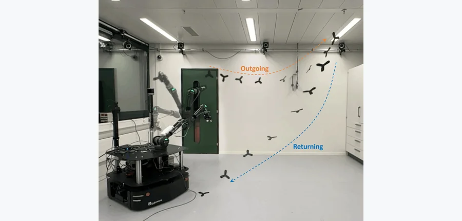 arXiv 2026-10-09 · cs.RO · #26 **[Robotic Boomerang Throwing via Model-Based Release Design](https://arxiv.org/abs/2610.10472)** Yang Liu, Colin Jones, Aude Billard 机构：EPFL（PDF 首页） [Paper](https://arxiv.org/abs/2610.10472) · [Project](https://robot-boomerang.github.io) · [图源](https://arxiv.org/pdf/2610.10472) 

中文摘要
投掷能产生空气动力升力的物体，可使机器人投掷距离超越弹道飞行。会返回的回旋镖尤其困难，因为其飞行强烈依赖释放速度、姿态和自旋，而机械臂难以重现人类投掷所需的快速动作。我们提出围绕释放状态设计的机器人回旋镖投掷建模框架。先分阶段辨识回旋镖飞行动力学，预测不同设计变化如何改变飞行；再根据候选参数在不确定接触条件下控制释放自旋的强度与一致性，筛选机器人投掷动作参数。随后利用模型为关节速度受限的6 自由度机械臂设计投掷动作与回旋镖。据作者所知，这是首个通过机械臂实现回旋镖返回飞行的系统。在所展示的返回试验中，回旋镖以 51 rad/s（8.1 转/秒）释放，最远到达距机器人基座 2.03 m，返回后落在距基座 0.31 m 处。成功的释放状态与测得的人类投掷明显不同，说明机器人无需模仿人类投掷动作也可实现返回飞行。项目页：https://robot-boomerang.github.io。 <a href="https://arxiv.org/abs/2610.10472">原摘要来源</a>
 | 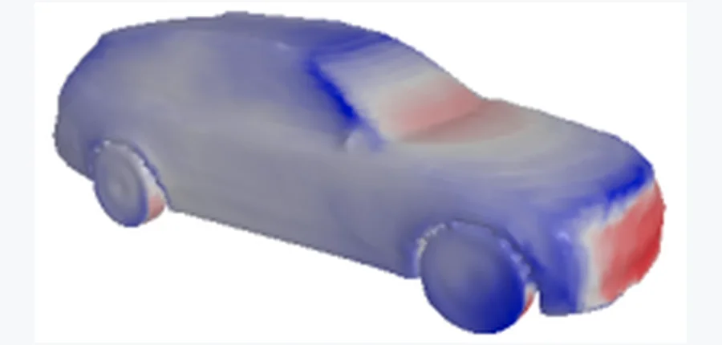 arXiv 2026-10-09 · cs.CV · #27 **[StyleFields: Multi-Scale AdaIN-Modulated Implicit SDFs for Coarse-to-Fine 3D Shape Reconstruction and Editing](https://arxiv.org/abs/2610.09200)** Ehsan Garaaghaji, Nicolas Talabot, Pascal Fua, Doruk Oner 机构：Bilkent University / EPFL（PDF 首页） [Paper](https://arxiv.org/abs/2610.09200) · [图源](https://arxiv.org/html/2610.09200v1/figures/drag/s_init_z.png) 

中文摘要
我们提出 StyleFields：基于 DeepSDF 的高保真 3D 重建架构，支持可控的几何风格混合，可把一个物体的粗尺度结构与另一个物体的细节结合。核心思想是感知网络深度的调制：不使用单一全局编码，而是在解码器多个深度通过多级自适应实例归一化注入潜变量，配合由粗到细的训练计划监督相应辅助输出头，并逐步增加网络深度。这样使早期层对应整体形状、后期层对应高频细节，无需部件标注或对抗训练便实现内容与风格解耦。StyleFields 实现了忠实重建、可信的跨实例混合，并在注入深度和监督粒度的消融中持续取得收益。我们还展示汽车空气动力学中的应用：用学习得到的阻力代理预测器作为可微目标，通过冻结互补潜变量流，优化重建汽车的整体形状或表面细节。StyleFields 为可控隐式重建与后续性能驱动设计提供一种简单有效的方法。 <a href="https://arxiv.org/abs/2610.09200">原摘要来源</a>
 |
| 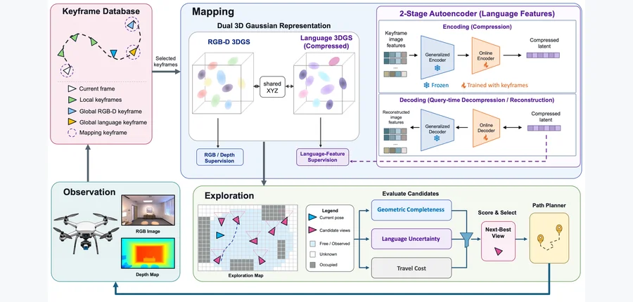 arXiv 2026-10-09 · cs.CV · #28 **[ActiveLang: Active Open-Vocabulary 3D Mapping with Semantic-Uncertainty-Guided Exploration](https://arxiv.org/abs/2610.09518)** Liyan Chen, Hairong Yin, Huangying Zhan, Yi Xu, Raymond A. Yeh, Philippos Mordohai 机构：Stevens Institute of Technology / Purdue University / Goertek Alpha Labs（PDF 首页） [Paper](https://arxiv.org/abs/2610.09518) · [图源](https://arxiv.org/html/2610.09518v1/figs/activelang_overview.jpg) 

中文摘要
随着机器人承担更多人类辅助任务，它们需要同时理解环境的几何和语义；它们还常在陌生环境中执行新任务，事先不知道相关概念。这需要支持开放词汇场景理解和人机交互的语言标注 3D 地图。我们提出 ActiveLang：以语义不确定性指导探索的自主主动开放词汇三维建图系统。ActiveLang 在紧凑的双 Gaussian 表示上在线适配语言特征，以适度内存开销联合重建场景几何、外观和开放词汇语义。其规划器高效选择信息量大的视点，从而用更少观测和更低计算成本完成建图。在 Replica 与 ScanNet++ 上的实验表明，相比在线和离线基线，ActiveLang 的2D 与 3D 开放词汇分割都有显著提升；结果强调主动探索能更高效地建立带语言标注的三维地图。 <a href="https://arxiv.org/abs/2610.09518">原摘要来源</a>
 | 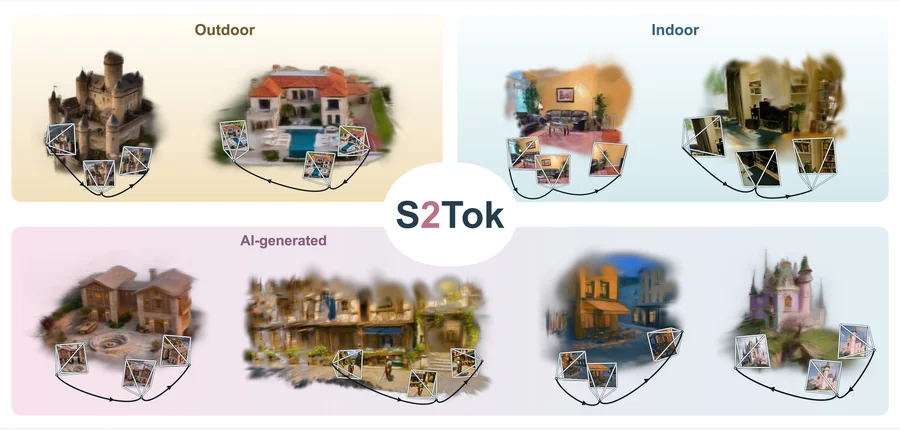 arXiv 2026-10-09 · cs.CV · #29 **[S2Tok: Streaming 3D Gaussian Reconstruction with Persistent Spatial Tokens](https://arxiv.org/abs/2610.08978)** Fang Li, Jiraphon Yenphraphai, Quentin Herau, Depu Meng, Yihan Hu, Tianshuo Xu, Narendra Ahuja, Wei Zhan 机构：Applied Intuition / University of Illinois Urbana-Champaign / Purdue University / University of California, Berkeley（PDF 首页） [Paper](https://arxiv.org/abs/2610.08978) · [Project](https://s2tok.github.io/) · [图源](https://arxiv.org/html/2610.08978v1/img/teasor_v4.jpg) 

中文摘要
流式 3D 重建不只是连续输出几何预测；它还需要一个持续存在的场景状态，随着新观测到来吸收证据，并保持可渲染。潜在空间 token 是有前景的表示，但从图像集合构建后，如何在线维护它们仍未解决：每次观测既可能重访已知区域，也可能揭示新内容。我们提出 S2Tok：从未经标定的图像流维护容量自适应、持续存在的场景状态的前馈框架。其核心是区分对已有表示的更新与选择性扩展。具有空间信息的 Transformer 将每个新观测与持续场景 token 融合，学习得到的准入模块选择性扩展表示，限制冗余存储。层级解码器和 Gaussian 输出头把演化状态转为不与像素对齐的三维 Gaussian，无需缓存先前帧即可进行新视角渲染。四个基准上的实验表明，该方法以紧凑 Gaussian 表示取得有竞争力的流式渲染质量。这些结果支持将潜在空间 token 用作在线三维重建的持续计算状态，结合学习式场景更新与显式 Gaussian 渲染。 <a href="https://arxiv.org/abs/2610.08978">原摘要来源</a>
 | 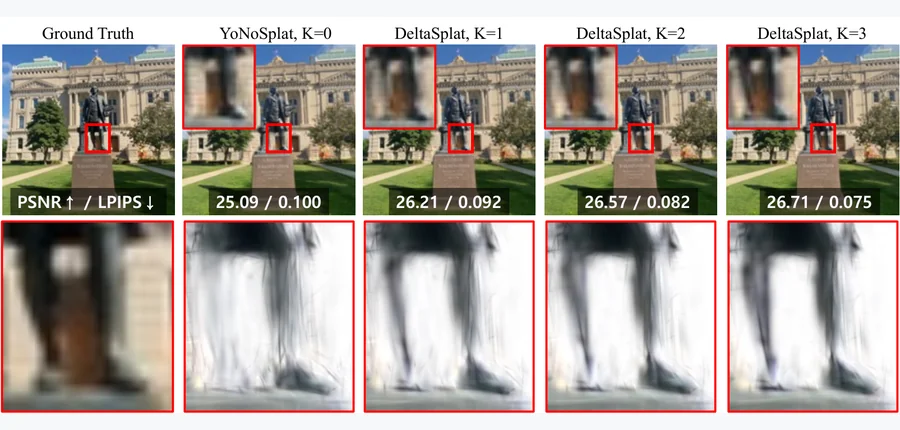 arXiv 2026-10-09 · cs.CV · #30 **[DeltaSplat: Iterative Gaussian Refinement for Pose-Free Feed-Forward 3D Gaussian Splatting](https://arxiv.org/abs/2610.09853)** Chanung Park, Seunghyeon Song, Joo Chan Lee, Eunbyung Park, Jong Hwan Ko 机构：Sungkyunkwan University / Yonsei University（PDF 首页） [Paper](https://arxiv.org/abs/2610.09853) · [图源](https://arxiv.org/html/2610.09853v1/teaser_demo_4.png) 

中文摘要
无位姿的前馈 3D Gaussian Splatting（3DGS）从稀疏、未给定位姿的图像通过一次网络前向重建场景，免去相机标定和逐场景优化。但相机估计错误会传播到预测的 Gaussian，放大单次预测的几何和光度误差。为此，我们提出 DeltaSplat：用于无位姿前馈 3DGS 的轻量 Gaussian 细化模块。它在输入上下文视角迭代渲染当前 Gaussian，并利用所得残差预测逐 Gaussian 更新。然而，仅有2D 残差无法确定三维修正，因此每次更新还以逐像素 Plücker 射线和渲染深度为条件，作为柔性几何先验。双分支卷积混合器高效编码这些输入，不同属性的输出头再把融合特征解码为位置、不透明度和颜色更新。该模块只给骨干增加约 2.2% 参数，推理时仍完全前馈。在 DL3DV 无位姿设置下，DeltaSplat 达到 26.64 dB PSNR，比当前最佳骨干提高 1.75 dB，甚至超过提供真实相机参数的基线；在 6–24 个视角和所有相机设置中也有一致收益。 <a href="https://arxiv.org/abs/2610.09853">原摘要来源</a>
 |
| 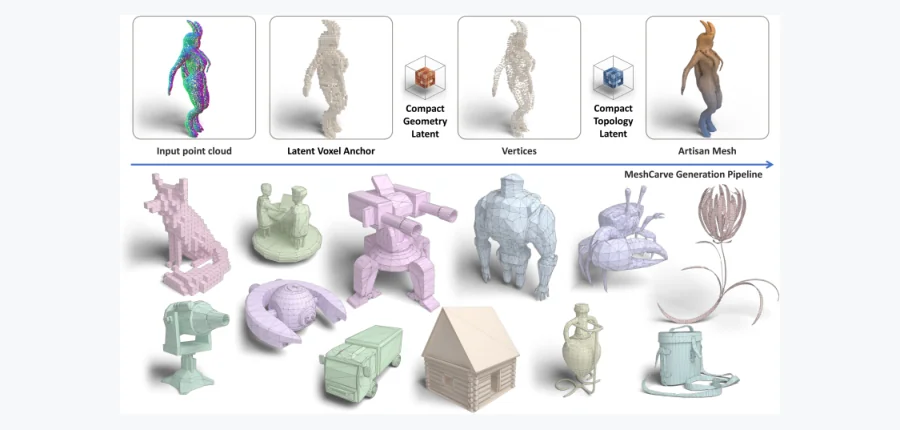 arXiv 2026-10-09 · cs.CV · #31 **[MeshCarve: Artisan Mesh Generation with Flow Matching in Compact Latent Spaces](https://arxiv.org/abs/2610.09723)** Xiyu Wang, Ruocheng Wu, Yufei Wang, Zhihao Li, Lanqing Guo, Bihan Wen 机构：Nanyang Technological University / SparAI / The University of Texas at Austin（PDF 首页） [Paper](https://arxiv.org/abs/2610.09723) · [图源](https://arxiv.org/html/2610.09723v1/teaser.png) 

中文摘要
以往的艺术风格网格生成方法主要自回归预测面片 token，推理较慢。近期方法改用变分自编码器（VAE）构造的连续潜变量做流匹配，但当几何与拓扑联合编码、特别是进一步压缩潜空间时，重建质量明显下降。我们提出 MeshCarve：完全在紧凑潜空间中生成的流匹配方法，分别生成顶点位置和边连接，绕开联合压缩潜变量的困难。为缩短 token 序列，我们提出层级稀疏 Transformer 骨干，分别实现 VertexVAE 和 EdgeVAE。两个 VAE 的潜空间都锚定在离散顶点，而不是编码表面体素上的场，显著缩短 token 序列；空间感知压缩进一步缩短序列而不损害重建。VertexVAE 直接编码顶点占用。针对连通性，我们提出顶点连接编码，把顶点间任意连通关系转为每顶点固定长度的连续嵌入，并忠实恢复复杂艺术拓扑。MeshCarve 把这些 VAE 与锚点生成器结合，在缩短的 token 序列上进行流匹配。在 Objaverse 上，该方法优于当前最佳的自回归与流匹配方法，并泛化到 Toys4K。据作者所知，它是首批每个生成阶段都在空间压缩潜空间运行的艺术网格生成方法之一，token 序列长度仅为先前压缩程度最高的方法的一小部分。 <a href="https://arxiv.org/abs/2610.09723">原摘要来源</a>
 | 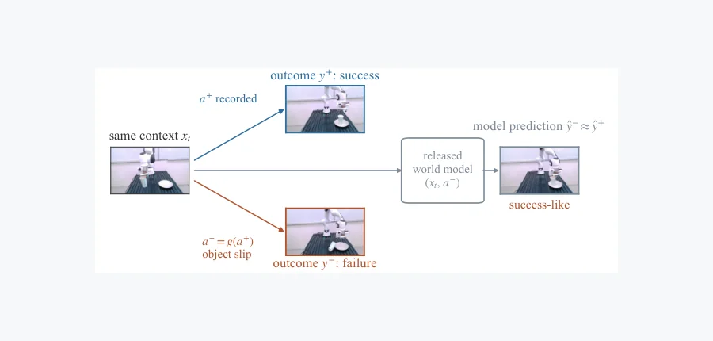 arXiv 2026-10-09 · cs.RO · #32 **[World Models Dream of Success: Diagnosing and Repairing Failure Insensitivity in Robot World Models](https://arxiv.org/abs/2610.09134)** Jiuyi Xu, Xiao Hu, Meida Chen, Peng Gao, Yang Ye, Yangming Shi 机构：Colorado School of Mines / Northeastern University / University of Southern California / North Carolina State University（PDF 首页） [Paper](https://arxiv.org/abs/2610.09134) · [Code](https://github.com/jiuyixu25/CureWM) · [图源](https://arxiv.org/html/2610.09134v1/fig1a_phenomenon.png) 

中文摘要
机器人世界模型支持策略评估、规划和合成数据生成，但这些用途要求预测能区分成功动作与失败动作。我们观察两个架构系列的四个已发布检查点对动作变化不敏感，对经验证失败的动作也常给出仿佛成功的预测。虽然近期研究把失败案例纳入世界模型训练，但不改变架构或训练目标、用何种数据修复已发布检查点，仍研究不足。为此，我们提出 CureWM：从成功示范中按严重程度构造替代动作，在仿真或硬件上执行并核实结果，再用这些失败、仍成功的案例与原有示范共同微调已发布模型。该构造提供来自相同起始情境的受控动作对比。在 484 个留出的 LIBERO 失败反事实中，仅用官方数据微调后的乐观错误率为 80%，而四个独立微调的 CureWM 模型降至 30–43%（平均 38%）。在实体机械臂上的两项独立评估中，相比只用成功示范微调后 90% 的失败预测被潜变量距离诊断判作类似成功，CureWM 将这一比例降至 33%。当每任务失败数量、成功重放数据及训练预算相同时，反事实失败数据产生 0.124 的成功—失败价值差，新的在线采集失败数据仅为 0.014。这些发现支持用经过执行验证的反事实重放进行事后修复，也说明评估时必须同时看乐观错误下降与成功—失败判别。代码：https://github.com/jiuyixu25/CureWM。 <a href="https://arxiv.org/abs/2610.09134">原摘要来源</a>
 | 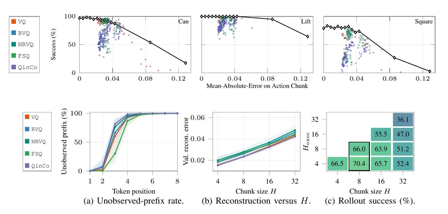 arXiv 2026-10-09 · cs.RO · #33 **[Beyond Reconstruction: What Matters in Action Tokenization for Robot Policies?](https://arxiv.org/abs/2610.09170)** Haoran Chen, Jingtian Ji, Samuel Wheeler, Kaylene Caswell Stocking, Matthew Walter 机构：Toyota Technological Institute at Chicago / Argonne National Laboratory（PDF 首页） [Paper](https://arxiv.org/abs/2610.09170) · [图源](https://arxiv.org/pdf/2610.09170) 

中文摘要
视觉语言动作模型等自回归动作 token 策略，需要动作 tokenizer 将离散 token 序列转为连续空间中的精确控制动作。许多 tokenizer 只通过重建目标学习 token 与动作的映射，但我们的大量分析表明，下游机器人策略的成功并不只取决于重建够准确：策略还必须能针对新观测预测正确 token，且从未在训练中出现的策略 token 预测也应解码成合理动作。这些属性发生在 tokenizer 训练之后，单纯的重建目标不会直接激励它们。我们提出 ProAct（可预测且稳健的动作 token 化），在重建训练中有针对性地加入改善下游可预测性与稳健性的目标。ProAct 与具体策略无关，训练时只使用动作数据集。在 Robomimic、LIBERO 和 RoboTwin 基准及多种 tokenizer 架构上，ProAct 使滚动执行成功率平均提高 11.3 个百分点。收益也迁移到视觉语言动作策略和真实机器人操作，平均分别提高 21.8 和 36.7 个百分点。结果说明，有效的动作 token 化应作为兼顾保真度、可预测性和稳健性的策略接口来设计，而非只把它视为重建问题。 <a href="https://arxiv.org/abs/2610.09170">原摘要来源</a>
 |
| 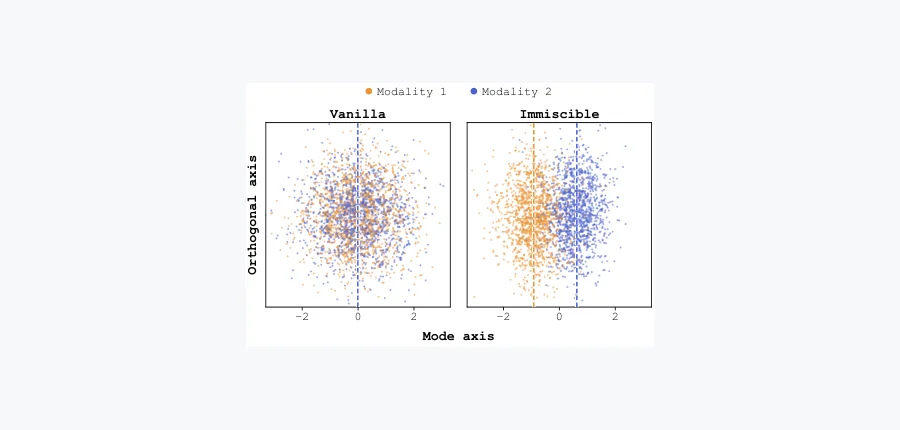 arXiv 2026-10-09 · cs.RO · #34 **[Immiscible Diffusion Policy: Preserving Multimodal Robot Actions through Label-Free Noise Assignment](https://arxiv.org/abs/2610.09369)** Xiao Zhang, Yuxin Chen, Zhixuan Liang, Guojian Zhan, Chenran Li, Chenfeng Xu, Masayoshi Tomizuka, Yiheng Li 机构：University of California, Berkeley / Princeton University / The University of Texas at Austin（PDF 首页） [Paper](https://arxiv.org/abs/2610.09369) · [图源](https://arxiv.org/html/2610.09369v1/fig2_noise_space.png) 

中文摘要
扩散策略刚提出时，人们预期它能恢复多模态动作分布；然而我们发现，即使保证数据集中各模态平衡且每个 batch 内严格对称，扩散策略也常坍缩到单一模态。分析指出，独立的动作—噪声配对增加扩散路径之间的混合与交叉，可能导致平均化的去噪响应并抑制特定模态行为。在动作空间稠密且低维的机器人规划中，这种混合与交叉尤其严重。为缓解该问题，我们提出 Immiscible Diffusion Policy：扩散策略的无标签训练期附加方法，通过动作—噪声分配保持相对分离的噪声到动作路径，不改动策略架构或推理流程。在覆盖状态、RGB 和点云观测的五项仿真及两项真实人形机器人操作任务上，该方法显著改善动作模态的保留，同时维持较强任务表现。在三个双模态任务上，非主导模态的比例增加 6.0–14.6 倍；在两个四模态任务上，恢复了普通扩散策略滚动执行完全缺失的示范模态。结果表明，这是一种在一般机器人学习任务中保留动作多模态性的简单而稳健的办法。 <a href="https://arxiv.org/abs/2610.09369">原摘要来源</a>
 | 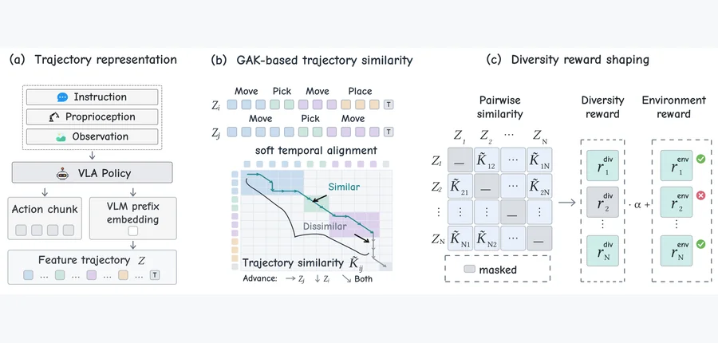 arXiv 2026-10-09 · cs.RO · #35 **[Many Ways to Succeed: Diversity-Driven RL Fine-Tuning for VLA Generalization](https://arxiv.org/abs/2610.09943)** Haoru Li, Jinmei Liu, Zhiyong Wang, Xiaoming Li, Zhenhong Sun, Daoyi Dong, Chunlin Chen, Zhi Wang 机构：Nanjing University / Harbin Institute of Technology Shenzhen / Australian National University / University of Technology Sydney（PDF 首页） [Paper](https://arxiv.org/abs/2610.09943) · [图源](https://arxiv.org/html/2610.09943v1/figures/main.png) 

中文摘要
强化学习（RL）微调通过闭环经验改进视觉语言动作（VLA）策略，但超出微调分布的泛化仍受限。我们的分析发现，RL 对探索的改变具有选择性：整体行为收缩，但成功轨迹更加多样，能用更少的滚动执行取得成功，并比监督微调覆盖更多潜在的任务有效解。成功模式覆盖更广，可能在分布变化时提供替代策略。因此，我们提出 DRIVE：把成功行为的多样性写成显式 RL 目标的 VLA 泛化微调方法。DRIVE 在匹配任务条件下对滚动执行分组，经时间对齐比较轨迹，从相对行为多样性推导以成功为条件的内在奖励。该设计鼓励覆盖更多可行解，同时不奖励多样的失败或表面上的时间差。在 LIBERO-Plus、ManiSkill3 和 RoboTwin 2.0 上，相比普通 RL 微调，DRIVE 在分布外表现上使 π_0 平均提高 5.3 点，使 π_0.5 平均提高 2.0 点。在双臂 AgileX PiPER-X 平台上，平均分布外成功率从 64.1% 提高到 73.3%（增加 9.2 点），表明收益也延续到实体部署。 <a href="https://arxiv.org/abs/2610.09943">原摘要来源</a>
 | 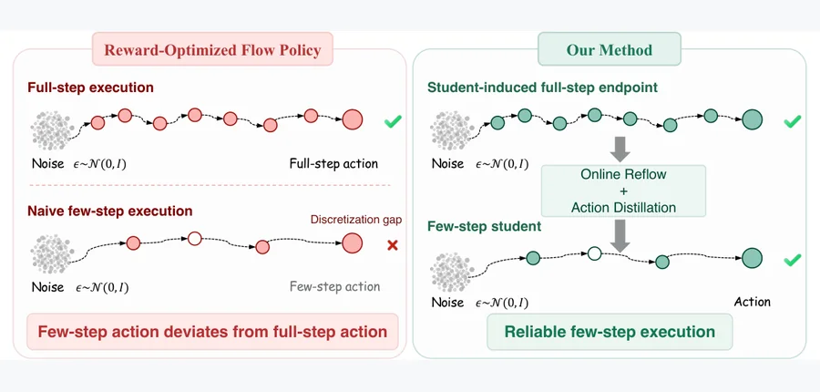 arXiv 2026-10-09 · cs.RO · #36 **[RFPO: Rectified Flow Policy Optimization for Embodied Control](https://arxiv.org/abs/2610.10453)** Ting Huang, Lisiyu Pan, Haoyu Wang, Zeyu Zhang, Siyuan Qian, Yanjun Li, Yandong Guo, Boxin Shi, Hao Tang 机构：Peking University / AI2 Robotics（PDF 首页） [Paper](https://arxiv.org/abs/2610.10453) · [Code](https://github.com/AIGeeksGroup/RFPO) · [Project](https://aigeeksgroup.github.io/RFPO/) · [图源](https://arxiv.org/html/2610.10453v1/teaser.png) 

中文摘要
基于流的策略为连续机器人控制提供表达力强的框架，但反复积分常微分方程（ODE）带来较高推理开销。直接减少积分步数会显著损害控制，因为按完整步数优化的策略并未被约束为在粗粒度数值积分下仍可靠；我们将此称为少步离散化差距。为此，我们提出 RFPO：实现可靠少步执行的流策略优化框架。带奖励感知的在线 Reflow 在同策略学习中修正学生策略诱导的传输路径，使策略更能适应粗积分。冻结的 Gaussian PPO 控制器在完整和中间积分预算下提供互补的动作空间监督，而部署时仍只有一个流学生模型，以单次 Euler 步执行。在 Unitree Go2、Boston Dynamics Spot、Unitree H1 和 Unitree G1 上，RFPO 的一步执行都基本保留完整步数的控制表现；不论零初始化或随机初始化，一步回报与对应的 64 步回报相差不超过 2.4%。在 Unitree Go2 上，一步执行保留 64 步奖励的 98.5%，同时将设备上的平均推理延迟从 4.39 ms 降到 0.08 ms，提速 54.9 倍。真实机器人实验进一步验证了一步行走的稳定性。代码：https://github.com/AIGeeksGroup/RFPO；网站：https://aigeeksgroup.github.io/RFPO/。 <a href="https://arxiv.org/abs/2610.10453">原摘要来源</a>
 |
| 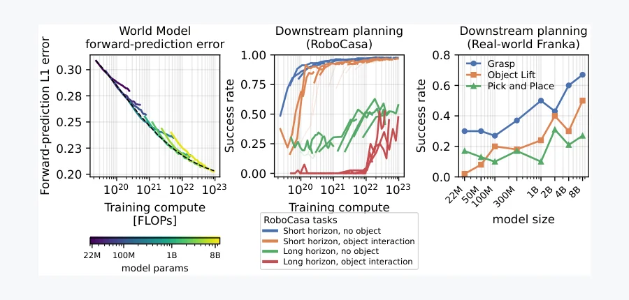 arXiv 2026-10-09 · cs.AI · #37 **[RoboJEPA: Scaling Robotic Latent World Models](https://arxiv.org/abs/2610.10515)** Artem Zholus, Nicolas Beltran-Velez, Jianhao Yuan, Sarath Chandar, Tushar Nagarajan, Daniel Severo, Koustuv Sinha, Michal… 机构：Meta FAIR / Mila / Polytechnique Montréal（PDF 首页） [Paper](https://arxiv.org/abs/2610.10515) · [图源](https://arxiv.org/html/2610.10515v1/visual_abstract.png) 

中文摘要
潜在世界模型已经显示出预测未来状态和在现实中规划的能力。但实践中，我们仍缺乏原则性方法来估计其能力如何随模型规模、数据量和计算量增长，这一开放问题阻碍了领域进展。本文提出 RoboJEPA：基于联合嵌入预测架构（JEPA）、在涵盖 12 种机器人形态的大规模数据集上训练的世界模型。我们发现 RoboJEPA 的想象误差，即潜在状态滚动预测的误差，随计算量服从二阶幂律，可预测超出拟合规模的模型质量。下游机器人规划表现也随计算量以可预测方式改善，且与想象误差高度相关，使后者成为真实机器人评估的可靠代理。最后，我们展示潜在世界模型可零样本部署为机器人智能体，朝单张目标图像规划，解决真实硬件上需要长时规划的任务。我们公开全部模型检查点、训练代码和机器人部署代码。据作者所知，这是首次为真实机器人数据训练的多形态机器人世界模型建立缩放规律；8B 参数的 RoboJEPA 也是迄今训练过的最大 JEPA 预测模型。 <a href="https://arxiv.org/abs/2610.10515">原摘要来源</a>
 | 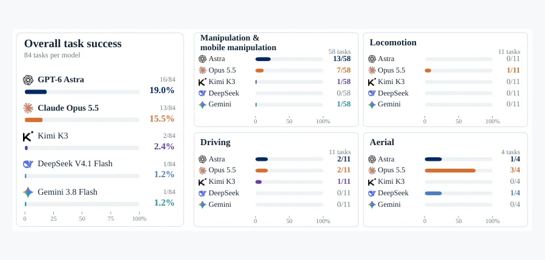 arXiv 2026-10-09 · cs.RO · #38 **[RobotWorld: Benchmarking Multimodal Agents for Robot Use Across Diverse Tasks and Embodiments](https://arxiv.org/abs/2610.10409)** Zhiqin Yang, Chenxin Li, Xiaomeng Hu, Yibin Liu, Weidong Huang, Jiankai Sun, Haitao Li, Zijian Wu, Yuzhi Huang, Fanding Hu… 机构：affiliation 未确认 [Paper](https://arxiv.org/abs/2610.10409) · [图源](https://arxiv.org/html/2610.10409v1/front_leaderboard.png) 

中文摘要
通用智能体越来越能编写代码、使用工具和完成复杂数字任务，这引出一个问题：这些能力在物理世界中能迁移多少？为研究此事，我们提出 RobotWorld：一种具有挑战性的机器人使用仿真测试平台，要求智能体通过机器人接口，把指令和观测变成物理任务执行。其 84 项任务覆盖操作、移动操作、行走、驾驶和空中控制，设有明确交互预算与可执行的成功检查。通过联合分析任务结果和执行轨迹，我们识别可迁移的能力及阻碍可靠完成的缺口。我们还发现，现有智能体能够建立复杂的感知和控制工作流，包括图像分割、相机标定、空间估计和基于动力学的计算；然而这些能力不能稳定组合成成功行为：智能体即使到达指令位姿，也会丢失与任务相关的物体状态，不能纠正无效动作，恢复太晚，或把未完成任务误判为完成。不同模型的迁移也不均衡：Astra 更擅长空间目标和受限接触目标，Opus 5.5 更擅长连续平衡和限时交互目标。RobotWorld 将结果与执行行为联系起来，提供严格的测试场，并从实证角度指出剩余能力缺口，为训练和设计更可靠的物理世界智能体确立具体目标。 <a href="https://arxiv.org/abs/2610.10409">原摘要来源</a>
 | 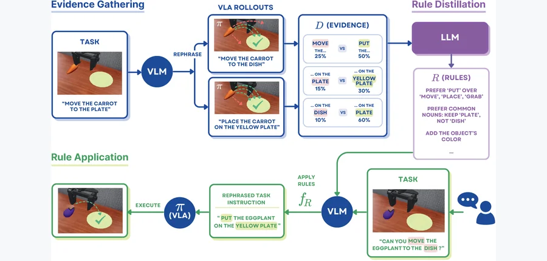 arXiv 2026-10-09 · cs.RO · #39 **[Rephrase Before You Act: Characterizing and Mitigating Language Sensitivity in Vision-Language-Action Models](https://arxiv.org/abs/2610.10526)** Mikey Watts (Independent Researcher), Yuchen Cui (University of California, Los Angeles) 机构：Independent researcher / UCLA（PDF 首页） [Paper](https://arxiv.org/abs/2610.10526) · [Project](https://sttawm.github.io/rephrase-before-you-act/) · [图源](https://arxiv.org/html/2610.10526v1/figures/method_overview.png) 

中文摘要
视觉语言动作模型（VLA）对指令措辞异常敏感，并未继承其底层视觉语言模型的语言稳健性。一个词的改动就能让成功率变化数十个百分点：π_0.5 在 LIBERO 中对“switch on the stove”的开炉任务成功率为 100%，对“switch on the hot plate”则仅为 2%；即使通过改写增强微调，π_0 检查点的波动仍可达 61 点。我们用经过统计检验的单次编辑波动和最优措辞搜索描述这种敏感性；仅改变措辞，就几乎弥合分布内与分布外任务之间的 21 点差距。随后，我们无需修改策略便降低这种敏感性。由于其规律具有系统性，我们可以将其写成明确规则：在少量训练任务上为许多措辞评分，让大语言模型从证据中提炼十到二十条改写规则；部署时按规则将每条输入指令改写一次。在覆盖对抗式、VLM 生成和人类生成措辞的 12 项留出任务上，规则使冻结的 π_0 相对提高 16%–27%，收益集中在分布外任务。该流程还在 π_0.5 和 LIBERO 上复现，使微调任务内成功率从 93.6% 提高到 97.8%。方法无需重新训练或逐步验证，可零样本用于未见任务与指令。项目网站：https://sttawm.github.io/rephrase-before-you-act/。 <a href="https://arxiv.org/abs/2610.10526">原摘要来源</a>
 |
| 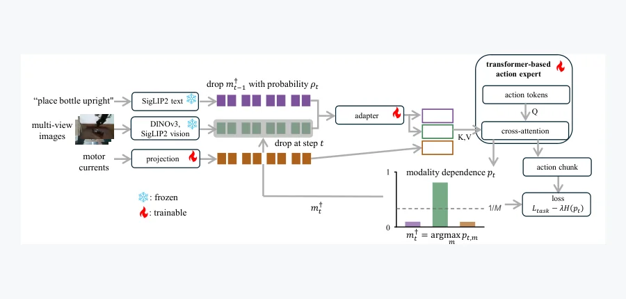 arXiv 2026-10-09 · cs.RO · #40 **[Targeted Modality Dropout for Real-Robot Manipulation Robust to Intermittent Vision Loss](https://arxiv.org/abs/2610.09566)** Genki Shikada, Kazuki Osamura, Masaru Ide, Tetsuya Ogata, Kanata Suzuki 机构：Fujitsu / Waseda University / AIST（PDF 首页） [Paper](https://arxiv.org/abs/2610.09566) · [图源](https://arxiv.org/html/2610.09566v1/fig_model.png) 

中文摘要
结合多种感知模态的模仿学习策略，在训练时容易过度依赖视觉等主导模态；推理时一旦该模态缺失，策略执行就可能中断。本文提出定向模态丢弃（TMD）：用注意力估计策略对每种模态的依赖，并有选择地丢弃依赖最强的模态，同时对依赖分布施加熵正则。双臂机械臂的真实机器人评估表明，视觉缺失时基线策略成功率大幅下降，而 TMD 仍可执行任务。相比之下，未使用熵正则、随机选择丢弃模态的常规 dropout，即使视觉没有缺失，也在许多任务上失败。 <a href="https://arxiv.org/abs/2610.09566">原摘要来源</a>
 |   |   |
<!-- PAPER_CARDS_END -->

## 检索概况

- **检索窗口**：北京时间 2026-10-09 09:00 起；arXiv 官方 New 列表显示 2026-10-08（星期四）批次。
- **来源**：官方 [cs](https://arxiv.org/list/cs/new?show=2000)、[physics](https://arxiv.org/list/physics/new?show=2000)、[cond-mat](https://arxiv.org/list/cond-mat/new?show=2000)、[math](https://arxiv.org/list/math/new?show=2000)、[stat.ML](https://arxiv.org/list/stat.ML/new?show=2000)、[eess.IV](https://arxiv.org/list/eess.IV/new?show=2000)、[eess.SY](https://arxiv.org/list/eess.SY/new?show=2000)、[eess.SP](https://arxiv.org/list/eess.SP/new?show=2000) New 列表。
- **总命中与入选**：八类共 1,503 条 New 列表记录，按 arXiv ID 去重后 1,440 篇；Cross 318 条、Replacement 943 条。依据标题与原摘要，主榜入选 **40 篇**。
- **材料状态**：40 篇官方原摘要和对应完整中文译文；40 张来自对应 arXiv HTML 或 PDF 的真实配图；缺摘要 **0 篇**、缺图 **0 篇**，机构未可靠确认 **2 篇**。
- **标注**：标题、作者、分类、摘要方法和论文报告的结果为 `[事实]`；相关性、机构强度、优先级、局限与改进建议为 `[推断]`。

## Top papers

下表相关性、机构强度和阅读优先级均为日报推断。

| # | 标题 | 来源 | 分类 | 作者 | 机构 | 相关性（推断） | 机构强度（推断） | 阅读优先级（推断） |
|---:|---|---|---|---|---|---|---|---|
| 1 | StableGrasp: Reconstructing Physically Stable Human Hand Grasps from Single Images | [arXiv:2610.09195](https://arxiv.org/abs/2610.09195) | cs.CV | Han Jiang, Etienne Vouga, Qixing Huang, Georgios Pavlakos | The University of Texas at Austin（PDF 首页） | 极高 | 待核 | 高 |
| 2 | VolCo: Volumetric Contact for High-Fidelity Human Grasp Generation | [arXiv:2610.10197](https://arxiv.org/abs/2610.10197) | cs.CV | Zhuo Chen, Yihua Cheng, Aleš Leonardis, Hyung Jin Chang | University of Birmingham / Beijing Institute of Technology（PDF 首页） | 极高 | 待核 | 高 |
| 3 | Tetris3D: 3D Scene Generation With Objects That Fit Together | [arXiv:2610.10539](https://arxiv.org/abs/2610.10539) | cs.CV | Jaeyeong Kim, Jinhyuk Jang, Jongmin Lee, Kyehong Park, Seungryong Kim | KAIST（PDF 首页） | 极高 | 待核 | 高 |
| 4 | Point It, Strike It: Direction-Conditioned Dynamic Manipulation of Deformable Linear Objects | [arXiv:2610.09573](https://arxiv.org/abs/2610.09573) | cs.RO | Yi Yang, Xiang Fei, Lehong Wang, Zilin Dai, Ruogu Li, Jiting Cai, Liyao Chang, Xinyi Yang, Henry Kou, Ruijie Fu, Lu Li, Howie Choset | Carnegie Mellon University / Shanghai Jiao Tong University / Harvard University（PDF 首页） | 极高 | 待核 | 高 |
| 5 | Physics-based Sphere Packing for Lagrangian Mesh Morphing | [arXiv:2610.08880](https://arxiv.org/abs/2610.08880) | cs.GR | Jiong Lin, Hod Lipson | Columbia University（PDF 首页） | 极高 | 待核 | 高 |
| 6 | FlashNeRD: Performance-First Contact-Rich Neural Robot Dynamics | [arXiv:2610.09130](https://arxiv.org/abs/2610.09130) | cs.RO | Mohammadmehdi Ataei, Mohammad Amin Nabian, Jie Xu, Miles Macklin, Yashraj Narang, Eric Heiden, Octi Zhang, Yunrong Guo, Ruben D'Sa, Oliver Hennigh, Gavriel State, Sanjay Choudhry | NVIDIA（PDF 首页） | 极高 | 待核 | 高 |
| 7 | DynStream: Online Streaming 4D Gaussian Reconstruction of Dynamic Worlds from Unposed Video | [arXiv:2610.09720](https://arxiv.org/abs/2610.09720) | cs.CV | Dingwei Xian, Xiaoyu Zhou, Yajiao Xiong, Yongtao Wang, Ming-Hsuan Yang | Peking University / VGI Labs / University of California, Merced（PDF 首页） | 极高 | 待核 | 高 |
| 8 | Phase-Field Fracture Simulation of Highly Deformable Thin Structures via a Discrete Differential Geometry Framework | [arXiv:2610.08997](https://arxiv.org/abs/2610.08997) | cond-mat.soft（非 cs） | Bohan Zhang, Bo Wang, Huajiang Ouyang, Zhigang Wu, Yu Zhou, Weicheng Huang | Northwestern Polytechnical University / Newcastle University / University of Liverpool / Sun Yat-sen University / Harvard University（PDF 首页） | 极高 | 待核 | 高 |
| 9 | Video-to-Model: Automatic Modeling of Deformable Linear Objects | [arXiv:2610.10039](https://arxiv.org/abs/2610.10039) | cs.RO | Akshun Sharma, Kimia Forghani, Yancy Diaz-Mercado | University of Maryland（PDF 首页） | 极高 | 待核 | 高 |
| 10 | RobotAPO: Adversarial Physics Preference Optimization for Robotic Manipulation Video Generation | [arXiv:2610.09454](https://arxiv.org/abs/2610.09454) | cs.RO | Kerui Li, Zhe Jing, Chenyi Huang, Xiaofeng Wang, Zheng Zhu, Haoming Cui, Huaibo Huang | Chinese Academy of Sciences / GigaAI / Beijing Institute of Technology（PDF 首页） | 极高 | 待核 | 高 |
| 11 | RLHND: Video Foundation Models as Physically Grounded Hand Trackers for Robot Learning | [arXiv:2610.09455](https://arxiv.org/abs/2610.09455) | cs.CV | Seungjun Moon, Subin Jeon, Sangwoo Kim, Hanbyul Joo, Jinwoo Shin | RLWRLD / KAIST / Seoul National University（PDF 首页） | 极高 | 待核 | 高 |
| 12 | From Digital Human Interactions to Physics-Based Humanoid Skills: Physics-Grounded Post-Training of Interaction Generators | [arXiv:2610.10322](https://arxiv.org/abs/2610.10322) | cs.CV | Kerui Chen, Jianrong Zhang, Kai Lv, Hehe Fan | Zhejiang University / Beijing Jiaotong University（PDF 首页） | 极高 | 待核 | 高 |
| 13 | MagCilia: A Compact Magnetociliary Tactile Sensor with 3D Force Sensing for Robotic Contact Perception and Grasping Feedback | [arXiv:2610.09536](https://arxiv.org/abs/2610.09536) | cs.RO | Yu Feng, Hao Wu, Haotian Guo, Haoming Liu, William Su, Jingxiang Guo, Jiankun Li, Masayoshi Tomizuka, Wen Jung Li, Jianshu Zhou | National University of Singapore / University of California, Berkeley / City University of Hong Kong（PDF 首页） | 极高 | 待核 | 高 |
| 14 | Tactile Reconstruction of Contact Task Frames and Forces for Hybrid Force/Motion Control | [arXiv:2610.10020](https://arxiv.org/abs/2610.10020) | cs.RO | Antonio Rapuano, Simone Orelli, Barbara Bazzana, Antonio Franchi, Alessandro De Luca | Sapienza University of Rome / University of Twente（PDF 首页） | 极高 | 待核 | 高 |
| 15 | Factorized Tactile Representation and Control for Sim-to-Real Manipulation | [arXiv:2610.10510](https://arxiv.org/abs/2610.10510) | cs.RO | Siqi Shang, Bianca Aumann, Tye Brady, Joshua Migdal, Taskin Padir | Amazon Fulfillment Technologies & Robotics / The University of Texas at Austin（PDF 首页） | 极高 | 待核 | 高 |
| 16 | Temporal Visuo-Tactile Learning for Dexterous Grasp Stability | [arXiv:2610.10283](https://arxiv.org/abs/2610.10283) | cs.RO | Ken Nakahara, Aleksei Buvailik, Prokhor Kotov, Roberto Calandra | TU Dresden（PDF 首页） | 极高 | 待核 | 高 |
| 17 | TouchScale: 500 Hours of Human Vision and Touch for Visual-Tactile Learning | [arXiv:2610.10288](https://arxiv.org/abs/2610.10288) | cs.CV | Dayou Li, Hao Wang, Qianqian Yang, Zihao Zhu, Haoquan Fang, Ziyao Zeng, Yan Han, Zihan Wang, Yan Wang, Baoru Huang, Dilin Wang, Kenji Shimada, Yiyue Luo, Manling Li, Teresa Lv, Mustafa Mukadam, Rakesh Ranjan, Ruohan Zhang, Qi He, Changliu Liu, Xu Chen, Marco Pavone, Bangya Liu, Jiachen Li, Masayoshi Tomizuka, Zhiwen Fan | Texas A&M University / Google DeepMind / Carnegie Mellon University / Stanford University 等（PDF 首页） | 极高 | 待核 | 高 |
| 18 | OpenViTac: Learning and Benchmarking Visuo-Tactile Policies in a Unified Sim-and-Real Framework | [arXiv:2610.10384](https://arxiv.org/abs/2610.10384) | cs.RO | Yifan Wu, Qin Li, Nan Min, Guojin Zhong, Haoyu Zhao, Zhiyuan Li, Houze Xu, Shengqi Xu, Xingyao Lin, Zijie Diao, Zhaoxiang Liu, Shiguo Lian, Shunlin Lu, Shihao Zhao, Ziyi Ye, Zuxuan Wu, Yu-Gang Jiang | Fudan University / Hefei University of Technology / National University of Singapore / Neote AI / China Unicom（PDF 首页） | 极高 | 待核 | 高 |
| 19 | On-Demand Robotic Assembly via Differentiable Geometric Part Repair | [arXiv:2610.09777](https://arxiv.org/abs/2610.09777) | cs.RO | Millicent Schlafly, Fabio Schaub, Diogo Costa Pais, Luca Lelli, Janne Dvorak, Claire Colmont, Sven Marti, Mark D. Fuge | affiliation 未确认 | 高 | 待核 | 中高 |
| 20 | Agentic RSR: Real-to-Sim-to-Real through Scene Reconstruction and Execution-Grounded Robot Policies | [arXiv:2610.10479](https://arxiv.org/abs/2610.10479) | cs.RO | Yihan Li, Yating Feng, Shengjiu Sun, Jianing Chen, Hao Ren, Bowen Yang, Weisheng Xu, Qiwei Wu, Hui Cheng, Renjing Xu | Sun Yat-sen University / HKUST Guangzhou（PDF 首页） | 高 | 待核 | 中高 |
| 21 | Predicted Futures Are Not Enough: Learning Executable Goals for Robot Manipulation | [arXiv:2610.09309](https://arxiv.org/abs/2610.09309) | cs.RO | Tzu-Yu Chuang, Ching-Hsiang Chang, Yi-Hsiu Lee, Yi-Ting Chen, Min Sun, YuanFu Yang | National Yang Ming Chiao Tung University / National Tsing Hua University（PDF 首页） | 高 | 待核 | 中高 |
| 22 | RoboRender: Robot-Oriented Video Generation for Visual Sim-to-Real Transfer | [arXiv:2610.09254](https://arxiv.org/abs/2610.09254) | cs.RO | Huang Huang, Wensi Ai, Ziyu Chen, Youhui Wang, Zijian Du, Yang Liu, Jiaolong Yang, Li Fei-Fei, Jiajun Wu | Stanford University / NVIDIA / Microsoft Research（PDF 首页） | 高 | 待核 | 中高 |
| 23 | HULK: Learning Whole-Body Forceful Loco-Manipulation for Humanoids | [arXiv:2610.08970](https://arxiv.org/abs/2610.08970) | cs.RO | An Dang, Arturo Flores Alvarez, Yu-Ming Chen, Conor Mc Gartoll, Helen Sun, Aaron Ames, Nima Fazeli, Manikantan Nambi | Amazon / University of Michigan / UCLA / Caltech（PDF 首页） | 高 | 待核 | 中高 |
| 24 | From Wearable Interfaces to Dexterous Policies: Contact Shifts and Tactile Representations | [arXiv:2610.08870](https://arxiv.org/abs/2610.08870) | cs.RO | Ruitong Tian, Fang Xu, Noah B. Wilson, Xianyao Li, Eric Jing Du | University of Florida（PDF 首页） | 高 | 待核 | 中高 |
| 25 | SAFE: Unified Slip and Fracture Detection with Low-Cost Acoustic Sensing in Robotic Grasping | [arXiv:2610.08802](https://arxiv.org/abs/2610.08802) | cs.RO | Zerun Wang, Vivek Kamat, Shekhar Bhansali | Georgia Institute of Technology / Vanderbilt University（PDF 首页） | 高 | 待核 | 中高 |
| 26 | Robotic Boomerang Throwing via Model-Based Release Design | [arXiv:2610.10472](https://arxiv.org/abs/2610.10472) | cs.RO | Yang Liu, Colin Jones, Aude Billard | EPFL（PDF 首页） | 中高 | 待核 | 中 |
| 27 | StyleFields: Multi-Scale AdaIN-Modulated Implicit SDFs for Coarse-to-Fine 3D Shape Reconstruction and Editing | [arXiv:2610.09200](https://arxiv.org/abs/2610.09200) | cs.CV | Ehsan Garaaghaji, Nicolas Talabot, Pascal Fua, Doruk Oner | Bilkent University / EPFL（PDF 首页） | 中高 | 待核 | 中 |
| 28 | ActiveLang: Active Open-Vocabulary 3D Mapping with Semantic-Uncertainty-Guided Exploration | [arXiv:2610.09518](https://arxiv.org/abs/2610.09518) | cs.CV | Liyan Chen, Hairong Yin, Huangying Zhan, Yi Xu, Raymond A. Yeh, Philippos Mordohai | Stevens Institute of Technology / Purdue University / Goertek Alpha Labs（PDF 首页） | 中高 | 待核 | 中 |
| 29 | S2Tok: Streaming 3D Gaussian Reconstruction with Persistent Spatial Tokens | [arXiv:2610.08978](https://arxiv.org/abs/2610.08978) | cs.CV | Fang Li, Jiraphon Yenphraphai, Quentin Herau, Depu Meng, Yihan Hu, Tianshuo Xu, Narendra Ahuja, Wei Zhan | Applied Intuition / University of Illinois Urbana-Champaign / Purdue University / University of California, Berkeley（PDF 首页） | 中高 | 待核 | 中 |
| 30 | DeltaSplat: Iterative Gaussian Refinement for Pose-Free Feed-Forward 3D Gaussian Splatting | [arXiv:2610.09853](https://arxiv.org/abs/2610.09853) | cs.CV | Chanung Park, Seunghyeon Song, Joo Chan Lee, Eunbyung Park, Jong Hwan Ko | Sungkyunkwan University / Yonsei University（PDF 首页） | 中高 | 待核 | 中 |
| 31 | MeshCarve: Artisan Mesh Generation with Flow Matching in Compact Latent Spaces | [arXiv:2610.09723](https://arxiv.org/abs/2610.09723) | cs.CV | Xiyu Wang, Ruocheng Wu, Yufei Wang, Zhihao Li, Lanqing Guo, Bihan Wen | Nanyang Technological University / SparAI / The University of Texas at Austin（PDF 首页） | 中高 | 待核 | 中 |
| 32 | World Models Dream of Success: Diagnosing and Repairing Failure Insensitivity in Robot World Models | [arXiv:2610.09134](https://arxiv.org/abs/2610.09134) | cs.RO | Jiuyi Xu, Xiao Hu, Meida Chen, Peng Gao, Yang Ye, Yangming Shi | Colorado School of Mines / Northeastern University / University of Southern California / North Carolina State University（PDF 首页） | 中高 | 待核 | 中 |
| 33 | Beyond Reconstruction: What Matters in Action Tokenization for Robot Policies? | [arXiv:2610.09170](https://arxiv.org/abs/2610.09170) | cs.RO | Haoran Chen, Jingtian Ji, Samuel Wheeler, Kaylene Caswell Stocking, Matthew Walter | Toyota Technological Institute at Chicago / Argonne National Laboratory（PDF 首页） | 中高 | 待核 | 中 |
| 34 | Immiscible Diffusion Policy: Preserving Multimodal Robot Actions through Label-Free Noise Assignment | [arXiv:2610.09369](https://arxiv.org/abs/2610.09369) | cs.RO | Xiao Zhang, Yuxin Chen, Zhixuan Liang, Guojian Zhan, Chenran Li, Chenfeng Xu, Masayoshi Tomizuka, Yiheng Li | University of California, Berkeley / Princeton University / The University of Texas at Austin（PDF 首页） | 中高 | 待核 | 中 |
| 35 | Many Ways to Succeed: Diversity-Driven RL Fine-Tuning for VLA Generalization | [arXiv:2610.09943](https://arxiv.org/abs/2610.09943) | cs.RO | Haoru Li, Jinmei Liu, Zhiyong Wang, Xiaoming Li, Zhenhong Sun, Daoyi Dong, Chunlin Chen, Zhi Wang | Nanjing University / Harbin Institute of Technology Shenzhen / Australian National University / University of Technology Sydney（PDF 首页） | 中高 | 待核 | 中 |
| 36 | RFPO: Rectified Flow Policy Optimization for Embodied Control | [arXiv:2610.10453](https://arxiv.org/abs/2610.10453) | cs.RO | Ting Huang, Lisiyu Pan, Haoyu Wang, Zeyu Zhang, Siyuan Qian, Yanjun Li, Yandong Guo, Boxin Shi, Hao Tang | Peking University / AI2 Robotics（PDF 首页） | 中高 | 待核 | 中 |
| 37 | RoboJEPA: Scaling Robotic Latent World Models | [arXiv:2610.10515](https://arxiv.org/abs/2610.10515) | cs.AI | Artem Zholus, Nicolas Beltran-Velez, Jianhao Yuan, Sarath Chandar, Tushar Nagarajan, Daniel Severo, Koustuv Sinha, Michal Drozdzal, Adriana Romero Soriano, Jeannette Bohg, Nicolas Ballas, Mahmoud Assran | Meta FAIR / Mila / Polytechnique Montréal（PDF 首页） | 中高 | 待核 | 中 |
| 38 | RobotWorld: Benchmarking Multimodal Agents for Robot Use Across Diverse Tasks and Embodiments | [arXiv:2610.10409](https://arxiv.org/abs/2610.10409) | cs.RO | Zhiqin Yang, Chenxin Li, Xiaomeng Hu, Yibin Liu, Weidong Huang, Jiankai Sun, Haitao Li, Zijian Wu, Yuzhi Huang, Fanding Huang, Hanwen Sun, Jiashun Liu, Jingqi Tong, Mingxin Huang, Shaoli Hu, Shijue Huang, Tianyi Bai, Xinyuan Wang, Yunlong Lin, Zhengyang Tang, Zhexin Zhang, Zhuo Chen, Xierui Song, Juntao Dai, Boyuan Chen, Jiaming Ji, Fangneng Zhan, Mengkang Hu, Wei Xue, Yonggang Zhang, Han Hu, Tsung-Yi Ho, Yike Guo | affiliation 未确认 | 中高 | 待核 | 中 |
| 39 | Rephrase Before You Act: Characterizing and Mitigating Language Sensitivity in Vision-Language-Action Models | [arXiv:2610.10526](https://arxiv.org/abs/2610.10526) | cs.RO | Mikey Watts (Independent Researcher), Yuchen Cui (University of California, Los Angeles) | Independent researcher / UCLA（PDF 首页） | 中高 | 待核 | 中 |
| 40 | Targeted Modality Dropout for Real-Robot Manipulation Robust to Intermittent Vision Loss | [arXiv:2610.09566](https://arxiv.org/abs/2610.09566) | cs.RO | Genki Shikada, Kazuki Osamura, Masaru Ide, Tetsuya Ogata, Kanata Suzuki | Fujitsu / Waseda University / AIST（PDF 首页） | 中高 | 待核 | 中 |

## 逐篇中文要点

### 1. [StableGrasp: Reconstructing Physically Stable Human Hand Grasps from Single Images](https://arxiv.org/abs/2610.09195)

- [事实] 把视觉手姿态与决定抓力的控制目标分开，在可微仿真中联合优化，并用视觉与几何正则约束。
- [事实] 论文报告所得抓取在严格物理仿真中更稳定，同时保持与输入图像一致。
- [推断] 建议对未见材料与摩擦系数作扰动评估；仿真稳定性尚需与真实手物接触结果对应。

### 2. [VolCo: Volumetric Contact for High-Fidelity Human Grasp Generation](https://arxiv.org/abs/2610.10197)

- [事实] VolCo 用三维体积网格编码接触，以局部 SDF 条件 VAE 和全局扩散模型分别建模局部接触与整体手形。
- [事实] 两个基准上的结果报告较少穿透和较好的抓取稳定性。
- [推断] 可把接触斑块大小和法向力纳入分层表示，检验“少穿透”是否伴随真实接触力学改善。

### 3. [Tetris3D: 3D Scene Generation With Objects That Fit Together](https://arxiv.org/abs/2610.10539)

- [事实] Tetris3D 按周围物体几何与物理关系逐物体生成三维场景，并推出 120 万场景的 ComOb。
- [事实] 论文报告合成和真实场景中的形状、姿态、生成质量与物理稳定性收益。
- [推断] 应检验遮挡接触边界的几何误差，并在相同碰撞检测器下比较稳定性，避免视觉合理性掩盖接触偏差。

### 4. [Point It, Strike It: Direction-Conditioned Dynamic Manipulation of Deformable Linear Objects](https://arxiv.org/abs/2610.09573)

- [事实] DeformX2.0 增加 GPU、Cosserat 杆与空气动力学；TRACE 生成目标位置加到达方向的挥绳数据。
- [事实] RECAP 通过少量真实挥动校准，在三种绳索上提高位置及方向目标成功率。
- [推断] 可分离绳索参数校准与动作残差修正的贡献，测试跨绳索和气流条件的可靠性。

### 5. [Physics-based Sphere Packing for Lagrangian Mesh Morphing](https://arxiv.org/abs/2610.08880)

- [事实] JamTet 用球体堆积生成四面体网格并在形变时保留内部节点身份，接入 JAX 可微仿真。
- [事实] 软体机器人形态设计实验报告内部节点梯度相对仅表面方案提高游泳适应度。
- [推断] 应测量大幅变形下节点对应、单元质量与梯度偏差之间的权衡。

### 6. [FlashNeRD: Performance-First Contact-Rich Neural Robot Dynamics](https://arxiv.org/abs/2610.09130)

- [事实] FlashNeRD 允许任意位置接触，并与解析物体动力学双向耦合，同时采用并行流式架构。
- [事实] 五种机器人上的评估报告更快且更准确；三种机器人的模型相对优化版 NeRD 最多快 55 倍。
- [推断] 需按接触密度和长时滚动长度分层测试误差，确认速度收益未掩盖罕见接触失败。

### 7. [DynStream: Online Streaming 4D Gaussian Reconstruction of Dynamic Worlds from Unposed Video](https://arxiv.org/abs/2610.09720)

- [事实] DynStream 把长视频分成局部时间窗口，再对齐融合为全局一致的动态 4D Gaussian 场景。
- [事实] 论文报告无需逐场景优化即可处理长时间、无位姿视频，并实现在线高保真渲染。
- [推断] 建议定量核查跨窗口动态物体身份、尺度漂移和遮挡后几何的一致性。

### 8. [Phase-Field Fracture Simulation of Highly Deformable Thin Structures via a Discrete Differential Geometry Framework](https://arxiv.org/abs/2610.08997)

- [事实] DDG 相场框架在三角中面上耦合膜内、弯曲弹性与裂纹演化，用删除及拓扑重建允许断裂后大形变。
- [事实] 二维裂纹结果与非线性有限元接近；三维撕裂模拟捕捉平行裂纹会聚等现象。
- [推断] 可在相同网格分辨率下测试裂纹路径对删除阈值的敏感性与能量守恒。

### 9. [Video-to-Model: Automatic Modeling of Deformable Linear Objects](https://arxiv.org/abs/2610.10039)

- [事实] 从视频跟踪缝合线节点，并用时空 CNN 估计结构化 CBF–CLF–QP 模型参数。
- [事实] 在未见配置和运动上，论文报告能模拟给定缝针速度下的线运动且跟踪误差较低。
- [推断] 应增加遮挡与快速接触条件，比较辨识参数是否仍具有可迁移的物理意义。

### 10. [RobotAPO: Adversarial Physics Preference Optimization for Robotic Manipulation Video Generation](https://arxiv.org/abs/2610.09454)

- [事实] AgiBot-PhysPref 收集 10,000 组条件匹配的物理违例偏好；RobotAPO 在流匹配去噪空间学习对抗式物理偏好。
- [事实] 摘要报告留出条件的物理一致性得分提高，真实机器人重放任务成功率相对提高 37.4%。
- [推断] 应独立统计接触穿透、提前运动与动作时序误差，定位哪些违例改善驱动实体收益。

### 11. [RLHND: Video Foundation Models as Physically Grounded Hand Trackers for Robot Learning](https://arxiv.org/abs/2610.09455)

- [事实] RLHND 用 Cosmos 3 视频先验估计手姿态，并由冻结姿态分支后的触觉分支预测稠密接触和力。
- [事实] 论文报告姿态、接触与力估计基准的领先结果，并给出重定向和实体机器人实验。
- [推断] 要检验预测力在未见材质与受遮挡交互下是否有尺度可靠性，避免只依赖姿态指标。

### 12. [From Digital Human Interactions to Physics-Based Humanoid Skills: Physics-Grounded Post-Training of Interaction Generators](https://arxiv.org/abs/2610.10322)

- [事实] DIGHT 将双人交互生成与人形跟踪策略共同适配，用仿真执行结果构造可执行性与接触忠实度偏好。
- [事实] 扩散 DPO 在不对仿真器求导的情况下保留分项物理监督，摘要报告仿真交互改善。
- [推断] 可把“能跟踪”和“接触真实”分别作为门槛，避免奖励耦合使视觉交互改善被误判为物理成功。

### 13. [MagCilia: A Compact Magnetociliary Tactile Sensor with 3D Force Sensing for Robotic Contact Perception and Grasping Feedback](https://arxiv.org/abs/2610.09536)

- [事实] MagCilia 结合磁纤毛、霍尔传感器与历史融合回归，从磁信号重建三维接触力。
- [事实] 按标定记录分组的五折测试，三个力轴 RMSE 分别为 0.40、0.57、0.69 N；另有抓取与表面识别演示。
- [推断] 建议跨安装位置、温度和重复接触测试漂移，评估标定分组外的真实可用性。

### 14. [Tactile Reconstruction of Contact Task Frames and Forces for Hybrid Force/Motion Control](https://arxiv.org/abs/2610.10020)

- [事实] 用单张弹性体图像估计压入深度、接触倾角、三维力及不确定性，再与本体感觉在 EKF 中融合。
- [事实] UR10 与 DigiTac 的实验报告仅凭触觉外部反馈即可在移动平板上闭环调节力。
- [推断] 局部平面和忽略接触力矩的假设需在曲面、边缘接触中单独验证。

### 15. [Factorized Tactile Representation and Control for Sim-to-Real Manipulation](https://arxiv.org/abs/2610.10510)

- [事实] 把触觉响应分解为接触几何、力分布和时序变化，分别编码随机化，并用触觉门控策略融合控制。
- [事实] 摘要报告未见几何上的定位误差小于 1 mm、力跟踪误差 1.69 N，实体插销插入提升 35%。
- [推断] 建议逐项屏蔽分量和传感器通道，判断跨传感器迁移最依赖哪个因子。

### 16. [Temporal Visuo-Tactile Learning for Dexterous Grasp Stability](https://arxiv.org/abs/2610.10283)

- [事实] 在 200 个物体上采集 10,000 次多指抓取，用视觉、本体与四个 Digit 360 的动态触觉预测抬起后稳定性。
- [事实] 真实机器人上，视觉触觉重抓策略使已执行抬升成功率比无触觉门控高 10.5 个百分点。
- [推断] 需同时报告门控拒绝率和所有尝试的总成功率，避免只看“已执行抬升”的条件成功率。

### 17. [TouchScale: 500 Hours of Human Vision and Touch for Visual-Tactile Learning](https://arxiv.org/abs/2610.10288)

- [事实] TouchScale 以统一可穿戴设备采集 500 小时、约 2,000 任务的 RGB-D、腕部视频和双手稠密触觉。
- [事实] 用于机器人策略中期训练时，四项真实富接触操作任务的平均成功率由 22.5% 升至 57.5%。
- [推断] 可按接触类型、任务相似度和对象重合度做分层消融，检验规模收益的迁移边界。

### 18. [OpenViTac: Learning and Benchmarking Visuo-Tactile Policies in a Unified Sim-and-Real Framework](https://arxiv.org/abs/2610.10384)

- [事实] OpenViTac 用四个触觉能力维度和成对仿真—真实设置，统一评估 VLA、WAM 与 VTLA。
- [事实] OpenVTLA 结合受评的触觉表示与融合策略；论文还分析仿真—现实联合训练。
- [推断] 建议固定传感器与策略预算，分别报告触觉表示增益和仿真域匹配增益。

### 19. [On-Demand Robotic Assembly via Differentiable Geometric Part Repair](https://arxiv.org/abs/2610.09777)

- [事实] 用生成模型给出木件初始三维几何，再通过图注意力代理模型的梯度修复重叠与机器人拧螺丝可装配性。
- [事实] 60 个新指令中 86.7% 的设计满足拧螺丝要求，十个结构由两台 UR5e 实际装配。
- [推断] 应把代理模型预测可装配与实体装配成功分开统计，检查复杂几何和公差失配。

### 20. [Agentic RSR: Real-to-Sim-to-Real through Scene Reconstruction and Execution-Grounded Robot Policies](https://arxiv.org/abs/2610.10479)

- [事实] 从工作空间视频恢复度量场景，在 MuJoCo 中检查任务交互，代码智能体再迭代面向视觉观测的策略。
- [事实] 18 个重建场景及实体测试中，真实任务成功率达到仿真成功率的 80%。
- [推断] 可把场景几何误差、接触参数误差与策略错误分别定位，避免总体比率掩盖失败机制。

### 21. [Predicted Futures Are Not Enough: Learning Executable Goals for Robot Manipulation](https://arxiv.org/abs/2610.09309)

- [事实] 实体级目标读出把三维轨迹世界模型的未来预测转成深度约束的 SE(3) 可执行终点，并由共享执行器闭环控制。
- [事实] 五项操作任务平均成功率为 79.69%；Franka 零样本部署给出三项任务的具体成功率。
- [推断] 可用相同执行器替换不同世界模型，隔离目标读出精度与生成质量对成功率的影响。

### 22. [RoboRender: Robot-Oriented Video Generation for Visual Sim-to-Real Transfer](https://arxiv.org/abs/2610.09254)

- [事实] RoboRender 以仿真深度、语言和机器人掩码生成逼真 RGB 视频，同时保留仿真动作标签用于策略训练。
- [事实] 实体抓放、关节物体操作及移动操作任务中，生成数据训练的策略平均成功率为 71%。
- [推断] 要以相同几何与轨迹设置检查生成外观是否改变接触时刻，进而误导动作监督。

### 23. [HULK: Learning Whole-Body Forceful Loco-Manipulation for Humanoids](https://arxiv.org/abs/2610.08970)

- [事实] HULK 用 MPC 指导的强化学习训练受腕部负载的手臂与抱物行走教师，再蒸馏成单一全身策略。
- [事实] 仿真中带捕获点屏障函数的教师在每臂 10 kg 时改善速度跟踪和 DCM 偏移，且手腕受力教师可承受 130 N 推扰。
- [推断] 需明确实体 Unitree G1 的负载与成功范围，不能把仿真强度直接当作实体承载上限。

### 24. [From Wearable Interfaces to Dexterous Policies: Contact Shifts and Tactile Representations](https://arxiv.org/abs/2610.08870)

- [事实] 比较手侧几何不同、其余指令映射与触觉模块相同的两版可穿戴示范设备。
- [事实] 改进界面改变接触位置或发生频率；空间加力触觉输入在四项任务中优于二值汇总。
- [推断] 可用同一批操作者交叉佩戴，排除使用习惯与演示数量对策略收益的混杂。

### 25. [SAFE: Unified Slip and Fracture Detection with Low-Cost Acoustic Sensing in Robotic Grasping](https://arxiv.org/abs/2610.08802)

- [事实] 两个 PVDF 声学传感器和电机本体感觉检测正常、滑动、破裂状态，并在 Jetson Orin Nano 上闭环控制。
- [事实] 46 次机器人试验报告 91.3% 成功率；训练未见物体上为 82.4%。
- [推断] 需要按材料脆性和抓取力分层报告误报率，尤其注意“避免破裂”与事后检测的时序差。

### 26. [Robotic Boomerang Throwing via Model-Based Release Design](https://arxiv.org/abs/2610.10472)

- [事实] 分阶段辨识回旋镖空气动力学，并在接触不确定性下筛选释放自旋的可控参数，为六自由度机械臂设计投掷。
- [事实] 返回试验以 51 rad/s 释放，飞至距基座 2.03 m 后在 0.31 m 处落地。
- [推断] 单次展示应扩展为跨释放误差的成功率和轨迹方差，检验方法的鲁棒性。

### 27. [StyleFields: Multi-Scale AdaIN-Modulated Implicit SDFs for Coarse-to-Fine 3D Shape Reconstruction and Editing](https://arxiv.org/abs/2610.09200)

- [事实] StyleFields 用多层 AdaIN 注入潜变量和粗到细训练，使 SDF 的整体形状与局部细节可分开控制。
- [事实] 以空气阻力代理预测器为可微目标，展示汽车三维形状的性能驱动编辑。
- [推断] 应将代理阻力优化与真实 CFD 复核分开，测量风阻改进是否跨几何编辑保持。

### 28. [ActiveLang: Active Open-Vocabulary 3D Mapping with Semantic-Uncertainty-Guided Exploration](https://arxiv.org/abs/2610.09518)

- [事实] ActiveLang 用紧凑双 Gaussian 表示在线联合建图几何、外观和开放词汇语义，并用语义不确定性选择视点。
- [事实] Replica 与 ScanNet++ 实验报告二维、三维分割优于在线和离线基线。
- [推断] 可在相同视点预算下拆分探索策略与在线语言适配的增益。

### 29. [S2Tok: Streaming 3D Gaussian Reconstruction with Persistent Spatial Tokens](https://arxiv.org/abs/2610.08978)

- [事实] S2Tok 通过持续场景 token 的更新与选择性扩展，从未标定图像流生成三维 Gaussian 场景。
- [事实] 四个基准报告紧凑表示下有竞争力的流式新视角渲染质量。
- [推断] 建议按视频长度测试存储增长、重复观测的冲突处理及闭环重访后的几何漂移。

### 30. [DeltaSplat: Iterative Gaussian Refinement for Pose-Free Feed-Forward 3D Gaussian Splatting](https://arxiv.org/abs/2610.09853)

- [事实] DeltaSplat 反复渲染当前 Gaussian，用二维残差、Plücker 射线和深度预测位置、透明度与颜色更新。
- [事实] 仅增加约 2.2% 骨干参数；DL3DV 无位姿设置 PSNR 为 26.64 dB，比骨干高 1.75 dB。
- [推断] 应同时报告相机位姿误差与几何一致性，分辨渲染得分提升是否来自外观补偿。

### 31. [MeshCarve: Artisan Mesh Generation with Flow Matching in Compact Latent Spaces](https://arxiv.org/abs/2610.09723)

- [事实] MeshCarve 分开生成顶点与连通性，用 VertexVAE、EdgeVAE 和流匹配压缩艺术网格生成序列。
- [事实] 摘要报告 Objaverse 上优于自回归及流匹配基线，并泛化到 Toys4K。
- [推断] 可比较相同 token 预算下的非流形面片比例和网格可编辑性，补足视觉质量指标。

### 32. [World Models Dream of Success: Diagnosing and Repairing Failure Insensitivity in Robot World Models](https://arxiv.org/abs/2610.09134)

- [事实] CureWM 从成功示范构造、执行核实不同严重程度的失败反事实，再微调已发布机器人世界模型。
- [事实] 484 个 LIBERO 反事实的乐观错误从 80% 降至平均 38%；实体机械臂诊断中从 90% 降至 33%。
- [推断] 应同时检验真实成功样本的保持率和规划收益，避免仅减少“过度乐观”却变得过度保守。

### 33. [Beyond Reconstruction: What Matters in Action Tokenization for Robot Policies?](https://arxiv.org/abs/2610.09170)

- [事实] ProAct 在动作 tokenizer 重建目标之外加入面向下游可预测性与稳健性的训练目标，且无需观测数据训练 tokenizer。
- [事实] Robomimic、LIBERO 与 RoboTwin 的平均滚动成功率提高 11.3 个百分点，实体机器人也报告增益。
- [推断] 可固定 token 词表容量、策略骨干与数据量，辨别收益是否来自更易预测而非压缩率变化。

### 34. [Immiscible Diffusion Policy: Preserving Multimodal Robot Actions through Label-Free Noise Assignment](https://arxiv.org/abs/2610.09369)

- [事实] 无标签动作—噪声分配降低扩散路径交叉，保留机器人策略中的不同动作模态，无需改架构或推理。
- [事实] 五项仿真及两项实体人形操作任务中，双模态任务的非主导模态占比提高 6.0–14.6 倍。
- [推断] 需要验证新增模态确实有效，而非只提高动作多样性；可报告各模态成功率与碰撞风险。

### 35. [Many Ways to Succeed: Diversity-Driven RL Fine-Tuning for VLA Generalization](https://arxiv.org/abs/2610.09943)

- [事实] DRIVE 在相同任务条件下对成功轨迹做时间对齐，按相对行为多样性给 RL 内在奖励。
- [事实] 双臂实体平台上的平均分布外成功率从 64.1% 提高到 73.3%。
- [推断] 可按任务解的拓扑差异分层评估，避免把细小轨迹扰动当作新的可行策略。

### 36. [RFPO: Rectified Flow Policy Optimization for Embodied Control](https://arxiv.org/abs/2610.10453)

- [事实] RFPO 用在线 Reflow 和冻结 Gaussian PPO 教师，使流策略在单次 Euler 积分下仍能控制机器人。
- [事实] Go2 上一步执行保留 64 步奖励的 98.5%，设备推理延迟从 4.39 ms 降至 0.08 ms。
- [推断] 应把策略延迟收益与传感、通讯、执行器整体控制周期分开衡量。

### 37. [RoboJEPA: Scaling Robotic Latent World Models](https://arxiv.org/abs/2610.10515)

- [事实] RoboJEPA 在 12 种机器人形态的数据上训练潜在世界模型，报告想象误差随计算量的二阶幂律。
- [事实] 论文展示长时真实机器人目标图像规划，并公开检查点及训练和部署代码。
- [推断] 可用相同目标与推理预算检验“想象误差”与真实规划成功率的相关性在新形态上是否保持。

### 38. [RobotWorld: Benchmarking Multimodal Agents for Robot Use Across Diverse Tasks and Embodiments](https://arxiv.org/abs/2610.10409)

- [事实] RobotWorld 的 84 项仿真任务覆盖操作、移动操作、行走、驾驶和空中控制，有明确交互预算与成功检查。
- [事实] 执行轨迹分析显示智能体会丢失物体状态、无法及时纠错或误判任务完成。
- [推断] 建议将感知、状态跟踪与动作修正分别做受控替换，找出任务失败的主导环节。

### 39. [Rephrase Before You Act: Characterizing and Mitigating Language Sensitivity in Vision-Language-Action Models](https://arxiv.org/abs/2610.10526)

- [事实] 统计检验 VLA 对单词级指令改写的敏感性，再从少量训练任务提炼 10–20 条部署时一次性改写规则。
- [事实] 12 项留出任务上，冻结 π₀ 的相对收益为 16%–27%，且无需重训或逐步验证。
- [推断] 应将改写失败和任务语义改变单列，检验规则对新物体与新动作词的边界。

### 40. [Targeted Modality Dropout for Real-Robot Manipulation Robust to Intermittent Vision Loss](https://arxiv.org/abs/2610.09566)

- [事实] TMD 由注意力估计模态依赖，定向丢弃最强模态并用熵正则约束分布。
- [事实] 双臂实体操作中，视觉丢失时基线大幅退化，TMD 保持任务执行；随机 dropout 在部分正常视觉任务也失败。
- [推断] 需要报告不同缺失持续时间和触觉噪声下的成功率，明确其容错窗口。

## 今日最值得细读的 5 篇

1. **[StableGrasp](https://arxiv.org/abs/2610.09195)**：[推断] 将可见手姿态与隐含控制目标分开，最适合细读可微仿真目标和摩擦参数敏感性。
2. **[VolCo](https://arxiv.org/abs/2610.10197)**：[推断] 体积接触表示把手部局部配置和整体形状分层建模，值得检查穿透、稳定性指标与真实接触的关系。
3. **[Point It, Strike It](https://arxiv.org/abs/2610.09573)**：[推断] Cosserat 杆、空气动力学、目标方向与真实绳索校准构成完整物理操作链条，重点看各环节消融。
4. **[FlashNeRD](https://arxiv.org/abs/2610.09130)**：[推断] 在学习动力学中允许任意接触点及与解析物体双向耦合，适合核查速度与长时接触准确性是否同时保持。
5. **[Tetris3D](https://arxiv.org/abs/2610.10539)**：[推断] 逐物体条件生成与物理关系数据集直接面向三维装配场景，可读遮挡接触区的几何和稳定性评估。

## 低算力可改进论文

以下均为具体方法与实验建议，属于 **[推断]**，并非原论文已验证结论。每项先固定原模型或缩小场景运行。

1. **[StableGrasp](https://arxiv.org/abs/2610.09195)**：改法：把单一摩擦系数下的动能目标改为对一组摩擦系数取最差值，联合优化控制目标。小实验：固定 20 个单图抓取和手形，比较名义优化与鲁棒优化在三档未见摩擦下的物体位移与接触力。低算力原因：只运行小批量可微仿真，不重训视觉模型。预期收益：减少对材质估计的依赖。风险：过保守会降低可达抓取数。
2. **[VolCo](https://arxiv.org/abs/2610.10197)**：改法：在局部接触潜变量采样时加入 SDF 法向不穿透惩罚，仅微调局部 VAE 的小输出头。小实验：固定 100 个手物样本，比较局部穿透率、接触覆盖和全局手姿态误差。低算力原因：冻结全局扩散模型。预期收益：降低接触边界处的严重穿透。风险：SDF 法向在薄壁物体上不稳定。
3. **[Tetris3D](https://arxiv.org/abs/2610.10539)**：改法：对同一输入采样的候选场景加解析的碰撞深度与支撑余量重排序。小实验：在 50 个 ComOb 留出场景上固定生成器和采样数，比较重排前后的碰撞率、稳定性和形状相似度。低算力原因：只做候选评分。预期收益：提高物理可靠性。风险：简化碰撞器可能惩罚真实可行的紧密接触。
4. **[Point It, Strike It](https://arxiv.org/abs/2610.09573)**：改法：把少量真实挥动估计的绳索弯曲刚度作为低维条件，输入冻结的流策略前的小残差头。小实验：三种绳索各用 3 次校准，比较无条件、硬参数校准和残差条件策略在位置加方向目标上的成功率。低算力原因：只训练小头部。预期收益：更快适应新绳索。风险：校准挥动可能不足以辨识刚度与阻尼。
5. **[JamTet](https://arxiv.org/abs/2610.08880)**：改法：在球体重新平衡目标中加入邻域单元的最小体积裕度，避免梯度在近退化单元中变尖。小实验：十个软体形态连续做大幅变形，比较翻转数、节点对应与设计梯度方差。低算力原因：沿用小规模网格和现有优化器。预期收益：提高梯度稳定性。风险：裕度约束会限制局部形状变化。
6. **[Video-to-Model](https://arxiv.org/abs/2610.10039)**：改法：将 CNN 输出的单点物理参数改为均值与方差，并用少量观测轨迹做后验更新。小实验：在 20 段未见缝合线视频上遮挡部分帧，比较单点参数与不确定性参数的轨迹覆盖率和跟踪误差。低算力原因：只增小输出头及低维优化。预期收益：识别视频无法辨识的参数。风险：方差未校准会产生过宽或过窄区间。
7. **[Tactile Task Frames](https://arxiv.org/abs/2610.10020)**：改法：把单样本不确定性映射为 EKF 观测噪声，曲面或边缘接触时自动降低任务坐标系更新权重。小实验：同一 UR10 轨迹在平板、圆柱和边缘接触上比较力超调和估计漂移。低算力原因：只修改滤波器，不重训视觉网络。预期收益：提高局部平面假设失效时的稳健性。风险：过强降权会使反馈滞后。
8. **[Factorized Tactile](https://arxiv.org/abs/2610.10510)**：改法：为几何、力、时序三分量各加入随遮挡或失真变化的置信度门控。小实验：固定策略骨干，随机丢失一个触觉通道，在仿真与真实插销插入中比较接触定位和成功率。低算力原因：只训练轻量门控层。预期收益：降低传感器故障影响。风险：置信度错误会掩盖关键接触信号。
9. **[On-Demand Robotic Assembly](https://arxiv.org/abs/2610.09777)**：改法：在图网络代理修复目标外加入解析螺丝刀通道的最小间隙约束。小实验：固定十个木件装配设计，比较代理单独优化与加入间隙约束后的仿真和实体可装配率。低算力原因：只做几何梯度和少量验证。预期收益：降低代理模型漏检的工具碰撞。风险：过大的安全间隙损害设计外观。
10. **[StyleFields](https://arxiv.org/abs/2610.09200)**：改法：阻力代理优化采用由少量 CFD 样本估计的信任域，只允许在代理不确定性低的潜变量区域移动。小实验：固定十辆重建汽车，各用三次 CFD 复核，比较无约束与信任域编辑的真实阻力和外观偏离。低算力原因：冻结 StyleFields，只拟合小型校准模型。预期收益：减少代理漏洞导致的假改进。风险：CFD 样本过少时信任域可能过窄。

## Replacement 关注

八类官方列表共显示 943 条 Replacement 记录；本轮未核实到需要单列的重大版本变化。Replacement 未混入主榜。
