# 2026-10-10 arXiv 每日论文订阅摘要

<!-- PAPER_CARDS_START -->
## 论文卡片

按原日报排名展示；点击标题或 Paper 查看原文，详细中文分析见下方。

| 论文 | 论文 | 论文 |
|---|---|---|
| 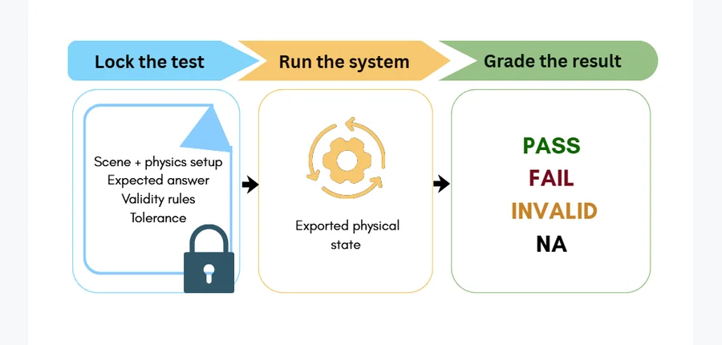 arXiv 2026-10-09 · cs.GR · #1 **[GaussianBench: Physics-Fidelity Evaluation for Gaussian Scene Representations](https://arxiv.org/abs/2610.10554)** Chukwudalu Dumebi-Kachikwu 机构：STAR Laboratories, University of Maryland（<a href="https://arxiv.org/html/2610.10554">HTML</a>） [Paper](https://arxiv.org/abs/2610.10554) · [图源](https://arxiv.org/html/2610.10554v1/figures/bench_overview.png) 

中文摘要
3D Gaussian Splatting 正从静态重建走向能预测交互后场景变化的物理表示，但视觉上可信的滚动预测并不能证明内部力学正确，也不能证明其对新施力、材料修改、接触或热干预的响应正确。我们提出 GaussianBench，使用冻结的文件场景、独立于仿真器的评分器及解析或实测参考，评测守恒、连续介质响应、异质材料耦合、Gaussian 协方差的传输与渲染、热相变和反事实响应。每项参考都声明适用范围，结果区分 PASS、FAIL、NA 与 INVALID。我们还提供 GaussianFlesh 热力学参考系统：持久 3D Gaussian 同时作为渲染基元和连续介质材料点，通过共享网格 MPM、逐粒子本构模型以及持久热和相态推进。对 PhysGaussian、GaussianFluent、OmniPhysGS、PhysDreamer、Physics3D 和 GASP 六个已发布系统进行同一测试，揭示原评测遗漏的失效，例如单一材料正确但界面失效，或 Gaussian 能正确更新某种变形却无法自行生成它。配对故障与容差审计支持这些区分。物理 Gaussian 系统需要检验内部物理状态，而不只是滚动结果是否好看。 <a href="https://arxiv.org/abs/2610.10554">原摘要来源</a>
 | 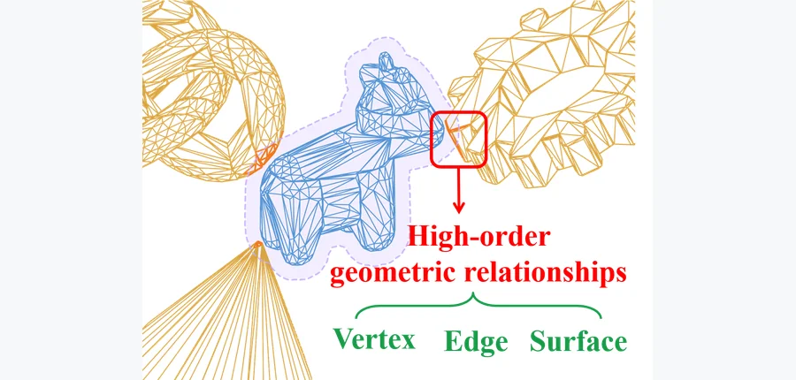 arXiv 2026-10-09 · cs.CV · #2 **[RiCo: Neural Simulation of Rigid-Body Interactions via Local Contact Reasoning](https://arxiv.org/abs/2610.12333)** Ruixiang Ouyang, Guanren Qiao, Fansen Meng, Yueci Deng, Ruixing Jin, Kui Jia, Guiliang Liu 机构：CUHK Shenzhen / DexForce / South China University of Technology / Shenzhen Loop Area Institute（<a href="https://arxiv.org/html/2610.12333">HTML</a>） [Paper](https://arxiv.org/abs/2610.12333) · [图源](https://arxiv.org/html/2610.12333v1/Figures/motivation_hopnet.png) 

中文摘要
准确模拟刚体交互是预测性物理世界模型的基础，但局部表面接触如何决定物体运动仍难刻画。我们提出刚体接触推理 RiCo，用稀疏的接触表面点邻域表示物体间交互。模型结合各点状态与邻近表面的相对几何、运动和物理属性，再在同一刚体的点之间传播信息，判断局部接触如何共同影响整体运动。跨物体推理只发生在邻近表面，保留细粒度接触信息而避免全场景点对建模的代价。在 MOVi 基准上，相比基线，100 帧位置误差降低 31–35%，朝向误差约降低 38%；相对真值的穿透时间差为 11.0%，平均穿透深度差为 2.22 mm。模型还从小规模训练场景零样本泛化至含 270 个物体的场景。真实多球碰撞实验为 sim-to-real 迁移提供初步证据。 <a href="https://arxiv.org/abs/2610.12333">原摘要来源</a>
 | 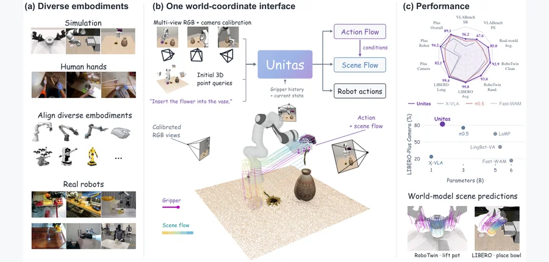 arXiv 2026-10-09 · cs.RO · #3 **[UNITAS: A 3D-Native World Action Model for Embodied Manipulation](https://arxiv.org/abs/2610.12099)** Ruixiang Wang, Yongyi Su, Wenlve Zhou, Bo Yue, Hengyan Liu, Dekun Lu, Yuxin Tian, Yihan Fang, Zerui Wu, Xing Hu, Jietao Ch… 机构：CUHK Shenzhen / DexForce Technology / Foshan University / Sun Yat-sen University / South China University of Technology（<a href="https://arxiv.org/html/2610.12099">HTML</a>） [Paper](https://arxiv.org/abs/2610.12099) · [Code](https://github.com/DexForce/UNITAS) · [图源](https://arxiv.org/html/2610.12099v1/unitas_overview.png) 

中文摘要
世界动作模型需要同时回答：给定任务指令，机器人该如何运动，以及运动会怎样改变环境。现有方法多基于视频生成器，在图像或视觉潜变量中表示世界演化；但机器人交互发生在度量三维空间，像素距离不直接等于物理距离。我们提出 UNITAS，据我们所知是首个在单次交互的共享度量 3D 坐标系中统一观测、动作与场景动力学的原生 3D 世界动作模型，并对机器人夹爪和人手使用共同表示。动作流把手和夹爪表示为 3D 点轨迹；场景流表示由这些轨迹条件化的场景点位移。世界对齐的 3D 位置嵌入在有无深度输入时都为视觉 token 提供定位；按物理时间编码的轨迹 tokenizer 将每条点轨迹编码为锚定于当前 3D 位置的一个 token。该接口同时支持直接动作执行和动作条件场景预测。1.7B 参数的 UNITAS 在 RoboTwin 的动作条件场景预测中优于所比较方法，位移误差最多比 PointWorld 低 49%；操作成功率在 LIBERO 达 99.8%，真实任务平均达 85%。论文称代码可用。 <a href="https://arxiv.org/abs/2610.12099">原摘要来源</a>
 |
| 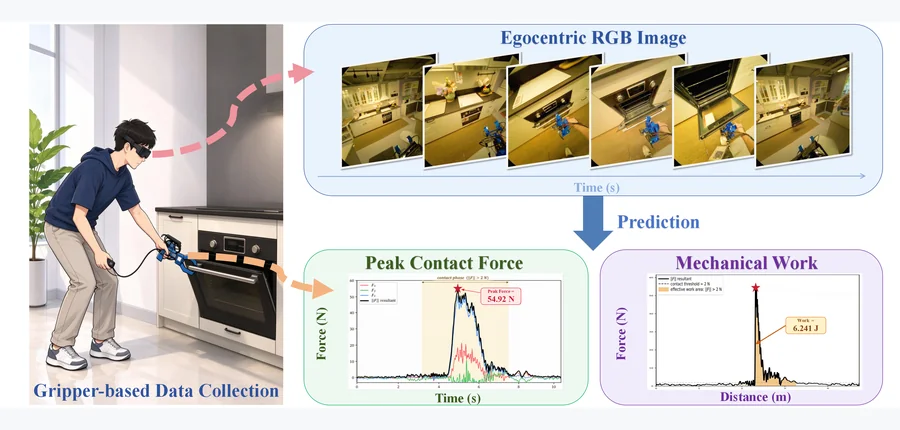 arXiv 2026-10-09 · cs.CV · #4 **[EgoPhys: Estimating Peak Contact Force and Mechanical Work from Egocentric Manipulation Video](https://arxiv.org/abs/2610.11347)** Zhuo Dong, Jianhua Yang, Haohao Li, Yumeng Zhao, Keji He, Yan Huang, Liang Wang 机构：Shandong University / Chinese Academy of Sciences / Tianjin University（<a href="https://arxiv.org/pdf/2610.11347">PDF</a>） [Paper](https://arxiv.org/abs/2610.11347) · [图源](https://arxiv.org/html/2610.11347v1/hoi-capture.png) 

中文摘要
物理上可靠的关节物体操作需要理解接触过程中的最大受力，以及部件移动时完成的机械功。接触峰值力与机械功分别量化这两方面，但第一人称视频中的物理线索局部且间接；峰值力对应短暂接触事件，机械功则取决于整个接触期间的力与运动耦合。我们提出仅用 RGB 的 EgoPhys，由接触感知空间聚合（CASA）和目标专用多专家时间路由（TMTR）组成。CASA 融合外观和几何特征以突出交互线索；TMTR 用不同时间专家建模语义、事件和运动，并分别路由以预测力和功。在 Hoi! 数据集测试划分上，EgoPhys 对峰值力和机械功的平均绝对误差分别为 5.205 ± 0.584 N 和 0.894 ± 0.081 J，显著改善预测。 <a href="https://arxiv.org/abs/2610.11347">原摘要来源</a>
 | 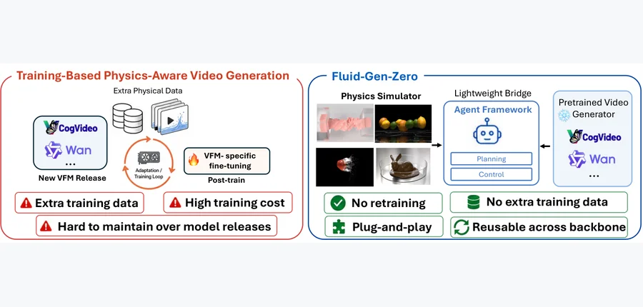 arXiv 2026-10-09 · cs.CV · #5 **[Fluid-Gen-Zero: Grounding Pretrained Video Generators in Physics without Training](https://arxiv.org/abs/2610.10984)** Hong Huang, Yuqiu Liu, Chenyu You, Daniel Martin, Chuhang Zou, Wuyang Chen 机构：Simon Fraser University / Stony Brook University / Lawrence Berkeley National Laboratory / Meta Reality Labs（<a href="https://arxiv.org/html/2610.10984">HTML</a>） [Paper](https://arxiv.org/abs/2610.10984) · [图源](https://arxiv.org/html/2610.10984v1/motivation.png) 

中文摘要
我们提出无需训练的 Fluid-Gen-Zero，用于有物理依据的流体—物体交互视频生成，将物理推理与外观合成分开：运动动力学由物理仿真器负责，外观则由预训练视频生成器建模。两级工作流在生成时由视觉语言模型（VLM）结合意图和仿真滚动结果组织视频片段，并在潜空间通过区域感知的 latent wrapping 将仿真信号注入去噪。该即插即用设计兼容现有视频基础模型。论文还提出流体—物体交互视频基准。在基于 CogVideoX 的 Tora 及基于 Wan 的 VACE、WanMove 上，相比各自基线，物体轨迹误差降低 26.7%–81.5%，流体端点误差 fEPE 降低 67.9%–84.0%，同时大体保持感知质量。人类偏好比较中，相同骨干下 55.1%–74.4% 的评审偏好本方法；对比仿真式方法时为 90.4%–94.2%。代码和数据将在录用后发布。 <a href="https://arxiv.org/abs/2610.10984">原摘要来源</a>
 | 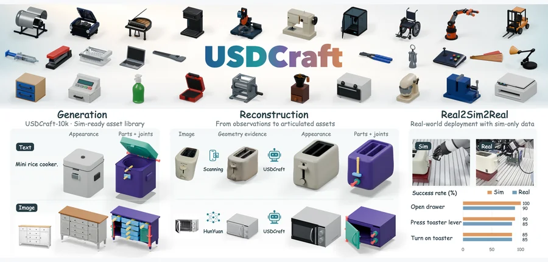 arXiv 2026-10-09 · cs.RO · #6 **[USDCraft: Geometrically Grounded Programmatic Modeling of Articulated 3D Assets for Simulation](https://arxiv.org/abs/2610.11322)** Chuanrui Zhang, Zaijia Yang, Duomin Wang, Lu Shi, Daquan Zhou, Ruihua Zhang, Ziwei Wang 机构：NVIDIA / Nanyang Technological University / Peking University（<a href="https://arxiv.org/pdf/2610.11322">PDF</a>） [Paper](https://arxiv.org/abs/2610.11322) · [Project](https://xingyoujun.github.io/usdcraft/) · [图源](https://arxiv.org/html/2610.11322v1/figures/teaser_20260924_astra/USDCraft_teaser_astra.png) 

中文摘要
几何忠实且具有功能的关节式 3D 资产是机器人 real-to-sim 操作及仿真策略迁移的基础；现有从标注资产学习关节结构的方法，在真实物体超出训练分布或网格不完整、损坏时难以部署。我们将关节资产重建表述为由部分几何证据约束的程序化建模，并提出 USDCraft：预训练 LLM 无需任务专用训练即可编写和修订可执行程序，生成可供仿真的关节资产。源几何分析把输入网格转成度量文本描述，区分已观测表面与未知空间；迭代几何复核用相同表示重新编码候选资产，让差异指向程序修改，同时容许补全未观测区域。视觉反馈和物理属性建模指导共同生成无需手动调整即可载入 Isaac Sim 的关节式 USD 资产。实验在两个基准上显示领先的关节恢复表现，并在 real-to-sim-to-real 机器人操作中验证有效性。 <a href="https://arxiv.org/abs/2610.11322">原摘要来源</a>
 |
| 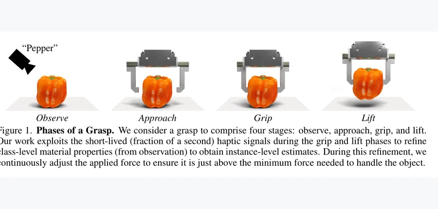 CoRL 2026 · #7 **[How Firm Should a Grasp Be?](https://arxiv.org/abs/2610.11221)** Matthew Beveridge, Shree K. Nayar 机构：Columbia University（<a href="https://arxiv.org/html/2610.11221">HTML</a>） [Paper](https://arxiv.org/abs/2610.11221) · [图源](https://arxiv.org/pdf/2610.11221) 

中文摘要
理想的机器人抓取既要足够牢固，又不能损伤物体；这需要了解质量、弹性和表面摩擦等材料属性，而这些量通常事先无法精确获得。本文提出视觉—触觉方法，在抓取过程中实时估计材料属性，并据此计算搬动物体所需的最小抓力。作者构建了真实果蔬物体数据集，测量形状、质量、弹性和摩擦，再用这些数据通过仿真建立抓力估计模型。使用平行夹爪机器人的实验验证了抓力控制方法，并展示系统能针对不同物体的物理属性调整抓力，实现轻柔抓取。 <a href="https://arxiv.org/abs/2610.11221">原摘要来源</a>
 | 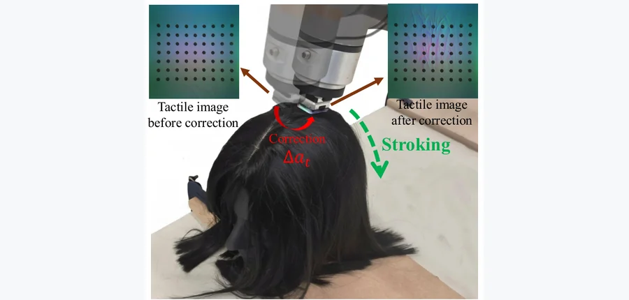 arXiv 2026-10-09 · cs.RO · #8 **[TacHair: Tactile Contact-Distribution Guided Online Correction for Robotic Hair Stroking and Perception](https://arxiv.org/abs/2610.10637)** Ruiyi Hu, Yongqiang Zhao, Daniel Bak, Yupeng Wang, Xuyang Zhang, Shan Luo 机构：King’s College London（<a href="https://arxiv.org/html/2610.10637">HTML</a>） [Paper](https://arxiv.org/abs/2610.10637) · [Project](https://tachair.github.io) · [图源](https://arxiv.org/html/2610.10637v1/figure_01.png) 

中文摘要
梳理头发是日常护理和护发产品评测中的常见动作，但头发可变形，接触虽未中断却会逐渐在末端执行器上漂移，使局部交互难以控制。我们提出 TacHair：把高分辨率触觉观测表示为空间头发接触分布，用视觉—触觉模仿策略产生名义梳理动作，再由单独训练的残差模块修正局部接触偏差，将任务推进与接触恢复分开。在五种头部几何和三种头发条件下进行了 525 次真实机器人试验；成功要求既完成足够的梳理进度又保持接触。与同一视觉—触觉策略但不作修正相比，成功率由 42.9% 提升至 62.3%，接触保持率由 59.4% 提升至 88.0%。结果说明空间触觉接触分布可作为与可变形、视觉遮挡表面持续交互的有效反馈。论文称演示、代码与数据集可用。 <a href="https://arxiv.org/abs/2610.10637">原摘要来源</a>
 | 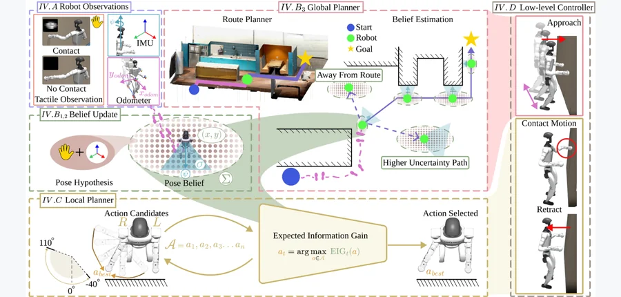 arXiv 2026-10-09 · cs.RO · #9 **[TAPNAV: Humanoid Navigation through Tactile Active Perception](https://arxiv.org/abs/2610.10748)** Huaze Liu, Zhenyu Wu, Jaehwi Jang, Junjie Sheng, Andrew Collins, Aaron Xie, Zhaoyuan Gu, Kaijie Zhu, Ding Jiang, Kevin Cai… 机构：Harvey Mudd College / Georgia Institute of Technology / Walton High School（<a href="https://arxiv.org/html/2610.10748">HTML</a>） [Paper](https://arxiv.org/abs/2610.10748) · [图源](https://arxiv.org/html/2610.10748v1/framework.png) 

中文摘要
在无视觉环境中，人形机器人导航会受到本体里程计漂移和定位不确定性积累影响。我们提出 TAPNAV，通过主动探触周围结构，在不依赖视觉的情况下朝目标导航。系统从里程计、IMU 和触觉接触观测维护位姿信念，将考虑不确定性的全局路径规划与最大化信息增益的局部探触结合：全局规划利用触觉校正机会控制预测定位不确定性；局部规划选取预期信息增益最大的探触动作。全身控制器协调行走与末端接触来执行路径和探触。在不同平面布局与障碍几何的仿真及 Unitree G1 实机上，TAPNAV 相比基线降低状态估计误差并提高任务完成率，表明有计划的物理环境交互能为无视觉人形导航提供定位线索。 <a href="https://arxiv.org/abs/2610.10748">原摘要来源</a>
 |
| 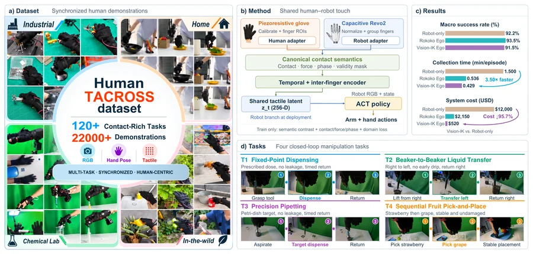 arXiv 2026-10-09 · cs.RO · #10 **[TACROSS: An Efficient and Low-Cost Scalable Human Touch System Across Heterogeneous Tactile Sensors for Dexterous Robot Learning](https://arxiv.org/abs/2610.11945)** Bo Chen, Huanzhang Hu, Junyang Ma, Bo Yue, Fangdi Yu, Haijier Chen, Xianxin Lai, Shuyu Pan, Zhen Yang, Xiaoquan Sun, Wenze… 机构：The University of Hong Kong / INFIFORCE / CUHK Shenzhen / Wuhan Textile University / Ocean University of China / Wuhan University（<a href="https://arxiv.org/html/2610.11945">HTML</a>） [Paper](https://arxiv.org/abs/2610.11945) · [Project](https://tacross-touch-project.github.io/) · [图源](https://arxiv.org/html/2610.11945v1/Fig1_TACROSS_overview_curves.png) 

中文摘要
机器人触觉示范采集昂贵且缓慢，而低价人类触觉手套与机器人传感器在换能原理、布局、分辨率和动态响应上不同，直接对齐原始通道并不可靠。我们提出 TACROSS，在接触事件而非原始传感器值层面对齐人类与机器人触觉。硬件为五层、285 个感测点、成本 10.86 美元的压阻手套；规范化器和残差适配器通过跨手指注意力的时间 Transformer，把异构信号映射到共享的 256 维触觉潜变量。策略学习以机器人示范作为真实动作监督的唯一来源；人类示范用于触觉表示学习，并通过有效的手部重定向目标提供按置信度加权的辅助监督。在四项接触密集操作任务中，相比传统遥操作，采集效率提高 3.5 倍，示范采集设备成本降低 95.7%。作者计划开源硬件与软件，并发布超过 150 小时的触觉数据。 <a href="https://arxiv.org/abs/2610.11945">原摘要来源</a>
 | 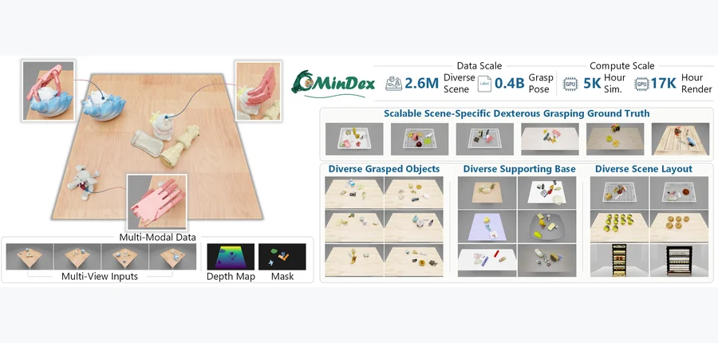 arXiv 2026-10-09 · cs.RO · #11 **[OmniDex: Scaling Dexterous Hand Grasping to Diverse Cluttered Scenes](https://arxiv.org/abs/2610.11194)** Naiyu Fang, Zhongjin Luo, Yuxin Mo, Siyuan Huang, Jianbo Liu, Yufei Liu, Zheyuan Zhou, Chenkai Jin, Xiaogang Wang, Hongshe… 机构：ACE Robotics / CUHK / Tongji University / Shanghai Jiao Tong University / Zhejiang University / Nanyang Technological University（<a href="https://arxiv.org/pdf/2610.11194">PDF</a>） [Paper](https://arxiv.org/abs/2610.11194) · [Project](https://aceroboticsdex.github.io/OmniDex/) · [图源](https://arxiv.org/html/2610.11194v1/fig0.png) 

中文摘要
灵巧抓取是具身智能的基础能力，需要大量数据训练稳健模型；现实采集昂贵，而杂乱场景虽更贴近应用，却缺少大规模抓取数据。我们整理高质量 3D 物体及支撑底座，提出可扩展的“种子—筛选”策略，绕开缓慢的场景级优化，构建包含超过 260 万个场景和 4 亿个场景专属抓取真值的基准，场景布局多样，并配有语义与几何观测。针对现有生成模型的多模态抓取和最后几毫米精度问题，OmniDex 在训练中结合 Soft Winner-Takes-All 学习和受人类启发的物理约束，再以物理驱动排序选择结果，不需要耗时的后优化。实验显示 OmniDex 达到领先表现，并在不同场景、视角和未见物体上有较强泛化。 <a href="https://arxiv.org/abs/2610.11194">原摘要来源</a>
 | 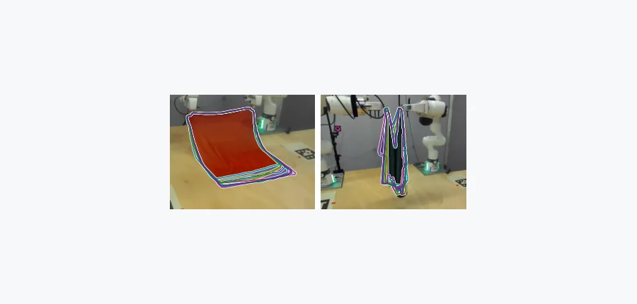 arXiv 2026-10-09 · cs.RO · #12 **[Same Action, Different Outcome: Variability in Dynamic Cloth Manipulation](https://arxiv.org/abs/2610.10801)** Mahed Dadgostar, Guillem Alenyà , Júlia Borrà s 机构：Institut de Robòtica i Informàtica Industrial, CSIC-UPC（<a href="https://arxiv.org/html/2610.10801">HTML</a>） [Paper](https://arxiv.org/abs/2610.10801) · [图源](https://arxiv.org/html/2610.10801v1/teaser_2.png) 

中文摘要
即使机器人重复执行同一快速轨迹，布料也可能产生不同结果，但这种动态操作变异性尚未得到系统量化；它关系到策略可靠性和仿真能否复现现实。我们在四项动态任务（其中两项为新任务）中，对三种物性差异很大的布料和最多三种速度各重复同一轨迹十次，共记录 269 次滚动过程，并同步采集布料小标记位置与双目视频。所定义的多种变异指标显示，所有测试条件下都存在显著变异，多数情况下比机器人和传感噪声固有的重复误差高一至三个数量级。变异主要由布料物性驱动，也随速度增加。将全部记录输入四个经标定的现代布料仿真器后，均不能复现真实变异幅度及其排序。论文同时发布带同步 OptiTrack、视觉、机器人日志及对应仿真孪生体的数据集。 <a href="https://arxiv.org/abs/2610.10801">原摘要来源</a>
 |
| 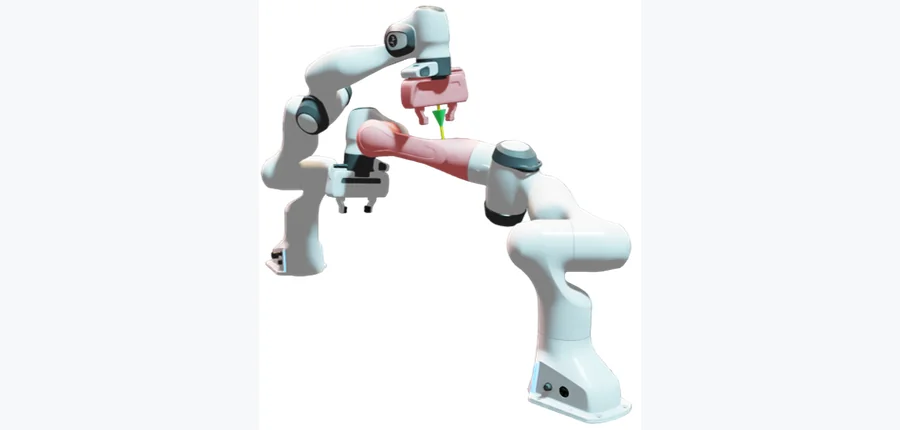 arXiv 2026-10-09 · cs.RO · #13 **[A Physics-Informed Collision Learning Framework for Collaborative Robot Motion Generation](https://arxiv.org/abs/2610.12404)** Chen Cai, Steven Liu 机构：University of Kaiserslautern-Landau（<a href="https://arxiv.org/pdf/2610.12404">PDF</a>） [Paper](https://arxiv.org/abs/2610.12404) · [图源](https://arxiv.org/html/2610.12404v1/Figures/fig1a_concept.png) 

中文摘要
近距离多机械臂操作需要几何准确、可微且可供实时优化的碰撞模型。传统几何检测器能给出可靠距离，但难直接嵌入梯度式模型预测控制（MPC）；保守代理模型又会限制紧密协同。我们提出 PI-UDF，一种用于预测关节机器人本体间碰撞距离的物理信息统一可微框架。它结合解析前向运动学、可学习的连杆几何嵌入和共享残差网络，从机器人配置直接预测双臂成对距离。配额驱动的边界挖掘与非对称跨界惩罚重点处理碰撞边界附近“误判安全”的符号错误。学习到的距离场作为可微双臂净空项嵌入非线性 MPC。真实双 Franka 平台的高速近距离 14 自由度双臂交换、持续动态避障，以及不同移动臂预测设置的规划实验，连同离线 Drake/FCL 回放，表明该方法适合闭环、考虑碰撞的协同运动生成。 <a href="https://arxiv.org/abs/2610.12404">原摘要来源</a>
 | 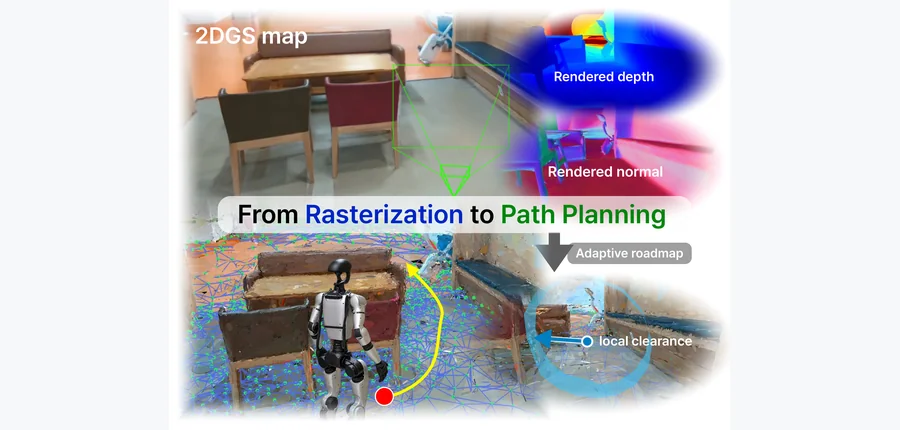 arXiv 2026-10-09 · cs.RO · #14 **[2DGS-Planner: Rasterization-based Path Planning in 2D Gaussian Splatting Map](https://arxiv.org/abs/2610.11752)** Jiwon Park, Dong-Uk Seo, Hyun Myung 机构：affiliation 未确认 [Paper](https://arxiv.org/abs/2610.11752) · [Project](https://2dgs-planner.github.io/) · [图源](https://arxiv.org/html/2610.11752v1/teaser_red.png) 

中文摘要
Gaussian Splatting 是显式且易于栅格化的场景表示，但单个 Gaussian 经过有限视角的 alpha 合成联合优化，未必可靠对应障碍。我们提出用于地面机器人的 2DGS-Planner，通过栅格化从 2D Gaussian Splatting 地图查询规划几何，而不直接把单个基元当障碍。离线路网构建时，多视角归因将渲染法线离散程度转成非地面圆盘的结构分数，指导地面节点自适应采样；沿路径的正交投影查询验证候选边，柱状查询估计并缓存边的局部净空场。在线时，图搜索初始化路径，随后利用缓存场并考虑机器人尺寸与地面约束作路径细化。实验相对测试基线改善路网连通性、净空估计精度和规划成功率，支持以栅格化作为直接在 Gaussian 地图上规划的几何查询接口。论文称代码和数据可用。 <a href="https://arxiv.org/abs/2610.11752">原摘要来源</a>
 |  arXiv 2026-10-09 · cs.RO · #15 **[Predicting Cable Dynamics with Physical Attention Bias](https://arxiv.org/abs/2610.11975)** Avihai Giuili, Rotem Atari, Avishai Sintov, Maya Bechler-Speicher 机构：Tel Aviv University / Meta AI（<a href="https://arxiv.org/html/2610.11975">HTML</a>） [Paper](https://arxiv.org/abs/2610.11975) · [Code](https://github.com/avihaig/dlogps) · [Data](https://huggingface.co/datasets/avihaig/dlogps-cables) 

中文摘要
可变形线状物体（DLO）学习仿真器需要预测未见过的缆线，并在长时间滚动中保持稳定；多数误差发生在缆线自接触或触地处。全对注意力可表示沿缆线相距很远的段之间的接触，但缺乏几何概念。缆线存在两种成对距离：决定弹性力的沿线弧长距离，以及决定接触的空间欧氏距离；仅在拉直时二者一致。我们在注意力 logit 中加入带可学习强度的物理偏置，在其他模型和训练协议不变的条件下比较无偏置、单用一种距离、以及不同注意力头分别使用两种距离。物理偏置提升了未见缆线上的预测；当注意力是连接远距离线段的唯一机制时，弧长偏置使预测误差降低 15%，线段长度漂移减少一半以上。单用欧氏偏置接近无偏置，两种距离分配给不同头则在所有报告指标上最好或接近最好。论文称代码及逐次运行记录可用。 <a href="https://arxiv.org/abs/2610.11975">原摘要来源</a>
 |
| 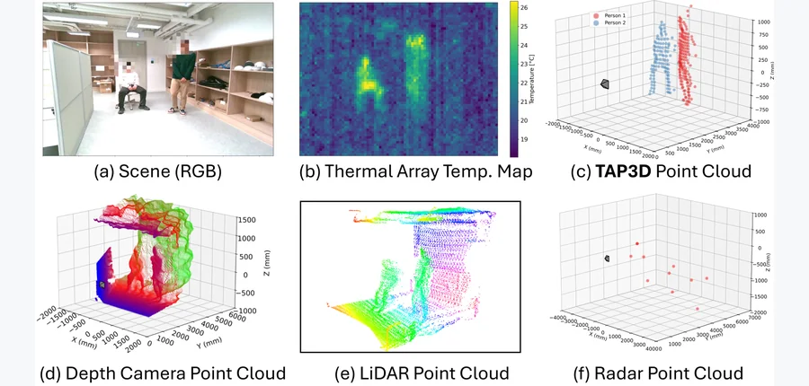 arXiv 2026-10-09 · cs.CV · #16 **[TAP3D: Thermal-Assisted 3D Human Point Clouds](https://arxiv.org/abs/2610.11241)** Xie Zhang, Chengxiao Li, Xuan Liu, Chenshu Wu 机构：The University of Hong Kong（<a href="https://arxiv.org/html/2610.11241">HTML</a>） [Paper](https://arxiv.org/abs/2610.11241) · [Code](https://github.com/aiot-lab/TAP3D) · [图源](https://arxiv.org/html/2610.11241v1/overview_modality3.png) 

中文摘要
人体点云可用于 AI 人体感知，但 LiDAR、雷达和深度相机在成本、稀疏重建或隐私上存在限制。我们提出 TAP3D，利用低成本热阵列从人体热信号重建 3D 点云，据作者所知是首个此类系统。针对深度估计、热干扰和多人分离，方法结合前向热物理模型与两个模块：多基元估计以自监督方式联合恢复深度及其他热属性；几何透视融合抑制干扰并区分不同人。系统使用单个商用热阵列传感器，并构建含 16 万个样本、8 个环境和 11 名用户的数据集。生成的稠密点云支持跌倒检测（91.46%）、室内跟踪（MAE 21.86 cm）和人体网格恢复（误差 4.87 cm）。作者把热信号转点云作为被动、重隐私的人体感知方向，并称已开源 TAP3D。 <a href="https://arxiv.org/abs/2610.11241">原摘要来源</a>
 | 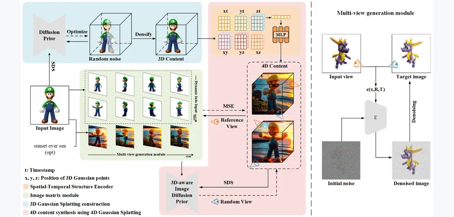 arXiv 2026-10-09 · cs.CV · #17 **[MATE4D: Matrix-Guided Editable 4D Generation from a Single Image](https://arxiv.org/abs/2610.11181)** Xiaotian Chen, Dongfu Yin 机构：Guangdong Laboratory of Artificial Intelligence and Digital Economy / Shenzhen University（<a href="https://arxiv.org/pdf/2610.11181">PDF</a>） [Paper](https://arxiv.org/abs/2610.11181) · [图源](https://arxiv.org/html/2610.11181v1/figures/figure1.jpeg) 

中文摘要
生成模型正从二维图像扩展到动态 3D/4D 场景，但单张图像结构与运动线索有限，生成真实且时间稳定的 4D 内容仍有困难。我们提出 MATE4D，将单张输入图像转成可编辑的动态 4D 内容。方法通过文本引导的背景编辑构建时空多视角图像矩阵，为视角、外观和运动提供一致监督；这些合成观测用于优化 3D Gaussian 基元，再通过轻量形变模块形成 4D 表示。所得场景在几何保持、时间平滑性和背景编辑一致性上改善，减少上下文歧义与运动伪影。在 Objaverse-XL 和 Diffusion4D 上，MATE4D 相比强基线在视觉质量、效率与可控性方面表现更好，可用于 AR/VR 内容制作。 <a href="https://arxiv.org/abs/2610.11181">原摘要来源</a>
 | 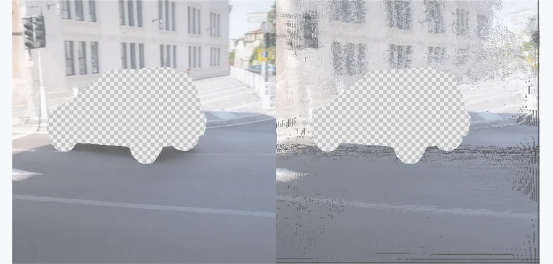 arXiv 2026-10-09 · cs.CV · #18 **[WorldAlign: Decoupled 4D Reward for World-Consistent Video Generation](https://arxiv.org/abs/2610.12382)** Jing He, Kaixin Ding, Xingye Tian, Guibao Shen, Wenhang Ge, Xin Tao, Pengfei Wan, Ying-Cong Chen 机构：HKUST Guangzhou / HKUST / KlingAI / The University of Hong Kong（<a href="https://arxiv.org/pdf/2610.12382">PDF</a>） [Paper](https://arxiv.org/abs/2610.12382) · [图源](https://arxiv.org/pdf/2610.12382) 

中文摘要
可信的视觉世界仿真要求生成视频同时保持静态与动态的 4D 一致性：静态场景须跨视角具有一致 3D 结构，动态主体须在时间上保持合理运动和外观。现有几何感知后训练常假设场景静止，动态场景下的静态反馈仍不可靠，动态一致性也常被忽略。我们提出 WorldAlign，将静态区域和动态主体语义分离，分别对齐适用的世界先验。静态部分通过语义引导的遮罩重投影评估几何一致性，并用相机运动奖励抑制近乎静止的解；动态部分以视觉语言模型（VLM）作为先验，通过针对各样本的检查清单评估动态性、物理合理性、形状与纹理一致性。该解耦奖励无需人工偏好标注即可在线后训练。对预训练图生视频模型 Wan2.1 与 Wan2.2 的实验表明，相比现有方法，静态与动态一致性共同改善，且整体或主体运动未被抑制。 <a href="https://arxiv.org/abs/2610.12382">原摘要来源</a>
 |
| 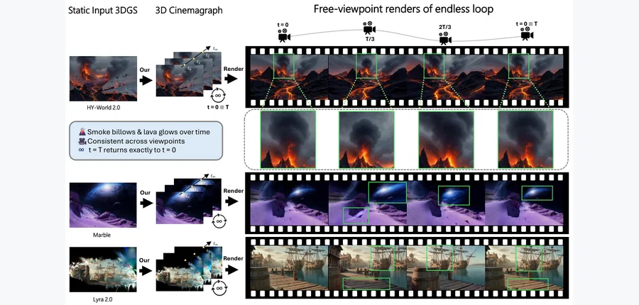 arXiv 2026-10-09 · cs.CV · #19 **[OuroWorld: Bringing Any 3D World Alive as Diverse, Endlessly Looping 3D Cinemagraphs](https://arxiv.org/abs/2610.12461)** You-Zhe Xie, Ting-Wei Chou, Yu-Hsuan Li, Kaipeng Zhang, Zhixiang Wang, Yu-Lun Liu 机构：National Yang Ming Chiao Tung University / Alaya Lab（<a href="https://arxiv.org/html/2610.12461">HTML</a>） [Paper](https://arxiv.org/abs/2610.12461) · [图源](https://arxiv.org/html/2610.12461v1/teaser.png) 

中文摘要
现有 3D 世界模型能生成逼真、可探索却静止的场景。OuroWorld 是无需遮罩的框架，将任意静态 3D Gaussian Splatting 场景变成从各视角都可无缝循环、具有多样运动的 3D cinemagraph。视觉语言模型推断可能的动力学并引导视频模型合成参考视频，随后提升并补全为多视角视频。为利用不完美监督，方法提出抗不一致的周期性 4DGS：傅里叶级数形变场从构造上保证循环；锚定参考视角的 Grounded Drift Field 吸收跨视角不一致。不同于限于类流体运动的既有 Eulerian 方法，该方法覆盖一般形变、物体运动和光照变化。作者提出无需真值、评估生动性、自然性、循环接缝连贯性及场景质量的指标。在 39 个重建与生成场景上，OuroWorld 优于全部比较基线，并在用户研究的 70.8%–99.0% 成对比较中胜出。 <a href="https://arxiv.org/abs/2610.12461">原摘要来源</a>
 | 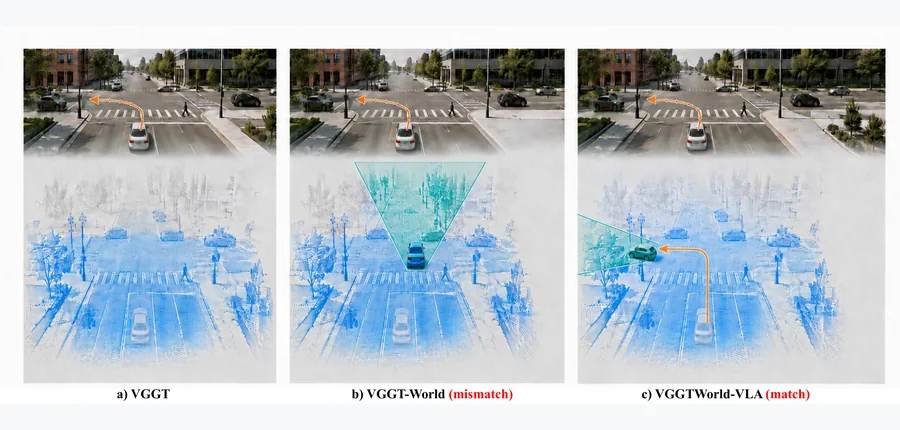 arXiv 2026-10-09 · cs.CV · #20 **[VGGTWorld-VLA: Intent-Conditioned 3D World Evolution for Autonomous Driving](https://arxiv.org/abs/2610.11161)** Zhaoyang Liu, Kun Jiang, Ziying Song, Diange Yang 机构：Tsinghua University / Nanyang Technological University（<a href="https://arxiv.org/html/2610.11161">HTML</a>） [Paper](https://arxiv.org/abs/2610.11161) · [图源](https://arxiv.org/html/2610.11161v1/1.png) 

中文摘要
VGGT 能从视觉观测恢复统一的 3D 场景几何，但近期时间预测扩展仍难根据驾驶意图和动作生成不同未来。我们提出 VGGTWorld-VLA，在 VGGT-World 上加入意图条件，使自动驾驶中的 3D 世界演化可控。动作—语义条件机制把驾驶语义和自车运动表示注入未来 token 流，使同一观测场景在不同自车动作下产生不同未来几何；几何—语言—动作桥接则联合适配历史几何、VLA 语义特征、驾驶机动和轨迹表示，以条件化未来几何预测。作者在 NAVSIM 上评估未来几何预测，并消融语义与动作条件。相对基线，该方法达到具有竞争力的几何预测表现；消融结果支持语义和动作条件的作用，显示它们用于可控 VGGT 世界预测的潜力。 <a href="https://arxiv.org/abs/2610.11161">原摘要来源</a>
 | 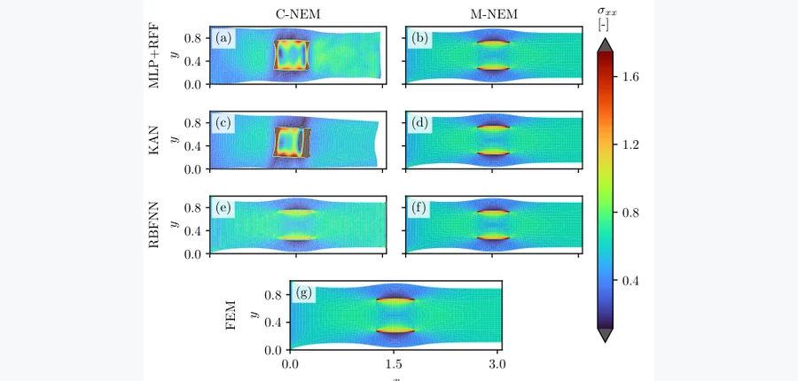 arXiv 2026-10-09 · cs.CE · #21 **[A mesh-based neural energy method for the simulation of heterogeneous composites](https://arxiv.org/abs/2610.10862)** Pius J. M. Wichmann, Stefan Hildebrand, Sandra Klinge 机构：Technische Universität Berlin（<a href="https://arxiv.org/html/2610.10862">HTML</a>） [Paper](https://arxiv.org/abs/2610.10862) · [图源](https://arxiv.org/html/2610.10862v1/image_coupon_stress.png) 

中文摘要
异质材料仍是深度能量法（DEM）等物理信息神经网络的难题。传统基于配置点的神经能量法 C-NEM 可能产生不符合物理的位移振荡、积分误差，并因自动微分而计算昂贵。我们提出基于网格的神经能量法 M-NEM，用形函数插值节点位移，以运动学约束抑制振荡；应变计算改用代数形函数导数，并用高阶 Gaussian 求积准确积分能量。在直接可比基准上，相比 C-NEM，M-NEM 的应力误差最多低三个数量级，速度快一至两个数量级。在另外两个极端刚度对比基准中，只有 M-NEM 收敛。神经网络结构比较表明，径向基函数网络（RBFNN）在 M-NEM 中表现最好：相对带随机 Fourier 特征映射的 MLP，它更准确解析材料界面的陡峭梯度，且比 Kolmogorov-Arnold 网络（KAN）收敛更快。 <a href="https://arxiv.org/abs/2610.10862">原摘要来源</a>
 |
| 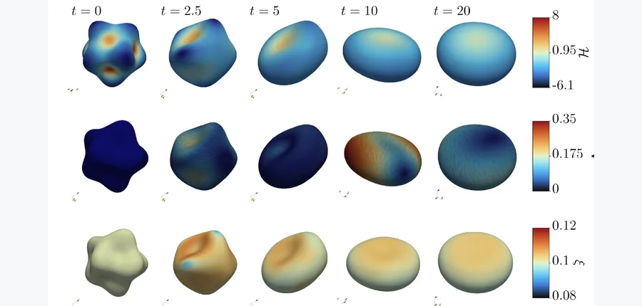 arXiv 2026-10-09 · cond-mat.soft · #22 **[Fluid deformable surfaces with variable thickness - a Surface Shallow-Water-Helfrich model](https://arxiv.org/abs/2610.11903)** Jan Magnus Sischka, Axel Voigt 机构：TU Dresden / Center for Systems Biology Dresden / Physics of Life Cluster（<a href="https://arxiv.org/html/2610.11903">HTML</a>） [Paper](https://arxiv.org/abs/2610.11903) · [图源](https://arxiv.org/pdf/2610.11903) 

中文摘要
上皮组织在形态发生中很重要，从力学上可视为兼具固体与流体性质的薄软材料。表面 Navier–Stokes–Helfrich 模型将弯曲和表面流体动力学结合；为刻画细胞厚度变化，我们在自演化表面上引入类似浅水方程的厚度场。这用薄膜流体的不可压缩约束取代二维流体的不可伸长约束和表面积守恒，从而允许表面积变化。论文开发基于表面有限元的数值方案，进行收敛测试，展示该模型对封闭且包围体积不变的表面形状演化的影响，并讨论对形态发生建模的意义。 <a href="https://arxiv.org/abs/2610.11903">原摘要来源</a>
 | 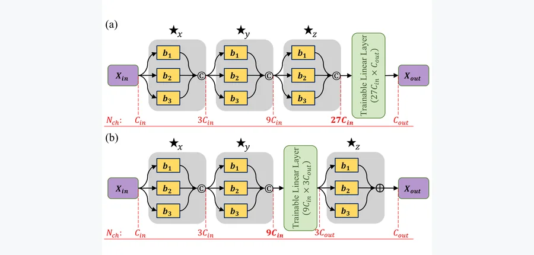 arXiv 2026-10-09 · physics.flu-dyn · #23 **[Extending convolutional neural networks to finite-volume meshes for fine-scale reconstruction of wall-bounded turbulence](https://arxiv.org/abs/2610.12141)** Hesam Tofighian, Jordan A. Denev, Nikolai Kornev 机构：Karlsruhe Institute of Technology / University of Rostock（<a href="https://arxiv.org/html/2610.12141">HTML</a>） [Paper](https://arxiv.org/abs/2610.12141) · [图源](https://arxiv.org/html/2610.12141v1/fig_method.png) 

中文摘要
用于湍流超分辨率的常规 CNN 局限于均匀结构网格，难直接用于壁面流动及复杂几何中的非均匀、非正交网格。我们提出有限体积卷积单元 FVCU，用适用于非均匀、非结构网格的有限体积算子构造卷积层。方法将 3D 卷积精确表示为沿各轴连续卷积的线性组合，并采用可在任意多面体单元上离散的轴向梯度、平均和恒等算子；FVCU 因而可替代常规卷积层。作者把它放入超分辨率网络，从 4 倍粗化的低分辨率场恢复非均匀网格湍流通道流和非正交 O 型网格圆管流的 3D 速度场，并以 Van Driest 阻尼函数作为壁面距离条件输入。消融显示网络以符合物理的方式利用该输入。两种设置下，模型均能重建瞬时速度、Reynolds 应力及其各向异性，以及超出低分辨率网格 Nyquist 极限的能谱；在训练未见的椭圆管中恢复主要流动特征与局部统计，但略高估小尺度能量。 <a href="https://arxiv.org/abs/2610.12141">原摘要来源</a>
 | 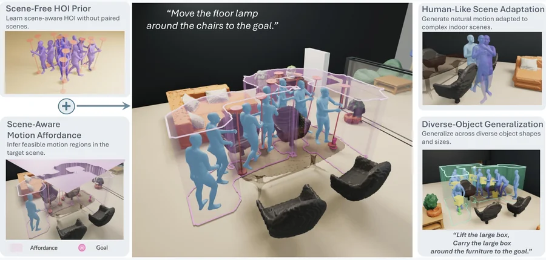 arXiv 2026-10-09 · cs.CV · #24 **[MAMHOI: Factorizing Scene-Aware Human-Object Interaction through Affordances](https://arxiv.org/abs/2610.12416)** Mingyuan Lei, Yoonchang Sung, Tat-Jen Cham 机构：Nanyang Technological University（<a href="https://arxiv.org/html/2610.12416">HTML</a>） [Paper](https://arxiv.org/abs/2610.12416) · [Project](https://leimingyuan.github.io/MAMHOI-project-page/) · [图源](https://arxiv.org/html/2610.12416v1/teaser6.png) 

中文摘要
复杂 3D 场景中的真实人—物交互生成既要判断环境中的可行交互，又要合成合理的人—物运动，但同时具备这两类监督的配对数据稀缺。人—场景数据包含丰富的环境感知运动，人—物数据则捕捉细致交互动力学。我们提出 MAMHOI，以显式的“运动—affordance”接口分解场景感知的人—物交互生成：场景条件模型先预测交互能在何处、如何可行地发生，再由 affordance 条件的 HOI 模型生成对应人—物运动。这样的分解允许从互补数据源分别学习场景理解和交互动力学，无需配对的人—物—场景数据。复杂室内环境实验显示，MAMHOI 减少物体与场景的穿透，同时更好维持人—物交互质量，生成更真实且物理可行的场景感知交互。 <a href="https://arxiv.org/abs/2610.12416">原摘要来源</a>
 |
| 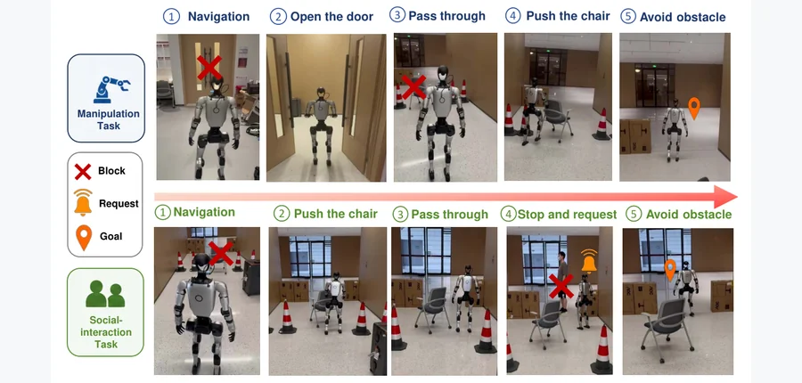 arXiv 2026-10-09 · cs.RO · #25 **[Towards Path-Creative Navigation: Robot Navigation through Embodied Interaction](https://arxiv.org/abs/2610.11072)** Haoyu Xi, Siwei Cheng, Xiangyuan Liu, Brenda Li, Wei Zhang 机构：Shanghai Jiao Tong University / Eastern Institute of Technology Ningbo / Zhengzhou University / University of Waterloo（<a href="https://arxiv.org/html/2610.11072">HTML</a>） [Paper](https://arxiv.org/abs/2610.11072) · [图源](https://arxiv.org/html/2610.11072v1/fig1.png) 

中文摘要
拥挤、受限环境中的自动导航通常假设环境固定，只在已有自由空间中寻路；但关节结构、可移动物体或行人可能挡路，此时抵达目标需要与环境交互。本文提出“路径创造式导航”（PCN），通过协调移动和具身交互恢复可通行空间，并以无地图框架处理其中一类任务。视觉、LiDAR 与里程计框架把局部观测、障碍几何和机器人状态估计整合进统一导航系统，为导航和交互提供稳定语义与几何信息。考虑可通行性的决策方法利用视觉及 LiDAR 距离，判断阻挡是否可操作、能否安全绕行，仅在必要时交互，支持推开关节结构与可移动物体、避障及请求行人让路。作者设计仿真场景，并在仿真和两项传统导航仅靠移动无法完成的真实任务中评估；结果显示协调导航和交互提高了任务完成率。 <a href="https://arxiv.org/abs/2610.11072">原摘要来源</a>
 | 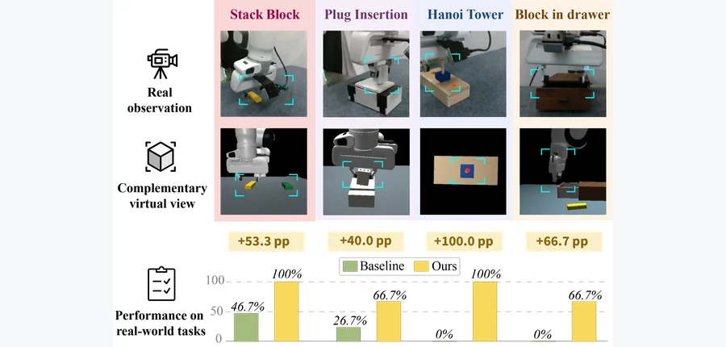 arXiv 2026-10-09 · cs.RO · #26 **[SpatialHarness: Test-Time Spatial Scaffolding for Fine Robotic Manipulation](https://arxiv.org/abs/2610.12457)** Jiayu Wang, Yue Yu, Bin Zhu, Zhiyao Yang, Jingjing Chen 机构：Fudan University / Singapore Management University（<a href="https://arxiv.org/html/2610.12457">HTML</a>） [Paper](https://arxiv.org/abs/2610.12457) · [图源](https://arxiv.org/html/2610.12457v1/fig/teaser.png) 

中文摘要
前沿多模态基础模型（例如 GPT-6 Astra）展现直接控制机器人的潜力，但精细操作仍受限。我们认为一项关键原因可能是空间可观测性不足：现有实体相机未充分显露任务关键的空间关系。SpatialHarness 在测试时为精细机器人操作提供空间支架，无需微调策略或改变实体传感设置。它维护与真实执行同步的在线仿真场景，识别任务关键空间关系，并渲染补充虚拟视角供冻结的多模态策略使用；交互感知的场景同步区分静止、被握持和转换模式。在涵盖精确几何对齐、相对物体放置和关节物体交互的四项真实机器人任务上，同一冻结 GPT-6 Astra 策略使用 SpatialHarness 后，插头插入成功率从 26.7% 升至 66.7%，汉诺塔从 0% 升至 100%。结果表明，测试时提升空间可观测性可释放强多模态模型已有的精细操作能力。 <a href="https://arxiv.org/abs/2610.12457">原摘要来源</a>
 | 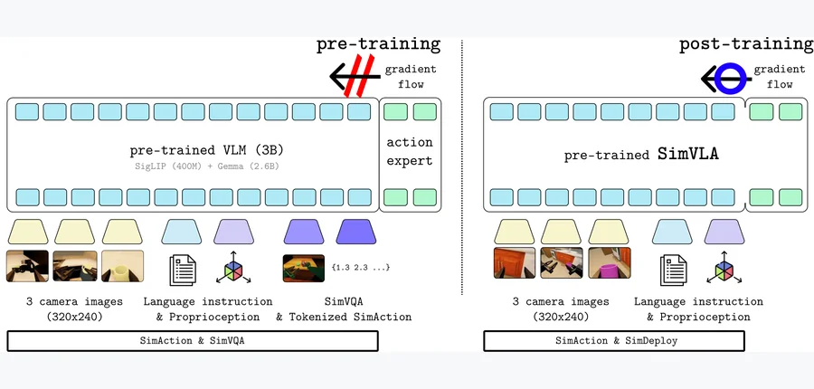 arXiv 2026-10-09 · cs.RO · #27 **[SimVLA: Zero-Shot Sim-to-Real VLA Learning for Mobile Manipulation](https://arxiv.org/abs/2610.11248)** Kyoungin Baik, Youngwoon Lee 机构：Yonsei University / Seoul National University（<a href="https://arxiv.org/html/2610.11248">HTML</a>） [Paper](https://arxiv.org/abs/2610.11248) · [Project](https://kyounginbaik.github.io/simvla/) · [图源](https://arxiv.org/html/2610.11248v1/Figure_2.png) 

中文摘要
大规模多样数据推动了 LLM 和 VLM 的发展，但机器人 VLA 仍受真实数据采集成本与复杂度限制；仿真用于移动操作的 sim-to-real VLA 学习尚未充分探索。我们提出 SimVLA，完全依靠合成仿真数据、无需遥操作训练移动操作 VLA。先在两个互补数据集上预训练：SimAction 通过组合原子技能生成涵盖 35 种移动操作任务的大规模机器人动作数据；SimVQA 利用仿真器特权状态提供空间、几何和子任务级视觉语言监督。随后在 SimAction 与由不同仿真环境中的策略滚动采集的 SimDeploy 混合数据上后训练。作者在补货、倒液和清洁等任务上评估，展示对包括真实家庭环境在内的移动操作零样本迁移，并超过由 50 条域内真实示范训练的策略。结果支持多种互补监督形式帮助 VLA 利用仿真。 <a href="https://arxiv.org/abs/2610.11248">原摘要来源</a>
 |
| 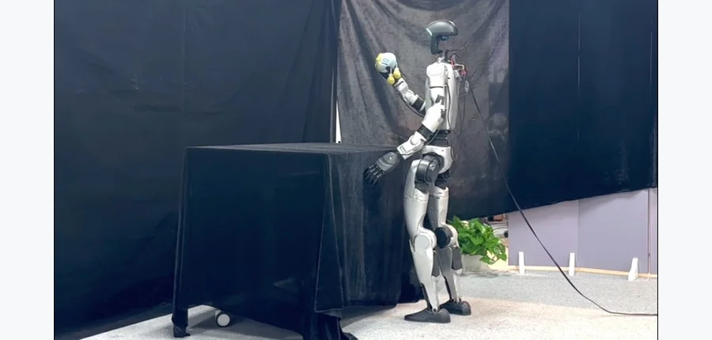 arXiv 2026-10-09 · cs.RO · #28 **[Being-M0.7: A Latent World-Action Model for Humanoid Robots](https://arxiv.org/abs/2610.11283)** Junpeng Yue, Boyuan Li, Yuxuan Wang, Zepeng Wang, Yuhui Fu, Feiyang Xie, Yu Zhang, Jing Zhang, Xianqi Zhang, Weibo Li, Xia… 机构：affiliation 未确认 [Paper](https://arxiv.org/abs/2610.11283) · [图源](https://arxiv.org/pdf/2610.11283) 

中文摘要
人形机器人移动操作需要结合未来场景演化与全身运动来协调行走和操作，但机器人示范稀缺。人类视频与动作数据量较大，却常只有单一模态而非成对视频—动作，且人类动作并不直接指定可执行机器人命令。Being-M0.7 是潜在世界动作模型，通过预训练、机器人中间训练和动作后训练，把混合模态人类数据中的视觉—运动先验转移到人形控制。作者整理超过 10,000 小时原始人类数据，结合仅视频、仅动作及配对流，联合预测未来潜在视觉状态与动作，使视觉表示编码未来运动学。中间训练适配机器人视角和身体动力学；后训练中的动作专家通过门控交叉注意力结合冻结且已适配先验的视觉预测表示、当前图像和本体感觉，生成可执行全身命令。Being-M0.7 在 SIMPLE 上取得比较基线中最高的汇总成功率，并在真实 Unitree G1 移动操作任务上与最强基线相当。 <a href="https://arxiv.org/abs/2610.11283">原摘要来源</a>
 | 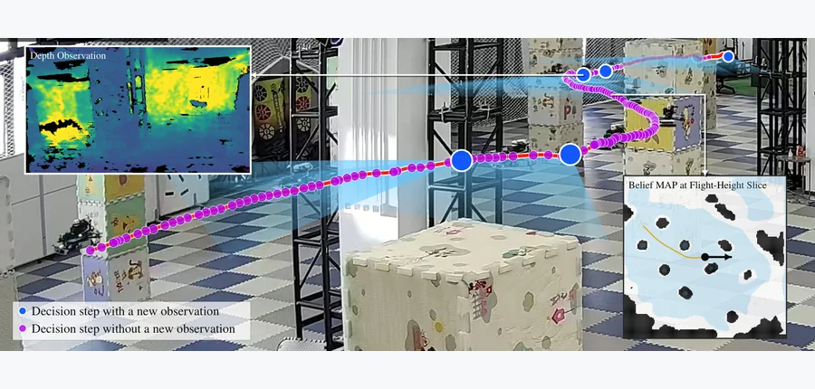 arXiv 2026-10-09 · cs.RO · #29 **[Acting from Belief, Looking When Needed: A Bayesian Spatial World Model for Navigation under Intermittent Perception](https://arxiv.org/abs/2610.11591)** Feihong Yang, Xiang Long, Jincheng Yu, Jianfei Zhang, Guangjun Ge, Chao Wang, Yu Wang 机构：Qiyuan Lab / Tsinghua University（<a href="https://arxiv.org/html/2610.11591">HTML</a>） [Paper](https://arxiv.org/abs/2610.11591) · [图源](https://arxiv.org/html/2610.11591v1/fig_head.png) 

中文摘要
机器人导航通常依赖覆盖广、频率高的传感，但共享传感器被其他任务临时转向时会中断导航观测。我们研究间歇感知导航：机器人依据内部空间信念行动，仅在执行需要时重新观察，以便传感器在其余时间用于其他任务。贝叶斯空间世界模型 ALONE 根据已执行动作传播结构化空间信念，再用选择性获取的观测校正；关于常见几何结构的学习先验从观测历史推断未见区域。模型将信念解码为运动规划所需的空间估计，并预测表达准确性置信度的可靠性图。仅当低可靠性妨碍导航且新证据有望改善相关区域信息时才请求观测。以间歇单目深度图进行无人机导航时，在两类仿真场景以 10 Hz 决策达到 98% 和 97% 闭环成功率；成功试验中，请求新深度观测的决策步中位占比仅 0.9% 和 1.3%。真实室内飞行 10 次试验全部成功。 <a href="https://arxiv.org/abs/2610.11591">原摘要来源</a>
 | 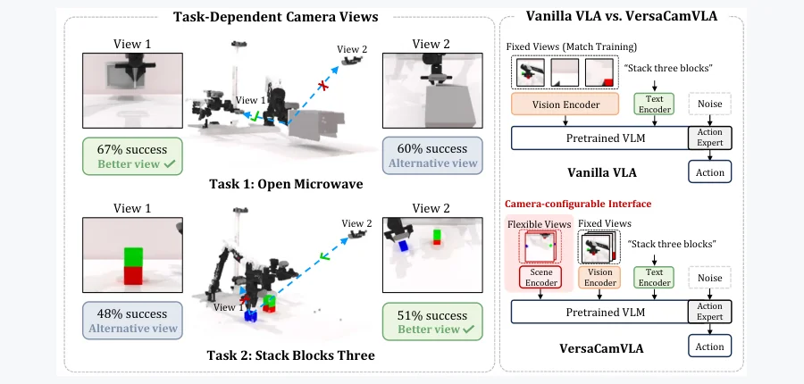 arXiv 2026-10-09 · cs.CV · #30 **[VersaCamVLA: Camera-Configurable VLA Policies for Robotic Manipulation](https://arxiv.org/abs/2610.12451)** Boyao Han, Chen Shi, Jingjing Qian, ZhuoTan Tian, Li Jiang 机构：CUHK Shenzhen / Shenzhen Loop Area Institute / Harbin Institute of Technology Shenzhen（<a href="https://arxiv.org/pdf/2610.12451">PDF</a>） [Paper](https://arxiv.org/abs/2610.12451) · [Project](https://boyaohan.github.io/VersaCamVLA.github.io/) · [图源](https://arxiv.org/html/2610.12451v1/teaser.png) 

中文摘要
VLA 模型是机器人操作的重要基础，但训练时固定的相机配置使其在部署时相机数量或姿态变化下容易失效。VersaCamVLA 将相机集合表示与动作学习解耦：统一场景 token 接口把数量和位姿可变的一组带姿态 RGB 视图映射成固定大小的潜在场景 token。该接口通过多信号目标视角预测和 Wrist-Augmented Pose Sampling（WAPS）训练，后者利用腕部相机的自然运动免费获得姿态多样性。部署时，轻量空间编码器将紧凑场景 token 作为补充视觉条件注入预训练基础 VLA，不需要显式 3D 感知或新视角渲染。在 RoboTwin、LIBERO 与真实机器人平台上，VersaCamVLA 持续优于既有 VLA 方法和直接多视角基线，并在相机数量变化及未见相机姿态下保持稳健。 <a href="https://arxiv.org/abs/2610.12451">原摘要来源</a>
 |
| 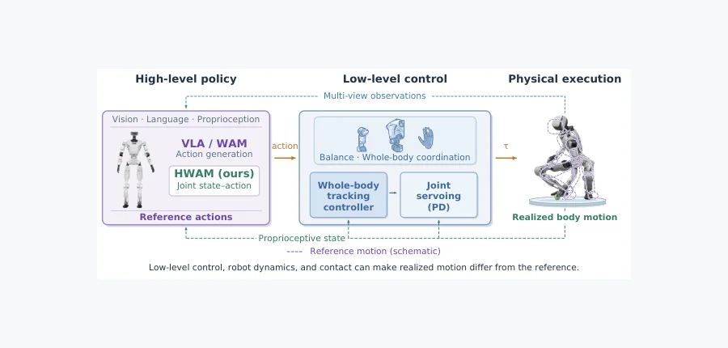 arXiv 2026-10-09 · cs.RO · #31 **[Humanoid World Action Model With Joint State--Action Generation](https://arxiv.org/abs/2610.12026)** Yan Yang, Jikun Rong, Minzhao Zhu, Zheyi Zhao, Qirui Hu, Zihan Lan, Weixin Mao, Yinhao Li, Zhen Fu, Hua Chen 机构：LimX Dynamics / Southern University of Science and Technology（<a href="https://arxiv.org/html/2610.12026">HTML</a>） [Paper](https://arxiv.org/abs/2610.12026) · [图源](https://arxiv.org/html/2610.12026v1/figure0_hierarchy.png) 

中文摘要
在人形机器人分层控制中，VLA 或世界动作模型输出的参考动作要经过全身控制、动力学、平衡与接触才能实现，因此策略参考与实际运动之间存在“动作—执行”落差；若不显式建模身体实际状态，未来视觉预测难区分场景变化和执行偏差。我们提出 HWAM，同时生成参考动作与执行后的本体状态，把已实现运动作为明确预测目标。训练包含三条互补路径：Policy 路径仅条件化当前观测，联合去噪状态—动作轨迹，符合部署条件；前向动力学建模（FDM）在动作和执行后状态条件下预测未来视觉观测；逆动力学建模（IDM）从视觉转变重建联合轨迹。三条路径连接策略参考、实际身体运动与视觉结果。在 LimX OLI 人形机器人的三项真实任务中，HWAM 获得所比较基线的最高成功率；Candy Picking 达 70.6%，Fast-WAM 为 43.3%。 <a href="https://arxiv.org/abs/2610.12026">原摘要来源</a>
 | 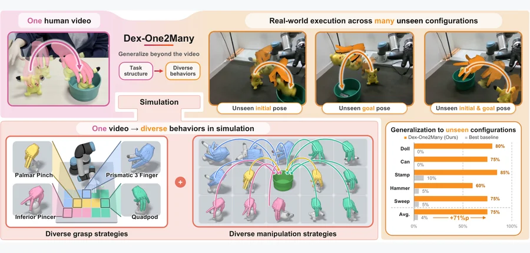 arXiv 2026-10-09 · cs.RO · #32 **[Dex-One2Many: Learning Dexterous Manipulation from a Single Human Demonstration](https://arxiv.org/abs/2610.12470)** Jusuk Lee, Sungha Kim, Yeonsoo Park, Jonguk Cheon, Yoonkyo Jung, Yongjun You, H. Jin Kim, Jia-Bin Huang, Furong Huang, You… 机构：Seoul National University / University of Maryland / All Purpose AI / KAIST（<a href="https://arxiv.org/html/2610.12470">HTML</a>） [Paper](https://arxiv.org/abs/2610.12470) · [Project](https://dex-one2many.github.io/) · [图源](https://arxiv.org/html/2610.12470v1/thumbnail.png) 

中文摘要
单段人类视频可减少灵巧操作对机器人示范的需求，但严格模仿动作常无法泛化到视频未展示的物体初始位姿、目标位姿和抓取；无先验引导的强化学习又难探索复杂多阶段任务。Dex-One2Many 通过 real-to-sim-to-real，从单段人类视频学习可泛化的灵巧操作策略。核心是把视频抽象为顺序场景图来引导强化学习：图中的关系为多样重置状态的采样提供生成约束，并为各阶段提供稠密奖励。由于约束的是关系而非精确姿态，重置状态可覆盖示范外的物体位姿与抓取，同时各阶段从这些状态出发缩短探索。策略完全在仿真中训练，零样本迁移到真实多指手。五项工具使用和操作任务中，在已见配置上优于基线 6.5%，在未见场景中优势扩大到 71%。 <a href="https://arxiv.org/abs/2610.12470">原摘要来源</a>
 | 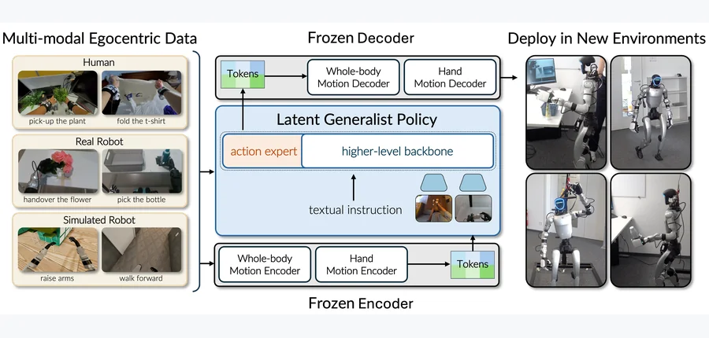 arXiv 2026-10-09 · cs.RO · #33 **[VioLA: Learning Generalist Humanoid Control Policies from Human Data](https://arxiv.org/abs/2610.12435)** Mert Albaba, Jens Beißwenger, Anna Manasyan, Daniel Marta, Michael J. Black, Wieland Brendel, Andreas Krause, Georg Marti… 机构：Vesoma / ETH Zürich / Max Planck Institute for Intelligent Systems / University of Tübingen / ELLIS Institute（<a href="https://arxiv.org/pdf/2610.12435">PDF</a>） [Paper](https://arxiv.org/abs/2610.12435) · [图源](https://arxiv.org/html/2610.12435v1/figures/teaser2.png) 

中文摘要
让人形机器人按指令全身行动面临两项障碍：腿、臂、手指紧密耦合且需保持平衡，关节级动作难学；人形示范稀缺，现有通用策略往往需要每任务遥操作微调。VioLA 改为预测身体与手部动作潜变量，由预训练的身体和手部控制器在机器人上执行；相应编码器把人和机器人的动作映射到相同潜空间，使人类录制也能用作该策略动作空间中的示范。训练池含 1.406 亿帧，其中 93.2% 来自人类。VioLA 无任务专用微调即可在真实机器人上零样本执行行走指令，成功率达 100%，而 GR00T N1.7 与 Ψ₀ 分别为 16.7% 与 0%；操作成功率为 88.6%。该方法适用于两个 VLA 和一个世界动作模型骨干，且仅用人类示范训练的通用策略也能零样本执行真实行走任务。作者称将发布代码与检查点。 <a href="https://arxiv.org/abs/2610.12435">原摘要来源</a>
 |
| 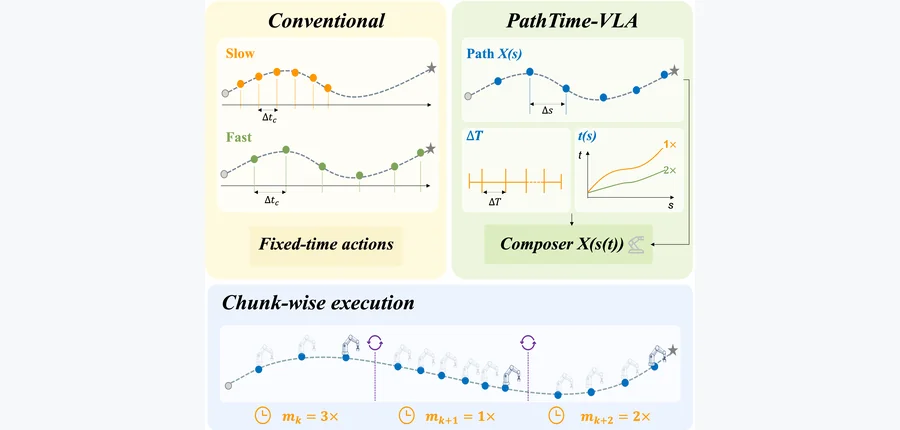 arXiv 2026-10-09 · cs.RO · #34 **[PathTime-VLA: Path-Time Decoupling for Factorized Post-Training of Vision-Language-Action Policies](https://arxiv.org/abs/2610.11771)** Qing Huang, Yifei Yang, Ziqing Zou, Anzhe Chen, Zhenjie Zhu, Yufei Wei, Rong Xiong, Yue Wang 机构：Zhejiang University（<a href="https://arxiv.org/html/2610.11771">HTML</a>） [Paper](https://arxiv.org/abs/2610.11771) · [图源](https://arxiv.org/html/2610.11771v1/figures/insigt.png) 

中文摘要
VLA 策略通常以固定时间间隔预测动作，把机器人所走路径与执行速度耦合；遥操作数据中的几何指导因此也混入接口延迟和操作者习惯。PathTime-VLA 将传统运动规划中的路径—时间参数化引入学习动作表示，把运动拆成随进度变化的交互路径 X(s) 和正的时间间隔曲线；后者定义单调时间律 t(s)，控制命令为 X(s(t))。同一路径可通过不同时间曲线执行，分块调速无需改变几何预测目标。分阶段后训练先以示范和 DAgger 干预建立目标域先验，再由 Speed-DQN 学习执行速度倍数，最后用 Path-AWR 根据滚动结果优化扩散路径生成器；路径条件动作专家执行这些运动，并保持路径与时序各自的学习接口。三项任务中，完整方法成功 58/60 次，固定 1× 速度、采用 BC + DAgger 的 PathTime-VLA 为 57/60；成功试验平均完成时间约缩短 39%–52%。 <a href="https://arxiv.org/abs/2610.11771">原摘要来源</a>
 | 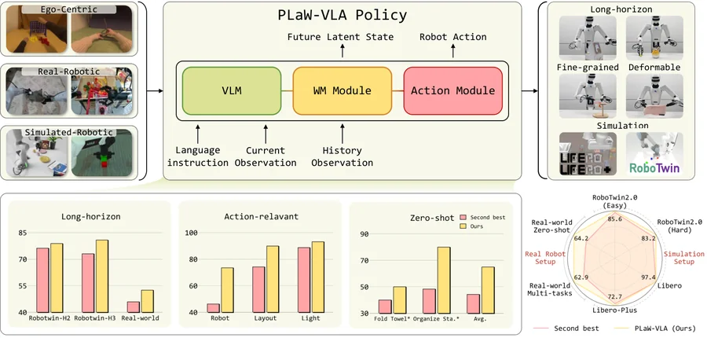 arXiv 2026-10-09 · cs.RO · #35 **[PLaW-VLA: Predictive Latent World Modeling for Vision-Language-Action Policies](https://arxiv.org/abs/2610.12285)** Yu Liu, Hetian Guo, Tianlv Huang, Ziyi Cai, Wudi Chen, Hantang Wang, Qiutong Liu, Yingzhi Peng, Wei Han, Peijun Tang, Jian… 机构：Jilin University / Astribot / Harbin Institute of Technology Shenzhen / Hong Kong Polytechnic University / University of Tokyo（<a href="https://arxiv.org/html/2610.12285">HTML</a>） [Paper](https://arxiv.org/abs/2610.12285) · [图源](https://arxiv.org/html/2610.12285v1/teaser.png) 

中文摘要
预测世界如何演化可为 VLA 长期控制提供上下文，但效果取决于预测何种未来表示，以及它怎样影响动作生成。PLaW-VLA 在预训练的、面向预测的表示空间中建模与任务相关的未来状态，减少对控制无关视觉细节的预测需求。模型基于 Mixture-of-Transformers，通过结构化因果注意力，以观测历史、当前任务语义和预测未来状态为条件生成动作。实验中，在 RoboTwin Hard Horizon III 上比反应式策略高 11.8 个百分点；在零样本 LIBERO-Plus 上比重建导向的潜变量预测高 1.77 个百分点，分别支持其长期控制和分布变化下泛化的改善。避免低层视觉重建降低了未来预测负担，使轻量潜在世界模型可并行预测未来，在相近策略表现下，推理延迟约为生成式世界动作建模的 1/19。 <a href="https://arxiv.org/abs/2610.12285">原摘要来源</a>
 | 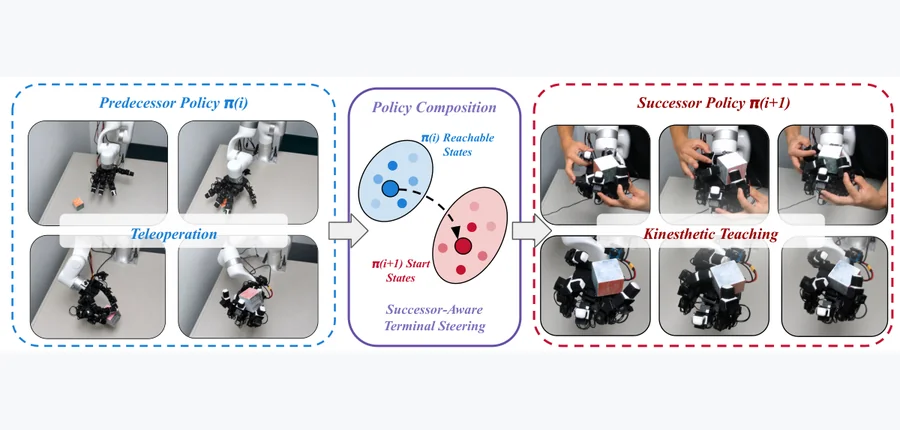 arXiv 2026-10-09 · cs.RO · #36 **[SkillWeave: Weaving Heterogeneous Demonstrations into Long-Horizon Manipulation Skills](https://arxiv.org/abs/2610.12046)** Ryosei Tamura, Xiaoxiang Dong, Uksang Yoo, Yuemin Mao, Romina Mir, Jonathan Francis, Jeffrey Ichnowski 机构：Carnegie Mellon University / Keio University / University of California, Berkeley（<a href="https://arxiv.org/pdf/2610.12046">PDF</a>） [Paper](https://arxiv.org/abs/2610.12046) · [Project](https://skillweave-authors.github.io/) · [图源](https://arxiv.org/html/2610.12046v1/teasor.png) 

中文摘要
灵巧操作既要推进长任务，又要完成精确、接触密集的交互，单一种类的示范很难兼顾。SkillWeave 结合遥操作进行粗略接近和搬运、动觉示教进行精确接触技能，建立异构示范框架。针对动觉采集时示教者入镜造成的视觉错配，方法用物体遮罩条件扩散策略：训练时以离线物体分割监督，部署时用轻量遮罩预测器，无需在线分割和图像修复。为减轻独立训练的子任务策略间的分布偏移，后继感知的终止引导从前驱策略采样动作中选择，使交接状态落在后继策略示范初始状态的支持范围。三项真实长任务中，端到端平均成功率为 27%；遮罩条件动觉策略把灵巧子任务成功率提高至平均 65%，交接组合效率平均为 87%。结果表明，示范模态与交互阶段匹配、修复动觉视觉错配并引导交接状态，可改善长期灵巧操作。论文称视频和代码可用。 <a href="https://arxiv.org/abs/2610.12046">原摘要来源</a>
 |
| 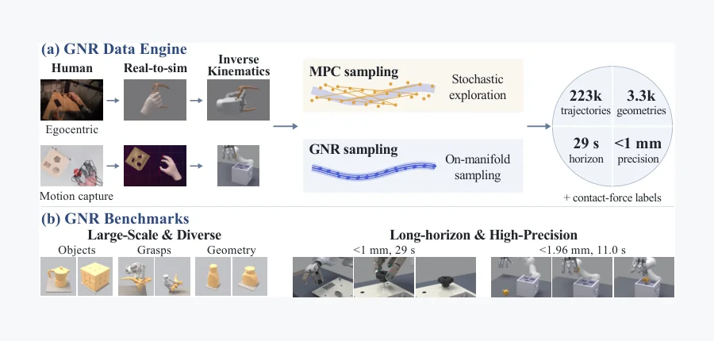 arXiv 2026-10-09 · cs.RO · #37 **[Generative Neural Retargeting for Human-to-Robot Dexterous Manipulation](https://arxiv.org/abs/2610.12440)** Dechen Gao, Yue Yang, Ben Abbatematteo, Nathan Godwin, Pengcheng Wang, Roger Boldu, Steven Man, Zhiyang Dou, Chuan Qin, Sh… 机构：Meta Reality Labs Research / UC Davis / UNC Chapel Hill / UC Berkeley / MIT / CMU（<a href="https://arxiv.org/pdf/2610.12440">PDF</a>） [Paper](https://arxiv.org/abs/2610.12440) · [图源](https://arxiv.org/html/2610.12440v1/fig1_gnr_v3.png) 

中文摘要
人类示范是灵巧操作的可扩展数据源，但身体结构差异使人类动作无法直接在机器人上执行。逆运动学（IK）重定向虽快却忽视动力学；强化学习（RL）和采样式 MPC 能生成动力学可行运动，但样本效率低且对超参数敏感，MPC 还必须对每条轨迹单独求解。作者假设可行轨迹集中在示范共享的低维流形附近，因而可在给定人类动作条件下从流形采样，而无需逐示范重新优化。生成式神经重定向 GNR 使用流匹配模型采样可行轨迹，仅用 MPC 所需样本的 8.5%，成功率达 56.20%，MPC 为 27.20%。将 GNR 用于 real-to-sim 数据引擎后，作者生成含密集接触力标签的灵巧操作数据集，覆盖 22.3 万条示范和 3,300 种物体几何，支持大规模、长时程及毫米级人类示范的重定向。 <a href="https://arxiv.org/abs/2610.12440">原摘要来源</a>
 | 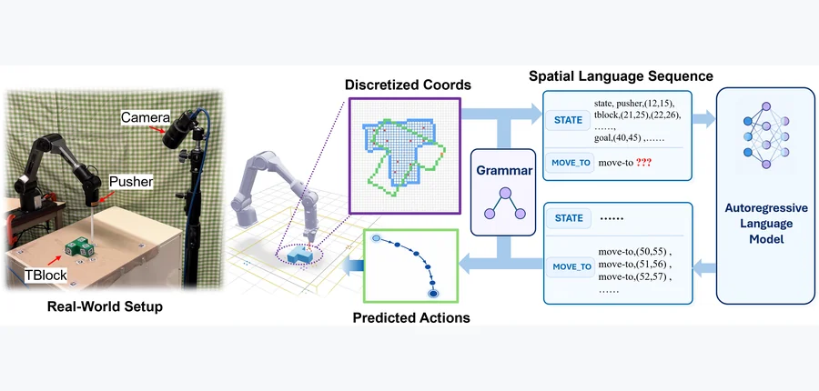 arXiv 2026-10-09 · cs.RO · #38 **[Unifying Policy Learning and State Prediction through Spatial Language Modeling](https://arxiv.org/abs/2610.12172)** Minye Wu, Zehao Wang, Tinne Tuytelaars 机构：KU Leuven（<a href="https://arxiv.org/html/2610.12172">HTML</a>） [Paper](https://arxiv.org/abs/2610.12172) · [图源](https://arxiv.org/html/2610.12172v1/figures/teaser.png) 

中文摘要
学习动作怎样改变场景几何，可为目标导向操作提供额外监督。Spatial Language Modeling 用共享的离散坐标和语义 token 词表表示场景轮廓、目标、动作靶点与未来状态，并由任务专用语法组织为空间序列，使同一个自回归 Transformer 通过下一 token 目标同时学习动作生成和动作条件状态预测。模型从零训练：先用随机探索转移预训练，再用专家示范联合训练动作与状态；预训练时，记录的动作坐标用于条件化后续状态预测，但不计入预测损失。控制时，模型只解码可执行动作靶点，再用新观测状态更新历史。作者在仿真 Push-T 和真实机器人上评估：仿真表现有竞争力，真实机器人任务成功率和目标覆盖率高于所测策略基线。消融显示动作—状态联合序列及随机探索预训练各有收益；给定动作轨迹时，模型也能预测后续场景状态，捕捉推动的几何效果。 <a href="https://arxiv.org/abs/2610.12172">原摘要来源</a>
 | 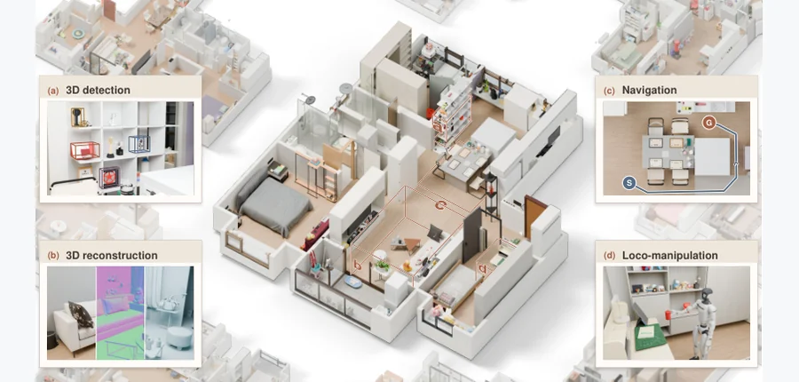 arXiv 2026-10-09 · cs.CV · #39 **[LIVIN: Benchmarking Spatial and Embodied Intelligence in Digital Twins of Lived-In Homes](https://arxiv.org/abs/2610.12069)** Peijun Xu, Chuansen Nie, Yiyang He, Yinuo Bai, Jingyang Liu, Kuixiang Shao, Yuyang Jiao, Kuanhao Xia, Jiayi Zhu, Zitian Ya… 机构：ShanghaiTech University / Deemos Technology（<a href="https://arxiv.org/html/2610.12069">HTML</a>） [Paper](https://arxiv.org/abs/2610.12069) · [图源](https://arxiv.org/html/2610.12069v1/teaser.png) 

中文摘要
真实家庭仿真不仅需要环境多样，还要保留生活化物体摆放和制约机器人运动、交互的空间约束；现有资源难同时兼顾规模、真实对应关系和可交互性。LIVIN 是基于 30 个不同有人居住家庭的数字孪生体所建空间与具身智能基准，保留观测到的房间布局、家具配置及日常物品。作者设计人工参与流程，包括实例识别、建筑重建、物体生成与摆放，各阶段均与源观测对照审核和修正。基准评测四项任务：3D 检测、3D 重建、导航和移动操作。结果显示，真实家庭中密集摆放、遮挡、有限自由空间及狭窄交互区域仍给现有方法带来挑战。作者希望该基准推动从空间理解到机器人交互的家庭具身研究。 <a href="https://arxiv.org/abs/2610.12069">原摘要来源</a>
 |
| 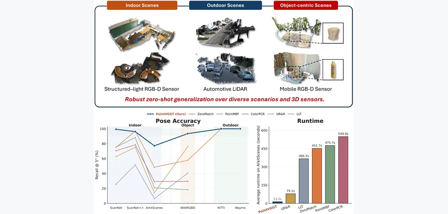 arXiv 2026-10-09 · cs.CV · #40 **[PointVGGT: Zero-Shot Multiview RGB-D Point Cloud Registration with Visual Geometry Foundation Priors](https://arxiv.org/abs/2610.11612)** Haobo Jiang, Liang Yu, Jianmin Zheng 机构：Nanyang Technological University / Alibaba Group（<a href="https://arxiv.org/html/2610.11612">HTML</a>） [Paper](https://arxiv.org/abs/2610.11612) · [图源](https://arxiv.org/html/2610.11612v1/teaser3.png) 

中文摘要
多视角 RGB-D 点云配准需要为无序扫描估计全局刚体位姿，并在度量一致坐标系中对齐。传统“先成对、后全局”流程易受局部优化、误差传播与计算负担影响，也常把 RGB 只当辅助匹配线索，忽略视觉几何基础模型在图像序列中学到的全局几何先验。PointVGGT 提出无需训练的“基础模型先行、再细化”范式：先把基础模型有尺度歧义的位姿预测与度量深度观测对齐，直接恢复度量一致的全局位姿，不做成对估计；再用体素化空间哈希，以全局一致 3D 重建为共享锚点，近线性时间获得稠密多视角对应。随后通过共轭梯度求解的 IRLS 稳健、仅优化运动的束调整，联合降低对应和重投影残差。室内、物体中心和室外数据集实验验证其零样本配准精度与计算效率。 <a href="https://arxiv.org/abs/2610.11612">原摘要来源</a>
 | 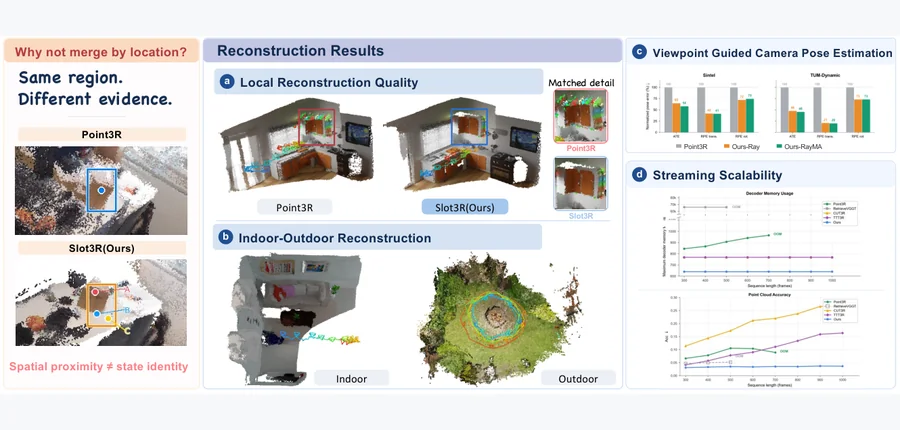 arXiv 2026-10-09 · cs.CV · #41 **[Slot3R: Set-Associative Spatial Memory for Streaming 3D Reconstruction](https://arxiv.org/abs/2610.12282)** Xiyuan Zhang, Yanming Yang, Kaiyuan Xu, Ruibo Li, Chi Zhang 机构：Westlake University / University of Illinois Urbana-Champaign / Nanyang Technological University（<a href="https://arxiv.org/pdf/2610.12282">PDF</a>） [Paper](https://arxiv.org/abs/2610.12282) · [Project](https://ashleyxyz.github.io/Slot-3R/) · [图源](https://arxiv.org/html/2610.12282v1/Slot3R_teaser.png) 

中文摘要
流式 3D 重建需要在线扩展场景时保留每帧证据。Point3R 既用空间接近决定新观测应访问哪个记忆条目，也用它决定是否融合，混淆了共位置与状态相同：邻近图像块指针可能代表不同表面、视角或可见条件，过早平均会抹去互补证据。Slot3R 主张“位置决定地址，不决定观测必须合并”，在共享地址允许多个状态共存，作为无需训练的集合关联式改装，冻结 Point3R 骨干；有界稀疏读取还将持久存储与逐帧解码器访问分开。对 300–500 个采样帧，Slot3R 在 7Scenes 上使 Point3R 的点云精度误差 Acc 降低 57.1%–63.1%，在 NeuralRGBD 上降低 64.0%–72.0%；三个姿态基准上的 Sim(3) 对齐绝对轨迹误差均下降，视频深度估计保持竞争力。相同协议下，它以约 19 FPS 完成全部 600–1000 帧设置，而 Point3R 和 InfiniteVGGT 在 800 帧及以上耗尽内存。 <a href="https://arxiv.org/abs/2610.12282">原摘要来源</a>
 | 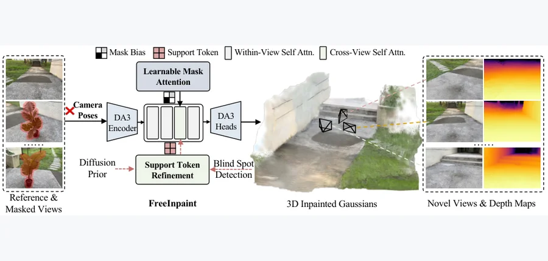 arXiv 2026-10-09 · cs.CV · #42 **[Pose-Free Feed-Forward 3D Inpainting via Learnable Mask Attention and Support Token Refinement](https://arxiv.org/abs/2610.11857)** Jingyi Pan, Dan Xu, Qiong Luo 机构：HKUST Guangzhou / HKUST（<a href="https://arxiv.org/html/2610.11857">HTML</a>） [Paper](https://arxiv.org/abs/2610.11857) · [Project](https://rorisis.github.io/FreeInpaint/) · [图源](https://arxiv.org/html/2610.11857v1/fig1_v3.png) 

中文摘要
3D 场景修复需要补全编辑场景中缺失或遮挡区域，同时维持几何和纹理一致性；现有方法通常要求精确标定相机位姿，限制随手拍摄场景的适用性。FreeInpaint 是前馈框架，直接从未给定位姿且含遮罩区域的多视角图像生成完整、3D 一致的场景。它扩展 3D 基础模型，将参考视角遮罩传播至其他视角，在结合 3D 重建与修复的同时保留其恢复相机位姿和场景几何的能力。为防遮罩破坏跨视角对应，Learnable Mask Attention 保持可靠观测的空间锚点，让被遮区域在深层吸收上下文；严重遮挡时，Support Token Refinement 将扩散模型生成的支持证据作为按置信度加权的辅助 token，细化欠观测区域且保留原锚点。多数据集实验显示修复质量超过比较方法，无需预计算相机位姿，并保持快速推理。 <a href="https://arxiv.org/abs/2610.11857">原摘要来源</a>
 |
| 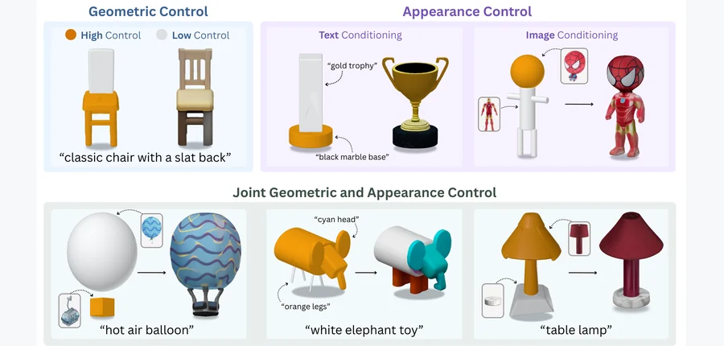 arXiv 2026-10-09 · cs.CV · #43 **[SpaceFlow: Locally Controllable 3D Generation](https://arxiv.org/abs/2610.12399)** Neil De La Fuente, Joan Lafuente, Mukhammadali Sayfiddinov, Felicia Scharitzer, Marc Pollefeys, Ata Celen, Sayan Deb Sarka… 机构：ETH Zürich / Stanford University / Microsoft（<a href="https://arxiv.org/pdf/2610.12399">PDF</a>） [Paper](https://arxiv.org/abs/2610.12399) · [Project](https://spaceflow3d.github.io/) · [图源](https://arxiv.org/html/2610.12399v1/teaser_final_v2.png) 

中文摘要
现有 3D 生成方法缺少明确的局部控制：几何遵循输入的强度常是全局设置，外观也难分区域指定。SpaceFlow 是无需训练的局部可控 3D 生成流程，以文本描述和一组几何基元为输入。各基元代理物体部件并带有独立局部控制强度，使用户选择哪些区域严格遵循输入形状、哪些允许生成补全；结构生成时在生成流过程中施加这些空间约束。外观合成时，对生成结构分割并与基元匹配，各部件只以自身文本或图像提示为条件，减少跨部件污染。区域几何指标显示，高控制区保持指定几何，低控制区允许合理形状变化；用户研究表明整体质量下几何忠实与生成自由度的平衡有竞争力。固定几何的外观评估中，文本条件路由在提示忠实度及颜色/材料准确度上达到领先，定性结果也显示图像提示可局部路由。 <a href="https://arxiv.org/abs/2610.12399">原摘要来源</a>
 |   |   |
<!-- PAPER_CARDS_END -->

## 检索概况

- 检索时间：2026-10-10 09:00–09:20（北京时间）；官方批次：2026-10-09（Friday, 9 October 2026）。
- 官方来源：[cs/new](https://arxiv.org/list/cs/new)、[physics/new](https://arxiv.org/list/physics/new)、[cond-mat/new](https://arxiv.org/list/cond-mat/new)、[math/new](https://arxiv.org/list/math/new)、[stat.ML/new](https://arxiv.org/list/stat.ML/new)、[eess.IV/new](https://arxiv.org/list/eess.IV/new)、[eess.SY/new](https://arxiv.org/list/eess.SY/new)、[eess.SP/new](https://arxiv.org/list/eess.SP/new)。
- 官方 New 列表共 1,646 条记录（跨分类重复计数），按 arXiv ID 去重后 1,582 篇；本期入选 43 篇；43 篇原摘要均已取得并完整翻译，42 篇有论文原图，1 篇未找到可用论文图而使用明确占位图；2 篇机构仍未确认。Cross submissions 与 Replacement submissions 均不进入主榜。
- 排序原则：先 3D/物理与接触机制，再具体具身机器人任务，最后基础 3D 方法。标题、作者、分类、摘要来自上述官方列表及各论文的 [arXiv Abstract](https://arxiv.org/)。机构来自论文 PDF 首页或可信项目页；未能确认时标为“affiliation 未确认”。相关性、机构强度、局限及实验建议均为本日报推断。

## Top papers

| # | 标题 | Paper | 分类 | 作者 | 机构 | 相关性（推断） | 机构强度（推断） | 阅读优先级（推断） |
|---:|---|---|---|---|---|---|---|---|
| 1 | GaussianBench: Physics-Fidelity Evaluation for Gaussian Scene Representations | [arXiv:2610.10554](https://arxiv.org/abs/2610.10554) | cs.GR | Chukwudalu Dumebi-Kachikwu | STAR Laboratories, University of Maryland（[HTML](<https://arxiv.org/html/2610.10554>)） | 极高（3D/物理与接触） | 高 | 高 |
| 2 | RiCo: Neural Simulation of Rigid-Body Interactions via Local Contact Reasoning | [arXiv:2610.12333](https://arxiv.org/abs/2610.12333) | cs.CV | Ruixiang Ouyang, Guanren Qiao, Fansen Meng, Yueci Deng, Ruixing Jin, Kui Jia, Guiliang Liu | CUHK Shenzhen / DexForce / South China University of Technology / Shenzhen Loop Area Institute（[HTML](<https://arxiv.org/html/2610.12333>)） | 极高（3D/物理与接触） | 高 | 高 |
| 3 | UNITAS: A 3D-Native World Action Model for Embodied Manipulation | [arXiv:2610.12099](https://arxiv.org/abs/2610.12099) | cs.RO | Ruixiang Wang, Yongyi Su, Wenlve Zhou, Bo Yue, Hengyan Liu, Dekun Lu, Yuxin Tian, Yihan Fang, Zerui Wu, Xing Hu, Jietao Chen, Yong Guo, Ziyan He, Junbin Yuan, Guiliang Liu, Xiaofen Xing, Kui Jia | CUHK Shenzhen / DexForce Technology / Foshan University / Sun Yat-sen University / South China University of Technology（[HTML](<https://arxiv.org/html/2610.12099>)） | 极高（3D/物理与接触） | 高 | 高 |
| 4 | EgoPhys: Estimating Peak Contact Force and Mechanical Work from Egocentric Manipulation Video | [arXiv:2610.11347](https://arxiv.org/abs/2610.11347) | cs.CV | Zhuo Dong, Jianhua Yang, Haohao Li, Yumeng Zhao, Keji He, Yan Huang, Liang Wang | Shandong University / Chinese Academy of Sciences / Tianjin University（[PDF](<https://arxiv.org/pdf/2610.11347>)） | 极高（3D/物理与接触） | 中高 | 高 |
| 5 | Fluid-Gen-Zero: Grounding Pretrained Video Generators in Physics without Training | [arXiv:2610.10984](https://arxiv.org/abs/2610.10984) | cs.CV | Hong Huang, Yuqiu Liu, Chenyu You, Daniel Martin, Chuhang Zou, Wuyang Chen | Simon Fraser University / Stony Brook University / Lawrence Berkeley National Laboratory / Meta Reality Labs（[HTML](<https://arxiv.org/html/2610.10984>)） | 极高（3D/物理与接触） | 高 | 高 |
| 6 | USDCraft: Geometrically Grounded Programmatic Modeling of Articulated 3D Assets for Simulation | [arXiv:2610.11322](https://arxiv.org/abs/2610.11322) | cs.RO | Chuanrui Zhang, Zaijia Yang, Duomin Wang, Lu Shi, Daquan Zhou, Ruihua Zhang, Ziwei Wang | NVIDIA / Nanyang Technological University / Peking University（[PDF](<https://arxiv.org/pdf/2610.11322>)） | 极高（3D/物理与接触） | 高 | 高 |
| 7 | How Firm Should a Grasp Be? | [arXiv:2610.11221](https://arxiv.org/abs/2610.11221) | cs.RO | Matthew Beveridge, Shree K. Nayar | Columbia University（[HTML](<https://arxiv.org/html/2610.11221>)） | 极高（3D/物理与接触） | 高 | 高 |
| 8 | TacHair: Tactile Contact-Distribution Guided Online Correction for Robotic Hair Stroking and Perception | [arXiv:2610.10637](https://arxiv.org/abs/2610.10637) | cs.RO | Ruiyi Hu, Yongqiang Zhao, Daniel Bak, Yupeng Wang, Xuyang Zhang, Shan Luo | King’s College London（[HTML](<https://arxiv.org/html/2610.10637>)） | 极高（3D/物理与接触） | 中高 | 高 |
| 9 | TAPNAV: Humanoid Navigation through Tactile Active Perception | [arXiv:2610.10748](https://arxiv.org/abs/2610.10748) | cs.RO | Huaze Liu, Zhenyu Wu, Jaehwi Jang, Junjie Sheng, Andrew Collins, Aaron Xie, Zhaoyuan Gu, Kaijie Zhu, Ding Jiang, Kevin Cai, Ye Zhao | Harvey Mudd College / Georgia Institute of Technology / Walton High School（[HTML](<https://arxiv.org/html/2610.10748>)） | 极高（3D/物理与接触） | 中高 | 高 |
| 10 | TACROSS: An Efficient and Low-Cost Scalable Human Touch System Across Heterogeneous Tactile Sensors for Dexterous Robot Learning | [arXiv:2610.11945](https://arxiv.org/abs/2610.11945) | cs.RO | Bo Chen, Huanzhang Hu, Junyang Ma, Bo Yue, Fangdi Yu, Haijier Chen, Xianxin Lai, Shuyu Pan, Zhen Yang, Xiaoquan Sun, Wenze Cui, Zhongliang Jiang, Shaopeng Liu, Jiayu Chen | The University of Hong Kong / INFIFORCE / CUHK Shenzhen / Wuhan Textile University / Ocean University of China / Wuhan University（[HTML](<https://arxiv.org/html/2610.11945>)） | 极高（3D/物理与接触） | 高 | 高 |
| 11 | OmniDex: Scaling Dexterous Hand Grasping to Diverse Cluttered Scenes | [arXiv:2610.11194](https://arxiv.org/abs/2610.11194) | cs.RO | Naiyu Fang, Zhongjin Luo, Yuxin Mo, Siyuan Huang, Jianbo Liu, Yufei Liu, Zheyuan Zhou, Chenkai Jin, Xiaogang Wang, Hongsheng Li | ACE Robotics / CUHK / Tongji University / Shanghai Jiao Tong University / Zhejiang University / Nanyang Technological University（[PDF](<https://arxiv.org/pdf/2610.11194>)） | 极高（3D/物理与接触） | 高 | 高 |
| 12 | Same Action, Different Outcome: Variability in Dynamic Cloth Manipulation | [arXiv:2610.10801](https://arxiv.org/abs/2610.10801) | cs.RO | Mahed Dadgostar, Guillem Alenyà , Júlia Borrà s | Institut de Robòtica i Informàtica Industrial, CSIC-UPC（[HTML](<https://arxiv.org/html/2610.10801>)） | 极高（3D/物理与接触） | 中高 | 高 |
| 13 | A Physics-Informed Collision Learning Framework for Collaborative Robot Motion Generation | [arXiv:2610.12404](https://arxiv.org/abs/2610.12404) | cs.RO | Chen Cai, Steven Liu | University of Kaiserslautern-Landau（[PDF](<https://arxiv.org/pdf/2610.12404>)） | 极高（3D/物理与接触） | 中高 | 高 |
| 14 | 2DGS-Planner: Rasterization-based Path Planning in 2D Gaussian Splatting Map | [arXiv:2610.11752](https://arxiv.org/abs/2610.11752) | cs.RO | Jiwon Park, Dong-Uk Seo, Hyun Myung | affiliation 未确认 | 极高（3D/物理与接触） | 未评估 | 高 |
| 15 | Predicting Cable Dynamics with Physical Attention Bias | [arXiv:2610.11975](https://arxiv.org/abs/2610.11975) | cs.RO | Avihai Giuili, Rotem Atari, Avishai Sintov, Maya Bechler-Speicher | Tel Aviv University / Meta AI（[HTML](<https://arxiv.org/html/2610.11975>)） | 极高（3D/物理与接触） | 高 | 高 |
| 16 | TAP3D: Thermal-Assisted 3D Human Point Clouds | [arXiv:2610.11241](https://arxiv.org/abs/2610.11241) | cs.CV | Xie Zhang, Chengxiao Li, Xuan Liu, Chenshu Wu | The University of Hong Kong（[HTML](<https://arxiv.org/html/2610.11241>)） | 极高（3D/物理与接触） | 中高 | 高 |
| 17 | MATE4D: Matrix-Guided Editable 4D Generation from a Single Image | [arXiv:2610.11181](https://arxiv.org/abs/2610.11181) | cs.CV | Xiaotian Chen, Dongfu Yin | Guangdong Laboratory of Artificial Intelligence and Digital Economy / Shenzhen University（[PDF](<https://arxiv.org/pdf/2610.11181>)） | 高（3D/物理与接触） | 中高 | 高 |
| 18 | WorldAlign: Decoupled 4D Reward for World-Consistent Video Generation | [arXiv:2610.12382](https://arxiv.org/abs/2610.12382) | cs.CV | Jing He, Kaixin Ding, Xingye Tian, Guibao Shen, Wenhang Ge, Xin Tao, Pengfei Wan, Ying-Cong Chen | HKUST Guangzhou / HKUST / KlingAI / The University of Hong Kong（[PDF](<https://arxiv.org/pdf/2610.12382>)） | 高（3D/物理与接触） | 中高 | 高 |
| 19 | OuroWorld: Bringing Any 3D World Alive as Diverse, Endlessly Looping 3D Cinemagraphs | [arXiv:2610.12461](https://arxiv.org/abs/2610.12461) | cs.CV | You-Zhe Xie, Ting-Wei Chou, Yu-Hsuan Li, Kaipeng Zhang, Zhixiang Wang, Yu-Lun Liu | National Yang Ming Chiao Tung University / Alaya Lab（[HTML](<https://arxiv.org/html/2610.12461>)） | 高（3D/物理与接触） | 中高 | 高 |
| 20 | VGGTWorld-VLA: Intent-Conditioned 3D World Evolution for Autonomous Driving | [arXiv:2610.11161](https://arxiv.org/abs/2610.11161) | cs.CV | Zhaoyang Liu, Kun Jiang, Ziying Song, Diange Yang | Tsinghua University / Nanyang Technological University（[HTML](<https://arxiv.org/html/2610.11161>)） | 高（3D/物理与接触） | 高 | 高 |
| 21 | A mesh-based neural energy method for the simulation of heterogeneous composites | [arXiv:2610.10862](https://arxiv.org/abs/2610.10862) | cs.CE | Pius J. M. Wichmann, Stefan Hildebrand, Sandra Klinge | Technische Universität Berlin（[HTML](<https://arxiv.org/html/2610.10862>)） | 高（3D/物理与接触） | 中高 | 中高 |
| 22 | Fluid deformable surfaces with variable thickness - a Surface Shallow-Water-Helfrich model | [arXiv:2610.11903](https://arxiv.org/abs/2610.11903) | cond-mat.soft | Jan Magnus Sischka, Axel Voigt | TU Dresden / Center for Systems Biology Dresden / Physics of Life Cluster（[HTML](<https://arxiv.org/html/2610.11903>)） | 高（3D/物理与接触） | 中高 | 中高 |
| 23 | Extending convolutional neural networks to finite-volume meshes for fine-scale reconstruction of wall-bounded turbulence | [arXiv:2610.12141](https://arxiv.org/abs/2610.12141) | physics.flu-dyn | Hesam Tofighian, Jordan A. Denev, Nikolai Kornev | Karlsruhe Institute of Technology / University of Rostock（[HTML](<https://arxiv.org/html/2610.12141>)） | 高（3D/物理与接触） | 中高 | 中高 |
| 24 | MAMHOI: Factorizing Scene-Aware Human-Object Interaction through Affordances | [arXiv:2610.12416](https://arxiv.org/abs/2610.12416) | cs.CV | Mingyuan Lei, Yoonchang Sung, Tat-Jen Cham | Nanyang Technological University（[HTML](<https://arxiv.org/html/2610.12416>)） | 高（3D/物理与接触） | 中高 | 中高 |
| 25 | Towards Path-Creative Navigation: Robot Navigation through Embodied Interaction | [arXiv:2610.11072](https://arxiv.org/abs/2610.11072) | cs.RO | Haoyu Xi, Siwei Cheng, Xiangyuan Liu, Brenda Li, Wei Zhang | Shanghai Jiao Tong University / Eastern Institute of Technology Ningbo / Zhengzhou University / University of Waterloo（[HTML](<https://arxiv.org/html/2610.11072>)） | 高（具身机器人） | 中高 | 中高 |
| 26 | SpatialHarness: Test-Time Spatial Scaffolding for Fine Robotic Manipulation | [arXiv:2610.12457](https://arxiv.org/abs/2610.12457) | cs.RO | Jiayu Wang, Yue Yu, Bin Zhu, Zhiyao Yang, Jingjing Chen | Fudan University / Singapore Management University（[HTML](<https://arxiv.org/html/2610.12457>)） | 高（具身机器人） | 高 | 中高 |
| 27 | SimVLA: Zero-Shot Sim-to-Real VLA Learning for Mobile Manipulation | [arXiv:2610.11248](https://arxiv.org/abs/2610.11248) | cs.RO | Kyoungin Baik, Youngwoon Lee | Yonsei University / Seoul National University（[HTML](<https://arxiv.org/html/2610.11248>)） | 高（具身机器人） | 中高 | 中高 |
| 28 | Being-M0.7: A Latent World-Action Model for Humanoid Robots | [arXiv:2610.11283](https://arxiv.org/abs/2610.11283) | cs.RO | Junpeng Yue, Boyuan Li, Yuxuan Wang, Zepeng Wang, Yuhui Fu, Feiyang Xie, Yu Zhang, Jing Zhang, Xianqi Zhang, Weibo Li, Xiaofei Zheng, Yuming Fang, Jiangxing Wang, Zongqing Lu | affiliation 未确认 | 高（具身机器人） | 未评估 | 中高 |
| 29 | Acting from Belief, Looking When Needed: A Bayesian Spatial World Model for Navigation under Intermittent Perception | [arXiv:2610.11591](https://arxiv.org/abs/2610.11591) | cs.RO | Feihong Yang, Xiang Long, Jincheng Yu, Jianfei Zhang, Guangjun Ge, Chao Wang, Yu Wang | Qiyuan Lab / Tsinghua University（[HTML](<https://arxiv.org/html/2610.11591>)） | 高（具身机器人） | 高 | 中高 |
| 30 | VersaCamVLA: Camera-Configurable VLA Policies for Robotic Manipulation | [arXiv:2610.12451](https://arxiv.org/abs/2610.12451) | cs.CV | Boyao Han, Chen Shi, Jingjing Qian, ZhuoTan Tian, Li Jiang | CUHK Shenzhen / Shenzhen Loop Area Institute / Harbin Institute of Technology Shenzhen（[PDF](<https://arxiv.org/pdf/2610.12451>)） | 高（具身机器人） | 高 | 中高 |
| 31 | Humanoid World Action Model With Joint State--Action Generation | [arXiv:2610.12026](https://arxiv.org/abs/2610.12026) | cs.RO | Yan Yang, Jikun Rong, Minzhao Zhu, Zheyi Zhao, Qirui Hu, Zihan Lan, Weixin Mao, Yinhao Li, Zhen Fu, Hua Chen | LimX Dynamics / Southern University of Science and Technology（[HTML](<https://arxiv.org/html/2610.12026>)） | 高（具身机器人） | 中高 | 中高 |
| 32 | Dex-One2Many: Learning Dexterous Manipulation from a Single Human Demonstration | [arXiv:2610.12470](https://arxiv.org/abs/2610.12470) | cs.RO | Jusuk Lee, Sungha Kim, Yeonsoo Park, Jonguk Cheon, Yoonkyo Jung, Yongjun You, H. Jin Kim, Jia-Bin Huang, Furong Huang, Youngseok Jang, Seungjae Lee | Seoul National University / University of Maryland / All Purpose AI / KAIST（[HTML](<https://arxiv.org/html/2610.12470>)） | 高（具身机器人） | 高 | 中高 |
| 33 | VioLA: Learning Generalist Humanoid Control Policies from Human Data | [arXiv:2610.12435](https://arxiv.org/abs/2610.12435) | cs.RO | Mert Albaba, Jens Beißwenger, Anna Manasyan, Daniel Marta, Michael J. Black, Wieland Brendel, Andreas Krause, Georg Martius, Martin Riedmiller | Vesoma / ETH Zürich / Max Planck Institute for Intelligent Systems / University of Tübingen / ELLIS Institute（[PDF](<https://arxiv.org/pdf/2610.12435>)） | 高（具身机器人） | 高 | 中高 |
| 34 | PathTime-VLA: Path-Time Decoupling for Factorized Post-Training of Vision-Language-Action Policies | [arXiv:2610.11771](https://arxiv.org/abs/2610.11771) | cs.RO | Qing Huang, Yifei Yang, Ziqing Zou, Anzhe Chen, Zhenjie Zhu, Yufei Wei, Rong Xiong, Yue Wang | Zhejiang University（[HTML](<https://arxiv.org/html/2610.11771>)） | 高（具身机器人） | 中高 | 中高 |
| 35 | PLaW-VLA: Predictive Latent World Modeling for Vision-Language-Action Policies | [arXiv:2610.12285](https://arxiv.org/abs/2610.12285) | cs.RO | Yu Liu, Hetian Guo, Tianlv Huang, Ziyi Cai, Wudi Chen, Hantang Wang, Qiutong Liu, Yingzhi Peng, Wei Han, Peijun Tang, Jianan Wang, Zipei Fan, Zhiyuan Zha, Xuan Song | Jilin University / Astribot / Harbin Institute of Technology Shenzhen / Hong Kong Polytechnic University / University of Tokyo（[HTML](<https://arxiv.org/html/2610.12285>)） | 高（具身机器人） | 中高 | 中高 |
| 36 | SkillWeave: Weaving Heterogeneous Demonstrations into Long-Horizon Manipulation Skills | [arXiv:2610.12046](https://arxiv.org/abs/2610.12046) | cs.RO | Ryosei Tamura, Xiaoxiang Dong, Uksang Yoo, Yuemin Mao, Romina Mir, Jonathan Francis, Jeffrey Ichnowski | Carnegie Mellon University / Keio University / University of California, Berkeley（[PDF](<https://arxiv.org/pdf/2610.12046>)） | 高（具身机器人） | 高 | 中高 |
| 37 | Generative Neural Retargeting for Human-to-Robot Dexterous Manipulation | [arXiv:2610.12440](https://arxiv.org/abs/2610.12440) | cs.RO | Dechen Gao, Yue Yang, Ben Abbatematteo, Nathan Godwin, Pengcheng Wang, Roger Boldu, Steven Man, Zhiyang Dou, Chuan Qin, Sho Nakagome, Eric Whitmire | Meta Reality Labs Research / UC Davis / UNC Chapel Hill / UC Berkeley / MIT / CMU（[PDF](<https://arxiv.org/pdf/2610.12440>)） | 高（具身机器人） | 高 | 中高 |
| 38 | Unifying Policy Learning and State Prediction through Spatial Language Modeling | [arXiv:2610.12172](https://arxiv.org/abs/2610.12172) | cs.RO | Minye Wu, Zehao Wang, Tinne Tuytelaars | KU Leuven（[HTML](<https://arxiv.org/html/2610.12172>)） | 高（具身机器人） | 中高 | 中高 |
| 39 | LIVIN: Benchmarking Spatial and Embodied Intelligence in Digital Twins of Lived-In Homes | [arXiv:2610.12069](https://arxiv.org/abs/2610.12069) | cs.CV | Peijun Xu, Chuansen Nie, Yiyang He, Yinuo Bai, Jingyang Liu, Kuixiang Shao, Yuyang Jiao, Kuanhao Xia, Jiayi Zhu, Zitian Yang, Yanqi Zhang, Tianye Tan, Shuwei Di, Junyi Xu, Jingyi Yu, Jiayuan Gu | ShanghaiTech University / Deemos Technology（[HTML](<https://arxiv.org/html/2610.12069>)） | 高（具身机器人） | 中高 | 中高 |
| 40 | PointVGGT: Zero-Shot Multiview RGB-D Point Cloud Registration with Visual Geometry Foundation Priors | [arXiv:2610.11612](https://arxiv.org/abs/2610.11612) | cs.CV | Haobo Jiang, Liang Yu, Jianmin Zheng | Nanyang Technological University / Alibaba Group（[HTML](<https://arxiv.org/html/2610.11612>)） | 中高（基础 3D） | 中高 | 中 |
| 41 | Slot3R: Set-Associative Spatial Memory for Streaming 3D Reconstruction | [arXiv:2610.12282](https://arxiv.org/abs/2610.12282) | cs.CV | Xiyuan Zhang, Yanming Yang, Kaiyuan Xu, Ruibo Li, Chi Zhang | Westlake University / University of Illinois Urbana-Champaign / Nanyang Technological University（[PDF](<https://arxiv.org/pdf/2610.12282>)） | 中高（基础 3D） | 高 | 中 |
| 42 | Pose-Free Feed-Forward 3D Inpainting via Learnable Mask Attention and Support Token Refinement | [arXiv:2610.11857](https://arxiv.org/abs/2610.11857) | cs.CV | Jingyi Pan, Dan Xu, Qiong Luo | HKUST Guangzhou / HKUST（[HTML](<https://arxiv.org/html/2610.11857>)） | 中高（基础 3D） | 中高 | 中 |
| 43 | SpaceFlow: Locally Controllable 3D Generation | [arXiv:2610.12399](https://arxiv.org/abs/2610.12399) | cs.CV | Neil De La Fuente, Joan Lafuente, Mukhammadali Sayfiddinov, Felicia Scharitzer, Marc Pollefeys, Ata Celen, Sayan Deb Sarkar, Elisabetta Fedele | ETH Zürich / Stanford University / Microsoft（[PDF](<https://arxiv.org/pdf/2610.12399>)） | 中高（基础 3D） | 高 | 中 |

## 逐篇中文要点

### 1. [GaussianBench: Physics-Fidelity Evaluation for Gaussian Scene Representations](https://arxiv.org/abs/2610.10554)

- [事实] 用冻结场景、独立评分器和解析/实测参考评估 Gaussian 表示的守恒、接触、材料耦合与反事实响应。
- [事实] 六个外部系统接受相同测试；PASS/FAIL/NA/INVALID 区分物理错误、缺失能力和无效比较。
- [推断] 可把外观相同但接触/材料参数不同的配对场景加入审计，以检验反事实辨识力。

### 2. [RiCo: Neural Simulation of Rigid-Body Interactions via Local Contact Reasoning](https://arxiv.org/abs/2610.12333)

- [事实] RiCo 只在邻近表面间做跨物体消息传递，再在刚体内部汇集局部接触。
- [事实] MOVi 上 100 帧位置/朝向误差分别降低 31–35%/约 38%，真实多球试验仅提供初步迁移证据。
- [推断] 应单独报告接触法向、冲量与速度守恒误差，判断精度来自真实力学还是数据分布。

### 3. [UNITAS: A 3D-Native World Action Model for Embodied Manipulation](https://arxiv.org/abs/2610.12099)

- [事实] 把人手/夹爪动作流和场景流放在同一度量 3D 坐标系，支持动作执行与条件场景预测。
- [事实] 1.7B 参数模型在 LIBERO 达 99.8%，真实任务平均 85%，RoboTwin 位移误差最多比 PointWorld 低 49%。
- [推断] 需在相同预算下比较深度缺失和相机尺度扰动，识别原生 3D 接口的真实收益。

### 4. [EgoPhys: Estimating Peak Contact Force and Mechanical Work from Egocentric Manipulation Video](https://arxiv.org/abs/2610.11347)

- [事实] CASA 汇集接触相关外观/几何线索，TMTR 分别路由峰值力与机械功的时间证据。
- [事实] Hoi! 测试集的 MAE 为 5.205 ± 0.584 N 和 0.894 ± 0.081 J。
- [推断] 可加入接触事件置信度门控，检验稀疏受力事件与全程功估计的误差来源。

### 5. [Fluid-Gen-Zero: Grounding Pretrained Video Generators in Physics without Training](https://arxiv.org/abs/2610.10984)

- [事实] 仿真器承担流体—物体动力学，预训练视频模型负责外观，潜空间指导把两者连接。
- [事实] 三个视频骨干上的轨迹误差降低 26.7%–81.5%，流体 fEPE 降低 67.9%–84.0%。
- [推断] 应评估仿真参数错误时的物理指标退化，避免把仿真一致误认为现实一致。

### 6. [USDCraft: Geometrically Grounded Programmatic Modeling of Articulated 3D Assets for Simulation](https://arxiv.org/abs/2610.11322)

- [事实] LLM 根据部分网格的度量几何描述迭代编写关节资产程序，并生成可载入 Isaac Sim 的 USD。
- [事实] 两个关节恢复基准和 real-to-sim-to-real 操作实验支持其效果。
- [推断] 需要在遮挡与网格破损程度可控的配对测试中测量关节轴及接触几何误差。

### 7. [How Firm Should a Grasp Be?](https://arxiv.org/abs/2610.11221)

- [事实] 在抓取中用视觉—触觉估计质量、弹性与摩擦，再计算安全搬运所需最小夹持力。
- [事实] 以实测果蔬属性构建仿真估计模型，并在真实平行夹爪机器人上验证轻柔抓取。
- [推断] 可用物性不确定度自适应调整安全余量，并同时记录滑落和损伤。

### 8. [TacHair: Tactile Contact-Distribution Guided Online Correction for Robotic Hair Stroking and Perception](https://arxiv.org/abs/2610.10637)

- [事实] TacHair 把触觉图转成空间接触分布，让残差模块修正梳理中的局部接触漂移。
- [事实] 525 次实机试验中成功率由 42.9% 至 62.3%，接触保持率由 59.4% 至 88.0%。
- [推断] 可测试不同发质与湿度下接触分布漂移是否仍能被同一残差策略校正。

### 9. [TAPNAV: Humanoid Navigation through Tactile Active Perception](https://arxiv.org/abs/2610.10748)

- [事实] TAPNAV 以里程计、IMU 和探触维护位姿信念，并让局部动作最大化预期信息增益。
- [事实] 仿真和 Unitree G1 实机结果显示更低状态估计误差与更高任务完成率。
- [推断] 应把探触耗时和接触风险纳入导航代价，衡量定位收益是否抵消操作开销。

### 10. [TACROSS: An Efficient and Low-Cost Scalable Human Touch System Across Heterogeneous Tactile Sensors for Dexterous Robot Learning](https://arxiv.org/abs/2610.11945)

- [事实] TACROSS 在接触事件层面对齐手套与机器人触觉，而非直接对齐异构原始通道。
- [事实] 285 感测点手套成本 10.86 美元；四任务中采集效率提高 3.5 倍，设备成本降低 95.7%。
- [推断] 建议按传感器类型留一测试，并检查事件对齐是否掩盖力幅值误差。

### 11. [OmniDex: Scaling Dexterous Hand Grasping to Diverse Cluttered Scenes](https://arxiv.org/abs/2610.11194)

- [事实] 种子—筛选策略产生超 260 万杂乱场景和 4 亿条场景专属抓取真值。
- [事实] OmniDex 结合软赢家学习、物理约束和物理排序，避免生成后优化延迟。
- [推断] 大规模数据下更应公开物体泄漏与相似场景分层，以辨别真实泛化。

### 12. [Same Action, Different Outcome: Variability in Dynamic Cloth Manipulation](https://arxiv.org/abs/2610.10801)

- [事实] 相同机器人轨迹在四项任务、三种布料和多速度下重复，共记录 269 次滚动。
- [事实] 真实变异多比机器人/传感噪声高一至三个数量级，四个标定仿真器未复现幅度与排序。
- [推断] 可把参数不确定性与初始褶皱扰动分开建模，检验哪一项解释重复结果差异。

### 13. [A Physics-Informed Collision Learning Framework for Collaborative Robot Motion Generation](https://arxiv.org/abs/2610.12404)

- [事实] PI-UDF 结合解析运动学、连杆几何嵌入与残差网络，预测可微双臂净空。
- [事实] 边界挖掘和非对称损失针对“误判安全”；真实双 Franka 与 Drake/FCL 回放验证闭环使用。
- [推断] 应报告最小真实净空和误判安全率，而不只报告规划成功。

### 14. [2DGS-Planner: Rasterization-based Path Planning in 2D Gaussian Splatting Map](https://arxiv.org/abs/2610.11752)

- [事实] 从 2DGS 地图栅格化查询法线、候选边及局部净空，避免把单个 Gaussian 直接当障碍。
- [事实] 离线路网、在线图搜索和路径细化提高了比较实验中的连通性、净空估计和成功率。
- [推断] 可给低视角覆盖区域加净空不确定度，测试对遮挡障碍的保守性。

### 15. [Predicting Cable Dynamics with Physical Attention Bias](https://arxiv.org/abs/2610.11975)

- [事实] 在缆线注意力中分别编码沿线弧长与空间欧氏距离，以区分弹性力和接触关系。
- [事实] 弧长偏置在关键设置下降低预测误差 15%，长度漂移减少一半以上；双距离分头整体最佳或接近最佳。
- [推断] 可加显式接触开关，只在近距离非相邻段启用欧氏偏置，验证归纳偏置是否更稳。

### 16. [TAP3D: Thermal-Assisted 3D Human Point Clouds](https://arxiv.org/abs/2610.11241)

- [事实] TAP3D 用前向热物理模型、多基元估计和透视融合，从单个热阵列恢复人体 3D 点云。
- [事实] 数据集含 16 万样本；跌倒检测 91.46%，跟踪 MAE 21.86 cm，网格恢复误差 4.87 cm。
- [推断] 应在衣着、环境热源和跨季节温差上测深度/形状误差。

### 17. [MATE4D: Matrix-Guided Editable 4D Generation from a Single Image](https://arxiv.org/abs/2610.11181)

- [事实] 时空多视角图像矩阵为单图 4D 生成提供视角与运动监督，再优化动态 Gaussian 表示。
- [事实] 在 Objaverse-XL 和 Diffusion4D 上报告更好的视觉质量、效率与可控性。
- [推断] 其物理一致性仍应通过接触和轨迹反事实评估，不能由视觉平滑替代。

### 18. [WorldAlign: Decoupled 4D Reward for World-Consistent Video Generation](https://arxiv.org/abs/2610.12382)

- [事实] WorldAlign 将静态几何重投影奖励与动态主体的 VLM 检查清单奖励分开。
- [事实] Wan2.1 和 Wan2.2 的后训练实验同时改善静态与动态一致性，且未抑制运动。
- [推断] 动态物理合理性依赖 VLM 裁判，宜加入有真值动力学的校准子集。

### 19. [OuroWorld: Bringing Any 3D World Alive as Diverse, Endlessly Looping 3D Cinemagraphs](https://arxiv.org/abs/2610.12461)

- [事实] 周期 4DGS 以 Fourier 形变场构造无缝循环，以 Grounded Drift Field 消化跨视角监督不一致。
- [事实] 39 个场景上优于基线，用户研究的成对胜率为 70.8%–99.0%。
- [推断] 视觉自然性之外需检查守恒、接触与运动边界，避免循环结构制造不物理位移。

### 20. [VGGTWorld-VLA: Intent-Conditioned 3D World Evolution for Autonomous Driving](https://arxiv.org/abs/2610.11161)

- [事实] 把驾驶语义、自车运动与轨迹条件注入 VGGT 世界模型，预测不同动作下的未来 3D 几何。
- [事实] NAVSIM 上几何预测与基线表现具有竞争力，消融支持语义和动作条件的贡献。
- [推断] 应对同场景不同动作做反事实分叉评估，检验几何变化是否因果对应自车动作。

### 21. [A mesh-based neural energy method for the simulation of heterogeneous composites](https://arxiv.org/abs/2610.10862)

- [事实] M-NEM 用网格形函数约束位移、代数导数计算应变及高阶求积积分能量。
- [事实] 直接可比基准上应力误差最多低三个数量级、速度快一至两个数量级。
- [推断] 可按材料界面残差自适应加密求积，而不增加整体网络规模。

### 22. [Fluid deformable surfaces with variable thickness - a Surface Shallow-Water-Helfrich model](https://arxiv.org/abs/2610.11903)

- [事实] 在自演化曲面上加入厚度场，以薄膜不可压缩约束替代表面积守恒。
- [事实] 表面有限元实现经过收敛测试，展示厚度变化对封闭曲面形状演化的影响。
- [推断] 建议对照厚度可测的薄膜实验，检验模型参数能否从形变中唯一辨识。

### 23. [Extending convolutional neural networks to finite-volume meshes for fine-scale reconstruction of wall-bounded turbulence](https://arxiv.org/abs/2610.12141)

- [事实] FVCU 以有限体积梯度、平均和恒等算子构造可用于一般多面体网格的 3D 卷积。
- [事实] 从 4 倍粗化场重建湍流速度、应力和能谱；未见椭圆管的小尺度能量略高估。
- [推断] 可在训练损失中加入局部动量/能量通量约束，检查超 Nyquist 谱是否可靠。

### 24. [MAMHOI: Factorizing Scene-Aware Human-Object Interaction through Affordances](https://arxiv.org/abs/2610.12416)

- [事实] MAMHOI 用场景条件 affordance 与交互条件运动生成分工，免去成对人—物—场景数据需求。
- [事实] 室内实验显示物体—场景穿透减少，且人—物交互质量保持更好。
- [推断] 应把可行交互预测与实际接触力/支撑稳定性区分评估。

### 25. [Towards Path-Creative Navigation: Robot Navigation through Embodied Interaction](https://arxiv.org/abs/2610.11072)

- [事实] PCN 将导航与必要的推/让路等具身交互联合考虑，以恢复可通行空间。
- [事实] 视觉、LiDAR、里程计的无地图框架在仿真及两项真实受阻任务中比基线完成更多任务。
- [推断] 应分开测量误判可推动障碍与过度交互造成的安全代价。

### 26. [SpatialHarness: Test-Time Spatial Scaffolding for Fine Robotic Manipulation](https://arxiv.org/abs/2610.12457)

- [事实] SpatialHarness 保持在线仿真场景与实机同步，并给冻结策略渲染任务关键的补充视角。
- [事实] 同一 GPT-6 Astra 策略的插头插入成功率由 26.7% 至 66.7%，汉诺塔由 0% 至 100%。
- [推断] 需扰动仿真—现实对齐精度，定位改进依赖的空间校准阈值。

### 27. [SimVLA: Zero-Shot Sim-to-Real VLA Learning for Mobile Manipulation](https://arxiv.org/abs/2610.11248)

- [事实] SimVLA 只用仿真数据训练，SimAction 覆盖 35 种移动操作任务，SimVQA 引入特权空间监督。
- [事实] 补货、倒液、清洁等任务实现真实家庭零样本迁移，表现超过用 50 条域内实机示范训练的策略。
- [推断] 应按物体材质与接触模式分层比较，识别仿真特权监督对真实物理交互的收益。

### 28. [Being-M0.7: A Latent World-Action Model for Humanoid Robots](https://arxiv.org/abs/2610.11283)

- [事实] Being-M0.7 用超 10,000 小时混合人类视频/动作数据学习视觉—运动先验，再适配人形控制。
- [事实] SIMPLE 汇总成功率为比较基线最高，真实 Unitree G1 任务与最强基线相当。
- [推断] 建议单独消融未配对模态与成对模态，对照可执行全身动作误差。

### 29. [Acting from Belief, Looking When Needed: A Bayesian Spatial World Model for Navigation under Intermittent Perception](https://arxiv.org/abs/2610.11591)

- [事实] ALONE 传播贝叶斯空间信念，只有可靠性不足且新观测有价值时才调用深度相机。
- [事实] 两类仿真场景闭环成功率为 98%/97%，成功试验仅 0.9%/1.3% 决策步请求新观测；实飞 10/10 成功。
- [推断] 应记录失效前的信念过度自信，检验触发规则在动态障碍中是否安全。

### 30. [VersaCamVLA: Camera-Configurable VLA Policies for Robotic Manipulation](https://arxiv.org/abs/2610.12451)

- [事实] 可变相机集合先映射为固定数量的场景 token，再作为补充视觉条件注入预训练 VLA。
- [事实] RoboTwin、LIBERO 和真实机器人试验报告相机数量、未见姿态变化下的稳健收益。
- [推断] 应比较位姿标定误差与腕部相机遮挡，判断场景 token 对真实部署偏差的敏感度。

### 31. [Humanoid World Action Model With Joint State--Action Generation](https://arxiv.org/abs/2610.12026)

- [事实] HWAM 同时预测参考动作和实际执行后的本体状态，连接策略、动力学与视觉结果。
- [事实] LimX OLI 三项实机任务中优于比较基线；Candy Picking 为 70.6%，Fast-WAM 为 43.3%。
- [推断] 应报告接触或平衡失效时参考—执行差的预测校准，而不仅看任务成功率。

### 32. [Dex-One2Many: Learning Dexterous Manipulation from a Single Human Demonstration](https://arxiv.org/abs/2610.12470)

- [事实] Dex-One2Many 从单段人类视频抽取顺序场景图，用关系约束重置采样和分阶段稠密奖励。
- [事实] 五项任务的实机多指手零样本迁移，在未见配置上的基线优势达 71%。
- [推断] 可区分场景图错误和仿真物理误差，判断单示范泛化的主要瓶颈。

### 33. [VioLA: Learning Generalist Humanoid Control Policies from Human Data](https://arxiv.org/abs/2610.12435)

- [事实] VioLA 让通用策略预测身体/手部动作潜变量，预训练控制器执行，从而共享人机动作空间。
- [事实] 训练池 1.406 亿帧，93.2% 来自人类；实机零样本行走成功率 100%，操作成功率 88.6%。
- [推断] 应评估接触密集任务中潜变量控制器对实际力和稳定性的约束。

### 34. [PathTime-VLA: Path-Time Decoupling for Factorized Post-Training of Vision-Language-Action Policies](https://arxiv.org/abs/2610.11771)

- [事实] PathTime-VLA 将动作拆为进度参数化交互路径与正的执行时间曲线，分开学习几何和速度。
- [事实] 三项任务完整方法成功 58/60 次，成功试验完成时间比固定 1× 方案短约 39%–52%。
- [推断] 可在接触阶段加入力/滑移门控限速，检验提速是否保持接触安全。

### 35. [PLaW-VLA: Predictive Latent World Modeling for Vision-Language-Action Policies](https://arxiv.org/abs/2610.12285)

- [事实] PLaW-VLA 只预测任务相关的未来潜在状态，并以结构化因果注意力条件化动作。
- [事实] RoboTwin Hard Horizon III 高 11.8 个百分点，零样本 LIBERO-Plus 高 1.77 个百分点；推理延迟约为生成式 WAM 的 1/19。
- [推断] 可标注哪些未来变量对动作有因果作用，避免低延迟预测漏掉短暂接触事件。

### 36. [SkillWeave: Weaving Heterogeneous Demonstrations into Long-Horizon Manipulation Skills](https://arxiv.org/abs/2610.12046)

- [事实] SkillWeave 以遥操作覆盖粗略移动、动觉示教覆盖精细接触，并处理示教者入镜的视觉错配。
- [事实] 三项真实长任务端到端平均成功率 27%；灵巧子任务平均 65%，交接组合效率 87%。
- [推断] 低端到端成功率提示应逐段分析交接失败与接触失败的乘积。

### 37. [Generative Neural Retargeting for Human-to-Robot Dexterous Manipulation](https://arxiv.org/abs/2610.12440)

- [事实] GNR 用流匹配从人类动作条件化的可行轨迹流形采样，避免每条示范重新 MPC 优化。
- [事实] 仅用 MPC 8.5% 的样本，成功率 56.20% 对 27.20%；生成 22.3 万条带力标签的示范。
- [推断] 需实机验证流形采样的接触力标签和毫米级几何误差。

### 38. [Unifying Policy Learning and State Prediction through Spatial Language Modeling](https://arxiv.org/abs/2610.12172)

- [事实] 共享离散坐标/语义词表把动作靶点和未来场景状态放入同一自回归序列。
- [事实] 仿真 Push-T 和真实机器人实验显示联合动作—状态训练有益，随机探索预训练继续改善控制。
- [推断] 可引入接触状态 token 并做遮挡推物实验，检验几何语言是否足以表征接触。

### 39. [LIVIN: Benchmarking Spatial and Embodied Intelligence in Digital Twins of Lived-In Homes](https://arxiv.org/abs/2610.12069)

- [事实] LIVIN 将 30 个真实生活化家庭重建为可交互数字孪生体，并人工核对布局和物品摆放。
- [事实] 四项评测涵盖 3D 检测、重建、导航和移动操作；密集物品、遮挡和狭窄空间仍困难。
- [推断] 应公布数字孪生物理属性误差，防止视觉忠实度掩盖操作仿真差距。

### 40. [PointVGGT: Zero-Shot Multiview RGB-D Point Cloud Registration with Visual Geometry Foundation Priors](https://arxiv.org/abs/2610.11612)

- [事实] PointVGGT 先用度量深度校准视觉基础模型的全局位姿，再通过体素哈希与 IRLS 束调整细化。
- [事实] 室内、物体中心和室外实验支持其零样本多视角 RGB-D 配准精度与效率。
- [推断] 可按深度噪声和非刚体物体分层测试，确定度量锚点失效边界。

### 41. [Slot3R: Set-Associative Spatial Memory for Streaming 3D Reconstruction](https://arxiv.org/abs/2610.12282)

- [事实] Slot3R 让同一空间地址保留多个状态，冻结 Point3R 骨干，避免过早融合不同表面证据。
- [事实] 300–500 帧时点云 Acc 误差下降 57.1%–72.0%；600–1000 帧设置约 19 FPS 完成。
- [推断] 可让槽位合并由可见性证据驱动，测记忆增长与重建误差的权衡。

### 42. [Pose-Free Feed-Forward 3D Inpainting via Learnable Mask Attention and Support Token Refinement](https://arxiv.org/abs/2610.11857)

- [事实] FreeInpaint 从未标定位姿的多视角遮罩图像前馈生成 3D 一致场景。
- [事实] 可学习遮罩注意力保护可靠几何锚点，置信加权支持 token 细化重遮挡区域。
- [推断] 应在相机姿态极端变化下检验支持图像错误是否传播成伪几何。

### 43. [SpaceFlow: Locally Controllable 3D Generation](https://arxiv.org/abs/2610.12399)

- [事实] SpaceFlow 给每个几何基元独立控制强度，结构生成施加局部约束，外观提示按部件路由。
- [事实] 区域指标和用户研究支持几何遵循与变化的平衡；固定几何上颜色/材料提示准确度领先。
- [推断] 可把局部控制边界设为接触接口，检验生成部件能否保持真实装配公差。

## 今日最值得细读的 5 篇

以下排序为本日报的阅读建议，属于[推断]：

1. **[GaussianBench](https://arxiv.org/abs/2610.10554)**：把物理 Gaussian 的内部状态、材料界面、反事实响应和无效比较放进统一评价，最适合校准“物理一致”的证据标准。
2. **[RiCo](https://arxiv.org/abs/2610.12333)**：局部接触点推理直接针对刚体运动中的接触因果结构，并报告穿透误差与真实碰撞初步验证。
3. **[UNITAS](https://arxiv.org/abs/2610.12099)**：将机器人动作与场景变化放在共享度量 3D 表示中，是具身世界动作模型的重要接口设计。
4. **[Same Action, Different Outcome](https://arxiv.org/abs/2610.10801)**：269 次布料重复试验及四个仿真器对照，直接暴露“相同控制输入→不同物理结果”的评测缺口。
5. **[How Firm Should a Grasp Be?](https://arxiv.org/abs/2610.11221)**：在线估计摩擦、弹性和质量，再闭环调节最小抓力；与真实物体物性和损伤目标直接相连。

## 低算力可改进论文

以下均为[推断]的方法级实验建议；“低算力”指可在论文公开场景、少量示范或小模型上先做机制验证，不代表完整论文复现成本低。

1. **[GaussianBench](https://arxiv.org/abs/2610.10554)**：方法改法：增设“外观相同、摩擦/材料界面不同”的成对反事实测试，并记录隐状态守恒残差。小实验：3 个小场景 × 2 个参数条件，比较现有六系统中可运行者。低算力原因：固定场景和评分器，无需训练。预期收益：分离视觉拟合与物理辨识。风险：部分系统没有暴露隐状态，应标为 NA。
2. **[RiCo](https://arxiv.org/abs/2610.12333)**：方法改法：接触邻域按法向相对速度与距离共同门控，减少不可能发生力交换的边。小实验：MOVi 小规模碰撞子集，固定骨干比较原邻域、几何门控和速度门控的穿透/轨迹误差。低算力原因：只改稀疏邻接与小数据子集。预期收益：提高接触归因与效率。风险：高速碰撞可能被门控遗漏。
3. **[EgoPhys](https://arxiv.org/abs/2610.11347)**：方法改法：在 CASA 与 TMTR 间加入接触事件置信度，使峰值力只聚合短时窗口、机械功保持全程积分。小实验：Hoi! 测试子集按接触持续时间分层，比较两输出 MAE。低算力原因：冻结视觉骨干，仅训练小门控头。预期收益：降低两种物理量的证据混用。风险：事件伪标签偏差会传递给峰值预测。
4. **[How Firm Should a Grasp Be?](https://arxiv.org/abs/2610.11221)**：方法改法：将摩擦与弹性估计从点值改为区间，按滑落风险自适应选最小安全抓力。小实验：少量果蔬重复抓取，联合记录滑落、最大力和外观损伤。低算力原因：只替换在线决策层。预期收益：对材料不确定性更稳健。风险：保守区间可能增大挤压损伤。
5. **[TacHair](https://arxiv.org/abs/2610.10637)**：方法改法：在接触分布的时间变化上增设滑移预测头，提前触发残差校正。小实验：用少量已录触觉片段回放，比较接触丢失前预警率，再做单头型实机验证。低算力原因：冻结模仿策略，仅训练轻量时间头。预期收益：减少滞后修正。风险：发质变化会抬高误报。
6. **[Same Action, Different Outcome](https://arxiv.org/abs/2610.10801)**：方法改法：用布料物性后验和微小初始褶皱扰动生成结果分布，而不是只拟合平均轨迹。小实验：在 269 次记录的一个任务/一种布料上比较分布宽度与真实重复试验。低算力原因：从标定仿真器做参数采样，无需训练大模型。预期收益：复现现实中的结果方差。风险：参数扰动可能错误补偿未建模空气动力学。
7. **[Predicting Cable Dynamics](https://arxiv.org/abs/2610.11975)**：方法改法：弧长偏置常开，欧氏偏置仅对空间相近且沿线远离的段启用。小实验：论文固定协议的一组未见缆线，比较 400 帧误差、长度漂移和自接触误差。低算力原因：只改注意力 logit，沿用小模型。预期收益：把弹性与接触信号分开。风险：接触阈值对缆线半径敏感。
8. **[2DGS-Planner](https://arxiv.org/abs/2610.11752)**：方法改法：把多视角支持度映射为边净空的置信下界，低覆盖区域采用保守路径。小实验：在几张已有 2DGS 地图上删除部分重建视角，测误判安全率与路径长度。低算力原因：只重算路网查询，无策略训练。预期收益：遮挡障碍更安全。风险：过保守会造成无路可走。
9. **[M-NEM](https://arxiv.org/abs/2610.10862)**：方法改法：按材料界面附近的能量残差选择性提高求积阶数。小实验：两个极端刚度对比基准，对比统一高阶和自适应求积的应力误差/耗时。低算力原因：沿用原网络，只改积分点。预期收益：同等计算量下更准确的界面应力。风险：残差指标未必能捕捉尖角奇异性。
10. **[TAPNAV](https://arxiv.org/abs/2610.10748)**：方法改法：在信息增益之外加入探触时间与接触风险，选择更安全的触觉定位动作。小实验：用同一室内仿真图，比较探触次数、定位误差和碰撞率。低算力原因：只改局部规划目标与少量场景。预期收益：减少为定位而造成的多余接触。风险：风险权重过高会使定位漂移。

## 重大 Replacement

本期不单列未核实为重大修订的 Replacement；上述论文均来自官方 New submissions，Replacement 未进入主榜。
