# Tool Design：具身物理工具设计 · 61 篇中文论文卡片

[返回 Daily-Arxiv](../README.md) · [原始 ToolAutoDesign 调研](https://github.com/wozhendetainanle/ToolAutoDesign/tree/0a906a74a160082be7a3a291c7ab73b3c213c0a3/ref/literature)

> 收录日期：2026-10-10；原调研检索截止：2026-10-04。这是跨日期文献专题。论文实验数字为作者报告；本专题保留原卡片的事实、证据边界与研究建议。

全部61篇按五类展示，每张卡片包含可展开的中文 Abstract、作者机构和原文来源。工具设计与构造20篇、抓手与末端设计25篇，另有16篇方法基础、工具使用和综述。52篇有原文图或论文首页，9篇缺图条目保留文字卡片。

| 分类 | 篇数 | 内容 |
|---|---:|---|
| [A · 工具设计与构造](#group-A) | 20 | 结构、形状、动作、材料、制造与联合优化 |
| [B · 抓手与末端设计](#group-B) | 25 | 指形、被动抓手、拓扑、刚度与生成设计 |
| [C · 方法基础](#group-C) | 6 | 形态协同设计、扩散生成、可微物理 |
| [D · 工具使用邻近工作](#group-D) | 8 | 工具选择、功能对应、轨迹与使用策略 |
| [E · 综述与认知建模](#group-E) | 2 | 定义、历史与工具发明的概念模型 |

[BibTeX](tool-design/papers.bib) · [结构化题录与原始摘要](tool-design/metadata.json) · [研究判断与阅读边界](tool-design/overview.md) · [检索记录](tool-design/search_log.md) · [导入记录](tool-design/import_manifest.json) · [全文译稿与真实进度](https://github.com/wozhendetainanle/ToolAutoDesign/tree/0a906a74a160082be7a3a291c7ab73b3c213c0a3/ref/fulltext)

## A · 工具设计与构造

20 篇。

### 论文卡片

工具设计、构造与设计—控制联合优化。

| 论文 | 论文 | 论文 |
|---|---|---|
| 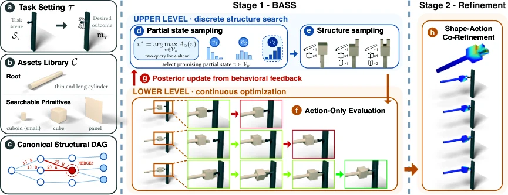 2026 · arXiv 预印本 · A · #1 **[Robot Tool Design from Scratch via Behavior-Aware Hierarchical Optimization](https://arxiv.org/abs/2609.35479)** Yinghan Chen, Xiyao Tian, Yizan Dai, Yuyang Li, Yixin Zhu 机构：Peking University / XS Vision（原文机构栏） **HOT：从零设计结构、形状和动作** 公开全文已取得 [Paper](https://arxiv.org/abs/2609.35479) · [PDF](https://arxiv.org/pdf/2609.35479) · [Project](https://hot.yinghanchen.com) · [图源](https://arxiv.org/html/2609.35479v1/fig_pipeline.png) · [解读](#paper-01) 

中文摘要（展开）

为某项任务设计工具的能力，标志着一种超越仅仅理解、选择或使用工具的智能水平。现有机器人工具设计方法通常在预先指定或生成的结构内优化工具的连续形状与动作，因此结构本身始终处于物理优化闭环之外。我们研究从零开始、由任务驱动的工具设计：工具的结构、形状与动作都由期望的物理结果推导而来。本文表明，这三个要素可以通过分层优化方法 HOT 联合设计。其上层使用 BASS 搜索离散工具结构，下层物理优化则评估这些结构的任务行为，并将里程碑进度作为行为证据反馈给搜索，最终得到联合优化的形状与动作。在四项具有不同物理功能的工具使用任务上，HOT 只评估了最多包含 5,600 万种结构的搜索空间中的一小部分，就发现了可用的功能结构；随后对几何形状的细化在保持成功的同时降低了所有任务的损失，所产生的形变在功能上具有可解释性。工具经 3D 打印后，在真实机器人上利用仿真中找到的动作完成了全部任务。根据所需的物理效果、而非从已知工具目录出发设计工具，是迈向人类和动物所展现的开放式工具制造能力的一步。

<a href="https://arxiv.org/abs/2609.35479">原摘要来源</a>

 | 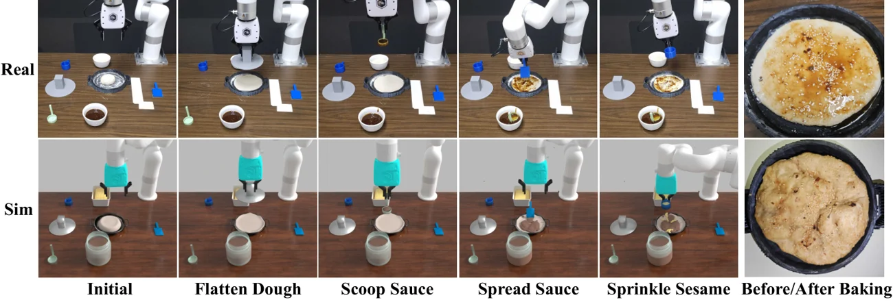 2025 · Advances in Neural Information Processing Systems 38 · A · #2 **[RobotSmith: Generative Robotic Tool Design for Acquisition of Complex Manipulation Skills](https://arxiv.org/abs/2506.14763)** Chunru Lin, Haotian Yuan, Yian Wang, Xiaowen Qiu, Tsun-Hsuan Johnson Wang, Minghao Guo, Bohan Wang, Yashraj Narang, Dieter Fox, Chuang Gan 机构：University of Massachusetts Amherst / Massachusetts Institute of Technology / National University of Singapore / NVIDIA / MIT-IBM Watson AI Lab（原文机构栏） **RobotSmith：VLM 提案与物理优化** 公开全文已取得 [Paper](https://arxiv.org/abs/2506.14763) · [PDF](https://arxiv.org/pdf/2506.14763) · [Project](https://umass-embodied-agi.github.io/RobotSmith/) · [图源](https://arxiv.org/html/2506.14763v1/teaser_v5.png) · [解读](#paper-02) 

中文摘要（展开）

赋予机器人工具设计能力，对于使其解决原本难以完成的复杂操作任务至关重要。近期生成式框架虽然可以自动合成 3D 场景、奖励函数等任务设置，但尚未解决工具使用场景中的挑战。直接检索人类设计的工具未必理想，因为许多工具（如擀面杖）对机器人机械臂而言难以操持。此外，现有工具设计方法要么依赖只能有限调参的预定义模板，要么采用未针对工具创造优化的通用 3D 生成方法。为解决这些限制，我们提出 RobotSmith：一条自动化流程，结合视觉语言模型（VLM）中隐含的物理知识与物理仿真提供的更精确物理规律，为机器人操作设计并使用工具。系统会（1）利用协作式 VLM 智能体迭代提出工具设计，（2）生成使用工具的底层机器人轨迹，以及（3）为任务性能联合优化工具几何与使用方式。我们在涉及刚体、可变形物体和流体的广泛操作任务上评估了该方法。实验表明，在任务成功率和总体性能方面，本方法均持续优于强基线。具体而言，本方法的平均成功率为 50.0%，显著超过 3D 生成（21.4%）和工具检索（11.1%）等基线。最后，我们在真实环境中部署系统，表明生成的工具及其使用方案能够有效迁移到物理执行，验证了方法的实用性和泛化能力。

<a href="https://arxiv.org/abs/2506.14763">原摘要来源</a>

 | 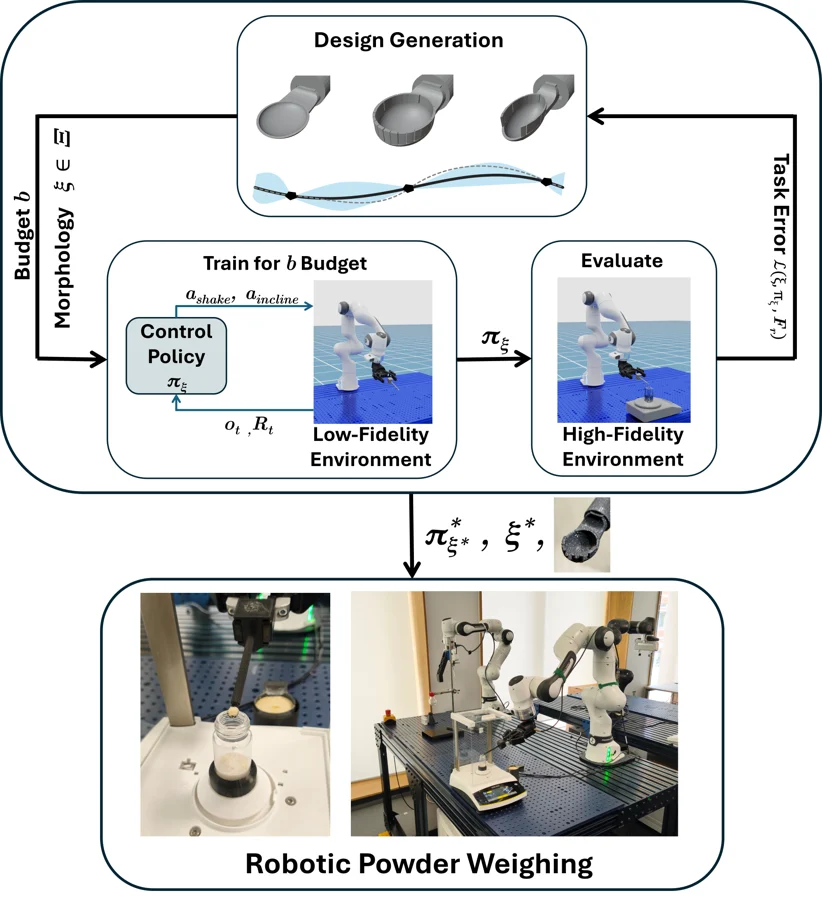 2026 · arXiv 预印本 · A · #3 **[Tool-Policy Co-Design for Powder Weighing in Laboratory Automation](https://arxiv.org/abs/2609.39797)** Nikola Radulov, Xin Yang, Kevin S. Luck, Gabriella Pizzuto 机构：University of Liverpool / Vrije Universiteit Amsterdam（原文机构栏） **粉末称量：工具与策略双层优化** 公开全文已取得 [Paper](https://arxiv.org/abs/2609.39797) · [PDF](https://arxiv.org/pdf/2609.39797) · [图源](https://arxiv.org/html/2609.39797v2/images/diagram_v4.png) · [解读](#paper-03) 

中文摘要（展开）

由于异质材料具有复杂的非线性动力学，自主粉末称量是实验室自动化的众多瓶颈之一。执行该任务的机器人化学家使用面向人手灵巧性设计的标准工具；工具的固定几何形状决定了控制策略需要调节的动力学。本文提出一种工具与策略协同设计框架，同时优化化学实验室机器人所用分配工具的形态及其控制策略，并将其表述为双层优化问题，以最小化目标粉末流动性分布上的分配误差。外层使用贝叶斯优化和 Hyperband 改变工具深度、宽度、边缘尖齿拓扑等设计参数，内层则为每个候选形态优化控制策略。我们还引入一种几何相似性度量，利用缓存中结构相近设计的策略对训练进行热启动，在相同计算预算下多探索了 28% 的配置。我们在结合材料流动性信息的机器人—材料仿真框架中，以七种具有不同物理动力学的材料开展机器人粉末称量评估。实验结果表明，协同设计得到的工具形态相较标准工具使真实称量误差降低了 45%，其中包括此前未见的材料。这些结果表明，本方法能够同时调整控制策略和物理工具以适应目标材料的动力学，为实验室自动化中的材料操作带来一种新范式。

<a href="https://arxiv.org/abs/2609.39797">原摘要来源</a>

 |
| 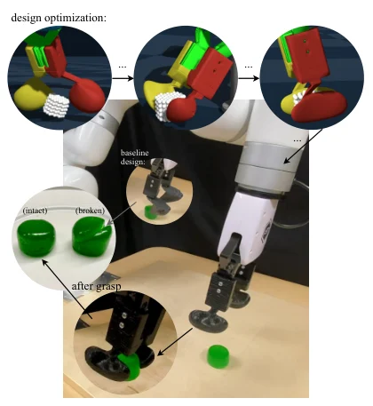 2026 · Robotics: Science and Systems XXII · A · #4 **[Latent Diffeomorphic Co-Design of End-Effectors for Deformable and Fragile Object Manipulation](https://arxiv.org/abs/2602.17921)** Kei Ikemura, Yifei Dong, Florian Pokorny 机构：affiliation 未确认（原文有 kth.se 通讯邮箱；不据邮箱推定正式机构） **脆弱物体：保形变形与控制联合设计** 公开全文已取得 [Paper](https://arxiv.org/abs/2602.17921) · [PDF](https://arxiv.org/pdf/2602.17921) · [图源](https://arxiv.org/html/2602.17921v1/teaser.png) · [解读](#paper-04) 

中文摘要（展开）

由于接触动力学复杂，且对物体完整性有严格要求，操作可变形和易损物体仍是机器人学中的基本挑战。现有方法通常分别优化末端执行器设计或控制策略，限制了可达到的性能。本文提出首个针对可变形和易损物体操作、联合优化末端执行器形态与操作控制的协同设计框架。我们引入（1）潜在空间中的微分同胚形状参数化，使末端执行器几何优化兼具表达能力与可处理性；（2）感知应力的双层协同设计流程，将形态与控制优化耦合；以及（3）从特权信息到点云的策略蒸馏方案，用于零样本真实部署。我们在具有挑战性的食物操作任务上评估方法，包括抓取和推动果冻，以及铲取鱼片。仿真与真实实验展示了所提方法的有效性。

<a href="https://arxiv.org/abs/2602.17921">原摘要来源</a>

 | 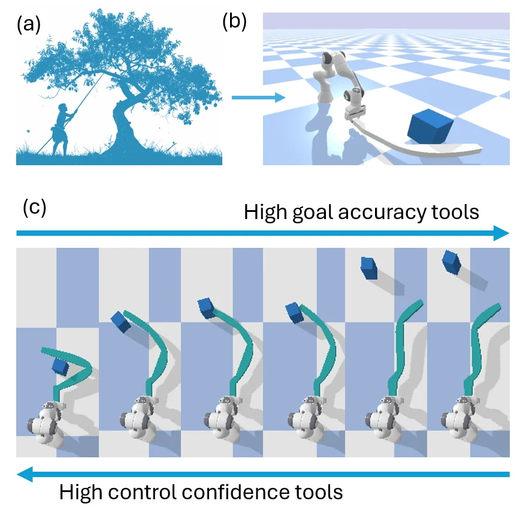 2025 · arXiv 预印本 · A · #5 **[Designing Tools with Control Confidence](https://arxiv.org/abs/2510.12630)** Ajith Anil Meera, Abian Torres, Pablo Lanillos 机构：Donders Institute / Radboud University / Cajal Neuroscience Center / Polytechnic University of Madrid（原文机构栏） **把控制置信度写入设计目标** 公开全文已取得 [Paper](https://arxiv.org/abs/2510.12630) · [PDF](https://arxiv.org/pdf/2510.12630) · [Code](https://github.com/ajitham123/Tool_design_control_confidence) · [图源](https://arxiv.org/html/2510.12630v1/pics/teaser.png) · [解读](#paper-05) 

中文摘要（展开）

史前人类为专门任务发明石制工具时，不仅最大化工具当下完成目标的准确性，也提高了在类似条件下再次使用工具的信心。这一因素增强了工具的鲁棒性，即使其在环境不确定性下的性能偏差尽可能小。然而，当前自主工具设计框架仅依赖性能优化，没有考虑智能体对重复使用工具的信心。为弥补这一缺口，我们（i）定义了面向机器人、以任务为条件的自主手持工具设计优化框架，并且（ii）在优化过程中引入受神经机制启发的控制信心项，帮助智能体设计出更鲁棒的工具。通过使用机械臂的严格仿真实验，我们表明，以控制信心为目标函数设计的工具，相较仅由准确性驱动的目标，在工具使用过程中对环境不确定性更鲁棒。我们进一步表明，将控制信心加入工具设计目标函数，可以在控制扰动下平衡工具的鲁棒性与目标准确性。最后，我们表明，基于 CMAES 的自主工具设计进化优化策略能够以最少的迭代次数设计出最优工具，优于其他先进优化器。代码：https://github.com/ajitham123/Tool_design_control_confidence。

<a href="https://arxiv.org/abs/2510.12630">原摘要来源</a>

 | 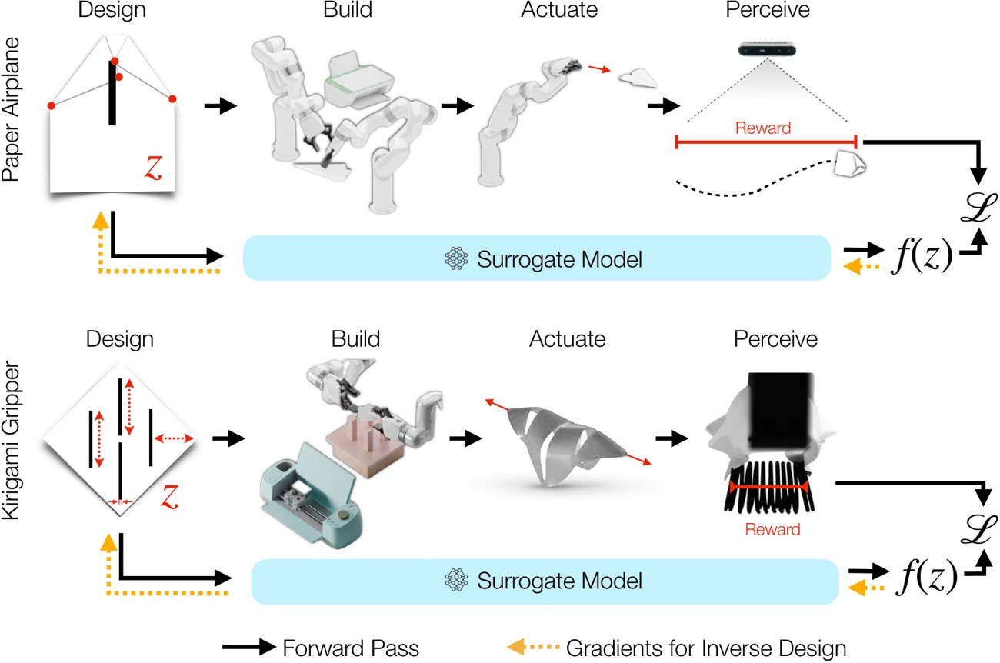 2024 · arXiv 预印本 · A · #6 **[PaperBot: Learning to Design Real-World Tools Using Paper](https://arxiv.org/abs/2403.09566)** Ruoshi Liu, Junbang Liang, Sruthi Sudhakar, Huy Ha, Cheng Chi, Shuran Song, Carl Vondrick 机构：Columbia University / Stanford University（PDF 首页） **PaperBot：真实世界中做工具** 公开全文已取得 [Paper](https://arxiv.org/abs/2403.09566) · [PDF](https://arxiv.org/pdf/2403.09566) · [Project](https://paperbot.cs.columbia.edu/) · [图源](https://arxiv.org/html/2403.09566v1/method.png) · [解读](#paper-06) 

中文摘要（展开）

纸是一种廉价、可回收且洁净的材料，常被用来制作实用工具。传统工具设计依赖仿真或物理分析，而这些方法往往不够准确且耗时。本文提出 PaperBot，一种无需人工干预、直接在真实世界中学习用纸设计和使用工具的方法。我们在两项工具设计任务上展示了 PaperBot 的有效性和效率：（1）学习折叠并投掷纸飞机，使飞行距离最大；（2）学习将纸裁剪成抓手，使抓取力最大。我们提出一个自监督学习框架，通过学习执行一系列折叠、裁剪和动态操作动作，优化工具的设计与使用。我们将系统部署到真实双臂机器人上，解决涉及空气动力学（纸飞机）和摩擦（纸抓手）、无法准确仿真的具有挑战性的设计任务。

<a href="https://arxiv.org/abs/2403.09566">原摘要来源</a>

 |
| 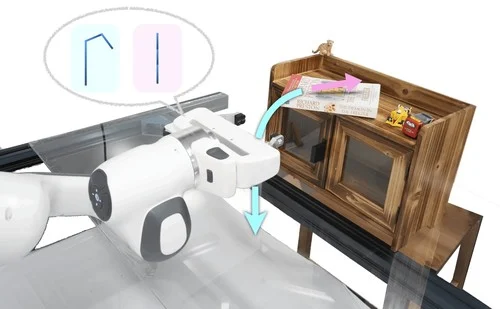 2023 · CoRL 2023（arXiv Comments） · A · #7 **[Learning to Design and Use Tools for Robotic Manipulation](https://arxiv.org/abs/2311.00754)** Ziang Liu, Stephen Tian, Michelle Guo, C. Karen Liu, Jiajun Wu 机构：Stanford University（PDF 首页） **学习 designer policy，而非单个工具** 公开全文已取得 [Paper](https://arxiv.org/abs/2311.00754) · [PDF](https://arxiv.org/pdf/2311.00754) · [Project](https://robotic-tool-design.github.io/) · [图源](https://arxiv.org/html/2311.00754v1/figures/fig1.jpg) · [解读](#paper-07) 

中文摘要（展开）

当自身形态受到限制时，人类和一些动物能够利用环境中的物体，完成原本不可能的任务。机器人也可能通过工具使用获得一系列额外能力。近期利用深度学习联合优化形态与控制的技术，在设计运动智能体方面很有效。但输出单一形态虽然适合运动任务，操作任务却需要根据目标采用不同策略。操作智能体必须能够针对不同目标快速制作专用工具原型。因此，我们提出学习设计策略，而非单个设计。设计策略以任务信息为条件，输出有助于解决任务的工具设计；以设计为条件的控制策略随后使用这些工具执行操作。本文通过引入一个联合学习两类策略的强化学习框架，向这一目标迈进一步。在仿真操作任务中，我们表明该框架在多目标或多变体设置下比以往方法具有更高的样本效率，可以通过零样本插值或微调处理此前未见的目标，并能在实际约束下权衡设计策略与控制策略的复杂度。最后，我们将学习得到的策略部署到真实机器人。可视化内容请见补充视频与网站：https://robotic-tool-design.github.io/。

<a href="https://arxiv.org/abs/2311.00754">原摘要来源</a>

 | 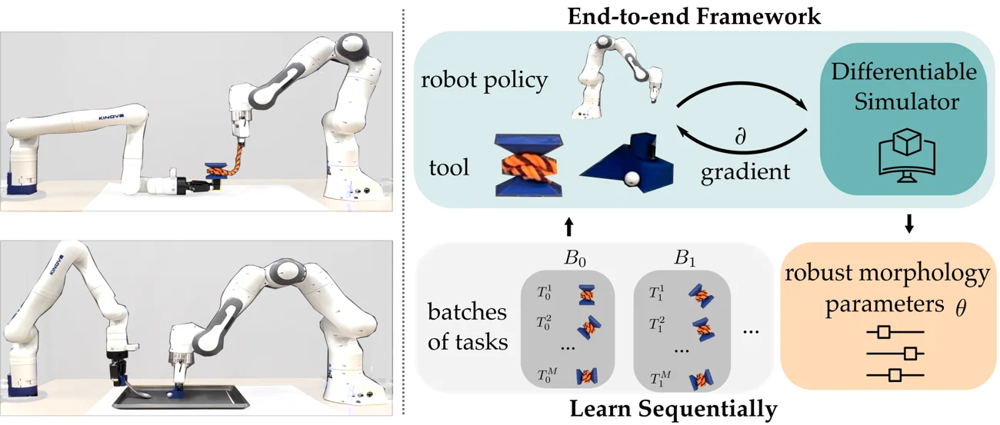 2023 · ICRA 2023 · A · #8 **[Learning Tool Morphology for Contact-Rich Manipulation Tasks with Differentiable Simulation](https://arxiv.org/abs/2211.02201)** Mengxi Li, Rika Antonova, Dorsa Sadigh, Jeannette Bohg 机构：Stanford University（原文作者机构栏） **可微仿真学习工具形态** 公开全文已取得 [Paper](https://arxiv.org/abs/2211.02201) · [PDF](https://arxiv.org/pdf/2211.02201) · [图源](https://arxiv.org/html/2211.02201v2/Figures/frontfig.png) · [解读](#paper-08) 

中文摘要（展开）

人类执行接触密集的操作任务时，往往需要定制工具来简化任务。例如，我们使用刀、叉和勺等不同餐具处理食物。同样，机器人也可能受益于专用工具，以便更容易地完成各种任务。本文提出一个端到端框架，利用可微物理仿真器自动学习接触密集操作任务所需的工具形态。以往工作依赖人工构建的先验，需要详细指定 3D 物体模型、抓取位姿和任务描述，才能开展搜索或优化。本方法只需定义与任务表现有关的目标，并通过随机化任务变体学习鲁棒形态。我们将该优化表述为持续学习问题，使其能够实际求解。我们在仿真中的多个场景展示了方法设计新工具的有效性，例如缠绕绳索、翻转盒子，以及将豌豆推上铲勺。此外，真实机器人实验表明，本方法发现的工具形状有助于机器人在这些场景中成功完成任务。

<a href="https://arxiv.org/abs/2211.02201">原摘要来源</a>

 | 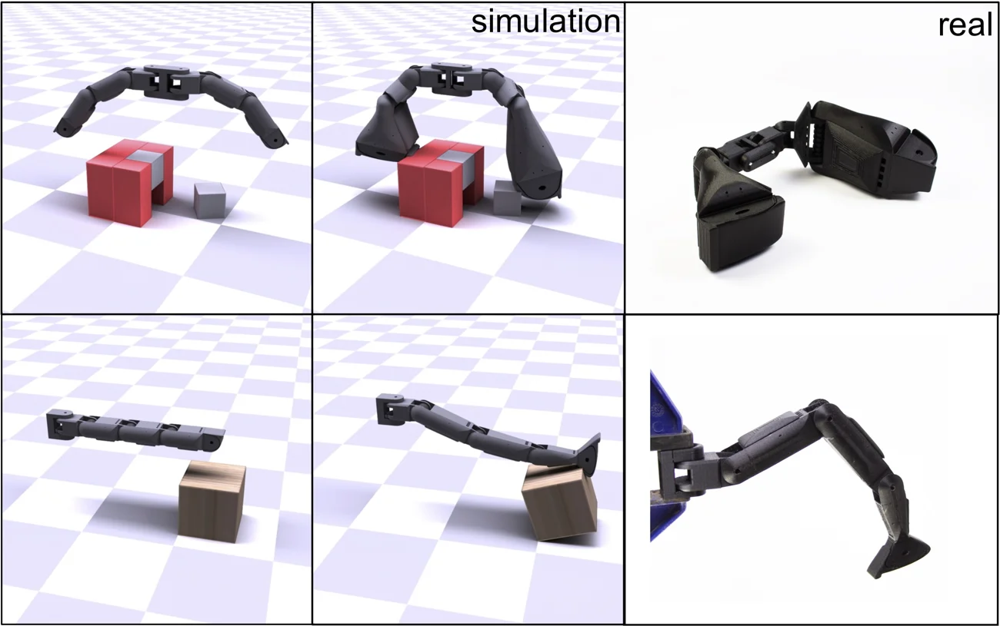 2021 · Robotics: Science and Systems XVII · A · #9 **[An End-to-End Differentiable Framework for Contact-Aware Robot Design](https://arxiv.org/abs/2107.07501)** Jie Xu, Tao Chen, Lara Zlokapa, Michael Foshey, Wojciech Matusik, Shinjiro Sueda, Pulkit Agrawal 机构：MIT / Texas A&amp;M University（PDF 首页） **DiffHand / DiffRedMax：设计与动力学可微** 公开全文已取得 [Paper](https://arxiv.org/abs/2107.07501) · [PDF](https://arxiv.org/pdf/2107.07501) · [Project](https://diffhand.csail.mit.edu/) · [图源](https://arxiv.org/html/2107.07501v2/images/teaser.jpg) · [解读](#paper-09) 

中文摘要（展开）

当前机器人操作的主流范式包含两个独立阶段：机械装置设计与控制。由于机器人形态与其可控方式紧密相连，联合优化设计和控制能够显著提高性能。现有协同优化方法能力有限，无法探索丰富的设计空间。主要原因是在接触密集任务所需的设计复杂度与制造、优化、接触处理等实际约束之间存在权衡。我们构建了一个面向接触的机器人设计端到端可微框架，克服了其中若干挑战。框架包含两个关键部分：一种基于形变的新参数化方法，可设计具有任意复杂几何形状的关节式刚体机器人；以及一个可微刚体仿真器，能够处理接触密集场景，并对完整范围的运动学和动力学参数计算解析梯度。在多项操作任务中，本框架优于仅优化控制、采用其他表示进行设计优化，或使用无梯度方法开展协同优化的现有方法。

<a href="https://arxiv.org/abs/2107.07501">原摘要来源</a>

 |
| 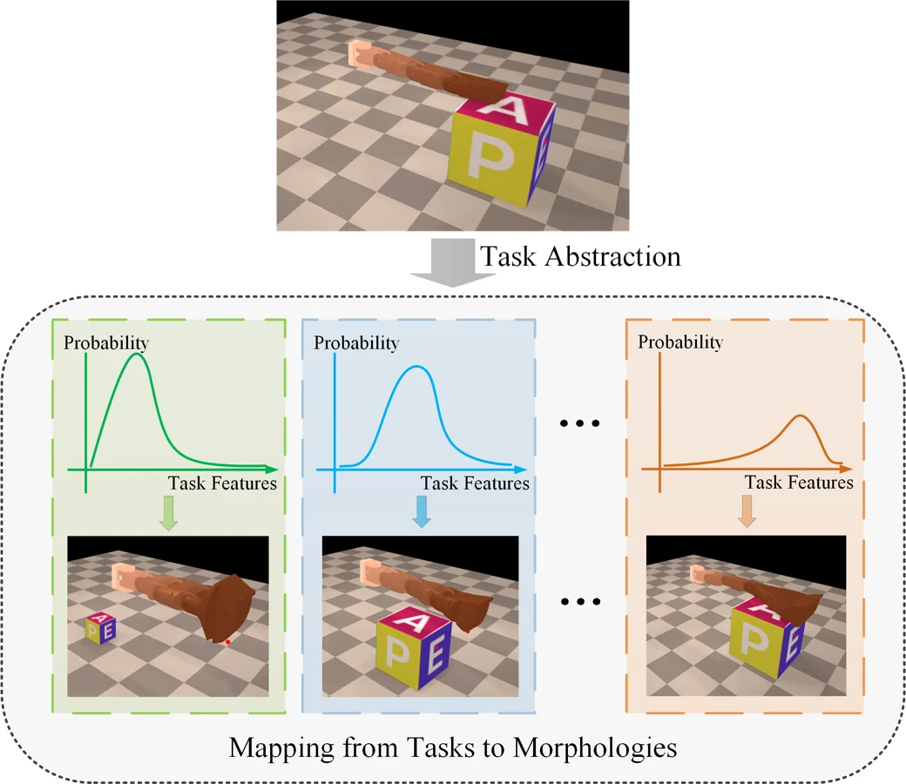 2023 · 2023 IEEE/RSJ International Conference on Intelligent Robots and Systems (IROS) · A · #10 **[Task2Morph: Differentiable Task-inspired Framework for Contact-Aware Robot Design](https://arxiv.org/abs/2403.19093)** Yishuai Cai, Shaowu Yang, Minglong Li, Xinglin Chen, Yunxin Mao, Xiaodong Yi, Wenjing Yang 机构：affiliation 未确认 **Task2Morph：学习任务到形态的映射** 公开全文已取得 [Paper](https://arxiv.org/abs/2403.19093) · [PDF](https://arxiv.org/pdf/2403.19093) · [图源](https://arxiv.org/html/2403.19093v1/images/describtion.png) · [解读](#paper-10) 

中文摘要（展开）

优化适应不同任务的机器人形态与控制器，是机器人设计（亦称具身智能）领域的关键问题。以往工作通常将其建模为联合优化问题，并使用基于搜索的方法在形态空间中寻找最优解。然而，它们忽略了能够直接启发机器人设计的任务到形态映射的隐含知识。例如，翻转更重的盒子往往需要力量更强的机械臂。本文提出一种新颖且通用的、面向接触的可微任务启发式机器人设计框架 Task2Morph。我们抽象出与任务表现高度相关的任务特征，并用它们建立任务到形态的映射。进一步地，我们将该映射嵌入可微机器人设计过程，同时利用梯度信息学习映射并执行整体优化。实验在三个场景中开展，结果验证了 Task2Morph 在效率和有效性方面优于缺少任务启发形态模块的 DiffHand。

<a href="https://arxiv.org/abs/2403.19093">原摘要来源</a>

 | 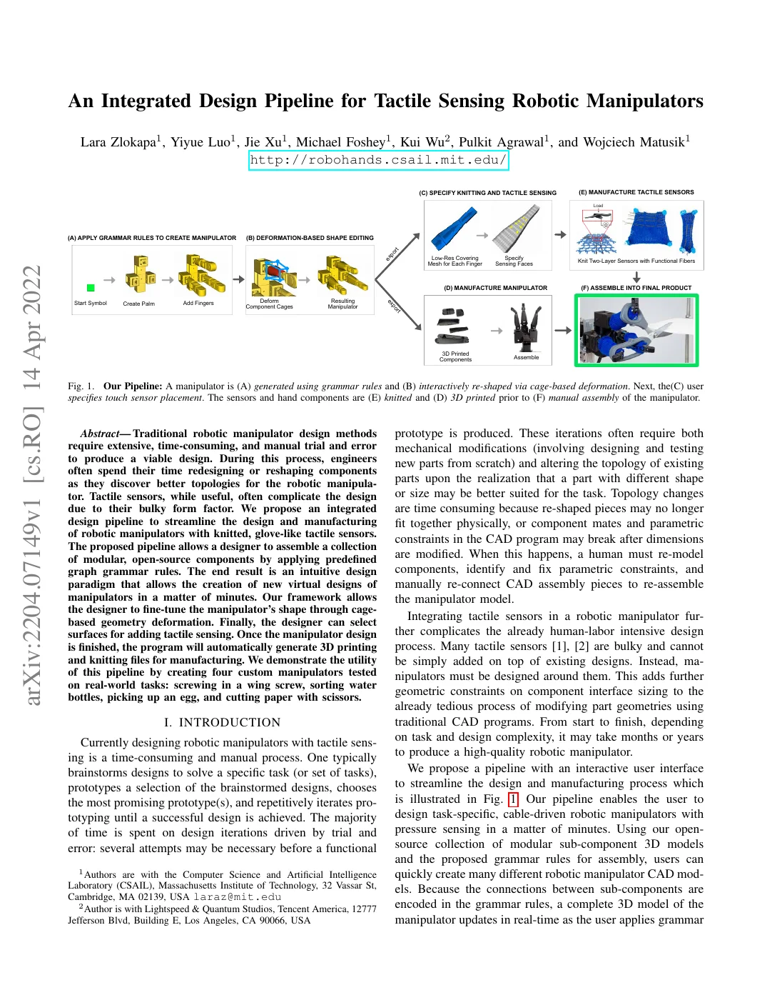 2022 · 2022 International Conference on Robotics and Automation (ICRA) · A · #11 **[An Integrated Design Pipeline for Tactile Sensing Robotic Manipulators](https://arxiv.org/abs/2204.07149)** Lara Zlokapa, Yiyue Luo, Jie Xu, Michael Foshey, Kui Wu, Pulkit Agrawal, Wojciech Matusik 机构：Massachusetts Institute of Technology（原文机构栏） **触觉机械手：从结构到制造文件** 公开全文已取得 [Paper](https://arxiv.org/abs/2204.07149) · [PDF](https://arxiv.org/pdf/2204.07149) · [图源](https://arxiv.org/pdf/2204.07149) · [解读](#paper-11) 

中文摘要（展开）

传统机器人机械装置设计方法需要大量耗时的人工试错，才能得到可行设计。在此过程中，工程师发现更好的拓扑结构后，往往会花费时间重新设计部件或调整部件形状。触觉传感器虽然有用，但其庞大的外形常使设计复杂化。我们提出一条集成设计流程，以简化配备针织手套式触觉传感器的机器人机械装置的设计与制造。该流程允许设计者通过应用预定义图语法规则，组装一系列模块化开源部件，形成一种直观的设计范式，在数分钟内创建新的虚拟机械装置设计。本框架允许设计者利用基于笼的几何形变微调装置形状。最后，设计者可以选择添加触觉感知的表面。设计完成后，程序自动生成用于制造的 3D 打印文件与针织文件。我们通过创建四种定制机械装置并在真实任务中测试，展示了流程的实用性：旋入蝶形螺钉、分拣水瓶、拾取鸡蛋，以及用剪刀裁纸。

<a href="https://arxiv.org/abs/2204.07149">原摘要来源</a>

 | 原文配图暂未取得，保留已核对的文字卡片。 2021 · 2021 IEEE International Conference on Robotics and Automation (ICRA) · A · #12 **[Co-Optimizing Robot, Environment, and Tool Design via Joint Manipulation Planning](https://doi.org/10.1109/icra48506.2021.9561256)** Marc Toussaint, Jung-Su Ha, Ozgur S. Oguz 机构：affiliation 未确认 **同时优化机器人、环境和工具** 题录 / 摘要已核对 [Paper](https://doi.org/10.1109/icra48506.2021.9561256) · [解读](#paper-12) 

中文摘要（展开）

现有序列操作规划和轨迹优化工作通常假设机器人、环境与工具已经给定。然而，尤其在工业应用中，一个很有价值的问题是：针对一组特定操作任务，什么样的机器人设计、工具形状或机器人工作站几何布局最优？为解决这一问题，我们提出一种同时优化静态设计参数与序列操作轨迹的表述。我们可以纳入惩罚速度（路径长度）与关节力矩等优化目标。评估表明，设计优化能够显著改善这些指标。例如，在扳手工具演示场景中，我们展示了可以优化扳手形状与机器人设计，使机器人以最小代价施加所需的外部力矩。

<a href="https://api.openalex.org/works/W3206965411">原摘要来源（OpenAlex 索引）</a>

 |
| 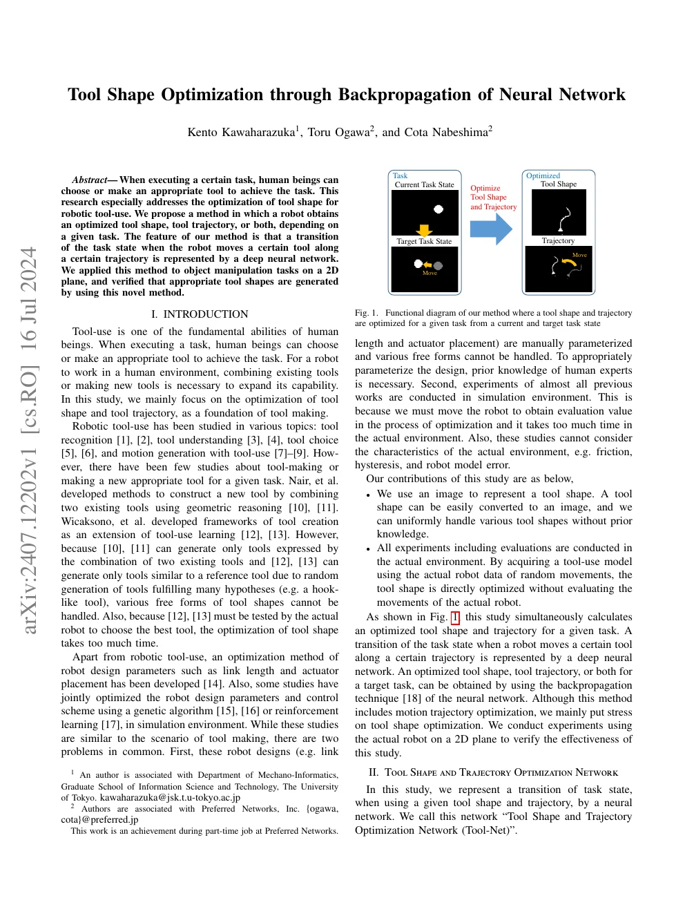 2020 · 2020 IEEE/RSJ International Conference on Intelligent Robots and Systems (IROS) · A · #13 **[Tool Shape Optimization through Backpropagation of Neural Network](https://arxiv.org/abs/2407.12202)** Kento Kawaharazuka, Toru Ogawa, Cota Nabeshima 机构：affiliation 未确认 **神经动力学反传优化工具形状** 公开全文已取得 [Paper](https://arxiv.org/abs/2407.12202) · [PDF](https://arxiv.org/pdf/2407.12202) · [图源](https://arxiv.org/pdf/2407.12202) · [解读](#paper-13) 

中文摘要（展开）

人类执行某项任务时，可以选择或制作合适的工具来完成任务。本研究专门关注机器人工具使用中的工具形状优化。我们提出一种方法，使机器人能够根据给定任务获得优化后的工具形状、工具轨迹，或同时获得两者。本方法的特点是使用深度神经网络，表示机器人沿特定轨迹移动特定工具时任务状态发生的转变。我们将该方法应用于二维平面上的物体操作任务，并验证了这种新方法能够生成合适的工具形状。

<a href="https://arxiv.org/abs/2407.12202">原摘要来源</a>

 | 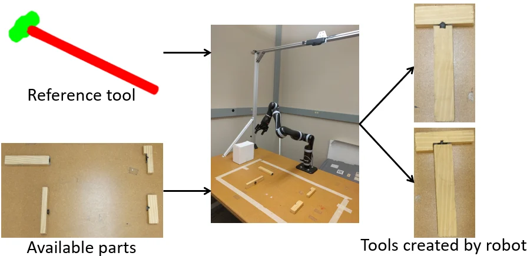 2019 · 2019 International Conference on Robotics and Automation (ICRA) · A · #14 **[Tool Macgyvering: Tool Construction Using Geometric Reasoning](https://arxiv.org/abs/1902.03666)** Lakshmi Nair, Jonathan Balloch, Sonia Chernova 机构：affiliation 未确认 **Tool Macgyvering：用已有部件造工具** 公开全文已取得 [Paper](https://arxiv.org/abs/1902.03666) · [PDF](https://arxiv.org/pdf/1902.03666) · [图源](https://arxiv.org/html/1902.03666v1/imgs/Overview.PNG) · [解读](#paper-14) 

中文摘要（展开）

MacGyvering 指利用手头可得的物体，以富有创造性或即兴的方式制作或修复某样东西。本文探索其中涉及工具构造的一类问题，即利用环境中可获得的部件创造工具。我们形式化了工具 MacGyvering 的整体问题域，为工具构造与替代问题引入三个复杂度层级，并提出旨在解决其中一个层级的新计算框架，具体贡献是一种基于几何推理的工具构造新算法。我们利用一台 7 自由度机械臂构造三种工具，验证了本方法。

<a href="https://arxiv.org/abs/1902.03666">原摘要来源</a>

 | 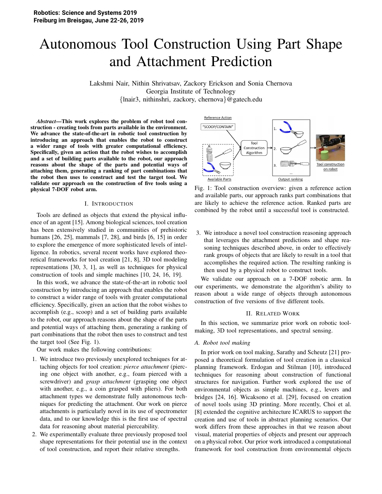 2019 · Robotics: Science and Systems XV · A · #15 **[Autonomous Tool Construction Using Part Shape and Attachment Prediction](https://doi.org/10.15607/rss.2019.xv.009)** Lakshmi Velayudhan Nair, Nithin Shrivatsav Srikanth, Zackory Erikson, Sonia Chernova 机构：Georgia Institute of Technology（PDF 首页） **同时推断部件形状与连接方式** 公开全文已取得 [Paper](https://doi.org/10.15607/rss.2019.xv.009) · [PDF](https://doi.org/10.15607/rss.2019.xv.009) · [图源](https://doi.org/10.15607/rss.2019.xv.009) · [解读](#paper-15) 

中文摘要（展开）

本文研究机器人工具构造问题，即利用环境中可获得的部件创造工具。我们提出一种方法，使机器人能够以更高的计算效率构造更广泛的工具，从而推进机器人工具构造的研究。具体而言，给定机器人希望完成的动作与可使用的构造部件，本方法推理部件形状及可能的连接方式，生成部件组合的排序，供机器人据此构造并测试目标工具。我们利用真实的 7 自由度机械臂构造五种工具，验证了本方法。

<a href="https://doi.org/10.15607/rss.2019.xv.009">原摘要来源</a>

 |
| 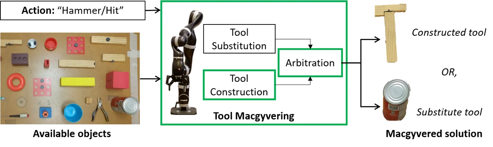 2020 · arXiv 预印本 · A · #16 **[Tool Macgyvering: A Novel Framework for Combining Tool Substitution and Construction](https://arxiv.org/abs/2008.10638)** Lakshmi Nair, Nithin Shrivatsav, Sonia Chernova 机构：Georgia Institute of Technology（原文作者机构栏） **在工具替代与工具制造之间做决策** 公开全文已取得 [Paper](https://arxiv.org/abs/2008.10638) · [PDF](https://arxiv.org/pdf/2008.10638) · [图源](https://arxiv.org/html/2008.10638v1/imgs/algo_overview.png) · [解读](#paper-16) 

中文摘要（展开）

MacGyvering 指利用手头任何可获得物体，以富有创造性的方式解决问题。工具 MacGyvering 是其中涉及工具缺失的一类任务，需要使用已有物体替代缺失工具（工具替代）或构造缺失工具（工具构造）。本文提出一个新的工具 MacGyvering 框架，通过在两个选项之间进行仲裁，将工具替代与构造相结合，输出最终解决方案。我们的工具构造方法推理物体的形状、材料与不同连接方式，以构造所需工具。我们进一步开发价值函数，使机器人能够在替代与构造之间有效仲裁。结果表明，本工具构造方法成功构造可用工具的准确率为 96.67%，仲裁策略在替代与构造之间成功选择的准确率为 83.33%。

<a href="https://arxiv.org/abs/2008.10638">原摘要来源</a>

 | 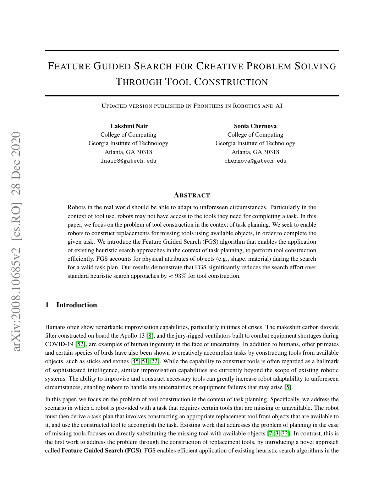 2020 · Frontiers in Robotics and AI · A · #17 **[Feature Guided Search for Creative Problem Solving Through Tool Construction](https://arxiv.org/abs/2008.10685)** Lakshmi Nair, Sonia Chernova 机构：Georgia Institute of Technology（原文机构栏） **Feature Guided Search：规划中造工具** 公开全文已取得 [Paper](https://arxiv.org/abs/2008.10685) · [PDF](https://arxiv.org/pdf/2008.10685) · [图源](https://arxiv.org/pdf/2008.10685) · [解读](#paper-17) 

中文摘要（展开）

真实世界中的机器人应能够适应未预见的情况。尤其在工具使用场景中，机器人可能无法获得完成任务所需的工具。本文聚焦于任务规划中的工具构造问题，希望使机器人能够利用可获得的物体，为缺失工具构造替代品，以完成给定任务。我们提出特征引导搜索（Feature Guided Search，FGS）算法，使现有启发式搜索方法能够在任务规划中高效执行工具构造。FGS 在搜索有效任务计划时考虑物体的物理属性，如形状和材料。结果表明，相较标准启发式搜索方法，FGS 在工具构造中显著减少了搜索工作量，降幅约为 93%。

<a href="https://arxiv.org/abs/2008.10685">原摘要来源</a>

 | 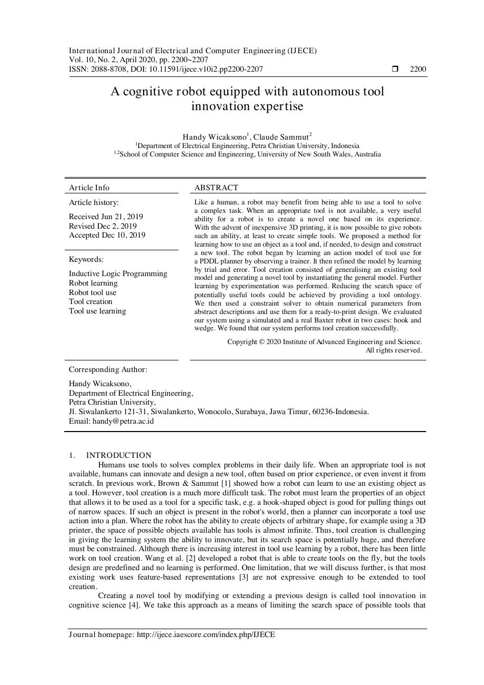 2020 · International Journal of Electrical and Computer Engineering (IJECE) · A · #18 **[A cognitive robot equipped with autonomous tool innovation expertise](https://doi.org/10.11591/ijece.v10i2.pp2200-2207)** Handy Wicaksono, Claude Sammut 机构：affiliation 未确认 **认知机器人：从工具模型泛化新工具** 公开全文已取得 [Paper](https://doi.org/10.11591/ijece.v10i2.pp2200-2207) · [PDF](https://ijece.iaescore.com/index.php/IJECE/article/download/20488/13743) · [图源](https://ijece.iaescore.com/index.php/IJECE/article/download/20488/13743) · [解读](#paper-18) 

中文摘要（展开）

与人类一样，机器人也可能受益于使用工具来解决复杂任务。当合适工具不可用时，基于经验创造新工具对机器人而言是一项非常有用的能力。廉价 3D 打印的出现，使赋予机器人这种能力成为可能，至少可以创造简单工具。我们提出一种方法，学习如何将物体用作工具，并在需要时设计和构造新工具。机器人首先通过观察示教者，为 PDDL 规划器学习工具使用的动作模型，随后通过试错学习细化模型。工具创造包括对已有工具模型进行泛化，再将一般模型实例化为新工具；之后继续通过实验学习。提供工具本体可以缩小潜在有用工具的搜索空间。随后，我们使用约束求解器，从抽象描述中获得数值参数，并用于生成可直接打印的设计。我们在仿真和真实 Baxter 机器人上，以钩子和楔子两个案例评估系统，发现系统能够成功完成工具创造。

<a href="https://api.crossref.org/works/10.11591%2Fijece.v10i2.pp2200-2207">原摘要来源</a>

 |
| 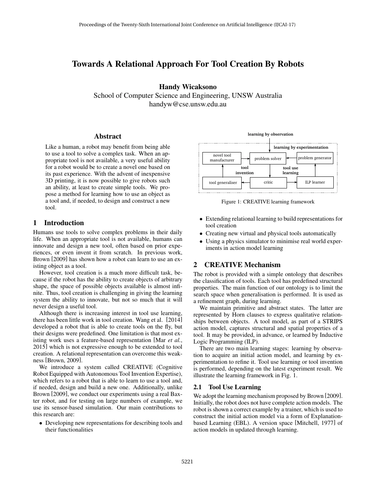 2017 · Proceedings of the Twenty-Sixth International Joint Conference on Artificial Intelligence · A · #19 **[Towards A Relational Approach For Tool Creation By Robots](https://doi.org/10.24963/ijcai.2017/770)** Handy Wicaksono 机构：affiliation 未确认 **早期关系式工具创造方案** 公开全文已取得 [Paper](https://doi.org/10.24963/ijcai.2017/770) · [PDF](https://www.ijcai.org/proceedings/2017/0770.pdf) · [图源](https://www.ijcai.org/proceedings/2017/0770.pdf) · [解读](#paper-19) 

中文摘要（展开）

与人类一样，机器人也可能受益于使用工具来解决复杂任务。当合适工具不可用时，基于过往经验创造新工具，将是机器人一项非常有用的能力。廉价 3D 打印的出现，使赋予机器人这种能力成为可能，至少可以创造简单工具。我们提出一种方法，学习如何将物体用作工具，并在需要时设计和构造新工具。

<a href="https://api.crossref.org/works/10.24963%2Fijcai.2017%2F770">原摘要来源</a>

 | 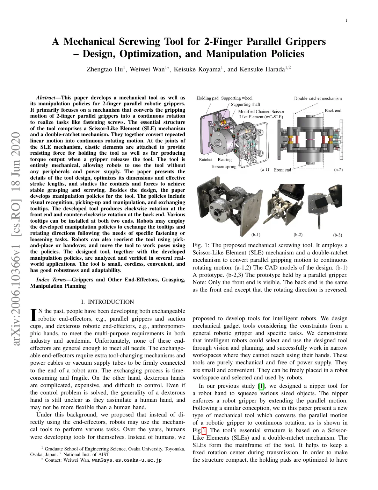 2022 · IEEE Transactions on Robotics · A · #20 **[A Mechanical Screwing Tool for 2-Finger Parallel Grippers -- Design, Optimization, and Manipulation Policies](https://arxiv.org/abs/2006.10366)** Zhengtao Hu, Weiwei Wan, Keisuke Koyama, Kensuke Harada 机构：affiliation 未确认 **为两指夹爪设计拧螺丝工具** 公开全文已取得 [Paper](https://arxiv.org/abs/2006.10366) · [PDF](https://arxiv.org/pdf/2006.10366) · [图源](https://arxiv.org/pdf/2006.10366) · [解读](#paper-20) 

中文摘要（展开）

本文为双指平行机器人夹爪开发一种机械工具及其操作策略，主要关注将双指平行夹爪的夹持运动转换为连续旋转的机构，以完成紧固螺钉等任务。工具的核心结构包含类剪式元件（Scissor-Like Element，SLE）机构和双棘轮机构，两者共同将重复直线运动转换为连续旋转。SLE 机构的关节附有弹性元件，既提供握持工具所需的阻力，也在夹爪松开工具时产生输出扭矩。该工具完全由机械结构组成，机器人使用时无需任何外围设备或电源。本文给出工具设计细节，优化其尺寸和有效行程，并研究实现稳定抓取与拧螺钉所需的接触和力。除设计之外，本文还开发了包含视觉识别、拾取与操作以及更换工具头的操作策略。工具前端产生顺时针旋转，后端产生逆时针旋转，两端均可安装不同工具头。机器人可按照具体紧固或松脱任务的需要，利用所开发策略更换工具头及旋转方向。机器人还可通过抓放或交接重新定向工具，并使用策略将工具移至工作位姿。工具及其操作策略在多个真实应用中得到分析与验证。该工具体积小、无线缆、使用方便，并具有良好的鲁棒性与适应性。

<a href="https://arxiv.org/abs/2006.10366">原摘要来源</a>

 |  |

### 逐篇中文要点

每篇把论文事实、证据边界和研究建议分开。`[事实]` 可追溯至链接中的论文或正式题录；`[边界]` 是依据当前读取范围做的证据判断；`[推断]` 是面向 Tool AutoDesign 的研究建议。没有给出实验数字的条目不补造数字。

#### 1. [Robot Tool Design from Scratch via Behavior-Aware Hierarchical Optimization](https://arxiv.org/abs/2609.35479)

**HOT：从零设计结构、形状和动作**  ·  A 类  ·  2026  ·  arXiv 预印本

- **[事实 · 方法]** 通过上层离散结构搜索 BASS 与下层物理优化联合决定工具结构、连续形状和使用动作；下层的里程碑进展反馈给结构搜索。
- **[事实 · 证据]** 四类任务覆盖扫球、钉入与拔钉、转螺栓、从水中舀球；原文报告打印工具在真机完成四类任务。
- **[边界]** 结构仍由指定原语和语法组成；四任务成功不等于开放世界工具设计。
- **[推断 · 对本项目的启发]** 优先作为结构搜索基线，比较同预算下候选数、物理评估耗时和最终真机成功率。

作者：Yinghan Chen, Xiyao Tian, Yizan Dai, Yuyang Li, Yixin Zhu 
机构：Peking University / XS Vision（原文机构栏） 
核验：已取得公开全文（HTML / PDF）；要点以摘要及可核对原文段落为依据。 
arXiv 首次上传：2026-09-28；编号 `2609.35479`。 
[Paper](https://arxiv.org/abs/2609.35479) · [PDF](https://arxiv.org/pdf/2609.35479) · [Project](https://hot.yinghanchen.com) · [图源](https://arxiv.org/html/2609.35479v1/fig_pipeline.png)

原文图说明与出处

Fig. 1 : The HOT framework. (a) A task specifies a scene and a desired physical outcome. (b) Tools are composed by a constructive grammar from a fixed handle and a library of searchable primitives. (c) Equivalent construction states are canonicalized into a dag that aggregates their behavioral evidence. In Stage 1, bass selects a promising partial state by Bayesian lookahead (d), samples a complete structure (e), evaluates it under action-only optimization (f), and propagates the achieved milestones back as behavioral feedback (g). Stage 2 co-refines the shape and action of each retained structure (h).

来源：[论文页面](https://arxiv.org/html/2609.35479) · [图 / PDF](https://arxiv.org/html/2609.35479v1/fig_pipeline.png)

#### 2. [RobotSmith: Generative Robotic Tool Design for Acquisition of Complex Manipulation Skills](https://arxiv.org/abs/2506.14763)

**RobotSmith：VLM 提案与物理优化**  ·  A 类  ·  2025  ·  Advances in Neural Information Processing Systems 38

- **[事实 · 方法]** 由 VLM 协作提出工具结构，生成机器人轨迹，再联合优化工具几何与使用方式；设计针对机器人而非照搬人用工具。
- **[事实 · 证据]** 覆盖刚体、可变形体与流体操作；摘要报告平均成功率 50.0%，3D 生成基线为 21.4%。
- **[边界]** 这些成功率属于论文自己的任务与协议，不能和其他论文直接横向排名；候选结构提案与物理优化的分工需单独检查。
- **[推断 · 对本项目的启发]** 适合搭建 generate–evaluate–optimize 基线，并消融 VLM 提案质量和物理反馈各自的贡献。

作者：Chunru Lin, Haotian Yuan, Yian Wang, Xiaowen Qiu, Tsun-Hsuan Johnson Wang, Minghao Guo, Bohan Wang, Yashraj Narang, Dieter Fox, Chuang Gan 
机构：University of Massachusetts Amherst / Massachusetts Institute of Technology / National University of Singapore / NVIDIA / MIT-IBM Watson AI Lab（原文机构栏） 
核验：已取得公开全文（HTML / PDF）；要点以摘要及可核对原文段落为依据。 
arXiv 首次上传：2025-06-17；编号 `2506.14763`。 
正式 / 出版记录 DOI：[10.52202/085713-3684](https://doi.org/10.52202/085713-3684)。 
[Paper](https://arxiv.org/abs/2506.14763) · [PDF](https://arxiv.org/pdf/2506.14763) · [Project](https://umass-embodied-agi.github.io/RobotSmith/) · [图源](https://arxiv.org/html/2506.14763v1/teaser_v5.png)

原文图说明与出处

Figure 1: Our pipeline enables fully autonomous long-horizon manipulation by generating and using tools for each subtask without human involvement. The robot completes the entire pancake-making process from shaping dough to spreading sauce and adding sesame. The bottom row shows simulated execution with generated tools, while the top row depicts the corresponding real-world stages of pancake preparation.

来源：[论文页面](https://arxiv.org/html/2506.14763) · [图 / PDF](https://arxiv.org/html/2506.14763v1/teaser_v5.png)

#### 3. [Tool-Policy Co-Design for Powder Weighing in Laboratory Automation](https://arxiv.org/abs/2609.39797)

**粉末称量：工具与策略双层优化**  ·  A 类  ·  2026  ·  arXiv 预印本

- **[事实 · 方法]** 外层 BOHB 搜索工具深度、宽度与边缘尖齿拓扑，内层训练控制策略；利用几何相似性复用已有策略。
- **[事实 · 证据]** 七种材料的仿真与真机评估；摘要报告同预算多探索 28% 配置，真机称量误差相对标准工具降低 45%。
- **[边界]** 搜索空间来自预设的分配工具参数化；误差改善限定于论文称量协议。
- **[推断 · 对本项目的启发]** 适合研究物理属性分布下的鲁棒工具设计，以及跨候选策略 warm-start 的收益。

作者：Nikola Radulov, Xin Yang, Kevin S. Luck, Gabriella Pizzuto 
机构：University of Liverpool / Vrije Universiteit Amsterdam（原文机构栏） 
核验：已取得公开全文（HTML / PDF）；要点以摘要及可核对原文段落为依据。 
arXiv 首次上传：2026-09-30；编号 `2609.39797`。 
[Paper](https://arxiv.org/abs/2609.39797) · [PDF](https://arxiv.org/pdf/2609.39797) · [图源](https://arxiv.org/html/2609.39797v2/images/diagram_v4.png)

原文图说明与出处

Fig. 1 : Tool-policy co-design method for powder weighing. We use BOHB to propose tool morphologies ξ \xi . For each candidate ξ \xi , a control policy π ξ \pi_{\xi} is trained in a low-fidelity environment and evaluated in a high-fidelity digital twin. The highest-performing design and paired policy are transferred for real-world validation.

来源：[论文页面](https://arxiv.org/html/2609.39797) · [图 / PDF](https://arxiv.org/html/2609.39797v2/images/diagram_v4.png)

#### 4. [Latent Diffeomorphic Co-Design of End-Effectors for Deformable and Fragile Object Manipulation](https://arxiv.org/abs/2602.17921)

**脆弱物体：保形变形与控制联合设计**  ·  A 类  ·  2026  ·  Robotics: Science and Systems XXII

- **[事实 · 方法]** 以 latent diffeomorphic 参数化优化末端几何，结合考虑应力的双层优化及 privileged-to-pointcloud 策略蒸馏。
- **[事实 · 证据]** 论文报告抓取和推动果冻、舀取鱼片等仿真与真机任务。
- **[边界]** 形状变化在特定可微同胚参数化内进行；成功率和物体完整性需要同时评估。
- **[推断 · 对本项目的启发]** 适合将破损、应力与接触安全加入工具奖励，避免只优化任务是否完成。

作者：Kei Ikemura, Yifei Dong, Florian Pokorny 
机构：affiliation 未确认（原文有 kth.se 通讯邮箱；不据邮箱推定正式机构） 
核验：已取得公开全文（HTML / PDF）；要点以摘要及可核对原文段落为依据。 
arXiv 首次上传：2026-02-20；编号 `2602.17921`。 
正式 / 出版记录 DOI：[10.15607/rss.2026.xxii.195](https://doi.org/10.15607/rss.2026.xxii.195)。 
[Paper](https://arxiv.org/abs/2602.17921) · [PDF](https://arxiv.org/pdf/2602.17921) · [图源](https://arxiv.org/html/2602.17921v1/teaser.png)

原文图说明与出处

Fig. 1: We jointly optimize end-effector morphology and motion-adaptive control to enable safe, gentle manipulation of deformable and fragile objects. The co-designed end-effector reshapes contact geometry and force distribution, achieving reliable grasping while preserving object integrity, where baseline designs fail and cause breakage.

来源：[论文页面](https://arxiv.org/html/2602.17921) · [图 / PDF](https://arxiv.org/html/2602.17921v1/teaser.png)

#### 5. [Designing Tools with Control Confidence](https://arxiv.org/abs/2510.12630)

**把控制置信度写入设计目标**  ·  A 类  ·  2025  ·  arXiv 预印本

- **[事实 · 方法]** 将控制置信度引入任务条件化工具设计目标，用 CMA-ES 搜索几何，以平衡任务精度和扰动鲁棒性。
- **[事实 · 证据]** 摘要报告机器人手臂仿真、环境不确定性与控制扰动评估，以及不同优化器比较。
- **[边界]** 摘要证据为仿真；不将其写成已经得到真机工具制造验证。
- **[推断 · 对本项目的启发]** 可用 CVaR、扰动成功率和平均性能比较不同鲁棒性目标。

作者：Ajith Anil Meera, Abian Torres, Pablo Lanillos 
机构：Donders Institute / Radboud University / Cajal Neuroscience Center / Polytechnic University of Madrid（原文机构栏） 
核验：已取得公开全文（HTML / PDF）；要点以摘要及可核对原文段落为依据。 
arXiv 首次上传：2025-10-14；编号 `2510.12630`。 
[Paper](https://arxiv.org/abs/2510.12630) · [PDF](https://arxiv.org/pdf/2510.12630) · [Code](https://github.com/ajitham123/Tool_design_control_confidence) · [图源](https://arxiv.org/html/2510.12630v1/pics/teaser.png)

原文图说明与出处

Fig. 1 : Designing tools for high controllability: a) Depicts a prehistoric human performing a manipulation task with a stick tool, b) Our PyBullet simulation environment mimicking (a) with a manipulator arm and a tool to manipulate a box on the ground, c) The final results of our tool design algorithm for six different weights on control confidence and box goal accuracy. High control confidence tools are curved to maximize the controllability of the box at the expense of accuracy of the box goal position.

来源：[论文页面](https://arxiv.org/html/2510.12630) · [图 / PDF](https://arxiv.org/html/2510.12630v1/pics/teaser.png)

#### 6. [PaperBot: Learning to Design Real-World Tools Using Paper](https://arxiv.org/abs/2403.09566)

**PaperBot：真实世界中做工具**  ·  A 类  ·  2024  ·  arXiv 预印本

- **[事实 · 方法]** 直接通过机器人折叠、裁切和使用纸质工具，并以自监督学习优化一系列制造与操作动作。
- **[事实 · 证据]** 双臂真机学习纸飞机折叠与投掷，以及纸夹爪设计与夹持力优化。
- **[边界]** 材料和工艺限制在纸与折切操作；不能据此宣称一般 3D 工具生成。
- **[推断 · 对本项目的启发]** 适合构造真实反馈闭环，比较直接物理学习与仿真优化的试验成本。

作者：Ruoshi Liu, Junbang Liang, Sruthi Sudhakar, Huy Ha, Cheng Chi, Shuran Song, Carl Vondrick 
机构：Columbia University / Stanford University（PDF 首页） 
核验：已取得公开全文（HTML / PDF）；要点以摘要及可核对原文段落为依据。 
arXiv 首次上传：2024-03-14；编号 `2403.09566`。 
[Paper](https://arxiv.org/abs/2403.09566) · [PDF](https://arxiv.org/pdf/2403.09566) · [Project](https://paperbot.cs.columbia.edu/) · [图源](https://arxiv.org/html/2403.09566v1/method.png)

原文图说明与出处

Fig. 2: Approach Overview. Our framework samples paper designs for a tool, builds them, actuates a robot to perform on a task with the tool, and perceives its performance. By learning a surrogate model to predict the utility of a design, we obtain a differentiable model that allows us to solve inverse design tasks with gradient-based optimization. The above figure shows how our framework applies to two design tasks of paper airplanes (top) and kirigami grippers (bottom).

来源：[论文页面](https://arxiv.org/html/2403.09566) · [图 / PDF](https://arxiv.org/html/2403.09566v1/method.png)

#### 7. [Learning to Design and Use Tools for Robotic Manipulation](https://arxiv.org/abs/2311.00754)

**学习 designer policy，而非单个工具**  ·  A 类  ·  2023  ·  CoRL 2023（arXiv Comments）

- **[事实 · 方法]** 联合学习任务条件化的 designer policy 与设计条件化 controller policy，让不同任务目标得到不同工具。
- **[事实 · 证据]** 多目标与多变体仿真展示泛化和采样效率；论文还部署了真机策略。
- **[边界]** 设计依赖给定表示和任务族；应区分零样本插值、微调适应与跨任务泛化。
- **[推断 · 对本项目的启发]** 作为“学习生成分布”路线的核心基线，对照逐实例搜索的时间与泛化能力。

作者：Ziang Liu, Stephen Tian, Michelle Guo, C. Karen Liu, Jiajun Wu 
机构：Stanford University（PDF 首页） 
核验：已取得公开全文（HTML / PDF）；要点以摘要及可核对原文段落为依据。 
arXiv 首次上传：2023-11-01；编号 `2311.00754`。 
[Paper](https://arxiv.org/abs/2311.00754) · [PDF](https://arxiv.org/pdf/2311.00754) · [Project](https://robotic-tool-design.github.io/) · [图源](https://arxiv.org/html/2311.00754v1/figures/fig1.jpg)

原文图说明与出处

Figure 1: A robot may need to use different tools to fetch an out-of-reach book (blue) or push it into the bookshelf (pink). It should rapidly prototype the tool it needs.

来源：[论文页面](https://arxiv.org/html/2311.00754) · [图 / PDF](https://arxiv.org/html/2311.00754v1/figures/fig1.jpg)

#### 8. [Learning Tool Morphology for Contact-Rich Manipulation Tasks with Differentiable Simulation](https://arxiv.org/abs/2211.02201)

**可微仿真学习工具形态**  ·  A 类  ·  2023  ·  ICRA 2023

- **[事实 · 方法]** 用任务损失及可微物理优化工具形状；通过任务变化随机化和 continual learning 获得更鲁棒的形态。
- **[事实 · 证据]** 绕绳、翻箱和把豌豆推到铲上的仿真与真机实验。
- **[边界]** 可微接触与任务损失影响优化结果，仍需验证模拟梯度和真实接触的一致性。
- **[推断 · 对本项目的启发]** 适合研究接触丰富任务中的 cage/mesh 形变与梯度可靠性。

作者：Mengxi Li, Rika Antonova, Dorsa Sadigh, Jeannette Bohg 
机构：Stanford University（原文作者机构栏） 
核验：已取得公开全文（HTML / PDF）；要点以摘要及可核对原文段落为依据。 
arXiv 首次上传：2022-11-04；编号 `2211.02201`。 
正式 / 出版记录 DOI：[10.1109/icra48891.2023.10161453](https://doi.org/10.1109/icra48891.2023.10161453)。 
[Paper](https://arxiv.org/abs/2211.02201) · [PDF](https://arxiv.org/pdf/2211.02201) · [图源](https://arxiv.org/html/2211.02201v2/Figures/frontfig.png)

原文图说明与出处

Fig. 1: We build an end-to-end framework for learning tool morphologies suitable for contact-rich tasks. Our goal is to learn a tool morphology for a given scenario that is robust to task variations. We achieve this with a method based on continual learning that trains on a sequence of task variations.

来源：[论文页面](https://arxiv.org/html/2211.02201) · [图 / PDF](https://arxiv.org/html/2211.02201v2/Figures/frontfig.png)

#### 9. [An End-to-End Differentiable Framework for Contact-Aware Robot Design](https://arxiv.org/abs/2107.07501)

**DiffHand / DiffRedMax：设计与动力学可微**  ·  A 类  ·  2021  ·  Robotics: Science and Systems XVII

- **[事实 · 方法]** 把基于形变的复杂刚体几何参数化与可解析求导的接触动力学仿真结合，优化设计和控制。
- **[事实 · 证据]** 多种操作任务对照仅优化控制、替代形态表示与无梯度联合优化。
- **[边界]** 框架能力受可微参数化和接触模型约束；原文实验层级单独标注。
- **[推断 · 对本项目的启发]** 可作为连续几何和动作联合优化的底层组件，对照 CMA-ES 或黑箱搜索。

作者：Jie Xu, Tao Chen, Lara Zlokapa, Michael Foshey, Wojciech Matusik, Shinjiro Sueda, Pulkit Agrawal 
机构：MIT / Texas A&M University（PDF 首页） 
核验：已取得公开全文（HTML / PDF）；要点以摘要及可核对原文段落为依据。 
arXiv 首次上传：2021-07-15；编号 `2107.07501`。 
正式 / 出版记录 DOI：[10.15607/RSS.2021.XVII.008](https://doi.org/10.15607/RSS.2021.XVII.008)。 
[Paper](https://arxiv.org/abs/2107.07501) · [PDF](https://arxiv.org/pdf/2107.07501) · [Project](https://diffhand.csail.mit.edu/) · [图源](https://arxiv.org/html/2107.07501v2/images/teaser.jpg)

原文图说明与出处

Fig. 1: Left column : only optimizing the control algorithm using a nominal robot design fails to complete the task; Middle : co-optimization of morphology and control results in success; Right: pictures of 3D-printed manipulators. Our method outputs designs that are easy to print and assemble.

来源：[论文页面](https://arxiv.org/html/2107.07501) · [图 / PDF](https://arxiv.org/html/2107.07501v2/images/teaser.jpg)

#### 10. [Task2Morph: Differentiable Task-inspired Framework for Contact-Aware Robot Design](https://arxiv.org/abs/2403.19093)

**Task2Morph：学习任务到形态的映射**  ·  A 类  ·  2023  ·  2023 IEEE/RSJ International Conference on Intelligent Robots and Systems (IROS)

- **[事实 · 方法]** 从任务特征学习 task-to-morphology 映射，将它嵌入可微机器人设计过程，使任务知识直接初始化或引导设计。
- **[事实 · 证据]** 在三种场景中对比缺少任务启发模块的 DiffHand，评估效率和效果。
- **[边界]** 主要证据为给定场景比较；首次 arXiv 上传年份与 IROS 发表年份不同。
- **[推断 · 对本项目的启发]** 适合研究跨目标共享的设计先验，控制训练数据量和在线优化预算。

作者：Yishuai Cai, Shaowu Yang, Minglong Li, Xinglin Chen, Yunxin Mao, Xiaodong Yi, Wenjing Yang 
机构：affiliation 未确认 
核验：已取得公开全文（HTML / PDF）；要点以摘要及可核对原文段落为依据。 
arXiv 首次上传：2024-03-28；编号 `2403.19093`。 
正式 / 出版记录 DOI：[10.1109/IROS55552.2023.10341360](https://doi.org/10.1109/IROS55552.2023.10341360)。 
[Paper](https://arxiv.org/abs/2403.19093) · [PDF](https://arxiv.org/pdf/2403.19093) · [图源](https://arxiv.org/html/2403.19093v1/images/describtion.png)

原文图说明与出处

Fig. 1: In the scenario of box flipping, the position and size of the box can be regarded as task features since they are highly correlated with task performance. For different boxes, the feature distribution is different, which affects the optimal morphology of the robot. We aim to abstract the related task features and use them to inspire robot design directly.

来源：[论文页面](https://arxiv.org/html/2403.19093) · [图 / PDF](https://arxiv.org/html/2403.19093v1/images/describtion.png)

#### 11. [An Integrated Design Pipeline for Tactile Sensing Robotic Manipulators](https://arxiv.org/abs/2204.07149)

**触觉机械手：从结构到制造文件**  ·  A 类  ·  2022  ·  2022 International Conference on Robotics and Automation (ICRA)

- **[事实 · 方法]** 通过图语法组合模块、cage 形变调整几何并指定触觉覆盖面，生成 3D 打印和针织触觉传感器制造文件。
- **[事实 · 证据]** 四种实体机械手执行拧翼形螺丝、分瓶、取蛋和用剪刀裁纸。
- **[边界]** 流程包含人工设计选择；属于集成设计工具链，不能等同全自动任务最优工具发现。
- **[推断 · 对本项目的启发]** 适合参考制造接口、触觉表面约束和可追溯设计资产，而非只比较生成网格。

作者：Lara Zlokapa, Yiyue Luo, Jie Xu, Michael Foshey, Kui Wu, Pulkit Agrawal, Wojciech Matusik 
机构：Massachusetts Institute of Technology（原文机构栏） 
核验：已取得公开全文（HTML / PDF）；要点以摘要及可核对原文段落为依据。 
arXiv 首次上传：2022-04-14；编号 `2204.07149`。 
正式 / 出版记录 DOI：[10.1109/icra46639.2022.9812335](https://doi.org/10.1109/icra46639.2022.9812335)。 
[Paper](https://arxiv.org/abs/2204.07149) · [PDF](https://arxiv.org/pdf/2204.07149) · [图源](https://arxiv.org/pdf/2204.07149)

原文图说明与出处

论文 PDF 首页（保留标题、作者与原文图）

来源：[论文页面](https://arxiv.org/pdf/2204.07149) · [图 / PDF](https://arxiv.org/pdf/2204.07149)

#### 12. [Co-Optimizing Robot, Environment, and Tool Design via Joint Manipulation Planning](https://doi.org/10.1109/icra48506.2021.9561256)

**同时优化机器人、环境和工具**  ·  A 类  ·  2021  ·  2021 IEEE International Conference on Robotics and Automation (ICRA)

- **[事实 · 方法]** 将静态设计参数与顺序操作轨迹放在同一优化问题中，并加入路径长度或关节力矩目标。
- **[事实 · 证据]** 原文以扳手等操作场景说明工具形状与机器人设计可共同降低任务努力。
- **[边界]** 优化给定参数化；摘要未建立开放结构发现或跨任务学习能力。
- **[推断 · 对本项目的启发]** 可研究固定机器人条件下的工具优化，并把“机器人也被改变”作为单独实验设置。

作者：Marc Toussaint, Jung-Su Ha, Ozgur S. Oguz 
机构：affiliation 未确认 
核验：已核对正式题录与可获得摘要，未取得可靠全文。 
正式 / 出版记录 DOI：[10.1109/icra48506.2021.9561256](https://doi.org/10.1109/icra48506.2021.9561256)。 
[Paper](https://doi.org/10.1109/icra48506.2021.9561256)

#### 13. [Tool Shape Optimization through Backpropagation of Neural Network](https://arxiv.org/abs/2407.12202)

**神经动力学反传优化工具形状**  ·  A 类  ·  2020  ·  2020 IEEE/RSJ International Conference on Intelligent Robots and Systems (IROS)

- **[事实 · 方法]** 用深度网络表征工具与轨迹引起的任务状态变化，对工具形状、动作轨迹或二者反向优化。
- **[事实 · 证据]** 在二维平面物体操作任务中验证生成适当工具形状；IROS 2020 原论文在 2024 年上传 arXiv。
- **[边界]** 二维状态转移模型的结果不直接支持三维真实接触工具设计。
- **[推断 · 对本项目的启发]** 适合做低成本 learned surrogate 原型，检查模型奖励漏洞与真实物理复评。

作者：Kento Kawaharazuka, Toru Ogawa, Cota Nabeshima 
机构：affiliation 未确认 
核验：已取得公开全文（HTML / PDF）；要点以摘要及可核对原文段落为依据。 
arXiv 首次上传：2024-07-16；编号 `2407.12202`。 
正式 / 出版记录 DOI：[10.1109/IROS45743.2020.9341583](https://doi.org/10.1109/IROS45743.2020.9341583)。 
[Paper](https://arxiv.org/abs/2407.12202) · [PDF](https://arxiv.org/pdf/2407.12202) · [图源](https://arxiv.org/pdf/2407.12202)

原文图说明与出处

论文 PDF 首页（标题、作者与原文配图）

来源：[论文页面](https://arxiv.org/pdf/2407.12202) · [图 / PDF](https://arxiv.org/pdf/2407.12202)

#### 14. [Tool Macgyvering: Tool Construction Using Geometric Reasoning](https://arxiv.org/abs/1902.03666)

**Tool Macgyvering：用已有部件造工具**  ·  A 类  ·  2019  ·  2019 International Conference on Robotics and Automation (ICRA)

- **[事实 · 方法]** 形式化工具替代与构造的复杂度层级，用几何推理将环境中的可用部件组合成工具。
- **[事实 · 证据]** 使用 7-DOF 机械臂构造三种工具。
- **[边界]** 是部件组装而非从连续几何空间生成新网格，依赖可用部件与连接能力。
- **[推断 · 对本项目的启发]** 适合作为离散工具结构搜索的先驱，比较组装代价与功能可用性。

作者：Lakshmi Nair, Jonathan Balloch, Sonia Chernova 
机构：affiliation 未确认 
核验：已取得公开全文（HTML / PDF）；要点以摘要及可核对原文段落为依据。 
arXiv 首次上传：2019-02-10；编号 `1902.03666`。 
正式 / 出版记录 DOI：[10.1109/ICRA.2019.8793257](https://doi.org/10.1109/ICRA.2019.8793257)。 
[Paper](https://arxiv.org/abs/1902.03666) · [PDF](https://arxiv.org/pdf/1902.03666) · [图源](https://arxiv.org/html/1902.03666v1/imgs/Overview.PNG)

原文图说明与出处

Fig. 1 : Tool creation: Given a reference tool, the robot constructs a substitute tool out of available parts.

来源：[论文页面](https://arxiv.org/html/1902.03666) · [图 / PDF](https://arxiv.org/html/1902.03666v1/imgs/Overview.PNG)

#### 15. [Autonomous Tool Construction Using Part Shape and Attachment Prediction](https://doi.org/10.15607/rss.2019.xv.009)

**同时推断部件形状与连接方式**  ·  A 类  ·  2019  ·  Robotics: Science and Systems XV

- **[事实 · 方法]** 给定要执行的动作和可用部件，依据部件形状与可能连接方式排序组合，再由机器人构造和测试。
- **[事实 · 证据]** 实体 7-DOF 机械臂验证五种工具构造。
- **[边界]** 功能通过部件库及可实现连接获得；不能和无限自由形状生成混称。
- **[推断 · 对本项目的启发]** 把连接可靠性、部件可得性与任务性能一起作为结构搜索约束。

作者：Lakshmi Velayudhan Nair, Nithin Shrivatsav Srikanth, Zackory Erikson, Sonia Chernova 
机构：Georgia Institute of Technology（PDF 首页） 
核验：已取得公开全文（HTML / PDF）；要点以摘要及可核对原文段落为依据。 
正式 / 出版记录 DOI：[10.15607/rss.2019.xv.009](https://doi.org/10.15607/rss.2019.xv.009)。 
[Paper](https://doi.org/10.15607/rss.2019.xv.009) · [PDF](https://doi.org/10.15607/rss.2019.xv.009) · [图源](https://doi.org/10.15607/rss.2019.xv.009)

原文图说明与出处

论文 PDF 首页（标题、作者与原文配图）

来源：[论文页面](https://doi.org/10.15607/rss.2019.xv.009) · [图 / PDF](https://doi.org/10.15607/rss.2019.xv.009)

#### 16. [Tool Macgyvering: A Novel Framework for Combining Tool Substitution and Construction](https://arxiv.org/abs/2008.10638)

**在工具替代与工具制造之间做决策**  ·  A 类  ·  2020  ·  arXiv 预印本

- **[事实 · 方法]** 联合工具替代和构造；构造考虑形状、材料与连接方式，价值函数决定最终采用哪种方案。
- **[事实 · 证据]** 摘要报告构造准确率 96.67%，替代/构造仲裁准确率 83.33%。
- **[边界]** 两种准确率来自不同评估环节，不等于开放任务端到端成功率。
- **[推断 · 对本项目的启发]** 适合研究“值得造工具吗”的预算决策，计入制造与学习成本。

作者：Lakshmi Nair, Nithin Shrivatsav, Sonia Chernova 
机构：Georgia Institute of Technology（原文作者机构栏） 
核验：已取得公开全文（HTML / PDF）；要点以摘要及可核对原文段落为依据。 
arXiv 首次上传：2020-08-24；编号 `2008.10638`。 
[Paper](https://arxiv.org/abs/2008.10638) · [PDF](https://arxiv.org/pdf/2008.10638) · [图源](https://arxiv.org/html/2008.10638v1/imgs/algo_overview.png)

原文图说明与出处

Fig. 1 : Tool macvgyering: Given an action or task, and available objects, the robot either substitutes for the missing tool (e.g., using a metal can), or constructs a tool for performing the action (e.g., making a hammer by joining two objects). Highlighted in green are the key contributions of this paper.

来源：[论文页面](https://arxiv.org/html/2008.10638) · [图 / PDF](https://arxiv.org/html/2008.10638v1/imgs/algo_overview.png)

#### 17. [Feature Guided Search for Creative Problem Solving Through Tool Construction](https://arxiv.org/abs/2008.10685)

**Feature Guided Search：规划中造工具**  ·  A 类  ·  2020  ·  Frontiers in Robotics and AI

- **[事实 · 方法]** 在任务规划的启发式搜索中显式使用部件形状、材料等物理属性，构造缺失工具的替代物。
- **[事实 · 证据]** 摘要报告相对标准启发式搜索约降低 93% 的工具构造搜索开销。
- **[边界]** 搜索开销改善不直接说明真机制造质量或工具强度。
- **[推断 · 对本项目的启发]** 用于结合符号任务规划与几何/物理候选筛选。

作者：Lakshmi Nair, Sonia Chernova 
机构：Georgia Institute of Technology（原文机构栏） 
核验：已取得公开全文（HTML / PDF）；要点以摘要及可核对原文段落为依据。 
arXiv 首次上传：2020-08-24；编号 `2008.10685`。 
正式 / 出版记录 DOI：[10.3389/frobt.2020.592382](https://doi.org/10.3389/frobt.2020.592382)。 
[Paper](https://arxiv.org/abs/2008.10685) · [PDF](https://arxiv.org/pdf/2008.10685) · [图源](https://arxiv.org/pdf/2008.10685)

原文图说明与出处

论文 PDF 首页（保留标题、作者与原文图）

来源：[论文页面](https://arxiv.org/pdf/2008.10685) · [图 / PDF](https://arxiv.org/pdf/2008.10685)

#### 18. [A cognitive robot equipped with autonomous tool innovation expertise](https://doi.org/10.11591/ijece.v10i2.pp2200-2207)

**认知机器人：从工具模型泛化新工具**  ·  A 类  ·  2020  ·  International Journal of Electrical and Computer Engineering (IJECE)

- **[事实 · 方法]** 学习 PDDL 工具使用模型，以试错细化；泛化现有工具模型，通过约束求解得到可打印几何参数。
- **[事实 · 证据]** 在模拟和真实 Baxter 上评估钩与楔两类工具创造。
- **[边界]** 任务族很小，模型与 ontology 规定了可探索的功能范围。
- **[推断 · 对本项目的启发]** 可参考任务符号、工具参数和真实制造之间的接口。

作者：Handy Wicaksono, Claude Sammut 
机构：affiliation 未确认 
核验：已取得公开全文（HTML / PDF）；要点以摘要及可核对原文段落为依据。 
正式 / 出版记录 DOI：[10.11591/ijece.v10i2.pp2200-2207](https://doi.org/10.11591/ijece.v10i2.pp2200-2207)。 
[Paper](https://doi.org/10.11591/ijece.v10i2.pp2200-2207) · [PDF](https://ijece.iaescore.com/index.php/IJECE/article/download/20488/13743) · [图源](https://ijece.iaescore.com/index.php/IJECE/article/download/20488/13743)

原文图说明与出处

论文 PDF 首页（标题、作者与原文配图）

来源：[论文页面](https://ijece.iaescore.com/index.php/IJECE/article/download/20488/13743) · [图 / PDF](https://ijece.iaescore.com/index.php/IJECE/article/download/20488/13743)

#### 19. [Towards A Relational Approach For Tool Creation By Robots](https://doi.org/10.24963/ijcai.2017/770)

**早期关系式工具创造方案**  ·  A 类  ·  2017  ·  Proceedings of the Twenty-Sixth International Joint Conference on Artificial Intelligence

- **[事实 · 方法]** 提出机器人学习物体作为工具的使用方式，并在缺少合适工具时基于既有经验设计与构造新工具。
- **[事实 · 证据]** IJCAI 2017 短文题录与摘要支持研究方向；不从摘要补出未报告实验数字。
- **[边界]** 属于早期短文；实验细节需阅读原文，不能按成熟端到端系统评价。
- **[推断 · 对本项目的启发]** 用于梳理从关系知识与参数化工具到近期生成式设计的历史脉络。

作者：Handy Wicaksono 
机构：affiliation 未确认 
核验：已取得公开全文（HTML / PDF）；要点以摘要及可核对原文段落为依据。 
正式 / 出版记录 DOI：[10.24963/ijcai.2017/770](https://doi.org/10.24963/ijcai.2017/770)。 
[Paper](https://doi.org/10.24963/ijcai.2017/770) · [PDF](https://www.ijcai.org/proceedings/2017/0770.pdf) · [图源](https://www.ijcai.org/proceedings/2017/0770.pdf)

原文图说明与出处

论文 PDF 首页（标题、作者与原文配图）

来源：[论文页面](https://www.ijcai.org/proceedings/2017/0770.pdf) · [图 / PDF](https://www.ijcai.org/proceedings/2017/0770.pdf)

#### 20. [A Mechanical Screwing Tool for 2-Finger Parallel Grippers -- Design, Optimization, and Manipulation Policies](https://arxiv.org/abs/2006.10366)

**为两指夹爪设计拧螺丝工具**  ·  A 类  ·  2022  ·  IEEE Transactions on Robotics

- **[事实 · 方法]** 为简单平行夹爪设计机械拧螺丝工具，并讨论几何优化和对应操作策略。
- **[事实 · 证据]** 摘要说明通过工具扩展简单夹爪能力，并包含真实机器人操作实验。
- **[边界]** 工具功能与结构较专用；不是通用自动生成框架。
- **[推断 · 对本项目的启发]** 可作为“增加工具是否优于增加手的自由度”的专用任务对照。

作者：Zhengtao Hu, Weiwei Wan, Keisuke Koyama, Kensuke Harada 
机构：affiliation 未确认 
核验：已取得公开全文（HTML / PDF）；要点以摘要及可核对原文段落为依据。 
arXiv 首次上传：2020-06-18；编号 `2006.10366`。 
正式 / 出版记录 DOI：[10.1109/TRO.2021.3091282](https://doi.org/10.1109/TRO.2021.3091282)。 
[Paper](https://arxiv.org/abs/2006.10366) · [PDF](https://arxiv.org/pdf/2006.10366) · [图源](https://arxiv.org/pdf/2006.10366)

原文图说明与出处

论文 PDF 首页（保留标题、作者与原文图）

来源：[论文页面](https://arxiv.org/pdf/2006.10366) · [图 / PDF](https://arxiv.org/pdf/2006.10366)

## B · 抓手与末端设计

25 篇。

### 论文卡片

抓手、指尖与末端执行器计算设计。

| 论文 | 论文 | 论文 |
|---|---|---|
| 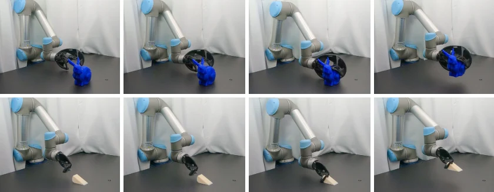 2022 · ACM TOG / SIGGRAPH 2022 · B · #21 **[Computational Design of Passive Grippers](https://arxiv.org/abs/2306.03174)** Milin Kodnongbua, Ian Good, Yu Lou, Jeffrey Lipton, Adriana Schulz 机构：University of Washington（PDF 首页） **被动抓手：几何与插入轨迹联合生成** 公开全文已取得 [Paper](https://arxiv.org/abs/2306.03174) · [PDF](https://arxiv.org/pdf/2306.03174) · [Project](https://homes.cs.washington.edu/~milink/passive-gripper/) · [图源](https://arxiv.org/html/2306.03174v1/teaser-fig.png) · [解读](#paper-21) 

中文摘要（展开）

本文提出一种面向被动抓手的新生成式设计工具。被动抓手是无需额外驱动、利用机械臂已有自由度执行抓取任务的机器人末端执行器。被动抓手在成本与能力之间提供了有价值的权衡，但现有设计能够抓取的形状类型有限。本文提出利用快速制造与设计优化，拓展可被被动抓取的形状空间。我们的新生成式设计算法以物体及其相对机械臂的位置为输入，生成能够稳定拾取该物体的可 3D 打印被动抓手。为此，我们解决了联合优化抓手形状与插入轨迹这一关键挑战，以确保被动稳定抓取。我们在包含 22 个物体的测试集上开展 23 次实验，全部通过物理实验评估，以弥合虚拟到真实的差距。代码与数据：https://homes.cs.washington.edu/~milink/passive-gripper/。

<a href="https://arxiv.org/abs/2306.03174">原摘要来源</a>

 | 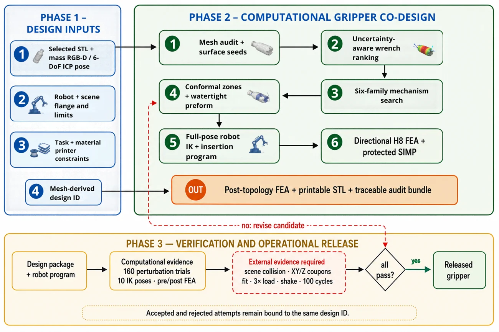 2026 · 出版社题录 · B · #22 **[Robot Aware Computational Design of Object Specific Passive Grippers for Additive Manufacturing](https://arxiv.org/abs/2609.03761)** Abdullah Yahya Abdullah Omaisan, Ibrahim Sheikh Mohamed 机构：QSS AI and Robotics Lab / Independent Researchers, Riyadh（PDF 首页） **机器人感知、IK、强度与拓扑同链评估** 公开全文已取得 [Paper](https://arxiv.org/abs/2609.03761) · [PDF](https://arxiv.org/pdf/2609.03761) · [图源](https://arxiv.org/html/2609.03761v1/figures/Flowchart.png) · [解读](#paper-22) 

中文摘要（展开）

本文提出一条端到端计算流程，将选定的物体网格、测得的物体状态与选定的六轴机器人，转换为对象专用、无驱动且可增材制造的抓手。该方法耦合了精确网格 RGB-D/ICP 位姿配准、确定性表面接触采样、考虑不确定性的力与力矩筛选、六种被动捕获机构的选择、贴合物体的表面合成、全朝向机器人逆运动学、考虑扫掠体积的制造域、具有方向性的熔融沉积有限元筛选，以及受约束的三维 SIMP 拓扑优化。与将抓取选择、工具几何、运动及结构设计视为独立问题的流程不同，每个导出的设计都通过可追溯的设计标识符，与源网格、物体位姿、机器人法兰、接触集和插入假设绑定。我们推导实现中的配准、接触、配合公差、有限元与密度优化方程，并证明数值构造的三项性质：节点载荷保持、SIMP 插值下柔顺度敏感性的单调性，以及拓扑后处理后的体素域包含性。四项已归档的对象专用设计尝试——兔子、相机法兰、3DBenchy 和多面体半身像——均通过标称配合、不确定力与力矩、运行时扫掠以及基线/拓扑优化后 FEA 检查。刻意扩大到 ±3 mm、±5 度的位姿压力检查区分了不同设计：160 次仿真试验中，各设计保留了 29–134 次通过试验。由于功能区域受到保护，重建拓扑保留了有限元（FE）域的 92.0–97.6%。归档的机器人照片定性展示了对应打印装配件，但材料属性采用标称值，且缺少试样标定和仪器化测试，因此四项设计均仍处于数字筛选状态，而非可投入运行的发布状态。

<a href="https://arxiv.org/abs/2609.03761">原摘要来源</a>

 | 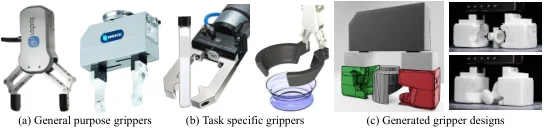 2020 · CoRL 2020（arXiv Comments） · B · #23 **[Fit2Form: 3D Generative Model for Robot Gripper Form Design](https://arxiv.org/abs/2011.06498)** Huy Ha, Shubham Agrawal, Shuran Song 机构：Columbia University（原文机构栏） **Fit2Form：生成目标物体对应的指形** 公开全文已取得 [Paper](https://arxiv.org/abs/2011.06498) · [PDF](https://arxiv.org/pdf/2011.06498) · [Project](https://fit2form.cs.columbia.edu/) · [图源](https://arxiv.org/html/2011.06498v1/GD_teaser_2.png) · [解读](#paper-23) 

中文摘要（展开）

机器人末端执行器的 3D 形状，对其功能与总体性能起着关键作用。许多工业应用依赖任务专用抓手设计，以确保系统鲁棒性与准确性。然而，人工硬件设计既昂贵又耗时，设计质量依赖工程师的经验和领域知识，而这些知识很容易过时或不准确。本研究旨在利用机器学习算法，自动设计任务专用抓手手指。我们提出 Fit2Form，一种 3D 生成式设计框架，为目标抓取物体生成成对指形，以最大化抓取成功、稳定性和鲁棒性等设计目标。我们训练一个 Fitness 网络，预测成对抓手手指及对应抓取物体的设计目标值，以此建模这些目标。随后，Fitness 网络为一个 3D Generative 网络提供监督，使其为目标物体生成成对的 3D 手指几何。实验表明，相较其他通用及任务专用抓手设计算法，本框架生成的平行夹爪指形能够实现更稳定、更鲁棒的抓取。视频：https://youtu.be/utKHP3qb1bg。

<a href="https://arxiv.org/abs/2011.06498">原摘要来源</a>

 |
| 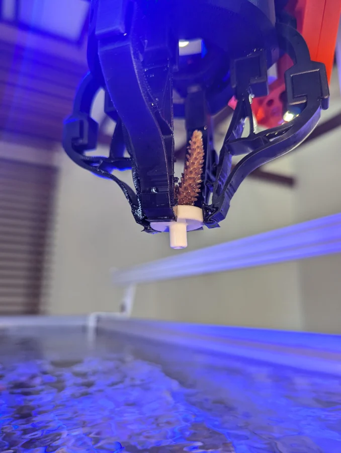 2026 · arXiv 预印本 · B · #24 **[ReefFlex: A Generative Design Framework for Soft Robotic Grasping of Organic and Fragile objects](https://arxiv.org/abs/2602.08285)** Josh Pinskier, Sarah Baldwin, Stephen Rodan, David Howard 机构：CSIRO Robotics / CHARM / Beyond Coral Foundation（原文机构栏） **ReefFlex：为珊瑚安全抓取生成软指** 公开全文已取得 [Paper](https://arxiv.org/abs/2602.08285) · [PDF](https://arxiv.org/pdf/2602.08285) · [图源](https://arxiv.org/html/2602.08285v1/images/LiveCoralGipped.jpg) · [解读](#paper-24) 

中文摘要（展开）

气候变化、入侵物种与人类活动正以前所未有的速度破坏全球珊瑚礁，威胁其丰富的生物多样性和渔业资源，并削弱沿海防护能力。解决这一重大挑战需要可扩展的珊瑚再生技术，以培育适应气候变化的物种并加速自然再生；但缺乏安全、鲁棒的脆弱珊瑚操作工具阻碍了这些行动。我们研究 ReefFlex，一种生成式软体手指设计方法，探索多样化软指空间，生成能够在杂乱环境中安全抓取脆弱且几何各异的珊瑚的候选设计。关键思想是将异质抓取编码为少量运动原语，从而形成简化且可求解的多目标优化问题。为评估该方法，我们设计一台用于珊瑚礁修复的软体机器人，在陆地水产养殖设施中培养和操作珊瑚，供未来移植到珊瑚礁。我们展示了相较参考设计，ReefFlex 提高了抓取成功率与抓取质量（抗扰动能力、定位准确性），并减少珊瑚操作中发生的不利事件。ReefFlex 提供一种可泛化的软体末端执行器设计方法，用于复杂操作，并为珊瑚修复操作等此前难以实现的领域自动化铺平道路。

<a href="https://arxiv.org/abs/2602.08285">原摘要来源</a>

 | 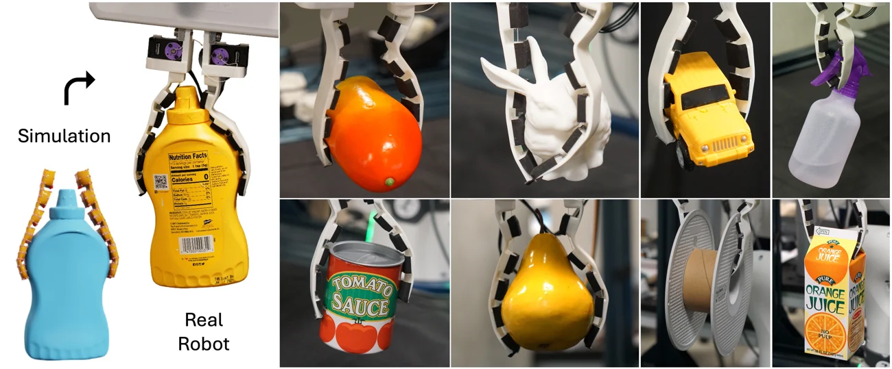 2025 · arXiv 预印本 · B · #25 **[Co-Design of Soft Gripper with Neural Physics](https://arxiv.org/abs/2505.20404)** Sha Yi, Xueqian Bai, Adabhav Singh, Jianglong Ye, Michael T Tolley, Xiaolong Wang 机构：affiliation 未确认 **神经物理联合优化刚度和抓姿** 公开全文已取得 [Paper](https://arxiv.org/abs/2505.20404) · [PDF](https://arxiv.org/pdf/2505.20404) · [Project](http://yswhynot.github.io/codesign-soft/) · [图源](https://arxiv.org/html/2505.20404v3/img/teaser.jpg) · [解读](#paper-25) 

中文摘要（展开）

对于机器人操作，控制器与末端执行器设计都至关重要。软体抓手能够通过形变适应不同几何形状，具有泛化能力，但设计这类抓手并寻找其抓取位姿仍具有挑战。本文提出一个协同设计框架，利用在仿真中训练的神经物理模型，生成优化后的软体抓手分块刚度分布及抓取位姿。我们为基于柔性铰链的软指推导均匀压力肌腱模型，随后通过随机化抓手位姿与设计参数生成多样化数据集。我们训练神经网络近似该前向仿真，得到快速、可微的代理模型，并将其嵌入端到端优化闭环，以优化理想刚度配置与最佳抓取位姿。最后，我们通过改变结构参数，3D 打印出具有不同刚度的优化抓手。我们展示了协同设计抓手在仿真与硬件实验中均显著优于基线设计。更多信息：http://yswhynot.github.io/codesign-soft/。

<a href="https://arxiv.org/abs/2505.20404">原摘要来源</a>

 | 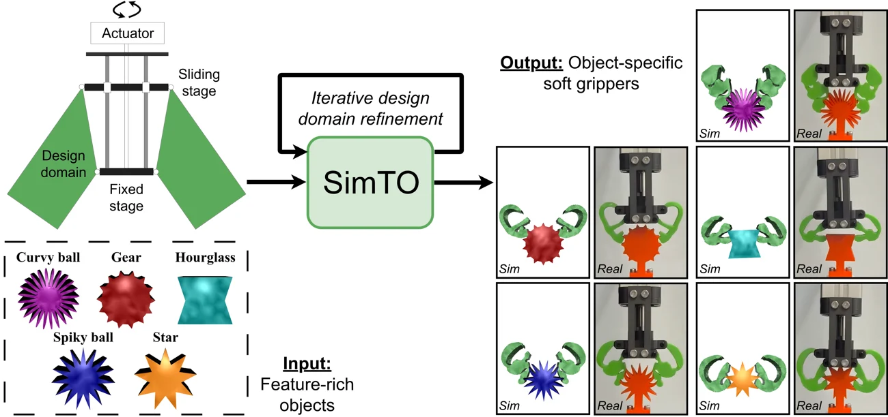 2026 · Structural and Multidisciplinary Optimization · B · #26 **[SimTO: A two-stage, simulation-driven topology optimization framework for bespoke soft robotic grippers](https://arxiv.org/abs/2601.19098)** Kurt Enkera, Josh Pinskier, Marcus Gallagher, David Howard 机构：CSIRO Robotics / University of Queensland（原文机构栏） **SimTO：先模拟接触，再做拓扑优化** 公开全文已取得 [Paper](https://arxiv.org/abs/2601.19098) · [PDF](https://arxiv.org/pdf/2601.19098) · [Project](https://kurtenkera.github.io/SimTO/) · [Data](https://github.com/kurtenkera/SimTO-Dataset) · [图源](https://arxiv.org/html/2601.19098v2/fig1.png) · [解读](#paper-26) 

中文摘要（展开）

软体机器人抓手对于制造业、医疗与农业中抓取脆弱且几何复杂的物体至关重要。然而，现有设计难以抓取具有丰富细节且拓扑变化大的物体，例如汽车装配线中具有尖锐齿形的齿轮、带脆弱突起的珊瑚，以及西兰花这类具有不规则分枝结构的蔬菜。与立方体或球体等简单几何体不同，细节丰富的物体没有明确的“最优”接触表面，因此既难抓取，也容易受损。安全操作这类物体，需要形态贴合其特征的专用软体抓手。拓扑优化是一种有前景的专用抓手生成方法，但需要预定义载荷工况，限制了其实用性。对于软体抓手，载荷来自抓取过程中数百个不可预测的抓手—物体接触力，事先并不知道。为解决这一问题，我们提出 SimTO，一种两阶段、仿真驱动的拓扑优化框架：先从动态、接触密集的抓取仿真中自动提取载荷工况，再执行经典拓扑优化，消除人工指定载荷的需求。给定任意细节丰富的物体，SimTO 生成高度定制的软体抓手，其精细形态特征针对物体几何进行适配。物理实验确认，相较常规拓扑优化方法生成的通用设计，这些专用抓手能实现更大的抓取力；数值实验则表明，它们在不同物体位姿下具有较高抓取成功率，并能良好泛化到一组未见物体。

<a href="https://arxiv.org/abs/2601.19098">原摘要来源</a>

 |
| 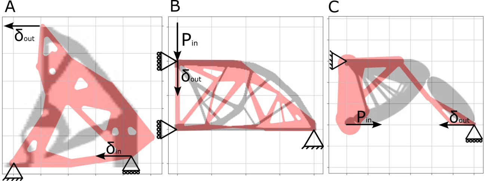 2026 · arXiv 预印本 · B · #27 **[Graph-Based Design of Soft Grippers with Multi-Objective Quality-Diversity Optimisation](https://arxiv.org/abs/2609.20087)** Andre Farinha, Ge Shi, Harry Bowman, Brendan Tidd, David Howard, Josh Pinskier 机构：CSIRO Robotics（原文机构栏） **图表示 + 多目标质量多样性** 公开全文已取得 [Paper](https://arxiv.org/abs/2609.20087) · [PDF](https://arxiv.org/pdf/2609.20087) · [图源](https://arxiv.org/html/2609.20087v1/Figs/fig_topo.png) · [解读](#paper-27) 

中文摘要（展开）

对多样物体进行有效操作，对于从农业采收到实验室及家庭自动化的各类应用至关重要。软体机器人的固有柔顺性适合应对这一挑战，但连续介质力学的设计空间庞大，且容易对特定场景过拟合，使跨任务泛化的抓手设计仍很困难。我们提出一个表示软体结构与机构的图设计空间，并结合多目标、多样性驱动的遗传优化框架，在整个设计过程中显式鼓励解的多样性。通过在优化中使用多种抓取场景，我们研究任务多样性如何影响对未见物体与接触条件的泛化能力的涌现。结果表明，在足够多样的抓取案例上优化，可以得到具有涌现泛化能力的设计；在新场景中，相较任务专用方案，它们展现出更高鲁棒性。这些发现表明，多样性驱动的优化为通用软体抓手提供了一条有原则的方法路径，与软体机器人的适应性特征相契合。

<a href="https://arxiv.org/abs/2609.20087">原摘要来源</a>

 | 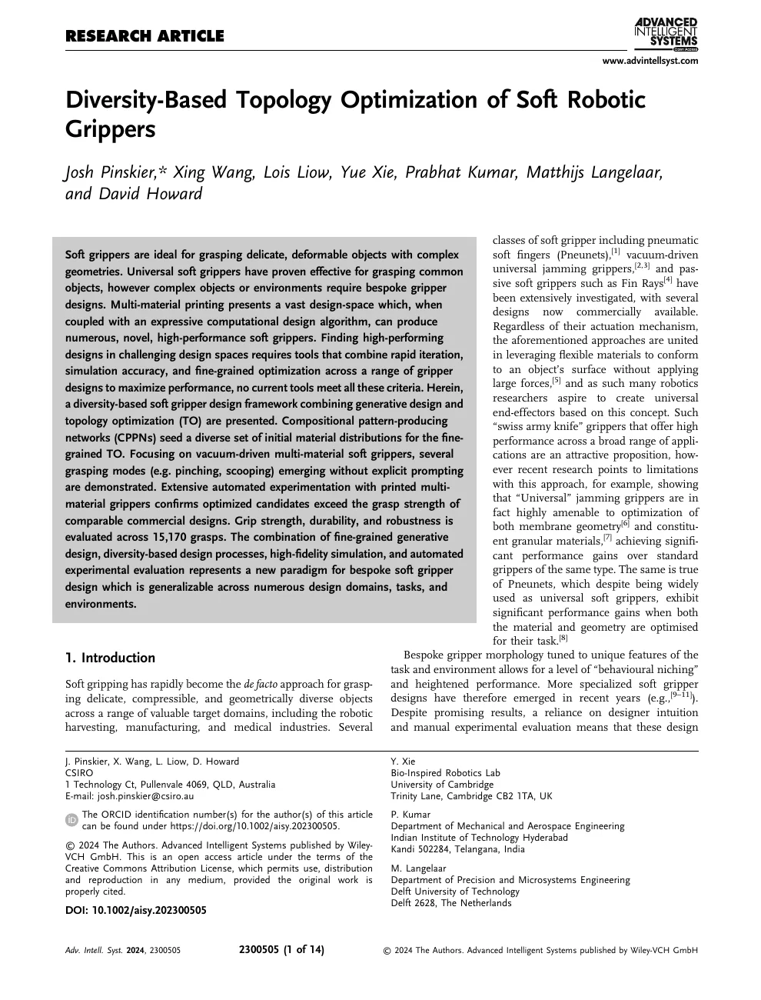 2024 · Advanced Intelligent Systems · B · #28 **[Diversity‐Based Topology Optimization of Soft Robotic Grippers](https://doi.org/10.1002/aisy.202300505)** Josh Pinskier, Xing Wang, Lois Liow, Yue Xie, Prabhat Kumar, Matthijs Langelaar, David Howard 机构：affiliation 未确认 **多样性拓扑优化：发现不同抓取模式** 公开全文已取得 [Paper](https://doi.org/10.1002/aisy.202300505) · [PDF](https://www.repository.cam.ac.uk/bitstreams/d7651e1d-d58b-457a-9021-e398bc2948b3/download) · [图源](https://www.repository.cam.ac.uk/bitstreams/d7651e1d-d58b-457a-9021-e398bc2948b3/download) · [解读](#paper-28) 

中文摘要（展开）

软体抓手非常适合抓取具有复杂几何形状的脆弱、可变形物体。通用软体抓手已被证明能够有效抓取常见物体，但复杂物体或环境需要定制设计。多材料打印提供了庞大的设计空间，与表达能力强的计算设计算法相结合，可以生成大量新颖、高性能的软体抓手。在具有挑战性的设计空间中寻找高性能设计，需要同时具备快速迭代、准确仿真以及针对多种抓手设计的精细优化能力，以最大化性能；目前没有工具能够满足全部条件。本文提出一种基于多样性的软体抓手设计框架，结合生成式设计与拓扑优化（TO）。组合模式生成网络（CPPN）产生多样化初始材料分布，供精细拓扑优化进一步处理。以真空驱动的多材料软体抓手为对象，我们展示了未经显式提示即可涌现的多种抓取模式，如捏取和铲取。对打印的多材料抓手开展的大量自动实验确认，优化候选的抓取强度超过可比的商用设计。我们通过 15,170 次抓取评估抓取强度、耐久性与鲁棒性。精细生成式设计、多样性设计过程、高保真仿真与自动实验评估的结合，构成定制软体抓手设计的新范式，并可推广到多种设计领域、任务和环境。

<a href="https://api.crossref.org/works/10.1002%2Faisy.202300505">原摘要来源</a>

 | 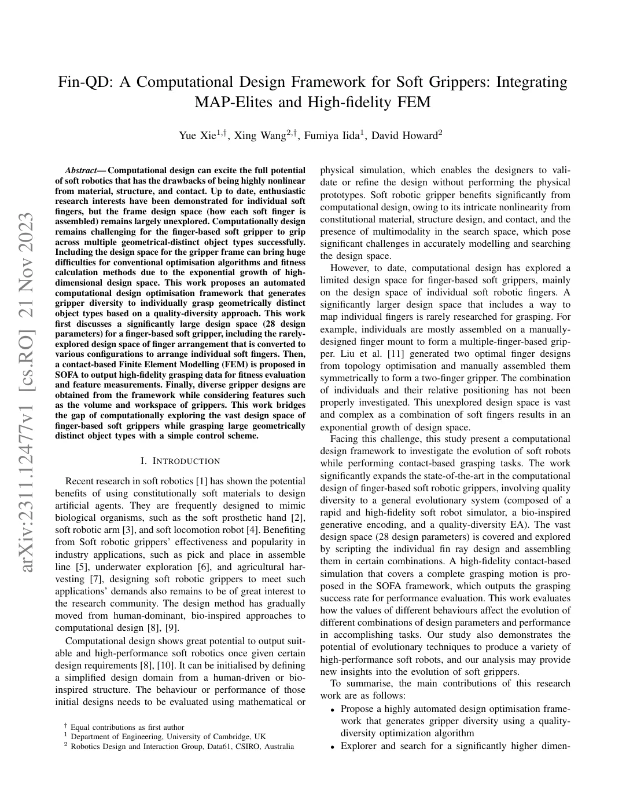 2024 · 2024 IEEE 7th International Conference on Soft Robotics (RoboSoft) · B · #29 **[Fin-QD: A Computational Design Framework for Soft Grippers: Integrating MAP-Elites and High-fidelity FEM](https://arxiv.org/abs/2311.12477)** Yue Xie, Xing Wang, Fumiya Iida, David Howard 机构：University of Cambridge / CSIRO（PDF 首页） **Fin-QD：高保真 FEM 与 MAP-Elites** 公开全文已取得 [Paper](https://arxiv.org/abs/2311.12477) · [PDF](https://arxiv.org/pdf/2311.12477) · [图源](https://arxiv.org/pdf/2311.12477) · [解读](#paper-29) 

中文摘要（展开）

计算设计能够释放软体机器人的全部潜力；这类机器人同时受到材料、结构和接触高度非线性的影响。迄今，单个软指吸引了大量研究兴趣，但框架设计空间——即各软指如何组装——仍基本未被探索。要通过计算设计使基于手指的软体抓手成功抓取多种几何显著不同的物体，仍具有挑战。纳入抓手框架设计空间后，高维空间呈指数增长，给传统优化算法和适应度计算方法带来巨大困难。本文提出一种基于质量—多样性方法的自动计算设计优化框架，生成多样化抓手，分别抓取几何不同的物体类型。首先，我们讨论一个较大的、包含 28 个设计参数的软指抓手设计空间，其中包括很少被探索的手指排列空间，可转换为不同的单指配置。随后，我们在 SOFA 中提出基于接触的有限元建模（FEM），输出高保真抓取数据，用于适应度评估与特征测量。最后，框架在考虑抓手体积、工作空间等特征的同时获得多样化设计。本研究弥补了通过计算探索软指抓手巨大设计空间方面的空缺，并以简单控制方案抓取尺寸较大、几何显著不同的物体类型。

<a href="https://arxiv.org/abs/2311.12477">原摘要来源</a>

 |
| 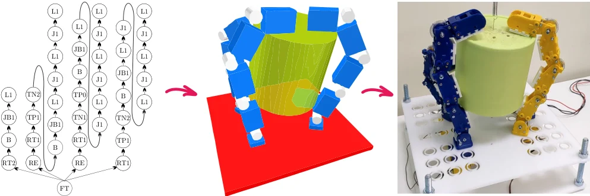 2024 · 2024 IEEE/RSJ International Conference on Intelligent Robots and Systems (IROS) · B · #30 **[Synergizing Morphological Computation and Generative Design: Automatic Synthesis of Tendon-Driven Grippers](https://arxiv.org/abs/2410.07865)** Kirill D. Zharkov, Mikhail E. Chaikovskii, Yefim V. Osipov, Rahaf Alshaowa, Ivan I. Borisov, Sergey A. Kolyubin 机构：ITMO University（原文机构栏） **图语法自动合成欠驱动腱驱抓手** 公开全文已取得 [Paper](https://arxiv.org/abs/2410.07865) · [PDF](https://arxiv.org/pdf/2410.07865) · [Code](https://github.com/aimclub/rostok) · [图源](https://arxiv.org/html/2410.07865v1/pic_1.png) · [解读](#paper-30) 

中文摘要（展开）

机器人的行为与性能同时由硬件和软件决定。机器人系统设计是包含多个阶段的复杂过程，需要同时处理往往彼此矛盾的多种标准，最终寻找能够协调冲突因素的最优解。生成式设计、计算设计或自动设计，都是旨在加速整个设计过程的范式。本文提出一种设计方法，为具有形态计算能力的机器人生成连杆机构。我们使用图语法与启发式搜索算法创建机器人机构图，再将其转换为仿真模型，以测试设计输出。为验证该方法，我们将其应用于相对简单的物体抓取准静态问题，找到了一种自动设计欠驱动肌腱驱动抓手的方法，使其能够抓取广泛的物体。这一能力来自抓手结构，而非复杂规划或学习。

<a href="https://arxiv.org/abs/2410.07865">原摘要来源</a>

 | 原文配图暂未取得，保留已核对的文字卡片。 2025 · IEEE Robotics and Automation Letters · B · #31 **[Computational Design of Customized Vacuum-Driven Soft Grippers](https://doi.org/10.1109/lra.2024.3523203)** Jiayi Jin, Siyuan Feng, Shuguang Li 机构：affiliation 未确认 **为物体定制真空驱动软抓手** 题录 / 摘要已核对 [Paper](https://doi.org/10.1109/lra.2024.3523203) · [解读](#paper-31) 

中文摘要（展开）

软体抓手因其被动柔顺性、不需要精确力控制以及对不同物体形状的高适应性，而越来越受到青睐。以往软体抓手大多为通用设计；与之不同，我们提出一个使用特定类型真空驱动气动执行器、对定制软体抓手进行计算设计与快速制造的框架。算法能够自动生成优化抓手设计的可 3D 打印模型，随后以低成本快速制造抓手。抓取实验表明，该框架能够为具有不同几何形状的日常物体定制抓手。结果还显示，框架能够扩展到为多个物体或较重物体定制抓手。该框架支持快速设计和制造针对特定任务优化的抓手，同时保持处理不同物体的通用性。

<a href="https://api.openalex.org/works/W4405812030">原摘要来源（OpenAlex 索引）</a>

 | 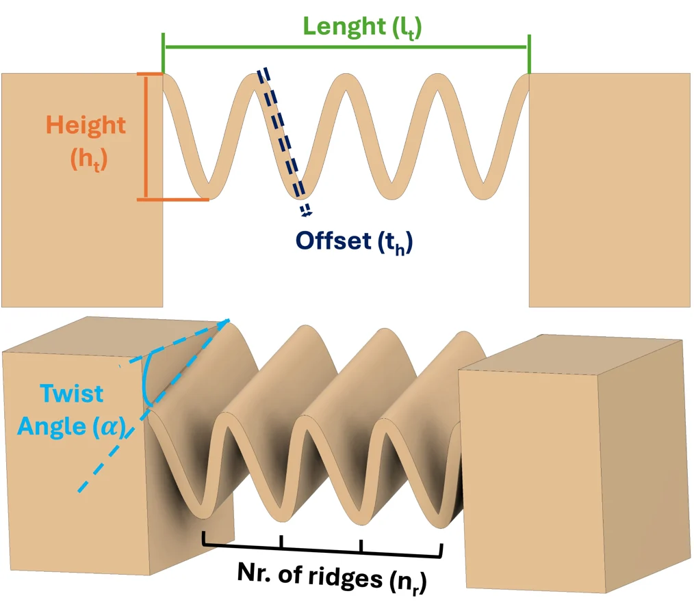 2024 · arXiv 预印本 · B · #32 **[Optimization-Driven Design of Monolithic Soft-Rigid Grippers](https://arxiv.org/abs/2412.07556)** Pierluigi Mansueto, Mihai Dragusanu, Anjum Saeed, Monica Malvezzi, Matteo Lapucci, Gionata Salvietti 机构：University of Florence / University of Siena（原文机构栏） **软硬一体抓手的优化设计** 公开全文已取得 [Paper](https://arxiv.org/abs/2412.07556) · [PDF](https://arxiv.org/pdf/2412.07556) · [图源](https://arxiv.org/html/2412.07556v1/Fig1.jpg) · [解读](#paper-32) 

中文摘要（展开）

由于 3D 打印和模塑等常见制造过程带来不可预测性，仿真到真实迁移仍是软体机器人中的重大挑战。这些过程往往导致实物偏离仿真设计，需要制作多个原型才能获得可用系统。本研究提出一种新方法，将先进快速成型技术与高效优化策略结合，以解决这些限制。首先，我们使用通常用于刚性结构的快速成型方法，借助其精度制造柔顺部件，减少制造误差。其次，我们的优化框架尽量减少大量原型试制的需求，显著缩短迭代设计过程。该方法能够找到在当前制造能力下更实际、更可实现的刚度参数。所提方法显著提高了原型开发效率，同时保持所需性能特征。本研究向弥合软体机器人仿真到真实差距迈出一步，为更快速、更可靠地部署软体机器人系统铺平道路。

<a href="https://arxiv.org/abs/2412.07556">原摘要来源</a>

 |
| 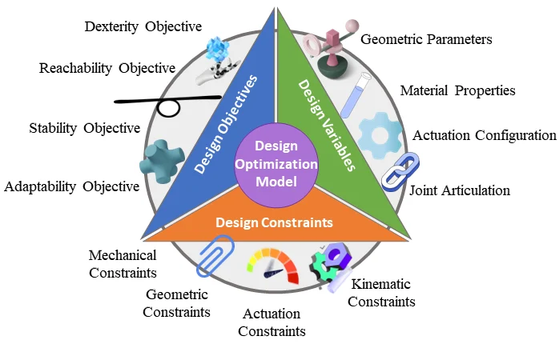 2024 · arXiv 预印本 · B · #33 **[Hierarchical Performance-Based Design Optimization Framework for Soft Grippers](https://arxiv.org/abs/2411.06294)** Hamed Rahimi Nohooji, Holger Voos 机构：University of Luxembourg（原文机构栏） **任务—运动—设计三层优化** 公开全文已取得 [Paper](https://arxiv.org/abs/2411.06294) · [PDF](https://arxiv.org/pdf/2411.06294) · [图源](https://arxiv.org/html/2411.06294v2/OptModel.png) · [解读](#paper-33) 

中文摘要（展开）

本文提出一个基于性能的分层多指软体抓手设计优化框架。为满足系统定义性能指标的需求，该框架将优化过程组织为三个相互集成的层级：任务空间、运动空间与设计空间。在任务空间中，将性能指标定义为核心目标；运动空间将这些目标解释为具体运动原语；最后，设计空间应用参数优化与拓扑优化技术，细化系统的几何形状与材料分布，在关键性能指标之间实现平衡设计。框架的分层结构改善了软体抓手（SG）设计，确保性能均衡及对复杂任务的可扩展性，并为软体机器人领域更广泛的发展作出贡献。

<a href="https://arxiv.org/abs/2411.06294">原摘要来源</a>

 | 原文配图暂未取得，保留已核对的文字卡片。 2023 · IEEE Robotics &amp;amp; Automation Magazine · B · #34 **[Automatic Gripper-Finger Design, Production, and Application: Toward Fast and Cost-Effective Small-Batch Production](https://doi.org/10.1109/mra.2023.3269404)** Johannes Ringwald, Shaochuan Zong, Abdalla Swikir, Sami Haddadin 机构：affiliation 未确认 **自动设计、生产和测试指尖** 题录 / 摘要已核对 [Paper](https://doi.org/10.1109/mra.2023.3269404) · [解读](#paper-34) 

中文摘要（展开）

基于触觉机器人的装配线对新产品的适应，仍受到末端执行器配置需要人工重新设计、制造与更换的限制，因为抓手手指往往必须适配产品部件几何，才能确保装配成功。本文提出一条自动手指设计、生产与评估流程，以改善这一适应过程。我们实现了两种基于形封闭的设计原则，自动生成指尖几何：基于投影表面表示的方法，以及 Bézier 曲面拟合策略。得到的指尖由自动生产单元打印，再通过针对三种操作物体的拾取与插入任务进行实验评估。为展示所引入设计方法用于机器学习指尖设计的潜力，我们还建立了一个基于神经网络的设计方法的训练与测试过程。所提出的自动指尖设计、生产与应用框架显著改善了装配适应工作量、灵活性和可扩展性，因此进一步推动了小批量生产。

<a href="https://api.openalex.org/works/W4376851361">原摘要来源（OpenAlex 索引）</a>

 | 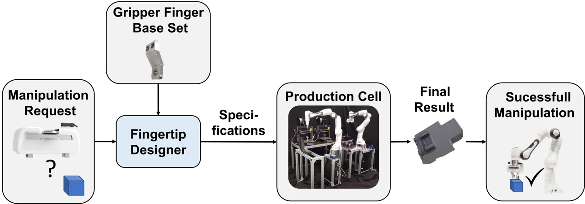 2022 · arXiv 预印本 · B · #35 **[Towards Task-Specific Modular Gripper Fingers: Automatic Production of Fingertip Mechanics](https://arxiv.org/abs/2210.10015)** Johannes Ringwald, Samuel Schneider, Lingyun Chen, Dennis Knobbe, Lars Johannsmeier, Abdalla Swikir, Sami Haddadin 机构：affiliation 未确认 **模块化指尖机械件自动生产** 公开全文已取得 [Paper](https://arxiv.org/abs/2210.10015) · [PDF](https://arxiv.org/pdf/2210.10015) · [图源](https://arxiv.org/html/2210.10015v1/Figures/Automatic-Finger-Design-and-Production-Pipeline_v2-02.jpg) · [解读](#paper-35) 

中文摘要（展开）

单个抓手能够完成的连续任务数量，在很大程度上受到其设计限制。许多情况下，需要更换抓手手指才能成功执行多个连续任务。为此，已有多种机器人换工具系统能够自动更换整个末端执行器。然而，很多场景只需修改或更换指尖，更换整个抓手并不经济。本文提出一种自动生产任务专用指尖的范式。所用系统包含生产与任务执行单元，其中有一台机器人机械臂和两台自主生产抓手手指的 3D 打印机；另有第二台机械臂，利用快速更换机构拾取打印好的指尖并评估抓取性能。我们自动生产三种不同指尖，开展抓取稳定性测试，以及带有和不带有位置偏移的多次拾取、插入任务，以实验验证系统。这一范式超越了单纯指尖生产，为完全自动的指尖设计、生产与应用流程提供基础，有望改善制造灵活性，并代表一种新的生产范式：触觉 3D 制造。

<a href="https://arxiv.org/abs/2210.10015">原摘要来源</a>

 |
| 原文配图暂未取得，保留已核对的文字卡片。 2022 · CIRP Annals · B · #36 **[Automatic simulation-based design and validation of robotic gripper fingers](https://doi.org/10.1016/j.cirp.2022.04.054)** Aswin K Ramasubramanian, Matthew Connolly, Robins Mathew, Nikolaos Papakostas 机构：affiliation 未确认 **CAD 与物理仿真循环改造手指** 公开全文已取得 [Paper](https://doi.org/10.1016/j.cirp.2022.04.054) · [PDF](https://www.sciencedirect.com/science/article/pii/S0007850622001007/pdf) · [PDF](https://zenodo.org/api/records/7233391/files/1-s2.0-S0007850622001007-main.pdf/content) · [解读](#paper-36) 

中文摘要（展开）

机器人抓手手指的设计是一个复杂过程，往往需要投入大量精力和时间。本文研究一种方法，自动生成抓手手指设计的新迭代版本，并在仿真环境中验证其性能。我们使计算机辅助设计（CAD）软件平台与基于物理的仿真框架协同工作，对初始手指设计进行重新设计与验证，旨在减少物理验证所需的总体时间与成本。所提方法在一个真实机器人案例场景中，通过一系列抓放任务得到验证。

<a href="https://api.openalex.org/works/W4281774516">原摘要来源（OpenAlex 索引）</a>

 | 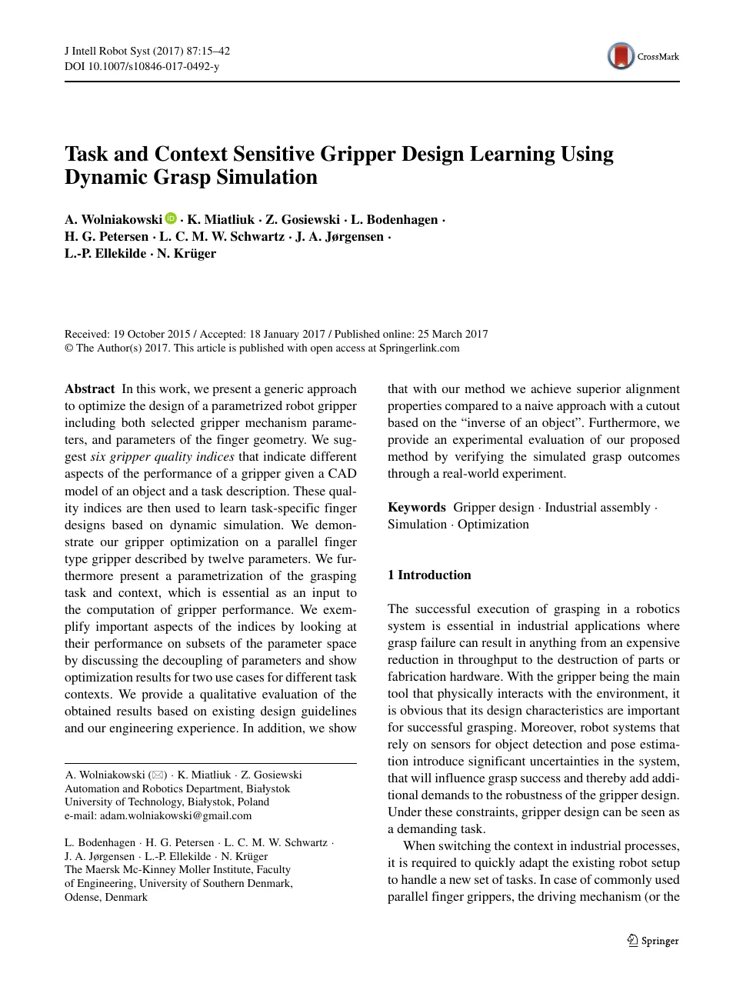 2017 · Journal of Intelligent &amp;amp; Robotic Systems · B · #37 **[Task and Context Sensitive Gripper Design Learning Using Dynamic Grasp Simulation](https://doi.org/10.1007/s10846-017-0492-y)** A. Wolniakowski, K. Miatliuk, Z. Gosiewski, L. Bodenhagen, H. G. Petersen, L. C. M. W. Schwartz, J. A. Jørgensen, L.-P. Ellekilde, N. Krüger 机构：affiliation 未确认 **动态仿真驱动任务敏感抓手设计** 公开全文已取得 [Paper](https://doi.org/10.1007/s10846-017-0492-y) · [PDF](https://link.springer.com/content/pdf/10.1007/s10846-017-0492-y.pdf) · [图源](https://link.springer.com/content/pdf/10.1007/s10846-017-0492-y.pdf) · [解读](#paper-37) 

中文摘要（展开）

本文提出一种通用方法，优化参数化机器人抓手的设计，其中同时包含选定的抓手机构参数与手指几何参数。给定物体 CAD 模型和任务描述，我们提出六个抓手质量指标，衡量抓手性能的不同方面，并利用这些指标基于动态仿真学习任务专用指形。我们以由十二个参数描述的平行指式抓手展示优化过程。此外，我们给出抓取任务与上下文的参数化表示，它们是计算抓手性能必不可少的输入。通过考察指标在参数空间子集中的表现、讨论参数解耦，我们展示指标的重要性质，并给出两个不同任务上下文用例的优化结果。我们基于已有设计准则和工程经验，对所得结果进行定性评估。同时，本方法相较依据“物体反形”直接切出凹槽的朴素方法，实现了更好的对齐性能。最后，我们通过真实实验验证仿真中的抓取结果，对所提方法开展实验评估。

<a href="https://link.springer.com/content/pdf/10.1007/s10846-017-0492-y.pdf">原摘要来源</a>

 | 原文配图暂未取得，保留已核对的文字卡片。 2018 · 2018 23rd International Conference on Methods &amp;amp; Models in Automation &amp;amp; Robotics (MMAR) · B · #38 **[Efficient Evaluation and Optimization of Automated Gripper Finger Design for Industrial Robotic Applications](https://doi.org/10.1109/mmar.2018.8485897)** A. Kapilavai, A. Wolniakowski, T. Bo Jorgensen, A. P. Lindvig, T. R. Savarimuthu, N. Kruger 机构：affiliation 未确认 **自动指形设计的评估效率** 题录 / 摘要已核对 [Paper](https://doi.org/10.1109/mmar.2018.8485897) · [解读](#paper-38) 

中文摘要（展开）

抓手手指设计是工业机器人领域当前的重要问题。近期研究已取得进展，用基于动态仿真的优化方法替代费力的人工试错设计。在这类方法中，抓手手指被参数化，通过仿真多组抓取进行评估，得到随后用于优化的质量分数。该过程的计算效率取决于：（1）能以最少抓取次数提供鲁棒评估的评分函数选择；（2）能够快速收敛到全局最优的优化算法选择；以及（3）优化方法及其元参数选择。本文讨论这三个问题。我们使用此前提出的手指设计与优化方法，为工业装配任务中使用的非对称物体生成手指凹槽。我们提出两个新的对齐质量分数，并与已有方法比较效率。此外，我们比较两种优化方法（一个局部方法、一个全局方法）的性能，并为局部方法确定元参数。

<a href="https://api.openalex.org/works/W2895953229">原摘要来源（OpenAlex 索引）</a>

 |
| 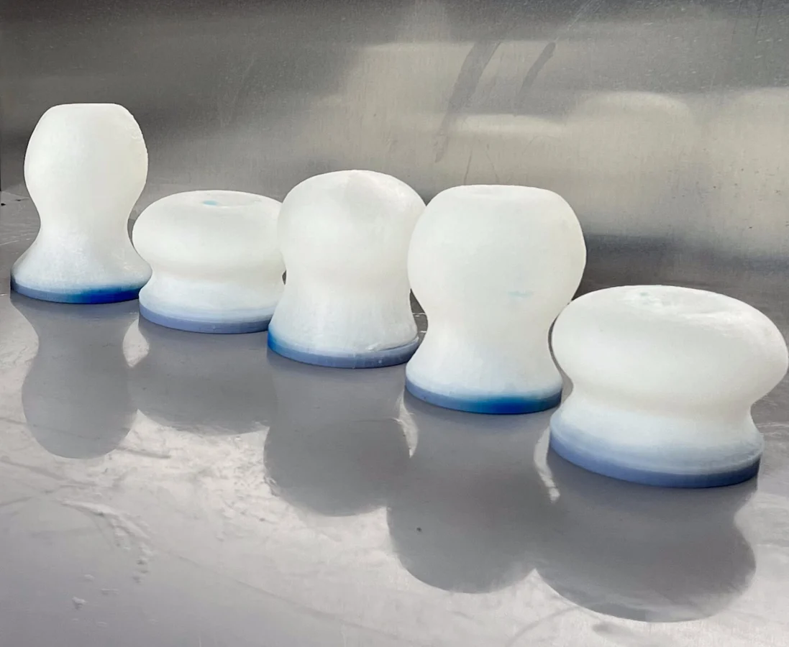 2021 · arXiv 预印本 · B · #39 **[Getting a Grip: in Materio Evolution of Membrane Morphology for Soft Robotic Jamming Grippers](https://arxiv.org/abs/2111.01952)** David Howard, Jack O'Connor, Jordan Letchford, James Brett, Therese Joseph, Sophia Lin, Daniel Furby, Gary W. Delaney 机构：CSIRO / University of Queensland（原文机构栏） **用真实试验进化颗粒阻塞抓手** 公开全文已取得 [Paper](https://arxiv.org/abs/2111.01952) · [PDF](https://arxiv.org/pdf/2111.01952) · [图源](https://arxiv.org/html/2111.01952v1/5grips.jpg) · [解读](#paper-39) 

中文摘要（展开）

颗粒阻塞在软体机器人中的应用是一项新近且有前景的技术，为创造性能更高的机器人装置提供了令人期待的可能性。颗粒阻塞通过对装有颗粒物质的膜内部施加真空压力实现。从设计角度看，它尤其有吸引力，因为大量设计参数可以用于诱导多样且有用的行为。迄今，颗粒形状、尺寸及膜材料等变量对定制抓取性能的影响已被研究，但另一个主要因素——膜形态——由于准确建模与制造都特别复杂，尚未得到研究。本文首次研究颗粒阻塞抓手的膜形态优化，将多材料 3D 打印与进化算法结合，在真实材料中搜索多样化形态设计空间。每一整代设计在一次打印中完成，随后测试抓手保持力并将其用作适应度。本方法具有较好的可扩展性，无需建模，并能确保所考察抓手的真实世界性能。结果表明，膜形态是抓手性能的关键决定因素。常见高性能设计会优化颗粒抓手产生抓取力的三种主要已识别机制，明显不同于标准抓手形态，并能良好泛化到一系列测试物体。

<a href="https://arxiv.org/abs/2111.01952">原摘要来源</a>

 | 原文配图暂未取得，保留已核对的文字卡片。 2022 · IEEE/ASME Transactions on Mechatronics · B · #40 **[LARG: A Lightweight Robotic Gripper With 3-D Topology Optimized Adaptive Fingers](https://doi.org/10.1109/tmech.2022.3170800)** Yilun Sun, Yuqing Liu, Felix Pancheri, Tim C. Lueth 机构：affiliation 未确认 **LARG：三维拓扑优化自适应手指** 题录 / 摘要已核对 [Paper](https://doi.org/10.1109/tmech.2022.3170800) · [解读](#paper-40) 

中文摘要（展开）

自适应抓取是机器人抓手处理不规则形状物体的重要方式。相较基于刚性连杆的自适应抓手，连续结构抓手受益于结构柔顺性，因而具有更高的自适应抓取自由度。基于这一优势，本文开发一种基于连续结构的双指抓手，实现自适应抓取。为提高设计效率，我们采用基于三维拓扑优化的设计方法，通过在设计问题中加入额外弹簧，实现机器人手指的自适应抓取功能。所提抓手使用聚酰胺（PA2200）材料，通过选择性激光烧结制造，由直线电机驱动。我们还通过实验评估抓手的抓取性能与承载能力。结果表明，抓手能够成功抓取不同形状与材料的物体。此外，抓手总重仅为 180 g，却能达到 8.8 kg 的最大抓取载荷，约为自身重量的 49 倍。从方法论角度，本研究成功展示了基于优化的机器人抓手自动设计的可行性。

<a href="https://api.openalex.org/works/W4285263620">原摘要来源（OpenAlex 索引）</a>

 | 原文配图暂未取得，保留已核对的文字卡片。 2021 · 2021 IEEE/RSJ International Conference on Intelligent Robots and Systems (IROS) · B · #41 **[Computational Design of Reconfigurable Underactuated Linkages for Adaptive Grippers](https://doi.org/10.1109/iros51168.2021.9636792)** Ivan I. Borisov, Evgenii E. Khomutov, Sergey A. Kolyubin, Stefano Stramigioli 机构：affiliation 未确认 **欠驱动连杆的结构与参数合成** 题录 / 摘要已核对 [Paper](https://doi.org/10.1109/iros51168.2021.9636792) · [解读](#paper-41) 

中文摘要（展开）

本文提出一种基于优化的结构—参数综合方法，为与环境发生物理交互的机器人系统设计可重构闭链欠驱动连杆机构，重点关注自适应抓取。关键思想是利用形态计算概念和可变长度连杆（VLL），同时保留必要的轨迹专用完整约束与机构适应性，并在满足既定设计要求的过程中，将全驱动系统演化为欠驱动系统。该方法能够最小化驱动器数量、重量与成本，同时保持肌腱驱动设计难以达到的高载荷和耐久性。尽管方法具有足够的通用性，为清晰起见，我们通过多个自适应抓手手指机构展示其用法。

<a href="https://api.openalex.org/works/W4200058032">原摘要来源（OpenAlex 索引）</a>

 |
| 原文配图暂未取得，保留已核对的文字卡片。 2024 · Procedia CIRP · B · #42 **[Robot-based, sensitive mating of electrical connectors using automatically designed gripper jaws](https://doi.org/10.1016/j.procir.2024.10.176)** Daniel Gebauer, Alexander Roith, Jonas Dirr, Rüdiger Daub 机构：affiliation 未确认 **自动夹爪设计与连接器装配** 题录 / 摘要已核对 [Paper](https://doi.org/10.1016/j.procir.2024.10.176) · [解读](#paper-42) 

中文摘要（展开）

设计合适的夹爪，对于自动完成电连接器插接等复杂装配任务至关重要。在以往工作中，我们为这类工件开发了一种方法，能够自动生成具有可参数化间隙的夹爪，这已被证明是实现鲁棒抓取的方式。由于抓取后的手内位姿存在不确定性，本文研究一种敏感连接策略能否补偿这种不确定性，以确保电连接器鲁棒插接。我们针对多种高压电连接器与间隙配置，开展了 600 次抓取测试和约 450 次插接测试。在大多数实验中，敏感连接策略能够补偿手内位姿不确定性。

<a href="https://api.openalex.org/works/W4404789579">原摘要来源（OpenAlex 索引）</a>

 | 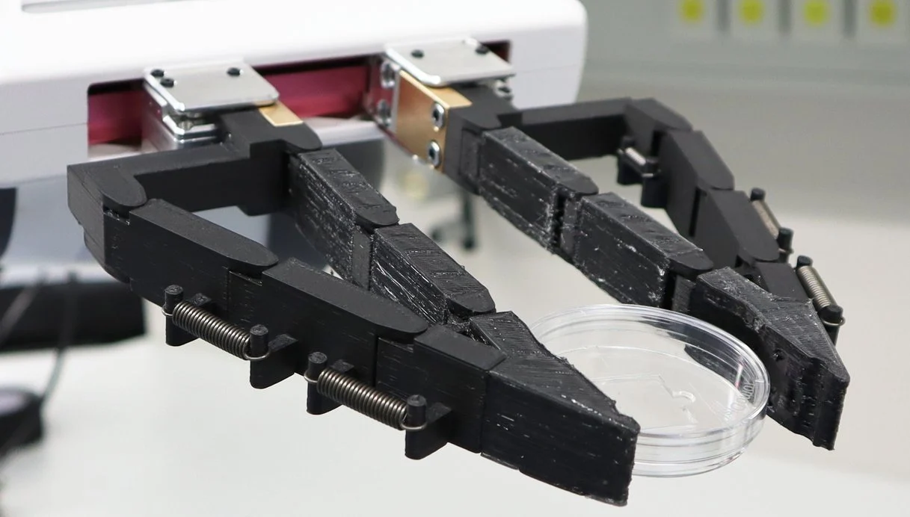 2023 · 2023 IEEE/RSJ International Conference on Intelligent Robots and Systems (IROS) · B · #43 **[Towards Flexible Biolaboratory Automation: Container Taxonomy-Based, 3D-Printed Gripper Fingers](https://arxiv.org/abs/2302.03644)** Henning Zwirnmann, Dennis Knobbe, Utku Culha, Sami Haddadin 机构：affiliation 未确认 **实验室容器分类驱动可打印指形** 公开全文已取得 [Paper](https://arxiv.org/abs/2302.03644) · [PDF](https://arxiv.org/pdf/2302.03644) · [图源](https://arxiv.org/html/2302.03644v2/graphics/finger.JPG) · [解读](#paper-43) 

中文摘要（展开）

生命科学研究实验室的自动化，是近年来日益重要的一种范式。现有机器人方案的能力范围往往有限，降低了接受度，并阻碍复杂工作流程的实现。机器人运输与操作实验室用品，是这一限制的典型表现。本文推导出生物实验室液体容器的分类体系，说明灵活抓取方案的必要性。以该分类体系为指导，我们为平行机器人抓手设计手指，使用集成刚性与软质材料的一体式双挤出 3D 打印，优化抓取性能。我们设计经过精细调整的指尖，使相关容器能够被稳定抓取。通过采用被动柔顺机构，保持简单驱动系统与低重量。耐化学品和耐高温能力，以及与工具更换系统的集成，使这些手指适合日常实验室使用和复杂流程。实验展示了手指能够处理的广泛容器类型、对位移的容忍性及抓取稳定性，验证了其任务适用性。

<a href="https://arxiv.org/abs/2302.03644">原摘要来源</a>

 | 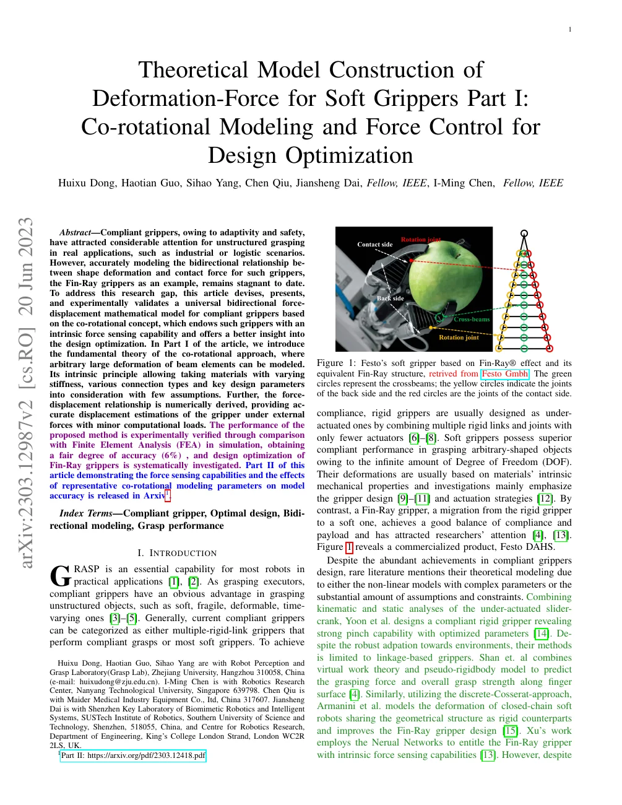 2023 · arXiv 预印本 · B · #44 **[Theoretical Model Construction of Deformation-Force for Soft Grippers Part I: Co-rotational Modeling and Force Control for Design Optimization](https://arxiv.org/abs/2303.12987)** Huixu Dong, Haotian Guo, Sihao Yang, Chen Qiu, Jiansheng Dai, I-Ming Chen 机构：affiliation 未确认 **软指力—形变模型支持设计优化** 公开全文已取得 [Paper](https://arxiv.org/abs/2303.12987) · [PDF](https://arxiv.org/pdf/2303.12987) · [图源](https://arxiv.org/pdf/2303.12987) · [解读](#paper-44) 

中文摘要（展开）

柔顺抓手因其适应性与安全性，在工业、物流等真实应用的非结构化抓取中受到广泛关注。然而，对这类抓手（如 Fin-Ray 抓手）形变与接触力之间双向关系的准确建模，至今仍进展有限。为弥补这一空缺，本文基于共旋转概念，设计、提出并通过实验验证一种适用于柔顺抓手的通用双向力—位移数学模型，赋予抓手内在力感知能力，并帮助深入理解设计优化。本文第一部分介绍共旋转方法的基础理论，能够建模梁单元的任意大形变。其内在原理允许在较少假设下，考虑不同刚度的材料、各种连接类型与关键设计参数。随后，我们通过数值方式推导力—位移关系，以较小计算负担准确估计外力作用下抓手的位移。我们通过与仿真有限元分析（FEA）比较，实验验证所提方法的性能，获得了相当程度的准确性（6%），并系统研究 Fin-Ray 抓手的设计优化。展示力感知能力及典型共旋转建模参数对模型准确性影响的第二部分，已发布于 arXiv。

<a href="https://arxiv.org/abs/2303.12987">原摘要来源</a>

 |
| 原文配图暂未取得，保留已核对的文字卡片。 2024 · Journal of Materials Research and Technology · B · #45 **[Characterization, generative design, and fabrication of a carbon fiber-reinforced industrial robot gripper via additive manufacturing](https://doi.org/10.1016/j.jmrt.2024.10.064)** Selim Hartomacıoğlu, Ersin Kaya, Beril Eker, Salih Dağlı, Murat Sarıkaya 机构：affiliation 未确认 **生成式设计与打印工艺联合研究** 题录 / 摘要已核对 [Paper](https://doi.org/10.1016/j.jmrt.2024.10.064) · [解读](#paper-45) 

中文摘要（展开）

机器人抓手是各类工业应用中的关键部件，需要专门设计与生产才能获得最佳性能。传统塑料注塑技术难以达到此类抓手所需的专用性。为解决这一挑战，本文采用新一代复合丝材碳纤维增强聚酰胺，并使用创新的生成式设计技术开发机器人抓手。我们首先表征并优化复合材料规格，随后基于打印参数评估标准试样的拉伸强度与断裂力学性能，并采用田口实验设计进行优化。我们使用方差分析（ANOVA）进行因素分析，以微调工艺；再通过生成式设计技术确定最优几何形状，并以熔融沉积成型（FDM）制造。优化带来显著改进：拉伸强度从 103.2 MPa 增至 116 MPa，弹性模量从 8386 MPa 增至 8990 MPa。在实际工业应用中，材料重量从 14 g 降至 4 g，生产成本从 5.16 美元降至 1.50 美元，生产时间从 58 分钟缩短至 28 分钟。本研究提出一种经过验证的工业产品开发方法，减少材料用量与成本，促进可持续生产实践。

<a href="https://api.openalex.org/works/W4403263786">原摘要来源（OpenAlex 索引）</a>

 |  |  |

### 逐篇中文要点

每篇把论文事实、证据边界和研究建议分开。`[事实]` 可追溯至链接中的论文或正式题录；`[边界]` 是依据当前读取范围做的证据判断；`[推断]` 是面向 Tool AutoDesign 的研究建议。没有给出实验数字的条目不补造数字。

#### 21. [Computational Design of Passive Grippers](https://arxiv.org/abs/2306.03174)

**被动抓手：几何与插入轨迹联合生成**  ·  B 类  ·  2022  ·  ACM TOG / SIGGRAPH 2022

- **[事实 · 方法]** 根据目标物体和相对机器人位姿生成无额外驱动的可打印抓手，联合优化抓手形状与插入轨迹。
- **[事实 · 证据]** 22 个物体、23 次实体实验，检验被动稳定抓取；正式论文为 SIGGRAPH 2022。
- **[边界]** 物体特定、依赖给定姿态；须测试定位误差、插入碰撞与抓取承载。
- **[推断 · 对本项目的启发]** 最适合作为机器人条件化抓手设计的几何—运动基线。

作者：Milin Kodnongbua, Ian Good, Yu Lou, Jeffrey Lipton, Adriana Schulz 
机构：University of Washington（PDF 首页） 
核验：已取得公开全文（HTML / PDF）；要点以摘要及可核对原文段落为依据。 
arXiv 首次上传：2023-06-05；编号 `2306.03174`。 
正式 / 出版记录 DOI：[10.1145/3528223.3530162](https://doi.org/10.1145/3528223.3530162)。 
[Paper](https://arxiv.org/abs/2306.03174) · [PDF](https://arxiv.org/pdf/2306.03174) · [Project](https://homes.cs.washington.edu/~milink/passive-gripper/) · [图源](https://arxiv.org/html/2306.03174v1/teaser-fig.png)

原文图说明与出处

Figure 1. We present an automated algorithm for designing passive grippers given a target object and its positioning. As our algorithm co-designs both the gripper shape and the insert trajectory, our approach broadens the space of shapes that can be passively grasped, compared to existing methods. The figure shows two of the 21 grippers (out of 23) that can successfully pick up the object in reality.

来源：[论文页面](https://arxiv.org/html/2306.03174) · [图 / PDF](https://arxiv.org/html/2306.03174v1/teaser-fig.png)

#### 22. [Robot Aware Computational Design of Object Specific Passive Grippers for Additive Manufacturing](https://arxiv.org/abs/2609.03761)

**机器人感知、IK、强度与拓扑同链评估**  ·  B 类  ·  2026  ·  出版社题录

- **[事实 · 方法]** 将姿态配准、接触筛选、被动机构选择、几何生成、IK、扫掠体积、打印材料 FEA 与 SIMP 拓扑优化连成可追溯流程。
- **[事实 · 证据]** 四种物体的数字筛选及打印装配照片；原文明确缺少经试片校准的材料与仪器化测试。
- **[边界]** 论文自己将结果定位为 digital-screening，不能写成已获真实运行承载验证。
- **[推断 · 对本项目的启发]** 可参考验证合同与失败证据，独立设置真机使用和数字筛选的通过标准。

作者：Abdullah Yahya Abdullah Omaisan, Ibrahim Sheikh Mohamed 
机构：QSS AI and Robotics Lab / Independent Researchers, Riyadh（PDF 首页） 
核验：已取得公开全文（HTML / PDF）；要点以摘要及可核对原文段落为依据。 
arXiv 首次上传：2026-09-03；编号 `2609.03761`。 
正式 / 出版记录 DOI：[10.21203/rs.3.rs-10919295/v1](https://doi.org/10.21203/rs.3.rs-10919295/v1)。 
[Paper](https://arxiv.org/abs/2609.03761) · [PDF](https://arxiv.org/pdf/2609.03761) · [图源](https://arxiv.org/html/2609.03761v1/figures/Flowchart.png)

原文图说明与出处

Figure 1: Proposed computational workflow. Phase 1 registers the inputs under a traceable identifier. Phase 2 co-designs contacts, passive geometry, robot motion, and structure. Phase 3 separates computational checks from the external evidence required for operational release; failed gates return to mechanism and geometry search.

来源：[论文页面](https://arxiv.org/html/2609.03761) · [图 / PDF](https://arxiv.org/html/2609.03761v1/figures/Flowchart.png)

#### 23. [Fit2Form: 3D Generative Model for Robot Gripper Form Design](https://arxiv.org/abs/2011.06498)

**Fit2Form：生成目标物体对应的指形**  ·  B 类  ·  2020  ·  CoRL 2020（arXiv Comments）

- **[事实 · 方法]** Fitness network 学习预测夹持成功、稳定和鲁棒性，再监督 3D Generative network 为目标物体生成一对手指体积。
- **[事实 · 证据]** 论文比较生成式平行夹爪与通用/专用设计方法，并给出稳定性与鲁棒性评估。
- **[边界]** 学习式 fitness 可能在分布外几何上失准；生成结果仍需物理复评。
- **[推断 · 对本项目的启发]** 作为 learned critic + 3D generator 路线的必读基线。

作者：Huy Ha, Shubham Agrawal, Shuran Song 
机构：Columbia University（原文机构栏） 
核验：已取得公开全文（HTML / PDF）；要点以摘要及可核对原文段落为依据。 
arXiv 首次上传：2020-11-12；编号 `2011.06498`。 
[Paper](https://arxiv.org/abs/2011.06498) · [PDF](https://arxiv.org/pdf/2011.06498) · [Project](https://fit2form.cs.columbia.edu/) · [图源](https://arxiv.org/html/2011.06498v1/GD_teaser_2.png)

原文图说明与出处

Figure 1: Robot Gripper Design. While most of the recent works have been focused on learning robust control policy for general-purpose grippers (a), the majority of robot grippers in industrial applications are highly customized to improve the system’s robustness and accuracy for the target task (b). However, the process of manual hardware design is costly and time-consuming. The goal of Fit2Form is to automate this design process with a data-driven approach and generate gripper geometry for a target object that would satisfy the design objectives (c).

来源：[论文页面](https://arxiv.org/html/2011.06498) · [图 / PDF](https://arxiv.org/html/2011.06498v1/GD_teaser_2.png)

#### 24. [ReefFlex: A Generative Design Framework for Soft Robotic Grasping of Organic and Fragile objects](https://arxiv.org/abs/2602.08285)

**ReefFlex：为珊瑚安全抓取生成软指**  ·  B 类  ·  2026  ·  arXiv 预印本

- **[事实 · 方法]** 将异质抓取需求编码为简化运动原语，以多目标优化搜索可安全处理脆弱珊瑚的软手指候选。
- **[事实 · 证据]** 珊瑚养殖场景的机器人实验比较抓取成功、抗扰能力、定位质量与不良事件。
- **[边界]** 领域为有机、脆弱物体；安全收益依赖论文对象、材料与操作环境。
- **[推断 · 对本项目的启发]** 适合建立成功率、损伤率与抗扰性联合评价，而非只看夹持力。

作者：Josh Pinskier, Sarah Baldwin, Stephen Rodan, David Howard 
机构：CSIRO Robotics / CHARM / Beyond Coral Foundation（原文机构栏） 
核验：已取得公开全文（HTML / PDF）；要点以摘要及可核对原文段落为依据。 
arXiv 首次上传：2026-02-09；编号 `2602.08285`。 
[Paper](https://arxiv.org/abs/2602.08285) · [PDF](https://arxiv.org/pdf/2602.08285) · [图源](https://arxiv.org/html/2602.08285v1/images/LiveCoralGipped.jpg)

原文图说明与出处

Fig. 1: Live Coral grasped using ReefFlex at CHARM facility

来源：[论文页面](https://arxiv.org/html/2602.08285) · [图 / PDF](https://arxiv.org/html/2602.08285v1/images/LiveCoralGipped.jpg)

#### 25. [Co-Design of Soft Gripper with Neural Physics](https://arxiv.org/abs/2505.20404)

**神经物理联合优化刚度和抓姿**  ·  B 类  ·  2025  ·  arXiv 预印本

- **[事实 · 方法]** 训练仿真神经代理预测软指物理响应，联合优化分块刚度分布与抓取位姿；通过结构参数制造不同刚度。
- **[事实 · 证据]** 打印优化软抓手，在仿真和硬件中与基线比较。
- **[边界]** 设计族为给定 flexure/tendon 模型；代理梯度并不自动保证分布外可靠。
- **[推断 · 对本项目的启发]** 研究 surrogate 加速与高保真物理复评的资源分配。

作者：Sha Yi, Xueqian Bai, Adabhav Singh, Jianglong Ye, Michael T Tolley, Xiaolong Wang 
机构：affiliation 未确认 
核验：已取得公开全文（HTML / PDF）；要点以摘要及可核对原文段落为依据。 
arXiv 首次上传：2025-05-26；编号 `2505.20404`。 
[Paper](https://arxiv.org/abs/2505.20404) · [PDF](https://arxiv.org/pdf/2505.20404) · [Project](http://yswhynot.github.io/codesign-soft/) · [图源](https://arxiv.org/html/2505.20404v3/img/teaser.jpg)

原文图说明与出处

Figure 1: We introduce a co-design framework that jointly optimizes the spatial stiffness distribution and grasping poses of soft grippers via a simulation-trained neural surrogate. Hardware experiments demonstrate that our optimized grippers outperform both rigid and overly compliant designs.

来源：[论文页面](https://arxiv.org/html/2505.20404) · [图 / PDF](https://arxiv.org/html/2505.20404v3/img/teaser.jpg)

#### 26. [SimTO: A two-stage, simulation-driven topology optimization framework for bespoke soft robotic grippers](https://arxiv.org/abs/2601.19098)

**SimTO：先模拟接触，再做拓扑优化**  ·  B 类  ·  2026  ·  Structural and Multidisciplinary Optimization

- **[事实 · 方法]** 先从动态抓取仿真自动提取接触载荷，再做经典拓扑优化，解决软抓手负载未知的问题。
- **[事实 · 证据]** 实体实验验证夹持力，数值实验评估不同物体姿态与未见物体泛化。
- **[边界]** 依赖接触仿真质量与设计空间；夹持力提升和跨物体任务成功是不同指标。
- **[推断 · 对本项目的启发]** 将多姿态、多材料 rollout 的载荷统计用于鲁棒拓扑优化。

作者：Kurt Enkera, Josh Pinskier, Marcus Gallagher, David Howard 
机构：CSIRO Robotics / University of Queensland（原文机构栏） 
核验：已取得公开全文（HTML / PDF）；要点以摘要及可核对原文段落为依据。 
arXiv 首次上传：2026-01-27；编号 `2601.19098`。 
正式 / 出版记录 DOI：[10.1007/s00158-026-04373-z](https://doi.org/10.1007/s00158-026-04373-z)。 
[Paper](https://arxiv.org/abs/2601.19098) · [PDF](https://arxiv.org/pdf/2601.19098) · [Project](https://kurtenkera.github.io/SimTO/) · [Data](https://github.com/kurtenkera/SimTO-Dataset) · [图源](https://arxiv.org/html/2601.19098v2/fig1.png)

原文图说明与出处

Figure 1: The SimTO framework. Left: Inputs to SimTO include (i) a deformable, feature-rich object and (ii) a soft gripper whose dynamic grasping behaviour can be simulated. In this work, we used a soft gripper design scheme inspired by Liu et al. (2018) , whose end-effectors are soft fingers actuated by the compression of a sliding stage. Right: Given an arbitrary feature-rich object, SimTO generates bespoke soft fingers which conform to that object’s shape. The resulting grippers exhibit significantly higher peak grasp forces (Sec. 5 ) than the generalist design by Liu et al. (2018) .

来源：[论文页面](https://arxiv.org/html/2601.19098) · [图 / PDF](https://arxiv.org/html/2601.19098v2/fig1.png)

#### 27. [Graph-Based Design of Soft Grippers with Multi-Objective Quality-Diversity Optimisation](https://arxiv.org/abs/2609.20087)

**图表示 + 多目标质量多样性**  ·  B 类  ·  2026  ·  arXiv 预印本

- **[事实 · 方法]** 以图结构表示软机构，结合多目标、多样性驱动的遗传优化，在多种抓取条件下保持不同高性能设计。
- **[事实 · 证据]** 比较训练抓取场景多样性与未见物体、接触条件泛化。
- **[边界]** 原文摘要不充分支持大规模真机结论；按已核对的实验层级标注。
- **[推断 · 对本项目的启发]** 将多样性 archive 用于候选生成，防止优化集中在单一易成功形态。

作者：Andre Farinha, Ge Shi, Harry Bowman, Brendan Tidd, David Howard, Josh Pinskier 
机构：CSIRO Robotics（原文机构栏） 
核验：已取得公开全文（HTML / PDF）；要点以摘要及可核对原文段落为依据。 
arXiv 首次上传：2026-09-17；编号 `2609.20087`。 
[Paper](https://arxiv.org/abs/2609.20087) · [PDF](https://arxiv.org/pdf/2609.20087) · [图源](https://arxiv.org/html/2609.20087v1/Figs/fig_topo.png)

原文图说明与出处

Fig. 3: A. Soft gripper problem m ​ i ​ n ​ { δ o ​ u ​ t | V ∗ = 0.3 } min\{\delta_{out}\,|\,V^{*}=0.3\} , B. Inverter problem m ​ i ​ n ​ { − δ o ​ u ​ t | V ∗ = 0.2 } min\{-\delta_{out}\,|\,V^{*}=0.2\} , C. MBB beam problem m ​ i ​ n ​ { − δ o ​ u ​ t | V ∗ = 0.3 } min\{-\delta_{out}\,|\,V^{*}=0.3\} .

来源：[论文页面](https://arxiv.org/html/2609.20087) · [图 / PDF](https://arxiv.org/html/2609.20087v1/Figs/fig_topo.png)

#### 28. [Diversity‐Based Topology Optimization of Soft Robotic Grippers](https://doi.org/10.1002/aisy.202300505)

**多样性拓扑优化：发现不同抓取模式**  ·  B 类  ·  2024  ·  Advanced Intelligent Systems

- **[事实 · 方法]** 用 CPPN 产生多样材料分布，再以细粒度拓扑优化改进真空驱动多材料软抓手。
- **[事实 · 证据]** 摘要报告自动化实验涵盖 15,170 次抓取，比较夹持强度、耐久性与鲁棒性。
- **[边界]** 抓取模式涌现限定于材料和驱动设计域；次数不等于物体类别数。
- **[推断 · 对本项目的启发]** 用 MAP-Elites/多样性初始化对比单一初始化，检查是否产生功能上不同的工具。

作者：Josh Pinskier, Xing Wang, Lois Liow, Yue Xie, Prabhat Kumar, Matthijs Langelaar, David Howard 
机构：affiliation 未确认 
核验：已取得公开全文（HTML / PDF）；要点以摘要及可核对原文段落为依据。 
正式 / 出版记录 DOI：[10.1002/aisy.202300505](https://doi.org/10.1002/aisy.202300505)。 
[Paper](https://doi.org/10.1002/aisy.202300505) · [PDF](https://www.repository.cam.ac.uk/bitstreams/d7651e1d-d58b-457a-9021-e398bc2948b3/download) · [图源](https://www.repository.cam.ac.uk/bitstreams/d7651e1d-d58b-457a-9021-e398bc2948b3/download)

原文图说明与出处

论文 PDF 首页（标题、作者与原文配图）

来源：[论文页面](https://www.repository.cam.ac.uk/bitstreams/d7651e1d-d58b-457a-9021-e398bc2948b3/download) · [图 / PDF](https://www.repository.cam.ac.uk/bitstreams/d7651e1d-d58b-457a-9021-e398bc2948b3/download)

#### 29. [Fin-QD: A Computational Design Framework for Soft Grippers: Integrating MAP-Elites and High-fidelity FEM](https://arxiv.org/abs/2311.12477)

**Fin-QD：高保真 FEM 与 MAP-Elites**  ·  B 类  ·  2024  ·  2024 IEEE 7th International Conference on Soft Robotics (RoboSoft)

- **[事实 · 方法]** 以 28 个参数覆盖软指和手指排列，结合高保真 FEM 与 MAP-Elites 生成多样的抓手配置。
- **[事实 · 证据]** 基于形态、抓取力和行为差异评估设计；具体硬件结论以原文为准。
- **[边界]** FEM 评估较贵，设计域仍有 Fin-Ray 结构先验。
- **[推断 · 对本项目的启发]** 适合比较同仿真预算的设计多样性、抗扰性能与评估成本。

作者：Yue Xie, Xing Wang, Fumiya Iida, David Howard 
机构：University of Cambridge / CSIRO（PDF 首页） 
核验：已取得公开全文（HTML / PDF）；要点以摘要及可核对原文段落为依据。 
arXiv 首次上传：2023-11-21；编号 `2311.12477`。 
正式 / 出版记录 DOI：[10.1109/robosoft60065.2024.10521959](https://doi.org/10.1109/robosoft60065.2024.10521959)。 
[Paper](https://arxiv.org/abs/2311.12477) · [PDF](https://arxiv.org/pdf/2311.12477) · [图源](https://arxiv.org/pdf/2311.12477)

原文图说明与出处

论文 PDF 首页（保留标题、作者与原文图）

来源：[论文页面](https://arxiv.org/pdf/2311.12477) · [图 / PDF](https://arxiv.org/pdf/2311.12477)

#### 30. [Synergizing Morphological Computation and Generative Design: Automatic Synthesis of Tendon-Driven Grippers](https://arxiv.org/abs/2410.07865)

**图语法自动合成欠驱动腱驱抓手**  ·  B 类  ·  2024  ·  2024 IEEE/RSJ International Conference on Intelligent Robots and Systems (IROS)

- **[事实 · 方法]** 以图语法和启发式搜索生成机器人机构图，转成模拟模型测试，利用结构获得物体适应性。
- **[事实 · 证据]** 仿真与实体样机验证，公开 rostok 框架。
- **[边界]** 采用准静态抓取与给定机构语法；不是任意自由结构生成。
- **[推断 · 对本项目的启发]** 可直接参考离散连杆/关节设计表示和可制造原语。

作者：Kirill D. Zharkov, Mikhail E. Chaikovskii, Yefim V. Osipov, Rahaf Alshaowa, Ivan I. Borisov, Sergey A. Kolyubin 
机构：ITMO University（原文机构栏） 
核验：已取得公开全文（HTML / PDF）；要点以摘要及可核对原文段落为依据。 
arXiv 首次上传：2024-10-10；编号 `2410.07865`。 
正式 / 出版记录 DOI：[10.1109/iros58592.2024.10801489](https://doi.org/10.1109/iros58592.2024.10801489)。 
[Paper](https://arxiv.org/abs/2410.07865) · [PDF](https://arxiv.org/pdf/2410.07865) · [Code](https://github.com/aimclub/rostok) · [图源](https://arxiv.org/html/2410.07865v1/pic_1.png)

原文图说明与出处

Fig. 1: The paper proposes a generative design approach that is based on interaction between a graph generated by a heuristic algorithm (shown on the left) and a simulation model based on the graph (shown in the center). To verify generated designs and justify the proposed procedure, physical prototypes were built (on the right)

来源：[论文页面](https://arxiv.org/html/2410.07865) · [图 / PDF](https://arxiv.org/html/2410.07865v1/pic_1.png)

#### 31. [Computational Design of Customized Vacuum-Driven Soft Grippers](https://doi.org/10.1109/lra.2024.3523203)

**为物体定制真空驱动软抓手**  ·  B 类  ·  2025  ·  IEEE Robotics and Automation Letters

- **[事实 · 方法]** 通过特定真空驱动执行器类别的计算设计自动生成可打印优化模型，并快速低成本制造。
- **[事实 · 证据]** 日常物体、不同几何、多物体与重物抓取实验。
- **[边界]** 执行器类别是先验；“定制”与通用软抓手需要匹配实验范围。
- **[推断 · 对本项目的启发]** 适合验证对象条件化几何生成对抓持稳定性的作用。

作者：Jiayi Jin, Siyuan Feng, Shuguang Li 
机构：affiliation 未确认 
核验：已核对正式题录与可获得摘要，未取得可靠全文。 
正式 / 出版记录 DOI：[10.1109/lra.2024.3523203](https://doi.org/10.1109/lra.2024.3523203)。 
[Paper](https://doi.org/10.1109/lra.2024.3523203)

#### 32. [Optimization-Driven Design of Monolithic Soft-Rigid Grippers](https://arxiv.org/abs/2412.07556)

**软硬一体抓手的优化设计**  ·  B 类  ·  2024  ·  arXiv 预印本

- **[事实 · 方法]** 通过软硬一体结构的精确快速制造和高效优化，寻找可实现的柔顺关节刚度，降低制造偏差造成的 sim-to-real 问题。
- **[事实 · 证据]** 原文对比零样本与增量优化方法，包含模拟、真实刚度测量及噪声 RBF 方法评估。
- **[边界]** 重点为制造可实现刚度与试制效率；不是任务条件化的任意工具生成。
- **[推断 · 对本项目的启发]** 把刚柔材料布局作为设计变量，与纯几何搜索比较。

作者：Pierluigi Mansueto, Mihai Dragusanu, Anjum Saeed, Monica Malvezzi, Matteo Lapucci, Gionata Salvietti 
机构：University of Florence / University of Siena（原文机构栏） 
核验：已取得公开全文（HTML / PDF）；要点以摘要及可核对原文段落为依据。 
arXiv 首次上传：2024-12-10；编号 `2412.07556`。 
[Paper](https://arxiv.org/abs/2412.07556) · [PDF](https://arxiv.org/pdf/2412.07556) · [图源](https://arxiv.org/html/2412.07556v1/Fig1.jpg)

原文图说明与出处

Figure 1: Scheme of the WaveJoint with the parameters that can be varied in the design process based on the desired stiffness.

来源：[论文页面](https://arxiv.org/html/2412.07556) · [图 / PDF](https://arxiv.org/html/2412.07556v1/Fig1.jpg)

#### 33. [Hierarchical Performance-Based Design Optimization Framework for Soft Grippers](https://arxiv.org/abs/2411.06294)

**任务—运动—设计三层优化**  ·  B 类  ·  2024  ·  arXiv 预印本

- **[事实 · 方法]** 任务空间确定性能指标，运动空间转成运动原语，设计空间通过参数和拓扑优化调整几何与材料。
- **[事实 · 证据]** 提出多指软抓手的分层性能优化框架；不补写摘要未报告的真机指标。
- **[边界]** 框架描述与实证泛化应分开，具体最优性只在给定设计空间讨论。
- **[推断 · 对本项目的启发]** 适合组织任务约束、动作接口和设计变量的显式合同。

作者：Hamed Rahimi Nohooji, Holger Voos 
机构：University of Luxembourg（原文机构栏） 
核验：已取得公开全文（HTML / PDF）；要点以摘要及可核对原文段落为依据。 
arXiv 首次上传：2024-11-09；编号 `2411.06294`。 
[Paper](https://arxiv.org/abs/2411.06294) · [PDF](https://arxiv.org/pdf/2411.06294) · [图源](https://arxiv.org/html/2411.06294v2/OptModel.png)

原文图说明与出处

Fig. 3: Design Optimization Model for SGs, illustrating the key design objectives, variables, and constraints.

来源：[论文页面](https://arxiv.org/html/2411.06294) · [图 / PDF](https://arxiv.org/html/2411.06294v2/OptModel.png)

#### 34. [Automatic Gripper-Finger Design, Production, and Application: Toward Fast and Cost-Effective Small-Batch Production](https://doi.org/10.1109/mra.2023.3269404)

**自动设计、生产和测试指尖**  ·  B 类  ·  2023  ·  IEEE Robotics &amp; Automation Magazine

- **[事实 · 方法]** 使用投影表面或 Bézier 曲面拟合得到 form-closure 指尖，经自动打印单元生产，并探索网络学习设计。
- **[事实 · 证据]** 三类操作对象的抓取与插入实验。
- **[边界]** 面向产品几何与小批量装配；形式闭合设计和动态工具使用不同。
- **[推断 · 对本项目的启发]** 可建立 CAD→制造→抓取→插入的完整自动化评测链。

作者：Johannes Ringwald, Shaochuan Zong, Abdalla Swikir, Sami Haddadin 
机构：affiliation 未确认 
核验：已核对正式题录与可获得摘要，未取得可靠全文。 
正式 / 出版记录 DOI：[10.1109/mra.2023.3269404](https://doi.org/10.1109/mra.2023.3269404)。 
[Paper](https://doi.org/10.1109/mra.2023.3269404)

#### 35. [Towards Task-Specific Modular Gripper Fingers: Automatic Production of Fingertip Mechanics](https://arxiv.org/abs/2210.10015)

**模块化指尖机械件自动生产**  ·  B 类  ·  2022  ·  arXiv 预印本

- **[事实 · 方法]** 以任务特定指尖几何和模块化机械接口支持自动生产，使抓手适配不同产品。
- **[事实 · 证据]** 原文报告设计与制造流程和操作应用；与后续 2023 综述型扩展工作分别保留。
- **[边界]** 系列论文存在方法重叠，不能当成完全独立的实验样本汇总。
- **[推断 · 对本项目的启发]** 参考可替换接口与自动生产边界，控制制造时间。

作者：Johannes Ringwald, Samuel Schneider, Lingyun Chen, Dennis Knobbe, Lars Johannsmeier, Abdalla Swikir, Sami Haddadin 
机构：affiliation 未确认 
核验：已取得公开全文（HTML / PDF）；要点以摘要及可核对原文段落为依据。 
arXiv 首次上传：2022-10-18；编号 `2210.10015`。 
[Paper](https://arxiv.org/abs/2210.10015) · [PDF](https://arxiv.org/pdf/2210.10015) · [图源](https://arxiv.org/html/2210.10015v1/Figures/Automatic-Finger-Design-and-Production-Pipeline_v2-02.jpg)

原文图说明与出处

Fig. 1: Automatic fingertip production and task execution based on a given fingertip design and finger base set - using two robot-arms and two 3D printers.

来源：[论文页面](https://arxiv.org/html/2210.10015) · [图 / PDF](https://arxiv.org/html/2210.10015v1/Figures/Automatic-Finger-Design-and-Production-Pipeline_v2-02.jpg)

#### 36. [Automatic simulation-based design and validation of robotic gripper fingers](https://doi.org/10.1016/j.cirp.2022.04.054)

**CAD 与物理仿真循环改造手指**  ·  B 类  ·  2022  ·  CIRP Annals

- **[事实 · 方法]** CAD 与物理仿真协同生成新的手指设计迭代并验证表现，减少物理试制成本。
- **[事实 · 证据]** 真实机器人场景中的一系列 pick-and-place 任务验证。
- **[边界]** 从初始设计迭代，未声称开放结构或语义条件化生成。
- **[推断 · 对本项目的启发]** 可用于检验“仿真通过”能否预测最终抓取表现。

作者：Aswin K Ramasubramanian, Matthew Connolly, Robins Mathew, Nikolaos Papakostas 
机构：affiliation 未确认 
核验：已取得 Zenodo 作者存档正式 PDF，4 页，CC BY 4.0。 
正式 / 出版记录 DOI：[10.1016/j.cirp.2022.04.054](https://doi.org/10.1016/j.cirp.2022.04.054)。 
[Paper](https://doi.org/10.1016/j.cirp.2022.04.054) · [PDF](https://www.sciencedirect.com/science/article/pii/S0007850622001007/pdf)

补充核验（2026-10-04）：已取得 [Zenodo 正式论文 PDF](https://zenodo.org/api/records/7233391/files/1-s2.0-S0007850622001007-main.pdf/content)，4 页；许可 CC BY 4.0。

#### 37. [Task and Context Sensitive Gripper Design Learning Using Dynamic Grasp Simulation](https://doi.org/10.1007/s10846-017-0492-y)

**动态仿真驱动任务敏感抓手设计**  ·  B 类  ·  2017  ·  Journal of Intelligent &amp; Robotic Systems

- **[事实 · 方法]** 用六种抓手质量指标评价任务、环境和 CAD 对象，优化十二参数的平行夹爪形态。
- **[事实 · 证据]** 两个任务上下文与真实抓取结果验证；讨论对齐表现。
- **[边界]** 先验设计表示和评分函数强；不是 learned 3D diffusion。
- **[推断 · 对本项目的启发]** 适合作为多指标参数优化经典基线，评估扰动与对齐鲁棒性。

作者：A. Wolniakowski, K. Miatliuk, Z. Gosiewski, L. Bodenhagen, H. G. Petersen, L. C. M. W. Schwartz, J. A. Jørgensen, L.-P. Ellekilde, N. Krüger 
机构：affiliation 未确认 
核验：已取得公开全文（HTML / PDF）；要点以摘要及可核对原文段落为依据。 
正式 / 出版记录 DOI：[10.1007/s10846-017-0492-y](https://doi.org/10.1007/s10846-017-0492-y)。 
[Paper](https://doi.org/10.1007/s10846-017-0492-y) · [PDF](https://link.springer.com/content/pdf/10.1007/s10846-017-0492-y.pdf) · [图源](https://link.springer.com/content/pdf/10.1007/s10846-017-0492-y.pdf)

原文图说明与出处

论文 PDF 首页（标题、作者与原文配图）

来源：[论文页面](https://link.springer.com/content/pdf/10.1007/s10846-017-0492-y.pdf) · [图 / PDF](https://link.springer.com/content/pdf/10.1007/s10846-017-0492-y.pdf)

#### 38. [Efficient Evaluation and Optimization of Automated Gripper Finger Design for Industrial Robotic Applications](https://doi.org/10.1109/mmar.2018.8485897)

**自动指形设计的评估效率**  ·  B 类  ·  2018  ·  2018 23rd International Conference on Methods &amp; Models in Automation &amp; Robotics (MMAR)

- **[事实 · 方法]** 比较动态抓取评分、局部/全局优化方法和元参数，研究工业指形搜索的计算效率。
- **[事实 · 证据]** 针对不对称装配物体，比较新对齐质量指标与已有评分。
- **[边界]** 以效率与评分研究为主；不把论文题目当成开放泛化证据。
- **[推断 · 对本项目的启发]** 设计冻结姿态集合与相同仿真预算，防止通过减少评价场景制造速度优势。

作者：A. Kapilavai, A. Wolniakowski, T. Bo Jorgensen, A. P. Lindvig, T. R. Savarimuthu, N. Kruger 
机构：affiliation 未确认 
核验：已核对正式题录与可获得摘要，未取得可靠全文。 
正式 / 出版记录 DOI：[10.1109/mmar.2018.8485897](https://doi.org/10.1109/mmar.2018.8485897)。 
[Paper](https://doi.org/10.1109/mmar.2018.8485897)

#### 39. [Getting a Grip: in Materio Evolution of Membrane Morphology for Soft Robotic Jamming Grippers](https://arxiv.org/abs/2111.01952)

**用真实试验进化颗粒阻塞抓手**  ·  B 类  ·  2021  ·  arXiv 预印本

- **[事实 · 方法]** 通过多材料打印成批制造膜形态，用真实 retention-force 测试作为进化算法 fitness，直接在物理世界搜索。
- **[事实 · 证据]** 研究膜形状影响，并报告不同测试物体上的泛化。
- **[边界]** 依赖实体打印与测试成本；形态搜索空间来自膜参数化。
- **[推断 · 对本项目的启发]** 作为无需精确仿真的真实反馈优化基线。

作者：David Howard, Jack O'Connor, Jordan Letchford, James Brett, Therese Joseph, Sophia Lin, Daniel Furby, Gary W. Delaney 
机构：CSIRO / University of Queensland（原文机构栏） 
核验：已取得公开全文（HTML / PDF）；要点以摘要及可核对原文段落为依据。 
arXiv 首次上传：2021-11-02；编号 `2111.01952`。 
[Paper](https://arxiv.org/abs/2111.01952) · [PDF](https://arxiv.org/pdf/2111.01952) · [图源](https://arxiv.org/html/2111.01952v1/5grips.jpg)

原文图说明与出处

Fig. 1: A selection of evolved membranes, after printing and cleaning but pre-filling.

来源：[论文页面](https://arxiv.org/html/2111.01952) · [图 / PDF](https://arxiv.org/html/2111.01952v1/5grips.jpg)

#### 40. [LARG: A Lightweight Robotic Gripper With 3-D Topology Optimized Adaptive Fingers](https://doi.org/10.1109/tmech.2022.3170800)

**LARG：三维拓扑优化自适应手指**  ·  B 类  ·  2022  ·  IEEE/ASME Transactions on Mechatronics

- **[事实 · 方法]** 在连续结构手指设计问题中加入弹簧，借助 3D 拓扑优化实现自适应抓取，使用 PA2200 制造。
- **[事实 · 证据]** 论文摘要报告多形状、材料抓取与载荷实验。
- **[边界]** 强度与负载结果针对这一抓手；不是按任务实时生成不同工具。
- **[推断 · 对本项目的启发]** 参考拓扑约束、材料模型和负载验证协议。

作者：Yilun Sun, Yuqing Liu, Felix Pancheri, Tim C. Lueth 
机构：affiliation 未确认 
核验：已核对正式题录与可获得摘要，未取得可靠全文。 
正式 / 出版记录 DOI：[10.1109/tmech.2022.3170800](https://doi.org/10.1109/tmech.2022.3170800)。 
[Paper](https://doi.org/10.1109/tmech.2022.3170800)

#### 41. [Computational Design of Reconfigurable Underactuated Linkages for Adaptive Grippers](https://doi.org/10.1109/iros51168.2021.9636792)

**欠驱动连杆的结构与参数合成**  ·  B 类  ·  2021  ·  2021 IEEE/RSJ International Conference on Intelligent Robots and Systems (IROS)

- **[事实 · 方法]** 通过可变长度连杆与形态计算，在满足运动约束时从全驱动结构转向欠驱动结构。
- **[事实 · 证据]** 以多种适应性抓手手指机构展示结构参数综合。
- **[边界]** 针对连杆设计而非自由网格，需保留其运动与制造约束。
- **[推断 · 对本项目的启发]** 可用机构语法连接离散结构搜索和连续连杆参数优化。

作者：Ivan I. Borisov, Evgenii E. Khomutov, Sergey A. Kolyubin, Stefano Stramigioli 
机构：affiliation 未确认 
核验：已核对正式题录与可获得摘要，未取得可靠全文。 
正式 / 出版记录 DOI：[10.1109/iros51168.2021.9636792](https://doi.org/10.1109/iros51168.2021.9636792)。 
[Paper](https://doi.org/10.1109/iros51168.2021.9636792)

#### 42. [Robot-based, sensitive mating of electrical connectors using automatically designed gripper jaws](https://doi.org/10.1016/j.procir.2024.10.176)

**自动夹爪设计与连接器装配**  ·  B 类  ·  2024  ·  Procedia CIRP

- **[事实 · 方法]** 自动生成带参数化间隙的夹爪，并用敏感装配策略补偿 in-hand pose 不确定性。
- **[事实 · 证据]** 600 次抓取与约 450 次装配测试，覆盖多种高压连接器和间隙。
- **[边界]** 重点是设计后的装配补偿，不能仅据本篇断言全新生成算法。
- **[推断 · 对本项目的启发]** 用插入成功率和位姿误差验证工具设计，而不止抓取成功。

作者：Daniel Gebauer, Alexander Roith, Jonas Dirr, Rüdiger Daub 
机构：affiliation 未确认 
核验：已核对正式题录与可获得摘要，未取得可靠全文。 
正式 / 出版记录 DOI：[10.1016/j.procir.2024.10.176](https://doi.org/10.1016/j.procir.2024.10.176)。 
[Paper](https://doi.org/10.1016/j.procir.2024.10.176)

#### 43. [Towards Flexible Biolaboratory Automation: Container Taxonomy-Based, 3D-Printed Gripper Fingers](https://arxiv.org/abs/2302.03644)

**实验室容器分类驱动可打印指形**  ·  B 类  ·  2023  ·  2023 IEEE/RSJ International Conference on Intelligent Robots and Systems (IROS)

- **[事实 · 方法]** 根据实验室容器 taxonomy 设计和制造 3D 打印手指，用对象家族组织抓取接口。
- **[事实 · 证据]** 研究实验室容器抓取与自动化适配；具体实验以原文为准。
- **[边界]** 更多是领域化设计规则，泛化范围不等于任意工具任务。
- **[推断 · 对本项目的启发]** 适合构造可控任务族与对象分布，测多个候选工具的覆盖率。

作者：Henning Zwirnmann, Dennis Knobbe, Utku Culha, Sami Haddadin 
机构：affiliation 未确认 
核验：已取得公开全文（HTML / PDF）；要点以摘要及可核对原文段落为依据。 
arXiv 首次上传：2023-02-07；编号 `2302.03644`。 
正式 / 出版记录 DOI：[10.1109/IROS55552.2023.10342218](https://doi.org/10.1109/IROS55552.2023.10342218)。 
[Paper](https://arxiv.org/abs/2302.03644) · [PDF](https://arxiv.org/pdf/2302.03644) · [图源](https://arxiv.org/html/2302.03644v2/graphics/finger.JPG)

原文图说明与出处

Fig. 1: Fingers developed holding a Petri Dish.

来源：[论文页面](https://arxiv.org/html/2302.03644) · [图 / PDF](https://arxiv.org/html/2302.03644v2/graphics/finger.JPG)

#### 44. [Theoretical Model Construction of Deformation-Force for Soft Grippers Part I: Co-rotational Modeling and Force Control for Design Optimization](https://arxiv.org/abs/2303.12987)

**软指力—形变模型支持设计优化**  ·  B 类  ·  2023  ·  arXiv 预印本

- **[事实 · 方法]** 以 co-rotational 模型描述 Fin-Ray 结构的大变形与力关系，将材料和连接参数纳入建模。
- **[事实 · 证据]** 结合 FEA 和实验验证模型，并研究设计优化。
- **[边界]** 是建模与优化支撑工作，不能当成端到端工具生成。
- **[推断 · 对本项目的启发]** 可将简化力学模型作为低成本评分，再用高保真仿真复评。

作者：Huixu Dong, Haotian Guo, Sihao Yang, Chen Qiu, Jiansheng Dai, I-Ming Chen 
机构：affiliation 未确认 
核验：已取得公开全文（HTML / PDF）；要点以摘要及可核对原文段落为依据。 
arXiv 首次上传：2023-03-23；编号 `2303.12987`。 
[Paper](https://arxiv.org/abs/2303.12987) · [PDF](https://arxiv.org/pdf/2303.12987) · [图源](https://arxiv.org/pdf/2303.12987)

原文图说明与出处

论文 PDF 首页（标题、作者与原文配图）

来源：[论文页面](https://arxiv.org/pdf/2303.12987) · [图 / PDF](https://arxiv.org/pdf/2303.12987)

#### 45. [Characterization, generative design, and fabrication of a carbon fiber-reinforced industrial robot gripper via additive manufacturing](https://doi.org/10.1016/j.jmrt.2024.10.064)

**生成式设计与打印工艺联合研究**  ·  B 类  ·  2024  ·  Journal of Materials Research and Technology

- **[事实 · 方法]** 结合碳纤维增强聚酰胺材料表征、打印工艺实验和 generative design 优化工业抓手几何。
- **[事实 · 证据]** 进行材料试验与 FDM 制造，并比较质量、成本和生产时间。
- **[边界]** 设计目标偏结构和制造效率，未建立任务语义条件化工具发现。
- **[推断 · 对本项目的启发]** 将打印方向与材料参数不确定性纳入工具可制造性约束。

作者：Selim Hartomacıoğlu, Ersin Kaya, Beril Eker, Salih Dağlı, Murat Sarıkaya 
机构：affiliation 未确认 
核验：已核对正式题录与可获得摘要，未取得可靠全文。 
正式 / 出版记录 DOI：[10.1016/j.jmrt.2024.10.064](https://doi.org/10.1016/j.jmrt.2024.10.064)。 
[Paper](https://doi.org/10.1016/j.jmrt.2024.10.064)

## C · 方法基础

6 篇。

### 论文卡片

可复用的机器人 co-design 与可微物理基础。

| 论文 | 论文 | 论文 |
|---|---|---|
| 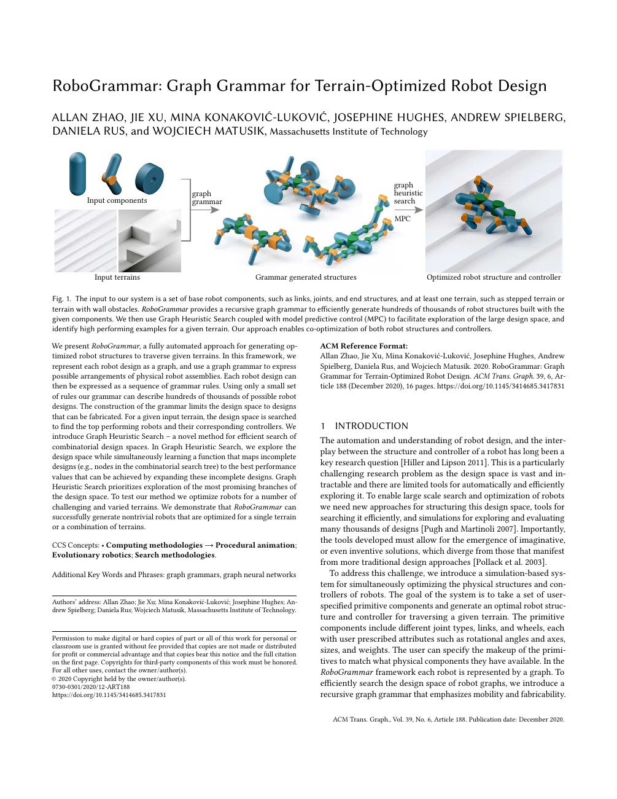 2020 · ACM Transactions on Graphics · C · #46 **[RoboGrammar](https://doi.org/10.1145/3414685.3417831)** Allan Zhao, Jie Xu, Mina Konaković-Luković, Josephine Hughes, Andrew Spielberg, Daniela Rus, Wojciech Matusik 机构：affiliation 未确认 **RoboGrammar：图语法与结构启发式搜索** 公开全文已取得 [Paper](https://doi.org/10.1145/3414685.3417831) · [PDF](https://people.csail.mit.edu/jiex/papers/robogrammar/paper.pdf) · [图源](https://people.csail.mit.edu/jiex/papers/robogrammar/paper.pdf) · [解读](#paper-46) 

中文摘要（展开）

本文提出 RoboGrammar，一种完全自动化的方法，生成针对给定地形优化的机器人结构。在该框架中，我们将每个机器人设计表示为图，并利用图语法表达物理机器人组件的可能排列，每个设计因此可以表示为一系列语法规则。仅使用少量规则，语法就能描述数十万种可能的机器人设计。语法的构造将设计空间限制在能够制造的设计之内。针对给定输入地形，我们搜索设计空间，寻找性能最好的机器人及相应控制器。我们引入图启发式搜索（Graph Heuristic Search），一种高效搜索组合设计空间的新方法。在图启发式搜索中，我们一边探索设计空间，一边学习一个函数，将不完整设计（如组合搜索树中的节点）映射到扩展这些设计所能达到的最佳性能值。该搜索优先探索最有前景的分支。为测试方法，我们针对多种具有挑战性、各不相同的地形优化机器人，展示了 RoboGrammar 能够成功生成针对单一地形或多种地形组合优化的非平凡机器人。

<a href="https://api.crossref.org/works/10.1145%2F3414685.3417831">原摘要来源</a>

 | 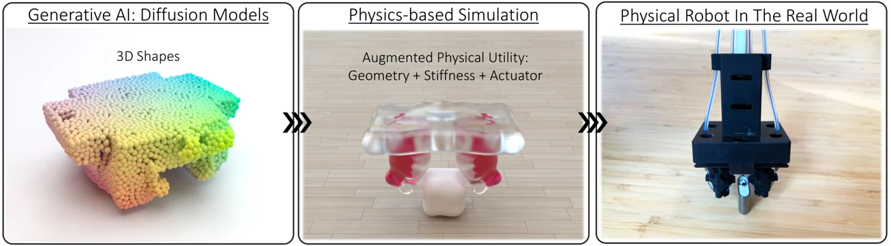 2023 · arXiv 预印本 · C · #47 **[DiffuseBot: Breeding Soft Robots With Physics-Augmented Generative Diffusion Models](https://arxiv.org/abs/2311.17053)** Tsun-Hsuan Wang, Juntian Zheng, Pingchuan Ma, Yilun Du, Byungchul Kim, Andrew Spielberg, Joshua Tenenbaum, Chuang Gan, Daniela Rus 机构：MIT-IBM Watson AI Lab（原文机构栏） **DiffuseBot：扩散生成与物理反馈** 公开全文已取得 [Paper](https://arxiv.org/abs/2311.17053) · [PDF](https://arxiv.org/pdf/2311.17053) · [Project](https://diffusebot.github.io/) · [图源](https://arxiv.org/html/2311.17053v1/teaser_ver1.png) · [解读](#paper-47) 

中文摘要（展开）

自然界演化出在形态与行为智能方面高度复杂的生物，而计算方法在接近这种多样性与效能方面仍然落后。在计算机中协同优化人工生物的形态与控制，有望用于实体软体机器人及虚拟角色创造；但这类方法需要开发新学习算法，能够在纯结构之上推理功能。本文提出 DiffuseBot，一种物理增强扩散模型，生成能够在广泛任务中表现出色的软体机器人形态。DiffuseBot 通过两点弥合虚拟生成内容与物理实用性之间的差距：（i）用物理动力学仿真增强扩散过程，提供性能证明；（ii）引入协同设计过程，利用可微仿真提供的物理敏感性信息，联合优化物理设计与控制。我们展示了一系列仿真及实际制造的机器人与它们的能力。网站：https://diffusebot.github.io/。

<a href="https://arxiv.org/abs/2311.17053">原摘要来源</a>

 | 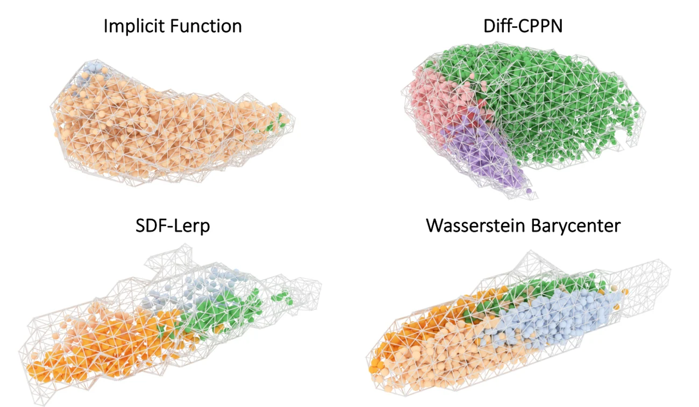 2023 · arXiv 预印本 · C · #48 **[SoftZoo: A Soft Robot Co-design Benchmark For Locomotion In Diverse Environments](https://arxiv.org/abs/2303.09555)** Tsun-Hsuan Wang, Pingchuan Ma, Andrew Everett Spielberg, Zhou Xian, Hao Zhang, Joshua B. Tenenbaum, Daniela Rus, Chuang Gan 机构：MIT-IBM Watson AI Lab（原文机构栏） **SoftZoo：设计与控制的可微基准** 公开全文已取得 [Paper](https://arxiv.org/abs/2303.09555) · [PDF](https://arxiv.org/pdf/2303.09555) · [图源](https://arxiv.org/html/2303.09555v1/shape_visualization.png) · [解读](#paper-48) 

中文摘要（展开）

机器人控制学习虽已取得显著进展，但同时协同优化形态会带来独特挑战。现有工作通常针对特定环境或表示。为更充分理解固有的设计与性能权衡，并加速新型软体机器人的开发，需要一个具备明确任务、环境及评价指标的综合虚拟平台。本文提出 SoftZoo，一种用于多样环境中运动的软体机器人协同设计平台。SoftZoo 支持广泛的自然启发材料，能够仿真平地、沙漠、湿地、黏土、冰、雪、浅水与海洋等环境。此外，它提供快速运动、敏捷转向与路径跟随等软体机器人相关任务，以及用于形态和控制的可微设计表示。这些要素共同构成一个功能丰富的平台，用于分析与开发软体机器人协同设计算法。我们对常见表示和协同设计算法进行基准评估，并阐明：（1）环境、形态与行为之间的相互作用；（2）设计空间表示的重要性；（3）肌肉形成与控制器合成中的歧义；以及（4）可微物理的价值。我们希望 SoftZoo 成为一个标准平台，并为开发新表示和算法、协同设计软体机器人的行为与形态智能提供一种范式。

<a href="https://arxiv.org/abs/2303.09555">原摘要来源</a>

 |
| 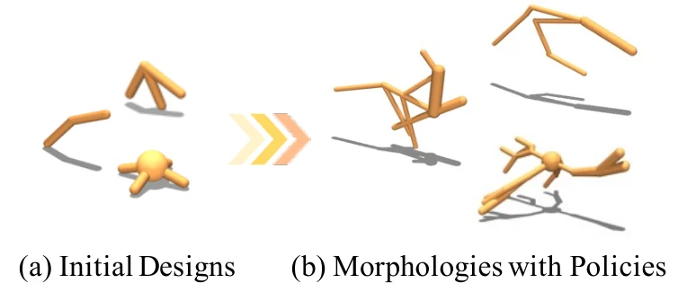 2025 · arXiv 预印本 · C · #49 **[BodyGen: Advancing Towards Efficient Embodiment Co-Design](https://arxiv.org/abs/2503.00533)** Haofei Lu, Zhe Wu, Junliang Xing, Jianshu Li, Ruoyu Li, Zhe Li, Yuanchun Shi 机构：affiliation 未确认 **BodyGen：提高形态—控制联合学习效率** 公开全文已取得 [Paper](https://arxiv.org/abs/2503.00533) · [PDF](https://arxiv.org/pdf/2503.00533) · [Project](https://genesisorigin.github.io) · [图源](https://arxiv.org/html/2503.00533v1/front-teasorv7.png) · [解读](#paper-49) 

中文摘要（展开）

具身协同设计旨在同时优化机器人形态与控制策略。以往工作虽已展示其生成适应环境的机器人的潜力，但由于（i）形态搜索空间的组合性质，以及（ii）形态与控制之间复杂的依赖关系，该领域在优化效率方面仍持续面临挑战。我们证明，低效的形态表示与设计、控制阶段之间不平衡的奖励信号，是效率的关键障碍。为提高具身协同设计效率，我们提出 BodyGen，使用（1）面向拓扑的自注意力机制，同时服务设计与控制，以轻量模型实现高效形态表示；（2）时间信用分配机制，确保优化获得平衡的奖励信号。基于这些发现，Body 相较先进基线实现了平均 60.03% 的性能提升。代码和更多结果：https://genesisorigin.github.io。

<a href="https://arxiv.org/abs/2503.00533">原摘要来源</a>

 | 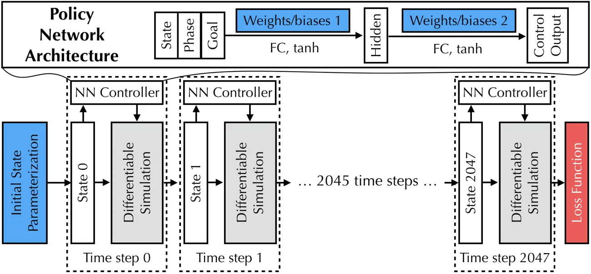 2019 · arXiv 预印本 · C · #50 **[DiffTaichi: Differentiable Programming for Physical Simulation](https://arxiv.org/abs/1910.00935)** Yuanming Hu, Luke Anderson, Tzu-Mao Li, Qi Sun, Nathan Carr, Jonathan Ragan-Kelley, Frédo Durand 机构：affiliation 未确认 **DiffTaichi：物理可微编程基础** 公开全文已取得 [Paper](https://arxiv.org/abs/1910.00935) · [PDF](https://arxiv.org/pdf/1910.00935) · [图源](https://arxiv.org/html/1910.00935v3/figures/net.png) · [解读](#paper-50) 

中文摘要（展开）

本文提出 DiffTaichi，一种专为构建高性能可微物理仿真器而设计的新可微编程语言。DiffTaichi 基于命令式编程语言，通过保持算术强度和并行性的源代码变换，生成仿真步骤的梯度。一个轻量 tape 记录整个仿真程序的结构，并以逆序重放梯度计算核，实现端到端反向传播。我们在十种不同物理仿真器的基于梯度学习与优化任务中，展示该语言的性能与开发效率。例如，用本语言编写的可微弹性物体仿真器，其代码长度是手工编写 CUDA 版本的 1/4.2，运行速度却相同；速度又是 TensorFlow 实现的 188 倍。使用我们的可微程序，神经网络控制器通常只需数十次迭代即可优化。

<a href="https://arxiv.org/abs/1910.00935">原摘要来源</a>

 | 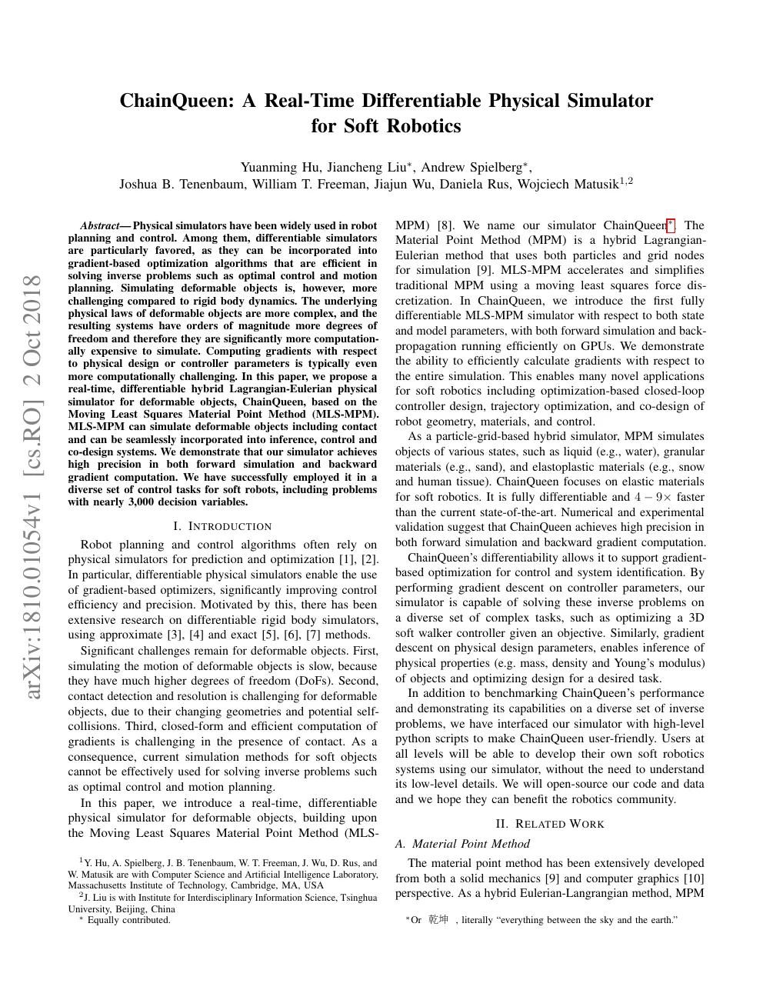 2018 · arXiv 预印本 · C · #51 **[ChainQueen: A Real-Time Differentiable Physical Simulator for Soft Robotics](https://arxiv.org/abs/1810.01054)** Yuanming Hu, Jiancheng Liu, Andrew Spielberg, Joshua B. Tenenbaum, William T. Freeman, Jiajun Wu, Daniela Rus, Wojciech Matusik 机构：affiliation 未确认 **ChainQueen：软体可微物理** 公开全文已取得 [Paper](https://arxiv.org/abs/1810.01054) · [PDF](https://arxiv.org/pdf/1810.01054) · [图源](https://arxiv.org/pdf/1810.01054) · [解读](#paper-51) 

中文摘要（展开）

物理仿真器已广泛用于机器人规划与控制。其中，可微仿真器尤其受到青睐，因为它们可以纳入基于梯度的优化算法，高效解决最优控制、运动规划等逆问题。然而，相较刚体动力学，可变形物体仿真更具挑战。其底层物理规律更复杂，系统自由度高出若干数量级，因此仿真计算成本显著增加。计算关于物理设计或控制器参数的梯度，通常更为困难。本文提出 ChainQueen，一种基于移动最小二乘物质点法（MLS-MPM）的实时、可微拉格朗日—欧拉混合可变形物体物理仿真器。MLS-MPM 可以仿真包含接触的可变形物体，并无缝纳入推断、控制与协同设计系统。我们展示了仿真器在前向仿真与反向梯度计算中均具有高精度，并已将其成功用于多种软体机器人控制任务，包括具有近 3,000 个决策变量的问题。

<a href="https://arxiv.org/abs/1810.01054">原摘要来源</a>

 |

### 逐篇中文要点

每篇把论文事实、证据边界和研究建议分开。`[事实]` 可追溯至链接中的论文或正式题录；`[边界]` 是依据当前读取范围做的证据判断；`[推断]` 是面向 Tool AutoDesign 的研究建议。没有给出实验数字的条目不补造数字。

#### 46. [RoboGrammar](https://doi.org/10.1145/3414685.3417831)

**RoboGrammar：图语法与结构启发式搜索**  ·  C 类  ·  2020  ·  ACM Transactions on Graphics

- **[事实 · 方法]** 图语法规定可制造机器人结构，Graph Heuristic Search 学习部分设计的潜在最优表现并引导组合搜索。
- **[事实 · 证据]** 多个地形上的机器人结构与控制优化；主要针对移动。
- **[边界]** 属于机器人身体形态，不是操作工具论文。
- **[推断 · 对本项目的启发]** 为工具的离散结构语法和候选预算搜索提供可迁移方法。

作者：Allan Zhao, Jie Xu, Mina Konaković-Luković, Josephine Hughes, Andrew Spielberg, Daniela Rus, Wojciech Matusik 
机构：affiliation 未确认 
核验：已取得公开全文（HTML / PDF）；要点以摘要及可核对原文段落为依据。 
正式 / 出版记录 DOI：[10.1145/3414685.3417831](https://doi.org/10.1145/3414685.3417831)。 
[Paper](https://doi.org/10.1145/3414685.3417831) · [PDF](https://people.csail.mit.edu/jiex/papers/robogrammar/paper.pdf) · [图源](https://people.csail.mit.edu/jiex/papers/robogrammar/paper.pdf)

原文图说明与出处

论文 PDF 首页（标题、作者与原文配图）

来源：[论文页面](https://people.csail.mit.edu/jiex/papers/robogrammar/paper.pdf) · [图 / PDF](https://people.csail.mit.edu/jiex/papers/robogrammar/paper.pdf)

#### 47. [DiffuseBot: Breeding Soft Robots With Physics-Augmented Generative Diffusion Models](https://arxiv.org/abs/2311.17053)

**DiffuseBot：扩散生成与物理反馈**  ·  C 类  ·  2023  ·  arXiv 预印本

- **[事实 · 方法]** 将物理动力学和可微物理灵敏度加入扩散生成与设计—控制联合优化。
- **[事实 · 证据]** 报告多类模拟与制造软机器人及其能力。
- **[边界]** 核心对象为软机器人身体，不能把其结果写成任意工具生成验证。
- **[推断 · 对本项目的启发]** 参考生成模型中的物理引导以及几何与材料设计变量。

作者：Tsun-Hsuan Wang, Juntian Zheng, Pingchuan Ma, Yilun Du, Byungchul Kim, Andrew Spielberg, Joshua Tenenbaum, Chuang Gan, Daniela Rus 
机构：MIT-IBM Watson AI Lab（原文机构栏） 
核验：已取得公开全文（HTML / PDF）；要点以摘要及可核对原文段落为依据。 
arXiv 首次上传：2023-11-28；编号 `2311.17053`。 
[Paper](https://arxiv.org/abs/2311.17053) · [PDF](https://arxiv.org/pdf/2311.17053) · [Project](https://diffusebot.github.io/) · [图源](https://arxiv.org/html/2311.17053v1/teaser_ver1.png)

原文图说明与出处

Figure 1 : DiffuseBot aims to augment diffusion models with physical utility and designs for high-level functional specifications including robot geometry, material stiffness, and actuator placement.

来源：[论文页面](https://arxiv.org/html/2311.17053) · [图 / PDF](https://arxiv.org/html/2311.17053v1/teaser_ver1.png)

#### 48. [SoftZoo: A Soft Robot Co-design Benchmark For Locomotion In Diverse Environments](https://arxiv.org/abs/2303.09555)

**SoftZoo：设计与控制的可微基准**  ·  C 类  ·  2023  ·  arXiv 预印本

- **[事实 · 方法]** 在多环境和材料下提供软机器人形态与控制设计表示，并比较 co-design 算法。
- **[事实 · 证据]** 包含平地、湿地、水域等环境的移动、转向与路径任务。
- **[边界]** 任务主体为 locomotion；作为基础设施参考而非工具 benchmark。
- **[推断 · 对本项目的启发]** 复用环境—形态—行为的评价分解，建立工具任务版本。

作者：Tsun-Hsuan Wang, Pingchuan Ma, Andrew Everett Spielberg, Zhou Xian, Hao Zhang, Joshua B. Tenenbaum, Daniela Rus, Chuang Gan 
机构：MIT-IBM Watson AI Lab（原文机构栏） 
核验：已取得公开全文（HTML / PDF）；要点以摘要及可核对原文段落为依据。 
arXiv 首次上传：2023-03-16；编号 `2303.09555`。 
[Paper](https://arxiv.org/abs/2303.09555) · [PDF](https://arxiv.org/pdf/2303.09555) · [图源](https://arxiv.org/html/2303.09555v1/shape_visualization.png)

原文图说明与出处

Table 2: Quantitative comparison of design space representations. Figure 3: Visualization of optimized designs.

来源：[论文页面](https://arxiv.org/html/2303.09555) · [图 / PDF](https://arxiv.org/html/2303.09555v1/shape_visualization.png)

#### 49. [BodyGen: Advancing Towards Efficient Embodiment Co-Design](https://arxiv.org/abs/2503.00533)

**BodyGen：提高形态—控制联合学习效率**  ·  C 类  ·  2025  ·  arXiv 预印本

- **[事实 · 方法]** 用拓扑注意力表征形态，并以 temporal credit assignment 平衡设计和控制阶段的奖励。
- **[事实 · 证据]** 比较 embodiment co-design 的表现与优化效率。
- **[边界]** 操作工具的迁移能力需要另做实验，不能从身体设计直接推出。
- **[推断 · 对本项目的启发]** 用于缓解 designer/controller 的信用分配和训练预算不平衡。

作者：Haofei Lu, Zhe Wu, Junliang Xing, Jianshu Li, Ruoyu Li, Zhe Li, Yuanchun Shi 
机构：affiliation 未确认 
核验：已取得公开全文（HTML / PDF）；要点以摘要及可核对原文段落为依据。 
arXiv 首次上传：2025-03-01；编号 `2503.00533`。 
[Paper](https://arxiv.org/abs/2503.00533) · [PDF](https://arxiv.org/pdf/2503.00533) · [Project](https://genesisorigin.github.io) · [图源](https://arxiv.org/html/2503.00533v1/front-teasorv7.png)

原文图说明与出处

Figure 1: Embodied Agents generated by BodyGen.

来源：[论文页面](https://arxiv.org/html/2503.00533) · [图 / PDF](https://arxiv.org/html/2503.00533v1/front-teasorv7.png)

#### 50. [DiffTaichi: Differentiable Programming for Physical Simulation](https://arxiv.org/abs/1910.00935)

**DiffTaichi：物理可微编程基础**  ·  C 类  ·  2019  ·  arXiv 预印本

- **[事实 · 方法]** 提供适合物理仿真的可微编程与梯度计算机制，支持基于物理的优化。
- **[事实 · 证据]** 原文展示多个物理模拟与控制优化实例。
- **[边界]** 是仿真编程基础设施，未声称工具自动设计系统。
- **[推断 · 对本项目的启发]** 用于连续形态梯度原型，验证有限差分与接触梯度的一致性。

作者：Yuanming Hu, Luke Anderson, Tzu-Mao Li, Qi Sun, Nathan Carr, Jonathan Ragan-Kelley, Frédo Durand 
机构：affiliation 未确认 
核验：已取得公开全文（HTML / PDF）；要点以摘要及可核对原文段落为依据。 
arXiv 首次上传：2019-10-01；编号 `1910.00935`。 
[Paper](https://arxiv.org/abs/1910.00935) · [PDF](https://arxiv.org/pdf/1910.00935) · [图源](https://arxiv.org/html/1910.00935v3/figures/net.png)

原文图说明与出处

Figure 1: Left: Our language allows us to seamlessly integrate a neural network (NN) controller and a physical simulation module, and update the weights of the controller or the initial state parameterization (blue). Our simulations typically have 512 ∼ 2048 512\sim 2048 time steps, and each time step has up to one thousand parallel operations. Right: 10 differentiable simulators built with DiffTaichi.

来源：[论文页面](https://arxiv.org/html/1910.00935) · [图 / PDF](https://arxiv.org/html/1910.00935v3/figures/net.png)

#### 51. [ChainQueen: A Real-Time Differentiable Physical Simulator for Soft Robotics](https://arxiv.org/abs/1810.01054)

**ChainQueen：软体可微物理**  ·  C 类  ·  2018  ·  arXiv 预印本

- **[事实 · 方法]** 以可微材料点方法构建实时软体物理仿真，支持控制、参数辨识与联合设计优化。
- **[事实 · 证据]** 多个软机器人模拟任务验证梯度与优化能力。
- **[边界]** 软体模拟与真实材料仍有差距；不是专用工具生成数据集。
- **[推断 · 对本项目的启发]** 为软工具、颗粒和材料操作提供可微物理组件。

作者：Yuanming Hu, Jiancheng Liu, Andrew Spielberg, Joshua B. Tenenbaum, William T. Freeman, Jiajun Wu, Daniela Rus, Wojciech Matusik 
机构：affiliation 未确认 
核验：已取得公开全文（HTML / PDF）；要点以摘要及可核对原文段落为依据。 
arXiv 首次上传：2018-10-02；编号 `1810.01054`。 
[Paper](https://arxiv.org/abs/1810.01054) · [PDF](https://arxiv.org/pdf/1810.01054) · [图源](https://arxiv.org/pdf/1810.01054)

原文图说明与出处

论文 PDF 首页（标题、作者与原文配图）

来源：[论文页面](https://arxiv.org/pdf/1810.01054) · [图 / PDF](https://arxiv.org/pdf/1810.01054)

## D · 工具使用邻近工作

8 篇。

### 论文卡片

工具使用、选择与执行策略：作为邻近工作。

| 论文 | 论文 | 论文 |
|---|---|---|
| 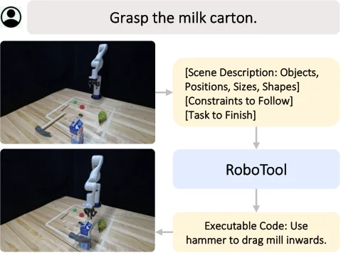 2023 · arXiv 预印本 · D · #52 **[Creative Robot Tool Use with Large Language Models](https://arxiv.org/abs/2310.13065)** Mengdi Xu, Peide Huang, Wenhao Yu, Shiqi Liu, Xilun Zhang, Yaru Niu, Tingnan Zhang, Fei Xia, Jie Tan, Ding Zhao 机构：Carnegie Mellon University（原文机构栏） **RoboTool：LLM 创造性工具使用** 公开全文已取得 [Paper](https://arxiv.org/abs/2310.13065) · [PDF](https://arxiv.org/pdf/2310.13065) · [图源](https://arxiv.org/html/2310.13065v1/overview.png) · [解读](#paper-52) 

中文摘要（展开）

工具使用是高级智能的标志，在动物行为与机器人能力中均有体现。本文研究赋予机器人创造性工具使用能力的可行性，以应对涉及隐含物理约束和长期规划的任务。借助大语言模型（LLM），我们开发 RoboTool，接收自然语言指令，输出可在仿真与真实环境中控制机器人的可执行代码。RoboTool 包含四个关键组成部分：（i）Analyzer，解释自然语言、识别与任务有关的关键概念；（ii）Planner，基于语言输入及关键概念生成完整策略；（iii）Calculator，计算各项技能的参数；（iv）Coder，将这些计划转换为可执行 Python 代码。结果表明，RoboTool 不仅能够理解显式或隐含物理约束与环境因素，还能展示创造性的工具使用。相较依赖显式优化的传统任务与运动规划（TAMP）方法，我们基于 LLM 的系统为复杂机器人任务提供了更灵活、高效且易用的方案。大量实验验证，RoboTool 擅长处理没有创造性工具使用就无法完成的任务，从而拓展机器人系统能力。演示：https://creative-robotool.github.io/。

<a href="https://arxiv.org/abs/2310.13065">原摘要来源</a>

 | 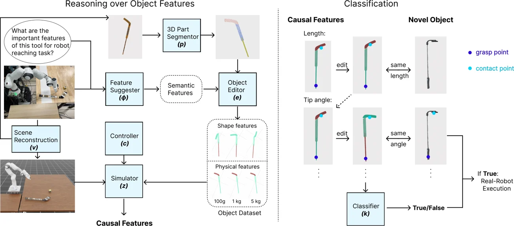 2026 · arXiv 预印本 · D · #53 **[Creative Robot Tool Use by Counterfactual Reasoning](https://arxiv.org/abs/2605.05411)** M. Tuluhan Akbulut, Varun Satheesh, Ahmed Jaafar, Alper Ahmetoglu, Shane Parr, Aditya Ganeshan, Shivam Vats, George Konidaris 机构：affiliation 未确认 **反事实工具扰动识别因果功能** 公开全文已取得 [Paper](https://arxiv.org/abs/2605.05411) · [PDF](https://arxiv.org/pdf/2605.05411) · [图源](https://arxiv.org/html/2605.05411v1/Method2.png) · [解读](#paper-53) 

中文摘要（展开）

我们提出一个面向机器人创造性工具使用的因果推理框架，能够为任务正确识别适用工具，并将其用于主要设计用途之外。框架首先在动力学模型中开展仿真实验，发现工具与任务之间的因果关系。我们将因果发现问题解耦为两个互补部分：基于 VLM 的特征建议，以及通过定向扰动几何和物理特征生成反事实工具。随后，依据识别出的因果特征对新物体分类，并通过以这些特征为条件的关键点匹配迁移工具使用技能。通过在动力学模型中重建任务，本方法使工具使用扎根于问题的物理机制。我们以不同棍棒触及远处物体、使用不同物品从碗中舀取糖果，以及利用不同箱子或板条箱作为垫脚平台从高架取物，展示本方法。与基线的比较表明，识别因果特征并将其关联到物理工具属性，能带来更可靠的工具选择与更强的技能关键点迁移。

<a href="https://arxiv.org/abs/2605.05411">原摘要来源</a>

 | 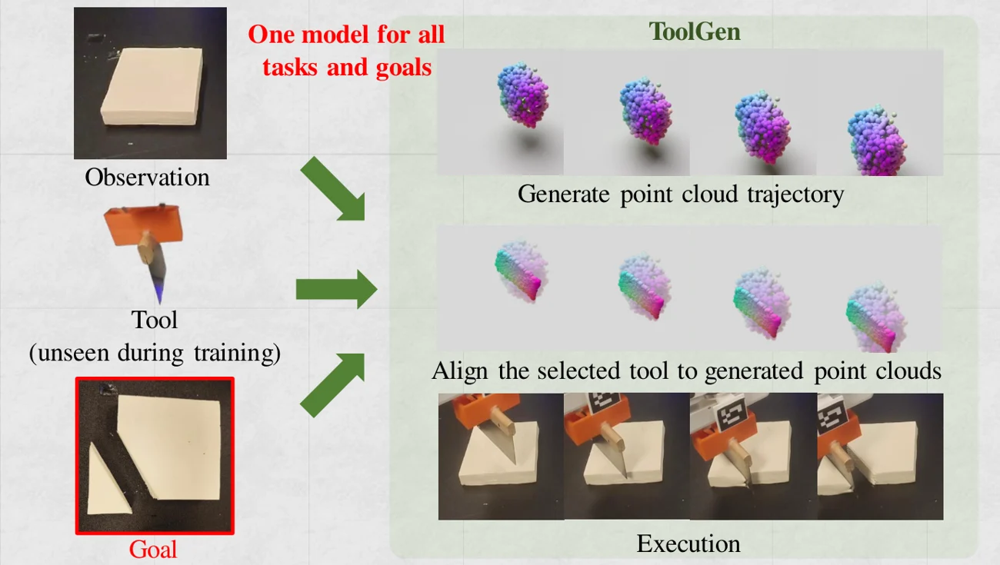 2023 · arXiv 预印本 · D · #54 **[Learning Generalizable Tool-use Skills through Trajectory Generation](https://arxiv.org/abs/2310.00156)** Carl Qi, Yilin Wu, Lifan Yu, Haoyue Liu, Bowen Jiang, Xingyu Lin, David Held 机构：affiliation 未确认 **ToolGen：生成使用轨迹，非工具几何** 公开全文已取得 [Paper](https://arxiv.org/abs/2310.00156) · [PDF](https://arxiv.org/pdf/2310.00156) · [图源](https://arxiv.org/html/2310.00156v5/pull_figure_v3.png) · [解读](#paper-54) 

中文摘要（展开）

能够高效使用工具的自主系统，可以帮助人类完成烹饪、清洁等许多常见任务。然而，当前系统在适应新工具方面，仍未达到人类智能水平。以往基于可供性的方法常对环境作出较强假设，无法扩展到更复杂、接触密集的任务。本文应对这一挑战，探索智能体如何学习使用此前未见的工具操作可变形物体。我们提出学习工具使用轨迹的生成模型，将轨迹表示为工具点云序列，从而泛化到不同工具形状。给定任意新工具，我们先生成工具使用轨迹，再优化工具位姿序列，使其与生成轨迹对齐。我们在四项不同且具有挑战性的可变形物体操作任务上训练单个模型，每项任务只使用一种工具的示范数据。模型能够泛化到多种新工具，显著优于基线。我们进一步在真实世界中用未见工具测试训练策略，获得了与人类相当的性能。补充材料：https://sites.google.com/view/toolgen。

<a href="https://arxiv.org/abs/2310.00156">原摘要来源</a>

 |
| 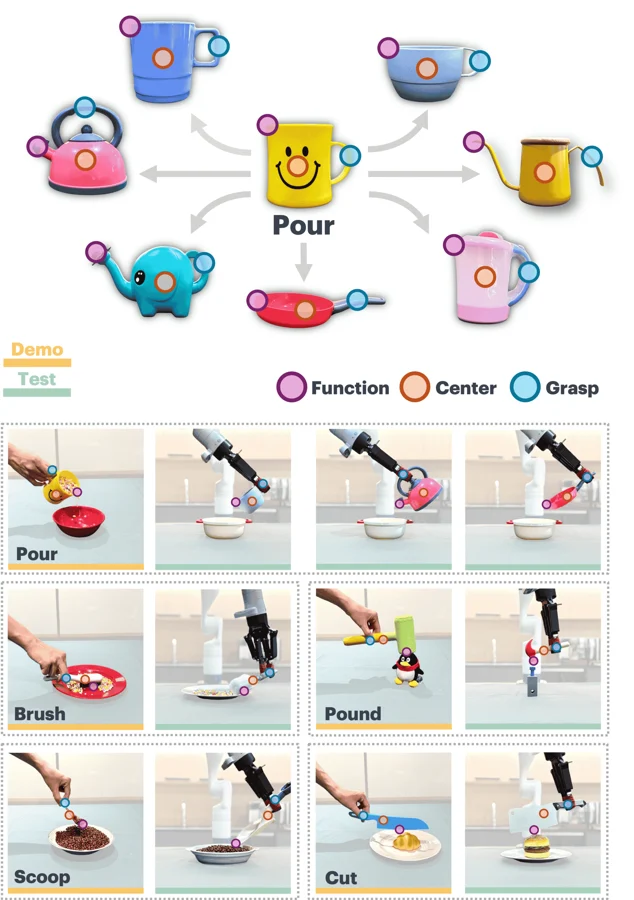 2025 · arXiv 预印本 · D · #55 **[FUNCTO: Function-Centric One-Shot Imitation Learning for Tool Manipulation](https://arxiv.org/abs/2502.11744)** Chao Tang, Anxing Xiao, Yuhong Deng, Tianrun Hu, Wenlong Dong, Hanbo Zhang, David Hsu, Hong Zhang 机构：National University of Singapore（原文机构栏） **FUNCTO：功能条件化单次模仿** 公开全文已取得 [Paper](https://arxiv.org/abs/2502.11744) · [PDF](https://arxiv.org/pdf/2502.11744) · [图源](https://arxiv.org/html/2502.11744v2/imgs/main_figure-5.png) · [解读](#paper-55) 

中文摘要（展开）

从单个人类示范视频中学习工具使用，是一种非常直观且高效的机器人教学方式。人类能够轻松将示范的工具操作技能泛化到支持相同功能的不同工具，例如用马克杯或茶壶倒水，但当前单样本模仿学习（OSIL）方法难以做到这一点。关键挑战是，相同功能的工具可能具有显著几何差异，即功能内变化，因而难以建立示范工具与测试工具的功能对应关系。为解决这一挑战，我们提出 FUNCTO（面向工具操作的功能中心 OSIL），利用 3D 功能关键点表示建立以功能为中心的对应关系，使机器人能够从单个人类示范视频，将工具操作技能泛化到具有显著功能内变化、但功能相同的新工具。基于这一表述，我们将 FUNCTO 分解为三个阶段：（1）功能关键点提取；（2）功能中心对应关系建立；（3）基于功能关键点的动作规划。我们在多种工具操作任务的真实机器人实验中，将 FUNCTO 与现有模块化 OSIL 方法和端到端行为克隆方法比较。结果展示了 FUNCTO 泛化到具有功能内几何变化的新工具时的优势。更多细节：https://sites.google.com/view/functo。

<a href="https://arxiv.org/abs/2502.11744">原摘要来源</a>

 | 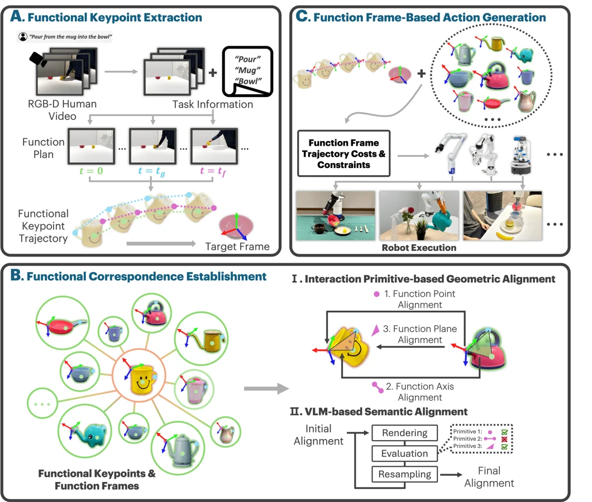 2025 · arXiv 预印本 · D · #56 **[MimicFunc: Imitating Tool Manipulation from a Single Human Video via Functional Correspondence](https://arxiv.org/abs/2508.13534)** Chao Tang, Anxing Xiao, Yuhong Deng, Tianrun Hu, Wenlong Dong, Hanbo Zhang, David Hsu, Hong Zhang 机构：affiliation 未确认 **MimicFunc：视频中的功能对应** 公开全文已取得 [Paper](https://arxiv.org/abs/2508.13534) · [PDF](https://arxiv.org/pdf/2508.13534) · [图源](https://arxiv.org/html/2508.13534v1/imgs/pipeline.png) · [解读](#paper-56) 

中文摘要（展开）

从人类视频模仿工具操作，是一种直观的机器人教学方式，也为视觉运动策略学习提供了有前景且可扩展的替代方案，减少费力的遥操作数据采集。人类只需观察他人完成任务一次，就能模仿工具操作行为，并轻松将技能迁移到不同工具以完成具有等效功能的任务；当前机器人却难以达到这种泛化水平。关键挑战是在功能相似、几何差异显著的工具之间建立功能级对应关系，这类差异称为功能内变化。为解决这一挑战，我们提出 MimicFunc，通过 function frame 建立功能对应关系，以模仿工具操作技能。Function frame 是基于关键点抽象构建、以功能为中心的局部坐标系。实验表明，MimicFunc 能有效使机器人从单个 RGB-D 人类视频，将技能泛化为使用新工具完成具有等效功能的任务。此外，借助 MimicFunc 的单样本泛化能力，生成的执行轨迹可用于训练视觉运动策略，无需针对新物体开展费力的遥操作数据采集。代码与视频：https://sites.google.com/view/mimicfunc。

<a href="https://arxiv.org/abs/2508.13534">原摘要来源</a>

 | 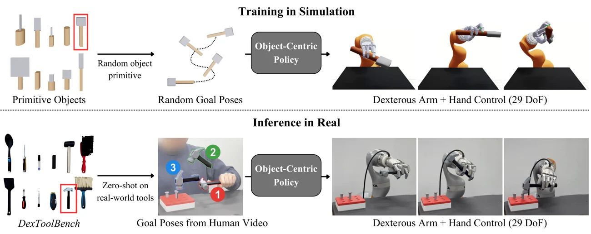 2026 · arXiv 预印本 · D · #57 **[SimToolReal: An Object-Centric Policy for Zero-Shot Dexterous Tool Manipulation](https://arxiv.org/abs/2602.16863)** Kushal Kedia, Tyler Ga Wei Lum, Jeannette Bohg, C. Karen Liu 机构：Stanford University（原文机构栏） **SimToolReal：通用灵巧工具操作** 公开全文已取得 [Paper](https://arxiv.org/abs/2602.16863) · [PDF](https://arxiv.org/pdf/2602.16863) · [图源](https://arxiv.org/html/2602.16863v2/Train_vs_Inference_v19.png) · [解读](#paper-57) 

中文摘要（展开）

操作工具的能力显著拓展机器人能够完成的任务集合。然而，工具操作是一类具有挑战性的灵巧任务，需要抓取细长物体、在手内旋转物体，以及施加较强作用力的交互。这些行为的遥操作数据难以采集，因此仿真到真实强化学习（RL）是一种有前景的替代方案。但以往方法通常需要大量工程工作，为每项任务建模物体并调节奖励函数。本文提出 SimToolReal，推动工具操作中仿真到真实 RL 策略的泛化。我们不聚焦单个物体和任务，而是在仿真中程序化生成大量类似工具的物体原语，并以将每个物体操作到随机目标位姿为通用目标，训练单个 RL 策略。这使 SimToolReal 在测试时无需任何物体或任务专用训练，即可执行通用灵巧工具操作。我们展示了 SimToolReal 相较以往重定向和固定抓取方法，性能提高 37%，同时达到针对特定目标物体和任务训练的专用 RL 策略的性能。最后，我们展示该方法能够泛化到多种日常工具，在覆盖 24 项任务、12 个物体实例和 6 类工具的 120 次真实执行中取得较强零样本性能。

<a href="https://arxiv.org/abs/2602.16863">原摘要来源</a>

 |
| 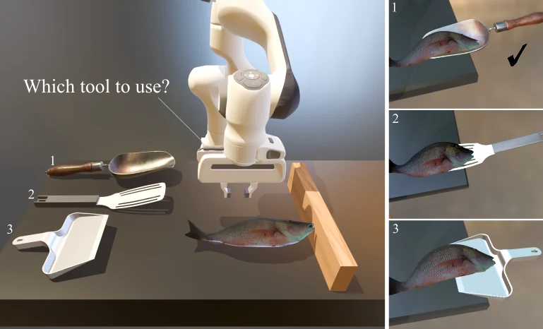 2025 · arXiv 预印本 · D · #58 **[Robustness-Aware Tool Selection and Manipulation Planning with Learned Energy-Informed Guidance](https://arxiv.org/abs/2506.03362)** Yifei Dong, Yan Zhang, Sylvain Calinon, Florian T. Pokorny 机构：KTH（原文机构栏） **抗扰工具选择与接触规划** 公开全文已取得 [Paper](https://arxiv.org/abs/2506.03362) · [PDF](https://arxiv.org/pdf/2506.03362) · [图源](https://arxiv.org/html/2506.03362v2/figures/section_1to6/teaser.png) · [解读](#paper-58) 

中文摘要（展开）

人类会下意识地选择鲁棒的工具及其使用方式，例如用汤勺而非平铲盛肉丸。然而，外部扰动下的鲁棒性在机器人工具使用规划中仍缺乏研究。本文提出一种感知鲁棒性的方法，联合选择工具与规划接触密集的操作轨迹，显式优化对扰动的鲁棒性。其核心是一个基于能量的鲁棒性指标，引导规划器产生鲁棒操作行为。我们构建分层优化流程：首先识别使鲁棒性最优的工具与配置，随后规划在整个执行过程中保持鲁棒性的相应操作轨迹。我们在三项代表性工具使用任务中评估方法。仿真与真实结果表明，本方法能够持续选择鲁棒工具，并生成抵抗扰动的操作计划。

<a href="https://arxiv.org/abs/2506.03362">原摘要来源</a>

 | 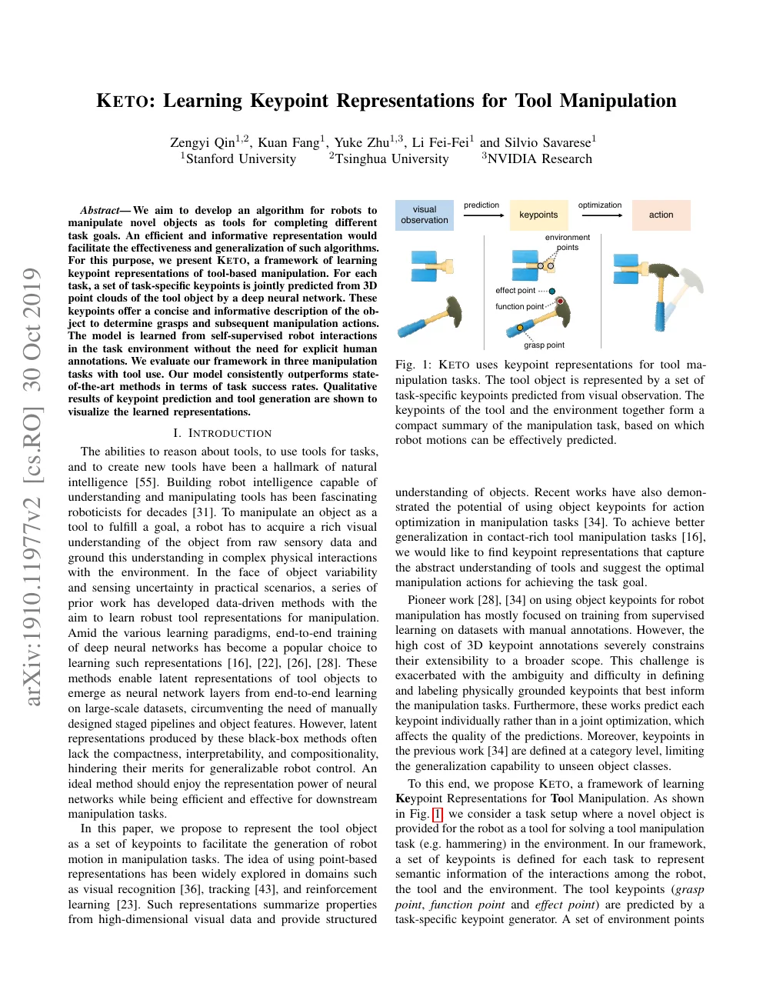 2019 · arXiv 预印本 · D · #59 **[KETO: Learning Keypoint Representations for Tool Manipulation](https://arxiv.org/abs/1910.11977)** Zengyi Qin, Kuan Fang, Yuke Zhu, Li Fei-Fei, Silvio Savarese 机构：affiliation 未确认 **KETO：操作关键点表征** 公开全文已取得 [Paper](https://arxiv.org/abs/1910.11977) · [PDF](https://arxiv.org/pdf/1910.11977) · [图源](https://arxiv.org/pdf/1910.11977) · [解读](#paper-59) 

中文摘要（展开）

我们旨在开发一种算法，使机器人能够将新物体用作工具，完成不同任务目标。高效且信息丰富的表示，有助于提升这类算法的有效性与泛化能力。为此，我们提出 KETO，一个学习工具操作关键点表示的框架。对于每项任务，深度神经网络从工具物体的 3D 点云中联合预测一组任务专用关键点。这些关键点提供简洁且信息丰富的物体描述，用于确定抓取与后续操作动作。模型通过任务环境中的自监督机器人交互学习，无需显式人工标注。我们在三项工具使用操作任务中评估框架，模型的任务成功率持续优于先进方法。我们展示关键点预测与工具生成的定性结果，以可视化学习得到的表示。

<a href="https://arxiv.org/abs/1910.11977">原摘要来源</a>

 |  |

### 逐篇中文要点

每篇把论文事实、证据边界和研究建议分开。`[事实]` 可追溯至链接中的论文或正式题录；`[边界]` 是依据当前读取范围做的证据判断；`[推断]` 是面向 Tool AutoDesign 的研究建议。没有给出实验数字的条目不补造数字。

#### 52. [Creative Robot Tool Use with Large Language Models](https://arxiv.org/abs/2310.13065)

**RoboTool：LLM 创造性工具使用**  ·  D 类  ·  2023  ·  arXiv 预印本

- **[事实 · 方法]** 利用大语言模型进行创造性工具使用，围绕机器人能力约束组织任务推理与操作方案。
- **[事实 · 证据]** 原文报告跨任务工具使用演示和基线比较。
- **[边界]** 核心是现有物体的使用与规划，不是自动生成新的制造几何。
- **[推断 · 对本项目的启发]** 用来界定“选工具/用工具”和“造工具”的研究边界。

作者：Mengdi Xu, Peide Huang, Wenhao Yu, Shiqi Liu, Xilun Zhang, Yaru Niu, Tingnan Zhang, Fei Xia, Jie Tan, Ding Zhao 
机构：Carnegie Mellon University（原文机构栏） 
核验：已取得公开全文（HTML / PDF）；要点以摘要及可核对原文段落为依据。 
arXiv 首次上传：2023-10-19；编号 `2310.13065`。 
[Paper](https://arxiv.org/abs/2310.13065) · [PDF](https://arxiv.org/pdf/2310.13065) · [图源](https://arxiv.org/html/2310.13065v1/overview.png)

原文图说明与出处

(a) RoboTool Overview (b) Creative Tool Use Benchmark Figure 1: (a) Creative robot tool use with Large Language Models (RoboTool). RoboTool takes natural language descriptions as input, including the scene descriptions, environment- and embodiment-related constraints, and tasks. (b) We design a creative tool-use benchmark based on a quadrupedal robot and a robotic arm, including 6 challenging tasks that symbols three types of creative tool-use behaviors.

来源：[论文页面](https://arxiv.org/html/2310.13065) · [图 / PDF](https://arxiv.org/html/2310.13065v1/overview.png)

#### 53. [Creative Robot Tool Use by Counterfactual Reasoning](https://arxiv.org/abs/2605.05411)

**反事实工具扰动识别因果功能**  ·  D 类  ·  2026  ·  arXiv 预印本

- **[事实 · 方法]** VLM 建议特征，在动力学模型中扰动几何与物理属性进行反事实实验，再进行工具选择与关键点迁移。
- **[事实 · 证据]** 长物体够取、不同物品舀糖、箱体作为登高平台等任务。
- **[边界]** 反事实工具生成用于因果分析，不等于将新工具制造部署。
- **[推断 · 对本项目的启发]** 可用作自动设计的因果奖励或特征敏感性分析组件。

作者：M. Tuluhan Akbulut, Varun Satheesh, Ahmed Jaafar, Alper Ahmetoglu, Shane Parr, Aditya Ganeshan, Shivam Vats, George Konidaris 
机构：affiliation 未确认 
核验：已取得公开全文（HTML / PDF）；要点以摘要及可核对原文段落为依据。 
arXiv 首次上传：2026-05-06；编号 `2605.05411`。 
[Paper](https://arxiv.org/abs/2605.05411) · [PDF](https://arxiv.org/pdf/2605.05411) · [图源](https://arxiv.org/html/2605.05411v1/Method2.png)

原文图说明与出处

Fig. 2 : The tool selection pipeline before real-world execution. After finding out the causal features, the source object is morphed to match the dimensions of the target object using the semantic object editor and Chamfer distance as the metric.

来源：[论文页面](https://arxiv.org/html/2605.05411) · [图 / PDF](https://arxiv.org/html/2605.05411v1/Method2.png)

#### 54. [Learning Generalizable Tool-use Skills through Trajectory Generation](https://arxiv.org/abs/2310.00156)

**ToolGen：生成使用轨迹，非工具几何**  ·  D 类  ·  2023  ·  arXiv 预印本

- **[事实 · 方法]** 通过工具使用轨迹生成学习可泛化操作技能。
- **[事实 · 证据]** 原文报告工具与任务变化下的使用评估。
- **[边界]** 优化或生成使用轨迹，未自动设计工具形态。
- **[推断 · 对本项目的启发]** 可作为固定工具执行器，分离几何设计质量与控制质量。

作者：Carl Qi, Yilin Wu, Lifan Yu, Haoyue Liu, Bowen Jiang, Xingyu Lin, David Held 
机构：affiliation 未确认 
核验：已取得公开全文（HTML / PDF）；要点以摘要及可核对原文段落为依据。 
arXiv 首次上传：2023-09-29；编号 `2310.00156`。 
[Paper](https://arxiv.org/abs/2310.00156) · [PDF](https://arxiv.org/pdf/2310.00156) · [图源](https://arxiv.org/html/2310.00156v5/pull_figure_v3.png)

原文图说明与出处

Fig. 1 : Our method ToolGen can solve deformable object manipulation with diverse tasks and goals. It does so by first generating a point cloud trajectory of the desired tool and then aligning the actual tool to the generated point clouds for execution. We train a single model for four different challenging deformable object manipulation tasks. Our model is trained with demonstration data from just a single tool for each task and is able to generalize to various unseen tools.

来源：[论文页面](https://arxiv.org/html/2310.00156) · [图 / PDF](https://arxiv.org/html/2310.00156v5/pull_figure_v3.png)

#### 55. [FUNCTO: Function-Centric One-Shot Imitation Learning for Tool Manipulation](https://arxiv.org/abs/2502.11744)

**FUNCTO：功能条件化单次模仿**  ·  D 类  ·  2025  ·  arXiv 预印本

- **[事实 · 方法]** 以功能表征支持工具操作的 one-shot imitation，跨工具建立功能对应。
- **[事实 · 证据]** 原文评估单次示范下的工具操作迁移。
- **[边界]** 功能对应与技能迁移不等于工具几何生成。
- **[推断 · 对本项目的启发]** 可为新工具提供无需大量重新示教的执行接口。

作者：Chao Tang, Anxing Xiao, Yuhong Deng, Tianrun Hu, Wenlong Dong, Hanbo Zhang, David Hsu, Hong Zhang 
机构：National University of Singapore（原文机构栏） 
核验：已取得公开全文（HTML / PDF）；要点以摘要及可核对原文段落为依据。 
arXiv 首次上传：2025-02-17；编号 `2502.11744`。 
[Paper](https://arxiv.org/abs/2502.11744) · [PDF](https://arxiv.org/pdf/2502.11744) · [图源](https://arxiv.org/html/2502.11744v2/imgs/main_figure-5.png)

原文图说明与出处

Fig. 1: FUNCTO establishes functional correspondences between demonstration and test tools using 3D functional keypoints. With a single human demonstration video, FUNCTO generalizes the demonstrated tool manipulation skill to novel tools, even with significant intra-function geometric variations.

来源：[论文页面](https://arxiv.org/html/2502.11744) · [图 / PDF](https://arxiv.org/html/2502.11744v2/imgs/main_figure-5.png)

#### 56. [MimicFunc: Imitating Tool Manipulation from a Single Human Video via Functional Correspondence](https://arxiv.org/abs/2508.13534)

**MimicFunc：视频中的功能对应**  ·  D 类  ·  2025  ·  arXiv 预印本

- **[事实 · 方法]** 从单段人类视频获取功能对应，以支持机器人模仿不同工具的操作。
- **[事实 · 证据]** 原文展示单视频示范下的工具操作评估。
- **[边界]** 是模仿与执行方法；不将工具替换视为自动制造。
- **[推断 · 对本项目的启发]** 适合降低每个新设计的控制策略获取成本。

作者：Chao Tang, Anxing Xiao, Yuhong Deng, Tianrun Hu, Wenlong Dong, Hanbo Zhang, David Hsu, Hong Zhang 
机构：affiliation 未确认 
核验：已取得公开全文（HTML / PDF）；要点以摘要及可核对原文段落为依据。 
arXiv 首次上传：2025-08-19；编号 `2508.13534`。 
[Paper](https://arxiv.org/abs/2508.13534) · [PDF](https://arxiv.org/pdf/2508.13534) · [图源](https://arxiv.org/html/2508.13534v1/imgs/pipeline.png)

原文图说明与出处

Figure 2: Overview of MimicFunc Pipeline. MimicFunc consists of three stages: (1) Functional keypoint extraction from human video, (2) Functional correspondence establishment with function frame, and (3) Function frame-based action generation.

来源：[论文页面](https://arxiv.org/html/2508.13534) · [图 / PDF](https://arxiv.org/html/2508.13534v1/imgs/pipeline.png)

#### 57. [SimToolReal: An Object-Centric Policy for Zero-Shot Dexterous Tool Manipulation](https://arxiv.org/abs/2602.16863)

**SimToolReal：通用灵巧工具操作**  ·  D 类  ·  2026  ·  arXiv 预印本

- **[事实 · 方法]** 程序化生成工具样式原语训练对象中心 RL 策略，实现未见工具的零样本操作。
- **[事实 · 证据]** 摘要报告 120 次真机 rollout，覆盖 24 个任务、12 个对象和 6 类工具。
- **[边界]** 程序化训练工具不是为任务优化并制造的工具设计输出。
- **[推断 · 对本项目的启发]** 可用于设计与控制解耦评测：固定通用执行策略，改变候选工具。

作者：Kushal Kedia, Tyler Ga Wei Lum, Jeannette Bohg, C. Karen Liu 
机构：Stanford University（原文机构栏） 
核验：已取得公开全文（HTML / PDF）；要点以摘要及可核对原文段落为依据。 
arXiv 首次上传：2026-02-18；编号 `2602.16863`。 
[Paper](https://arxiv.org/abs/2602.16863) · [PDF](https://arxiv.org/pdf/2602.16863) · [图源](https://arxiv.org/html/2602.16863v2/Train_vs_Inference_v19.png)

原文图说明与出处

Fig. 2: Overview of SimToolReal . (Top) Training in Simulation: We train a goal-conditioned RL policy in simulation that manipulates a wide variety of procedurally-generated objects to randomly sampled goal poses. (Bottom) Inference in Real: We deploy this policy zero-shot on real-world tools from DexToolBench , following tool trajectories from human videos.

来源：[论文页面](https://arxiv.org/html/2602.16863) · [图 / PDF](https://arxiv.org/html/2602.16863v2/Train_vs_Inference_v19.png)

#### 58. [Robustness-Aware Tool Selection and Manipulation Planning with Learned Energy-Informed Guidance](https://arxiv.org/abs/2506.03362)

**抗扰工具选择与接触规划**  ·  D 类  ·  2025  ·  arXiv 预印本

- **[事实 · 方法]** 使用 energy-based 鲁棒性度量，在给定候选中选工具与配置，再规划保持鲁棒性的轨迹。
- **[事实 · 证据]** 三类工具使用任务的仿真与真机比较。
- **[边界]** 候选选择不是工具形状自动生成。
- **[推断 · 对本项目的启发]** 可迁移其抗扰度量，作为工具自动设计的评价指标。

作者：Yifei Dong, Yan Zhang, Sylvain Calinon, Florian T. Pokorny 
机构：KTH（原文机构栏） 
核验：已取得公开全文（HTML / PDF）；要点以摘要及可核对原文段落为依据。 
arXiv 首次上传：2025-06-03；编号 `2506.03362`。 
[Paper](https://arxiv.org/abs/2506.03362) · [PDF](https://arxiv.org/pdf/2506.03362) · [图源](https://arxiv.org/html/2506.03362v2/figures/section_1to6/teaser.png)

原文图说明与出处

Fig. 1 : How can the robot choose the best tool to scoop and lift a fish so that it does not fall out of the tool during manipulation? This work introduces a robustness-aware planner that selects and uses tools effectively under disturbances.

来源：[论文页面](https://arxiv.org/html/2506.03362) · [图 / PDF](https://arxiv.org/html/2506.03362v2/figures/section_1to6/teaser.png)

#### 59. [KETO: Learning Keypoint Representations for Tool Manipulation](https://arxiv.org/abs/1910.11977)

**KETO：操作关键点表征**  ·  D 类  ·  2019  ·  arXiv 预印本

- **[事实 · 方法]** 学习用于工具操作的关键点表示，以简化任务功能与操作几何之间的映射。
- **[事实 · 证据]** 原文验证关键点表示对工具操作的作用。
- **[边界]** 研究工具表征与控制，未提供工具制造闭环。
- **[推断 · 对本项目的启发]** 可把设计形态转成任务关键点，减少控制接口复杂度。

作者：Zengyi Qin, Kuan Fang, Yuke Zhu, Li Fei-Fei, Silvio Savarese 
机构：affiliation 未确认 
核验：已取得公开全文（HTML / PDF）；要点以摘要及可核对原文段落为依据。 
arXiv 首次上传：2019-10-26；编号 `1910.11977`。 
[Paper](https://arxiv.org/abs/1910.11977) · [PDF](https://arxiv.org/pdf/1910.11977) · [图源](https://arxiv.org/pdf/1910.11977)

原文图说明与出处

论文 PDF 首页（标题、作者与原文配图）

来源：[论文页面](https://arxiv.org/pdf/1910.11977) · [图 / PDF](https://arxiv.org/pdf/1910.11977)

## E · 综述与认知建模

2 篇。

### 论文卡片

综述与工具发明的认知建模。

| 论文 | 论文 | 论文 |
|---|---|---|
| 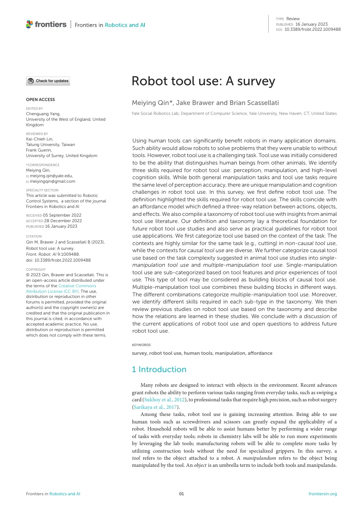 2023 · Frontiers in Robotics and AI · E · #60 **[Robot tool use: A survey](https://doi.org/10.3389/frobt.2022.1009488)** Meiying Qin, Jake Brawer, Brian Scassellati 机构：affiliation 未确认 **机器人工具使用综述** 公开全文已取得 [Paper](https://doi.org/10.3389/frobt.2022.1009488) · [PDF](https://www.frontiersin.org/articles/10.3389/frobt.2022.1009488/pdf) · [图源](https://www.frontiersin.org/articles/10.3389/frobt.2022.1009488/pdf) · [解读](#paper-60) 

中文摘要（展开）

在许多应用领域，使用人类工具能够显著帮助机器人，使其解决没有工具就无法解决的问题。然而，机器人工具使用具有挑战性。工具使用最初被认为是区分人类与其他动物的能力。我们识别出机器人工具使用所需的三种技能：感知、操作与高层认知。一般操作任务与工具使用任务虽需要相同水平的感知准确性，工具使用却具有独特的操作与认知挑战。本综述首先定义机器人工具使用，突出其所需技能。这些技能与一种定义动作、物体和效果三元关系的可供性模型一致。我们还参考动物工具使用文献，构建机器人工具使用分类体系。定义与分类既为未来研究奠定理论基础，也为应用提供实践指南。我们首先根据任务上下文划分工具使用：非因果工具使用中，同类任务（如切割）的上下文高度相似；因果工具使用的上下文则多样。随后，我们依据动物工具使用研究提出的任务复杂度，将因果工具使用进一步划分为单次操作工具使用与多次操作工具使用。单次操作工具使用再根据工具特征和先前工具使用经验细分，这类工具可视为因果工具使用的构件。多次操作工具使用以不同方式组合这些构件，并据不同组合分类。此外，我们识别分类体系中各子类型需要的不同技能。随后依据该分类综述以往机器人工具使用研究，描述这些研究如何学习相关关系。最后，我们讨论机器人工具使用的当前应用，以及未来研究需要解决的开放问题。

<a href="https://api.crossref.org/works/10.3389%2Ffrobt.2022.1009488">原摘要来源</a>

 | 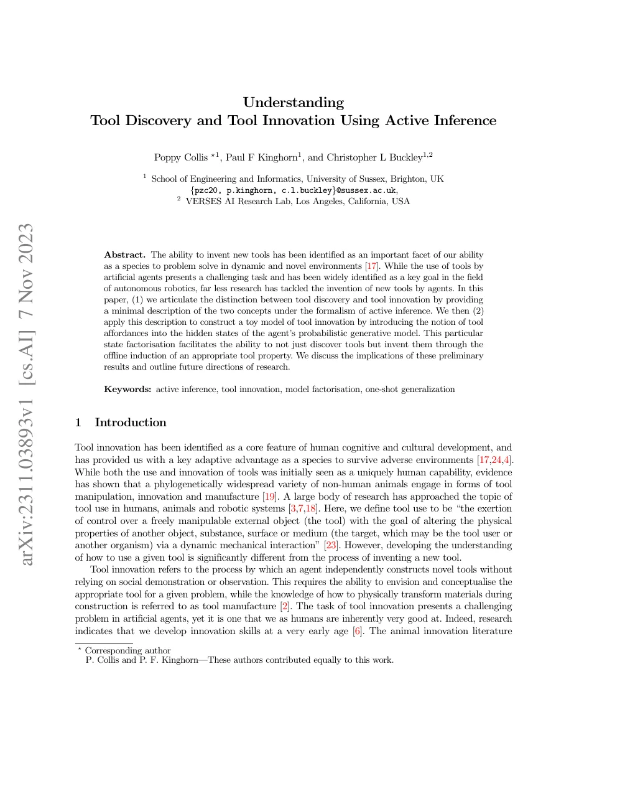 2023 · arXiv 预印本 · E · #61 **[Understanding Tool Discovery and Tool Innovation Using Active Inference](https://arxiv.org/abs/2311.03893)** Poppy Collis, Paul F Kinghorn, Christopher L Buckley 机构：affiliation 未确认 **主动推断视角的工具发现与发明** 公开全文已取得 [Paper](https://arxiv.org/abs/2311.03893) · [PDF](https://arxiv.org/pdf/2311.03893) · [图源](https://arxiv.org/pdf/2311.03893) · [解读](#paper-61) 

中文摘要（展开）

发明新工具的能力，被认为是人类作为一个物种在动态、新颖环境中解决问题能力的重要方面。人工智能体使用工具是一项具有挑战性的任务，也被广泛视为自主机器人领域的关键目标；但针对智能体发明新工具的研究少得多。本文（1）在主动推断形式体系下，为工具发现与工具创新提供最简描述，阐明两个概念的区别；随后（2）利用该描述，将工具可供性概念引入智能体概率生成模型的隐状态，构建一个工具创新玩具模型。这种特定的状态因子分解，使智能体不仅能够发现工具，还能通过离线归纳适当的工具属性发明工具。我们讨论这些初步结果的意义，并概述未来研究方向。

<a href="https://arxiv.org/abs/2311.03893">原摘要来源</a>

 |  |

摘要依据已取得的原始 Abstract 翻译，保留作者的结论强度与实验数字；其中 9 篇使用 OpenAlex 索引摘要，已在卡片和元数据中明确标注来源。译文中的“我们”指论文作者，摘要中的结果为作者报告，未在本仓库复现。摘要译文与下方解读分开，避免把研究建议写成作者结论。

### 逐篇中文要点

每篇把论文事实、证据边界和研究建议分开。`[事实]` 可追溯至链接中的论文或正式题录；`[边界]` 是依据当前读取范围做的证据判断；`[推断]` 是面向 Tool AutoDesign 的研究建议。没有给出实验数字的条目不补造数字。

#### 60. [Robot tool use: A survey](https://doi.org/10.3389/frobt.2022.1009488)

**机器人工具使用综述**  ·  E 类  ·  2023  ·  Frontiers in Robotics and AI

- **[事实 · 方法]** 以感知、操作和高层认知三种能力组织机器人工具使用，并建立 action–object–effect 关系和分类。
- **[事实 · 证据]** 综述提供工具使用分类与领域发展线索；不是新的设计实验。
- **[边界]** 广义工具使用综述，不能替代自动设计的逐篇证据核对。
- **[推断 · 对本项目的启发]** 用于 related work 的定义、研究边界与引用追溯。

作者：Meiying Qin, Jake Brawer, Brian Scassellati 
机构：affiliation 未确认 
核验：已取得公开全文（HTML / PDF）；要点以摘要及可核对原文段落为依据。 
正式 / 出版记录 DOI：[10.3389/frobt.2022.1009488](https://doi.org/10.3389/frobt.2022.1009488)。 
[Paper](https://doi.org/10.3389/frobt.2022.1009488) · [PDF](https://www.frontiersin.org/articles/10.3389/frobt.2022.1009488/pdf) · [图源](https://www.frontiersin.org/articles/10.3389/frobt.2022.1009488/pdf)

原文图说明与出处

论文 PDF 首页（标题、作者与原文配图）

来源：[论文页面](https://www.frontiersin.org/articles/10.3389/frobt.2022.1009488/pdf) · [图 / PDF](https://www.frontiersin.org/articles/10.3389/frobt.2022.1009488/pdf)

#### 61. [Understanding Tool Discovery and Tool Innovation Using Active Inference](https://arxiv.org/abs/2311.03893)

**主动推断视角的工具发现与发明**  ·  E 类  ·  2023  ·  arXiv 预印本

- **[事实 · 方法]** 用 active inference 描述工具发现，并在生成模型的隐变量中加入 affordance 构建工具发明玩具模型。
- **[事实 · 证据]** 原文为初步 toy model 与概念分析。
- **[边界]** 没有据此建立可打印 3D 工具或真机端到端验证。
- **[推断 · 对本项目的启发]** 适合讨论探索、功能认知和离线工具构想，不用来支撑工程性能。

作者：Poppy Collis, Paul F Kinghorn, Christopher L Buckley 
机构：affiliation 未确认 
核验：已取得公开全文（HTML / PDF）；要点以摘要及可核对原文段落为依据。 
arXiv 首次上传：2023-11-07；编号 `2311.03893`。 
[Paper](https://arxiv.org/abs/2311.03893) · [PDF](https://arxiv.org/pdf/2311.03893) · [图源](https://arxiv.org/pdf/2311.03893)

原文图说明与出处

论文 PDF 首页（标题、作者与原文配图）

来源：[论文页面](https://arxiv.org/pdf/2311.03893) · [图 / PDF](https://arxiv.org/pdf/2311.03893)

